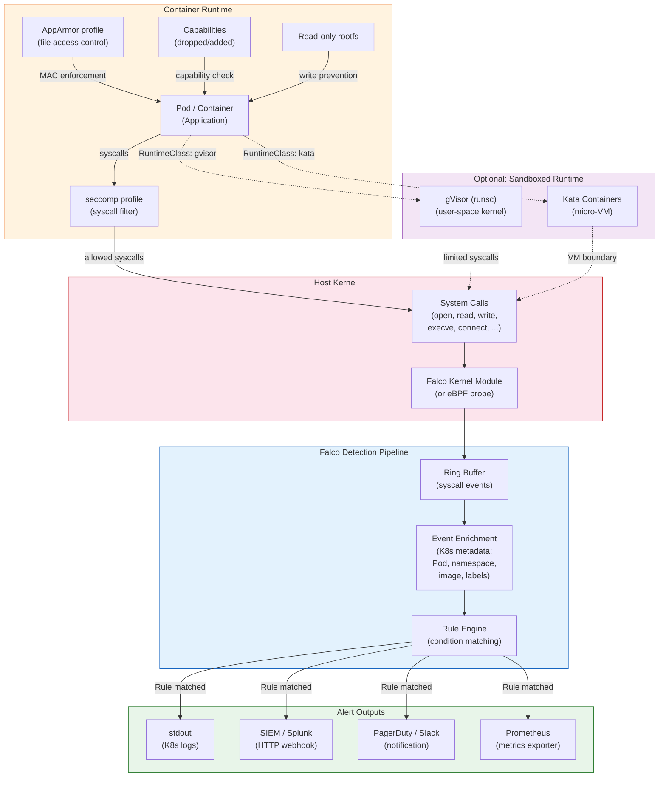

# Runtime Security

## 1. Overview

Runtime security protects Kubernetes workloads during execution -- after images are admitted and containers are running. It is the last line of defense: if a supply chain attack slips through admission controls, if an application vulnerability is exploited, or if a compromised insider deploys malicious code, runtime security detects and contains the threat.

Runtime security operates at three levels: **prevention** (restricting what containers can do before they execute), **detection** (monitoring system calls and behaviors for anomalies), and **isolation** (using sandboxed runtimes to limit the blast radius of a container escape). Prevention includes seccomp profiles, AppArmor policies, security contexts, and Pod Security Standards. Detection is dominated by Falco, which monitors kernel system calls for suspicious activity. Isolation includes gVisor and Kata Containers, which add additional boundaries between containers and the host kernel.

The fundamental principle is **defense in depth**: no single layer catches everything. A container running as non-root with a restrictive seccomp profile, a read-only root filesystem, dropped capabilities, and monitored by Falco is dramatically harder to exploit than a container running as root with no restrictions. Runtime security turns a single exploit into a multi-stage attack that is detectable at each stage.

## 2. Why It Matters

- **Container escapes are real.** CVE-2019-5736 (runc escape) allowed a malicious container to overwrite the host runc binary and gain root access to the host. CVE-2020-15257 (containerd escape) allowed containers with host networking to escalate to host-level access. Without runtime restrictions, a single container vulnerability compromises the entire node.
- **Zero-day defense.** Vulnerability scanners only catch known CVEs. Runtime security detects anomalous behavior regardless of whether the vulnerability is known -- a container suddenly spawning a shell, opening a network connection to an unexpected host, or reading `/etc/shadow` triggers alerts even from a zero-day exploit.
- **Compliance requirements.** CIS Kubernetes Benchmarks, NIST 800-190 (Container Security), and PCI-DSS all require runtime protections: non-root containers, dropped capabilities, read-only filesystems, and syscall filtering. Runtime security provides the evidence trail for these controls.
- **Lateral movement prevention.** If an attacker compromises one container, runtime restrictions limit what they can do: no access to the host filesystem, no ability to mount sensitive volumes, no capability to scan the network. Combined with network policies, runtime security contains the blast radius.
- **Insider threat detection.** A developer with legitimate deployment access could deploy a container that exfiltrates data. Falco rules detect unexpected network connections, file access patterns, and process execution that would indicate data theft, even from an "authorized" container.

## 3. Core Concepts

- **Security Context:** A Pod-level and container-level configuration in Kubernetes that sets security parameters: UID/GID, privilege escalation, capabilities, seccomp profile, SELinux context, and read-only root filesystem. This is the primary mechanism for hardening containers at the Kubernetes API level.
- **Linux Capabilities:** The kernel decomposes root privilege into individual capabilities (CAP_NET_BIND_SERVICE, CAP_SYS_ADMIN, CAP_CHOWN, etc.). Containers by default get a subset of capabilities. Dropping all capabilities and adding only what is needed is the least-privilege approach. CAP_SYS_ADMIN is the most dangerous -- it approximates full root access.
- **Seccomp (Secure Computing Mode):** A Linux kernel feature that filters system calls. A seccomp profile defines which syscalls a process can make. Kubernetes supports three modes: `Unconfined` (no filtering), `RuntimeDefault` (the container runtime's default profile, blocks ~50 dangerous syscalls), and `Localhost` (a custom profile loaded from the node's filesystem).
- **AppArmor:** A Linux Security Module that restricts programs by file path. AppArmor profiles define which files a process can read, write, or execute, and which capabilities it can use. Profiles can be in `enforce` mode (block violations) or `complain` mode (log violations).
- **Falco:** A CNCF incubating project for runtime threat detection. Falco monitors kernel system calls via a kernel module or eBPF probe, evaluates events against a rule engine, and generates alerts. It detects: shell spawning in containers, unexpected network connections, sensitive file reads, privilege escalation attempts, and more.
- **eBPF (extended Berkeley Packet Filter):** A kernel technology that allows programs to run in a sandboxed virtual machine within the kernel. Falco uses eBPF probes to capture system call events without loading a kernel module. eBPF is the modern, preferred approach due to better safety and compatibility.
- **Pod Security Standards (PSS):** Three security profiles built into Kubernetes (Privileged, Baseline, Restricted) that define increasing levels of security hardening. Enforced by the Pod Security Admission controller. The `Restricted` standard requires non-root, read-only root filesystem, dropped capabilities, and seccomp profile.
- **RuntimeClass:** A Kubernetes resource that specifies which container runtime handler to use for a Pod. By default, Pods use the standard runc runtime. RuntimeClass allows selecting sandboxed runtimes like gVisor (runsc) or Kata Containers for stronger isolation.
- **gVisor:** An application kernel developed by Google that intercepts container syscalls and implements them in a user-space kernel. Containers never directly call the host kernel, providing a strong security boundary. Used by Google Cloud Run and GKE Sandbox.
- **Kata Containers:** Lightweight virtual machines that run each container (or Pod) in its own micro-VM with a dedicated kernel. Provides VM-level isolation with container-like performance. Used for running untrusted workloads.
- **Read-Only Root Filesystem:** Setting `readOnlyRootFilesystem: true` in the security context prevents the container from writing to its root filesystem. This blocks many exploit techniques that rely on writing malicious binaries to the filesystem. Applications that need write access use emptyDir volumes or tmpfs mounts for specific paths.
- **Non-Root Containers:** Running containers as a non-root user (UID != 0). This is enforced via `runAsNonRoot: true` and `runAsUser: <uid>` in the security context. Even if a container escape occurs, the attacker does not have root privileges on the host.

## 4. How It Works

### Kubernetes Security Contexts

The security context is the primary API for configuring runtime security:

**Pod-level security context:**

```yaml
apiVersion: v1
kind: Pod
metadata:
  name: hardened-app
spec:
  securityContext:
    runAsNonRoot: true
    runAsUser: 10001
    runAsGroup: 10001
    fsGroup: 10001
    seccompProfile:
      type: RuntimeDefault
  containers:
  - name: app
    image: myapp:v1
    securityContext:
      allowPrivilegeEscalation: false
      readOnlyRootFilesystem: true
      capabilities:
        drop:
        - ALL
        add:
        - NET_BIND_SERVICE    # Only if binding to ports < 1024
    volumeMounts:
    - name: tmp
      mountPath: /tmp
    - name: cache
      mountPath: /var/cache
  volumes:
  - name: tmp
    emptyDir: {}
  - name: cache
    emptyDir:
      medium: Memory    # tmpfs, faster and auto-cleaned
      sizeLimit: 100Mi
```

**Key security context fields:**

| Field | Level | Purpose | Recommended Value |
|---|---|---|---|
| `runAsNonRoot` | Pod/Container | Reject Pods running as root | `true` |
| `runAsUser` | Pod/Container | Set the UID for the container process | Non-zero (e.g., 10001) |
| `runAsGroup` | Pod/Container | Set the GID for the container process | Non-zero (e.g., 10001) |
| `fsGroup` | Pod | Set the GID for mounted volumes | Match `runAsGroup` |
| `allowPrivilegeEscalation` | Container | Prevent `setuid` binaries from escalating | `false` |
| `readOnlyRootFilesystem` | Container | Prevent writes to the root filesystem | `true` |
| `capabilities.drop` | Container | Remove Linux capabilities | `["ALL"]` |
| `capabilities.add` | Container | Add specific capabilities back | Only what is needed |
| `privileged` | Container | Run as privileged (full host access) | `false` (never in production) |
| `seccompProfile.type` | Pod/Container | Set the seccomp profile | `RuntimeDefault` or `Localhost` |

### Seccomp Profiles

**RuntimeDefault profile** blocks approximately 50 dangerous syscalls including `mount`, `reboot`, `kexec_load`, `ptrace`, and `bpf`. This is the recommended minimum for all production workloads.

**Custom seccomp profile (Localhost):**

Create a profile file on the node at `/var/lib/kubelet/seccomp/profiles/my-app.json`:

```json
{
  "defaultAction": "SCMP_ACT_ERRNO",
  "architectures": ["SCMP_ARCH_X86_64"],
  "syscalls": [
    {
      "names": [
        "accept4", "bind", "brk", "chdir", "close", "connect",
        "epoll_create1", "epoll_ctl", "epoll_wait", "execve",
        "exit", "exit_group", "fstat", "futex", "getpid",
        "listen", "lseek", "mmap", "mprotect", "nanosleep",
        "openat", "read", "recvfrom", "rt_sigaction",
        "rt_sigprocmask", "sendto", "set_tid_address",
        "socket", "stat", "write"
      ],
      "action": "SCMP_ACT_ALLOW"
    }
  ]
}
```

**Using a Localhost profile in a Pod:**

```yaml
securityContext:
  seccompProfile:
    type: Localhost
    localhostProfile: profiles/my-app.json
```

**Security Profiles Operator (SPO):** Manages seccomp and AppArmor profiles as Kubernetes CRDs, distributing them to nodes automatically:

```yaml
apiVersion: security-profiles-operator.x-k8s.io/v1beta1
kind: SeccompProfile
metadata:
  name: my-app-profile
  namespace: production
spec:
  defaultAction: SCMP_ACT_ERRNO
  architectures:
  - SCMP_ARCH_X86_64
  syscalls:
  - action: SCMP_ACT_ALLOW
    names:
    - accept4
    - bind
    - read
    - write
    - close
    - openat
    - stat
    - fstat
    - mmap
    # ... allow-listed syscalls
```

**Generating seccomp profiles from observed behavior:**

The Security Profiles Operator can record the syscalls an application actually makes and generate a profile:

```yaml
apiVersion: security-profiles-operator.x-k8s.io/v1alpha1
kind: ProfileRecording
metadata:
  name: record-my-app
  namespace: production
spec:
  kind: SeccompProfile
  recorder: bpf
  podSelector:
    matchLabels:
      app: my-app
```

Run the application under normal load, then extract the generated profile. This produces a least-privilege profile tailored to the specific application.

### AppArmor Profiles

AppArmor provides mandatory access control at the file path level:

```yaml
apiVersion: v1
kind: Pod
metadata:
  name: app
  annotations:
    container.apparmor.security.beta.kubernetes.io/app: localhost/my-app-profile
spec:
  containers:
  - name: app
    image: myapp:v1
```

**Example AppArmor profile (loaded on the node):**

```
#include <tunables/global>

profile my-app-profile flags=(attach_disconnected) {
  #include <abstractions/base>
  #include <abstractions/nameservice>

  # Allow reading application files
  /app/** r,
  /app/bin/myapp ix,

  # Allow writing to specific directories only
  /tmp/** rw,
  /var/log/app/** w,

  # Deny sensitive file access
  deny /etc/shadow r,
  deny /etc/passwd w,
  deny /proc/*/mem r,

  # Network access
  network inet tcp,
  network inet udp,

  # Deny raw sockets (prevents network sniffing)
  deny network raw,
}
```

### Falco Runtime Detection

Falco monitors system calls and generates alerts based on configurable rules:

**Architecture:**

1. **System call capture:** Falco captures every system call using either a kernel module or an eBPF probe. The eBPF probe is preferred -- it does not require loading a kernel module and is compatible with more environments (including managed Kubernetes).
2. **Event enrichment:** Falco enriches raw syscall events with Kubernetes metadata (Pod name, namespace, labels, container image) by querying the Kubernetes API or the container runtime socket.
3. **Rule evaluation:** Events are evaluated against Falco rules that define suspicious patterns. Rules use a condition language with macros and lists for composability.
4. **Alert output:** Alerts are sent to stdout (picked up by Kubernetes logging), syslog, files, gRPC endpoints, or HTTP webhooks (Slack, PagerDuty, SIEM).

**Falco deployment (DaemonSet with eBPF):**

```yaml
apiVersion: apps/v1
kind: DaemonSet
metadata:
  name: falco
  namespace: falco-system
spec:
  selector:
    matchLabels:
      app: falco
  template:
    metadata:
      labels:
        app: falco
    spec:
      serviceAccountName: falco
      tolerations:
      - effect: NoSchedule
        operator: Exists
      containers:
      - name: falco
        image: falcosecurity/falco-no-driver:0.37.1
        args:
        - /usr/bin/falco
        - --cri
        - /run/containerd/containerd.sock
        - -o
        - engine.kind=ebpf
        securityContext:
          privileged: true    # Required for eBPF probe loading
        volumeMounts:
        - name: containerd-sock
          mountPath: /run/containerd/containerd.sock
          readOnly: true
        - name: proc
          mountPath: /host/proc
          readOnly: true
        - name: rules
          mountPath: /etc/falco/rules.d
      volumes:
      - name: containerd-sock
        hostPath:
          path: /run/containerd/containerd.sock
      - name: proc
        hostPath:
          path: /proc
      - name: rules
        configMap:
          name: falco-custom-rules
```

**Falco rules examples:**

```yaml
# Detect shell spawning in a container
- rule: Terminal shell in container
  desc: A shell was opened in a container. This may indicate an intrusion.
  condition: >
    spawned_process and container and
    shell_procs and
    not shell_in_known_containers
  output: >
    Shell spawned in container
    (user=%user.name container=%container.name
     image=%container.image.repository
     namespace=%k8s.ns.name pod=%k8s.pod.name
     shell=%proc.name parent=%proc.pname
     cmdline=%proc.cmdline)
  priority: WARNING
  tags: [container, shell, mitre_execution]

# Detect reading sensitive files
- rule: Read sensitive file in container
  desc: A container process read a sensitive file (e.g., /etc/shadow)
  condition: >
    open_read and container and
    sensitive_files and
    not proc.name in (shadow_utils)
  output: >
    Sensitive file read in container
    (file=%fd.name user=%user.name
     container=%container.name
     image=%container.image.repository
     namespace=%k8s.ns.name pod=%k8s.pod.name)
  priority: CRITICAL
  tags: [container, filesystem, mitre_credential_access]

# Detect unexpected outbound connections
- rule: Unexpected outbound connection
  desc: Container made an outbound connection to an unexpected IP/port
  condition: >
    outbound and container and
    not (fd.sport in (80, 443, 53, 8080, 8443, 5432, 6379)) and
    not k8s.ns.name in (kube-system, monitoring)
  output: >
    Unexpected outbound connection
    (connection=%fd.name container=%container.name
     image=%container.image.repository
     namespace=%k8s.ns.name pod=%k8s.pod.name)
  priority: NOTICE
  tags: [container, network, mitre_command_and_control]

# Detect privilege escalation attempts
- rule: Privilege escalation via setuid
  desc: A process attempted to change its UID, potentially escalating privileges
  condition: >
    evt.type = setuid and container and
    evt.arg.uid = 0
  output: >
    Privilege escalation attempt in container
    (user=%user.name process=%proc.name
     container=%container.name
     namespace=%k8s.ns.name pod=%k8s.pod.name)
  priority: CRITICAL
  tags: [container, privilege_escalation, mitre_privilege_escalation]
```

**Falco macros and lists for reusability:**

```yaml
- macro: container
  condition: container.id != host

- macro: spawned_process
  condition: evt.type = execve and evt.dir = <

- list: shell_procs
  items: [bash, sh, zsh, ksh, csh, dash, fish]

- list: sensitive_files
  items: [/etc/shadow, /etc/sudoers, /root/.ssh/authorized_keys]

- macro: shell_in_known_containers
  condition: >
    (container.image.repository = "bitnami/kubectl" or
     container.image.repository endswith "/debug-tools")
```

### RuntimeClass: Sandboxed Runtimes

**gVisor (runsc):**

```yaml
apiVersion: node.k8s.io/v1
kind: RuntimeClass
metadata:
  name: gvisor
handler: runsc    # Maps to the containerd runtime handler
scheduling:
  nodeSelector:
    gvisor.io/enabled: "true"
---
apiVersion: v1
kind: Pod
metadata:
  name: untrusted-workload
spec:
  runtimeClassName: gvisor
  containers:
  - name: app
    image: untrusted-app:v1
```

gVisor intercepts system calls from the container and re-implements them in its Sentry process (a user-space kernel). The container never directly calls the host kernel. This prevents kernel exploits from affecting the host, at the cost of ~5-15% CPU overhead and reduced syscall compatibility.

**Kata Containers:**

```yaml
apiVersion: node.k8s.io/v1
kind: RuntimeClass
metadata:
  name: kata
handler: kata-qemu
---
apiVersion: v1
kind: Pod
metadata:
  name: isolated-workload
spec:
  runtimeClassName: kata
  containers:
  - name: app
    image: sensitive-app:v1
```

Kata Containers run each Pod in a lightweight virtual machine with its own Linux kernel. The VM boundary provides hardware-enforced isolation. Overhead is higher than gVisor (~20-30ms startup, ~50-100MB memory per Pod) but isolation is stronger.

### Pod Security Standards Enforcement

Combining Pod Security Admission with namespace labels:

```yaml
# Namespace with restricted Pod Security Standard
apiVersion: v1
kind: Namespace
metadata:
  name: production
  labels:
    pod-security.kubernetes.io/enforce: restricted
    pod-security.kubernetes.io/enforce-version: v1.29
    pod-security.kubernetes.io/audit: restricted
    pod-security.kubernetes.io/warn: restricted
```

**What the `restricted` standard requires:**

| Requirement | Field | Required Value |
|---|---|---|
| Non-root user | `runAsNonRoot` | `true` |
| Non-root UID | `runAsUser` | Non-zero |
| Drop all capabilities | `capabilities.drop` | `["ALL"]` |
| No privilege escalation | `allowPrivilegeEscalation` | `false` |
| Seccomp profile | `seccompProfile.type` | `RuntimeDefault` or `Localhost` |
| No hostNetwork | `hostNetwork` | `false` or absent |
| No hostPID | `hostPID` | `false` or absent |
| No hostIPC | `hostIPC` | `false` or absent |
| No privileged containers | `privileged` | `false` or absent |
| Volume types | `volumes[*]` | Only configMap, emptyDir, projected, secret, downwardAPI, persistentVolumeClaim, ephemeral |

**Compliant Pod example:**

```yaml
apiVersion: v1
kind: Pod
metadata:
  name: compliant-app
  namespace: production
spec:
  securityContext:
    runAsNonRoot: true
    runAsUser: 10001
    fsGroup: 10001
    seccompProfile:
      type: RuntimeDefault
  containers:
  - name: app
    image: myapp:v1
    securityContext:
      allowPrivilegeEscalation: false
      readOnlyRootFilesystem: true
      capabilities:
        drop:
        - ALL
    resources:
      requests:
        cpu: 100m
        memory: 128Mi
      limits:
        cpu: 500m
        memory: 512Mi
    ports:
    - containerPort: 8080    # Non-privileged port
    volumeMounts:
    - name: tmp
      mountPath: /tmp
  volumes:
  - name: tmp
    emptyDir: {}
```

## 5. Architecture / Flow



## 6. Types / Variants

### Runtime Security Tools Comparison

| Tool | Approach | Data Source | Strengths | Limitations |
|---|---|---|---|---|
| **Falco** | Rule-based detection | Kernel syscalls (eBPF/module) | Real-time, rich Kubernetes context, large rule library | Requires privileged DaemonSet, rule tuning needed |
| **Tetragon (Cilium)** | eBPF-based enforcement + detection | Kernel (eBPF) | Enforcement (kill process), low overhead, Cilium integration | Cilium CNI recommended, newer project |
| **KubeArmor** | LSM-based enforcement | AppArmor/BPF-LSM/SELinux | Policy enforcement (not just detection), namespace-aware | Requires LSM support on nodes |
| **Sysdig Secure** | Falco-based (commercial) | Kernel syscalls (eBPF) | Managed rules, compliance dashboards, forensics | Commercial product |
| **Aqua Runtime** | eBPF + behavioral profiles | Kernel + image analysis | Automatic profile generation, drift detection | Commercial product |

### Container Runtime Isolation Levels

| Runtime | Isolation Boundary | Overhead | Syscall Compatibility | Use Case |
|---|---|---|---|---|
| **runc (default)** | Linux namespaces + cgroups | None (native) | Full | Trusted workloads, most applications |
| **gVisor (runsc)** | User-space kernel (Sentry) | ~5-15% CPU | ~70% of syscalls | Untrusted code, multi-tenant SaaS |
| **Kata Containers** | Micro-VM (dedicated kernel) | ~20-30ms startup, ~50-100MB RAM | Full (own kernel) | Strongest isolation, regulated workloads |
| **Firecracker** | Micro-VM (Amazon) | ~125ms startup, ~5MB memory | Full (own kernel) | Serverless functions (AWS Lambda, Fargate) |

### Seccomp Profile Modes

| Mode | Description | Blocked Syscalls | Use Case |
|---|---|---|---|
| **Unconfined** | No filtering | None | Never use in production |
| **RuntimeDefault** | Container runtime's default profile | ~50 dangerous syscalls (mount, reboot, ptrace, bpf) | Default for all workloads |
| **Localhost** | Custom profile from node filesystem | User-defined | Applications with specific syscall needs |

### Pod Security Standards by Level

| Check | Privileged | Baseline | Restricted |
|---|---|---|---|
| HostProcess | Allowed | Forbidden | Forbidden |
| Host namespaces | Allowed | Forbidden | Forbidden |
| Privileged containers | Allowed | Forbidden | Forbidden |
| Capabilities | Allowed | Drop NET_RAW only | Drop ALL, add only specific |
| HostPath volumes | Allowed | Forbidden | Forbidden |
| Host ports | Allowed | Forbidden | Forbidden |
| AppArmor | Allowed | Runtime default or confined | Runtime default or confined |
| SELinux | Allowed | MustRunAs (limited types) | MustRunAs (limited types) |
| /proc mount | Allowed | Default | Default |
| Seccomp | Allowed | Allowed | RuntimeDefault or Localhost |
| Sysctls | Allowed | Specific safe set | Specific safe set |
| Run as non-root | Allowed | Allowed | Required |
| Privilege escalation | Allowed | Allowed | Forbidden |

## 7. Use Cases

- **Multi-tenant SaaS with untrusted code execution.** A code execution platform (like GitHub Codespaces or Replit) runs user-submitted code in containers. Each container uses gVisor (via RuntimeClass) for kernel-level isolation, a restrictive seccomp profile allowing only the necessary syscalls, and Falco monitoring for anomalous behavior. The combination ensures that a malicious user cannot escape their container or access other tenants' data.

- **Financial services compliance hardening.** A bank runs all production workloads with the `restricted` Pod Security Standard. Every container runs as non-root, has a read-only root filesystem, drops all capabilities, and uses the RuntimeDefault seccomp profile. Falco rules alert on any attempt to execute a shell in a container, read sensitive files, or make unexpected network connections. Compliance auditors verify these controls via Falco alert logs and Pod Security Admission audit logs.

- **CI/CD pipeline runtime monitoring.** Build Pods that compile untrusted code run with gVisor and custom seccomp profiles that block network access during compilation (preventing dependency confusion attacks). Falco monitors for unexpected processes (cryptominers spawned during build) and alerts the security team.

- **Detecting cryptocurrency miners.** A common post-compromise activity is deploying cryptocurrency miners in compromised containers. Falco detects this through rules matching: high CPU usage processes with mining-related command-line arguments, connections to known mining pool IPs, and processes named `xmrig`, `ccminer`, or similar. Multiple organizations have reported detecting miners within minutes of compromise using Falco.

- **Incident response and forensics.** When Falco detects a shell spawn in a production container, the incident response playbook is triggered: (1) Falco alert fires with full context (Pod, namespace, image, user, command). (2) The security team isolates the Pod by applying a deny-all NetworkPolicy. (3) A forensic snapshot of the container's filesystem is captured. (4) The Pod is terminated and the compromised image is investigated. The Falco timeline provides the exact sequence of attacker actions.

- **Progressive security hardening.** A team migrating legacy applications to Kubernetes starts with `baseline` Pod Security Standard, then incrementally hardens: add `readOnlyRootFilesystem` (fix file writes to use emptyDir), add `runAsNonRoot` (rebuild images with non-root users), drop capabilities (test with `RuntimeDefault` seccomp first), and finally move to `restricted`. Each step is validated in staging before production.

## 8. Tradeoffs

| Decision | Option A | Option B | Guidance |
|---|---|---|---|
| **gVisor vs. Kata Containers** | gVisor: lower memory overhead, no VM | Kata: full syscall compatibility, VM isolation | gVisor for most untrusted workloads; Kata when full Linux compatibility is required |
| **Falco eBPF vs. kernel module** | eBPF: no module loading, better portability | Kernel module: more stable on older kernels, wider syscall coverage | eBPF for all modern kernels (5.8+); kernel module only for legacy systems |
| **RuntimeDefault vs. custom seccomp** | RuntimeDefault: no configuration, good baseline | Custom: precise syscall allowlist, minimum attack surface | Start with RuntimeDefault; move to custom profiles for high-security workloads using Security Profiles Operator recording |
| **Read-only rootfs vs. writable** | Read-only: prevents filesystem-based attacks, catches write assumptions | Writable: simpler application compatibility | Read-only by default; use emptyDir/tmpfs for specific write paths |
| **PSA only vs. PSA + policy engine** | PSA: built-in, no extra components | PSA + Kyverno/Gatekeeper: custom rules, mutation, exceptions | PSA for the baseline; add a policy engine for custom organizational requirements |
| **Detection only vs. enforcement** | Detection (Falco): no impact on workloads, rich alerting | Enforcement (Tetragon/KubeArmor): kill processes, higher risk | Start with detection; add enforcement after tuning rules and confirming no false positives |

## 9. Common Pitfalls

- **Running containers as root.** The most prevalent and dangerous misconfiguration. Official images from Docker Hub often default to root. Always build images with a non-root USER instruction: `RUN adduser -D appuser && USER appuser`. Test images locally with `docker run --user 10001 myimage` to catch root-dependent behavior early.

- **Not dropping ALL capabilities.** The default Docker/containerd capability set includes CAP_CHOWN, CAP_DAC_OVERRIDE, CAP_FOWNER, CAP_SETGID, CAP_SETUID, and others that are rarely needed by application containers. Drop all and explicitly add back only what is required. Most web applications need zero additional capabilities.

- **Using `privileged: true` in production.** A privileged container has full access to the host -- all devices, all capabilities, no seccomp. It is equivalent to running on the host with root access. Only acceptable for specific infrastructure components (CNI plugins, storage drivers) in dedicated system namespaces.

- **Falco alert fatigue.** Default Falco rules are noisy in a typical Kubernetes environment. Tune rules by adding exceptions for known-good behavior (e.g., kubectl exec from authorized users, log rotation processes). Use Falco's priority levels (Emergency, Alert, Critical, Error, Warning, Notice, Info, Debug) and only alert on high-priority events. Log the rest for forensic analysis.

- **Ignoring seccomp entirely.** Without any seccomp profile, containers can make any of the ~300+ Linux syscalls, including dangerous ones like `ptrace`, `mount`, and `bpf`. At minimum, enable `RuntimeDefault` on all workloads. Kubernetes 1.27+ supports setting RuntimeDefault as the cluster-wide default via kubelet configuration.

- **AppArmor/SELinux conflicts with application behavior.** Overly restrictive profiles break applications in subtle ways (permission denied on file operations, network connections failing). Always test profiles in complain/permissive mode before enforce mode. Use the Security Profiles Operator's recording feature to generate accurate profiles from actual application behavior.

- **Not testing security contexts in CI.** A Deployment that works in a permissive namespace fails in a `restricted` namespace. Include security context fields in your Deployment templates and validate them in CI using Kyverno CLI or OPA/Conftest. Do not discover security context issues during production deployment.

- **Overlooking init containers and ephemeral containers.** Security contexts apply per-container. An init container without security restrictions can be exploited during startup. Apply the same security context to all containers in a Pod, including init containers.

## 10. Real-World Examples

- **CVE-2019-5736 (runc container escape).** A malicious container could overwrite the host runc binary, gaining root code execution on the host. This affected every container runtime using runc. Mitigation: seccomp profiles blocking `execve` in specific contexts, read-only host mounts, and upgrading runc. gVisor and Kata Containers were not affected because they do not share the host runc binary. This incident was a catalyst for sandboxed runtime adoption.

- **Tesla cryptocurrency mining incident (2018).** Attackers compromised an unauthenticated Kubernetes dashboard and deployed cryptocurrency miners. The miners ran as root with no resource limits, consuming node CPU. Falco-equivalent detection would have caught: unexpected process execution (mining binary), high CPU system calls, and network connections to mining pool IPs. Post-incident, Tesla deployed runtime monitoring and enforced non-root containers.

- **Google GKE Sandbox (gVisor in production).** Google Cloud offers GKE Sandbox, which runs Pods in gVisor. Used by Cloud Run (serverless), Cloud Functions, and customer workloads processing untrusted data. Google reports that gVisor intercepts and safely handles millions of syscalls per second per node with acceptable latency overhead for most workloads (excluding I/O-intensive applications where the overhead is 2-3x).

- **Shopify Falco deployment.** Shopify runs Falco across their Kubernetes fleet using eBPF probes. Custom rules detect: unauthorized `kubectl exec` sessions, containers making DNS queries to non-corporate resolvers, and processes spawning that are not in the container's image manifest. Alerts route to Splunk for correlation and PagerDuty for high-severity events.

- **US Department of Defense Iron Bank.** The DoD's Platform One initiative requires all container images to pass runtime security controls: non-root, read-only root filesystem, dropped capabilities, and Falco monitoring. Images that do not comply are not admitted to production clusters. The "hardened" container image repository (Iron Bank) provides pre-hardened, signed base images that meet these requirements.

- **Datadog runtime anomaly detection.** Datadog's Cloud Security Management uses eBPF-based runtime monitoring to build behavioral profiles of containers. When a container deviates from its learned profile (e.g., a web server suddenly spawning `curl` to download a binary), an alert fires. This approach reduces false positives compared to static rule-based detection because the baseline is specific to each workload.

## 11. Related Concepts

- [RBAC and Access Control](./01-rbac-and-access-control.md) -- RBAC prevents unauthorized resource access; runtime security prevents unauthorized actions within authorized containers
- [Policy Engines](./02-policy-engines.md) -- Pod Security Standards bridge policy admission and runtime enforcement; Kyverno/Gatekeeper enforce security context requirements
- [Supply Chain Security](./03-supply-chain-security.md) -- image scanning catches known vulnerabilities before runtime; runtime security catches exploitation of unknown vulnerabilities
- [Secrets Management](./04-secrets-management.md) -- runtime protections prevent secrets from being exfiltrated by compromised containers
- [Authentication and Authorization](../../traditional-system-design/09-security/01-authentication-authorization.md) -- identity and access control principles applied to container security
- [API Server and etcd](../01-foundations/03-api-server-and-etcd.md) -- admission controllers enforce security contexts before runtime

## 12. Source Traceability

- source/youtube-video-reports/7.md -- Five pillars of Kubernetes: Security pillar covering Service Accounts, RBAC, and Secrets as foundations for runtime security
- Kubernetes official documentation (kubernetes.io) -- Security context reference, Pod Security Standards, RuntimeClass, seccomp profiles
- Falco project documentation (falco.org) -- Rule engine, eBPF probe architecture, default ruleset, output channels
- CIS Kubernetes Benchmark -- Container runtime controls, Pod security requirements, host-level protections
- NIST SP 800-190 (Application Container Security Guide) -- Container runtime security controls, image hardening, orchestrator configuration
- CVE databases -- CVE-2019-5736 (runc escape), CVE-2020-15257 (containerd escape), CVE-2022-0185 (kernel filesystem escape)
