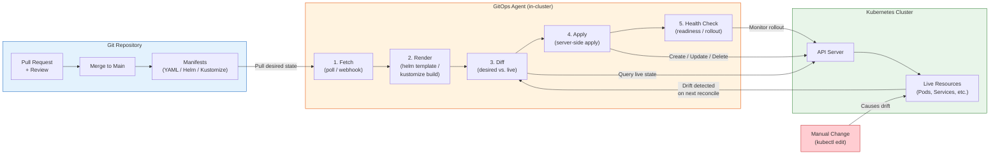

# GitOps and Flux / ArgoCD

## 1. Overview

GitOps is an operational model for Kubernetes where **Git is the single source of truth for declarative infrastructure and application configuration**. Instead of running `kubectl apply` from a laptop or a CI pipeline pushing manifests directly to the cluster, a GitOps agent running inside the cluster continuously pulls desired state from a Git repository and reconciles the cluster to match. When someone changes a manifest in Git, the cluster converges. When someone changes the cluster directly (drift), the agent detects the deviation and corrects it.

The two dominant GitOps implementations for Kubernetes are **ArgoCD** (Intuit, CNCF graduated) and **Flux** (Weaveworks, CNCF graduated). Both follow the same principles but differ substantially in architecture, extensibility, and operational model. ArgoCD provides a rich UI and application-centric abstraction. Flux provides a composable toolkit of Kubernetes controllers that integrate natively with Helm and Kustomize.

GitOps is not just a deployment mechanism -- it is a governance framework. Every change to production is a Git commit with an author, a timestamp, a review trail, and a revert path. This makes compliance auditing trivial and blast radius containment systematic.

## 2. Why It Matters

- **Eliminates imperative deployment scripts.** Traditional CI/CD pipelines use `kubectl apply` or `helm upgrade` in a shell step, which means credentials must be exposed to CI runners, and there is no reconciliation if the deploy step fails midway. GitOps agents run inside the cluster with least-privilege RBAC, eliminating external credential exposure.
- **Continuous drift detection.** Manual changes via `kubectl edit` or ad-hoc patches silently diverge the cluster from the declared state. GitOps agents detect this drift within seconds and either alert or auto-correct, ensuring the cluster always matches what is in Git.
- **Git provides a complete audit trail.** Every production change is a commit with an author, reviewer, timestamp, and diff. This satisfies SOC 2, PCI-DSS, and HIPAA audit requirements without a separate change management system.
- **Rollback is a `git revert`.** If a deployment breaks production, reverting the Git commit triggers the agent to reconcile the cluster back to the previous state. No need to remember which Helm values changed or which kubectl command was run.
- **Multi-cluster consistency.** When managing 10, 50, or 500 clusters, GitOps ensures every cluster converges to the same declared state. Without it, clusters inevitably diverge through manual interventions, making debugging and compliance increasingly difficult.

## 3. Core Concepts

- **Declarative Configuration:** All Kubernetes resources are defined as YAML manifests in Git. There are no imperative steps -- the repository is the complete, self-describing definition of what should exist in the cluster.
- **Versioned and Immutable:** Every change creates a new Git commit. The history of every configuration change is preserved indefinitely. Combined with branch protection and required reviews, this creates a change control process enforced by Git itself.
- **Automatically Applied:** A GitOps agent (ArgoCD or Flux) watches the Git repository and applies changes without human intervention. The agent runs as a Kubernetes Deployment inside the cluster, not as an external CI step.
- **Self-Healing:** When the observed cluster state diverges from the desired state in Git (whether from manual changes, failed partial applies, or controller bugs), the agent reconciles the cluster back to the declared state. This is the Kubernetes reconciliation loop pattern applied to the deployment process itself.
- **Pull-Based Model:** Unlike traditional CI/CD where an external system pushes changes to the cluster (push model), GitOps agents pull desired state from Git. This is a security advantage because the cluster does not need to expose an API endpoint to external CI systems.
- **Application (ArgoCD):** ArgoCD's unit of deployment. An Application resource maps a Git repository path to a Kubernetes namespace and cluster. It tracks sync status, health, and history.
- **Kustomization (Flux):** Flux's unit of deployment. A Kustomization resource points to a path in a GitRepository source and applies the manifests found there. It supports dependency ordering, health checks, and pruning.
- **Sync vs. Reconciliation:** Sync is the act of applying the desired state from Git to the cluster. Reconciliation is the broader loop of detecting drift and re-syncing. ArgoCD distinguishes these explicitly (you can manually sync); Flux reconciles on a timer.
- **Pruning:** When a resource is removed from Git, the GitOps agent should delete it from the cluster. Both ArgoCD and Flux support pruning, but it must be explicitly enabled to avoid accidental deletion of resources not managed by GitOps.
- **Health Assessment:** Beyond sync status (are the manifests applied?), GitOps agents assess resource health (are the Deployments available? are the Pods running?). ArgoCD has built-in health checks for common resource types; Flux uses health check specifications in Kustomization resources.

## 4. How It Works

### The GitOps Reconciliation Loop

The core mechanism is a continuous loop running inside the cluster:

1. **Fetch:** The agent polls the Git repository at a configured interval (default 3-5 minutes, or triggered by a webhook for near-instant sync). It clones or pulls the latest commit from the target branch.
2. **Render:** If the manifests use Helm or Kustomize, the agent renders them into plain Kubernetes YAML. ArgoCD runs `helm template` or `kustomize build` internally. Flux uses dedicated controllers (HelmController, KustomizeController).
3. **Diff:** The agent compares the rendered desired state against the live cluster state (queried from the Kubernetes API server). It identifies resources that need to be created, updated, or deleted.
4. **Apply:** The agent applies the diff to the cluster using server-side apply or three-way merge patches. Resources are created, updated, or pruned as needed.
5. **Health Check:** After applying, the agent monitors the health of affected resources. A Deployment is healthy when `availableReplicas == replicas`. A Pod is healthy when all containers pass readiness probes.
6. **Report:** The agent updates its own status (Application or Kustomization resource) with the sync result, health status, and any errors. This status is visible through the UI (ArgoCD) or Kubernetes API (both).

### ArgoCD Architecture

ArgoCD runs as a set of microservices in a dedicated namespace:

- **argocd-server:** The API server and web UI. Handles user authentication (SSO, OIDC, LDAP), RBAC, and exposes a gRPC/REST API for the CLI and UI.
- **argocd-repo-server:** Clones Git repositories, renders Helm charts and Kustomize overlays, and returns plain manifests. This is a stateless service that can be scaled horizontally. It caches rendered manifests to avoid redundant Git clones.
- **argocd-application-controller:** The core reconciliation engine. Watches Application resources, compares desired state (from repo-server) with live state (from cluster API), and applies diffs. Runs as a StatefulSet for sharding across multiple instances in large deployments.
- **argocd-applicationset-controller:** Generates Application resources from templates. Used for multi-cluster, multi-tenant, and monorepo patterns where you need many similar Applications.
- **argocd-notifications-controller:** Sends notifications (Slack, email, webhook) on sync status changes, health degradation, or errors.
- **argocd-dex-server:** Handles SSO authentication via OIDC, SAML, LDAP, GitHub, GitLab, and other identity providers.

### Flux Architecture

Flux is a set of composable Kubernetes controllers, each managing a specific concern:

- **source-controller:** Manages GitRepository, HelmRepository, OCIRepository, and Bucket sources. Fetches artifacts and stores them as tar archives. Produces a versioned artifact URL consumed by other controllers.
- **kustomize-controller:** Watches Kustomization resources. Fetches rendered manifests from the source-controller, applies Kustomize overlays, and deploys to the cluster. Handles pruning, health checks, and dependency ordering.
- **helm-controller:** Watches HelmRelease resources. Fetches charts from HelmRepository sources, renders them with values, and manages Helm releases. Supports remediation (rollback on failure), test hooks, and drift detection.
- **notification-controller:** Handles inbound webhooks (from Git providers to trigger reconciliation) and outbound notifications (to Slack, Teams, generic webhooks).
- **image-reflector-controller:** Scans container registries for new image tags matching a pattern.
- **image-automation-controller:** Updates Git manifests with new image tags discovered by the reflector, creating automated commits.

### ArgoCD App-of-Apps Pattern

For managing many applications, ArgoCD supports a hierarchical pattern:

```yaml
# Root Application that generates child Applications
apiVersion: argoproj.io/v1alpha1
kind: Application
metadata:
  name: root-app
  namespace: argocd
spec:
  project: default
  source:
    repoURL: https://github.com/org/gitops-repo.git
    targetRevision: main
    path: apps/  # Contains Application manifests for each service
  destination:
    server: https://kubernetes.default.svc
    namespace: argocd
  syncPolicy:
    automated:
      prune: true
      selfHeal: true
```

The `apps/` directory contains individual Application manifests:

```yaml
# apps/payment-service.yaml
apiVersion: argoproj.io/v1alpha1
kind: Application
metadata:
  name: payment-service
  namespace: argocd
  finalizers:
    - resources-finalizer.argocd.argoproj.io
spec:
  project: production
  source:
    repoURL: https://github.com/org/gitops-repo.git
    targetRevision: main
    path: services/payment/overlays/production
  destination:
    server: https://kubernetes.default.svc
    namespace: payment
  syncPolicy:
    automated:
      prune: true
      selfHeal: true
    syncOptions:
      - CreateNamespace=true
    retry:
      limit: 5
      backoff:
        duration: 5s
        factor: 2
        maxDuration: 3m
```

### ArgoCD ApplicationSets for Multi-Cluster

ApplicationSets generate Application resources from templates, ideal for multi-cluster:

```yaml
apiVersion: argoproj.io/v1alpha1
kind: ApplicationSet
metadata:
  name: platform-services
  namespace: argocd
spec:
  generators:
    - clusters:
        selector:
          matchLabels:
            env: production
  template:
    metadata:
      name: '{{name}}-platform'
    spec:
      project: platform
      source:
        repoURL: https://github.com/org/platform-config.git
        targetRevision: main
        path: 'clusters/{{name}}/platform'
      destination:
        server: '{{server}}'
        namespace: platform
      syncPolicy:
        automated:
          selfHeal: true
          prune: true
```

### Flux Multi-Source Deployment

Flux uses Kustomization and HelmRelease CRDs:

```yaml
# GitRepository source
apiVersion: source.toolkit.fluxcd.io/v1
kind: GitRepository
metadata:
  name: app-repo
  namespace: flux-system
spec:
  interval: 5m
  url: https://github.com/org/app-config.git
  ref:
    branch: main
  secretRef:
    name: git-credentials
---
# Kustomization deployment
apiVersion: kustomize.toolkit.fluxcd.io/v1
kind: Kustomization
metadata:
  name: payment-service
  namespace: flux-system
spec:
  interval: 10m
  sourceRef:
    kind: GitRepository
    name: app-repo
  path: ./services/payment/overlays/production
  prune: true
  healthChecks:
    - apiVersion: apps/v1
      kind: Deployment
      name: payment-service
      namespace: payment
  timeout: 5m
  dependsOn:
    - name: infrastructure  # Deploy infra before apps
```

```yaml
# HelmRelease for Helm-based deployments
apiVersion: helm.toolkit.fluxcd.io/v2
kind: HelmRelease
metadata:
  name: redis
  namespace: caching
spec:
  interval: 30m
  chart:
    spec:
      chart: redis
      version: "18.x"
      sourceRef:
        kind: HelmRepository
        name: bitnami
        namespace: flux-system
  values:
    architecture: replication
    replica:
      replicaCount: 3
    auth:
      existingSecret: redis-credentials
  upgrade:
    remediation:
      retries: 3
      remediateLastFailure: true
  rollback:
    cleanupOnFail: true
```

### Drift Detection and Reconciliation

Drift occurs when the live cluster state diverges from the desired state in Git. This happens through manual `kubectl edit` commands, ad-hoc patches, mutating webhooks that modify resources post-apply, or controllers that inject fields (like Istio injecting sidecar containers).

**ArgoCD drift detection:**
- ArgoCD compares live state against the rendered desired state on every refresh cycle (default 3 minutes).
- The comparison uses a three-way diff: last-applied configuration, desired state, and live state.
- ArgoCD supports configurable diff strategies: you can ignore specific fields (like `status`, `metadata.managedFields`), ignore entire resource types, or use a custom diff for specific resources.
- When drift is detected, the Application status shows "OutOfSync." If `selfHeal: true` is enabled, ArgoCD automatically re-applies the desired state. If self-heal is off, it reports the drift and waits for manual sync.

```yaml
# ArgoCD Application with drift management
apiVersion: argoproj.io/v1alpha1
kind: Application
metadata:
  name: payment-service
spec:
  syncPolicy:
    automated:
      selfHeal: true       # Auto-correct drift
      prune: true           # Delete resources removed from Git
    syncOptions:
      - RespectIgnoreDifferences=true
  ignoreDifferences:
    - group: apps
      kind: Deployment
      jsonPointers:
        - /spec/replicas   # Ignore replica count (managed by HPA)
    - group: ""
      kind: Service
      jqPathExpressions:
        - .spec.clusterIP  # Ignore cluster-assigned fields
```

**Flux drift detection:**
- Flux's kustomize-controller computes a hash of the desired state and compares it with the last-applied hash stored as an annotation on the resource.
- On each reconciliation interval, Flux re-applies the desired state regardless of whether drift is detected. This "force-apply" model ensures convergence even if the drift detection mechanism misses a change.
- Flux supports `force: true` in Kustomization specs to overwrite fields owned by other controllers, and `prune: true` to delete orphaned resources.

### ArgoCD Sync Waves and Hooks

Sync waves allow ordering of resource deployment within a single sync operation:

```yaml
# Wave 0: Namespace and RBAC (deployed first)
apiVersion: v1
kind: Namespace
metadata:
  name: payment
  annotations:
    argocd.argoproj.io/sync-wave: "0"
---
# Wave 1: ConfigMaps and Secrets
apiVersion: v1
kind: ConfigMap
metadata:
  name: payment-config
  annotations:
    argocd.argoproj.io/sync-wave: "1"
---
# Wave 2: Database migration Job (sync hook)
apiVersion: batch/v1
kind: Job
metadata:
  name: payment-migrate
  annotations:
    argocd.argoproj.io/hook: PreSync
    argocd.argoproj.io/hook-delete-policy: BeforeHookCreation
---
# Wave 3: Application Deployment
apiVersion: apps/v1
kind: Deployment
metadata:
  name: payment-service
  annotations:
    argocd.argoproj.io/sync-wave: "3"
```

Resources in lower-numbered waves are synced first, and ArgoCD waits for them to be healthy before proceeding to the next wave. Hooks (PreSync, Sync, PostSync) run at specific points in the sync lifecycle -- PreSync hooks run before any wave-0 resources are applied, making them ideal for database migrations that must complete before the new application version starts.

## 5. Architecture / Flow



## 6. Types / Variants

### ArgoCD vs. Flux: Detailed Comparison

| Dimension | ArgoCD | Flux |
|---|---|---|
| **Architecture** | Monolithic set of microservices (server, repo-server, controller) | Composable toolkit of independent controllers |
| **UI** | Rich built-in web UI with application topology visualization, diff view, log streaming | No built-in UI; relies on Weave GitOps (commercial) or Kubernetes Dashboard |
| **CLI** | Full-featured `argocd` CLI for application management | `flux` CLI focused on bootstrap and troubleshooting |
| **RBAC** | Built-in RBAC with projects, roles, and SSO integration | Relies on Kubernetes RBAC; multi-tenancy via namespace scoping |
| **Multi-tenancy** | AppProject resources isolate teams by repo, cluster, and namespace | Namespace-scoped Kustomization and HelmRelease resources with cross-namespace refs |
| **Multi-cluster** | Central ArgoCD manages remote clusters via cluster secrets | Flux runs independently per cluster; multi-cluster via shared Git repo |
| **Helm support** | Renders Helm charts via `helm template`; no Helm release tracking | Native HelmRelease CRD with full lifecycle (install, upgrade, test, rollback) |
| **Kustomize support** | Native Kustomize rendering | Native via kustomize-controller |
| **Sync strategies** | Manual sync, auto-sync, auto-prune, self-heal, sync waves, sync hooks | Auto-reconcile on interval, webhook triggers, dependency ordering |
| **Drift detection** | Continuous comparison; configurable diff strategies; resource exclusions | On reconciliation interval; detects changes via hash comparison |
| **Notifications** | Built-in notification engine (Slack, Teams, email, webhook, GitHub) | notification-controller for inbound webhooks and outbound alerts |
| **Image automation** | ArgoCD Image Updater (separate component) | Built-in image-reflector and image-automation controllers |
| **Secrets** | Integrates with Sealed Secrets, SOPS, Vault via plugins | Native SOPS decryption in kustomize-controller; Vault via external-secrets |
| **Scalability** | Sharded application-controller for large deployments (1000+ apps) | Controller-level scaling; each controller scales independently |
| **CNCF Status** | Graduated (2022) | Graduated (2022) |

### GitOps Repository Patterns

| Pattern | Description | Best For |
|---|---|---|
| **Monorepo** | Single repository contains all application and infrastructure manifests | Small teams, strong coupling between services |
| **Repo-per-app** | Each application has its own GitOps repository | Large organizations, independent team ownership |
| **Repo-per-environment** | Separate repositories for dev, staging, production | Strict environment isolation, different approval workflows |
| **Repo-per-cluster** | One repository per cluster with environment overlays | Multi-cluster with cluster-specific configuration |
| **Config repo + App repos** | Separate configuration repository from application source code | Common pattern; app CI writes image tags to config repo |

### Multi-Cluster GitOps Models

| Model | How It Works | Tradeoff |
|---|---|---|
| **Hub-and-spoke (ArgoCD)** | Central ArgoCD instance manages all clusters | Single pane of glass; central ArgoCD is a single point of failure |
| **Per-cluster agents (Flux)** | Each cluster runs its own Flux instance, pulling from shared Git | No single point of failure; harder to get unified view |
| **Hierarchical** | Central management cluster deploys GitOps agents to workload clusters | Bootstrapping complexity; clean separation of management and workload |

## 7. Use Cases

- **Platform team managing shared infrastructure.** A platform team uses ArgoCD app-of-apps to deploy cert-manager, external-dns, ingress-nginx, monitoring stack, and policy engines across 20 clusters. Each cluster is registered as an ArgoCD cluster secret, and ApplicationSets template the infrastructure stack per cluster with cluster-specific values (domain names, storage classes, node selectors).
- **Multi-tenant SaaS deployment.** Each tenant gets a namespace with specific resource quotas. Flux Kustomization resources deploy the application with tenant-specific ConfigMaps and Secrets. Adding a new tenant means adding a directory to Git with the tenant overlay -- no manual cluster operations required.
- **Regulated environment (PCI, HIPAA).** Every production change requires approval from two reviewers and passes automated policy checks (OPA/Gatekeeper) before merge. The Git history provides a complete, tamper-evident audit trail. ArgoCD sync windows restrict deployments to approved maintenance windows.
- **Disaster recovery.** When a cluster fails, a new cluster is bootstrapped and pointed at the same Git repository. The GitOps agent reconciles the entire state automatically. Recovery time depends on cluster provisioning speed, not on remembering what was deployed.
- **Progressive rollout coordination.** ArgoCD sync waves deploy infrastructure (databases, message queues) before application services. Wave 0 deploys the database migration Job, wave 1 deploys the application Deployment, wave 2 deploys the canary AnalysisTemplate. Each wave waits for the previous to be healthy.

## 8. Tradeoffs

| Decision | Option A | Option B | Guidance |
|---|---|---|---|
| **ArgoCD vs. Flux** | ArgoCD: UI, centralized multi-cluster, SSO | Flux: composable, native Helm lifecycle, no UI dependency | ArgoCD if you need a UI and centralized visibility; Flux if you prefer Kubernetes-native primitives and per-cluster autonomy |
| **Auto-sync vs. manual sync** | Auto: faster delivery, less human intervention | Manual: explicit approval before cluster changes | Auto-sync for dev/staging; manual or auto-sync with sync windows for production |
| **Monorepo vs. multi-repo** | Monorepo: simpler tooling, atomic cross-service changes | Multi-repo: independent ownership, smaller clone times | Monorepo for <20 services; multi-repo for large organizations with independent teams |
| **Pruning enabled vs. disabled** | Enabled: Git is truly the source of truth; removed resources are deleted | Disabled: safer; no accidental deletion from Git mistakes | Enable pruning but use ArgoCD's resource exclusions or Flux's `prune: false` for critical resources like PVCs |
| **Hub-and-spoke vs. per-cluster** | Hub: unified management, single ArgoCD install | Per-cluster: no central dependency, cluster autonomy | Hub for <10 clusters or when unified UI is required; per-cluster for large fleet or strict isolation |
| **Webhook vs. polling** | Webhook: near-instant sync on push | Polling: simpler setup, no inbound network required | Webhook for fast feedback loops; polling for air-gapped or restricted network environments |

## 9. Common Pitfalls

- **Storing secrets in Git without encryption.** Committing plain-text Secrets to Git defeats the security model. Use Sealed Secrets, SOPS, or External Secrets Operator to encrypt secrets before committing. GitOps without secret management is a security liability.
- **Not enabling pruning and accumulating orphaned resources.** Without pruning, deleting a manifest from Git leaves the resource running in the cluster indefinitely. Over time, the cluster accumulates ghost resources consuming capacity and potentially serving stale traffic.
- **Allowing manual changes alongside GitOps.** If operators make manual changes via `kubectl`, the GitOps agent will either overwrite them (self-heal) or the cluster state will diverge from Git (if self-heal is off). Establish a policy: all changes go through Git.
- **Overly broad Git repository permissions.** If every developer can push to the GitOps repo's main branch, you lose the approval workflow. Enforce branch protection, require PR reviews, and use CODEOWNERS files to restrict who can change what.
- **Ignoring sync failures.** A failed sync (e.g., invalid manifest, failed health check) should trigger an alert, not silently retry forever. Configure notifications for sync failures and set retry limits.
- **Running ArgoCD application-controller as a single replica.** For large deployments (500+ applications), a single controller becomes a bottleneck. Use ArgoCD's sharding feature to distribute applications across multiple controller replicas.
- **Not configuring resource exclusions.** Some resources (like Events, EndpointSlices, or resources managed by other controllers) should be excluded from GitOps sync to avoid conflicts and noise.
- **Treating GitOps as only a deployment tool.** GitOps manages the entire cluster state -- not just application Deployments but also RBAC, NetworkPolicies, resource quotas, CRDs, and cluster-scoped resources. Under-utilizing it leaves governance gaps.

## 10. Real-World Examples

- **Intuit (ArgoCD creator):** Built ArgoCD to manage 100+ Kubernetes clusters running their financial products (TurboTax, QuickBooks, Mint). They process 3,000+ deployments per day across clusters. ArgoCD's multi-cluster management was designed for this scale, with the application-controller sharded across replicas to handle thousands of Application resources.
- **Weaveworks (Flux creator):** Developed Flux as the reference implementation of GitOps principles. Their customers include Deutsche Telekom, Fidelity Investments, and SAP. Flux's composable architecture was designed so that organizations could adopt individual controllers (e.g., only helm-controller) without buying into the full toolkit.
- **Walmart:** Uses ArgoCD to manage deployments across their global Kubernetes fleet. Their engineering blog documents managing 6,000+ microservices deployed via GitOps, with ArgoCD ApplicationSets generating Applications for each service across dev, staging, and production clusters.
- **Deutsche Telekom:** Adopted Flux for managing Kubernetes clusters across their European infrastructure. They use Flux's multi-tenancy model with namespace-scoped Kustomizations, allowing each team to manage their own deployments while the platform team controls shared infrastructure.
- **Adobe:** Uses ArgoCD with the app-of-apps pattern to manage their Experience Platform. They deploy to multiple clusters across AWS and Azure, with ApplicationSets templating deployments per cloud provider and region. Their setup processes ~10,000 sync operations per day.

## 11. Related Concepts

- [Deployment Strategies](../03-workload-design/02-deployment-strategies.md) -- rolling updates, blue-green, canary at the Kubernetes Deployment level (complemented by GitOps for the delivery pipeline)
- [Helm and Kustomize](./02-helm-and-kustomize.md) -- the templating and overlay tools that GitOps agents render during sync
- [CI/CD Pipelines](./03-cicd-pipelines.md) -- the build side of the pipeline that produces images and updates the GitOps repository
- [Progressive Delivery](./04-progressive-delivery.md) -- Argo Rollouts and Flagger extend GitOps with canary analysis and traffic shifting
- [Supply Chain Security](../07-security-design/03-supply-chain-security.md) -- image signing and verification integrated into the GitOps pipeline
- [RBAC and Auth](../07-security-design/01-rbac-and-auth.md) -- Kubernetes RBAC that GitOps agents use for least-privilege access

## 12. Source Traceability

- source/extracted/acing-system-design/ch04-a-typical-system-design-interview-flow.md -- Mentions Helm, Skaffold, and infrastructure-as-code concepts that GitOps operationalizes
- source/extracted/system-design-guide/ch17-designing-a-service-like-google-docs.md -- CI/CD pipeline discussion, blue-green and canary deployment context that GitOps automates
- ArgoCD official documentation (argo-cd.readthedocs.io) -- Application, ApplicationSet, sync policies, multi-cluster architecture
- Flux official documentation (fluxcd.io) -- GitOps Toolkit, Kustomization controller, HelmRelease CRD, multi-tenancy model
- CNCF GitOps Working Group -- GitOps Principles v1.0 (opengitops.dev)
