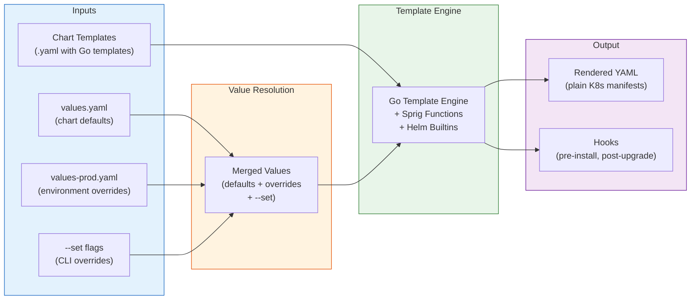
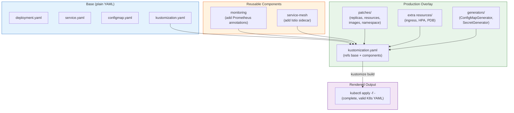

# Helm and Kustomize

## 1. Overview

Helm and Kustomize are the two dominant tools for managing Kubernetes manifests at scale. They solve the same fundamental problem -- **how do you maintain variations of Kubernetes YAML for different environments, teams, and configurations without duplicating entire files** -- but they approach it from opposite directions.

**Helm** is a package manager and template engine. You write charts (packages) with Go templates, and users supply values to render environment-specific manifests. Helm tracks releases (installed instances of a chart) with versioned history, enabling rollbacks. Think of Helm as "parameterized packages with lifecycle management."

**Kustomize** is a template-free overlay engine built into `kubectl`. You start with a base set of plain YAML manifests and layer patches on top for each environment. There are no templates, no variables, no special syntax in the base manifests -- just standard Kubernetes YAML with declarative patches. Think of Kustomize as "structured patching of plain YAML."

Most production Kubernetes environments use both: Helm for third-party software (ingress controllers, monitoring stacks, databases) where charts are maintained by upstream vendors, and Kustomize for in-house applications where teams want to keep manifests readable and Git-diff friendly. Understanding when to use which -- and how to combine them -- is a core competency for Kubernetes platform engineering.

## 2. Why It Matters

- **Environment proliferation creates manifest sprawl.** A single microservice needs slightly different configuration for dev, staging, and production (replica counts, resource limits, feature flags, domain names). Without a management tool, you maintain N copies of nearly identical YAML files that inevitably diverge.
- **Third-party software needs parameterization.** Installing Prometheus, Nginx Ingress, or cert-manager from upstream projects requires a packaging format. Helm charts are the de facto standard -- the Kubernetes equivalent of apt packages or Docker images.
- **GitOps requires rendered manifests.** ArgoCD and Flux need to render desired state from some source. That source is either Helm charts (rendered via `helm template`) or Kustomize overlays (rendered via `kustomize build`). Choosing the right tool affects your GitOps agent configuration, review workflow, and debugging experience.
- **Team velocity depends on reusable abstractions.** Platform teams publish Helm library charts or Kustomize components that encode organizational standards (sidecar injection, standard labels, security contexts). Application teams consume these abstractions without duplicating boilerplate.
- **Debugging production issues requires manifest clarity.** When a Pod is misconfigured, you need to trace the rendered YAML back to its source. Kustomize produces readable diffs. Helm templates can become opaque when deeply nested. The choice affects your incident response speed.

## 3. Core Concepts

### Helm Concepts

- **Chart:** A package of Kubernetes manifests organized in a specific directory structure. A chart contains templates, default values, metadata, and optional dependencies. Charts are versioned and can be published to registries.
- **values.yaml:** The default configuration for a chart. Users override these values per environment using `-f custom-values.yaml` or `--set key=value`. Values cascade: chart defaults < parent chart values < user-supplied files < `--set` flags.
- **Template:** A Kubernetes manifest with Go template directives (`{{ .Values.replicas }}`). Templates access the `.Values` object (user configuration), `.Release` (release metadata), `.Chart` (chart metadata), and `.Capabilities` (cluster API versions).
- **Release:** A running instance of a chart in a cluster. Each release has a name, a namespace, a revision history, and status. `helm upgrade` creates a new revision; `helm rollback` reverts to a previous one.
- **Repository / OCI Registry:** A server that hosts chart packages. Traditional Helm repos serve an `index.yaml` file over HTTP. Modern Helm (3.8+) supports OCI registries (ECR, GCR, GHCR, Harbor) for chart storage, using the same infrastructure as container images.
- **Hook:** A mechanism to run resources at specific points in the release lifecycle (pre-install, post-install, pre-upgrade, post-upgrade, pre-delete, post-delete). Common use: database migrations run as a pre-upgrade Job.
- **Library Chart:** A chart that contains only templates (helpers, partials) and no deployable resources. Application charts depend on library charts to share common template logic (standard labels, security contexts, resource defaults).
- **Dependency:** Charts can declare dependencies on other charts in `Chart.yaml`. Dependencies are fetched and included during packaging or installation.

### Kustomize Concepts

- **Base:** A directory containing a set of plain Kubernetes YAML manifests and a `kustomization.yaml` file that lists them. The base represents the common configuration shared across all environments.
- **Overlay:** A directory that references a base and applies patches to customize it for a specific environment. Overlays can reference other overlays, creating a hierarchy.
- **kustomization.yaml:** The manifest that describes what resources to include, what patches to apply, what transformations to run, and what generators to invoke. This is the entry point for `kustomize build`.
- **Strategic Merge Patch:** A partial YAML document that is merged with the base resource. Only the fields you specify are changed; everything else is preserved. This is the most common patching strategy.
- **JSON Patch (RFC 6902):** An explicit list of add/remove/replace operations on specific JSON paths. More precise than strategic merge patches; required when you need to modify list items by index.
- **Component:** A reusable set of patches and resources that can be included in multiple overlays. Components enable cross-cutting concerns (like adding a sidecar or a monitoring annotation) to be defined once and applied across environments.
- **ConfigMapGenerator / SecretGenerator:** Directives in `kustomization.yaml` that generate ConfigMap or Secret resources from files or literals, automatically appending a content hash to the name. This forces a rolling update when configuration changes, because the Deployment references a new ConfigMap name.
- **Transformer:** Built-in operations that modify resources: `namePrefix`, `nameSuffix`, `commonLabels`, `commonAnnotations`, `namespace`, `images`. These apply transformations across all resources in the kustomization.

## 4. How It Works

### Helm Chart Structure

```
my-chart/
├── Chart.yaml              # Chart metadata (name, version, dependencies)
├── values.yaml             # Default configuration values
├── charts/                 # Dependency charts (vendored)
├── templates/              # Kubernetes manifest templates
│   ├── _helpers.tpl        # Template helpers (named templates)
│   ├── deployment.yaml     # Deployment template
│   ├── service.yaml        # Service template
│   ├── hpa.yaml            # HPA template (conditionally rendered)
│   ├── ingress.yaml        # Ingress template (conditionally rendered)
│   ├── configmap.yaml      # ConfigMap template
│   ├── serviceaccount.yaml # ServiceAccount template
│   ├── NOTES.txt           # Post-install instructions (rendered)
│   └── tests/
│       └── test-connection.yaml  # Helm test Pod
├── .helmignore             # Files to exclude from packaging
└── crds/                   # CRDs installed before templates
```

### Helm Values Hierarchy

Values are merged in this order (later overrides earlier):

```
1. Chart's values.yaml (defaults)
2. Parent chart's values.yaml (for subcharts)
3. User-supplied -f values-staging.yaml
4. User-supplied -f values-secrets.yaml  (later files override earlier)
5. --set and --set-string flags (highest priority)
```

Example values hierarchy for a multi-environment deployment:

```yaml
# values.yaml (defaults)
replicaCount: 1
image:
  repository: myapp
  tag: latest
  pullPolicy: IfNotPresent
resources:
  requests:
    cpu: 100m
    memory: 128Mi
  limits:
    cpu: 500m
    memory: 512Mi
autoscaling:
  enabled: false
ingress:
  enabled: false
```

```yaml
# values-production.yaml (overrides)
replicaCount: 5
image:
  tag: v2.3.1
  pullPolicy: Always
resources:
  requests:
    cpu: 500m
    memory: 512Mi
  limits:
    cpu: "2"
    memory: 2Gi
autoscaling:
  enabled: true
  minReplicas: 5
  maxReplicas: 20
  targetCPUUtilization: 70
ingress:
  enabled: true
  hosts:
    - host: myapp.example.com
      paths:
        - path: /
          pathType: Prefix
  tls:
    - secretName: myapp-tls
      hosts:
        - myapp.example.com
```

### Helm Template Functions and Control Flow

```yaml
# templates/deployment.yaml
apiVersion: apps/v1
kind: Deployment
metadata:
  name: {{ include "myapp.fullname" . }}
  labels:
    {{- include "myapp.labels" . | nindent 4 }}
spec:
  {{- if not .Values.autoscaling.enabled }}
  replicas: {{ .Values.replicaCount }}
  {{- end }}
  selector:
    matchLabels:
      {{- include "myapp.selectorLabels" . | nindent 6 }}
  template:
    metadata:
      annotations:
        checksum/config: {{ include (print $.Template.BasePath "/configmap.yaml") . | sha256sum }}
      labels:
        {{- include "myapp.selectorLabels" . | nindent 8 }}
    spec:
      containers:
        - name: {{ .Chart.Name }}
          image: "{{ .Values.image.repository }}:{{ .Values.image.tag | default .Chart.AppVersion }}"
          ports:
            - name: http
              containerPort: {{ .Values.service.port }}
          {{- with .Values.resources }}
          resources:
            {{- toYaml . | nindent 12 }}
          {{- end }}
          {{- if .Values.env }}
          env:
            {{- range $key, $value := .Values.env }}
            - name: {{ $key }}
              value: {{ $value | quote }}
            {{- end }}
          {{- end }}
```

### Helm Hooks

Hooks run resources at specific lifecycle points:

```yaml
# templates/db-migration.yaml
apiVersion: batch/v1
kind: Job
metadata:
  name: {{ include "myapp.fullname" . }}-migrate
  annotations:
    "helm.sh/hook": pre-upgrade,pre-install
    "helm.sh/hook-weight": "-5"        # Lower weight runs first
    "helm.sh/hook-delete-policy": before-hook-creation
spec:
  template:
    spec:
      restartPolicy: Never
      containers:
        - name: migrate
          image: "{{ .Values.image.repository }}:{{ .Values.image.tag }}"
          command: ["./migrate", "--direction", "up"]
          env:
            - name: DATABASE_URL
              valueFrom:
                secretKeyRef:
                  name: {{ include "myapp.fullname" . }}-db
                  key: url
  backoffLimit: 3
```

### Helm Library Charts

Library charts share common templates across multiple application charts:

```yaml
# library-chart/templates/_deployment.tpl
{{- define "common.deployment" -}}
apiVersion: apps/v1
kind: Deployment
metadata:
  name: {{ include "common.fullname" . }}
  labels:
    {{- include "common.labels" . | nindent 4 }}
    app.kubernetes.io/managed-by: platform-team
spec:
  selector:
    matchLabels:
      {{- include "common.selectorLabels" . | nindent 6 }}
  template:
    metadata:
      labels:
        {{- include "common.selectorLabels" . | nindent 8 }}
    spec:
      securityContext:
        runAsNonRoot: true
        seccompProfile:
          type: RuntimeDefault
      containers:
        - name: {{ .Chart.Name }}
          securityContext:
            allowPrivilegeEscalation: false
            capabilities:
              drop: ["ALL"]
          {{- with .Values.resources }}
          resources:
            {{- toYaml . | nindent 12 }}
          {{- end }}
{{- end -}}
```

Application charts depend on the library chart in `Chart.yaml`:

```yaml
# app-chart/Chart.yaml
apiVersion: v2
name: payment-service
version: 1.0.0
dependencies:
  - name: common-library
    version: 2.x.x
    repository: oci://registry.example.com/charts
```

### Kustomize Base and Overlay Structure

```
app/
├── base/
│   ├── kustomization.yaml
│   ├── deployment.yaml
│   ├── service.yaml
│   └── configmap.yaml
└── overlays/
    ├── dev/
    │   ├── kustomization.yaml
    │   └── patch-replicas.yaml
    ├── staging/
    │   ├── kustomization.yaml
    │   ├── patch-replicas.yaml
    │   └── patch-resources.yaml
    └── production/
        ├── kustomization.yaml
        ├── patch-replicas.yaml
        ├── patch-resources.yaml
        ├── patch-hpa.yaml
        └── ingress.yaml
```

### Kustomize Base

```yaml
# base/kustomization.yaml
apiVersion: kustomize.config.k8s.io/v1beta1
kind: Kustomization
resources:
  - deployment.yaml
  - service.yaml
  - configmap.yaml
commonLabels:
  app.kubernetes.io/name: payment-service
  app.kubernetes.io/part-of: platform
```

```yaml
# base/deployment.yaml (plain YAML, no templates)
apiVersion: apps/v1
kind: Deployment
metadata:
  name: payment-service
spec:
  replicas: 1
  selector:
    matchLabels:
      app: payment-service
  template:
    metadata:
      labels:
        app: payment-service
    spec:
      containers:
        - name: payment-service
          image: payment-service:latest
          ports:
            - containerPort: 8080
          resources:
            requests:
              cpu: 100m
              memory: 128Mi
            limits:
              cpu: 500m
              memory: 512Mi
```

### Kustomize Overlay with Strategic Merge Patch

```yaml
# overlays/production/kustomization.yaml
apiVersion: kustomize.config.k8s.io/v1beta1
kind: Kustomization
namespace: production
resources:
  - ../../base
  - ingress.yaml              # Additional resource for production only
patches:
  - path: patch-replicas.yaml
  - path: patch-resources.yaml
  - path: patch-hpa.yaml
images:
  - name: payment-service
    newName: registry.example.com/payment-service
    newTag: v2.3.1
configMapGenerator:
  - name: payment-config
    behavior: merge
    literals:
      - LOG_LEVEL=warn
      - ENVIRONMENT=production
```

```yaml
# overlays/production/patch-replicas.yaml (strategic merge patch)
apiVersion: apps/v1
kind: Deployment
metadata:
  name: payment-service
spec:
  replicas: 5
  template:
    spec:
      containers:
        - name: payment-service
          resources:
            requests:
              cpu: 500m
              memory: 512Mi
            limits:
              cpu: "2"
              memory: 2Gi
```

### Kustomize JSON Patch

```yaml
# overlays/production/kustomization.yaml (using JSON patch)
patches:
  - target:
      kind: Deployment
      name: payment-service
    patch: |-
      - op: add
        path: /spec/template/spec/containers/0/env/-
        value:
          name: ENABLE_TRACING
          value: "true"
      - op: replace
        path: /spec/template/spec/containers/0/livenessProbe/initialDelaySeconds
        value: 30
```

### Kustomize Components

Components are reusable patches applicable across overlays:

```yaml
# components/monitoring/kustomization.yaml
apiVersion: kustomize.config.k8s.io/v1alpha1
kind: Component
patches:
  - target:
      kind: Deployment
    patch: |-
      apiVersion: apps/v1
      kind: Deployment
      metadata:
        name: not-important
      spec:
        template:
          metadata:
            annotations:
              prometheus.io/scrape: "true"
              prometheus.io/port: "9090"
              prometheus.io/path: "/metrics"
```

```yaml
# overlays/production/kustomization.yaml
components:
  - ../../components/monitoring
  - ../../components/istio-sidecar
```

### ConfigMapGenerator with Content Hash

```yaml
# kustomization.yaml
configMapGenerator:
  - name: app-config
    files:
      - config.json
    options:
      disableNameSuffixHash: false  # Default: hash suffix enabled
```

This generates a ConfigMap named `app-config-8h2d9k` where the suffix is a hash of the content. When `config.json` changes, the suffix changes, which updates the Deployment's ConfigMap reference, triggering a rolling update. This is a significant advantage over plain ConfigMaps, where changes do not trigger Pod restarts.

### Helmfile for Multi-Chart Orchestration

Helmfile manages multiple Helm releases declaratively:

```yaml
# helmfile.yaml
environments:
  production:
    values:
      - environments/production.yaml
  staging:
    values:
      - environments/staging.yaml

repositories:
  - name: bitnami
    url: https://charts.bitnami.com/bitnami
  - name: ingress-nginx
    url: https://kubernetes.github.io/ingress-nginx
  - name: jetstack
    url: https://charts.jetstack.io

releases:
  - name: cert-manager
    namespace: cert-manager
    chart: jetstack/cert-manager
    version: 1.14.x
    values:
      - values/cert-manager/common.yaml
      - values/cert-manager/{{ .Environment.Name }}.yaml
    hooks:
      - events: ["presync"]
        command: kubectl
        args: ["apply", "-f", "crds/cert-manager.yaml"]

  - name: ingress-nginx
    namespace: ingress-nginx
    chart: ingress-nginx/ingress-nginx
    version: 4.10.x
    needs:
      - cert-manager/cert-manager  # Dependency ordering
    values:
      - values/ingress-nginx/common.yaml
      - values/ingress-nginx/{{ .Environment.Name }}.yaml

  - name: redis
    namespace: caching
    chart: bitnami/redis
    version: 18.x
    values:
      - values/redis/common.yaml
      - values/redis/{{ .Environment.Name }}.yaml
```

## 5. Architecture / Flow

### Helm Template Rendering Pipeline



### Kustomize Overlay Composition



## 6. Types / Variants

### Helm vs. Kustomize Decision Framework

| Factor | Helm | Kustomize |
|---|---|---|
| **Third-party software** | Preferred -- upstream charts are the packaging standard | Possible but you must maintain base manifests yourself |
| **In-house applications** | Works, but templates can become complex and hard to review | Preferred -- plain YAML bases are readable and Git-diff friendly |
| **Environment variations** | Values files per environment; conditional logic in templates | Overlays per environment; patches are explicit and auditable |
| **Release lifecycle** | Built-in: install, upgrade, rollback, uninstall, test | None -- Kustomize renders YAML; lifecycle is managed by kubectl or GitOps |
| **Learning curve** | Steeper -- Go templates, Sprig functions, Helm-specific conventions | Gentler -- standard YAML with a small set of patch strategies |
| **Debugging** | `helm template` to inspect; errors can be cryptic with nested templates | `kustomize build` to inspect; errors are usually about missing resources |
| **Composability** | Dependencies in Chart.yaml; library charts for shared templates | Bases, overlays, and components for hierarchical composition |
| **GitOps integration** | ArgoCD renders with `helm template`; Flux uses native HelmRelease | Both ArgoCD and Flux support Kustomize natively |
| **Secret management** | Helm-secrets plugin for SOPS decryption | Flux kustomize-controller decrypts SOPS natively |

### Helm Chart Types

| Type | Has Templates | Has Resources | Use Case |
|---|---|---|---|
| **Application chart** | Yes | Yes | Deploy a specific application (nginx, prometheus, your-app) |
| **Library chart** | Yes (helpers only) | No | Shared template logic consumed by application charts |
| **Umbrella chart** | Minimal | Via dependencies | Orchestrate multiple subcharts as a single release |

### Kustomize Patch Strategies

| Strategy | Syntax | When to Use |
|---|---|---|
| **Strategic Merge Patch** | Partial YAML merged into base | Most cases; adding/changing fields |
| **JSON Patch (RFC 6902)** | `op: add/remove/replace` on JSON paths | Modifying specific list items by index; removing fields |
| **JSON 6902 via target selector** | `target.kind` + `target.name` + inline patch | Applying the same patch to multiple resources matching a selector |

## 7. Use Cases

- **Platform team publishes a standard application chart.** A Helm library chart encodes organizational standards: security contexts (non-root, drop all capabilities), resource defaults, standard labels, liveness/readiness probe patterns. Application teams depend on this chart, inheriting best practices without copy-pasting boilerplate. The platform team updates the library chart version to roll out new standards (e.g., adding `seccompProfile: RuntimeDefault`) across all applications.
- **Multi-environment deployment with Kustomize.** A microservice has a base manifest set and overlays for dev (1 replica, debug logging), staging (3 replicas, info logging, test ingress), and production (5 replicas, warn logging, production ingress with TLS, HPA, PDB). Each overlay is a separate directory with targeted patches. CI renders `kustomize build overlays/production` and commits the output to the GitOps repo.
- **Installing third-party infrastructure with Helm.** The platform team installs cert-manager, external-dns, ingress-nginx, and kube-prometheus-stack via Helm charts from upstream repositories. Each chart has a values file per cluster that specifies cloud-provider-specific settings (AWS NLB annotations, GCP NEG configuration).
- **Helmfile manages a complex platform stack.** A platform team uses Helmfile to declare 15 Helm releases with dependency ordering: CRDs first, then operators, then applications. Environment-specific values are templated into the Helmfile. A single `helmfile sync` command deploys the entire platform stack in the correct order.
- **Kustomize components for cross-cutting concerns.** A `monitoring` component adds Prometheus scrape annotations to every Deployment. An `istio` component injects sidecar annotations. Overlays selectively include components: production gets both monitoring and Istio; dev gets only monitoring. This avoids duplicating annotations across every overlay.

## 8. Tradeoffs

| Decision | Option A | Option B | Guidance |
|---|---|---|---|
| **Helm vs. Kustomize for in-house apps** | Helm: powerful parameterization, lifecycle management | Kustomize: plain YAML, easier reviews, no template complexity | Kustomize for most in-house applications; Helm when you need release lifecycle or complex parameterization |
| **Helm template vs. Helm install in GitOps** | `helm template`: stateless, ArgoCD-compatible, no Tiller/secret state | `helm install/upgrade`: release tracking, rollback, test hooks | `helm template` for ArgoCD; Flux HelmRelease for full Helm lifecycle |
| **Strategic merge patch vs. JSON patch** | Strategic merge: intuitive, handles lists via merge keys | JSON patch: precise, explicit, works on any JSON structure | Strategic merge for most cases; JSON patch when modifying specific list items |
| **Values files vs. --set flags** | Values files: version-controlled, reviewable, composable | --set: quick overrides, CI pipeline injection | Values files for all persistent configuration; --set only for CI-injected values like image tags |
| **Monolithic chart vs. umbrella chart** | Monolithic: simpler, single release, atomic upgrades | Umbrella: independent subcharts, granular rollback | Monolithic for tightly coupled components; umbrella for loosely coupled services |
| **ConfigMapGenerator hash suffix vs. manual ConfigMap** | Hash suffix: automatic rolling update on config change | Manual: predictable names, no Pod restart on config change | Hash suffix for application config that requires restart; manual for config consumed by hot-reload |

## 9. Common Pitfalls

- **Helm template spaghetti.** Deeply nested `if/else`, `range`, and `include` blocks in Helm templates become unreadable. When a template error occurs, the error message points to the rendered line number, not the template source. Keep templates flat; extract complexity into helper templates in `_helpers.tpl`.
- **Not pinning chart versions.** Using `version: "*"` or omitting version constraints for chart dependencies means your deployment can break when upstream publishes a breaking change. Always pin to a specific major version (e.g., `18.x`) and test upgrades explicitly.
- **Kustomize base pollution.** Adding environment-specific fields to the base (like production resource limits or ingress rules) defeats the purpose of overlays. Keep the base minimal -- the smallest valid configuration -- and move all environment specifics to overlays.
- **Forgetting `namePrefix`/`nameSuffix` breaks selectors.** Kustomize's `namePrefix` transformer renames resources but does not automatically update all references. Label selectors, ConfigMap references in environment variables, and volume mount names must be handled carefully.
- **Helm values schema not validated.** Without a `values.schema.json`, users can pass arbitrary values that are silently ignored by templates. Use JSON Schema validation to catch typos and invalid configurations at `helm install` time.
- **Not using `--dry-run` and `--diff`.** Both `helm upgrade --dry-run` and `kustomize build | kubectl diff -f -` show what will change before applying. Skipping this step leads to surprises in production.
- **Mixing Helm release management with GitOps.** If ArgoCD manages Helm charts via `helm template` but someone also runs `helm upgrade` manually, the Helm release state (stored as Secrets in the cluster) diverges from the actual state. Pick one management method and enforce it.
- **Kustomize version drift.** The version of Kustomize built into `kubectl` often lags behind the standalone `kustomize` binary. Features like components, replacements, and certain transformer options may not be available in the embedded version. Pin a specific Kustomize version in CI.

## 10. Real-World Examples

- **Bitnami Helm Charts:** Bitnami maintains 100+ production-ready Helm charts for common infrastructure (PostgreSQL, Redis, Kafka, Nginx, WordPress). These charts demonstrate best practices: comprehensive values.yaml with sensible defaults, security contexts enabled by default, built-in metrics exporters, and support for both standalone and replicated topologies. They are among the most downloaded charts on Artifact Hub.
- **Kubernetes SIGs use Kustomize extensively.** The `kubernetes-sigs/kustomize` project itself publishes examples showing base/overlay patterns for real Kubernetes components. The cert-manager project provides both Helm charts and Kustomize manifests, letting users choose their preferred tool.
- **Spotify's Helm at scale.** Spotify uses Helm charts for deploying microservices across their fleet. They developed internal library charts that encode their deployment standards (resource budgets, service mesh integration, log shipping configuration). Each team's service chart depends on the library chart, ensuring consistency while allowing service-specific overrides.
- **Flux + Kustomize at Deutsche Telekom.** Deutsche Telekom uses Flux with Kustomize overlays to manage multi-cluster deployments across their European infrastructure. Base manifests define the application, and overlays per country/region adjust settings like compliance labels, data residency annotations, and network policies.
- **Argo CD + Helm at Intuit.** Intuit uses ArgoCD to render Helm charts for their financial applications. They use ArgoCD's Helm value file support to inject environment-specific values, while the core chart remains in a separate repository maintained by each service team.

## 11. Related Concepts

- [GitOps and Flux / ArgoCD](./01-gitops-and-flux-argocd.md) -- GitOps agents that consume Helm charts and Kustomize overlays for continuous reconciliation
- [CI/CD Pipelines](./03-cicd-pipelines.md) -- CI pipelines that build images and render manifests using Helm and Kustomize
- [Progressive Delivery](./04-progressive-delivery.md) -- Argo Rollouts and Flagger resources that can be templated via Helm or patched via Kustomize
- [Deployment Strategies](../03-workload-design/02-deployment-strategies.md) -- Rolling update, blue-green, and canary strategies configured in rendered manifests
- [Supply Chain Security](../07-security-design/03-supply-chain-security.md) -- Signing and verifying Helm charts and container images in the delivery pipeline

## 12. Source Traceability

- source/extracted/acing-system-design/ch04-a-typical-system-design-interview-flow.md -- Mentions Helm as infrastructure-as-code tooling alongside Terraform and Skaffold
- source/extracted/system-design-guide/ch17-designing-a-service-like-google-docs.md -- CI/CD pipeline concepts, containerization with Docker and Kubernetes orchestration
- Helm official documentation (helm.sh) -- Chart structure, template functions, hooks, library charts, OCI registry support
- Kustomize official documentation (kubectl.docs.kubernetes.io) -- Bases, overlays, strategic merge patches, components, generators
- Helmfile documentation (github.com/helmfile/helmfile) -- Multi-release orchestration, environment management
