# CI/CD Pipelines for Kubernetes

## 1. Overview

CI/CD (Continuous Integration / Continuous Delivery) for Kubernetes is the automated pipeline that transforms source code into running containers in a cluster. The pipeline spans two distinct domains: **CI** (build, test, scan, push) produces a container image and rendered manifests, while **CD** (deploy, verify, promote) gets those artifacts into progressively more critical environments until they reach production.

In a Kubernetes-native CI/CD model, the pipeline does not directly `kubectl apply` to the cluster. Instead, CI builds the image, pushes it to a registry, and updates the GitOps repository with the new image tag. The GitOps agent (ArgoCD or Flux) then reconciles the cluster. This separation -- CI writes to Git, CD reads from Git -- is the bridge between traditional CI/CD and GitOps.

The Kubernetes ecosystem provides specialized tools for each stage: **kaniko** and **buildah** for rootless image builds, **ko** for Go-specific image builds, **Trivy** and **Grype** for vulnerability scanning, **cosign** for image signing, **kustomize** and **helm** for manifest rendering, and **Tekton** for Kubernetes-native pipeline orchestration. Understanding how these tools compose into an end-to-end pipeline is essential for shipping software reliably to Kubernetes.

## 2. Why It Matters

- **Manual deployments do not scale.** When you have 5 microservices, manual `kubectl apply` is manageable. When you have 50 or 500, it is a bottleneck that introduces human error. Automated pipelines ensure every service follows the same build, test, scan, and deploy process.
- **Security requires automation.** Vulnerability scanning, image signing, SBOM generation, and policy enforcement must happen on every build, not as an afterthought. A CI pipeline that skips scanning is a pipeline that ships known vulnerabilities.
- **Environment promotion needs structure.** Code that works on a developer's machine must be validated in dev, tested in staging, and promoted to production through a repeatable process. Without structured promotion, production deployments are risky and un-auditable.
- **Kubernetes-specific concerns require Kubernetes-aware tooling.** Building images inside Kubernetes (where Docker-in-Docker is a security risk), rendering Helm charts or Kustomize overlays, and validating manifests against cluster policies (OPA/Gatekeeper) require tools designed for the Kubernetes ecosystem.
- **The CI/CD pipeline is the primary attack surface.** A compromised pipeline can push malicious images to production. Securing the pipeline (least-privilege service accounts, image signing, policy gates) is as important as securing the cluster itself.

## 3. Core Concepts

- **Container Image Build:** The process of compiling source code, packaging it with dependencies, and creating an OCI-compliant container image. In Kubernetes environments, this must happen without Docker daemon access (rootless), using tools like kaniko, buildah, or ko.
- **Image Registry:** The storage backend for container images. In production, this is a private registry (ECR, GCR, ACR, Harbor, GHCR) with access controls, vulnerability scanning, and retention policies. Images are identified by digest (immutable) or tag (mutable pointer to a digest).
- **Image Tagging Strategy:** How images are named determines traceability and rollback capability. Common strategies: Git SHA (`myapp:abc123f`), semantic version (`myapp:v2.3.1`), or branch + build number (`myapp:main-42`). Git SHA tags provide the strongest traceability -- you can always find the exact commit.
- **Manifest Generation:** The process of rendering Kubernetes YAML from templates. `helm template` renders Helm charts, `kustomize build` applies overlays. The output is committed to the GitOps repository or consumed directly by the CD agent.
- **Image Promotion:** Moving an image from a lower environment to a higher one. There are two models: **re-tag** (same image digest gets a new tag, e.g., `staging` to `production`) or **GitOps promotion** (update the image tag in the production overlay/values file via a PR). GitOps promotion is preferred because it creates an audit trail.
- **Pipeline as Code:** Pipeline definitions live in the same repository as the application code (`.github/workflows/`, `.gitlab-ci.yml`, `Jenkinsfile`, `tekton/`). This ensures pipeline changes are versioned, reviewed, and tested alongside the code they build.
- **Artifact Attestation:** Metadata about how an artifact was built: which pipeline, which commit, which builder, what dependencies. SLSA (Supply-chain Levels for Software Artifacts) defines four levels of attestation rigor. Tools like cosign and in-toto generate and verify attestations.
- **Policy Gate:** An automated check that must pass before promotion. Examples: vulnerability scan with zero critical CVEs, manifest validation against OPA policies, required test coverage threshold, required approval from a specific team. Gates prevent bad artifacts from reaching production.

## 4. How It Works

### End-to-End Pipeline Stages

A Kubernetes CI/CD pipeline typically has these stages:

**Stage 1 -- Build:**
- Compile source code and run unit tests
- Build the container image (kaniko, buildah, ko, or Docker)
- Tag the image with Git SHA and semantic version
- Push to container registry

**Stage 2 -- Test:**
- Run integration tests against ephemeral environments (created per PR)
- Run end-to-end tests with test fixtures
- Validate Helm chart rendering (`helm template` + `kubeval`/`kubeconform`)
- Validate Kustomize output (`kustomize build` + `kubeconform`)

**Stage 3 -- Scan:**
- Scan image for vulnerabilities (Trivy, Grype, Snyk)
- Scan manifests for misconfigurations (kube-linter, Checkov, Polaris)
- Generate SBOM (Software Bill of Materials) with syft or trivy
- Sign image with cosign (keyless via Sigstore/Fulcio or with a private key)

**Stage 4 -- Push to GitOps Repo:**
- Update image tag in the GitOps repository (via PR or direct commit)
- For Helm: update `image.tag` in values file
- For Kustomize: update `images` transformer in `kustomization.yaml`
- This triggers the GitOps agent to reconcile

**Stage 5 -- Deploy (handled by GitOps agent):**
- ArgoCD or Flux detects the change and syncs to the target cluster
- Manifests are applied, Pods are rolled out
- Health checks verify the deployment succeeded

**Stage 6 -- Verify:**
- Smoke tests run against the deployed environment
- Canary analysis evaluates metrics (error rate, latency, saturation)
- If verification fails, rollback is triggered (revert Git commit or Argo Rollouts rollback)

### GitHub Actions Example

```yaml
# .github/workflows/ci-cd.yaml
name: CI/CD Pipeline
on:
  push:
    branches: [main]
  pull_request:
    branches: [main]

env:
  REGISTRY: ghcr.io
  IMAGE_NAME: ${{ github.repository }}

jobs:
  build-and-test:
    runs-on: ubuntu-latest
    outputs:
      image-digest: ${{ steps.build.outputs.digest }}
    steps:
      - uses: actions/checkout@v4

      - name: Run unit tests
        run: make test

      - name: Set up Docker Buildx
        uses: docker/setup-buildx-action@v3

      - name: Log in to registry
        uses: docker/login-action@v3
        with:
          registry: ${{ env.REGISTRY }}
          username: ${{ github.actor }}
          password: ${{ secrets.GITHUB_TOKEN }}

      - name: Build and push image
        id: build
        uses: docker/build-push-action@v5
        with:
          context: .
          push: ${{ github.event_name == 'push' }}
          tags: |
            ${{ env.REGISTRY }}/${{ env.IMAGE_NAME }}:${{ github.sha }}
            ${{ env.REGISTRY }}/${{ env.IMAGE_NAME }}:latest
          cache-from: type=gha
          cache-to: type=gha,mode=max

  scan:
    needs: build-and-test
    runs-on: ubuntu-latest
    if: github.event_name == 'push'
    steps:
      - name: Scan image for vulnerabilities
        uses: aquasecurity/trivy-action@master
        with:
          image-ref: ${{ env.REGISTRY }}/${{ env.IMAGE_NAME }}:${{ github.sha }}
          format: sarif
          output: trivy-results.sarif
          severity: CRITICAL,HIGH
          exit-code: 1  # Fail pipeline on critical/high CVEs

      - name: Upload scan results
        uses: github/codeql-action/upload-sarif@v3
        with:
          sarif_file: trivy-results.sarif

  sign:
    needs: [build-and-test, scan]
    runs-on: ubuntu-latest
    steps:
      - name: Install cosign
        uses: sigstore/cosign-installer@v3

      - name: Sign image with cosign (keyless)
        env:
          COSIGN_EXPERIMENTAL: "true"
        run: |
          cosign sign --yes \
            ${{ env.REGISTRY }}/${{ env.IMAGE_NAME }}@${{ needs.build-and-test.outputs.image-digest }}

  update-gitops:
    needs: [build-and-test, scan, sign]
    runs-on: ubuntu-latest
    steps:
      - name: Checkout GitOps repository
        uses: actions/checkout@v4
        with:
          repository: org/gitops-config
          token: ${{ secrets.GITOPS_TOKEN }}
          path: gitops

      - name: Update image tag in Kustomize overlay
        run: |
          cd gitops
          cd services/my-app/overlays/production
          kustomize edit set image \
            ${{ env.REGISTRY }}/${{ env.IMAGE_NAME }}=${{ env.REGISTRY }}/${{ env.IMAGE_NAME }}:${{ github.sha }}

      - name: Commit and push
        run: |
          cd gitops
          git config user.name "ci-bot"
          git config user.email "ci-bot@example.com"
          git add .
          git commit -m "chore: update my-app image to ${{ github.sha }}"
          git push
```

### GitLab CI Example

```yaml
# .gitlab-ci.yml
stages:
  - build
  - test
  - scan
  - deploy

variables:
  IMAGE: ${CI_REGISTRY_IMAGE}:${CI_COMMIT_SHA}

build:
  stage: build
  image:
    name: gcr.io/kaniko-project/executor:v1.23.0-debug
    entrypoint: [""]
  script:
    - /kaniko/executor
      --context "${CI_PROJECT_DIR}"
      --dockerfile "${CI_PROJECT_DIR}/Dockerfile"
      --destination "${IMAGE}"
      --cache=true
      --cache-repo="${CI_REGISTRY_IMAGE}/cache"

test:
  stage: test
  image: golang:1.22
  script:
    - go test -v -race -coverprofile=coverage.out ./...
    - go tool cover -func=coverage.out

scan:
  stage: scan
  image:
    name: aquasec/trivy:latest
    entrypoint: [""]
  script:
    - trivy image --exit-code 1 --severity CRITICAL,HIGH ${IMAGE}
  allow_failure: false

deploy-staging:
  stage: deploy
  image: bitnami/kubectl:latest
  environment:
    name: staging
  script:
    - cd manifests/overlays/staging
    - kustomize edit set image app=${IMAGE}
    - kustomize build . | kubectl apply -f -
  only:
    - main

deploy-production:
  stage: deploy
  image: bitnami/kubectl:latest
  environment:
    name: production
  script:
    - cd manifests/overlays/production
    - kustomize edit set image app=${IMAGE}
    - kustomize build . | kubectl apply -f -
  when: manual  # Require manual approval for production
  only:
    - main
```

### Kubernetes-Native Image Build Tools

#### Kaniko (rootless, in-cluster)

Kaniko builds Docker images inside a Kubernetes Pod without requiring a Docker daemon:

```yaml
apiVersion: batch/v1
kind: Job
metadata:
  name: build-myapp
spec:
  template:
    spec:
      containers:
        - name: kaniko
          image: gcr.io/kaniko-project/executor:v1.23.0
          args:
            - --dockerfile=Dockerfile
            - --context=git://github.com/org/myapp.git#refs/heads/main
            - --destination=registry.example.com/myapp:v1.2.3
            - --cache=true
            - --cache-repo=registry.example.com/myapp/cache
          volumeMounts:
            - name: docker-config
              mountPath: /kaniko/.docker
      restartPolicy: Never
      volumes:
        - name: docker-config
          secret:
            secretName: registry-credentials
            items:
              - key: .dockerconfigjson
                path: config.json
```

#### Buildah (rootless, daemonless)

```bash
# Build without Docker daemon
buildah bud --format oci \
  --layers --cache-from registry.example.com/myapp:cache \
  -t registry.example.com/myapp:v1.2.3 .

# Push to registry
buildah push registry.example.com/myapp:v1.2.3
```

#### ko (Go-specific, no Dockerfile)

```bash
# Build and push Go application -- no Dockerfile needed
# ko builds from Go source, produces minimal images (distroless base)
KO_DOCKER_REPO=registry.example.com/myapp ko build ./cmd/server

# Generate Kubernetes manifests with resolved image references
ko resolve -f manifests/ > rendered.yaml
```

### Image Promotion Patterns

#### Pattern 1: GitOps Promotion via PR

```
1. CI builds image: myapp:abc123f
2. CI creates PR against gitops-repo:
   - Update staging overlay: image tag → abc123f
3. PR is auto-merged (staging has auto-approve)
4. Flux/ArgoCD deploys to staging
5. Integration tests pass
6. CI creates PR against gitops-repo:
   - Update production overlay: image tag → abc123f
7. Human reviews and approves PR
8. Flux/ArgoCD deploys to production
```

#### Pattern 2: Flux Image Automation

```yaml
# ImageRepository: scan registry for new tags
apiVersion: image.toolkit.fluxcd.io/v1beta2
kind: ImageRepository
metadata:
  name: myapp
  namespace: flux-system
spec:
  image: registry.example.com/myapp
  interval: 5m
---
# ImagePolicy: select latest semver tag
apiVersion: image.toolkit.fluxcd.io/v1beta2
kind: ImagePolicy
metadata:
  name: myapp
  namespace: flux-system
spec:
  imageRepositoryRef:
    name: myapp
  policy:
    semver:
      range: ">=1.0.0"
---
# ImageUpdateAutomation: commit tag updates to Git
apiVersion: image.toolkit.fluxcd.io/v1beta2
kind: ImageUpdateAutomation
metadata:
  name: myapp
  namespace: flux-system
spec:
  interval: 5m
  sourceRef:
    kind: GitRepository
    name: app-config
  git:
    checkout:
      ref:
        branch: main
    commit:
      author:
        name: flux-bot
        email: flux@example.com
      messageTemplate: "chore: update myapp to {{ .AutomationObject.Spec.Update.Strategy }}"
    push:
      branch: main
  update:
    path: ./services/myapp
    strategy: Setters
```

### ArgoCD Image Updater

```yaml
# Annotate ArgoCD Application to enable image updates
apiVersion: argoproj.io/v1alpha1
kind: Application
metadata:
  name: myapp
  namespace: argocd
  annotations:
    argocd-image-updater.argoproj.io/image-list: myapp=registry.example.com/myapp
    argocd-image-updater.argoproj.io/myapp.update-strategy: semver
    argocd-image-updater.argoproj.io/myapp.allow-tags: "regexp:^v[0-9]+\\.[0-9]+\\.[0-9]+$"
    argocd-image-updater.argoproj.io/write-back-method: git
    argocd-image-updater.argoproj.io/write-back-target: kustomization
spec:
  source:
    repoURL: https://github.com/org/gitops-config.git
    path: services/myapp/overlays/production
    targetRevision: main
  destination:
    server: https://kubernetes.default.svc
    namespace: production
```

### Tekton: Kubernetes-Native CI/CD

Tekton runs pipelines as Kubernetes resources (Tasks, Pipelines, PipelineRuns):

```yaml
# Task: Build and push image with kaniko
apiVersion: tekton.dev/v1
kind: Task
metadata:
  name: build-push
spec:
  params:
    - name: image
      type: string
    - name: dockerfile
      type: string
      default: ./Dockerfile
  workspaces:
    - name: source
  steps:
    - name: build-and-push
      image: gcr.io/kaniko-project/executor:v1.23.0
      args:
        - --dockerfile=$(params.dockerfile)
        - --context=$(workspaces.source.path)
        - --destination=$(params.image)
        - --cache=true
---
# Task: Scan image
apiVersion: tekton.dev/v1
kind: Task
metadata:
  name: scan-image
spec:
  params:
    - name: image
      type: string
  steps:
    - name: trivy-scan
      image: aquasec/trivy:latest
      args:
        - image
        - --exit-code
        - "1"
        - --severity
        - CRITICAL,HIGH
        - $(params.image)
---
# Pipeline: Compose tasks
apiVersion: tekton.dev/v1
kind: Pipeline
metadata:
  name: ci-pipeline
spec:
  params:
    - name: repo-url
      type: string
    - name: image
      type: string
  workspaces:
    - name: shared-workspace
  tasks:
    - name: fetch-source
      taskRef:
        name: git-clone
      params:
        - name: url
          value: $(params.repo-url)
      workspaces:
        - name: output
          workspace: shared-workspace

    - name: run-tests
      taskRef:
        name: golang-test
      runAfter:
        - fetch-source
      workspaces:
        - name: source
          workspace: shared-workspace

    - name: build-push
      taskRef:
        name: build-push
      runAfter:
        - run-tests
      params:
        - name: image
          value: $(params.image)
      workspaces:
        - name: source
          workspace: shared-workspace

    - name: scan
      taskRef:
        name: scan-image
      runAfter:
        - build-push
      params:
        - name: image
          value: $(params.image)
---
# PipelineRun: Execute the pipeline
apiVersion: tekton.dev/v1
kind: PipelineRun
metadata:
  generateName: ci-run-
spec:
  pipelineRef:
    name: ci-pipeline
  params:
    - name: repo-url
      value: https://github.com/org/myapp.git
    - name: image
      value: registry.example.com/myapp:latest
  workspaces:
    - name: shared-workspace
      volumeClaimTemplate:
        spec:
          accessModes:
            - ReadWriteOnce
          resources:
            requests:
              storage: 1Gi
```

## 5. Architecture / Flow

```mermaid
flowchart LR
    subgraph CI["Continuous Integration"]
        CODE["Source Code\n(Git push)"]
        BUILD["Build\n(kaniko / buildah / ko)"]
        TEST["Test\n(unit + integration)"]
        SCAN["Scan\n(Trivy / Grype)"]
        SIGN["Sign\n(cosign / Sigstore)"]
        PUSH["Push Image\n(OCI Registry)"]

        CODE --> BUILD --> TEST --> SCAN --> SIGN --> PUSH
    end

    subgraph Bridge["CI → CD Bridge"]
        UPDATE["Update GitOps Repo\n(image tag in\nvalues.yaml /\nkustomization.yaml)"]
    end

    subgraph CD["Continuous Delivery (GitOps)"]
        GITOPS["GitOps Agent\n(ArgoCD / Flux)"]
        DEPLOY_DEV["Deploy to Dev"]
        VERIFY_DEV["Verify Dev\n(smoke tests)"]
        DEPLOY_STG["Deploy to Staging"]
        VERIFY_STG["Verify Staging\n(integration tests)"]
        DEPLOY_PRD["Deploy to Production"]
        VERIFY_PRD["Verify Production\n(canary analysis)"]

        GITOPS --> DEPLOY_DEV --> VERIFY_DEV
        VERIFY_DEV -->|"Promote"| DEPLOY_STG --> VERIFY_STG
        VERIFY_STG -->|"Approve + Promote"| DEPLOY_PRD --> VERIFY_PRD
    end

    PUSH --> UPDATE --> GITOPS
    VERIFY_PRD -->|"Failure"| ROLLBACK["Rollback\n(git revert)"]

    style CI fill:#e3f2fd,stroke:#1565c0
    style Bridge fill:#fff3e0,stroke:#e65100
    style CD fill:#e8f5e9,stroke:#2e7d32
    style ROLLBACK fill:#ffcdd2,stroke:#c62828
```



## 6. Types / Variants

### CI/CD Platform Comparison for Kubernetes

| Platform | Runs On | K8s-Native | Key Strength | Limitation |
|---|---|---|---|---|
| **GitHub Actions** | GitHub-hosted or self-hosted runners | No (but can run on K8s via ARC) | Massive marketplace, tight GitHub integration | Not Kubernetes-aware natively |
| **GitLab CI** | GitLab runners (K8s executor available) | Partial (K8s runner executor) | Built-in registry, security scanning, review apps | Heavier resource footprint |
| **Tekton** | Kubernetes Pods | Yes (CRDs: Task, Pipeline, PipelineRun) | Full K8s-native, composable, reusable tasks | Steeper learning curve, no built-in UI (use Tekton Dashboard) |
| **Argo Workflows** | Kubernetes Pods | Yes (CRD: Workflow) | DAG-based pipelines, artifact passing, GPU support | Overlaps with Argo CD; can be confusing |
| **Jenkins X** | Kubernetes | Yes (uses Tekton under the hood) | Automated CI/CD for K8s, ChatOps | Complex setup, smaller community |
| **Drone CI** | Docker containers | Partial | Simple YAML config, lightweight | Smaller ecosystem |

### Image Build Tool Comparison

| Tool | Daemon Required | Runs in K8s Pod | Dockerfile Support | Best For |
|---|---|---|---|---|
| **Docker** | Yes (Docker daemon) | Requires DinD (security risk) | Full | Local development |
| **kaniko** | No | Yes (native) | Full | CI builds inside Kubernetes |
| **buildah** | No | Yes | Full + Buildah-native format | OCI-standard builds, Red Hat ecosystem |
| **ko** | No | Yes | No (Go source only) | Go applications (minimal images, fast builds) |
| **BuildKit** | Partial (buildkitd) | Yes (as sidecar or daemonset) | Full + LLB (low-level build) | Advanced caching, concurrent stages |
| **Jib** | No | Yes | No (Java source only) | Java/Gradle/Maven applications |

### Image Tagging Strategies

| Strategy | Format | Traceability | Rollback | Use Case |
|---|---|---|---|---|
| **Git SHA** | `myapp:abc123f` | Exact commit → image mapping | Re-deploy previous SHA | Most environments; best traceability |
| **Semantic Version** | `myapp:v2.3.1` | Version → release mapping | Deploy previous version | Releases with clear versioning |
| **Branch + Build** | `myapp:main-42` | Branch + build number | Re-run build #41 | Feature branch deployments |
| **Timestamp** | `myapp:20240115-143022` | Time-based ordering | Deploy previous timestamp | When versions are not meaningful |
| **latest** | `myapp:latest` | None | Not possible reliably | Never use in production |

## 7. Use Cases

- **Monorepo CI/CD with path-based triggers.** A monorepo containing 20 microservices uses GitHub Actions with path filters. Only the services whose code changed are built and deployed. Each service has its own Kustomize overlay in the GitOps repo. The CI pipeline runs `kustomize edit set image` only for the affected service, triggering a targeted deployment.
- **Ephemeral preview environments per PR.** Each pull request triggers a pipeline that deploys the application to a temporary namespace (`pr-123`). Developers and QA review the live application. When the PR is closed, a cleanup job deletes the namespace. ArgoCD ApplicationSets with a pull-request generator automate this pattern.
- **Multi-stage promotion with gates.** An image built from `main` is deployed to dev automatically. After integration tests pass, a bot creates a PR to promote the image to staging. After staging smoke tests pass and a human approves, another PR promotes to production. Each promotion is a Git commit with a reviewer.
- **Air-gapped environment deployment.** In regulated environments without internet access, CI runs in a connected zone, pushes images to an internal registry (Harbor), and commits manifests to an internal Git server. Flux in the air-gapped cluster pulls from the internal registry and Git server.
- **Tekton for Kubernetes-native pipelines.** A platform team deploys Tekton as the CI/CD engine. Each team defines Tasks (build, test, scan) and Pipelines (compose tasks). PipelineRuns are triggered by EventListeners that respond to Git webhooks. The entire pipeline runs as Kubernetes Pods with workspace PVCs for artifact passing.

## 8. Tradeoffs

| Decision | Option A | Option B | Guidance |
|---|---|---|---|
| **CI pushes to cluster vs. CI writes to Git** | Push: simpler, faster feedback | Git: audit trail, GitOps-compatible, no cluster credentials in CI | Write to Git (GitOps model) for production; direct push acceptable for dev/preview environments |
| **kaniko vs. buildah vs. Docker** | kaniko: no daemon, K8s-native; buildah: OCI-standard, flexible | Docker: familiar, full feature set, requires daemon | kaniko for K8s CI; buildah for rootless builds outside K8s; avoid Docker-in-Docker in CI |
| **Tekton vs. GitHub Actions/GitLab CI** | Tekton: K8s-native, portable, composable | GHA/GitLab: simpler, managed, larger ecosystem | Tekton for platform teams building a self-service CI system; GHA/GitLab for most teams |
| **Image promotion via re-tag vs. GitOps PR** | Re-tag: fast, no Git round-trip | GitOps PR: audit trail, review gate, rollback via revert | GitOps PR for production promotion; re-tag for dev/staging where speed matters |
| **Monorepo vs. polyrepo pipelines** | Monorepo: shared CI config, atomic cross-service changes | Polyrepo: independent pipelines, smaller blast radius | Monorepo with path filters for related services; polyrepo for independent teams |
| **Mutable tags vs. immutable digests** | Mutable tags (`latest`, `stable`): human-readable | Immutable digests (`sha256:abc...`): guaranteed reproducibility | Use immutable Git SHA tags for deployments; never deploy `latest` to production |

## 9. Common Pitfalls

- **Using `latest` tag in production deployments.** The `latest` tag is mutable -- it points to whatever was last pushed. If a Pod restarts and pulls `latest`, it may get a different image than its neighbors. Always use immutable tags (Git SHA or semantic version) in production manifests.
- **Docker-in-Docker (DinD) for CI builds.** Running a Docker daemon inside a CI container requires privileged mode, which is a significant security risk in shared Kubernetes clusters. Use kaniko or buildah for rootless builds instead.
- **Not caching image layers.** Without layer caching, every CI build downloads all dependencies and rebuilds from scratch. This wastes time and bandwidth. Configure kaniko's `--cache=true` with a cache repository, or use BuildKit's registry-based caching.
- **Storing CI secrets in environment variables without rotation.** Registry credentials, Git tokens, and signing keys in CI secrets are often set once and forgotten. Implement secret rotation policies and use short-lived tokens (OIDC workload identity for cloud registries) where possible.
- **Skipping vulnerability scanning or ignoring results.** Running Trivy but setting `exit-code: 0` (never fail) defeats the purpose. Define clear severity thresholds (e.g., fail on CRITICAL, warn on HIGH) and enforce them as pipeline gates.
- **Coupling CI and CD in a single pipeline.** When the same pipeline builds and deploys, a build failure can leave the cluster in a partially deployed state. Separating CI (produces artifacts) from CD (applies artifacts via GitOps) ensures each concern fails independently.
- **Not testing manifests before deployment.** Running `helm template` or `kustomize build` without validating the output against the Kubernetes schema catches only syntax errors, not semantic errors. Use `kubeconform` or `kubeval` to validate rendered manifests against the target cluster's API schema.
- **Forgetting to clean up ephemeral environments.** Preview environments created per PR must be garbage-collected when the PR is closed. Without cleanup, the cluster accumulates orphaned namespaces consuming resources. Use ArgoCD ApplicationSet PR generators or Kubernetes TTL controllers for automatic cleanup.

## 10. Real-World Examples

- **Shopify:** Uses a custom CI/CD platform built on Kubernetes. Their pipeline builds ~25,000 container images per day. They use kaniko for rootless builds inside Kubernetes and have optimized layer caching to reduce average build time from 10 minutes to under 3 minutes. Their promotion model uses Git-based promotion where merging to a release branch triggers production deployment.
- **Spotify (Backstage):** Developed Backstage, the developer portal, which includes a CI/CD integration layer. Spotify's internal pipelines use Tekton for Kubernetes-native builds with a standardized template system. Each team's pipeline inherits from a base template that includes security scanning and image signing.
- **GitHub (GitHub Actions + ARC):** GitHub developed Actions Runner Controller (ARC) to run GitHub Actions runners as Kubernetes Pods. This enables autoscaling CI capacity -- runners scale to zero when idle and scale up on demand. Organizations using ARC report 60-70% cost savings compared to fixed runner pools.
- **Google (ko + Cloud Build):** Google developed ko for building Go applications without Dockerfiles. ko produces minimal images based on distroless, reducing image size and attack surface. Google Cloud Build integrates with ko for automated builds triggered by Git pushes, producing signed images with cosign.
- **Intuit (ArgoCD Image Updater):** Intuit developed the ArgoCD Image Updater to automatically detect new images in registries and update the GitOps repository. This closes the loop between CI (push image) and CD (deploy image) without requiring CI to have write access to the GitOps repo.

## 11. Related Concepts

- [GitOps and Flux / ArgoCD](./01-gitops-and-flux-argocd.md) -- the CD side of the pipeline that reconciles cluster state from Git
- [Helm and Kustomize](./02-helm-and-kustomize.md) -- manifest rendering tools used in the pipeline's manifest generation stage
- [Progressive Delivery](./04-progressive-delivery.md) -- canary analysis and traffic shifting that extend the deployment verification stage
- [Deployment Strategies](../03-workload-design/02-deployment-strategies.md) -- rolling update, blue-green, canary strategies executed by the pipeline
- [Supply Chain Security](../07-security-design/03-supply-chain-security.md) -- image signing, SBOM generation, and policy enforcement in the pipeline

## 12. Source Traceability

- source/extracted/acing-system-design/ch04-a-typical-system-design-interview-flow.md -- Mentions Skaffold, Jenkins, Docker, Kubernetes automation toolchain for CI/CD
- source/extracted/system-design-guide/ch17-designing-a-service-like-google-docs.md -- CI/CD pipeline practices, containerization with Docker and Kubernetes orchestration, blue-green deployments, canary releases, rolling updates
- Tekton documentation (tekton.dev) -- Kubernetes-native CI/CD primitives: Tasks, Pipelines, Triggers
- kaniko documentation (github.com/GoogleContainerTools/kaniko) -- Rootless image building in Kubernetes
- cosign/Sigstore documentation (sigstore.dev) -- Keyless image signing and verification
