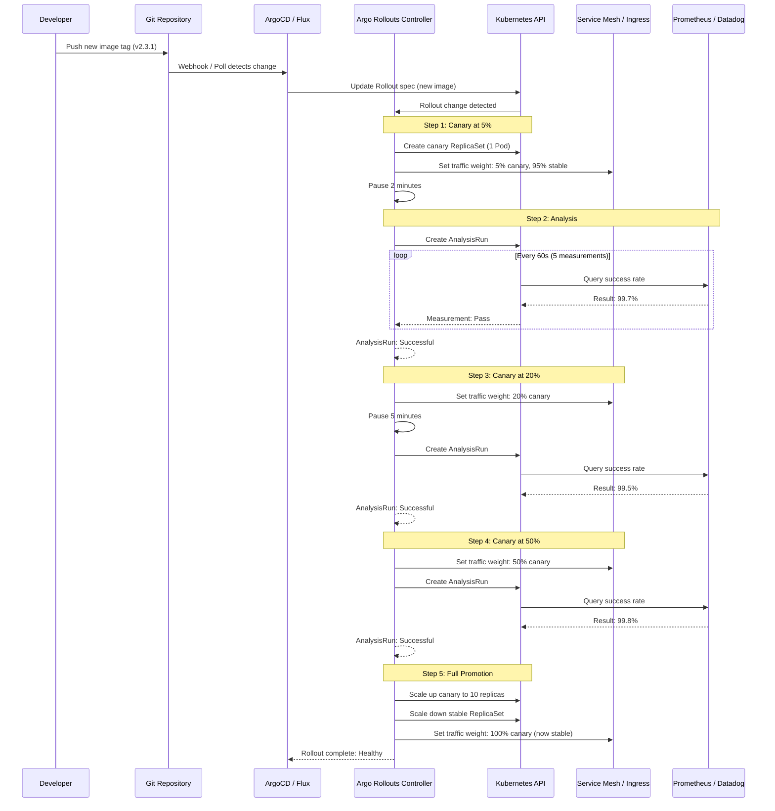
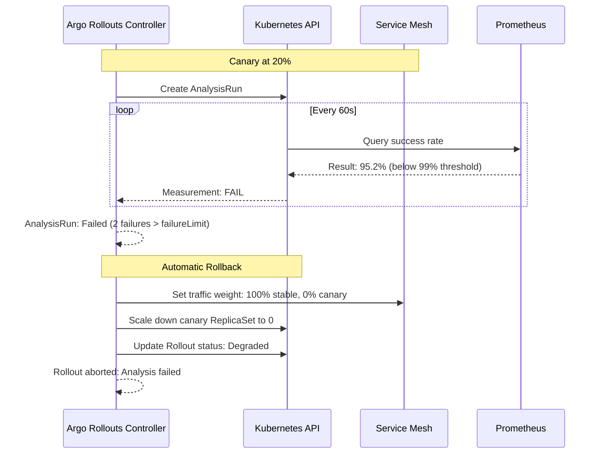

# Progressive Delivery

## 1. Overview

Progressive delivery is the practice of **releasing changes to a small subset of users or traffic, evaluating the impact through automated analysis, and gradually expanding the rollout only if metrics remain healthy**. It extends the basic Kubernetes Deployment strategies (rolling update, recreate) with fine-grained traffic control, automated metric analysis, and automatic rollback on failure.

In a standard Kubernetes rolling update, new Pods replace old Pods and there is no automated verification -- if the new version returns 500 errors, it rolls forward until all replicas serve the broken version. Progressive delivery adds a feedback loop: deploy a small percentage of traffic to the new version, query Prometheus for error rate and latency, and only proceed if the metrics are within acceptable thresholds. If they are not, the system automatically rolls back to the stable version.

The two dominant tools for progressive delivery on Kubernetes are **Argo Rollouts** (Argoproj, CNCF project) and **Flagger** (Fluxcd, CNCF project). Argo Rollouts replaces the standard Deployment resource with a Rollout CRD that adds canary and blue-green strategies with analysis. Flagger works alongside existing Deployments and uses a service mesh or ingress controller for traffic splitting. Both integrate with Prometheus, Datadog, and other metrics providers for automated analysis.

## 2. Why It Matters

- **Standard rolling updates are blind.** A Kubernetes Deployment rolls out new Pods without checking whether the new version is actually working. By the time Prometheus alerts fire and an on-call engineer responds, 100% of traffic may be hitting a broken version. Progressive delivery catches regressions before they reach all users.
- **Rollback speed determines blast radius.** With manual rollback, the detection-to-recovery time can be 10-30 minutes. Automated canary analysis detects regressions in 2-5 minutes and rolls back within seconds, reducing the blast radius by an order of magnitude.
- **Confidence enables deployment velocity.** Teams that lack confidence in their deployment process deploy less frequently, batching more changes per release and increasing risk per deployment. Progressive delivery gives teams the confidence to deploy multiple times per day because each deployment is automatically verified.
- **Compliance requires controlled rollouts.** Regulated industries require evidence that deployments are tested in production before full rollout. Progressive delivery provides that evidence through automated analysis results, traffic percentages, and promotion/rollback decisions -- all recorded as Kubernetes events and metrics.
- **Not all failures are caught by pre-production tests.** Performance regressions, memory leaks under real load, and edge cases in production data are invisible in staging. Canary analysis against live traffic catches these issues before they affect all users.

## 3. Core Concepts

- **Canary Deployment:** A new version receives a small percentage of traffic (e.g., 5%) while the stable version handles the rest. Traffic is gradually shifted to the new version over multiple steps, with analysis at each step. If analysis fails at any step, traffic is shifted back to the stable version.
- **Blue-Green Deployment:** Two complete environments (blue = current, green = new) run simultaneously. Traffic is switched atomically from blue to green after the green environment passes health checks and optional pre-promotion analysis. Rollback is an instant traffic switch back to blue.
- **Analysis / AnalysisTemplate:** An automated evaluation that queries a metrics provider (Prometheus, Datadog, New Relic, CloudWatch) and determines whether the canary is healthy. The analysis defines the metric query, the success condition (e.g., `result[0] < 0.01` for error rate below 1%), and the measurement interval.
- **AnalysisRun:** A concrete execution of an AnalysisTemplate. Created automatically during a rollout, it runs measurements at defined intervals and reports Successful, Failed, or Inconclusive. A failed AnalysisRun triggers automatic rollback.
- **Traffic Splitting:** The mechanism for routing a percentage of traffic to the canary version. Implemented via service mesh (Istio VirtualService, Linkerd TrafficSplit), ingress controllers (Nginx, Traefik), or Gateway API (HTTPRoute). Without traffic splitting, canary is approximated via replica count (1 of 10 Pods = ~10% traffic).
- **Promotion:** The decision to advance the rollout to the next step or to full production. Can be automatic (analysis passes) or manual (human approval required). Argo Rollouts supports both via `pause` steps with or without duration.
- **Rollback:** The decision to abort the rollout and revert to the stable version. Triggered automatically when analysis fails, or manually via the Argo Rollouts CLI or API. In blue-green, rollback is an instant traffic switch. In canary, rollback means scaling down canary Pods and restoring 100% traffic to stable.
- **Progressive Traffic Shifting:** The sequence of traffic weight increases during a canary rollout. A typical progression might be: 5% → 10% → 25% → 50% → 100%, with analysis at each step. Argo Rollouts defines this via `setWeight` steps.
- **Experiment:** Argo Rollouts can run experimental ReplicaSets alongside the canary for A/B testing. Experiments have their own analysis and do not receive production traffic unless explicitly configured.

## 4. How It Works

### Argo Rollouts Canary Strategy

Argo Rollouts replaces the standard Deployment with a Rollout CRD:

```yaml
apiVersion: argoproj.io/v1alpha1
kind: Rollout
metadata:
  name: payment-service
  namespace: production
spec:
  replicas: 10
  revisionHistoryLimit: 3
  selector:
    matchLabels:
      app: payment-service
  template:
    metadata:
      labels:
        app: payment-service
    spec:
      containers:
        - name: payment-service
          image: registry.example.com/payment-service:v2.3.1
          ports:
            - containerPort: 8080
          resources:
            requests:
              cpu: 500m
              memory: 512Mi
            limits:
              cpu: "2"
              memory: 2Gi
  strategy:
    canary:
      canaryService: payment-canary   # Service pointing to canary Pods
      stableService: payment-stable   # Service pointing to stable Pods
      trafficRouting:
        istio:
          virtualServices:
            - name: payment-vsvc
              routes:
                - primary
      steps:
        - setWeight: 5
        - pause: { duration: 2m }       # Let traffic flow for 2 minutes
        - analysis:
            templates:
              - templateName: success-rate
              - templateName: latency-p99
            args:
              - name: service-name
                value: payment-service
        - setWeight: 20
        - pause: { duration: 5m }
        - analysis:
            templates:
              - templateName: success-rate
              - templateName: latency-p99
            args:
              - name: service-name
                value: payment-service
        - setWeight: 50
        - pause: { duration: 5m }
        - analysis:
            templates:
              - templateName: success-rate
              - templateName: latency-p99
            args:
              - name: service-name
                value: payment-service
        - setWeight: 100                 # Full rollout
      rollbackWindow:
        revisions: 3
      scaleDownDelaySeconds: 30
      abortScaleDownDelaySeconds: 30
```

### AnalysisTemplate with Prometheus

```yaml
apiVersion: argoproj.io/v1alpha1
kind: AnalysisTemplate
metadata:
  name: success-rate
  namespace: production
spec:
  args:
    - name: service-name
  metrics:
    - name: success-rate
      interval: 60s
      count: 5                           # Take 5 measurements
      successCondition: result[0] >= 0.99  # 99% success rate required
      failureLimit: 2                    # Allow up to 2 failed measurements
      provider:
        prometheus:
          address: http://prometheus.monitoring:9090
          query: |
            sum(rate(
              http_requests_total{
                service="{{args.service-name}}",
                status=~"2.."
              }[5m]
            )) /
            sum(rate(
              http_requests_total{
                service="{{args.service-name}}"
              }[5m]
            ))
---
apiVersion: argoproj.io/v1alpha1
kind: AnalysisTemplate
metadata:
  name: latency-p99
  namespace: production
spec:
  args:
    - name: service-name
  metrics:
    - name: latency-p99
      interval: 60s
      count: 5
      successCondition: result[0] < 500  # p99 latency under 500ms
      failureLimit: 2
      provider:
        prometheus:
          address: http://prometheus.monitoring:9090
          query: |
            histogram_quantile(0.99,
              sum(rate(
                http_request_duration_seconds_bucket{
                  service="{{args.service-name}}"
                }[5m]
              )) by (le)
            ) * 1000
```

### AnalysisTemplate with Datadog

```yaml
apiVersion: argoproj.io/v1alpha1
kind: AnalysisTemplate
metadata:
  name: error-rate-datadog
spec:
  args:
    - name: service-name
  metrics:
    - name: error-rate
      interval: 120s
      count: 3
      successCondition: result < 0.01    # Error rate under 1%
      failureLimit: 1
      provider:
        datadog:
          interval: 5m
          query: |
            sum:http.requests.errors{service:{{args.service-name}}}.as_rate() /
            sum:http.requests.total{service:{{args.service-name}}}.as_rate()
```

### Argo Rollouts Blue-Green Strategy

```yaml
apiVersion: argoproj.io/v1alpha1
kind: Rollout
metadata:
  name: checkout-service
  namespace: production
spec:
  replicas: 5
  selector:
    matchLabels:
      app: checkout-service
  template:
    metadata:
      labels:
        app: checkout-service
    spec:
      containers:
        - name: checkout-service
          image: registry.example.com/checkout-service:v3.0.0
          ports:
            - containerPort: 8080
  strategy:
    blueGreen:
      activeService: checkout-active     # Service receiving production traffic
      previewService: checkout-preview   # Service for pre-promotion testing
      autoPromotionEnabled: false        # Require manual or analysis-based promotion
      prePromotionAnalysis:
        templates:
          - templateName: smoke-tests
        args:
          - name: preview-url
            value: http://checkout-preview.production.svc.cluster.local
      postPromotionAnalysis:
        templates:
          - templateName: success-rate
        args:
          - name: service-name
            value: checkout-service
      scaleDownDelaySeconds: 300         # Keep old version for 5 min after promotion
      previewReplicaCount: 3             # Scale preview to 3 for pre-promotion testing
```

### Argo Rollouts Services Configuration

```yaml
# Stable service -- always points to the current stable version
apiVersion: v1
kind: Service
metadata:
  name: payment-stable
spec:
  selector:
    app: payment-service
  ports:
    - port: 80
      targetPort: 8080
---
# Canary service -- points to the canary version during rollout
apiVersion: v1
kind: Service
metadata:
  name: payment-canary
spec:
  selector:
    app: payment-service
  ports:
    - port: 80
      targetPort: 8080
---
# Istio VirtualService for traffic splitting
apiVersion: networking.istio.io/v1beta1
kind: VirtualService
metadata:
  name: payment-vsvc
spec:
  hosts:
    - payment-service
  http:
    - name: primary
      route:
        - destination:
            host: payment-stable
          weight: 100
        - destination:
            host: payment-canary
          weight: 0
```

Argo Rollouts automatically adjusts the VirtualService weights during the canary rollout, shifting traffic from stable to canary according to the `setWeight` steps.

### Flagger with Istio

Flagger works alongside standard Kubernetes Deployments:

```yaml
apiVersion: flagger.app/v1beta1
kind: Canary
metadata:
  name: payment-service
  namespace: production
spec:
  targetRef:
    apiVersion: apps/v1
    kind: Deployment
    name: payment-service
  service:
    port: 80
    targetPort: 8080
    gateways:
      - public-gateway.istio-system.svc.cluster.local
    hosts:
      - payment.example.com
    trafficPolicy:
      tls:
        mode: ISTIO_MUTUAL
  analysis:
    interval: 1m                         # Analysis check interval
    threshold: 5                         # Max failures before rollback
    maxWeight: 50                        # Max canary traffic percentage
    stepWeight: 10                       # Increase weight by 10% each step
    metrics:
      - name: request-success-rate
        thresholdRange:
          min: 99                        # Minimum 99% success rate
        interval: 1m
      - name: request-duration
        thresholdRange:
          max: 500                       # Maximum 500ms p99 latency
        interval: 1m
    webhooks:
      - name: load-test
        type: pre-rollout
        url: http://flagger-loadtester.test/
        metadata:
          type: cmd
          cmd: "hey -z 2m -q 10 -c 2 http://payment-canary.production/"
      - name: integration-tests
        type: confirm-rollout
        url: http://flagger-loadtester.test/gate/approve
```

### Flagger with Linkerd

```yaml
apiVersion: flagger.app/v1beta1
kind: Canary
metadata:
  name: api-gateway
  namespace: production
spec:
  targetRef:
    apiVersion: apps/v1
    kind: Deployment
    name: api-gateway
  service:
    port: 8080
  provider: linkerd
  analysis:
    interval: 30s
    threshold: 5
    maxWeight: 50
    stepWeight: 5
    metrics:
      - name: request-success-rate
        thresholdRange:
          min: 99
        interval: 1m
      - name: request-duration
        thresholdRange:
          max: 200
        interval: 1m
```

### Traffic Management with Gateway API

Gateway API is the successor to Kubernetes Ingress and supports traffic splitting natively:

```yaml
# Argo Rollouts with Gateway API
apiVersion: argoproj.io/v1alpha1
kind: Rollout
metadata:
  name: payment-service
spec:
  strategy:
    canary:
      canaryService: payment-canary
      stableService: payment-stable
      trafficRouting:
        plugins:
          argoproj-labs/gatewayAPI:
            httpRoute: payment-route
            namespace: production
      steps:
        - setWeight: 10
        - pause: { duration: 5m }
        - analysis:
            templates:
              - templateName: success-rate
        - setWeight: 50
        - pause: { duration: 5m }
        - analysis:
            templates:
              - templateName: success-rate
        - setWeight: 100
---
# Gateway API HTTPRoute for traffic splitting
apiVersion: gateway.networking.k8s.io/v1
kind: HTTPRoute
metadata:
  name: payment-route
  namespace: production
spec:
  parentRefs:
    - name: production-gateway
      namespace: gateway-system
  rules:
    - backendRefs:
        - name: payment-stable
          port: 80
          weight: 100
        - name: payment-canary
          port: 80
          weight: 0
```

### Custom Metric Analysis with Webhooks

For metrics providers not natively supported, Argo Rollouts supports webhook-based analysis:

```yaml
apiVersion: argoproj.io/v1alpha1
kind: AnalysisTemplate
metadata:
  name: custom-analysis
spec:
  args:
    - name: service-name
    - name: canary-hash
  metrics:
    - name: business-kpi
      interval: 120s
      count: 3
      successCondition: result.healthy == true
      failureLimit: 1
      provider:
        web:
          url: "http://analysis-service.monitoring/api/v1/evaluate"
          method: POST
          headers:
            - key: Content-Type
              value: application/json
          body: |
            {
              "service": "{{args.service-name}}",
              "canaryHash": "{{args.canary-hash}}",
              "metrics": ["conversion_rate", "cart_abandonment"],
              "threshold": 0.02
            }
          jsonPath: "{$.result}"
```

## 5. Architecture / Flow



### Rollback Sequence (Analysis Failure)



## 6. Types / Variants

### Argo Rollouts vs. Flagger

| Dimension | Argo Rollouts | Flagger |
|---|---|---|
| **Architecture** | Replaces Deployment with Rollout CRD | Works alongside existing Deployments |
| **Installation** | CRD + controller + optional dashboard | CRD + controller |
| **Canary strategy** | Fine-grained `setWeight` steps with inline analysis | `stepWeight` + `maxWeight` with automated analysis loop |
| **Blue-green strategy** | Native support with pre/post-promotion analysis | Supported via mirroring and traffic switching |
| **Traffic routing** | Istio, Linkerd, Nginx, ALB, SMI, Gateway API, Traefik, Ambassador | Istio, Linkerd, Nginx, Gloo, Contour, Gateway API |
| **Metrics providers** | Prometheus, Datadog, New Relic, Wavefront, CloudWatch, Kayenta, Web | Prometheus, Datadog, CloudWatch, New Relic, Graphite |
| **Analysis model** | AnalysisTemplate CRD with composable metrics | Built into Canary spec with metric thresholds |
| **Integration** | ArgoCD ecosystem (Argo Workflows, Argo Events) | Flux ecosystem (Flagger is a Flux project) |
| **UI** | Argo Rollouts Dashboard (kubectl plugin + web) | Grafana dashboards, no dedicated UI |
| **A/B testing** | Experiment CRD for running experimental ReplicaSets | Header-based routing for A/B tests |
| **Manual gates** | `pause` steps with optional duration | Webhook-based gating via confirm-rollout hooks |

### Progressive Delivery Strategies Compared

| Strategy | Traffic Control | Rollback Speed | Resource Cost | Complexity | Best For |
|---|---|---|---|---|---|
| **Rolling update** | None (Pod-by-Pod replacement) | Minutes (create new ReplicaSet) | Low (shared Pods) | Low | Low-risk changes, internal services |
| **Canary** | Percentage-based via mesh/ingress | Seconds (shift traffic) | Medium (canary + stable Pods) | High | User-facing services, metric-driven validation |
| **Blue-green** | Atomic switch (all-or-nothing) | Instant (switch traffic) | High (2x Pods during deployment) | Medium | Stateful services, database-coupled deployments |
| **A/B testing** | Header or cookie-based routing | Seconds (change routing rules) | Medium | High | Feature validation, user experience testing |
| **Shadow / mirror** | Duplicate traffic (response discarded) | N/A (no production impact) | High (2x compute for mirrored traffic) | High | Validating new versions without user impact |

### Traffic Splitting Mechanisms

| Mechanism | Granularity | Requires | Sticky Sessions |
|---|---|---|---|
| **Istio VirtualService** | Percentage-based (1% granularity) | Istio service mesh | Via consistent hash |
| **Linkerd TrafficSplit** | Percentage-based | Linkerd service mesh | No native support |
| **Nginx Ingress annotations** | Percentage-based (canary-weight) | Nginx Ingress Controller | Via cookie annotation |
| **AWS ALB Ingress** | Percentage-based | AWS Load Balancer Controller | No |
| **Gateway API HTTPRoute** | Weight-based backend refs | Gateway API implementation | Implementation-dependent |
| **Replica count (no mesh)** | Approximate (1/N Pods ≈ 1/N traffic) | Nothing extra | Round-robin only |

## 7. Use Cases

- **E-commerce checkout service canary.** A payment processing service uses Argo Rollouts with Istio traffic splitting. The canary progression is 5% → 10% → 25% → 50% → 100%, with analysis at each step measuring success rate (>99.5%), p99 latency (<300ms), and payment conversion rate (within 2% of baseline). If any metric degrades, the rollout aborts and all traffic returns to the stable version within 30 seconds.
- **API gateway blue-green deployment.** An API gateway that handles all inbound traffic uses blue-green strategy because partial traffic splitting would create inconsistent behavior for stateful API sessions. The preview environment runs pre-promotion smoke tests (health checks, contract tests). After manual approval, traffic switches atomically. The old version stays available for 10 minutes for instant rollback.
- **Machine learning model canary.** A recommendation service deploys a new ML model via canary. The analysis measures not just HTTP metrics but business KPIs: click-through rate, recommendation relevance score, and revenue per session. These custom metrics are queried via a webhook-based AnalysisTemplate that calls the data science team's analysis API.
- **Multi-region progressive rollout.** A global service deploys to one region first (canary region). If analysis passes over 30 minutes, the rollout extends to additional regions in waves. Each region has its own Argo Rollout, and a parent Argo Workflow orchestrates the cross-region progression.
- **Zero-downtime database migration.** A service with a database schema change uses blue-green with pre-promotion analysis. The migration Job runs as a Helm pre-upgrade hook. The preview environment validates that the new schema is backward-compatible by running integration tests against the migrated database. Only after validation does traffic switch.

## 8. Tradeoffs

| Decision | Option A | Option B | Guidance |
|---|---|---|---|
| **Argo Rollouts vs. Flagger** | Argo Rollouts: fine-grained control, Argo ecosystem | Flagger: works with existing Deployments, Flux ecosystem | Argo Rollouts if using ArgoCD; Flagger if using Flux or want to keep standard Deployments |
| **Canary vs. blue-green** | Canary: gradual traffic shift, metric-driven promotion | Blue-green: atomic switch, instant rollback | Canary for user-facing services with clear metrics; blue-green for stateful or session-dependent services |
| **Automated vs. manual promotion** | Automated: faster, no human bottleneck | Manual: human judgment, additional safety | Automated with strict analysis thresholds for most services; manual for critical services (payment, auth) |
| **Service mesh vs. ingress for traffic splitting** | Mesh: east-west and north-south traffic, mTLS | Ingress: north-south only, simpler to operate | Mesh if you already run Istio/Linkerd; ingress if mesh is not justified |
| **Aggressive vs. conservative canary steps** | Aggressive: 10% → 50% → 100% (fast deployment) | Conservative: 1% → 5% → 10% → 25% → 50% → 100% (thorough) | Conservative for high-traffic services where 1% still generates significant signal; aggressive for internal services |
| **Replica-based vs. traffic-based canary** | Replica-based: no mesh/ingress dependency | Traffic-based: precise control, independent of replica count | Traffic-based when you have a mesh or supporting ingress; replica-based as a lightweight alternative |

## 9. Common Pitfalls

- **Insufficient traffic for meaningful analysis.** If a service receives 10 requests per minute and the canary gets 5%, that is 0.5 requests per minute -- not enough data for statistical significance. Ensure canary weight generates enough traffic for reliable metrics. For low-traffic services, use longer analysis windows or higher canary percentages.
- **Querying the wrong metrics.** Analysis queries must measure the canary version specifically, not the aggregate service. If the Prometheus query includes all Pods (canary + stable), a canary with 100% error rate at 5% traffic will show a 5% aggregate error rate -- which may pass a 99% success threshold. Use Pod labels or revision hashes to scope queries.
- **Not testing the rollback path.** Teams test the happy path (canary succeeds, promoted) but never verify that rollback works correctly. Deliberately trigger a failed canary in staging to validate that traffic reverts, Pods scale down, and alerts fire as expected.
- **Analysis thresholds that are too lenient.** Setting a success rate threshold of 95% when the baseline is 99.9% means the canary can be 50x worse before triggering a rollback. Set thresholds relative to the baseline, not absolute minimums.
- **Ignoring resource overhead.** During a canary rollout, you run both stable and canary Pods simultaneously. If the cluster is already at capacity, the canary Pods may not schedule. Ensure sufficient headroom or use the HPA to scale down stable Pods as canary scales up.
- **Forgetting health checks on the canary.** The canary Pods must have readiness probes. Without them, Argo Rollouts or Flagger may shift traffic to Pods that are not yet ready, causing errors that fail the analysis prematurely.
- **Not aligning canary analysis with deployment frequency.** If analysis takes 30 minutes (5 steps x 5 minutes pause + analysis) and the team deploys 10 times per day, the pipeline becomes a bottleneck. Tune step durations and analysis intervals to match deployment frequency.
- **Mixing Argo Rollouts with Deployment.** If you define both a Deployment and a Rollout for the same application, the Deployment controller and Rollout controller will fight over Pod management. Migrate completely from Deployment to Rollout; do not run both.

## 10. Real-World Examples

- **Intuit (Argo Rollouts creator):** Developed Argo Rollouts to support canary and blue-green deployments for TurboTax, QuickBooks, and Mint. They process thousands of canary rollouts per week, with AnalysisTemplates that measure HTTP success rate, latency, and business metrics like form completion rate. Their analysis platform evaluates canary metrics against a baseline using statistical significance testing.
- **Kayenta (Netflix / Google):** Netflix developed Kayenta as an automated canary analysis service. It compares canary and baseline metrics using statistical methods (Mann-Whitney U test) rather than simple thresholds. Google contributed to Kayenta and it is available as an Argo Rollouts analysis provider. Kayenta's statistical approach avoids the pitfall of absolute threshold analysis.
- **Flagger at Weaveworks customers:** Flagger is used by organizations including Deutsche Telekom and Fidelity Investments. Deutsche Telekom uses Flagger with Linkerd for canary deployments across their European Kubernetes clusters, with automated analysis measuring request success rate and p99 latency. Flagger automatically generates the Istio VirtualServices or Linkerd TrafficSplits needed for traffic management.
- **Spotify:** Uses canary deployments with custom analysis that measures not just technical metrics but also user experience metrics (playback start time, buffer ratio, skip rate). Their canary analysis pipeline queries both Prometheus (technical metrics) and their data warehouse (business metrics) to make promotion decisions.
- **Amazon:** Uses progressive delivery patterns for their internal microservices. Their deployment system "Pipelines" implements canary with automated rollback. They deploy hundreds of times per day across thousands of services, with each deployment going through a canary phase where automated alarms monitor error rates, latency, and CPU/memory utilization.

## 11. Related Concepts

- [Deployment Strategies](../03-workload-design/02-deployment-strategies.md) -- basic rolling update, blue-green, and canary strategies at the Kubernetes Deployment level (progressive delivery builds on these)
- [GitOps and Flux / ArgoCD](./01-gitops-and-flux-argocd.md) -- GitOps triggers the Rollout update; ArgoCD manages the Rollout resource lifecycle
- [CI/CD Pipelines](./03-cicd-pipelines.md) -- CI builds the image; the pipeline updates the GitOps repo; progressive delivery handles the cluster-side rollout
- [Helm and Kustomize](./02-helm-and-kustomize.md) -- Rollout and Canary resources can be templated via Helm or patched via Kustomize overlays
- [Observability](../09-observability-design/) -- Prometheus metrics and distributed tracing that feed canary analysis
- [Service Mesh](../04-networking-design/) -- Istio and Linkerd provide the traffic splitting layer for progressive delivery

## 12. Source Traceability

- source/extracted/system-design-guide/ch17-designing-a-service-like-google-docs.md -- Blue-green deployments, canary releases, rolling updates as deployment strategies for distributed systems
- source/extracted/acing-system-design/ch04-a-typical-system-design-interview-flow.md -- Automation and orchestration context (Skaffold, Jenkins, Kubernetes) that progressive delivery extends
- Argo Rollouts documentation (argoproj.github.io/argo-rollouts) -- Rollout CRD, canary strategy, blue-green strategy, AnalysisTemplate, traffic routing
- Flagger documentation (flagger.app) -- Canary CRD, service mesh integration, automated analysis, webhook gating
- Gateway API documentation (gateway-api.sigs.k8s.io) -- HTTPRoute traffic splitting for progressive delivery
