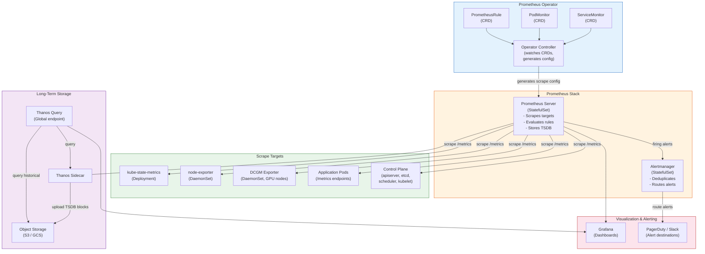

# Monitoring and Metrics

## 1. Overview

Monitoring in Kubernetes is the practice of collecting, storing, querying, and alerting on quantitative signals emitted by every layer of the stack -- from the Linux kernel and container runtime up through the Kubernetes control plane and into application code. The dominant ecosystem is **Prometheus-based**: the Prometheus Operator deploys and manages Prometheus instances declaratively, ServiceMonitors and PodMonitors define scrape targets via label selectors, PrometheusRules encode alerting and recording rules, and Grafana renders dashboards.

In a GenAI context, monitoring extends to GPU-specific telemetry via the **DCGM Exporter** (gpu_utilization, memory_used, power_usage), model-serving metrics (token throughput, inference latency, time-to-first-token), and cost-relevant signals that tie GPU hours to specific models and teams.

This document covers the full monitoring stack: what to collect, how to collect it, how to store it at scale, and how to build actionable dashboards and alerts.

## 2. Why It Matters

- **You cannot manage what you cannot measure.** Without metrics, capacity planning is guesswork, incident response is slow, and cost optimization is impossible. Kubernetes clusters are dynamic -- Pods come and go, nodes scale up and down, and workloads shift across machines. Metrics are the only way to understand what is actually happening.
- **Proactive detection beats reactive firefighting.** Well-configured alerts catch resource exhaustion, performance degradation, and failure cascades before they affect users. A recording rule that tracks the 5-minute rate of 5xx errors can fire an alert within 2 minutes of a regression, compared to the 15-30 minutes it takes for user complaints to reach an on-call engineer.
- **Kubernetes exposes rich metrics natively.** The API server, kubelet, scheduler, etcd, and kube-proxy all export Prometheus-format metrics out of the box. Failing to collect these is leaving critical visibility on the table.
- **GPU workloads are expensive and opaque without telemetry.** A single A100 GPU costs $3-4/hour on cloud providers. Without utilization metrics, teams routinely waste 40-60% of GPU capacity running inference servers that are idle or training jobs that are memory-bound but CPU-starved.
- **Metrics are the foundation for autoscaling.** HPA (Horizontal Pod Autoscaler) and KEDA both consume Prometheus metrics. Without accurate metrics, autoscaling either under-provisions (causing latency spikes) or over-provisions (wasting money).

## 3. Core Concepts

- **Prometheus Operator:** A Kubernetes operator that manages Prometheus server instances, Alertmanager instances, and related configuration as Custom Resources. Instead of hand-editing prometheus.yml, you declare ServiceMonitors and PrometheusRules as YAML manifests, and the operator reconciles the Prometheus configuration automatically. This is the standard deployment model in production.
- **ServiceMonitor:** A Custom Resource that tells Prometheus which Kubernetes Services to scrape. It uses label selectors to match Services and defines the scrape path, port, interval, and TLS settings. When a new Service matching the selector appears, Prometheus automatically starts scraping it -- no configuration reload needed.
- **PodMonitor:** Like ServiceMonitor, but selects Pods directly instead of Services. Used when metrics endpoints are not exposed via a Service (e.g., sidecar containers, batch jobs, or Pods with multiple ports where only one exposes metrics).
- **PrometheusRule:** A Custom Resource containing recording rules and alerting rules. Recording rules pre-compute expensive queries at scrape time and store the results as new time series. Alerting rules evaluate PromQL expressions at a configurable interval and fire alerts when conditions are met.
- **kube-state-metrics (KSM):** A service that listens to the Kubernetes API server and generates metrics about the state of Kubernetes objects -- Deployment replica counts, Pod phases, node conditions, PVC status, Job completions, and hundreds more. KSM does not measure resource consumption; it measures the declared and observed state of Kubernetes objects. Without KSM, you cannot answer questions like "how many Pods are in CrashLoopBackOff?" or "which Deployments have fewer ready replicas than desired?"
- **node-exporter:** A Prometheus exporter that runs as a DaemonSet on every node, exposing hardware and OS-level metrics: CPU usage, memory usage, disk I/O, filesystem space, network statistics, and thermal readings. This is the foundation for node-level capacity monitoring.
- **DCGM Exporter:** NVIDIA's Data Center GPU Manager exporter, deployed as a DaemonSet on GPU nodes. It exposes GPU-specific metrics including `DCGM_FI_DEV_GPU_UTIL` (GPU core utilization percentage), `DCGM_FI_DEV_FB_USED` (framebuffer memory used in MiB), `DCGM_FI_DEV_POWER_USAGE` (power draw in watts), `DCGM_FI_DEV_SM_CLOCK` (streaming multiprocessor clock speed), and `DCGM_FI_DEV_GPU_TEMP` (temperature in Celsius).
- **Golden Signals:** The four signals from Google's SRE book that matter most for any service: **latency** (how long requests take), **traffic** (how many requests per second), **errors** (what fraction of requests fail), and **saturation** (how full the resource is). In Kubernetes, these translate to request duration histograms, request rate, error rate, and CPU/memory/GPU utilization relative to limits.
- **Recording Rules:** PromQL expressions that are evaluated at regular intervals and stored as new time series. They serve two purposes: (1) pre-computing expensive queries so dashboards load instantly, and (2) creating aggregated metrics that are cheaper to query over long time ranges. Example: recording `job:http_requests:rate5m` avoids recomputing `rate(http_requests_total[5m])` every time a dashboard panel loads.
- **Federation:** A Prometheus feature where one Prometheus instance scrapes selected time series from another. Used to aggregate metrics from multiple clusters into a global view. A global Prometheus federates from per-cluster Prometheus instances, pulling only pre-aggregated recording rules to keep cardinality manageable.
- **Thanos:** An open-source project that extends Prometheus with long-term storage (object storage like S3/GCS), global query across multiple Prometheus instances, downsampling, and compaction. Thanos Sidecar runs alongside Prometheus and uploads TSDB blocks to object storage. Thanos Query provides a unified query endpoint across all Prometheus instances and stored data.
- **Cortex / Mimir:** Horizontally scalable, multi-tenant, long-term storage backends for Prometheus. Unlike Thanos (which extends existing Prometheus instances), Cortex/Mimir receive metrics via remote_write and store them in object storage with a distributed query engine. Grafana Mimir is the successor to Cortex, maintained by Grafana Labs.
- **Grafana:** The standard visualization layer for Prometheus metrics. Grafana dashboards query Prometheus (or Thanos/Mimir) via PromQL and render time-series graphs, heatmaps, tables, and stat panels. The **Kubernetes Mixin** is a community-maintained collection of Grafana dashboards and Prometheus recording rules covering cluster-level, node-level, and workload-level views.
- **Token Throughput (GenAI):** The rate of tokens generated per second by an inference server (e.g., vLLM, TGI, Triton). This is the primary capacity metric for LLM serving -- it determines how many concurrent users the system can support. Measured as `tokens_per_second` or `total_tokens / request_duration`.
- **Inference Latency (GenAI):** The time from request arrival to response completion for a model inference call. For LLMs, this breaks down into **time-to-first-token (TTFT)** -- the latency before the first token is streamed -- and **inter-token latency (ITL)** -- the time between consecutive tokens. Both matter for user experience.

## 4. How It Works

### Prometheus Operator Deployment

The Prometheus Operator is typically deployed via the **kube-prometheus-stack** Helm chart, which bundles:

1. **Prometheus Operator** itself (watches for CRDs, manages Prometheus instances)
2. **Prometheus** server instances (configured via the `Prometheus` CRD)
3. **Alertmanager** (configured via the `Alertmanager` CRD)
4. **Grafana** with pre-configured datasources and dashboards
5. **kube-state-metrics** deployment
6. **node-exporter** DaemonSet
7. **Default PrometheusRules** for Kubernetes component alerting

```bash
helm repo add prometheus-community https://prometheus-community.github.io/helm-charts
helm install kube-prometheus-stack prometheus-community/kube-prometheus-stack \
  --namespace monitoring --create-namespace \
  --set prometheus.prometheusSpec.retention=30d \
  --set prometheus.prometheusSpec.storageSpec.volumeClaimTemplate.spec.resources.requests.storage=100Gi
```

### ServiceMonitor and PodMonitor Mechanics

When you create a ServiceMonitor, the Prometheus Operator:

1. Watches for ServiceMonitor resources matching the `serviceMonitorSelector` on the Prometheus CRD
2. Discovers Services matching the ServiceMonitor's `selector.matchLabels`
3. Resolves the Service's backing Endpoints (Pod IPs and ports)
4. Generates a `scrape_config` section in Prometheus configuration
5. Reloads Prometheus configuration (via the config-reloader sidecar)
6. Prometheus begins scraping the discovered endpoints at the configured interval

Example ServiceMonitor for an application exposing metrics on port 8080 at `/metrics`:

```yaml
apiVersion: monitoring.coreos.com/v1
kind: ServiceMonitor
metadata:
  name: my-app
  namespace: production
  labels:
    release: kube-prometheus-stack  # Must match Prometheus serviceMonitorSelector
spec:
  selector:
    matchLabels:
      app: my-app
  endpoints:
    - port: metrics          # Must match the Service port name
      path: /metrics
      interval: 30s
      scrapeTimeout: 10s
  namespaceSelector:
    matchNames:
      - production
```

Example PodMonitor for GPU metrics from DCGM Exporter:

```yaml
apiVersion: monitoring.coreos.com/v1
kind: PodMonitor
metadata:
  name: dcgm-exporter
  namespace: gpu-operator
spec:
  selector:
    matchLabels:
      app: nvidia-dcgm-exporter
  podMetricsEndpoints:
    - port: metrics
      interval: 15s
  namespaceSelector:
    matchNames:
      - gpu-operator
```

### Key Metric Sources in Kubernetes

| Source | Deployment | Key Metrics | Scrape Path |
|---|---|---|---|
| **kube-apiserver** | Built-in (control plane) | `apiserver_request_total`, `apiserver_request_duration_seconds`, `apiserver_current_inflight_requests` | `:6443/metrics` |
| **kubelet** | Built-in (every node) | `kubelet_running_pods`, `kubelet_pod_start_duration_seconds`, container resource metrics via cAdvisor | `:10250/metrics`, `:10250/metrics/cadvisor` |
| **etcd** | Built-in (control plane) | `etcd_server_has_leader`, `etcd_disk_wal_fsync_duration_seconds`, `etcd_mvcc_db_total_size_in_bytes` | `:2379/metrics` |
| **kube-scheduler** | Built-in (control plane) | `scheduler_scheduling_attempt_duration_seconds`, `scheduler_pending_pods`, `scheduler_queue_incoming_pods_total` | `:10259/metrics` |
| **kube-state-metrics** | Deployment (1 replica) | `kube_deployment_status_replicas`, `kube_pod_status_phase`, `kube_node_status_condition` | `:8080/metrics` |
| **node-exporter** | DaemonSet | `node_cpu_seconds_total`, `node_memory_MemAvailable_bytes`, `node_filesystem_avail_bytes`, `node_disk_io_time_seconds_total` | `:9100/metrics` |
| **DCGM Exporter** | DaemonSet (GPU nodes) | `DCGM_FI_DEV_GPU_UTIL`, `DCGM_FI_DEV_FB_USED`, `DCGM_FI_DEV_POWER_USAGE` | `:9400/metrics` |
| **CoreDNS** | Deployment (kube-system) | `coredns_dns_requests_total`, `coredns_dns_responses_total`, `coredns_dns_request_duration_seconds` | `:9153/metrics` |

### Recording Rules for Kubernetes

Recording rules pre-compute frequently-queried expressions. The Kubernetes Mixin includes hundreds of rules; here are representative examples:

```yaml
apiVersion: monitoring.coreos.com/v1
kind: PrometheusRule
metadata:
  name: k8s-recording-rules
  namespace: monitoring
spec:
  groups:
    - name: k8s.rules.container_resource
      interval: 30s
      rules:
        # Pre-compute CPU usage by namespace
        - record: namespace:container_cpu_usage_seconds_total:sum_irate
          expr: |
            sum by (namespace) (
              irate(container_cpu_usage_seconds_total{image!=""}[5m])
            )
        # Pre-compute memory usage by namespace
        - record: namespace:container_memory_working_set_bytes:sum
          expr: |
            sum by (namespace) (
              container_memory_working_set_bytes{image!=""}
            )
        # Pre-compute GPU utilization by namespace and GPU model
        - record: namespace_gpu_model:dcgm_gpu_utilization:avg
          expr: |
            avg by (namespace, modelName) (
              DCGM_FI_DEV_GPU_UTIL
              * on (pod) group_left(namespace)
              kube_pod_info
            )
```

### Alerting Rules Example

```yaml
apiVersion: monitoring.coreos.com/v1
kind: PrometheusRule
metadata:
  name: k8s-alerting-rules
  namespace: monitoring
spec:
  groups:
    - name: kubernetes-apps
      rules:
        - alert: KubePodCrashLooping
          expr: |
            max_over_time(kube_pod_container_status_waiting_reason{reason="CrashLoopBackOff"}[5m]) >= 1
          for: 15m
          labels:
            severity: warning
          annotations:
            summary: "Pod {{ $labels.namespace }}/{{ $labels.pod }} is crash looping"
            runbook_url: "https://runbooks.example.com/KubePodCrashLooping"

        - alert: KubeDeploymentReplicasMismatch
          expr: |
            kube_deployment_spec_replicas
            != kube_deployment_status_ready_replicas
          for: 15m
          labels:
            severity: warning
          annotations:
            summary: "Deployment {{ $labels.namespace }}/{{ $labels.deployment }} has mismatched replicas"

        - alert: NodeHighCPU
          expr: |
            1 - avg by (instance) (irate(node_cpu_seconds_total{mode="idle"}[5m])) > 0.85
          for: 10m
          labels:
            severity: warning
          annotations:
            summary: "Node {{ $labels.instance }} CPU usage above 85% for 10 minutes"

        - alert: GPUHighMemoryUsage
          expr: |
            DCGM_FI_DEV_FB_USED / DCGM_FI_DEV_FB_FREE > 0.9
          for: 5m
          labels:
            severity: warning
          annotations:
            summary: "GPU {{ $labels.gpu }} on node {{ $labels.instance }} memory above 90%"
```

### Golden Signals Mapped to Kubernetes

| Golden Signal | Kubernetes Metric | PromQL Example |
|---|---|---|
| **Latency** | `apiserver_request_duration_seconds` | `histogram_quantile(0.99, rate(apiserver_request_duration_seconds_bucket[5m]))` |
| **Traffic** | `apiserver_request_total` | `sum(rate(apiserver_request_total[5m])) by (verb, resource)` |
| **Errors** | `apiserver_request_total{code=~"5.."}` | `sum(rate(apiserver_request_total{code=~"5.."}[5m])) / sum(rate(apiserver_request_total[5m]))` |
| **Saturation** | `container_cpu_usage_seconds_total` vs `kube_pod_container_resource_limits` | `sum(rate(container_cpu_usage_seconds_total[5m])) by (pod) / sum(kube_pod_container_resource_limits{resource="cpu"}) by (pod)` |

### GenAI-Specific Monitoring

For LLM inference workloads (vLLM, TGI, Triton Inference Server), monitoring extends beyond standard Kubernetes metrics:

**Key GenAI Metrics:**

| Metric | Source | Description | Target Range |
|---|---|---|---|
| `vllm:num_requests_running` | vLLM exporter | Active concurrent requests | Varies by model size |
| `vllm:avg_generation_throughput_toks_per_s` | vLLM exporter | Token generation rate | Higher is better |
| `vllm:avg_prompt_throughput_toks_per_s` | vLLM exporter | Prompt processing rate | Higher is better |
| `vllm:e2e_request_latency_seconds` | vLLM exporter | End-to-end request latency | <2s for chat, <10s for batch |
| `vllm:time_to_first_token_seconds` | vLLM exporter | Time to first streamed token | <500ms for interactive |
| `DCGM_FI_DEV_GPU_UTIL` | DCGM Exporter | GPU compute utilization (%) | 70-95% for training, 30-70% for inference |
| `DCGM_FI_DEV_FB_USED` | DCGM Exporter | GPU memory used (MiB) | Monitor for OOM risk |
| `DCGM_FI_DEV_POWER_USAGE` | DCGM Exporter | GPU power consumption (watts) | Track for cost/thermal management |

**Example: vLLM ServiceMonitor:**

```yaml
apiVersion: monitoring.coreos.com/v1
kind: ServiceMonitor
metadata:
  name: vllm-inference
  namespace: ml-serving
spec:
  selector:
    matchLabels:
      app: vllm
  endpoints:
    - port: metrics
      path: /metrics
      interval: 15s
  namespaceSelector:
    matchNames:
      - ml-serving
```

**Example: GPU utilization per model dashboard query:**

```promql
# Average GPU utilization grouped by model name and namespace
avg by (namespace, model_name) (
  DCGM_FI_DEV_GPU_UTIL
  * on (pod) group_left(model_name)
  label_replace(
    kube_pod_labels{label_model_name!=""},
    "model_name", "$1", "label_model_name", "(.*)"
  )
)
```

### Long-Term Storage: Thanos vs. Cortex/Mimir

Prometheus stores data locally on disk with a configurable retention (default 15 days). For long-term storage, global querying, and multi-tenancy, you need an extension layer.

**Thanos Architecture:**

| Component | Role | Deployment |
|---|---|---|
| **Thanos Sidecar** | Runs alongside Prometheus; uploads TSDB blocks to object storage | Sidecar container in Prometheus Pod |
| **Thanos Store Gateway** | Serves historical data from object storage | StatefulSet |
| **Thanos Query** | Unified PromQL endpoint; fans out to Sidecars and Store Gateways | Deployment (stateless) |
| **Thanos Compactor** | Downsamples and compacts blocks in object storage | Single replica StatefulSet |
| **Thanos Ruler** | Evaluates recording/alerting rules against Thanos Query | StatefulSet |

**Cortex/Mimir Architecture:**

| Component | Role | Deployment |
|---|---|---|
| **Distributor** | Receives remote_write, validates, and distributes to Ingesters | Deployment (stateless) |
| **Ingester** | Holds recent data in memory, flushes to object storage | StatefulSet (3 replicas, replication factor 3) |
| **Querier** | Queries both Ingesters and object storage | Deployment (stateless) |
| **Compactor** | Compacts and downsamples blocks | StatefulSet |
| **Store Gateway** | Queries historical blocks in object storage | StatefulSet |

**Decision Framework:**

| Criteria | Thanos | Cortex/Mimir |
|---|---|---|
| **Existing Prometheus?** | Extends in-place (sidecar) | Requires remote_write configuration |
| **Multi-tenancy** | Limited (query-level) | Native (per-tenant isolation) |
| **Operational complexity** | Moderate (several components) | Higher (more components, stateful) |
| **Query performance** | Good for federated queries | Better for high-cardinality, high-query-volume |
| **Cost** | Lower (fewer replicas needed) | Higher (replication factor 3 for ingesters) |
| **Community** | Large, CNCF incubating | Mimir is Grafana Labs; Cortex is CNCF |

### Grafana Dashboard Strategy

A well-organized Grafana instance for Kubernetes follows a hierarchy:

1. **Cluster Overview:** Node count, total CPU/memory capacity and usage, Pod count by phase, API server request rate, etcd size. This is the "is the cluster healthy?" view.
2. **Node Detail:** Per-node CPU, memory, disk, network, and GPU utilization. Drill down from the cluster overview by clicking a node.
3. **Namespace Overview:** Resource usage by namespace (CPU, memory, GPU). This is the "which teams are consuming resources?" view used for cost attribution.
4. **Workload Detail:** Per-Deployment/StatefulSet/DaemonSet replica count, ready replicas, CPU/memory requests vs. actual usage. The primary view for application teams.
5. **Pod Detail:** Individual container resource consumption, restart counts, OOM kills, log errors.
6. **Control Plane:** API server latency, etcd disk sync, scheduler queue depth, controller manager work queue. The "is the platform healthy?" view for platform engineers.
7. **GPU Dashboard:** Per-GPU utilization, memory usage, power draw, temperature. Grouped by node, namespace, and model name. Critical for GenAI workloads.

The **Kubernetes Mixin** (github.com/kubernetes-monitoring/kubernetes-mixin) provides dashboards for layers 1-6 as JSON models with accompanying recording rules and alerts. GPU dashboards require additional configuration using DCGM exporter metrics.

## 5. Architecture / Flow



## 6. Types / Variants

### Monitoring Stack Options

| Stack | Components | Best For | Operational Burden |
|---|---|---|---|
| **kube-prometheus-stack** | Prometheus Operator + Prometheus + Grafana + Alertmanager + KSM + node-exporter | Standard production K8s monitoring | Medium -- manage StatefulSets, PVCs, retention |
| **Thanos + Prometheus** | kube-prometheus-stack + Thanos sidecar, query, store, compactor | Multi-cluster, long-term retention | High -- additional stateful components |
| **Grafana Mimir** | Mimir (ingest, query, store) + Grafana Agent (remote_write) | High-cardinality, multi-tenant | High -- distributed system |
| **Grafana Cloud** | Managed Mimir + Grafana Agent | Teams wanting zero-ops metrics | Low -- SaaS cost |
| **Datadog / New Relic** | Agent-based, proprietary backend | Teams wanting full-stack commercial observability | Low -- SaaS cost |
| **Amazon Managed Prometheus (AMP)** | Managed Prometheus-compatible backend | AWS-native K8s clusters (EKS) | Low -- AWS managed |
| **Google Cloud Managed Prometheus** | Managed collection + storage integrated with Cloud Monitoring | GKE clusters | Low -- GCP managed |

### Metric Collection Agents

| Agent | Model | Use Case |
|---|---|---|
| **Prometheus server (pull)** | Scrapes /metrics endpoints at configured interval | Default for kube-prometheus-stack |
| **Grafana Agent (remote_write)** | Lightweight; scrapes locally, remote_writes to backend | When you want Prometheus scraping without local TSDB |
| **OpenTelemetry Collector** | Receives OTLP metrics, exports to Prometheus/Mimir | Unified pipeline for metrics + traces + logs |
| **Datadog Agent** | DaemonSet agent; pushes to Datadog SaaS | Datadog users |
| **Victoria Metrics Agent** | Pull or push; remote_write to VictoriaMetrics | VictoriaMetrics users |

### GPU Monitoring Options

| Tool | Metrics | Deployment | Notes |
|---|---|---|---|
| **DCGM Exporter** | GPU util, memory, power, temperature, clock, ECC errors | DaemonSet (GPU nodes) | NVIDIA official; integrates with GPU Operator |
| **NVIDIA GPU Operator** | Bundles DCGM Exporter + device plugin + driver | Operator | Full lifecycle management of GPU stack |
| **nvidia-smi (manual)** | Same as DCGM but via CLI | Exec into node or container | Not suitable for production monitoring |
| **Triton Inference Server metrics** | Inference count, latency, queue time, GPU utilization per model | Built into Triton | Model-level granularity |

## 7. Use Cases

- **Cluster capacity planning.** Track `node_cpu_seconds_total` and `node_memory_MemAvailable_bytes` over weeks to project when you need to add nodes. Recording rules that aggregate CPU/memory utilization at the cluster level make this a single-dashboard query. Example: a recording rule `cluster:cpu_utilization:ratio = sum(rate(node_cpu_seconds_total{mode!="idle"}[5m])) / count(node_cpu_seconds_total{mode="idle"})` gives you a single utilization number for the entire cluster.
- **Detecting OOM kills before they cascade.** Alert on `kube_pod_container_status_last_terminated_reason{reason="OOMKilled"}` combined with memory usage approaching limits. Teams that monitor this prevent the common pattern where one OOM-killed Pod shifts load to survivors, which then also OOM-kill in a cascade.
- **GPU utilization optimization for ML teams.** Dashboard showing `DCGM_FI_DEV_GPU_UTIL` per namespace and model name. Teams running LLM inference discover that their A100 GPUs are only 35% utilized during off-peak hours, leading to implementing request batching (increasing utilization to 70%) or time-sharing GPUs across models.
- **API server health monitoring.** Track `apiserver_request_duration_seconds` p99 and alert when it exceeds 1 second. Combined with `apiserver_current_inflight_requests`, this detects when the API server is overloaded -- often caused by misbehaving controllers making too many LIST calls without pagination.
- **etcd performance tracking.** Alert on `etcd_disk_wal_fsync_duration_seconds` p99 exceeding 10ms. etcd is extremely sensitive to disk latency, and this metric is the earliest indicator of impending cluster instability.
- **Cost attribution via metrics.** Namespace-level CPU and memory usage from recording rules feeds into cost models (OpenCost). Without these metrics, cost allocation is based on requests (what was asked for) rather than usage (what was actually consumed).
- **LLM inference SLA monitoring.** Track `time_to_first_token_seconds` p99 for each model. Alert when TTFT exceeds the SLA threshold (e.g., 500ms for interactive chat). This combines inference server metrics with DCGM GPU metrics to determine whether latency is caused by GPU saturation or application-level queuing.
- **Multi-cluster global view.** Thanos Query federates across 10+ clusters, providing a single Grafana dashboard showing total platform resource consumption. Platform teams use this for executive reporting and capacity forecasting.

## 8. Tradeoffs

| Decision | Option A | Option B | Guidance |
|---|---|---|---|
| **Pull (Prometheus) vs. Push (remote_write)** | Pull: Prometheus controls scrape pace; simple service discovery | Push: works through firewalls; better for short-lived jobs | Pull for long-running services; push for batch jobs and edge clusters |
| **Local TSDB vs. Remote storage** | Local: simple, fast queries, limited retention | Remote (Thanos/Mimir): long retention, global query, higher complexity | Local for <30 days retention; remote for compliance, multi-cluster, or >30 days |
| **Thanos vs. Mimir** | Thanos: extends existing Prometheus, lower resource cost | Mimir: better multi-tenancy, higher write throughput | Thanos for existing Prometheus clusters; Mimir for greenfield or multi-tenant platforms |
| **High scrape frequency vs. cardinality** | 15s intervals: more granular, higher storage cost | 60s intervals: less storage, may miss short spikes | 15-30s for critical services; 60s for low-priority or high-cardinality |
| **DCGM Exporter vs. application-level GPU metrics** | DCGM: hardware-level, model-agnostic | Application (Triton, vLLM): model-level granularity | Use both -- DCGM for infrastructure, application exporters for model-level visibility |
| **kube-prometheus-stack vs. commercial SaaS** | Open source: free, full control, operational burden | SaaS (Datadog, Grafana Cloud): managed, costly at scale | Open source for cost-sensitive or compliance-restricted; SaaS for small teams wanting zero-ops |

## 9. Common Pitfalls

- **Not setting `serviceMonitorSelector` on the Prometheus CRD.** The Prometheus Operator only picks up ServiceMonitors that match the Prometheus resource's `serviceMonitorSelector`. If this label selector does not match your ServiceMonitors, Prometheus silently ignores them. The kube-prometheus-stack Helm chart defaults to `release: <release-name>` -- every ServiceMonitor must carry this label.
- **Cardinality explosion from unbounded labels.** Adding labels like `user_id`, `request_id`, or `trace_id` to Prometheus metrics creates a new time series for every unique value. A service with 1 million unique users and 10 metrics produces 10 million time series, overwhelming Prometheus. Use bounded labels (HTTP method, status code, endpoint) and push high-cardinality data to logs or traces instead.
- **Ignoring recording rules.** Without recording rules, every Grafana dashboard query recomputes aggregations from raw data on every refresh. For a cluster with 1,000 Pods, a simple namespace-level CPU query touches thousands of time series. Recording rules pre-compute these once per evaluation interval, reducing dashboard load time from seconds to milliseconds.
- **Running Prometheus without persistent storage.** Without a PersistentVolumeClaim, Prometheus loses all metrics on Pod restart. The default kube-prometheus-stack does not configure PVCs unless you explicitly set `storageSpec`. Always configure persistent storage with sufficient capacity (estimate: ~2 bytes per sample, ~10,000 samples per time series per day at 15s scrape interval).
- **Alerting on symptoms rather than causes.** An alert on "CPU > 80%" tells you nothing actionable. Alert on conditions that map to user impact: "error rate > 1% for 5 minutes" or "p99 latency > 2s for 10 minutes". CPU alerts are useful as secondary context, not primary alerts.
- **Not monitoring the monitoring stack itself.** Prometheus can monitor its own health via `prometheus_tsdb_head_series` (cardinality), `prometheus_tsdb_storage_blocks_bytes` (disk usage), and `prometheus_target_scrape_pool_sync_total` (target discovery). If your monitoring goes down silently, you are blind to everything.
- **Missing GPU metrics for GenAI workloads.** Teams deploy LLM inference servers on GPU nodes but forget to install the DCGM Exporter or NVIDIA GPU Operator. Without GPU metrics, they cannot detect GPU memory leaks, thermal throttling, or idle GPU capacity -- all of which directly affect inference performance and cost.
- **Federation pulling too many raw metrics.** When federating across clusters, pull only recording rules (pre-aggregated metrics), not raw time series. Pulling raw metrics from 10 clusters into a global Prometheus creates an unmanageable load and defeats the purpose of federation.

## 10. Real-World Examples

- **GitLab:** Uses a kube-prometheus-stack deployment with Thanos for long-term storage across multiple Kubernetes clusters. They publish their monitoring stack architecture, including custom recording rules for CI pipeline performance metrics. Their Prometheus instances scrape ~2 million time series per cluster, with Thanos providing 13 months of retention in GCS.
- **Shopify:** Operates Prometheus at scale across their Kubernetes platform. They contributed to the development of Thanos and use it for global aggregation across multiple clusters. Their platform SLO dashboards show API server latency p99 < 1s and scheduler latency p99 < 5s.
- **OpenAI:** Uses DCGM Exporter across large GPU clusters for monitoring GPU utilization during training and inference. Their monitoring stack correlates GPU metrics with model-specific telemetry to optimize batch sizes and concurrency levels. Custom dashboards show per-model GPU utilization, token throughput, and cost-per-token.
- **Uber:** Built M3, a Prometheus-compatible metrics platform handling billions of time series. While M3 is being superseded by Mimir in many organizations, it demonstrated the scale challenges: Uber's Kubernetes monitoring generates ~500 million active time series across all clusters.
- **Cost benchmarks from source material:** With 70-80% of Kubernetes costs in compute, monitoring CPU/memory utilization is directly tied to cost optimization. Teams that implement namespace-level recording rules and connect them to OpenCost report 20-30% reduction in compute waste within the first quarter.

### Example Grafana Dashboard JSON (Cluster CPU Overview)

```json
{
  "title": "Cluster CPU Overview",
  "panels": [
    {
      "title": "Cluster CPU Utilization",
      "type": "gauge",
      "targets": [{
        "expr": "1 - avg(rate(node_cpu_seconds_total{mode='idle'}[5m]))"
      }],
      "thresholds": [
        {"value": 0, "color": "green"},
        {"value": 0.7, "color": "yellow"},
        {"value": 0.85, "color": "red"}
      ]
    },
    {
      "title": "CPU Usage by Namespace",
      "type": "timeseries",
      "targets": [{
        "expr": "namespace:container_cpu_usage_seconds_total:sum_irate",
        "legendFormat": "{{ namespace }}"
      }]
    }
  ]
}
```

## 11. Related Concepts

- [Logging and Tracing](./02-logging-and-tracing.md) -- logs and traces complement metrics for full observability
- [Cost Observability](./03-cost-observability.md) -- metrics feed cost allocation models (OpenCost, Kubecost)
- [SLO-Based Operations](./04-slo-based-operations.md) -- metrics are the input for SLI/SLO calculations
- [Monitoring (Traditional)](../../traditional-system-design/10-observability/01-monitoring.md) -- foundational monitoring concepts that apply beyond Kubernetes
- [Logging (Traditional)](../../traditional-system-design/10-observability/02-logging.md) -- logging fundamentals
- [LLM Observability](../../genai-system-design/09-evaluation/04-llm-observability.md) -- observability patterns for GenAI applications
- [GPU-Aware Autoscaling](../06-scaling-design/04-gpu-aware-autoscaling.md) -- GPU metrics drive autoscaling decisions
- [Kubernetes Architecture](../01-foundations/01-kubernetes-architecture.md) -- control plane components that emit metrics

## 12. Source Traceability

- source/youtube-video-reports/1.md -- OpenCost integration with Prometheus, strategic cost management in Kubernetes, HPA and resource baselining, telemetry for cost optimization
- Prometheus Operator documentation (prometheus-operator.dev) -- ServiceMonitor, PodMonitor, PrometheusRule CRD specifications
- Kubernetes Monitoring Mixin (github.com/kubernetes-monitoring/kubernetes-mixin) -- standard dashboards, recording rules, and alerting rules for Kubernetes
- NVIDIA DCGM Exporter documentation (github.com/NVIDIA/dcgm-exporter) -- GPU metrics collection for Kubernetes
- Thanos project documentation (thanos.io) -- long-term storage architecture for Prometheus
- Grafana Mimir documentation (grafana.com/docs/mimir) -- horizontally scalable metrics backend
- Google SRE Book -- golden signals framework (latency, traffic, errors, saturation)
