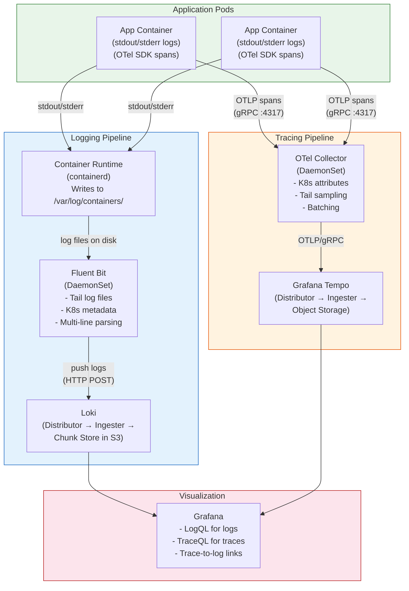

# Logging and Tracing

## 1. Overview

Logging and tracing are the two non-metric pillars of observability that answer fundamentally different questions. **Logging** captures discrete events -- a request arrived, an error occurred, a configuration changed -- as human-readable or structured text. **Tracing** captures the journey of a single request as it flows across services, recording timing, dependencies, and context at each hop. Together with metrics, they form the "three pillars of observability."

In Kubernetes, both logging and tracing have unique operational concerns. Containers write logs to stdout/stderr, which the container runtime captures and stores on the node's filesystem -- but nodes are ephemeral, so logs must be collected and shipped before nodes are terminated. Tracing requires instrumentation in application code (or auto-instrumentation via the OpenTelemetry Operator) and a collection pipeline that adds Kubernetes metadata (Pod name, namespace, node) to spans.

This document covers the logging pipeline (collection, aggregation, storage, querying) and the tracing pipeline (instrumentation, collection, storage, querying) in Kubernetes, including how to correlate logs with traces for rapid incident investigation.

## 2. Why It Matters

- **Metrics tell you something is wrong; logs tell you why.** A spike in 5xx errors shows up in Prometheus, but the stack trace explaining the root cause lives in logs. Without a logging pipeline, engineers SSH into nodes (if they still exist) to grep through container logs -- a process that does not scale beyond a handful of Pods.
- **Container logs are ephemeral by default.** When a Pod is terminated, restarted, or rescheduled, its logs are lost unless they have been collected. Kubernetes retains only the most recent container's logs on the node (configurable via `--container-log-max-files` and `--container-log-max-size` on the kubelet), and node termination erases everything.
- **Distributed tracing is essential for microservices.** A single user request in a Kubernetes microservices architecture may touch 5-15 services. Without distributed tracing, debugging latency issues requires correlating timestamps across multiple log streams -- a process that is error-prone and slow. Traces show the exact call chain, where time was spent, and which service introduced the error.
- **Kubernetes metadata enrichment is the differentiator.** A log line that says "connection refused" is far more useful when enriched with Pod name, namespace, node, Deployment, and container name. The logging pipeline adds this context automatically by reading the Kubernetes API or the Pod's metadata files.
- **Compliance and audit requirements.** Many regulatory frameworks (SOC 2, HIPAA, PCI-DSS) require centralized, tamper-evident log storage with defined retention periods. A Kubernetes logging pipeline with immutable storage (S3 with object lock) satisfies these requirements.
- **GenAI workloads produce unique log patterns.** LLM inference servers log model loading events (which can take minutes for large models), CUDA memory allocation failures, token generation traces, and request/response payloads that can be megabytes in size. Without proper multi-line log handling and log level filtering, these logs overwhelm storage and obscure actionable events.

## 3. Core Concepts

### Logging Concepts

- **Container Logging Model:** Kubernetes expects containers to write logs to stdout and stderr. The container runtime (containerd, CRI-O) captures these streams and writes them to files on the node's filesystem, typically at `/var/log/containers/<pod>_<namespace>_<container>-<id>.log`. This is the standard log source for collection agents.
- **DaemonSet Collection:** The standard pattern for log collection in Kubernetes. A logging agent (Fluent Bit, Fluentd, Promtail) runs as a DaemonSet, with one Pod per node. The agent reads log files from `/var/log/containers/` and ships them to a central backend. This approach requires no application changes and collects all container logs on the node.
- **Sidecar Collection:** An alternative pattern where a logging agent runs as a sidecar container within each application Pod. The sidecar shares a volume with the application container and reads logs from that volume. Used when applications write logs to files (not stdout), when you need per-application log processing, or when DaemonSet agents cannot access the node filesystem (e.g., serverless Kubernetes like Fargate).
- **Fluent Bit:** A lightweight, high-performance log processor and forwarder written in C. It has a small memory footprint (~5-10 MB per instance) and is designed for Kubernetes environments where thousands of nodes each need a log collection agent. Fluent Bit supports input plugins (tail, systemd, TCP), filter plugins (kubernetes metadata enrichment, grep, modify), and output plugins (Loki, Elasticsearch, S3, Kafka).
- **Fluentd:** A mature, feature-rich log aggregator written in Ruby with C extensions. It has a larger plugin ecosystem than Fluent Bit (700+ community plugins vs. ~100 for Fluent Bit) but consumes more resources (~40-100 MB per instance). Fluentd is often used as an aggregation layer that receives logs from Fluent Bit agents.
- **Loki:** A horizontally-scalable, multi-tenant log aggregation system built by Grafana Labs. Unlike Elasticsearch, Loki does **not** index the full text of log lines -- it indexes only metadata labels (namespace, Pod, container, stream) and stores compressed log chunks in object storage. This makes Loki significantly cheaper to operate but means full-text search requires scanning all chunks matching the label query.
- **Promtail:** The native log collection agent for Loki. Deployed as a DaemonSet, it discovers Pods via the Kubernetes API, reads their log files, attaches Kubernetes labels, and pushes to Loki. Promtail is purpose-built for Loki and has simpler configuration than Fluent Bit/Fluentd.
- **Structured Logging:** The practice of emitting log entries as machine-parseable records (typically JSON) rather than free-form text. Structured logs enable reliable field extraction, filtering, and aggregation. Example: `{"timestamp":"2025-01-15T10:30:00Z","level":"error","service":"payment","message":"charge failed","user_id":"u123","error":"timeout"}` vs. `ERROR 2025-01-15 10:30:00 payment: charge failed for user u123: timeout`.
- **Log Levels:** Standard severity classifications: TRACE, DEBUG, INFO, WARN, ERROR, FATAL. In production, applications should log at INFO level by default. DEBUG logging should be dynamically enableable per service (via ConfigMap or feature flag) for incident investigation without redeployment.
- **Multi-line Log Parsing:** Stack traces, SQL queries, and XML/JSON payloads often span multiple lines. Without multi-line parsing, each line appears as a separate log entry, making them unintelligible. Fluent Bit and Fluentd support multi-line parsers that concatenate lines matching a continuation pattern (e.g., lines starting with whitespace or not matching a timestamp pattern).

### Tracing Concepts

- **Distributed Trace:** A record of the path a request takes through a distributed system. A trace consists of one or more **spans**, each representing a unit of work (an HTTP request, a database query, a message queue publish). Spans are connected via parent-child relationships that form a tree (or DAG) structure.
- **Span:** The fundamental unit of a trace. Each span contains: a trace ID (shared across all spans in the trace), a span ID (unique), a parent span ID (to build the tree), an operation name, start and end timestamps, status (OK, ERROR), and arbitrary key-value **attributes**. In Kubernetes, spans are enriched with attributes like `k8s.pod.name`, `k8s.namespace.name`, `k8s.deployment.name`, and `k8s.node.name`.
- **OpenTelemetry (OTel):** The CNCF project that provides a vendor-neutral standard for instrumentation, collection, and export of telemetry data (traces, metrics, logs). OpenTelemetry defines: SDKs for instrumentation (Java, Python, Go, Node.js, etc.), the OTLP protocol for data transport, and the OpenTelemetry Collector for receiving, processing, and exporting telemetry.
- **OpenTelemetry Collector:** A vendor-agnostic proxy that receives telemetry data (via OTLP, Jaeger, Zipkin formats), processes it (batching, sampling, attribute addition), and exports it to backends (Jaeger, Tempo, Zipkin, commercial APMs). Deployed as a DaemonSet in Kubernetes for node-level collection or as a Deployment for centralized aggregation.
- **OpenTelemetry Auto-Instrumentation Operator:** A Kubernetes operator that injects instrumentation into application Pods without code changes. You annotate a Pod or namespace with `instrumentation.opentelemetry.io/inject-java: "true"` (or python, nodejs, dotnet, go), and the operator injects an init container that adds the OTel SDK agent. This enables tracing for applications that do not have manual instrumentation.
- **Jaeger:** An open-source, distributed tracing platform originally built by Uber. Jaeger provides a UI for trace visualization, supports multiple storage backends (Cassandra, Elasticsearch, Kafka, Badger), and includes features like trace comparison and service dependency graphs.
- **Grafana Tempo:** A high-scale, cost-efficient trace storage backend built by Grafana Labs. Like Loki for logs, Tempo stores traces in object storage without indexing -- it relies on trace IDs for lookup and integrates with Grafana for visualization. Tempo is significantly cheaper to operate than Jaeger with Elasticsearch.
- **Trace-to-Log Correlation:** The practice of linking a trace span to the corresponding log entries. This is achieved by including the trace ID in log entries (via MDC in Java, logging context in Python) and configuring Grafana to generate "derived fields" that create clickable links from log lines to traces and vice versa.
- **Sampling:** Not all traces need to be stored -- at high request volumes, storing every trace is prohibitively expensive. Sampling strategies include: **head-based sampling** (decide at the start of a trace; e.g., sample 10% of requests), **tail-based sampling** (decide after the trace completes; sample 100% of errors and slow requests, 1% of fast successes), and **adaptive sampling** (adjust rate based on traffic volume).

## 4. How It Works

### Logging Pipeline: DaemonSet Collection with Fluent Bit and Loki

**Step 1: Container writes to stdout/stderr.**

The application container writes logs to stdout. The container runtime (containerd) captures the output and writes it to a JSON-formatted file on the node:

```
/var/log/containers/my-app-7b9c5d-abc_production_app-<container-id>.log
```

Each line in this file is a JSON object:

```json
{"log":"2025-01-15T10:30:00Z ERROR payment: charge failed for user u123\n","stream":"stderr","time":"2025-01-15T10:30:00.123456789Z"}
```

**Step 2: Fluent Bit DaemonSet tails log files.**

Fluent Bit runs as a DaemonSet with a hostPath volume mount for `/var/log/containers/`. Its `tail` input plugin watches for new log files and reads new lines as they appear. Fluent Bit maintains a position database (stored on the node) so it can resume after restarts without re-reading old data.

**Step 3: Kubernetes metadata enrichment.**

Fluent Bit's `kubernetes` filter plugin reads the Pod's metadata from the Kubernetes API (or from the downward API files on disk) and enriches each log entry with:

- `kubernetes.pod_name`
- `kubernetes.namespace_name`
- `kubernetes.container_name`
- `kubernetes.labels.*`
- `kubernetes.annotations.*`
- `kubernetes.host` (node name)

**Step 4: Log processing and filtering.**

Additional Fluent Bit filters can:
- Parse JSON log bodies into structured fields
- Handle multi-line stack traces
- Drop DEBUG-level logs in production
- Add custom fields (cluster name, environment)
- Redact sensitive data (PII, tokens)

**Step 5: Forward to Loki.**

Fluent Bit's Loki output plugin sends log entries to the Loki gateway. Loki indexes the Kubernetes metadata labels and stores the log content in compressed chunks on object storage (S3, GCS, MinIO).

**Step 6: Query via Grafana.**

Users query logs in Grafana using LogQL:

```logql
{namespace="production", container="my-app"} |= "charge failed" | json | level="error"
```

### Fluent Bit Configuration Example

```yaml
apiVersion: v1
kind: ConfigMap
metadata:
  name: fluent-bit-config
  namespace: logging
data:
  fluent-bit.conf: |
    [SERVICE]
        Flush        5
        Log_Level    info
        Daemon       Off
        Parsers_File parsers.conf

    [INPUT]
        Name             tail
        Path             /var/log/containers/*.log
        Parser           cri
        Tag              kube.*
        Refresh_Interval 10
        Mem_Buf_Limit    10MB
        Skip_Long_Lines  On
        DB               /var/log/fluent-bit-tail.db

    [FILTER]
        Name                kubernetes
        Match               kube.*
        Kube_URL            https://kubernetes.default.svc:443
        Kube_CA_File        /var/run/secrets/kubernetes.io/serviceaccount/ca.crt
        Kube_Token_File     /var/run/secrets/kubernetes.io/serviceaccount/token
        Merge_Log           On
        Keep_Log            Off
        K8S-Logging.Parser  On
        K8S-Logging.Exclude On

    [FILTER]
        Name    grep
        Match   kube.*
        Exclude log ^DEBUG

    [OUTPUT]
        Name       loki
        Match      kube.*
        Host       loki-gateway.logging.svc.cluster.local
        Port       80
        Labels     job=fluent-bit, namespace=$kubernetes['namespace_name'], pod=$kubernetes['pod_name'], container=$kubernetes['container_name']
        Auto_Kubernetes_Labels Off
        Line_Format json

  parsers.conf: |
    [PARSER]
        Name        cri
        Format      regex
        Regex       ^(?<time>[^ ]+) (?<stream>stdout|stderr) (?<logtag>[^ ]*) (?<log>.*)$
        Time_Key    time
        Time_Format %Y-%m-%dT%H:%M:%S.%L%z

    [PARSER]
        Name        multiline-java
        Format      regex
        Regex       ^(?<time>\d{4}-\d{2}-\d{2}T\d{2}:\d{2}:\d{2})
        Time_Key    time
```

### Fluent Bit DaemonSet Deployment

```yaml
apiVersion: apps/v1
kind: DaemonSet
metadata:
  name: fluent-bit
  namespace: logging
spec:
  selector:
    matchLabels:
      app: fluent-bit
  template:
    metadata:
      labels:
        app: fluent-bit
    spec:
      serviceAccountName: fluent-bit
      tolerations:
        - operator: Exists   # Run on ALL nodes, including tainted GPU nodes
      containers:
        - name: fluent-bit
          image: fluent/fluent-bit:3.0
          resources:
            requests:
              cpu: 50m
              memory: 64Mi
            limits:
              cpu: 200m
              memory: 128Mi
          volumeMounts:
            - name: varlog
              mountPath: /var/log
              readOnly: true
            - name: config
              mountPath: /fluent-bit/etc/
      volumes:
        - name: varlog
          hostPath:
            path: /var/log
        - name: config
          configMap:
            name: fluent-bit-config
```

### Fluent Bit vs. Fluentd: Resource Comparison

| Dimension | Fluent Bit | Fluentd |
|---|---|---|
| **Language** | C | Ruby + C extensions |
| **Memory footprint** | ~5-10 MB per instance | ~40-100 MB per instance |
| **CPU usage** | ~0.05-0.1 CPU core per node | ~0.2-0.5 CPU core per node |
| **Plugin ecosystem** | ~100 built-in plugins | 700+ community plugins |
| **Processing model** | Single-threaded with coroutines | Multi-threaded (workers) |
| **Configuration** | INI-style (simpler) | XML/Ruby DSL (more powerful) |
| **Best for** | Edge collection (DaemonSet on nodes) | Aggregation layer, complex transformations |
| **Startup time** | ~100ms | ~2-5 seconds |
| **Deployment pattern** | DaemonSet (per-node collector) | Deployment (centralized aggregator) |

**Common pattern:** Fluent Bit on every node (lightweight collection) forwarding to a Fluentd aggregator (complex routing, transformation, buffering) forwarding to the final backend. However, for Loki backends, Fluent Bit can ship directly without Fluentd.

### DaemonSet vs. Sidecar Collection

| Aspect | DaemonSet | Sidecar |
|---|---|---|
| **Resource overhead** | 1 agent per node (shared across all Pods) | 1 agent per Pod (multiplicative) |
| **Deployment** | Cluster-wide, managed by platform team | Per-application, managed by app team |
| **Log source** | Node-level files (/var/log/containers/) | Shared volume or localhost socket |
| **Use when** | Standard Kubernetes with node access | Fargate/serverless, file-based logging, per-app routing |
| **Isolation** | Shared configuration across all Pods on node | Per-Pod configuration |
| **Cluster of 100 Pods on 10 nodes** | 10 Fluent Bit instances | 100 Fluent Bit sidecar instances |

### Multi-line Log Parsing

Multi-line logs (stack traces, JSON payloads) are one of the most common operational challenges in Kubernetes logging. The container runtime writes each line of output as a separate log entry. Without multi-line handling, a Java stack trace becomes 20+ individual log entries that are impossible to correlate.

**Fluent Bit multi-line configuration:**

```ini
[MULTILINE_PARSER]
    Name          java-multiline
    Type          regex
    Flush_Timeout 1000
    # Match lines that start with a timestamp (new log entry)
    Rule          "start_state"  "/^\d{4}-\d{2}-\d{2}/"  "cont"
    # Everything else is a continuation
    Rule          "cont"         "/^(?!\d{4}-\d{2}-\d{2})/"  "cont"

[INPUT]
    Name              tail
    Path              /var/log/containers/my-java-app*.log
    Multiline.Parser  java-multiline
    Tag               kube.java.*
```

### Structured Logging Best Practices

1. **Use JSON format.** All application logs should be JSON objects with consistent field names. This eliminates the need for regex-based parsing in the logging pipeline and enables reliable filtering and aggregation.

2. **Standard fields.** Every log entry should include:
   - `timestamp` (ISO 8601 format)
   - `level` (INFO, WARN, ERROR, etc.)
   - `message` (human-readable description)
   - `service` (service name)
   - `trace_id` (if tracing is enabled)
   - `span_id` (if tracing is enabled)

3. **Avoid logging sensitive data.** Never log passwords, tokens, API keys, or PII in plain text. Use redaction filters in the logging pipeline as a safety net, but the primary defense is application-level discipline.

4. **Use log levels correctly:**
   - **ERROR:** Something failed that requires investigation. The system could not complete the requested operation.
   - **WARN:** Something unexpected happened, but the system handled it. May require future attention.
   - **INFO:** Significant business events (request received, payment processed, user logged in). The default production level.
   - **DEBUG:** Detailed diagnostic information. Must be dynamically enableable without redeployment.

5. **Include request context.** Log entries for request processing should include the request ID, user ID (hashed), endpoint, and HTTP method. This enables filtering logs to a single user's experience.

```json
{
  "timestamp": "2025-01-15T10:30:00.123Z",
  "level": "ERROR",
  "service": "payment-service",
  "message": "Charge failed: timeout connecting to payment gateway",
  "trace_id": "abc123def456",
  "span_id": "789ghi",
  "request_id": "req-001",
  "user_id_hash": "sha256:a1b2c3",
  "endpoint": "/api/v1/charges",
  "http_method": "POST",
  "duration_ms": 5023,
  "error_type": "TimeoutException"
}
```

### Tracing Pipeline: OpenTelemetry on Kubernetes

**Step 1: Instrument the application.**

Applications are instrumented using OpenTelemetry SDKs. For example, in Python:

```python
from opentelemetry import trace
from opentelemetry.sdk.trace import TracerProvider
from opentelemetry.exporter.otlp.proto.grpc.trace_exporter import OTLPSpanExporter
from opentelemetry.sdk.trace.export import BatchSpanProcessor

provider = TracerProvider()
processor = BatchSpanProcessor(OTLPSpanExporter(endpoint="otel-collector:4317"))
provider.add_span_processor(processor)
trace.set_tracer_provider(provider)

tracer = trace.get_tracer("payment-service")

@tracer.start_as_current_span("process_payment")
def process_payment(user_id, amount):
    span = trace.get_current_span()
    span.set_attribute("user.id", user_id)
    span.set_attribute("payment.amount", amount)
    # ... business logic
```

Alternatively, use the **OpenTelemetry Operator** for auto-instrumentation:

```yaml
apiVersion: opentelemetry.io/v1alpha1
kind: Instrumentation
metadata:
  name: auto-instrumentation
  namespace: production
spec:
  exporter:
    endpoint: http://otel-collector.observability:4317
  propagators:
    - tracecontext
    - baggage
  sampler:
    type: parentbased_traceidratio
    argument: "0.1"  # Sample 10% of traces
  java:
    image: ghcr.io/open-telemetry/opentelemetry-operator/autoinstrumentation-java:latest
  python:
    image: ghcr.io/open-telemetry/opentelemetry-operator/autoinstrumentation-python:latest
  nodejs:
    image: ghcr.io/open-telemetry/opentelemetry-operator/autoinstrumentation-nodejs:latest
```

Then annotate Pods:

```yaml
apiVersion: apps/v1
kind: Deployment
metadata:
  name: payment-service
spec:
  template:
    metadata:
      annotations:
        instrumentation.opentelemetry.io/inject-java: "true"
    spec:
      containers:
        - name: payment
          image: payment-service:v1.2.3
```

**Step 2: Collect via OpenTelemetry Collector.**

The OTel Collector runs as a DaemonSet, receiving spans from application Pods on the same node via gRPC (port 4317) or HTTP (port 4318):

```yaml
apiVersion: opentelemetry.io/v1beta1
kind: OpenTelemetryCollector
metadata:
  name: otel-collector
  namespace: observability
spec:
  mode: daemonset
  config:
    receivers:
      otlp:
        protocols:
          grpc:
            endpoint: 0.0.0.0:4317
          http:
            endpoint: 0.0.0.0:4318

    processors:
      batch:
        timeout: 5s
        send_batch_size: 1024

      k8sattributes:
        extract:
          metadata:
            - k8s.pod.name
            - k8s.namespace.name
            - k8s.deployment.name
            - k8s.node.name
            - k8s.pod.uid
          labels:
            - tag_name: app
              key: app
              from: pod
        pod_association:
          - sources:
              - from: resource_attribute
                name: k8s.pod.ip

      tail_sampling:
        decision_wait: 10s
        policies:
          - name: errors-always
            type: status_code
            status_code:
              status_codes: [ERROR]
          - name: slow-requests
            type: latency
            latency:
              threshold_ms: 2000
          - name: baseline
            type: probabilistic
            probabilistic:
              sampling_percentage: 10

    exporters:
      otlp/tempo:
        endpoint: tempo-distributor.observability:4317
        tls:
          insecure: true

    service:
      pipelines:
        traces:
          receivers: [otlp]
          processors: [k8sattributes, tail_sampling, batch]
          exporters: [otlp/tempo]
```

**Step 3: Store in Grafana Tempo (or Jaeger).**

Tempo stores traces in object storage (S3/GCS) with a minimal index. Jaeger stores in Elasticsearch or Cassandra with full indexing. The choice depends on query patterns:

| Feature | Grafana Tempo | Jaeger (Elasticsearch) |
|---|---|---|
| **Storage cost** | Low (object storage only) | High (Elasticsearch cluster) |
| **Lookup by trace ID** | Fast (index-free, bloom filters) | Fast (indexed) |
| **Search by attributes** | Requires Tempo 2.0+ search or TraceQL | Native (Elasticsearch query) |
| **Retention** | Cheap to retain months/years | Expensive at scale |
| **Operational complexity** | Low (stateless query, object storage) | High (Elasticsearch cluster management) |
| **Grafana integration** | Native (same ecosystem) | Good (plugin) |

**Step 4: Visualize and correlate in Grafana.**

Grafana provides:
- Trace view (flame graph showing span hierarchy and timing)
- Service map (auto-generated from trace data)
- Trace-to-log links (click a span to see the corresponding logs in Loki)
- Trace-to-metric links (click a span to see the corresponding metric dashboard)

### Trace-to-Log Correlation

The key to correlation is a shared **trace ID** that appears in both spans and log entries:

1. **Application emits trace ID in logs.** The OpenTelemetry SDK provides the current trace ID via the trace context. Logging frameworks (Log4j2, Python logging, Winston) can be configured to automatically include `trace_id` and `span_id` in every log entry.

2. **Grafana derived fields.** In the Loki data source configuration, define a derived field that matches the `trace_id` field in log lines and creates a link to Tempo:

```yaml
# Grafana Loki datasource configuration
derivedFields:
  - datasourceUid: tempo-datasource
    matcherRegex: '"trace_id":"([a-f0-9]+)"'
    name: TraceID
    url: '$${__value.raw}'
```

3. **Span-to-log link.** In Tempo, configure a "Logs" link that queries Loki for the trace ID:

```yaml
# Grafana Tempo datasource configuration
tracesToLogs:
  datasourceUid: loki-datasource
  tags: ['namespace', 'pod']
  filterByTraceID: true
  filterBySpanID: false
  lokiSearch: true
```

This bidirectional linking enables workflows like: "I see a slow trace span in Tempo" -> click -> "Here are the ERROR log entries from that exact request" -> "The database query timed out because the connection pool was exhausted."

### Span Attributes for Kubernetes Metadata

The `k8sattributes` processor in the OTel Collector enriches every span with Kubernetes context. Standard attributes from the OpenTelemetry Semantic Conventions:

| Attribute | Source | Example |
|---|---|---|
| `k8s.pod.name` | Kubernetes API | `payment-service-7b9c5d-abc` |
| `k8s.namespace.name` | Kubernetes API | `production` |
| `k8s.deployment.name` | Kubernetes API / owner reference | `payment-service` |
| `k8s.node.name` | Kubernetes API | `ip-10-0-1-42.ec2.internal` |
| `k8s.container.name` | Kubernetes API | `payment` |
| `k8s.pod.uid` | Kubernetes API | `d4e5f6a7-...` |
| `k8s.cluster.name` | Configuration | `prod-us-east-1` |
| `service.name` | OTel SDK or env var `OTEL_SERVICE_NAME` | `payment-service` |
| `service.version` | OTel SDK or env var `OTEL_SERVICE_VERSION` | `v1.2.3` |

These attributes enable filtering traces by namespace, deployment, or node -- critical for multi-tenant clusters where you need to scope visibility to a specific team's services.

## 5. Architecture / Flow



## 6. Types / Variants

### Logging Stack Options

| Stack | Collection | Storage | Query | Best For |
|---|---|---|---|---|
| **Loki Stack (Loki + Promtail + Grafana)** | Promtail DaemonSet | Loki (object storage) | LogQL in Grafana | Cost-efficient, Grafana-native |
| **Loki + Fluent Bit + Grafana** | Fluent Bit DaemonSet | Loki (object storage) | LogQL in Grafana | More flexible than Promtail, same backend |
| **EFK (Elasticsearch + Fluentd + Kibana)** | Fluentd DaemonSet | Elasticsearch | KQL in Kibana | Full-text search, complex queries |
| **EFK with Fluent Bit** | Fluent Bit → Fluentd → Elasticsearch | Elasticsearch | KQL in Kibana | Lightweight collection, powerful aggregation |
| **CloudWatch (AWS)** | Fluent Bit DaemonSet | CloudWatch Logs | CloudWatch Insights | AWS-native, minimal ops |
| **Google Cloud Logging** | Built-in GKE integration | Cloud Logging | Log Explorer | GKE-native, minimal ops |
| **Datadog Logs** | Datadog Agent DaemonSet | Datadog SaaS | Datadog Log Explorer | Full-stack commercial |

### Tracing Stack Options

| Stack | Collection | Storage | Query/UI | Best For |
|---|---|---|---|---|
| **OTel + Tempo + Grafana** | OTel Collector | Tempo (object storage) | TraceQL in Grafana | Cost-efficient, Grafana-native |
| **OTel + Jaeger** | OTel Collector | Elasticsearch or Cassandra | Jaeger UI | Feature-rich trace search |
| **OTel + Zipkin** | OTel Collector | MySQL or Cassandra | Zipkin UI | Simple deployments |
| **AWS X-Ray** | X-Ray SDK or OTel | X-Ray service | X-Ray console | AWS-native |
| **Datadog APM** | Datadog Agent | Datadog SaaS | Datadog UI | Full-stack commercial |

### OpenTelemetry Collector Deployment Modes

| Mode | Deployment | Use Case | Tradeoffs |
|---|---|---|---|
| **DaemonSet** | One Collector per node | Standard collection; low network overhead (Pod-to-local-node) | Cannot do tail-based sampling (needs full trace) |
| **Deployment (Gateway)** | Centralized pool of replicas | Aggregation, tail-based sampling, multi-backend routing | Network hop from Pod to gateway; single point of load |
| **Sidecar** | One Collector per Pod | Per-app configuration; Fargate/serverless | High resource overhead |
| **DaemonSet + Gateway** | DaemonSet forwards to Gateway Deployment | Best of both: local collection + centralized processing | Two-tier architecture, more configuration |

The recommended production pattern is **DaemonSet + Gateway**: DaemonSet collectors handle local collection and k8s attribute enrichment, then forward to a Gateway Deployment that performs tail-based sampling and exports to backends.

## 7. Use Cases

- **Debugging a 500 error in a microservices chain.** A user reports an error. The on-call engineer searches Loki for the request ID in the error logs, finds the trace ID, clicks through to Tempo, and sees the full trace: the payment service called the fraud detection service, which timed out calling a third-party API. Total investigation time: 2 minutes instead of 30 minutes of manual log correlation.
- **Detecting and alerting on error log spikes.** A Loki recording rule counts ERROR-level logs per service per minute. When the error rate exceeds the baseline by 3x, an alert fires via Alertmanager. This catches issues that do not manifest in metrics (e.g., a library logging errors but returning 200 status codes).
- **Compliance audit trail.** All API access logs (who accessed what resource at what time) are collected via Fluent Bit, stored in Loki with immutable S3 backend (object lock), and retained for 7 years. Auditors query logs via Grafana with pre-built dashboards for access patterns.
- **Tracing GenAI inference requests.** An LLM inference request is traced from the API gateway through the load balancer, to the vLLM inference server, including GPU queue time, prompt tokenization, and token generation. Each span includes model name, token counts, and GPU device ID. This enables model-level latency analysis.
- **Optimizing multi-line log parsing for Java applications.** A team deploying Spring Boot services on Kubernetes discovers their stack traces are split across dozens of log entries in Loki. They configure Fluent Bit multi-line parsing with a Java-specific regex, and stack traces now appear as single log entries, making error investigation dramatically faster.
- **Auto-instrumentation rollout for legacy services.** A platform team installs the OpenTelemetry Operator and annotates namespaces for Java auto-instrumentation. Within an hour, all Java services emit traces without any code changes. The service dependency map in Grafana immediately reveals undocumented dependencies between services.
- **Tail-based sampling for cost control.** A high-traffic service generates 10,000 traces per second. Storing all traces would cost $50,000/month in Tempo storage. By configuring tail-based sampling (100% of errors and slow requests, 5% of fast successes), trace storage cost drops to $8,000/month while retaining full visibility into problems.

## 8. Tradeoffs

| Decision | Option A | Option B | Guidance |
|---|---|---|---|
| **Loki vs. Elasticsearch** | Loki: cheap storage (object storage), label-based indexing, limited search | Elasticsearch: expensive (cluster), full-text indexing, powerful search | Loki for cost-sensitive, Grafana-native stacks; Elasticsearch when full-text search across billions of logs is a hard requirement |
| **Promtail vs. Fluent Bit** | Promtail: purpose-built for Loki, simpler config | Fluent Bit: vendor-agnostic, richer processing, multiple output targets | Fluent Bit if you might switch backends or need complex transformations; Promtail for simplest Loki deployment |
| **DaemonSet vs. Sidecar collection** | DaemonSet: lower resource overhead (shared per node) | Sidecar: per-Pod isolation, works on serverless | DaemonSet for standard Kubernetes; sidecar for Fargate, file-based logging, or per-app routing needs |
| **Jaeger vs. Tempo** | Jaeger: mature, feature-rich UI, indexed search | Tempo: cheaper (object storage), simpler ops, Grafana-native | Tempo for cost-sensitive and Grafana-native; Jaeger when indexed trace search is critical |
| **Head-based vs. Tail-based sampling** | Head: simple, deterministic, low overhead | Tail: smarter (keeps errors/slow), requires buffering full traces | Tail-based for production (captures all important traces); head-based for development or low-traffic services |
| **Full OTel Collector vs. direct SDK export** | Collector: decouples app from backend, adds K8s metadata, enables sampling | Direct export: fewer components, simpler architecture | Always use a Collector in Kubernetes -- the K8s metadata enrichment and central configuration are essential |

## 9. Common Pitfalls

- **Not setting `tolerations` on logging DaemonSets.** If GPU nodes or other specialized nodes have taints, the Fluent Bit DaemonSet will not schedule on them, and you lose logs from those nodes entirely. Always set `tolerations: [{operator: Exists}]` on logging DaemonSets to ensure universal coverage.
- **Ignoring log volume and storage costs.** A single chatty application logging at DEBUG level can generate 10+ GB/day per Pod. At scale, this overwhelms the logging pipeline and costs more than the application itself. Enforce log level discipline (INFO in production) and set ingestion rate limits in Loki.
- **Not configuring multi-line parsing.** Without multi-line handling, every line of a Java stack trace, Python traceback, or JSON payload becomes a separate log entry. This makes error investigation extremely difficult and inflates log counts. Configure multi-line parsers for every language runtime in your cluster.
- **Losing logs during node termination.** When a node is terminated (spot instance reclamation, autoscaler scale-down), Fluent Bit may not have finished flushing buffered logs. Mitigate with: (1) a preStop lifecycle hook with a sleep to allow flushing, (2) small flush intervals (1-5 seconds), and (3) a PVC or hostPath for the Fluent Bit buffer to survive container restarts (though not node termination).
- **Not including trace IDs in logs.** Without trace IDs in log entries, trace-to-log correlation is impossible. Configuring this requires one-time setup in the logging framework (MDC in Java, context in Python) and is the single highest-value investment in observability correlation.
- **Over-sampling traces in production.** Storing 100% of traces for a service handling 50,000 requests per second generates terabytes of trace data per day. Use tail-based sampling to keep all error and slow traces while sampling a small percentage of successful fast traces.
- **Running the OTel Collector without resource limits.** The OTel Collector can consume unbounded memory when buffering large volumes of spans for tail-based sampling. Always set memory limits on the Collector and configure the `memory_limiter` processor to shed load before OOM.
- **Deploying auto-instrumentation without testing.** The OTel auto-instrumentation operator injects agents that add latency overhead (typically 1-5ms per span) and memory overhead (50-150 MB for the Java agent). Test in staging before rolling out to production, and monitor application latency before and after.

## 10. Real-World Examples

- **Grafana Labs (Loki + Tempo stack):** Operates the Loki + Tempo + Grafana stack at massive scale for their own infrastructure and Grafana Cloud customers. Their internal Kubernetes clusters process hundreds of terabytes of logs per day through Loki, stored in S3 with 90-day retention. They use the DaemonSet + Gateway OTel Collector pattern for tracing.
- **Uber (Jaeger origin):** Created Jaeger to manage distributed tracing across their thousands of microservices. At peak, Uber's Jaeger deployment stored billions of spans per day in Cassandra. Their key insight: tail-based sampling was essential to keep storage costs manageable while retaining 100% of error traces for debugging.
- **Shopify:** Uses Fluent Bit as a DaemonSet across all Kubernetes nodes, forwarding to a centralized log pipeline. They process billions of log entries per day and use structured JSON logging exclusively -- no free-form text logs allowed. Their log pipeline includes real-time alerting on error patterns.
- **Airbnb:** Implemented OpenTelemetry across their Kubernetes microservices architecture. Their platform team rolled out auto-instrumentation via the OTel Operator, achieving tracing coverage for 200+ services in weeks instead of months. They use trace data to automatically generate service dependency maps that are used in incident response.
- **Pinterest:** Migrated from a custom tracing solution to OpenTelemetry when moving to Kubernetes. They reported a 60% reduction in mean-time-to-detection for latency issues after deploying distributed tracing with Kubernetes metadata enrichment, because engineers could immediately see which Pod on which node was causing slowdowns.

## 11. Related Concepts

- [Monitoring and Metrics](./01-monitoring-and-metrics.md) -- metrics complement logs and traces for full observability
- [Cost Observability](./03-cost-observability.md) -- log and trace storage costs are a significant budget item
- [SLO-Based Operations](./04-slo-based-operations.md) -- trace data feeds SLI calculations (latency percentiles)
- [Monitoring (Traditional)](../../traditional-system-design/10-observability/01-monitoring.md) -- foundational monitoring concepts
- [Logging (Traditional)](../../traditional-system-design/10-observability/02-logging.md) -- logging fundamentals that apply beyond Kubernetes
- [LLM Observability](../../genai-system-design/09-evaluation/04-llm-observability.md) -- observability for GenAI applications including prompt/response logging
- [Kubernetes Architecture](../01-foundations/01-kubernetes-architecture.md) -- container logging model, DaemonSets, and node architecture

## 12. Source Traceability

- source/youtube-video-reports/1.md -- Container runtime hierarchy and Kubernetes architectural context for log collection
- OpenTelemetry documentation (opentelemetry.io) -- Collector configuration, auto-instrumentation operator, semantic conventions for Kubernetes
- Grafana Loki documentation (grafana.com/docs/loki) -- LogQL, Loki architecture, Promtail configuration
- Grafana Tempo documentation (grafana.com/docs/tempo) -- TraceQL, trace storage, trace-to-log configuration
- Fluent Bit documentation (docs.fluentbit.io) -- Kubernetes filter, tail input, multi-line parsing, Loki output
- Jaeger documentation (jaegertracing.io) -- Distributed tracing architecture, sampling strategies
- CNCF OpenTelemetry Operator documentation (github.com/open-telemetry/opentelemetry-operator) -- Auto-instrumentation specification
