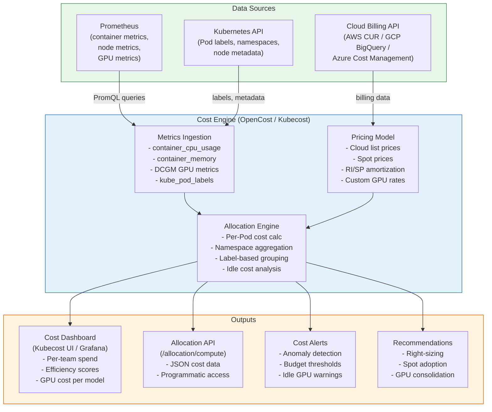

# Cost Observability

## 1. Overview

Cost observability is the practice of measuring, attributing, and optimizing the financial cost of running workloads on Kubernetes. Unlike traditional infrastructure where costs map cleanly to machines and teams, Kubernetes introduces a shared resource model: multiple teams run workloads on shared nodes, and the relationship between a Pod's resource consumption and its cloud bill is opaque without specialized tooling.

Tools like **Kubecost** and **OpenCost** solve this by combining Kubernetes resource metrics (from Prometheus) with cloud pricing data to produce per-namespace, per-label, per-team cost breakdowns. They surface idle resources, over-provisioned workloads, and cost anomalies -- transforming Kubernetes from a financial black box into a system where every dollar of spend is attributable to a team, service, or model.

In GenAI environments, cost observability is critical because GPU compute is the dominant expense. A single A100 GPU-equipped node costs $25,000-$35,000/month on-demand. Without GPU cost attribution per model and per team, organizations routinely discover that 40-60% of their GPU spend goes to underutilized inference servers or training jobs that could run on cheaper hardware.

## 2. Why It Matters

- **Kubernetes makes cost invisible by default.** The cloud bill shows EC2 instances, EBS volumes, and data transfer -- not which team or service consumed what. A 100-node cluster with 20 teams requires active instrumentation to answer "who is spending what?"
- **Over-provisioning is the default behavior.** Teams request resources based on worst-case estimates and never reduce them. Without visibility into the gap between requested and used resources, 30-50% of cluster capacity sits idle but allocated (and billed).
- **GPU costs dominate GenAI budgets.** For organizations running LLM training and inference, GPU compute can represent 80-90% of the total Kubernetes cost. A single misconfigured inference deployment with 8 A100 GPUs sitting idle overnight costs $200-300 per night.
- **FinOps requires attribution data.** The FinOps framework (inform, optimize, operate) cannot function without accurate cost data. Cost observability provides the "inform" foundation: you cannot optimize what you cannot measure, and you cannot hold teams accountable without attribution.
- **Source material context.** The source material explicitly states that 70-80% of cluster expenses are tied to compute, with storage at 10-15% and network/misc at 10%. OpenCost, integrated with Prometheus, translates CPU and memory usage into actual currency, enabling teams to baseline their resource requests against actual spend.

## 3. Core Concepts

- **Cost Allocation:** The process of assigning infrastructure costs to business units, teams, namespaces, labels, or individual workloads. In Kubernetes, this is done by multiplying each Pod's resource consumption (CPU hours, memory-hours, GPU-hours) by the per-unit cost derived from cloud pricing. The result is a breakdown showing "Team X spent $Y this month."
- **Showback:** A cost visibility model where teams are shown their costs but not charged. Used in organizations transitioning to cost-aware culture. Teams receive monthly reports showing their spend and waste, but there is no financial consequence. Showback is the first step toward chargeback.
- **Chargeback:** A cost accountability model where teams are financially charged for their Kubernetes resource consumption. The infrastructure team bills each team based on their actual usage (or allocation). This requires accurate cost data, agreed-upon allocation methods, and organizational buy-in. Chargeback creates strong incentives to optimize but can create political friction.
- **Idle Cost:** The cost of resources that are allocated (requested) but not used. If a Deployment requests 4 CPU cores but only uses 1.5 on average, the idle cost is the price of 2.5 unused CPU cores. Idle cost is the single largest source of waste in most Kubernetes clusters. At the cluster level, idle cost includes unallocatable resources (system reserved, kube reserved) and the gap between total node capacity and total Pod requests.
- **Efficiency (Usage vs. Request):** The ratio of actual resource usage to requested resources, expressed as a percentage. An efficiency of 40% means the workload uses only 40% of what it requested. The remaining 60% is wasted -- other Pods cannot use it because the scheduler treats requests as reservations.
- **OpenCost:** An open-source, CNCF sandbox project for Kubernetes cost monitoring. OpenCost runs as a single Pod that reads metrics from Prometheus and cloud pricing from provider APIs, then exposes cost allocation data via an API. It is the cost engine behind Kubecost's open-source tier and provides namespace, label, and controller-level cost breakdowns.
- **Kubecost:** A commercial Kubernetes cost management platform built on OpenCost. Kubecost adds a web UI, cost anomaly detection, savings recommendations, cloud billing integration (AWS CUR, GCP billing export, Azure cost management), network cost tracking, and multi-cluster aggregation on top of the OpenCost engine. Available in free tier (single cluster), Business, and Enterprise editions.
- **GPU Cost Attribution:** The process of assigning GPU costs to specific workloads, models, or teams. Because GPUs are expensive ($3-4/hour for A100) and often shared via time-slicing or MIG (Multi-Instance GPU), accurate attribution requires correlating DCGM metrics with Pod labels that identify the model and team.
- **Cloud Billing Integration:** The process of ingesting actual cloud billing data (AWS Cost and Usage Report, GCP BigQuery billing export, Azure Cost Management) to reconcile Kubernetes cost estimates with real invoices. Without this, cost models rely on list prices, which do not reflect discounts (Reserved Instances, Savings Plans, Committed Use Discounts).
- **Cost Anomaly Detection:** Automated identification of unexpected cost changes -- a namespace's daily spend doubling overnight, a new deployment consuming 10x more GPU than expected, or spot instance fallback to on-demand causing a price spike. Anomaly detection compares current costs against historical baselines and alerts when deviations exceed thresholds.
- **FinOps:** A cultural practice and operational model that brings financial accountability to cloud spend. The FinOps lifecycle has three phases: **Inform** (visibility into who is spending what), **Optimize** (right-size, terminate idle, use commitments), and **Operate** (continuous governance via policies and automation). Cost observability is the foundation of the Inform phase.
- **Right-sizing Recommendations:** Suggestions to adjust resource requests and limits based on actual usage. If a Pod requests 2 CPU but consistently uses 0.3 CPU, a right-sizing recommendation suggests reducing the request to 0.5 CPU (with headroom). Tools like Kubecost, Goldilocks (VPA-based), and cloud provider tools generate these recommendations.

## 4. How It Works

### OpenCost Architecture

OpenCost is a single Go binary deployed as a Pod in the Kubernetes cluster. It performs three core functions:

1. **Metrics Collection.** OpenCost reads container resource metrics from Prometheus (or directly from the Kubernetes metrics API). Key metrics consumed:
   - `container_cpu_usage_seconds_total` -- actual CPU consumption
   - `container_memory_working_set_bytes` -- actual memory consumption
   - `kube_pod_container_resource_requests` -- CPU/memory requests
   - `kube_pod_container_resource_limits` -- CPU/memory limits
   - `kube_node_status_capacity` -- total node resources
   - `kube_node_labels` -- node metadata (instance type, region, spot vs. on-demand)
   - `DCGM_FI_DEV_GPU_UTIL` -- GPU utilization (if DCGM exporter is deployed)
   - `node_total_hourly_cost` -- custom metric from cloud pricing

2. **Pricing Model.** OpenCost maintains a pricing model that maps node instance types to per-hour costs. It supports:
   - **Cloud provider APIs:** Fetches list prices from AWS, GCP, and Azure pricing APIs
   - **Custom pricing:** For on-premises or air-gapped clusters, administrators define custom CPU, memory, and GPU per-hour costs
   - **Spot pricing:** Tracks actual spot prices via cloud APIs to accurately cost spot workloads
   - **Discount reflection:** When integrated with cloud billing data (CUR, BigQuery), OpenCost uses actual billed costs instead of list prices

3. **Cost Allocation Engine.** For each Pod, OpenCost calculates:
   ```
   Pod CPU Cost = max(cpu_request, cpu_usage) * node_cpu_hourly_rate * hours
   Pod Memory Cost = max(memory_request, memory_usage) * node_memory_hourly_rate * hours
   Pod GPU Cost = gpu_request * node_gpu_hourly_rate * hours
   Pod Network Cost = egress_bytes * per_GB_rate  (if network cost enabled)
   Pod PV Cost = pv_size_gb * storage_hourly_rate * hours
   ```

   Costs are then aggregated by namespace, label, controller (Deployment, StatefulSet), or custom allocation (via annotations).

### OpenCost Deployment

```yaml
apiVersion: apps/v1
kind: Deployment
metadata:
  name: opencost
  namespace: opencost
spec:
  replicas: 1
  selector:
    matchLabels:
      app: opencost
  template:
    metadata:
      labels:
        app: opencost
    spec:
      serviceAccountName: opencost
      containers:
        - name: opencost
          image: ghcr.io/opencost/opencost:latest
          ports:
            - containerPort: 9003   # API
            - containerPort: 9090   # Metrics
          env:
            - name: PROMETHEUS_SERVER_ENDPOINT
              value: "http://prometheus-kube-prometheus-prometheus.monitoring:9090"
            - name: CLOUD_PROVIDER_API_KEY
              value: ""  # Set for cloud billing integration
            - name: CLUSTER_ID
              value: "prod-us-east-1"
          resources:
            requests:
              cpu: 100m
              memory: 256Mi
            limits:
              cpu: 500m
              memory: 1Gi
        - name: opencost-ui
          image: ghcr.io/opencost/opencost-ui:latest
          ports:
            - containerPort: 9090
          resources:
            requests:
              cpu: 10m
              memory: 32Mi
```

### Kubecost Architecture (Extends OpenCost)

Kubecost wraps OpenCost with additional features:

| Component | Purpose | Deployment |
|---|---|---|
| **Cost Analyzer** | Core allocation engine (OpenCost) + Kubecost extensions | Deployment |
| **Frontend** | Web UI for dashboards, reports, recommendations | Bundled with Cost Analyzer |
| **Aggregator** | Multi-cluster cost aggregation | Deployment (Enterprise) |
| **Cluster Agent** | Lightweight agent on secondary clusters | DaemonSet (Enterprise) |
| **Cloudcost** | Cloud billing data integration (CUR, BigQuery) | Sidecar or separate pod |
| **Network Costs** | DaemonSet that tracks inter-pod and egress network traffic | DaemonSet |
| **Prometheus** | Metrics backend (bundled or external) | StatefulSet |

```bash
helm repo add kubecost https://kubecost.github.io/cost-analyzer/
helm install kubecost kubecost/cost-analyzer \
  --namespace kubecost --create-namespace \
  --set kubecostToken="<token>" \
  --set prometheus.server.enabled=false \
  --set prometheus.server.external.url="http://prometheus.monitoring:9090"
```

### Kubecost vs. OpenCost Comparison

| Feature | OpenCost | Kubecost Free | Kubecost Business | Kubecost Enterprise |
|---|---|---|---|---|
| **Cost allocation (namespace, label)** | Yes | Yes | Yes | Yes |
| **Cloud billing integration (CUR)** | Basic | Basic | Full (amortized RI/SP) | Full |
| **Web UI** | Basic | Full | Full | Full |
| **Multi-cluster** | No (per-cluster API) | No | Limited | Full (aggregator) |
| **Network cost tracking** | No | No | Yes | Yes |
| **Savings recommendations** | No | Basic | Full | Full |
| **Anomaly detection** | No | No | Yes | Yes |
| **SSO/RBAC** | No | No | No | Yes |
| **Alert integrations** | No | Slack, email | Slack, email, PD | Full |
| **GPU cost attribution** | Basic | Basic | Detailed | Detailed |
| **Pricing** | Free (CNCF) | Free | ~$500/cluster/month | Custom |
| **Support** | Community | Community | Business support | Enterprise support |

### Cost Allocation Methods

**By Namespace:**

The most common allocation method. Each team owns one or more namespaces, and costs are summed per namespace.

```
# OpenCost API query: cost by namespace for last 7 days
curl http://opencost:9003/allocation/compute \
  -d window=7d \
  -d aggregate=namespace \
  -d step=1d
```

Example response:
```json
{
  "data": [
    {
      "namespace": "ml-serving",
      "cpuCost": 1250.00,
      "memoryCost": 890.00,
      "gpuCost": 18500.00,
      "pvCost": 120.00,
      "totalCost": 20760.00,
      "cpuEfficiency": 0.35,
      "memoryEfficiency": 0.62,
      "gpuEfficiency": 0.41
    },
    {
      "namespace": "web-frontend",
      "cpuCost": 450.00,
      "memoryCost": 320.00,
      "gpuCost": 0.00,
      "pvCost": 50.00,
      "totalCost": 820.00,
      "cpuEfficiency": 0.72,
      "memoryEfficiency": 0.68,
      "gpuEfficiency": null
    }
  ]
}
```

**By Label (Team, Service, Environment):**

Labels provide more flexible allocation than namespaces. Common label-based allocation keys:

| Label | Purpose | Example |
|---|---|---|
| `team` | Cost center attribution | `team=ml-platform` |
| `service` | Per-service cost tracking | `service=recommendation-engine` |
| `environment` | Dev/staging/prod split | `environment=production` |
| `model` | GenAI model cost attribution | `model=llama-3-70b` |
| `cost-center` | Financial code mapping | `cost-center=CC-4521` |

```
# OpenCost API query: cost by team label
curl http://opencost:9003/allocation/compute \
  -d window=30d \
  -d aggregate=label:team
```

**By Controller (Deployment, StatefulSet):**

Useful for identifying which specific workload is driving costs.

```
# OpenCost API query: cost by controller
curl http://opencost:9003/allocation/compute \
  -d window=7d \
  -d aggregate=controller
```

### Idle Cost Analysis

Idle cost is the gap between what you pay for and what you use. There are two levels:

**Cluster-level idle cost:** Resources on nodes that are not requested by any Pod.

```
Cluster Idle CPU Cost = (Total Node CPU - Total Pod CPU Requests) * CPU Hourly Rate * Hours
```

Example: A cluster with 100 CPU cores of capacity, 65 CPU cores of Pod requests, at $0.05/core/hour:
```
Cluster Idle CPU Cost = (100 - 65) * $0.05 * 720 hours/month = $1,260/month
```

**Pod-level idle cost:** Resources that a Pod requested but did not use.

```
Pod Idle CPU Cost = (CPU Request - Actual CPU Usage) * CPU Hourly Rate * Hours
```

Example: A Deployment with 4 CPU request, 1.2 CPU average usage, running 30 days:
```
Pod Idle CPU Cost = (4 - 1.2) * $0.05 * 720 = $100.80/month
```

Both levels of idle cost should be tracked separately because they have different solutions: cluster-level idle is addressed by cluster autoscaler tuning, and pod-level idle is addressed by right-sizing resource requests.

### GPU Cost Attribution for GenAI

GPU cost attribution requires correlating three data sources:

1. **GPU device metrics (DCGM Exporter):** Which GPU is being used and how much
2. **Pod-to-GPU mapping (Kubernetes device plugin):** Which Pod is using which GPU
3. **Pod labels:** Which model, team, and cost center the Pod belongs to

**PromQL for GPU cost per model:**

```promql
# GPU hours per model per day
sum by (model_name, team) (
  count_over_time(
    DCGM_FI_DEV_GPU_UTIL{} > 0 [1d:1m]
  )
  * on (pod) group_left(model_name, team)
  kube_pod_labels{label_model_name!=""}
) / 60  # Convert minutes to hours

# Multiply by GPU hourly rate for cost
# A100 on-demand: ~$3.67/hour (AWS p4d.24xlarge / 8 GPUs)
```

**Example cost report:**

| Model | Team | GPU Type | GPU Hours/Day | GPU Cost/Day | GPU Utilization |
|---|---|---|---|---|---|
| llama-3-70b | ml-platform | A100 80GB | 48 (2 GPUs x 24h) | $176 | 62% |
| mistral-7b | search-team | A10G | 24 (1 GPU x 24h) | $30 | 45% |
| embedding-v3 | ml-platform | T4 | 72 (3 GPUs x 24h) | $54 | 78% |
| llama-3-70b (staging) | ml-platform | A100 80GB | 48 (2 GPUs x 24h) | $176 | 8% |

The staging deployment at 8% utilization is an immediate optimization target -- either scale it down outside business hours or share the GPUs with other workloads via MIG or time-slicing.

### Showback vs. Chargeback Implementation

| Aspect | Showback | Chargeback |
|---|---|---|
| **Mechanism** | Cost dashboards and monthly reports | Internal invoicing via finance systems |
| **Organizational maturity** | Starting FinOps journey | Mature FinOps practice |
| **Incentive strength** | Awareness (soft) | Financial accountability (strong) |
| **Political friction** | Low | High (teams contest charges) |
| **Data accuracy requirement** | Approximate is acceptable | Must be auditable and precise |
| **Implementation timeline** | Weeks (deploy Kubecost, share dashboards) | Months (agree on allocation, integrate with finance) |
| **Idle cost handling** | Show as "unallocated" | Must be distributed (proportional, equal, or excluded) |

**Recommendation:** Start with showback for 2-3 months. Let teams see their costs, build trust in the data, resolve disputes about allocation methodology, then transition to chargeback with organizational buy-in.

### Cost Anomaly Detection

Kubecost Business/Enterprise provides anomaly detection. For OpenCost, you can build anomaly detection using Prometheus alerting rules:

```yaml
apiVersion: monitoring.coreos.com/v1
kind: PrometheusRule
metadata:
  name: cost-anomaly-alerts
  namespace: monitoring
spec:
  groups:
    - name: cost-anomalies
      rules:
        # Alert if a namespace's daily cost exceeds 2x its 7-day average
        - alert: NamespaceCostAnomaly
          expr: |
            sum by (namespace) (
              increase(container_cpu_usage_seconds_total[1d]) * on (node) group_left()
              node_cpu_hourly_cost
            ) > 2 * avg_over_time(
              sum by (namespace) (
                increase(container_cpu_usage_seconds_total[1d]) * on (node) group_left()
                node_cpu_hourly_cost
              )[7d:1d]
            )
          for: 1h
          labels:
            severity: warning
          annotations:
            summary: "Namespace {{ $labels.namespace }} daily cost is >2x its 7-day average"

        # Alert if GPU idle cost exceeds threshold
        - alert: HighGPUIdleCost
          expr: |
            (1 - avg by (namespace) (DCGM_FI_DEV_GPU_UTIL / 100))
            * count by (namespace) (DCGM_FI_DEV_GPU_UTIL)
            * 3.67  # A100 hourly rate
            * 24    # Daily projection
            > 500   # $500/day idle GPU threshold
          for: 6h
          labels:
            severity: warning
          annotations:
            summary: "Namespace {{ $labels.namespace }} GPU idle cost exceeds $500/day"
```

## 5. Architecture / Flow



## 6. Types / Variants

### Cost Observability Tools

| Tool | Type | Strengths | Weaknesses | Cost |
|---|---|---|---|---|
| **OpenCost** | Open source (CNCF) | Free, standard API, Prometheus-native | No UI beyond basic, no multi-cluster, no network costs | Free |
| **Kubecost** | Commercial (OpenCost-based) | Full UI, recommendations, anomaly detection, cloud billing | Cost at scale, vendor dependency | Free tier; $500+/cluster/month |
| **CAST AI** | Commercial SaaS | Automated optimization (auto-right-sizing, spot), cost savings | Requires cluster access, vendor lock-in | Percentage of savings |
| **Apptio Cloudability** | Commercial SaaS | Enterprise FinOps, multi-cloud, organizational hierarchy | Less K8s-native, complex setup | Enterprise pricing |
| **Vantage** | Commercial SaaS | Developer-friendly, multi-cloud, K8s cost integration | Newer, smaller ecosystem | Usage-based pricing |
| **Cloud provider tools** | Native (AWS Cost Explorer, GCP Cost Management) | No additional deployment, integrated with billing | Not K8s-native, poor Pod-level granularity | Free with cloud account |

### Cost Allocation Strategies

| Strategy | Method | Pros | Cons |
|---|---|---|---|
| **Request-based** | Cost allocated based on resource requests | Stable, predictable, incentivizes right-sizing | Over-allocates cost to over-provisioned teams |
| **Usage-based** | Cost allocated based on actual resource usage | Fair, reflects real consumption | Volatile month-to-month, penalizes efficient teams |
| **Max(request, usage)** | Cost = max of request or usage per hour | Prevents gaming (requesting low, using high) | Slightly complex to explain |
| **Weighted** | 50% request, 50% usage (configurable) | Balanced, fair | Arbitrary weight selection |

### Idle Cost Distribution Methods

When costs are charged back, idle cost must be handled:

| Method | Approach | Best For |
|---|---|---|
| **Proportional** | Distribute idle cost proportional to each team's allocated cost | Most common; teams that consume more pay more idle |
| **Equal split** | Divide idle cost equally among all teams | Small clusters with few teams |
| **Infrastructure team absorbs** | Idle cost stays with platform/infra team | Early FinOps maturity; infra team owns optimization |
| **Exclude from chargeback** | Idle cost not charged; tracked separately | Avoids disputes; reduces accuracy |

## 7. Use Cases

- **Monthly cost report per team.** A platform team deploys OpenCost and generates monthly reports showing each team's Kubernetes spend broken down by CPU, memory, GPU, storage, and network. Teams receiving $50,000/month reports who expected $20,000 initiate right-sizing efforts, reducing cluster spend by 25% in the first quarter.
- **GPU cost attribution for ML teams.** An organization running 50 A100 GPUs across 5 ML teams deploys DCGM Exporter and Kubecost. The cost dashboard reveals that Team A's staging inference cluster (8 GPUs) runs 24/7 at 5% utilization. Implementing a CronJob to scale staging to zero overnight saves $15,000/month.
- **Spot instance adoption tracking.** Cost observability shows that 80% of batch processing workloads run on on-demand instances. By adding soft affinity for spot nodes and tracking the spot vs. on-demand ratio in Kubecost, the team migrates 60% of batch workloads to spot, saving 70% on those workloads. This aligns with the source material's note that spot instances provide 80-90% savings.
- **Right-sizing recommendations.** Kubecost identifies that 200 out of 500 Deployments have CPU efficiency below 20% (requesting 4 cores, using 0.6 cores). Implementing the right-sizing recommendations reduces total cluster CPU requests by 40%, enabling the cluster autoscaler to remove 15 nodes ($45,000/month savings).
- **Budget alerting.** A team sets a monthly budget of $10,000 for their namespace. Kubecost sends a Slack alert when projected spend exceeds 80% of budget at mid-month. This early warning prevents budget overruns and enables proactive optimization.
- **FinOps maturity progression.** An organization starts with showback (month 1-3), publishing cost dashboards to all engineering teams. After teams become familiar with their cost profiles, the organization transitions to chargeback (month 4+), integrating Kubecost with their internal billing system. Within 6 months, overall Kubernetes spend decreases by 30% as teams internalize cost accountability.
- **Cloud billing reconciliation.** Kubecost Enterprise integrates with AWS CUR to reconcile Kubernetes cost estimates with actual AWS bills. The reconciliation reveals that Reserved Instance coverage is only 40% (should be 70%+), leading to an additional RI purchase that saves $200,000/year.

## 8. Tradeoffs

| Decision | Option A | Option B | Guidance |
|---|---|---|---|
| **OpenCost vs. Kubecost** | OpenCost: free, lightweight, API-focused | Kubecost: full UI, recommendations, multi-cluster | OpenCost for engineering-savvy teams comfortable with APIs/Grafana; Kubecost for organizations wanting turnkey cost management |
| **Request-based vs. Usage-based allocation** | Request: stable, incentivizes right-sizing | Usage: fair, volatile | Max(request, usage) is the most defensible; prevents gaming while reflecting actual consumption |
| **Showback vs. Chargeback** | Showback: low friction, builds awareness | Chargeback: strong incentives, political friction | Start with showback; transition to chargeback after 2-3 months of trust-building |
| **Real-time vs. Daily cost reporting** | Real-time: immediate feedback, higher resource cost | Daily: cheaper, sufficient for most use cases | Real-time for cost anomaly detection; daily for standard reporting |
| **Per-cluster vs. Multi-cluster cost view** | Per-cluster: simpler, no aggregation needed | Multi-cluster: holistic view, more complex | Multi-cluster if you have >3 clusters or need cross-cluster chargeback |
| **Custom pricing vs. Cloud API pricing** | Custom: works air-gapped, fully controllable | Cloud API: accurate, reflects actual pricing | Cloud API for cloud-hosted; custom for on-premises or hybrid |

## 9. Common Pitfalls

- **Not accounting for idle cost in chargeback.** If 30% of cluster capacity is idle and you only charge back allocated costs, the infrastructure budget carries a 30% unattributed expense. Decide explicitly how to handle idle cost (proportional distribution, infrastructure team absorbs, or exclude) and communicate the method to all teams.
- **Using list prices instead of actual billing data.** Cloud providers offer discounts (RIs, Savings Plans, CUDs, EDP discounts) that reduce actual costs by 30-60% compared to on-demand list prices. Without cloud billing integration, cost models overstate actual spend, eroding trust in the data.
- **Ignoring GPU cost attribution.** Organizations deploy GPU-intensive GenAI workloads but track costs only at the node level, not per-model or per-team. When the GPU bill reaches $500,000/month and leadership asks "what are we getting for this?", there is no answer. Deploy DCGM Exporter and label all GPU workloads with `model` and `team` labels from day one.
- **Over-engineering allocation before building trust.** Attempting to implement precise chargeback with network costs and storage costs before teams trust the basic CPU/memory numbers leads to disputes and rejection. Start with CPU and memory cost by namespace, get agreement, then add complexity.
- **Not labeling workloads consistently.** Cost allocation by label requires every Pod to have consistent `team`, `service`, and `environment` labels. Without admission webhooks or OPA policies enforcing label standards, 30-40% of workloads end up unlabeled and unattributable. Enforce labeling via policy before deploying cost tools.
- **Treating cost observability as a one-time project.** Cost optimization is a continuous practice. Deploying Kubecost and generating a single report is not FinOps. Without regular reviews (weekly cost review meetings, monthly optimization sprints), savings erode as new workloads are deployed without cost awareness.
- **Not including shared services in allocation.** Shared infrastructure (monitoring stack, ingress controllers, service mesh, DNS) consumes 10-20% of cluster resources but is often excluded from allocation. Decide whether to distribute shared costs proportionally or absorb them in the platform budget.
- **Relying solely on resource requests for cost.** Resource requests represent what was asked for, not what was used. If a team over-provisions by 3x, request-based allocation charges them 3x their actual consumption, which may be "fair" (they blocked those resources) but does not reflect true usage. Use max(request, usage) for the most balanced view.

## 10. Real-World Examples

- **Spotify:** Operates large Kubernetes clusters and was an early adopter of Kubernetes cost management. Their platform team publishes namespace-level cost reports to all engineering teams, enabling self-service cost optimization. They use a showback model where teams see costs but are not directly charged, with the platform team setting efficiency targets (>60% CPU utilization for stateless services).
- **Intuit:** Deployed Kubecost across 100+ Kubernetes clusters to manage costs for their financial services workloads. Their FinOps practice reduced Kubernetes spend by 35% in the first year through right-sizing recommendations and spot instance adoption. They use chargeback integrated with their internal financial systems.
- **Source material benchmark:** The source material explicitly notes that OpenCost, integrated with Prometheus, translates CPU and memory usage into actual currency. The 70-80% compute cost ratio means that a 10% improvement in CPU/memory efficiency translates to a 7-8% reduction in total Kubernetes spend.
- **NVIDIA (GPU cost management):** NVIDIA's internal GPU clusters use DCGM metrics combined with custom cost allocation tools to attribute GPU costs to specific research teams and models. They report that teams with GPU cost visibility achieve 30% higher GPU utilization than teams without it, because the cost feedback loop incentivizes efficient scheduling and batch optimization.
- **Shopify:** Uses a combination of Kubecost and custom tooling for cost management across their Kubernetes platform. They found that 40% of their cluster spend was idle cost -- resources requested but not consumed. A 6-month initiative to implement right-sizing and autoscaling reduced idle cost by 60%, saving millions in annual compute spend.
- **Airbnb:** Tracks Kubernetes costs at the team and service level, with weekly cost review meetings where the top-5 cost-increasing services are discussed. This review cadence prevents cost creep and has become a standard part of their engineering culture.

## 11. Related Concepts

- [Monitoring and Metrics](./01-monitoring-and-metrics.md) -- Prometheus metrics are the input for cost calculations
- [Logging and Tracing](./02-logging-and-tracing.md) -- log and trace storage costs are part of observability spend
- [SLO-Based Operations](./04-slo-based-operations.md) -- cost decisions must consider SLO impact (cheaper is not better if it violates SLOs)
- [Monitoring (Traditional)](../../traditional-system-design/10-observability/01-monitoring.md) -- monitoring fundamentals that underpin cost metrics
- [LLM Observability](../../genai-system-design/09-evaluation/04-llm-observability.md) -- LLM-specific cost tracking (cost per token, cost per request)
- [GPU-Aware Autoscaling](../06-scaling-design/04-gpu-aware-autoscaling.md) -- autoscaling decisions affect GPU cost
- [Kubernetes Architecture](../01-foundations/01-kubernetes-architecture.md) -- resource requests, limits, and QoS classes that determine cost allocation

## 12. Source Traceability

- source/youtube-video-reports/1.md -- Strategic cost management in Kubernetes (70-80% compute, 10-15% storage, 10% network/misc), OpenCost integrated with Prometheus for cost visibility, spot instance savings (80-90%), AMD/ARM cost advantages (30-40% cheaper), HPA trigger at 80% of limit, affinity rules for spot instance preference
- OpenCost documentation (opencost.io) -- Allocation API, Prometheus integration, cloud provider pricing
- Kubecost documentation (docs.kubecost.com) -- Architecture, cloud billing integration, savings recommendations
- FinOps Foundation (finops.org) -- FinOps framework (Inform, Optimize, Operate), maturity model
- NVIDIA DCGM Exporter documentation (github.com/NVIDIA/dcgm-exporter) -- GPU metrics for cost attribution
