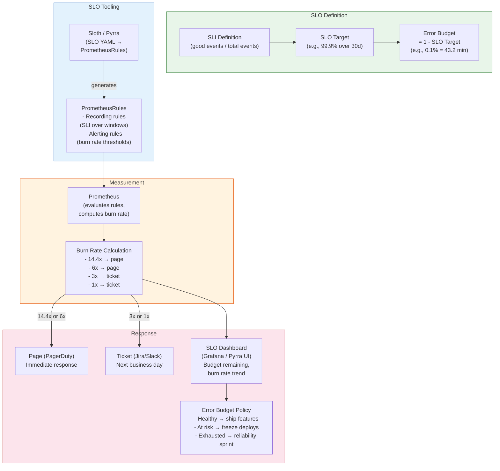

# SLO-Based Operations

## 1. Overview

SLO-based operations is the practice of defining, measuring, and operating Kubernetes services against explicit reliability targets. Instead of alerting on low-level signals ("CPU is high," "disk is filling"), SLO-based operations centers all operational decisions around **user-facing reliability**: "Are our users getting the experience we promised?"

The framework rests on three interconnected concepts: **Service Level Indicators (SLIs)** are the metrics that measure user experience (e.g., request latency p99, availability percentage). **Service Level Objectives (SLOs)** are the targets for those indicators (e.g., "99.9% of requests complete in under 500ms over 30 days"). **Error Budgets** are the mathematically derived tolerance for failure -- if your SLO is 99.9%, your error budget is 0.1% (43.2 minutes/month). When the error budget is spent, the team shifts from feature work to reliability work.

In Kubernetes, SLOs apply at two levels: **application SLOs** (the services your teams run) and **platform SLOs** (the Kubernetes infrastructure itself -- API server latency, etcd availability, scheduling latency). Both require Prometheus-based measurement, burn rate alerting, and operational processes that respond to error budget consumption.

Tools like **Sloth** and **Pyrra** automate the translation of SLO definitions into PrometheusRules (recording rules and multi-window, multi-burn-rate alerts), eliminating the error-prone process of manually writing PromQL for SLO tracking.

## 2. Why It Matters

- **Alerting on symptoms without SLOs produces alert fatigue.** A team with 200 alerts -- CPU high, memory high, Pod restarts, disk space -- responds to none of them effectively. SLO-based alerting replaces these with a single question: "Is the error budget burning faster than expected?" If yes, page. If no, the system is within acceptable parameters, even if CPU is at 90%.
- **Error budgets create alignment between reliability and velocity.** Without error budgets, there is perpetual tension between "ship features faster" and "make it more reliable." Error budgets provide a quantitative answer: when the budget is healthy, ship faster. When it is depleted, invest in reliability. This removes opinion from the discussion and replaces it with data.
- **SLOs make reliability a product decision, not an engineering decision.** A 99.99% SLO (52.6 minutes downtime/year) costs dramatically more than a 99.9% SLO (8.76 hours/year) -- roughly 10x more engineering investment for each additional nine. SLOs force product and engineering leadership to agree on the appropriate reliability level for each service, making the cost-reliability tradeoff explicit.
- **Platform SLOs protect the entire organization.** When the Kubernetes API server is slow or the scheduler is backlogged, every team is affected. Platform SLOs (API server p99 latency < 1s, etcd availability > 99.99%) provide the platform team with the same rigor that application teams have for their services.
- **Burn rate alerting is mathematically optimal.** Traditional threshold alerts ("error rate > 1%") fire on transient spikes and miss slow degradation. Multi-window, multi-burn-rate alerts fire when the error budget is being consumed at a rate that will exhaust it before the SLO window ends. This produces fewer false positives and catches both sudden and gradual degradation.

## 3. Core Concepts

- **Service Level Indicator (SLI):** A quantitative measure of a specific aspect of the service as experienced by users. SLIs are ratios: the number of "good" events divided by the total number of events. For an HTTP service, a latency SLI might be "the proportion of requests completed in under 500ms." For a Kubernetes platform, an SLI might be "the proportion of Pod scheduling attempts that complete in under 5 seconds." SLIs always produce a value between 0 and 1 (or 0% and 100%).
- **Service Level Objective (SLO):** A target value or range for an SLI, measured over a time window. An SLO of 99.9% availability over 30 days means the SLI (proportion of successful requests) must be at or above 99.9% when measured over a rolling 30-day window. SLOs are internal targets -- they are not contractual (that is an SLA). SLOs should be set based on user expectations, business requirements, and the dependency chain.
- **Service Level Agreement (SLA):** An explicit or implicit contract with users that includes consequences for failing to meet the target. SLAs are typically looser than SLOs -- if your SLO is 99.95%, your SLA might be 99.9%, providing a buffer. Violating an SLA triggers financial penalties, service credits, or contractual remedies. SLOs guide engineering; SLAs guide business.
- **Error Budget:** The mathematical complement of the SLO. If the SLO is 99.9% over 30 days, the error budget is 0.1% = 43.2 minutes of downtime (or equivalently, 0.1% of all requests can fail). Error budgets are consumed by outages, degradation, deployments that introduce errors, and planned maintenance. When the error budget is exhausted, the team must prioritize reliability over feature work.
- **Error Budget Policy:** A documented agreement that specifies what happens when error budget is consumed at various thresholds. Example: at 50% consumed, increase test coverage for next deployment; at 75% consumed, require rollback plans for all deployments; at 100% consumed, freeze feature deployments until the error budget is replenished. Error budget policies create organizational alignment around reliability investment.
- **Burn Rate:** The rate at which the error budget is being consumed relative to the SLO window. A burn rate of 1 means the error budget will be exactly exhausted at the end of the window (steady-state). A burn rate of 14.4 means the error budget will be exhausted in 1/14.4 of the window (roughly 2 days for a 30-day window). Burn rate is the key metric for alerting: you page when burn rate is high (immediate problem) and ticket when burn rate is moderate (slow degradation).
- **Multi-Window, Multi-Burn-Rate Alerting:** The recommended alerting strategy from Google's SRE Workbook. Instead of a single threshold, you use multiple alerting rules with different time windows and burn rate thresholds:
  - **Fast burn (page):** 14.4x burn rate sustained for 1 hour (consuming 2% of budget in 1 hour). Short window catches sudden outages.
  - **Slow burn (ticket):** 1x burn rate sustained for 3 days (steady consumption). Long window catches gradual degradation.
  Each rule uses two windows: a long window to detect the condition and a short window to confirm it is still active (avoiding stale alerts after recovery).
- **Sloth:** An open-source tool that generates PrometheusRules (recording rules and alerting rules) from simple SLO YAML definitions. Instead of manually writing complex PromQL for burn rate calculations, you define the SLI, target, and alerting config in a Sloth spec, and it generates all the required rules. Sloth supports the multi-window, multi-burn-rate alerting model.
- **Pyrra:** An open-source SLO tool with a Kubernetes-native approach. Pyrra provides a web UI for defining SLOs, automatically generates PrometheusRules, and includes a dashboard showing error budget status, burn rate, and SLO compliance over time. Pyrra runs as a Kubernetes operator that watches SLO custom resources.
- **SLO-Based Autoscaling:** Using SLO compliance (specifically error budget burn rate) as a scaling signal instead of raw resource metrics. If the error budget is burning because latency is increasing, scale up. If the error budget is healthy, do not scale up even if CPU is at 85%. This aligns scaling with user impact rather than arbitrary thresholds.
- **Platform SLOs:** SLOs for the Kubernetes infrastructure itself, targeting the platform team. These include API server request latency, etcd availability and write latency, scheduler queue time, node readiness time, and cluster autoscaler reaction time. Platform SLOs ensure the foundation is reliable enough for application SLOs to be meaningful.

## 4. How It Works

### The SLO Framework

**Step 1: Define SLIs.**

Choose indicators that directly reflect user experience. For each service, identify the most important user interactions and measure them:

| Service Type | SLI Type | Definition | Good Event | Total Event |
|---|---|---|---|---|
| HTTP API | Availability | Proportion of non-5xx responses | Responses with status < 500 | All responses |
| HTTP API | Latency | Proportion of requests faster than threshold | Responses with duration < 500ms | All responses |
| Streaming API | Throughput | Proportion of messages delivered within SLA | Messages delivered in < 1s | All messages sent |
| Batch Job | Freshness | Proportion of job runs completing on time | Runs completing within 2x expected duration | All runs |
| K8s API Server | Availability | Proportion of non-5xx API requests | API responses with code < 500 | All API responses |
| K8s Scheduler | Latency | Proportion of Pods scheduled within 5s | scheduling_duration < 5s | All scheduling attempts |

**Step 2: Set SLO Targets.**

SLO targets should be based on user expectations and the cost of reliability. Use the following table as a starting point:

| SLO Target | Monthly Error Budget | Annual Downtime | Typical Use Case |
|---|---|---|---|
| 99% | 7.3 hours | 3.65 days | Internal tools, batch systems |
| 99.5% | 3.65 hours | 1.83 days | Non-critical user-facing services |
| 99.9% | 43.2 minutes | 8.76 hours | Standard user-facing services |
| 99.95% | 21.6 minutes | 4.38 hours | Important user-facing services |
| 99.99% | 4.32 minutes | 52.6 minutes | Critical infrastructure, payment systems |
| 99.999% | 26 seconds | 5.26 minutes | Life-safety systems (rarely achievable) |

**Key principle:** Start with a lower SLO and tighten it only when user expectations demand it. Every additional nine costs roughly 10x more engineering effort.

**Step 3: Calculate Error Budgets.**

```
Error Budget (time)    = SLO Window * (1 - SLO Target)
Error Budget (events)  = Total Events * (1 - SLO Target)

Example (30-day window, 99.9% availability SLO):
  Error Budget (time)   = 30 days * 0.001 = 43.2 minutes
  Error Budget (events) = 1,000,000 requests * 0.001 = 1,000 failed requests
```

**Step 4: Implement burn rate alerting.**

The multi-window, multi-burn-rate model from Google's SRE Workbook:

| Severity | Burn Rate | Long Window | Short Window | Budget Consumed | Response |
|---|---|---|---|---|---|
| **Page (critical)** | 14.4x | 1 hour | 5 minutes | 2% in 1 hour | Immediate response required |
| **Page (high)** | 6x | 6 hours | 30 minutes | 5% in 6 hours | Urgent response required |
| **Ticket (medium)** | 3x | 1 day | 2 hours | 10% in 1 day | Next business day |
| **Ticket (low)** | 1x | 3 days | 6 hours | 10% in 3 days | Within the week |

The **short window** acts as a confirmation: the long window detects the trend, and the short window confirms it is still happening (preventing stale alerts after recovery).

**Burn rate formula:**

```
burn_rate = error_rate_observed / error_rate_allowed

Where:
  error_rate_allowed = 1 - SLO_target  (e.g., 0.001 for 99.9%)
  error_rate_observed = 1 - (good_events / total_events) over the window
```

### SLO Implementation with Sloth

Sloth takes a simple YAML definition and generates all required PrometheusRules:

**Sloth SLO Definition:**

```yaml
apiVersion: sloth.slok.dev/v1
kind: PrometheusServiceLevel
metadata:
  name: payment-service
  namespace: production
spec:
  service: "payment-service"
  labels:
    team: payments
    tier: critical
  slos:
    - name: "requests-availability"
      objective: 99.9
      description: "99.9% of payment requests return non-5xx responses"
      sli:
        events:
          errorQuery: |
            sum(rate(http_requests_total{job="payment-service",code=~"5.."}[{{.window}}]))
          totalQuery: |
            sum(rate(http_requests_total{job="payment-service"}[{{.window}}]))
      alerting:
        name: PaymentServiceHighErrorRate
        labels:
          team: payments
        annotations:
          runbook: "https://runbooks.example.com/payment-service-availability"
        pageAlert:
          labels:
            severity: critical
        ticketAlert:
          labels:
            severity: warning

    - name: "requests-latency"
      objective: 99.0
      description: "99% of payment requests complete in under 500ms"
      sli:
        events:
          errorQuery: |
            sum(rate(http_request_duration_seconds_count{job="payment-service"}[{{.window}}]))
            -
            sum(rate(http_request_duration_seconds_bucket{job="payment-service",le="0.5"}[{{.window}}]))
          totalQuery: |
            sum(rate(http_request_duration_seconds_count{job="payment-service"}[{{.window}}]))
      alerting:
        name: PaymentServiceHighLatency
        labels:
          team: payments
        annotations:
          runbook: "https://runbooks.example.com/payment-service-latency"
        pageAlert:
          labels:
            severity: critical
        ticketAlert:
          labels:
            severity: warning
```

**Sloth generates the following PrometheusRules automatically:**

1. **Recording rules** for SLI calculation (error ratio over multiple windows: 5m, 30m, 1h, 2h, 6h, 1d, 3d, 30d)
2. **Recording rules** for error budget remaining
3. **Alerting rules** for multi-window, multi-burn-rate alerts (page at 14.4x and 6x, ticket at 3x and 1x)

```bash
# Generate PrometheusRules from Sloth definition
sloth generate -i payment-service-slo.yaml -o payment-service-rules.yaml

# Or run Sloth as a Kubernetes controller that watches PrometheusServiceLevel CRDs
helm install sloth sloth/sloth --namespace monitoring
```

**Example generated recording rule (abbreviated):**

```yaml
# Generated by Sloth
groups:
  - name: sloth-slo-sli-recordings-payment-service-requests-availability
    rules:
      - record: slo:sli_error:ratio_rate5m
        expr: |
          sum(rate(http_requests_total{job="payment-service",code=~"5.."}[5m]))
          /
          sum(rate(http_requests_total{job="payment-service"}[5m]))
        labels:
          sloth_service: payment-service
          sloth_slo: requests-availability

      - record: slo:sli_error:ratio_rate30m
        expr: |
          sum(rate(http_requests_total{job="payment-service",code=~"5.."}[30m]))
          /
          sum(rate(http_requests_total{job="payment-service"}[30m]))
        labels:
          sloth_service: payment-service
          sloth_slo: requests-availability

      # ... similar for 1h, 2h, 6h, 1d, 3d, 30d windows

  - name: sloth-slo-meta-recordings-payment-service-requests-availability
    rules:
      - record: slo:objective:ratio
        expr: vector(0.999)
        labels:
          sloth_service: payment-service
          sloth_slo: requests-availability

      - record: slo:error_budget:ratio
        expr: vector(1 - 0.999)
        labels:
          sloth_service: payment-service
          sloth_slo: requests-availability

      - record: slo:time_period:days
        expr: vector(30)
        labels:
          sloth_service: payment-service
          sloth_slo: requests-availability

      - record: slo:current_burn_rate:ratio
        expr: |
          slo:sli_error:ratio_rate5m{sloth_service="payment-service",sloth_slo="requests-availability"}
          / on () group_left
          slo:error_budget:ratio{sloth_service="payment-service",sloth_slo="requests-availability"}
        labels:
          sloth_service: payment-service
          sloth_slo: requests-availability
```

**Example generated alerting rule (page alert):**

```yaml
  - name: sloth-slo-alerts-payment-service-requests-availability
    rules:
      # Page: 14.4x burn rate over 1h, confirmed by 5m window
      - alert: PaymentServiceHighErrorRate
        expr: |
          (
            max(slo:sli_error:ratio_rate5m{sloth_service="payment-service",sloth_slo="requests-availability"}) > (14.4 * 0.001)
            and
            max(slo:sli_error:ratio_rate1h{sloth_service="payment-service",sloth_slo="requests-availability"}) > (14.4 * 0.001)
          )
        labels:
          severity: critical
          team: payments
          sloth_severity: page
        annotations:
          summary: "payment-service requests-availability SLO burn rate is 14.4x (page)"
          runbook: "https://runbooks.example.com/payment-service-availability"

      # Page: 6x burn rate over 6h, confirmed by 30m window
      - alert: PaymentServiceHighErrorRate
        expr: |
          (
            max(slo:sli_error:ratio_rate30m{sloth_service="payment-service",sloth_slo="requests-availability"}) > (6 * 0.001)
            and
            max(slo:sli_error:ratio_rate6h{sloth_service="payment-service",sloth_slo="requests-availability"}) > (6 * 0.001)
          )
        labels:
          severity: critical
          team: payments
          sloth_severity: page

      # Ticket: 3x burn rate over 1d, confirmed by 2h window
      - alert: PaymentServiceHighErrorRate
        expr: |
          (
            max(slo:sli_error:ratio_rate2h{sloth_service="payment-service",sloth_slo="requests-availability"}) > (3 * 0.001)
            and
            max(slo:sli_error:ratio_rate1d{sloth_service="payment-service",sloth_slo="requests-availability"}) > (3 * 0.001)
          )
        labels:
          severity: warning
          team: payments
          sloth_severity: ticket
```

### SLO Implementation with Pyrra

Pyrra operates as a Kubernetes operator with a web UI:

```yaml
apiVersion: pyrra.dev/v1alpha1
kind: ServiceLevelObjective
metadata:
  name: payment-service-availability
  namespace: production
  labels:
    pyrra.dev/team: payments
spec:
  target: "99.9"
  window: 4w   # 28-day rolling window
  description: "99.9% of payment requests return non-5xx responses"
  indicator:
    ratio:
      errors:
        metric: http_requests_total{job="payment-service",code=~"5.."}
      total:
        metric: http_requests_total{job="payment-service"}
  alerting:
    disabled: false
```

```bash
# Deploy Pyrra
helm install pyrra pyrra/pyrra --namespace monitoring
```

Pyrra provides a web dashboard showing:
- Current SLO compliance percentage
- Error budget remaining (percentage and absolute time)
- Burn rate over time (graph)
- Alert status (firing or not)
- Historical compliance over multiple windows

### Sloth vs. Pyrra Comparison

| Feature | Sloth | Pyrra |
|---|---|---|
| **Approach** | CLI/controller that generates PrometheusRules | Kubernetes operator with CRD + web UI |
| **Configuration** | YAML spec (PrometheusServiceLevel) | CRD (ServiceLevelObjective) |
| **UI** | No native UI (use Grafana dashboards) | Built-in web dashboard |
| **Alert model** | Multi-window, multi-burn-rate (configurable) | Multi-window, multi-burn-rate |
| **Grafana integration** | Generates dashboards via Grafana plugin | Separate UI, can link to Grafana |
| **Maturity** | More mature, wider adoption | Newer, growing community |
| **Flexibility** | More customizable (plugins, custom templates) | Simpler, more opinionated |
| **Best for** | Teams using Grafana as primary UI | Teams wanting a dedicated SLO dashboard |

### Platform SLOs for Kubernetes

Platform teams should define SLOs for the Kubernetes infrastructure itself:

| Component | SLI | SLO Target | Measurement |
|---|---|---|---|
| **API Server Availability** | Proportion of non-5xx API requests | 99.99% (4.32 min/month) | `apiserver_request_total{code!~"5.."}` / `apiserver_request_total` |
| **API Server Latency** | Proportion of requests < 1s (read), < 60s (write) | 99% | `apiserver_request_duration_seconds_bucket{le="1",verb=~"GET\|LIST"}` |
| **etcd Availability** | Proportion of time etcd has a leader | 99.99% | `etcd_server_has_leader == 1` |
| **etcd Write Latency** | Proportion of WAL fsync < 10ms | 99% | `etcd_disk_wal_fsync_duration_seconds_bucket{le="0.01"}` |
| **Scheduler Latency** | Proportion of Pods scheduled in < 5s | 99% | `scheduler_scheduling_attempt_duration_seconds_bucket{le="5"}` |
| **Node Readiness** | Proportion of time nodes are Ready | 99.9% | `kube_node_status_condition{condition="Ready",status="true"}` |
| **Cluster Autoscaler** | Proportion of scale-ups completing in < 5 min | 95% | Custom metric from autoscaler logs |
| **DNS Resolution** | Proportion of DNS queries answered < 100ms | 99.9% | `coredns_dns_request_duration_seconds_bucket{le="0.1"}` |

**Example Platform SLO definition (Sloth format):**

```yaml
apiVersion: sloth.slok.dev/v1
kind: PrometheusServiceLevel
metadata:
  name: kubernetes-apiserver
  namespace: monitoring
spec:
  service: "kubernetes-apiserver"
  labels:
    team: platform
    tier: infrastructure
  slos:
    - name: "apiserver-availability"
      objective: 99.99
      description: "99.99% of API server requests return non-5xx responses"
      sli:
        events:
          errorQuery: |
            sum(rate(apiserver_request_total{code=~"5.."}[{{.window}}]))
          totalQuery: |
            sum(rate(apiserver_request_total[{{.window}}]))
      alerting:
        name: KubeAPIServerHighErrorRate
        labels:
          team: platform
        pageAlert:
          labels:
            severity: critical
        ticketAlert:
          labels:
            severity: warning

    - name: "apiserver-read-latency"
      objective: 99.0
      description: "99% of read requests complete in under 1 second"
      sli:
        events:
          errorQuery: |
            sum(rate(apiserver_request_duration_seconds_count{verb=~"GET|LIST"}[{{.window}}]))
            -
            sum(rate(apiserver_request_duration_seconds_bucket{verb=~"GET|LIST",le="1"}[{{.window}}]))
          totalQuery: |
            sum(rate(apiserver_request_duration_seconds_count{verb=~"GET|LIST"}[{{.window}}]))
      alerting:
        name: KubeAPIServerHighReadLatency
        labels:
          team: platform
        pageAlert:
          labels:
            severity: critical
        ticketAlert:
          labels:
            severity: warning
```

### Error Budget Policy Example

```markdown
# Error Budget Policy: Payment Service

## Service: payment-service
## SLO: 99.9% availability over 30 days
## Error Budget: 43.2 minutes / month

### Budget Thresholds and Actions:

| Budget Remaining | Status | Actions |
|---|---|---|
| > 50% | Healthy | Normal feature development velocity. Standard deployment process. |
| 25-50% | Caution | All deployments require rollback plan. Increase canary duration to 2 hours. Run load tests before production deployment. |
| 10-25% | At Risk | Feature freeze for this service. All engineering effort on reliability. Deployments only for bug fixes with VP approval. |
| < 10% | Critical | Full incident response mode. No deployments without CTO approval. Post-mortem required for any budget-consuming event. |
| 0% (Exhausted) | Frozen | Complete feature deployment freeze until budget replenishes. All team members focused on reliability improvements. Weekly review with VP Engineering. |

### Budget Replenishment:
The error budget replenishes as the 30-day rolling window moves forward. Old errors "fall off" as time passes.

### Exceptions:
- Security patches are always allowed regardless of budget status.
- Dependency-caused errors (upstream service outage) are documented but do not trigger freeze (attribution matters).

### Review Cadence:
- Daily: Team lead reviews error budget dashboard.
- Weekly: Team reviews SLO compliance in sprint planning.
- Monthly: Service owner presents SLO report to leadership.
```

### SLO-Based Autoscaling

Traditional HPA scales on raw metrics (CPU > 80%). SLO-based autoscaling scales on error budget burn rate:

```yaml
apiVersion: autoscaling/v2
kind: HorizontalPodAutoscaler
metadata:
  name: payment-service-slo-hpa
  namespace: production
spec:
  scaleTargetRef:
    apiVersion: apps/v1
    kind: Deployment
    name: payment-service
  minReplicas: 3
  maxReplicas: 20
  metrics:
    # Scale based on SLO burn rate via Prometheus adapter
    - type: Object
      object:
        describedObject:
          apiVersion: monitoring.coreos.com/v1
          kind: PrometheusRule
          name: payment-service-slo
        metric:
          name: slo_current_burn_rate_ratio
        target:
          type: Value
          value: "1"   # Target burn rate of 1x (steady state)
  behavior:
    scaleUp:
      stabilizationWindowSeconds: 60   # React quickly to SLO violations
      policies:
        - type: Pods
          value: 4
          periodSeconds: 60
    scaleDown:
      stabilizationWindowSeconds: 300  # Slow scale-down to prevent flapping
      policies:
        - type: Pods
          value: 1
          periodSeconds: 120
```

This approach has a key advantage: it scales based on user impact, not resource consumption. A service might have 90% CPU utilization but a healthy error budget (because requests are fast and correct) -- no need to scale. Conversely, a service at 40% CPU might have a burning error budget (because a downstream dependency is slow) -- scaling up reduces queue depth and latency.

### SLO-Informed Capacity Planning

Error budget consumption patterns over time inform capacity planning:

1. **Track budget consumption by cause.** Categorize each error budget event: deployment regression, infrastructure failure, traffic spike, dependency outage. Over time, this reveals the dominant reliability risks.

2. **Correlate budget consumption with traffic.** If error budget burns during traffic peaks (e.g., Black Friday), the service needs more headroom. If it burns during low traffic, the problem is bugs or infrastructure, not capacity.

3. **Project error budget at planned scale.** If traffic is expected to 2x next quarter, model whether the current infrastructure can maintain the SLO. If the service uses 80% of its error budget at current traffic, doubling traffic will exhaust it -- invest in capacity or efficiency before the traffic arrives.

```promql
# Error budget consumption rate over the last 7 days
1 - (
  sum_over_time(slo:sli_error:ratio_rate5m{sloth_service="payment-service"}[7d])
  / count_over_time(slo:sli_error:ratio_rate5m{sloth_service="payment-service"}[7d])
)
```

## 5. Architecture / Flow



## 6. Types / Variants

### SLI Types

| SLI Type | Measures | Good Event | Example |
|---|---|---|---|
| **Availability** | Service uptime / request success rate | Non-error response (status < 500) | 99.9% of requests succeed |
| **Latency** | Request response time | Response time below threshold | 99% of requests < 500ms |
| **Throughput** | Data processing rate | Batch processed within deadline | 95% of jobs finish in < 1 hour |
| **Freshness** | Data staleness | Data updated within threshold | 99% of reads return data < 1 min old |
| **Correctness** | Output accuracy | Correct result produced | 99.99% of calculations are accurate |
| **Coverage** | Proportion of data processed | Record successfully processed | 99.9% of events ingested |

### SLO Window Types

| Window | Duration | Best For |
|---|---|---|
| **Rolling (e.g., 30-day rolling)** | Continuously sliding window | Most services; reflects recent reliability |
| **Calendar (e.g., monthly)** | Fixed start/end (1st-30th) | Financial reporting, chargeback |
| **Shorter rolling (e.g., 7-day)** | Tighter feedback loop | New services or services in rapid development |

### SLO Tooling Landscape

| Tool | Type | Key Feature | Deployment |
|---|---|---|---|
| **Sloth** | CLI + Kubernetes controller | Generates PrometheusRules from YAML | Controller in monitoring namespace |
| **Pyrra** | Kubernetes operator + Web UI | CRD-based SLOs with built-in dashboard | Operator + UI pods |
| **Google Cloud SLO Monitoring** | SaaS | Native GKE integration | GCP console |
| **Nobl9** | SaaS | Multi-source SLIs, enterprise features | SaaS + agent |
| **Datadog SLOs** | SaaS | Integrated with Datadog monitoring | Datadog platform |
| **Grafana SLO** | SaaS (Grafana Cloud) | Native Grafana integration | Grafana Cloud |
| **Custom (PromQL + Grafana)** | DIY | Full control, no dependencies | Manual PrometheusRules + Grafana |

## 7. Use Cases

- **Replacing noisy alerts with SLO-based alerting.** A team with 150 active alert rules and daily alert fatigue migrates to SLO-based alerting. They define 5 SLOs (availability and latency for their 3 most critical services, plus 2 platform SLOs). The 150 rules are replaced by 20 burn-rate alerts (4 per SLO). Pages drop from 3/day to 2/week, and every page represents real user impact.
- **Error budget-driven deployment policy.** A payment service has a 99.9% availability SLO. The team deploys to production 3 times per week. After a bad deployment consumes 40% of the error budget in 2 hours, the error budget policy triggers: remaining deployments this week require VP approval and a pre-written rollback plan. This prevents the team from compounding a bad week with risky deployments.
- **Platform SLO for API server.** The platform team defines a 99.99% availability SLO for the API server. When a custom controller bug causes a spike in LIST requests that degrades API server latency, the platform SLO burn rate alert fires. The controller is identified and throttled within 15 minutes, preventing a cluster-wide outage.
- **SLO-based autoscaling for GenAI inference.** An LLM inference service defines a latency SLO: 99% of requests complete in under 2 seconds. During peak hours, the burn rate increases as queue depth grows. The HPA, keyed on burn rate, scales from 3 to 8 replicas. During off-peak, the burn rate drops and replicas scale back to 3. This is more cost-efficient than scaling on GPU utilization, which might trigger scaling even when latency is fine.
- **SLO-informed capacity planning.** A service consistently uses 60% of its error budget each month, primarily during traffic peaks on Tuesdays (marketing email campaigns). The team uses this data to request pre-scaling before Tuesday email campaigns and to plan a capacity increase before the holiday season, where traffic is expected to 3x.
- **Dependency SLO tracking.** A frontend service depends on 5 backend services, each with their own SLOs. The frontend team tracks "dependency error budget consumed" -- the proportion of their error budget consumed by backend failures. When one backend consistently consumes 30% of the frontend's budget, the frontend team has data to justify prioritizing that backend's reliability.
- **Kubernetes upgrade validation via platform SLO.** Before upgrading from Kubernetes 1.29 to 1.30, the platform team establishes platform SLO baselines. After the upgrade, they compare API server latency, scheduler performance, and etcd write latency against pre-upgrade baselines. If any SLI degrades, the upgrade is rolled back before application teams are affected.

## 8. Tradeoffs

| Decision | Option A | Option B | Guidance |
|---|---|---|---|
| **SLO target: ambitious vs. conservative** | 99.99%: tight, few errors allowed | 99.9%: comfortable budget for change | Start conservative (99.9%); tighten only when users demand it. Each nine costs ~10x more. |
| **Window: 30-day vs. 7-day** | 30-day: stable, forgiving of transient issues | 7-day: tight feedback loop, fast budget recovery | 30-day for production services; 7-day for new services or rapid iteration phases. |
| **Sloth vs. Pyrra** | Sloth: CLI/controller, Grafana-native, more flexible | Pyrra: operator + UI, simpler, opinionated | Sloth if Grafana is your primary UI; Pyrra if you want a dedicated SLO dashboard. |
| **SLO-based vs. resource-based autoscaling** | SLO-based: scales on user impact | Resource-based: scales on utilization | SLO-based for user-facing services; resource-based for batch workloads or when SLO measurement is not feasible. |
| **Strict error budget policy vs. advisory** | Strict: deployment freezes enforced by tooling | Advisory: recommendations, team decides | Strict for critical services (payments, auth); advisory for less critical services during early SLO adoption. |
| **Per-service SLOs vs. aggregate** | Per-service: granular, each team owns their SLO | Aggregate: single "platform" SLO for all services | Per-service for mature organizations; aggregate as a starting point for organizations new to SLOs. |

## 9. Common Pitfalls

- **Setting SLO targets based on historical performance.** If a service has been 99.95% available historically, teams set the SLO at 99.95%. This leaves no error budget for change. SLOs should be based on **user expectations**, not historical performance. If users would tolerate 99.9%, use that -- it gives 10x more error budget for improvements.
- **Not having an error budget policy.** An SLO without an error budget policy is just a dashboard. The policy is what creates organizational change -- it defines the actions taken when budget thresholds are crossed. Without a policy, teams ignore the SLO when it is inconvenient.
- **Measuring SLIs at the wrong layer.** An SLI measured at the load balancer misses errors that occur before the load balancer (DNS failures, TLS handshake timeouts) and after (client-side rendering issues). Measure SLIs as close to the user as possible. For internal services, the caller's perspective is more accurate than the callee's.
- **Ignoring platform SLOs.** Application SLOs are meaningless if the platform underneath is unreliable. If the API server regularly has 5-second latency spikes, every application's deployment and scaling is degraded. Platform SLOs ensure the foundation supports the services built on top.
- **Alert on raw SLI instead of burn rate.** Alerting when "error rate > 0.1%" catches every transient blip. Burn rate alerting asks "is this blip consuming error budget fast enough to matter?" A 5-minute spike that consumes 0.01% of budget is not worth a page. A sustained 2-hour degradation consuming 5% of budget is.
- **Not attributing error budget consumption to causes.** If the error budget is 50% consumed and you do not know why (deployments? infrastructure? dependencies?), you cannot take targeted action. Tag every error budget event with a cause category in postmortems.
- **Treating SLOs as static.** SLOs should evolve with the service and its users. A new service might start at 99.5% and tighten to 99.9% as it matures. A service being deprecated might relax from 99.9% to 99%. Review and adjust SLOs quarterly.
- **Over-engineering SLO tooling before establishing culture.** Deploying Sloth, Pyrra, and custom dashboards before teams understand what an SLO is wastes effort. Start with a Google Sheets calculation of error budget for one critical service. Once the team is bought in, automate with tooling.
- **Setting too many SLOs.** A service with 15 SLOs cannot prioritize effectively. Limit to 2-4 SLOs per service: typically availability and latency for user-facing services, plus throughput or freshness for data services. More SLOs means more alerts, more dashboards, and more cognitive load.

## 10. Real-World Examples

- **Google (SRE origin):** Google's SRE team pioneered the SLO/error budget framework, documented in the SRE book (2016) and SRE Workbook (2018). Their multi-window, multi-burn-rate alerting model is the industry standard. Key insight from their experience: the error budget policy was more impactful than the SLO itself -- it was the mechanism that created organizational behavior change.
- **Spotify:** Applies SLOs across their Kubernetes-based microservices platform. Each service squad defines their own SLOs, and the platform team provides tooling (Sloth-based) to automate alert generation. Their error budget policies are team-specific -- critical payment services have strict deployment freezes, while experimental features have advisory policies.
- **Shopify:** Defines platform SLOs for their Kubernetes infrastructure: API server availability 99.99%, Pod scheduling latency p99 < 5 seconds. These platform SLOs are published to all engineering teams and reviewed monthly. When a scheduler performance regression violated the scheduling latency SLO, it triggered a dedicated reliability sprint that resolved the issue within a week.
- **LinkedIn:** Adopted SLO-based operations for their Kubernetes platform serving billions of API calls per day. They reported that transitioning from threshold-based alerting to burn rate alerting reduced page volume by 60% while improving mean-time-to-detection for real incidents. Key to their success: error budget policies were signed off by engineering directors, giving them organizational weight.
- **Datadog (SLO product):** Built their SLO product based on experience running thousands of microservices on Kubernetes. Their key finding: organizations that implemented error budget policies saw 40% fewer incidents (because deployment freezes during budget exhaustion prevented compounding failures) and 25% faster feature velocity (because healthy error budgets gave explicit permission to ship).
- **CERN:** Applies platform SLOs to their multi-cluster Kubernetes deployment for physics data processing. Their primary SLI is "proportion of submitted physics jobs that complete within 2x expected duration." With a 99% SLO and 30-day window, they have a clear framework for evaluating cluster upgrades and infrastructure changes.

### Example Grafana Dashboard for SLO

A comprehensive SLO dashboard includes:

1. **Error budget gauge.** Shows remaining budget as a percentage. Green (> 50%), yellow (25-50%), red (< 25%).
2. **Burn rate time series.** 24-hour graph showing burn rate with horizontal lines at 1x (steady state), 6x (ticket threshold), and 14.4x (page threshold).
3. **SLI compliance trend.** 30-day rolling SLI value (e.g., 99.92% availability) plotted against the SLO target line (99.9%).
4. **Error budget consumption by cause.** Pie chart or stacked bar showing budget consumed by: deployments, infrastructure failures, dependency outages, traffic spikes.
5. **Alert history.** Table of recent SLO alert firings with timestamps, severity, and duration.

```promql
# Error budget remaining (percentage)
1 - (
  slo:sli_error:ratio_rate30d{sloth_service="payment-service",sloth_slo="requests-availability"}
  / on () group_left
  slo:error_budget:ratio{sloth_service="payment-service",sloth_slo="requests-availability"}
)

# Current burn rate
slo:current_burn_rate:ratio{sloth_service="payment-service",sloth_slo="requests-availability"}

# SLI compliance (30-day rolling availability)
1 - slo:sli_error:ratio_rate30d{sloth_service="payment-service",sloth_slo="requests-availability"}
```

## 11. Related Concepts

- [Monitoring and Metrics](./01-monitoring-and-metrics.md) -- Prometheus metrics are the raw input for SLI calculation
- [Logging and Tracing](./02-logging-and-tracing.md) -- traces provide latency SLI data; logs explain error budget events
- [Cost Observability](./03-cost-observability.md) -- SLO targets affect cost (higher SLOs require more infrastructure)
- [Monitoring (Traditional)](../../traditional-system-design/10-observability/01-monitoring.md) -- foundational monitoring concepts
- [LLM Observability](../../genai-system-design/09-evaluation/04-llm-observability.md) -- SLOs for GenAI services (latency, throughput, quality)
- [GPU-Aware Autoscaling](../06-scaling-design/04-gpu-aware-autoscaling.md) -- SLO-based autoscaling for GPU workloads
- [Kubernetes Architecture](../01-foundations/01-kubernetes-architecture.md) -- control plane components that platform SLOs measure

## 12. Source Traceability

- source/youtube-video-reports/1.md -- Rate limiting and SLA enforcement (SLA of <100ms response time), HPA triggering at 80% of resource limits as an SLO-adjacent practice, operational stability through telemetry
- Google SRE Book (sre.google/sre-book) -- SLI/SLO/SLA definitions, error budget concept, error budget policies
- Google SRE Workbook (sre.google/workbook) -- Multi-window, multi-burn-rate alerting model, practical SLO implementation
- Sloth documentation (sloth.dev) -- PrometheusServiceLevel CRD, rule generation, alerting configuration
- Pyrra documentation (pyrra.dev) -- ServiceLevelObjective CRD, web UI, Kubernetes operator
- OpenSLO specification (openslo.com) -- Vendor-neutral SLO specification standard
- Prometheus Operator documentation (prometheus-operator.dev) -- PrometheusRule CRD for recording and alerting rules
