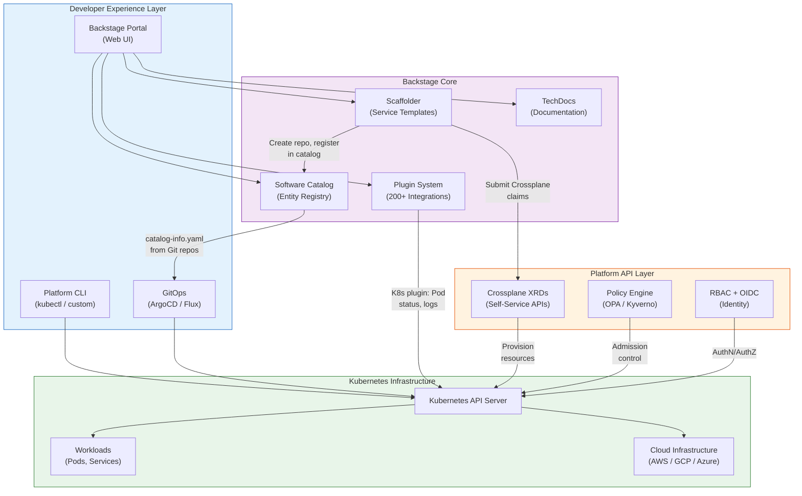
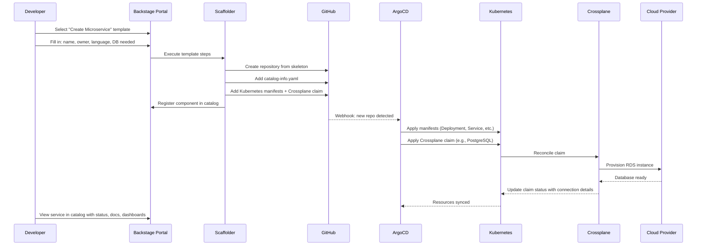

# Internal Developer Platform

## 1. Overview

An Internal Developer Platform (IDP) is a self-service layer built on top of Kubernetes and cloud infrastructure that enables development teams to ship software without needing to understand the underlying platform complexity. Instead of filing tickets and waiting for a platform team to provision resources, developers interact with curated abstractions -- golden paths, software templates, and self-service APIs -- that encode organizational best practices while hiding infrastructure plumbing.

The IDP is not a single product you install. It is a composition of tools, APIs, and workflows assembled by a platform team to reduce cognitive load on stream-aligned development teams. The most common reference architecture today uses Backstage as the developer portal, GitOps for deployment, and Crossplane or Terraform for infrastructure provisioning -- all running on Kubernetes as the universal runtime.

Platform engineering as a discipline emerged because DevOps, taken literally ("you build it, you run it"), placed an unsustainable cognitive burden on developers. The IDP is the answer: a product-minded approach where the platform team treats developers as customers and the platform as a product, complete with documentation, SLOs, feedback loops, and iterative improvement.

The distinction matters: DevOps is a culture and set of practices; platform engineering is a discipline that builds the tools and workflows that make DevOps practices accessible to all engineering teams, not just the infrastructure-savvy ones. The IDP is the tangible product of platform engineering.

## 2. Why It Matters

- **Cognitive load is the bottleneck.** When developers must understand Kubernetes manifests, networking policies, CI/CD pipelines, observability setup, and security policies just to deploy an application, velocity drops. An IDP absorbs this complexity into golden paths that encapsulate best practices.
- **Self-service eliminates ticket queues.** Without an IDP, provisioning a new service might require tickets to the infrastructure team, security team, and networking team. An IDP turns a multi-day, multi-team process into a 10-minute self-service workflow.
- **Consistency at scale requires encoded standards.** When 50 teams deploy services independently, you get 50 different approaches to logging, metrics, health checks, and security. An IDP enforces consistency through templates and defaults while still allowing escape hatches for advanced teams.
- **Developer retention depends on developer experience.** Teams that spend 30-40% of their time on infrastructure glue report lower satisfaction. Organizations investing in IDPs report measurable improvements in developer satisfaction and retention.
- **Platform engineering is the fastest-growing discipline in infrastructure.** Gartner predicts 80% of software engineering organizations will have platform teams by 2026. CNCF graduated Backstage as its first developer-experience focused project, signaling the maturity of this space.

## 3. Core Concepts

- **Golden Paths:** Opinionated, well-supported, and documented workflows for common tasks like "deploy a new microservice," "provision a PostgreSQL database," or "set up a CI/CD pipeline." Golden paths are not mandates -- they are the easiest way to do things right. Teams can deviate, but the golden path should be so convenient that most teams choose it voluntarily. Red Hat defines golden paths as "paved roads" that reduce decision fatigue.
- **Self-Service:** The principle that developers can provision infrastructure, create services, and configure environments without filing tickets or waiting for another team. Self-service is implemented through APIs, CLIs, and portal UIs that abstract the underlying provisioning steps.
- **Guardrails Not Gates:** Instead of blocking developers with approval gates (e.g., "submit a ticket to create a namespace"), the platform embeds guardrails that prevent unsafe actions automatically. Policy engines (OPA/Gatekeeper, Kyverno) enforce security and compliance constraints at admission time, so developers can move fast within safe boundaries.
- **Platform as a Product:** The platform team treats the IDP like an internal product -- with a product manager, roadmap, user research (developer surveys), SLOs, and iterative releases. Platform teams that operate in "build it and they will come" mode fail. Those that treat developers as customers succeed.
- **Software Catalog:** A centralized registry of all services, APIs, libraries, infrastructure components, and their ownership. The catalog answers questions like "who owns this service?" "what depends on this API?" and "what is the deployment status of this component?" Backstage's software catalog is the de facto standard.
- **Scaffolding Templates:** Pre-built templates that generate new services, pipelines, and infrastructure from a consistent starting point. When a developer creates a new microservice from a template, they get a Git repository with CI/CD, Dockerfile, Kubernetes manifests, monitoring configuration, and documentation -- all wired up and working from the first commit.
- **TechDocs:** Documentation-as-code that lives alongside the source code and is rendered in the developer portal. Backstage TechDocs uses Markdown files in the repository and renders them in the catalog, ensuring documentation stays current because it is part of the code review process.
- **Plugin Ecosystem:** IDPs are extensible through plugins that integrate with external systems -- CI/CD (GitHub Actions, Jenkins), monitoring (Grafana, Datadog), security scanning (Snyk, Trivy), cost management (Kubecost), and more. Backstage has 200+ community plugins.
- **Team Topologies:** A framework by Matthew Skelton and Manuel Pais that defines four team types: stream-aligned teams (deliver business value), platform teams (provide self-service capabilities), enabling teams (help stream-aligned teams adopt new capabilities), and complicated-subsystem teams (own specialized components). The IDP is built and maintained by the platform team to serve stream-aligned teams.

## 4. How It Works

### Backstage Architecture

Backstage, originally created by Spotify and now a CNCF Graduated project, is the most widely adopted open-source IDP framework. It provides three core features plus an extensible plugin system:

**1. Software Catalog**
The catalog ingests metadata from `catalog-info.yaml` files in every repository. These files declare the component type (service, library, API), owner (team), lifecycle stage, and dependencies. The catalog aggregates this data into a searchable directory that shows every service in the organization, who owns it, its API documentation, deployment status, and health.

```yaml
# catalog-info.yaml in each repository
apiVersion: backstage.io/v1alpha1
kind: Component
metadata:
  name: payment-service
  description: Processes payment transactions
  annotations:
    backstage.io/techdocs-ref: dir:.
    github.com/project-slug: acme/payment-service
    backstage.io/kubernetes-id: payment-service
spec:
  type: service
  lifecycle: production
  owner: team-payments
  system: checkout
  providesApis:
    - payment-api
  consumesApis:
    - user-api
    - notification-api
  dependsOn:
    - resource:default/payments-db
```

**2. Software Templates (Scaffolder)**
Templates are parameterized workflows that create new components from scratch. A template defines input parameters (service name, owner, language), steps (create Git repo, generate code from cookiecutter, register in catalog, create CI/CD pipeline), and outputs (links to the new repo, pipeline, and catalog entry).

```yaml
apiVersion: scaffolder.backstage.io/v1beta3
kind: Template
metadata:
  name: new-microservice
  title: Create a New Microservice
spec:
  owner: platform-team
  type: service
  parameters:
    - title: Service Details
      properties:
        name:
          type: string
          description: Service name
        owner:
          type: string
          description: Owning team
          ui:field: OwnerPicker
        language:
          type: string
          enum: [go, python, java, typescript]
  steps:
    - id: fetch
      name: Generate code from template
      action: fetch:template
      input:
        url: ./skeleton
        values:
          name: ${{ parameters.name }}
          owner: ${{ parameters.owner }}
    - id: publish
      name: Create GitHub repository
      action: publish:github
      input:
        repoUrl: github.com?repo=${{ parameters.name }}&owner=acme
    - id: register
      name: Register in catalog
      action: catalog:register
      input:
        repoContentsUrl: ${{ steps.publish.output.repoContentsUrl }}
        catalogInfoPath: /catalog-info.yaml
```

**3. TechDocs**
TechDocs renders Markdown documentation from repositories directly in the Backstage portal. It uses MkDocs under the hood, builds documentation at entity ingestion time, and serves it alongside the component in the catalog. This means developers do not need to leave the portal to find documentation -- it is co-located with the service metadata, API specs, and deployment status.

**4. Plugin System**
Backstage plugins extend the portal with integrations:
- **Kubernetes plugin:** Shows Pod status, deployments, and logs directly in the catalog entity page.
- **CI/CD plugins:** GitHub Actions, Jenkins, Tekton build status.
- **Monitoring plugins:** Grafana dashboards, PagerDuty on-call schedules.
- **Security plugins:** Snyk vulnerabilities, Trivy scan results.
- **Cost plugins:** Kubecost allocation per service.

### Portal vs. API-First Platform Approaches

There are two philosophies for building an IDP:

**Portal-First (Backstage model):**
- Developers interact primarily through a web UI.
- Best for organizations with many less-experienced developers who benefit from guided workflows.
- Risk: the portal becomes a bottleneck if it does not expose an API layer underneath.
- Examples: Backstage, Port, Cortex, OpsLevel.

**API-First (Kubernetes-native model):**
- The platform exposes its capabilities as Kubernetes CRDs and APIs. Developers interact via kubectl, GitOps, or CLI tools.
- Best for organizations with experienced developers who prefer declarative manifests and automation.
- Risk: higher learning curve; less discoverable for new engineers.
- Examples: Crossplane, Kratix, Humanitec Platform Orchestrator.

**Hybrid (recommended):**
- Build the platform as APIs first, then layer a portal on top. Backstage becomes the UI that calls the underlying Kubernetes APIs and Crossplane claims.
- This approach ensures that everything a developer can do in the portal can also be done via CLI/GitOps, supporting both interactive and automated workflows.

### Platform Maturity Model

The CNCF Platform Engineering Maturity Model defines four levels:

| Level | Description | Characteristics |
|---|---|---|
| **Provisional** | Ad-hoc platform efforts | No dedicated team; shared scripts and wiki pages; platform is a side project |
| **Operationalized** | Dedicated platform team exists | Basic self-service for common tasks; some golden paths; manual processes for edge cases |
| **Scalable** | Platform as a product | Product manager for platform; developer surveys; automated golden paths; plugin ecosystem; metrics (DORA, SPACE) |
| **Optimizing** | Continuous improvement | A/B testing platform features; platform SLOs; cost optimization built in; platform contributes measurably to developer velocity |

Most organizations are between Provisional and Operationalized. The jump to Scalable requires treating the platform as a product with dedicated product management.

## 5. Architecture / Flow



### Request Flow: Developer Creates a New Service



## 6. Types / Variants

### Backstage Plugin Categories

The Backstage plugin ecosystem is organized into categories that extend the portal's capabilities:

| Category | Example Plugins | Purpose |
|---|---|---|
| **Infrastructure** | Kubernetes, ArgoCD, Terraform, AWS | Real-time visibility into infrastructure and deployments |
| **CI/CD** | GitHub Actions, Jenkins, Tekton, CircleCI | Build and deployment pipeline status within the catalog |
| **Monitoring** | Grafana, Datadog, PagerDuty, Prometheus | Dashboards, alerts, and on-call schedules per service |
| **Security** | Snyk, Trivy, SonarQube, Dependabot | Vulnerability scanning results and security posture |
| **Cost** | Kubecost, Infracost | Resource cost attribution per service and team |
| **Documentation** | TechDocs, ADR (Architecture Decision Records) | Rendered documentation co-located with service metadata |
| **API** | OpenAPI, GraphQL, gRPC | API documentation, schema explorer, consumer tracking |
| **Compliance** | Scorecard, Tech Insights | Service maturity scoring, compliance checklist tracking |

Each plugin surfaces data directly in the entity page for a service, so a developer viewing `payment-service` in the catalog sees its Kubernetes Pod status, recent CI builds, Grafana dashboards, open security vulnerabilities, and documentation -- all on one page without switching tools.

### IDP Implementation Approaches

| Approach | Description | Examples | Best For |
|---|---|---|---|
| **Build from scratch** | Assemble open-source tools into a custom platform | Backstage + Crossplane + ArgoCD + Kyverno | Large organizations with dedicated platform teams (10+ engineers) |
| **Managed Backstage** | Use a vendor-hosted Backstage instance | Roadie, Spotify Portal (managed) | Organizations that want Backstage without operational overhead |
| **Commercial IDP** | Purchase a full-featured IDP product | Port, Cortex, OpsLevel, Humanitec | Organizations that want rapid time-to-value without building |
| **Kubernetes-native** | Use CRDs and operators as the platform API | Crossplane + Kratix + kubectl | Infrastructure-savvy teams that prefer API-first |
| **PaaS on Kubernetes** | Deploy a PaaS layer that hides Kubernetes entirely | Heroku-style (Waypoint, KubeVela) | Organizations where most developers should never see Kubernetes |

### Portal Comparison

| Portal | Open Source | Key Strength | Weakness |
|---|---|---|---|
| **Backstage** | Yes (CNCF) | Largest plugin ecosystem, community | Requires significant engineering to operate and customize |
| **Port** | No (SaaS) | Low-code portal builder, fast setup | Vendor lock-in, less customizable than Backstage |
| **Cortex** | No (SaaS) | Service maturity scorecards, engineering intelligence | Focused on catalog; less scaffolding |
| **OpsLevel** | No (SaaS) | Service ownership and maturity tracking | Narrower scope than full IDP |
| **Roadie** | No (Managed Backstage) | All Backstage benefits without ops | Cost at scale; dependent on Roadie's plugin support |

## 7. Use Cases

- **New service creation (Day 0).** A developer selects a template in Backstage, fills in the service name and team, and gets a fully configured repository with CI/CD pipeline, Kubernetes manifests, Crossplane claims for infrastructure, monitoring dashboards, and catalog registration -- all from a single form submission. What previously took 2-3 days of setup across multiple teams happens in minutes.
- **Service discovery and ownership.** An engineer investigating a production incident searches the Backstage catalog for the failing service, immediately sees who owns it, their on-call rotation (PagerDuty plugin), recent deployments (CI/CD plugin), error rates (Grafana plugin), and related documentation (TechDocs). No Slack searching or tribal knowledge required.
- **Infrastructure self-service.** A team needs a Redis cache for their service. Instead of filing a ticket, they add a Crossplane claim to their repository (or click through the Backstage portal), and the platform provisions the Redis instance, injects the connection string as a Kubernetes Secret, and wires it into the application -- all through GitOps.
- **Compliance and audit.** The platform encodes compliance requirements into templates and policies. Every service created through the golden path automatically gets security scanning, approved base images, required labels, network policies, and audit logging. Compliance teams can query the catalog API to verify that all services meet organizational standards.
- **Developer onboarding.** New engineers explore the catalog to understand the organization's service landscape, read TechDocs for the services they will work on, and create their first service from a template within their first week. The platform accelerates time-to-first-commit from weeks to days.

## 8. Tradeoffs

| Decision | Option A | Option B | Guidance |
|---|---|---|---|
| **Build vs. buy** | Build with Backstage (high control, high effort) | Buy a commercial IDP (fast start, less control) | Build if you have 5+ platform engineers and unique requirements; buy if time-to-value matters more |
| **Portal-first vs. API-first** | Portal provides discoverability and guided flows | API-first ensures everything is automatable | Start API-first, layer portal on top; the portal should be a UI for the API, not the primary interface |
| **Opinionated vs. flexible** | Tight golden paths reduce cognitive load | Flexibility accommodates diverse team needs | Start opinionated (80% use case); add flexibility as adoption grows and edge cases emerge |
| **Centralized vs. federated catalog** | Single catalog for all services | Team-managed catalogs with federation | Centralized for organizations under 500 developers; federated for larger organizations with autonomous divisions |
| **Template-per-language vs. universal** | Separate templates for Go, Java, Python | One template with language as a parameter | Language-specific templates produce better defaults (dependency management, linting, testing frameworks) |

## 9. Common Pitfalls

- **Building a platform nobody uses.** The most common failure mode. Platform teams build what they think developers need without doing user research. The result is a portal that engineers ignore in favor of their existing scripts. Fix: interview developers, watch them work, build the platform iteratively based on pain points.
- **Portal as a thin skin over complexity.** If the Backstage portal just links to 15 different tools without integrating them meaningfully, it adds a click without reducing cognitive load. The portal must consolidate information and workflows, not just aggregate links.
- **Golden paths that are too rigid.** If the golden path cannot accommodate a legitimate edge case (e.g., a service that needs a custom network policy), teams will abandon the platform entirely. Build escape hatches: allow overrides with documentation about why the standard path was not sufficient.
- **No platform product management.** Without a product manager, platform teams build features based on the loudest request or their own interests. A product manager prioritizes based on developer surveys, usage metrics, and strategic alignment.
- **Ignoring the adoption curve.** Rolling out an IDP to 500 developers on day one is a recipe for failure. Start with 2-3 early-adopter teams, iterate based on feedback, then expand gradually. Each wave of adoption surfaces new requirements.
- **Under-investing in documentation.** An IDP without clear documentation is worse than no IDP -- it sets expectations that are not met. TechDocs, runbooks, and golden path guides should be first-class deliverables, not afterthoughts.
- **Backstage operational burden.** Running Backstage in production requires a PostgreSQL database, build pipeline for TechDocs, plugin management, and regular upgrades. Teams that deploy Backstage without planning for ongoing maintenance end up with a stale portal. Consider managed Backstage (Roadie) if you lack dedicated platform engineers.

## 10. Real-World Examples

- **Spotify (origin of Backstage).** Spotify built Backstage internally to manage 2,000+ microservices across hundreds of teams. Before Backstage, developers spent significant time navigating between tools and searching Slack for service owners. After deploying the software catalog and templates, Spotify reported that new service creation dropped from days to minutes, and the time for a new engineer to make their first production deployment dropped from weeks to days. Spotify open-sourced Backstage in 2020 and donated it to the CNCF, where it graduated in 2024.
- **Zepto (CNCF case study winner).** Zepto, a quick-commerce company, built an IDP using Backstage, Kubernetes, and ArgoCD, winning the CNCF End User Case Study Contest in 2025. Their platform streamlined service onboarding, infrastructure provisioning, and deployment management across four environments. The key insight: they treated the platform as a product with clear SLOs and developer feedback loops.
- **Zalando.** The European e-commerce company runs 200+ Kubernetes clusters and built an IDP around their open-source tools (Skipper for ingress, Postgres Operator for databases). Their platform abstracts Kubernetes complexity behind a custom CLI and developer portal, enabling 2,000+ engineers to deploy without Kubernetes expertise.
- **Platform engineering adoption (industry).** According to the 2025 State of Platform Engineering report, organizations with mature IDPs report 30% faster lead time for changes, 50% reduction in change failure rate, and 4x improvement in deployment frequency -- closely tracking DORA elite performance levels. The most successful platforms have a dedicated product manager and measure success with developer satisfaction surveys, not just adoption metrics.

### IDP Adoption Metrics (Industry Benchmarks)

| Metric | Before IDP | After IDP (Mature) | Source |
|---|---|---|---|
| **New service creation time** | 2-5 days | 10-30 minutes | Spotify, Zepto case studies |
| **Time to first deploy (new hire)** | 2-4 weeks | 1-3 days | Backstage community surveys |
| **Service discoverability** | Tribal knowledge, Slack searches | Catalog search, < 30 seconds | Port / Cortex reports |
| **Deployment frequency** | Weekly-monthly | Multiple times per day | DORA / platform engineering surveys |
| **Lead time for changes** | Days-weeks | Hours | DORA elite performance |
| **Change failure rate** | 15-25% | 5-10% | DORA / platform engineering surveys |
| **Developer satisfaction (NPS)** | 10-30 | 50-70 | Internal surveys at Spotify, Zalando |

### Building an IDP: Phased Approach

The most successful IDP implementations follow a phased rollout that limits risk and allows iteration:

**Phase 1: Software Catalog (Months 1-3)**
- Deploy Backstage with the software catalog.
- Onboard 100% of services via automated `catalog-info.yaml` generation.
- Integrate the Kubernetes plugin for real-time Pod/Deployment visibility.
- Measure: catalog coverage (% of services registered), developer page views.

**Phase 2: Golden Path Templates (Months 3-6)**
- Build 3-5 templates for the most common service types (REST API, event consumer, frontend app).
- Each template generates: repository, CI/CD pipeline, Kubernetes manifests, monitoring dashboard, catalog registration.
- Onboard 2-3 early-adopter teams; iterate based on their feedback before expanding.
- Measure: template usage (services created per month), developer feedback scores.

**Phase 3: Self-Service Infrastructure (Months 6-9)**
- Integrate Crossplane for database, cache, and storage provisioning via claims.
- Expose infrastructure provisioning through Backstage templates (developer fills a form; the template creates a Crossplane claim).
- Add policy enforcement (OPA/Kyverno) as guardrails for self-service resources.
- Measure: infrastructure provisioning time, ticket volume reduction.

**Phase 4: Observability and Optimization (Months 9-12)**
- Add cost dashboards (Kubecost) per service in the catalog.
- Integrate security scanning results (Trivy, Snyk) into the catalog entity page.
- Implement DORA metrics tracking across all teams.
- Run quarterly developer satisfaction surveys (SPACE framework).
- Measure: DORA metrics improvement, cost per service, developer NPS.

**Phase 5: Scale and Optimize (Ongoing)**
- Expand template catalog based on team requests.
- Build advanced workflows (multi-environment promotions, compliance automation).
- Federate the catalog for large organizations with autonomous divisions.
- Optimize platform operations based on usage patterns and support ticket analysis.

### Cognitive Load and the Three Types

Team Topologies identifies three types of cognitive load that IDPs must address:

| Cognitive Load Type | Definition | IDP Strategy |
|---|---|---|
| **Intrinsic** | Inherent complexity of the business domain | Cannot be reduced by the platform; this is the developer's core work |
| **Extraneous** | Complexity from tools, processes, and environment | The IDP's primary target: reduce by hiding infrastructure behind golden paths |
| **Germane** | Complexity from learning and problem-solving | The IDP should preserve this: developers should learn domain concepts, not infrastructure configuration |

The IDP succeeds when it minimizes extraneous cognitive load (infrastructure, CI/CD, security configuration) so developers can focus on intrinsic and germane cognitive load (business logic, domain modeling, architectural decisions). Every platform feature should be evaluated against this question: "Does this reduce extraneous cognitive load without removing useful control?"

## 11. Related Concepts

- [Multi-Tenancy](./02-multi-tenancy.md) -- how the platform isolates teams within shared clusters
- [Self-Service Abstractions](./03-self-service-abstractions.md) -- Crossplane, Kratix, and the abstraction spectrum
- [Developer Experience](./04-developer-experience.md) -- inner-loop and outer-loop tooling
- [Enterprise Kubernetes Platform](./05-enterprise-kubernetes-platform.md) -- enterprise-grade IDP with SSO, compliance, fleet management
- [RBAC and Access Control](../07-security-design/01-rbac-and-access-control.md) -- identity and authorization patterns used by IDPs
- [Policy Engines](../07-security-design/02-policy-engines.md) -- guardrails that make self-service safe
- [Multi-Cluster Architecture](../02-cluster-design/03-multi-cluster-architecture.md) -- fleet management across multiple clusters

## 12. Source Traceability

- CNCF Platform Engineering Maturity Model (tag-app-delivery.cncf.io) -- maturity levels, platform-as-product principles
- Backstage official documentation (backstage.io) -- catalog, scaffolder, TechDocs, Kubernetes plugin architecture
- Team Topologies by Matthew Skelton and Manuel Pais -- stream-aligned teams, platform teams, cognitive load theory
- CNCF Zepto case study (cncf.io, 2025) -- Backstage + ArgoCD + Kubernetes IDP implementation
- Roadie blog (roadie.io) -- Backstage architecture comparison, portal landscape analysis
- Red Hat golden paths documentation (redhat.com) -- golden path definition and implementation patterns
- PlatformCon 2025 sessions -- Backstage + Crossplane + ArgoCD + vCluster integration patterns
