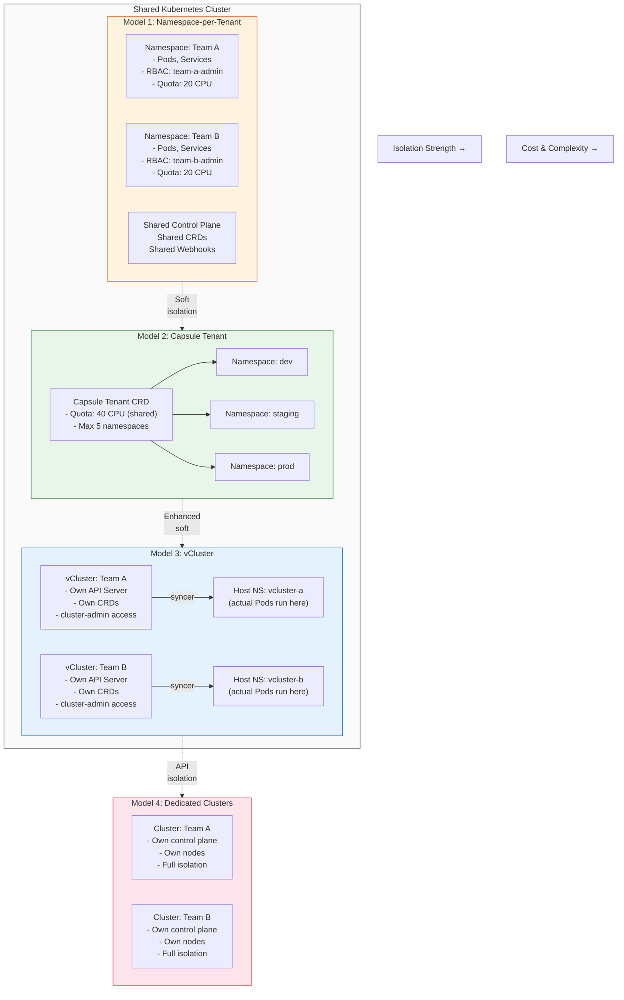

# Multi-Tenancy

## 1. Overview

Multi-tenancy in Kubernetes refers to sharing cluster infrastructure among multiple tenants -- teams, applications, business units, or external customers -- while maintaining isolation between them. The fundamental tension is between resource efficiency (sharing reduces cost) and isolation (sharing increases risk). Every multi-tenancy decision is a point on this spectrum, trading off operational complexity, cost, and security guarantees.

Kubernetes was not designed as a multi-tenant system. It was designed as a single-tenant orchestrator that provides building blocks -- namespaces, RBAC, resource quotas, network policies -- from which you can construct multi-tenancy. This means multi-tenancy in Kubernetes is always an assembly of features, not a single toggle. The quality of your multi-tenancy depends on how well you compose these building blocks and what additional tools (vCluster, Capsule, Loft) you layer on top.

The choice of multi-tenancy model has cascading effects on your security posture, cost structure, operational complexity, and developer experience. Getting it wrong either wastes money (over-isolation) or creates security incidents (under-isolation). This document covers the four primary models and provides a decision framework for choosing between them.

## 2. Why It Matters

- **Cost efficiency drives sharing.** Running a dedicated Kubernetes cluster per team is expensive -- each cluster has control plane overhead (3 nodes minimum for HA), monitoring stack, ingress controllers, and operational burden. Multi-tenancy on shared clusters can reduce infrastructure costs by 30-50% through better bin-packing and shared overhead.
- **Isolation prevents blast radius propagation.** A misconfigured resource quota, a runaway Pod consuming all node memory, or a compromised workload can affect co-tenants if isolation is insufficient. The noisy-neighbor problem is real and well-documented in shared Kubernetes environments.
- **Compliance requirements dictate isolation levels.** PCI-DSS workloads processing credit card data often require network-level isolation from non-PCI workloads. HIPAA-regulated healthcare data may require dedicated clusters. Regulatory requirements are the primary driver of hard isolation models.
- **Developer experience varies by model.** Namespace-per-tenant gives developers limited autonomy (they cannot install CRDs, create cluster-scoped resources, or customize admission policies). Virtual clusters (vCluster) give developers full cluster-admin experience within their isolated virtual cluster. The isolation model directly affects what developers can and cannot do.
- **Scaling the platform requires a tenancy model.** As an organization grows from 5 to 50 to 500 teams, the tenancy model determines whether you scale by adding namespaces, virtual clusters, or physical clusters -- each with different cost and operational curves.

## 3. Core Concepts

- **Tenant:** An entity that consumes cluster resources and requires isolation from other entities. A tenant can be a team, a project, an application, a customer, or a business unit depending on the organizational model. The tenant definition is a design choice that cascades through every isolation mechanism.
- **Soft Multi-Tenancy:** Isolation enforced by Kubernetes-native mechanisms (namespaces, RBAC, network policies, resource quotas) within a single cluster. Tenants share the control plane (API server, scheduler, etcd) and all cluster-scoped resources. Suitable for trusted tenants within the same organization where the threat model does not include malicious insiders.
- **Hard Multi-Tenancy:** Isolation enforced by dedicated control planes (dedicated clusters or virtual clusters) where tenants cannot affect each other's API server, scheduler, or cluster-wide configuration. Required when tenants are untrusted, when compliance mandates strict separation, or when tenants need cluster-admin capabilities.
- **Namespace:** The fundamental Kubernetes isolation primitive. Resources within a namespace are scoped to that namespace -- Pods, Services, ConfigMaps, Secrets, ServiceAccounts. However, namespaces do not provide network isolation (by default, all Pods can talk to all Pods), resource isolation (without quotas, a namespace can consume all cluster resources), or API isolation (tenants share CRDs, admission webhooks, and cluster-scoped resources).
- **Resource Quota:** A Kubernetes object that limits the total resource consumption (CPU, memory, storage, object count) within a namespace. Without quotas, a single namespace can starve others. Quotas are enforced at admission time -- if a Pod creation would exceed the quota, the API server rejects it.
- **LimitRange:** Sets default resource requests and limits for containers in a namespace. While ResourceQuota caps total namespace consumption, LimitRange caps individual container consumption and ensures every container has requests and limits set (preventing BestEffort QoS class).
- **Network Policy:** Kubernetes-native firewall rules that control Pod-to-Pod traffic at Layer 3/4. By default, all Pods can communicate with all other Pods in the cluster. Network policies implement a default-deny posture per namespace, then explicitly allow required traffic. Requires a CNI that supports network policies (Calico, Cilium, Antrea).
- **Virtual Cluster (vCluster):** A lightweight Kubernetes cluster that runs inside a namespace of a host cluster. Each virtual cluster has its own API server, controller manager, and (optionally) scheduler, but shares the host cluster's worker nodes and container runtime. Tenants get full cluster-admin access within their virtual cluster while the host cluster maintains control.
- **Capsule:** A Kubernetes operator that extends the namespace model with a Tenant CRD. A Capsule Tenant groups multiple namespaces under a single tenant entity with shared quotas, network policies, and RBAC -- without requiring a separate API server. It bridges the gap between namespace-per-tenant and virtual clusters.

## 4. How It Works

### Model 1: Namespace-per-Tenant (Soft Isolation)

The simplest model: each tenant gets one or more namespaces in a shared cluster with RBAC, quotas, and network policies.

**Setup per tenant:**
```yaml
# Namespace
apiVersion: v1
kind: Namespace
metadata:
  name: team-payments
  labels:
    tenant: payments
    cost-center: cc-1234
---
# Resource Quota
apiVersion: v1
kind: ResourceQuota
metadata:
  name: team-payments-quota
  namespace: team-payments
spec:
  hard:
    requests.cpu: "20"
    requests.memory: 40Gi
    limits.cpu: "40"
    limits.memory: 80Gi
    persistentvolumeclaims: "10"
    services.loadbalancers: "2"
    pods: "100"
---
# LimitRange (defaults for containers without explicit requests/limits)
apiVersion: v1
kind: LimitRange
metadata:
  name: default-limits
  namespace: team-payments
spec:
  limits:
    - default:
        cpu: 500m
        memory: 512Mi
      defaultRequest:
        cpu: 100m
        memory: 128Mi
      type: Container
---
# Network Policy: default deny ingress
apiVersion: networking.k8s.io/v1
kind: NetworkPolicy
metadata:
  name: default-deny-ingress
  namespace: team-payments
spec:
  podSelector: {}
  policyTypes:
    - Ingress
---
# Network Policy: allow intra-namespace traffic
apiVersion: networking.k8s.io/v1
kind: NetworkPolicy
metadata:
  name: allow-same-namespace
  namespace: team-payments
spec:
  podSelector: {}
  ingress:
    - from:
        - podSelector: {}
---
# RBAC: team gets admin within their namespace
apiVersion: rbac.authorization.k8s.io/v1
kind: RoleBinding
metadata:
  name: team-payments-admin
  namespace: team-payments
subjects:
  - kind: Group
    name: team-payments
    apiGroup: rbac.authorization.k8s.io
roleRef:
  kind: ClusterRole
  name: admin
  apiGroup: rbac.authorization.k8s.io
```

**Limitations:**
- No CRD isolation -- all tenants share CRDs, and CRD conflicts can affect all tenants.
- No admission webhook isolation -- a misconfigured webhook can block all tenants.
- Resource quotas only limit totals, not burst behavior -- a single Pod can spike CPU within its limits.
- No control over cluster-scoped resources (ClusterRoles, StorageClasses, IngressClasses).

### Model 2: Capsule (Enhanced Namespace Isolation)

Capsule introduces a Tenant CRD that groups namespaces and enforces policies at the tenant level:

```yaml
apiVersion: capsule.clastix.io/v1beta2
kind: Tenant
metadata:
  name: payments-team
spec:
  owners:
    - name: payments-group
      kind: Group
  namespaceOptions:
    quota: 5  # max 5 namespaces per tenant
  resourceQuotas:
    scope: Tenant  # quota applies across all tenant namespaces
    items:
      - hard:
          requests.cpu: "40"
          requests.memory: 80Gi
          limits.cpu: "80"
          limits.memory: 160Gi
          pods: "200"
  limitRanges:
    items:
      - limits:
          - default:
              cpu: 500m
              memory: 512Mi
            defaultRequest:
              cpu: 100m
              memory: 128Mi
            type: Container
  networkPolicies:
    items:
      - policyTypes:
          - Ingress
          - Egress
        ingress:
          - from:
              - namespaceSelector:
                  matchLabels:
                    capsule.clastix.io/tenant: payments-team
        egress:
          - to:
              - namespaceSelector:
                  matchLabels:
                    capsule.clastix.io/tenant: payments-team
          - to:
              - ipBlock:
                  cidr: 0.0.0.0/0  # allow external egress
  additionalRoleBindings:
    - clusterRoleName: capsule-namespace-deleter
      subjects:
        - kind: Group
          name: payments-group
```

**Capsule advantages over raw namespaces:**
- Tenant-scoped quotas: the 40 CPU quota is shared across all 5 namespaces, not per-namespace.
- Self-service namespace creation: tenants can create namespaces within their quota without cluster-admin.
- Automatic policy inheritance: network policies, limit ranges, and RBAC propagate to new namespaces automatically.
- Tenant isolation for Ingress: tenants can only create Ingress resources with hostnames matching their allowed domains.

### Model 3: vCluster (Virtual Clusters)

vCluster creates a full Kubernetes control plane (API server + controller manager + backing store) inside a namespace of the host cluster:

```bash
# Install vCluster CLI
# Create a virtual cluster for the payments team
vcluster create payments-team --namespace vcluster-payments \
  --set syncer.extraArgs="{--enforce-node-selector=true}" \
  --set isolation.enabled=true \
  --set isolation.resourceQuota.enabled=true \
  --set isolation.limitRange.enabled=true \
  --set isolation.networkPolicy.enabled=true

# Connect to the virtual cluster
vcluster connect payments-team --namespace vcluster-payments

# Now operating inside the virtual cluster -- full cluster-admin
kubectl get nodes  # sees synced nodes from host
kubectl create namespace my-app  # full namespace control
kubectl apply -f my-crd.yaml  # can install CRDs
```

**How vCluster works internally:**
1. A virtual cluster Pod runs inside a host namespace, containing a lightweight API server (k3s, k0s, or vanilla K8s) and a syncer.
2. The virtual API server stores its state in an embedded database (SQLite for k3s, etcd for vanilla).
3. The syncer watches for resources created in the virtual cluster and translates them to resources in the host namespace.
4. When a user creates a Pod in the virtual cluster, the syncer creates the actual Pod in the host namespace with modified names and labels.
5. The host cluster's kubelet schedules and runs the Pod on a real node.
6. The syncer reflects status updates back to the virtual cluster's API server.

**Isolation guarantees:**
- Full API isolation -- each tenant has their own API server, CRDs, admission webhooks, and RBAC.
- Resource isolation -- enforced by resource quotas on the host namespace.
- Network isolation -- host network policies restrict traffic between virtual clusters.
- No noisy-neighbor on the API plane -- one tenant's API requests do not affect another's API server.

### Model 4: Dedicated Clusters (Hard Isolation)

Each tenant gets a completely separate Kubernetes cluster, provisioned via Cluster API or a managed service (EKS, GKE, AKS).

```yaml
# Cluster API: provision a dedicated cluster per tenant
apiVersion: cluster.x-k8s.io/v1beta1
kind: Cluster
metadata:
  name: payments-team-cluster
  namespace: clusters
spec:
  clusterNetwork:
    services:
      cidrBlocks: ["10.96.0.0/12"]
    pods:
      cidrBlocks: ["192.168.0.0/16"]
  controlPlaneRef:
    apiVersion: controlplane.cluster.x-k8s.io/v1beta1
    kind: KubeadmControlPlane
    name: payments-team-cp
  infrastructureRef:
    apiVersion: infrastructure.cluster.x-k8s.io/v1beta1
    kind: AWSCluster
    name: payments-team-aws
```

**When dedicated clusters are required:**
- Regulatory compliance (PCI-DSS, HIPAA, SOX) mandates complete separation.
- Tenants are external customers (SaaS model) with contractual isolation requirements.
- Workloads have fundamentally different security profiles (e.g., ML training with GPU access vs. public-facing web services).
- Blast radius requirements demand that one tenant's failure cannot affect another under any circumstances.

## 5. Architecture / Flow



## 6. Types / Variants

### Multi-Tenancy Model Comparison

| Dimension | Namespace-per-Tenant | Capsule | vCluster | Dedicated Cluster |
|---|---|---|---|---|
| **API isolation** | None (shared API server) | None (shared API server) | Full (own API server) | Full (own cluster) |
| **CRD isolation** | None | None | Full | Full |
| **Network isolation** | Network policies (L3/L4) | Network policies (auto-applied) | Network policies + separate API | Physical/VPC-level |
| **Resource isolation** | Resource quotas per namespace | Tenant-scoped quotas | Resource quotas on host namespace | Complete |
| **Cluster-admin access** | No | No | Yes (within virtual cluster) | Yes |
| **Control plane overhead** | Zero (shared) | Minimal (Capsule operator) | Low (lightweight API server per tenant) | High (full CP per cluster) |
| **Cost per tenant** | Lowest | Low | Medium | Highest |
| **Operational complexity** | Low | Low-Medium | Medium | High |
| **Self-service namespace creation** | No (requires cluster-admin) | Yes (within tenant quota) | Yes (within virtual cluster) | N/A (own cluster) |
| **Blast radius** | Cluster-wide | Cluster-wide (but policy-limited) | Host namespace scoped | Tenant-only |
| **Best for** | Trusted teams, simple orgs | Mid-size orgs, multiple teams | Platform providers, CI/CD | Regulated, external tenants |

### Isolation Building Blocks

| Mechanism | What It Isolates | Layer | Limitations |
|---|---|---|---|
| **Namespace** | Resource naming scope | Logical | No network, no compute, no API isolation |
| **RBAC** | API access permissions | Authorization | Does not prevent resource consumption; only API access |
| **ResourceQuota** | Total resource consumption per namespace | Admission | Does not prevent burst within limits; no priority preemption |
| **LimitRange** | Per-container resource defaults/limits | Admission | Only applies to Pods; does not cover storage or network |
| **NetworkPolicy** | Pod-to-Pod network traffic (L3/L4) | Network (CNI) | No L7 filtering; requires CNI support; no egress DNS filtering |
| **PodSecurityAdmission** | Container security context | Admission | Coarse-grained (baseline/restricted profiles); no custom rules |
| **Node Affinity/Taints** | Compute isolation (dedicated nodes) | Scheduling | Expensive; underutilized nodes; needs node pool management |
| **Priority Classes** | Pod scheduling and eviction priority | Scheduling | Complex to reason about; can cause cascading evictions |

## 7. Use Cases

- **Multi-team platform (namespace model).** A startup with 5-20 teams uses namespace-per-tenant with RBAC and quotas. Each team gets a namespace with 20 CPU and 40 Gi memory quota. The platform team manages the cluster, CRDs, and shared services (ingress, monitoring). Teams deploy via GitOps into their namespace. This is the most common model for organizations under 50 teams.
- **Mid-size enterprise (Capsule).** A company with 30 teams needs more structure than raw namespaces. Capsule Tenant CRDs group each team's dev/staging/prod namespaces, enforce shared quotas across environments, and allow teams to self-service namespace creation. Network policies automatically isolate tenants. This avoids the operational overhead of virtual clusters while providing better isolation than raw namespaces.
- **Platform-as-a-Service provider (vCluster).** A platform team provides Kubernetes environments to 100+ development teams. Each team gets a vCluster with full cluster-admin access, ability to install their own CRDs and operators, and isolated API server. The host cluster manages resource allocation and network isolation. Teams experience "their own cluster" without the cost of dedicated infrastructure.
- **CI/CD ephemeral environments (vCluster).** Each pull request gets a temporary vCluster for integration testing. The vCluster provides a clean, isolated Kubernetes environment that is created in seconds, used for testing, and destroyed when the PR is merged. This avoids namespace collisions and provides realistic testing conditions.
- **Regulated workloads (dedicated clusters).** A financial services company separates PCI-DSS workloads (processing credit card data) onto a dedicated cluster with hardened security policies, dedicated node pools, and no network path to non-PCI clusters. Compliance auditors can inspect the isolated cluster without concern about shared infrastructure.
- **SaaS multi-tenancy (dedicated or vCluster).** A SaaS company running customer workloads uses dedicated clusters for enterprise customers (contractual isolation) and vClusters for smaller customers (cost efficiency). The Cluster API management plane provisions and lifecycle-manages both tiers from a central control plane.

## 8. Tradeoffs

| Decision | Option A | Option B | Guidance |
|---|---|---|---|
| **Namespace vs. vCluster** | Namespace: simpler, no extra control plane | vCluster: full API isolation, CRD freedom | Namespace for trusted internal teams; vCluster when teams need cluster-admin or CRD isolation |
| **Capsule vs. raw namespaces** | Capsule: tenant abstraction, auto-propagation | Raw: no additional operator, simpler debugging | Capsule when managing 10+ teams; raw namespaces for smaller orgs where manual setup is manageable |
| **vCluster vs. dedicated cluster** | vCluster: lower cost, shared infrastructure | Dedicated: complete isolation, no shared risk | vCluster for internal teams; dedicated for external tenants, compliance-mandated isolation, or fundamentally different workload profiles |
| **Shared nodes vs. dedicated nodes** | Shared: better utilization, lower cost | Dedicated: compute isolation, no noisy neighbor | Shared by default; dedicate nodes (via taints) only for performance-sensitive or compliance-required workloads |
| **Default-deny vs. default-allow network** | Default-deny: safer, blocks unknown traffic | Default-allow: simpler, less configuration | Always default-deny in multi-tenant clusters; the operational cost of writing allow rules is far less than the risk of cross-tenant data access |

## 9. Common Pitfalls

- **Relying on namespaces alone for security.** Namespaces are a logical boundary, not a security boundary. Without network policies, a Pod in namespace A can freely connect to a Pod in namespace B. Without resource quotas, namespace A can consume all cluster resources. Namespaces are the starting point, not the complete solution.
- **Forgetting cluster-scoped resources.** CRDs, ClusterRoles, StorageClasses, IngressClasses, PriorityClasses, and MutatingWebhookConfigurations are cluster-scoped. In namespace-per-tenant models, any tenant with permission to create these resources can affect all other tenants. Lock down cluster-scoped resource creation to platform administrators.
- **Resource quotas without LimitRanges.** Setting a namespace quota of 20 CPU without a LimitRange means developers can create Pods without resource requests. These BestEffort Pods bypass the quota (quotas only count requested resources) and can consume unlimited resources on the node. Always pair quotas with LimitRanges that enforce default requests.
- **Network policies without a supporting CNI.** Defining NetworkPolicy objects does nothing if the CNI plugin does not support them. The default kubenet CNI and some Flannel configurations silently ignore network policies. Verify your CNI supports and enforces network policies before trusting them for isolation.
- **vCluster resource leaks.** When a vCluster is deleted, resources synced to the host namespace must be cleaned up. If the syncer fails during deletion, orphaned Pods, Services, and PVCs can remain on the host cluster, consuming resources. Monitor host namespaces for orphaned resources.
- **Over-isolating and under-utilizing.** Running dedicated clusters for every team when namespace-level isolation would suffice wastes significant infrastructure. Each dedicated cluster has control plane overhead (3 nodes), monitoring overhead, and operational overhead. Match the isolation model to the actual threat model, not perceived risk.
- **Ignoring tenant resource visibility.** In namespace-per-tenant models, teams often cannot see their resource consumption relative to their quota. Provide dashboards (Grafana) or portal integrations (Backstage) that show each tenant their quota usage, cost allocation, and resource efficiency.

## 10. Real-World Examples

- **Loft Labs / vCluster adoption.** vCluster, created by Loft Labs, is used by organizations managing hundreds of development environments. In CNCF case studies (2025), organizations report creating ephemeral vClusters for CI/CD pipelines with 10-second creation times, providing isolated Kubernetes environments at 1/10th the cost of dedicated clusters. The CNCF highlighted vCluster as the solution for Kubernetes multi-tenancy challenges, noting that organizations have scaled to 500+ virtual clusters on a single host cluster.
- **Clastix / Capsule adoption.** Capsule, developed by Clastix, is deployed in organizations where namespace-level isolation is insufficient but vClusters are excessive. A typical deployment manages 20-50 tenants with 3-5 namespaces each. Capsule's tenant-scoped quotas eliminate the common problem of quota fragmentation (where per-namespace quotas leave unused capacity that other namespaces cannot access).
- **Shopify multi-tenancy.** Shopify's platform team manages clusters serving thousands of internal developers. They use namespace-per-tenant with automated RBAC, quotas, and network policies provisioned through GitOps. Custom admission controllers ensure every namespace has required labels, resource quotas, and default network policies before any Pods can be scheduled.
- **Multi-tenancy in the wild (industry patterns).** The 2025 Kubernetes multi-tenancy survey shows that 60% of organizations use namespace-per-tenant, 25% use virtual clusters, 10% use dedicated clusters, and 5% use Capsule or similar tenant abstractions. The trend is shifting toward virtual clusters as vCluster maturity improves and the cost overhead decreases.

## 11. Related Concepts

- [Internal Developer Platform](./01-internal-developer-platform.md) -- the IDP that provisions and manages tenant environments
- [Self-Service Abstractions](./03-self-service-abstractions.md) -- Crossplane claims for self-service tenant infrastructure
- [Enterprise Kubernetes Platform](./05-enterprise-kubernetes-platform.md) -- enterprise multi-tenancy with compliance and chargeback
- [RBAC and Access Control](../07-security-design/01-rbac-and-access-control.md) -- authorization model underlying tenant isolation
- [Policy Engines](../07-security-design/02-policy-engines.md) -- policy enforcement for tenant guardrails
- [Multi-Cluster Architecture](../02-cluster-design/03-multi-cluster-architecture.md) -- when to split tenants across clusters
- [Cost Observability](../09-observability-design/03-cost-observability.md) -- chargeback and showback per tenant

## 12. Source Traceability

- Kubernetes official documentation (kubernetes.io/docs/concepts/security/multi-tenancy) -- multi-tenancy models, namespace isolation
- vCluster documentation and CNCF blog (vcluster.com, cncf.io, 2025) -- virtual cluster architecture, multi-tenancy challenges
- Capsule project documentation (github.com/projectcapsule/capsule) -- Tenant CRD, tenant-scoped quotas, policy inheritance
- Spectro Cloud blog (spectrocloud.com, 2025) -- three key approaches to Kubernetes multi-tenancy
- CNCF multi-tenancy working group -- isolation models, security considerations, best practices
- InfoQ / CNCF (2025) -- vCluster multi-tenancy challenges and solutions
