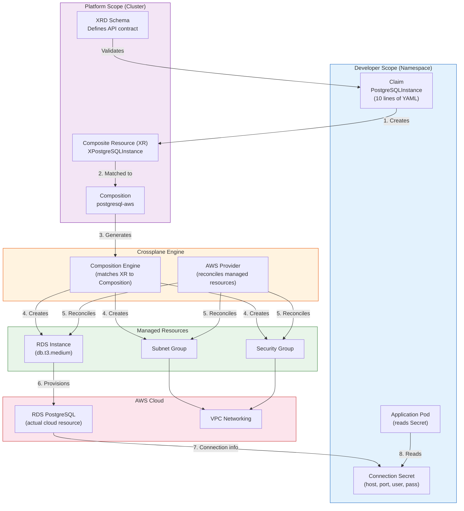
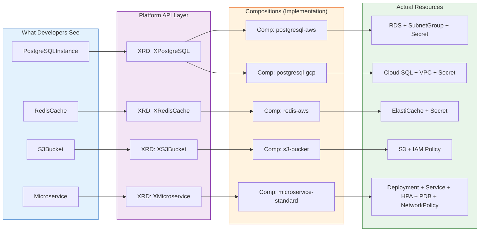

# Self-Service Abstractions

## 1. Overview

Self-service abstractions are the mechanism by which platform teams hide Kubernetes complexity behind purpose-built APIs that application developers can consume without understanding the underlying infrastructure. Instead of writing 200 lines of Kubernetes YAML to deploy a database (StatefulSet, PersistentVolumeClaim, Service, Secret, NetworkPolicy, ServiceMonitor), a developer submits a 10-line claim that says "I need a PostgreSQL database with 100GB storage and daily backups" -- and the platform figures out the rest.

This is the most impactful idea in platform engineering: **custom platform APIs that match the developer's mental model, not the infrastructure's object model.** The tools that enable this -- Crossplane, Kratix, Humanitec, KubeVela -- all share the same core insight: Kubernetes CRDs can be used to define higher-level abstractions that compose lower-level resources, creating a layered API that separates consumer concerns from provider implementation.

The abstraction spectrum runs from raw Kubernetes YAML (maximum flexibility, maximum complexity) through Helm charts (parameterized templates), Crossplane compositions (declarative composition with cloud provisioning), to full PaaS layers that hide Kubernetes entirely. Every platform sits somewhere on this spectrum, and the position is a product decision that depends on developer expertise, organizational standards, and the trade-off between flexibility and guardrails.

## 2. Why It Matters

- **Kubernetes' API surface is too large for application developers.** Kubernetes has 60+ resource types across 10+ API groups. Deploying a production-ready service requires composing Deployments, Services, Ingress, NetworkPolicies, PodDisruptionBudgets, HorizontalPodAutoscalers, ServiceMonitors, and more. Self-service abstractions collapse this into a single resource that encodes organizational best practices.
- **Infrastructure provisioning is the longest lead time.** When a team needs a database, cache, or message queue, the traditional workflow involves filing a ticket, waiting for approval, waiting for provisioning, and then configuring the application. Crossplane claims make this a `kubectl apply` that completes in minutes, not days.
- **Consistency requires automation, not documentation.** Writing a wiki page that says "all services must have resource limits, PDBs, and network policies" does not work at scale. Encoding these requirements into a Crossplane composition or Kratix promise ensures they are always applied -- the abstraction enforces the standard.
- **Cloud infrastructure and Kubernetes resources are provisioned separately today.** A service needs both Kubernetes resources (Deployment, Service) and cloud resources (RDS database, S3 bucket, IAM role). Without Crossplane, teams use Terraform in a CI/CD pipeline for cloud resources and kubectl/Helm for Kubernetes resources -- two separate workflows with no dependency management. Crossplane unifies both under the Kubernetes API.
- **The abstraction layer is the platform's primary product.** The self-service API is what developers interact with daily. Its design -- what it exposes, what it hides, what it defaults -- determines whether the platform feels like a productivity multiplier or an additional burden.

## 3. Core Concepts

- **Composite Resource Definition (XRD):** A Crossplane schema that defines a new custom API type. Think of it as a CRD builder: you define the API shape (what fields developers can set), the claim name (the namespace-scoped version developers interact with), and the composite resource name (the cluster-scoped version that the composition references). The XRD is the contract between the platform team (who writes the composition) and the application team (who submits the claim).
- **Composite Resource (XR):** An instance of an XRD. When a developer creates a claim, Crossplane creates a corresponding composite resource at the cluster scope. The XR is the controller's view of the resource -- it tracks the status of all composed resources and reports a single status back to the claim.
- **Claim (XRC):** A namespace-scoped resource that developers create to request infrastructure. Claims are the developer-facing API. A developer creates a `PostgreSQLInstance` claim in their namespace, and Crossplane provisions an RDS instance, creates a Secret with connection details, and reports the status back to the claim. Claims provide RBAC isolation -- developers only need permissions in their namespace.
- **Composition:** A Crossplane resource that defines how a composite resource maps to managed resources. A composition for `PostgreSQLInstance` might create an RDS instance, a subnet group, a security group, and a Kubernetes Secret -- all from a single claim. Compositions are where the platform team encodes best practices: instance sizing, backup policies, encryption settings, and monitoring configuration.
- **Managed Resource:** A Crossplane resource that represents a single external resource (an RDS instance, an S3 bucket, a GCP Cloud SQL instance). Managed resources are the low-level building blocks that compositions assemble. Each managed resource is reconciled by a Crossplane provider that calls the cloud API to create, update, or delete the external resource.
- **Provider:** A Crossplane plugin that knows how to manage resources on a specific cloud platform. Providers for AWS (provider-aws), GCP (provider-gcp), Azure (provider-azure), Terraform (provider-terraform), Helm (provider-helm), and Kubernetes (provider-kubernetes) extend Crossplane's capabilities. Each provider installs CRDs for the resources it can manage.
- **Kratix Promise:** In Kratix, a Promise is the equivalent of a Crossplane XRD + Composition. It defines an API (what the developer requests), a pipeline (steps to fulfill the request, including provisioning, validation, and configuration), and a destination (where the resources are deployed). Promises are more flexible than Crossplane compositions because the pipeline can include arbitrary logic (container-based steps), not just declarative resource mapping.
- **Humanitec Score:** An open-source workload specification that describes what a service needs (containers, databases, DNS, volumes) without specifying how or where those dependencies are provisioned. The Humanitec Platform Orchestrator interprets Score files and provisions the appropriate resources based on the deployment environment and organizational rules.
- **Abstraction Spectrum:** The continuum from raw Kubernetes YAML (no abstraction) to full PaaS (maximum abstraction). Each level trades flexibility for simplicity: raw K8s gives full control but maximum cognitive load; PaaS gives zero infrastructure concern but limited customization. The platform team's job is to find the right level for their organization.

## 4. How It Works

### Crossplane Architecture

Crossplane extends the Kubernetes API server with custom resource definitions for infrastructure provisioning. It runs as a set of controllers in the cluster:

**1. Define the API (XRD):**
```yaml
apiVersion: apiextensions.crossplane.io/v1
kind: CompositeResourceDefinition
metadata:
  name: xpostgresqlinstances.database.platform.example.com
spec:
  group: database.platform.example.com
  names:
    kind: XPostgreSQLInstance
    plural: xpostgresqlinstances
  claimNames:
    kind: PostgreSQLInstance
    plural: postgresqlinstances
  versions:
    - name: v1alpha1
      served: true
      referenceable: true
      schema:
        openAPIV3Schema:
          type: object
          properties:
            spec:
              type: object
              properties:
                parameters:
                  type: object
                  properties:
                    storageGB:
                      type: integer
                      description: Storage size in GB
                      default: 20
                    version:
                      type: string
                      description: PostgreSQL version
                      enum: ["14", "15", "16"]
                      default: "16"
                    size:
                      type: string
                      description: Instance size
                      enum: ["small", "medium", "large"]
                      default: "small"
                  required:
                    - storageGB
```

**2. Define the implementation (Composition):**
```yaml
apiVersion: apiextensions.crossplane.io/v1
kind: Composition
metadata:
  name: postgresql-aws
  labels:
    provider: aws
    crossplane.io/xrd: xpostgresqlinstances.database.platform.example.com
spec:
  compositeTypeRef:
    apiVersion: database.platform.example.com/v1alpha1
    kind: XPostgreSQLInstance
  resources:
    - name: rds-instance
      base:
        apiVersion: rds.aws.upbound.io/v1beta1
        kind: Instance
        spec:
          forProvider:
            engine: postgres
            engineVersion: "16"
            instanceClass: db.t3.micro
            allocatedStorage: 20
            storageEncrypted: true
            backupRetentionPeriod: 7
            multiAZ: false
            publiclyAccessible: false
            skipFinalSnapshot: false
            autoMinorVersionUpgrade: true
      patches:
        - type: FromCompositeFieldPath
          fromFieldPath: spec.parameters.storageGB
          toFieldPath: spec.forProvider.allocatedStorage
        - type: FromCompositeFieldPath
          fromFieldPath: spec.parameters.version
          toFieldPath: spec.forProvider.engineVersion
        - type: FromCompositeFieldPath
          fromFieldPath: spec.parameters.size
          toFieldPath: spec.forProvider.instanceClass
          transforms:
            - type: map
              map:
                small: db.t3.micro
                medium: db.t3.medium
                large: db.r6g.large
    - name: subnet-group
      base:
        apiVersion: rds.aws.upbound.io/v1beta1
        kind: SubnetGroup
        spec:
          forProvider:
            description: Subnet group for platform PostgreSQL
            subnetIds:
              - subnet-abc123
              - subnet-def456
    - name: connection-secret
      base:
        apiVersion: kubernetes.crossplane.io/v1alpha2
        kind: Object
        spec:
          forProvider:
            manifest:
              apiVersion: v1
              kind: Secret
              metadata:
                namespace: ""  # patched from claim namespace
              type: Opaque
  writeConnectionSecretsToNamespace: crossplane-system
```

**3. Developer creates a claim:**
```yaml
# This is all the developer writes
apiVersion: database.platform.example.com/v1alpha1
kind: PostgreSQLInstance
metadata:
  name: payments-db
  namespace: team-payments
spec:
  parameters:
    storageGB: 100
    version: "16"
    size: medium
  writeConnectionSecretToRef:
    name: payments-db-creds
```

**4. What happens next:**
1. The claim creates a cluster-scoped `XPostgreSQLInstance` composite resource.
2. Crossplane's composition engine matches the XR to the `postgresql-aws` Composition.
3. The composition creates managed resources: RDS Instance, SubnetGroup, and a Kubernetes Secret.
4. The AWS provider reconciles the managed resources, calling the AWS API to create the RDS instance.
5. When the RDS instance is ready, Crossplane writes the connection details (host, port, username, password) to a Secret in the developer's namespace.
6. The developer's application reads the Secret and connects to the database.

### Crossplane v2 Changes

Crossplane 2.0 (released 2025) introduced significant changes:
- **Namespace-scoped by default:** Both composite resources and managed resources are now namespaced, improving multi-tenancy and RBAC isolation.
- **Application support:** Compositions can now manage both infrastructure and Kubernetes workload resources (Deployments, Services) in a single composition, eliminating the gap between infrastructure and application provisioning.
- **Improved status reporting:** Composed resources report detailed status back to the claim, so developers can see exactly what is happening during provisioning.

### Kratix: Promise-Based Platform

Kratix takes a different approach from Crossplane. Instead of declarative compositions, Kratix uses container-based pipelines to fulfill requests:

```yaml
apiVersion: platform.kratix.io/v1alpha1
kind: Promise
metadata:
  name: postgresql
spec:
  api:
    apiVersion: apiextensions.k8s.io/v1
    kind: CustomResourceDefinition
    metadata:
      name: postgresqls.database.platform.example.com
    spec:
      group: database.platform.example.com
      names:
        kind: PostgreSQL
        plural: postgresqls
      scope: Namespaced
      versions:
        - name: v1
          served: true
          storage: true
          schema:
            openAPIV3Schema:
              type: object
              properties:
                spec:
                  type: object
                  properties:
                    size:
                      type: string
                      enum: ["small", "medium", "large"]
                    teamId:
                      type: string
  workflows:
    resource:
      configure:
        - apiVersion: platform.kratix.io/v1alpha1
          kind: Pipeline
          metadata:
            name: provision-postgres
          spec:
            containers:
              - name: validate
                image: platform/postgres-validator:v1
              - name: generate-resources
                image: platform/postgres-generator:v1
              - name: configure-monitoring
                image: platform/monitoring-setup:v1
              - name: notify-team
                image: platform/slack-notifier:v1
  destinationSelectors:
    - matchLabels:
        environment: production
```

**Kratix vs. Crossplane:**
- Kratix pipelines can run arbitrary logic (call external APIs, run validation scripts, send notifications) while Crossplane compositions are purely declarative resource mapping.
- Crossplane has a much larger provider ecosystem (AWS, GCP, Azure with thousands of managed resource types).
- Kratix is more flexible for complex workflows; Crossplane is more predictable for standard infrastructure provisioning.
- Kratix destinations support multi-cluster delivery (resources are written to a GitOps repository for a specific cluster); Crossplane provisions resources in the cluster where it runs.

### The Abstraction Spectrum

| Level | Tool | Developer Writes | Platform Controls | Flexibility | Cognitive Load |
|---|---|---|---|---|---|
| **Raw Kubernetes** | kubectl, kustomize | Full YAML manifests | Nothing | Maximum | Maximum |
| **Parameterized Templates** | Helm | values.yaml | Chart templates with defaults | High | High |
| **Validated Templates** | Helm + Policy | values.yaml | Templates + admission policies | High | Medium-High |
| **Platform APIs** | Crossplane, Kratix | Claims (10-20 lines) | Compositions, pipelines | Medium | Low |
| **Workload Spec** | Score, KubeVela | Workload description | Everything below the spec | Low | Low |
| **Full PaaS** | Heroku-style | `git push` | Everything | Minimal | Minimal |

**The right level depends on your developers:**
- Infrastructure engineers working on the platform itself: Raw Kubernetes + Helm.
- Backend engineers building microservices: Platform APIs (Crossplane claims).
- Frontend engineers deploying web applications: Workload Spec or PaaS.
- Data scientists running ML experiments: PaaS with GPU support.

## 5. Architecture / Flow



### Abstraction Layer Architecture



## 6. Types / Variants

### Self-Service Abstraction Tools

| Tool | Approach | API Style | Strengths | Weaknesses |
|---|---|---|---|---|
| **Crossplane** | Declarative compositions | Kubernetes CRDs (XRD/Claim) | Largest cloud provider coverage; Kubernetes-native; strong composition model | Steep learning curve; debugging compositions is hard; resource drift handling |
| **Kratix** | Pipeline-based promises | Kubernetes CRDs | Flexible pipelines (arbitrary logic); multi-cluster delivery; GitOps native | Smaller community; fewer providers; newer project |
| **Humanitec** | Score workload spec + orchestrator | Score YAML + API | SaaS (no ops); dynamic resource management; graph-based dependency resolution | Vendor lock-in; less transparent than open-source; cost |
| **KubeVela** | OAM-based application model | Application CRD | Application-centric (not just infra); trait system for cross-cutting concerns | Complex OAM model; smaller Western community |
| **Terraform Operator** | Terraform runs triggered by CRDs | CRD wrapping Terraform modules | Leverages existing Terraform modules and expertise | Not truly Kubernetes-native; Terraform state management; slower reconciliation |
| **Radius** | Application graph model | Radius recipes | Microsoft-backed; application-centric; multi-cloud | Very new; small community; unclear long-term trajectory |

### Composition Patterns

| Pattern | Description | When to Use |
|---|---|---|
| **Single-resource composition** | One claim maps to one managed resource | Simple abstractions (e.g., S3 bucket with standard config) |
| **Multi-resource composition** | One claim creates multiple managed resources | Standard pattern (e.g., database + networking + secrets) |
| **Nested composition** | Compositions that reference other compositions | Complex platforms (e.g., "application" composition references "database" and "cache" compositions) |
| **Environment-aware composition** | Different compositions per environment (dev/staging/prod) | Cost optimization (smaller instances in dev, HA in prod) |
| **Multi-cloud composition** | Same XRD, different compositions per cloud provider | Multi-cloud platforms (PostgreSQL on AWS RDS or GCP Cloud SQL based on context) |

## 7. Use Cases

- **Database self-service.** The most common Crossplane use case. Developers create a `PostgreSQLInstance` claim, and the platform provisions an RDS instance with encryption, backups, VPC placement, and monitoring -- all encoded in the composition. Provisioning time drops from 3-5 days (ticket-based) to 5-10 minutes (self-service). Connection credentials are automatically injected as Kubernetes Secrets.
- **Environment provisioning.** A team needs a complete environment (namespace, database, cache, message queue, IAM roles). A single "Environment" claim triggers a composition that provisions all resources and wires them together. This is particularly powerful for preview environments per pull request, where the entire environment is created for testing and destroyed after merge.
- **Multi-cloud abstraction.** A company runs workloads on both AWS and GCP. The platform defines a `PostgreSQLInstance` XRD with two compositions: `postgresql-aws` (provisions RDS) and `postgresql-gcp` (provisions Cloud SQL). Developers use the same claim regardless of cloud provider, and the platform routes to the appropriate composition based on cluster labels or composition selectors.
- **Compliance-by-default.** The platform team embeds compliance requirements into compositions: all databases are encrypted at rest, all S3 buckets have versioning enabled, all IAM roles follow least-privilege principles. Developers cannot create non-compliant resources because the abstraction does not expose the non-compliant options. This is "guardrails not gates" implemented at the API level.
- **Infrastructure migration.** When the company decides to migrate from self-managed PostgreSQL to managed RDS, the platform team updates the composition while keeping the XRD unchanged. Developers' claims are unaffected -- they still create `PostgreSQLInstance` resources, but the implementation changes transparently. This decouples infrastructure evolution from application development.

## 8. Tradeoffs

| Decision | Option A | Option B | Guidance |
|---|---|---|---|
| **Crossplane vs. Terraform** | Crossplane: Kubernetes-native, continuous reconciliation | Terraform: mature, larger module ecosystem, one-shot provisioning | Crossplane for Kubernetes-centric platforms; Terraform for organizations with existing Terraform expertise and modules they cannot rewrite |
| **Crossplane vs. Kratix** | Crossplane: declarative, large provider ecosystem | Kratix: pipeline-based, arbitrary logic, multi-cluster | Crossplane for standard cloud resource provisioning; Kratix for complex workflows requiring custom logic |
| **Thin vs. thick abstractions** | Thin: expose many parameters, high flexibility | Thick: hide most parameters, strong defaults | Start thick (3-5 parameters); add parameters as teams request them; never expose parameters that violate platform policies |
| **Single XRD vs. per-environment XRD** | Single XRD with environment parameter | Separate XRDs for dev/staging/prod | Single XRD with environment-specific compositions; separate XRDs only when the API shape genuinely differs across environments |
| **Claim-per-resource vs. application-level claim** | Individual claims for each resource (DB, cache, queue) | Single "Application" claim that provisions everything | Start with individual claims for composability; consider application-level claims for standardized stacks |

## 9. Common Pitfalls

- **Abstraction leaks.** When a Crossplane claim fails, the error often references internal managed resource details that the developer is supposed to be abstracted from. Invest in status conditions, events, and error translations that map infrastructure errors to developer-understandable messages.
- **Composition sprawl.** Without governance, platform teams create dozens of compositions for slight variations (PostgreSQL-small-encrypted, PostgreSQL-medium-encrypted, PostgreSQL-large-unencrypted). Use patches and transforms to parameterize a single composition instead of creating variants.
- **Ignoring the Day 2 story.** Provisioning is Day 1; upgrades, backups, failover, and decommissioning are Day 2. If your abstraction provisions a database but provides no mechanism for version upgrades, backup restores, or connection pool changes, developers will bypass the abstraction for Day 2 operations, creating a shadow infrastructure management process.
- **No dependency management.** An application depends on a database and a cache. If the developer creates both claims simultaneously, the application Pod may start before the database is ready. Build dependency ordering into your abstractions (using Crossplane's `readinessChecks` and `connectionDetails`) or document the ordering requirements clearly.
- **Over-abstracting too early.** Building a Crossplane composition for every possible resource before teams need it wastes platform engineering effort. Start with the 3-5 most requested resources (typically: PostgreSQL, Redis, S3, IAM roles), get feedback, and expand incrementally.
- **Provider version drift.** Crossplane providers release frequently, and managed resource schemas change. Pin provider versions in production, test upgrades in staging, and have a plan for migrating resources when breaking changes occur.
- **Debugging is hard.** A claim creates an XR, which creates managed resources, which call cloud APIs. When something fails, tracing the error through four layers of abstraction is challenging. Build observability into the platform: Crossplane metrics in Prometheus, status events on claims, and runbooks for common failure modes.

## 10. Real-World Examples

- **Upbound / Crossplane adoption.** Crossplane, created by Upbound and now a CNCF Graduated project, is deployed in thousands of organizations. Crossplane 2.0 (2025) added namespace-scoped resources and application support, addressing the top two community requests. Organizations report 80% reduction in infrastructure provisioning time and 90% reduction in configuration drift when migrating from ticket-based Terraform workflows to Crossplane claims.
- **Kratix / Syntasso.** Syntasso, the company behind Kratix, reports enterprise deployments where platform teams define 15-20 Promises covering databases, queues, observability stacks, and complete application environments. Kratix's pipeline model is particularly popular for organizations that need to call external systems (ServiceNow for ITSM tickets, Vault for secrets, PagerDuty for on-call setup) as part of the provisioning workflow.
- **Humanitec / Score adoption.** Humanitec's Platform Orchestrator is used by enterprise organizations that want a managed platform layer without building from open-source components. The Score specification provides a cloud-agnostic workload definition that can be deployed to any environment. Organizations report that Score reduces the YAML developers need to write by 90% compared to raw Kubernetes manifests.
- **Crossplane at scale.** Large-scale Crossplane deployments manage thousands of managed resources across multiple cloud providers. Performance benchmarks show Crossplane can reconcile 5,000+ managed resources on a single cluster with sub-minute reconciliation intervals, though large compositions (20+ resources per claim) can slow initial provisioning.

## 11. Related Concepts

- [Internal Developer Platform](./01-internal-developer-platform.md) -- the IDP that exposes self-service abstractions through a portal
- [Multi-Tenancy](./02-multi-tenancy.md) -- namespace-scoped claims provide tenant isolation for self-service
- [Developer Experience](./04-developer-experience.md) -- self-service abstractions reduce inner-loop friction
- [Enterprise Kubernetes Platform](./05-enterprise-kubernetes-platform.md) -- enterprise-scale self-service with approval workflows
- [Policy Engines](../07-security-design/02-policy-engines.md) -- policies that validate claims and compositions
- [Multi-Cluster Architecture](../02-cluster-design/03-multi-cluster-architecture.md) -- Crossplane managing resources across clusters

## 12. Source Traceability

- Crossplane official documentation (docs.crossplane.io) -- XRD, compositions, claims, provider architecture
- Crossplane v2.0 release notes (docs.crossplane.io, 2025) -- namespace-scoped resources, application support
- Kratix documentation (docs.kratix.io) -- Promise model, pipelines, destinations
- Humanitec Score specification (score.dev) -- workload specification, platform orchestrator
- Syntasso blog (syntasso.io) -- Kratix enterprise patterns, promise design
- PlatformCon 2025 -- abstraction spectrum discussions, Crossplane + Backstage integration
- ITNEXT (itnext.io) -- "Stop Building Platforms Nobody Uses: Pick the Right Kubernetes Abstraction"
- InfraCloud blog (infracloud.io) -- Mastering platform engineering with Kratix
