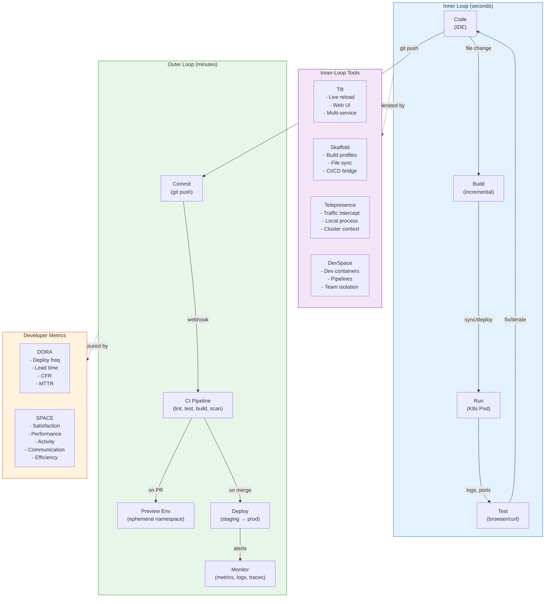
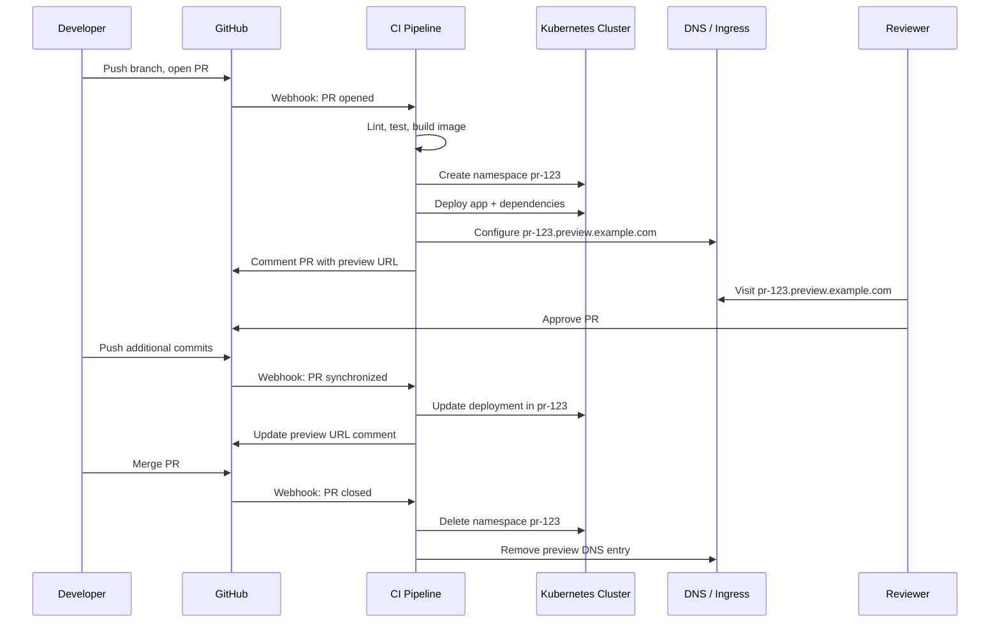

# Developer Experience

## 1. Overview

Developer experience (DevEx or DX) in Kubernetes encompasses the tools, workflows, and feedback loops that determine how quickly and comfortably engineers can go from writing code to seeing it run in a production-like environment. The developer experience is not one tool -- it is the entire journey, split into two loops: the **inner loop** (code, build, run, test on a local or development environment) and the **outer loop** (commit, CI, deploy to staging/production, monitor).

The inner loop happens hundreds of times per day. If it takes 30 seconds to see a code change reflected in a running application, developers stay in flow. If it takes 5 minutes, they context-switch to Slack, email, or another task. The tools in this space -- Tilt, Skaffold, Telepresence, DevSpace -- exist to compress the inner loop from minutes to seconds.

The outer loop happens tens of times per day. When a developer pushes code, they need to know within minutes whether it passes CI, whether a preview environment is available for review, and whether the deployment to staging succeeded. Preview environments per pull request, ephemeral namespaces, and automated deployment pipelines compress this loop.

The combination of fast inner loops and smooth outer loops -- backed by developer portals, CLI tools, and clear documentation -- is what transforms Kubernetes from a complex infrastructure system into a productivity multiplier. Organizations that invest in developer experience report 2-4x improvements in deployment frequency and 50% reductions in lead time for changes, closely tracking DORA elite performance levels.

## 2. Why It Matters

- **The inner loop dominates developer time.** Developers spend 70-80% of their time in the inner loop: writing code, building, testing, and debugging. A 60-second build-deploy cycle costs a developer 30-60 minutes per day in waiting. At 100 engineers, that is 50-100 person-hours per day lost to tooling friction.
- **Kubernetes breaks the traditional inner loop.** Before Kubernetes, the inner loop was simple: save file, restart process, test in browser. With Kubernetes, the inner loop becomes: save file, build Docker image, push to registry, update manifest, wait for Pod rollout, check logs. This 3-5 minute cycle kills developer flow unless mitigated by specialized tools.
- **Preview environments replace shared staging.** Traditional staging environments are shared, contended, and perpetually broken. When 20 teams deploy to the same staging environment, conflicts are constant. Preview environments per pull request give each change its own isolated, ephemeral environment -- eliminating contention and enabling parallel development.
- **Developer satisfaction drives retention.** Stack Overflow's developer surveys consistently show that developer tooling and experience are top factors in job satisfaction. Organizations with poor DX lose engineers to competitors with better platforms. Investing in DX is an investment in retention.
- **Measurable impact through DORA and SPACE metrics.** Developer experience improvements are not subjective -- they are measurable. DORA metrics (deployment frequency, lead time, change failure rate, mean time to recovery) and SPACE metrics (satisfaction, performance, activity, communication, efficiency) provide quantitative evidence of DX investments.

## 3. Core Concepts

- **Inner Loop:** The tight feedback cycle a developer executes repeatedly during active coding: change code, build, deploy to a development environment, test, repeat. The goal is to make this cycle as fast as possible -- ideally sub-10 seconds. Inner-loop tools work by eliminating unnecessary steps (no full Docker build, no registry push) and syncing changes directly to running containers.
- **Outer Loop:** The broader cycle that begins when code is committed: push code, CI pipeline runs (lint, test, build, scan), deploy to staging or preview environment, review, merge, deploy to production, monitor. The outer loop is optimized by CI/CD automation, preview environments, and deployment pipelines.
- **Live Reload / Hot Reload:** The ability to see code changes reflected in a running container without rebuilding the Docker image or restarting the Pod. Achieved through file sync (copying changed files into the running container) or process restart within the container. Tilt and DevSpace excel at this.
- **File Sync:** Copying changed source files from the developer's local filesystem into a running container in Kubernetes. This bypasses the Docker build step entirely, reducing the feedback cycle from minutes to seconds. Most inner-loop tools support file sync as their primary acceleration mechanism.
- **Preview Environment:** An ephemeral, isolated deployment created for a specific pull request or branch. Preview environments provide a production-like URL where reviewers can test changes before merging. They are created automatically by CI/CD pipelines and destroyed when the PR is merged or closed.
- **Ephemeral Namespace:** A temporary Kubernetes namespace created for a specific purpose (PR testing, demo, experiment) and automatically cleaned up after a TTL or trigger. Ephemeral namespaces provide isolation without the overhead of dedicated clusters.
- **DORA Metrics:** Four key metrics defined by the DevOps Research and Assessment team: Deployment Frequency (how often you deploy), Lead Time for Changes (time from commit to production), Change Failure Rate (percentage of deployments that cause failures), and Mean Time to Recovery (how quickly you recover from failures). Elite performers deploy on demand, have lead times under one hour, change failure rate under 5%, and MTTR under one hour.
- **SPACE Framework:** A developer productivity framework with five dimensions: Satisfaction and well-being (developer happiness), Performance (code quality, reliability), Activity (commits, PRs, deploys), Communication and collaboration (code review speed, knowledge sharing), and Efficiency and flow (uninterrupted time, tool friction). SPACE is broader than DORA, capturing the human experience of development.
- **Cognitive Load:** The mental effort required to complete a task. In platform engineering, cognitive load is the key metric to optimize. Every tool, configuration file, and manual step adds cognitive load. The goal is to minimize extraneous cognitive load (infrastructure complexity) so developers can focus on intrinsic cognitive load (business logic).

## 4. How It Works

### Inner-Loop Tools

#### Tilt

Tilt provides a web UI and a Tiltfile (written in Starlark, a Python dialect) that defines how to build, deploy, and watch services. Its key innovation is intelligent rebuild: it watches source files, determines what changed, and applies the minimum update needed.

```python
# Tiltfile
# Define how to build the Docker image
docker_build(
    'payment-service',
    '.',
    dockerfile='Dockerfile',
    live_update=[
        # Sync source files into the running container
        sync('./src', '/app/src'),
        # Restart the process when Go files change
        run('go build -o /app/server ./cmd/server', trigger=['./src']),
    ]
)

# Deploy to Kubernetes
k8s_yaml('k8s/deployment.yaml')

# Define port forwards for local access
k8s_resource(
    'payment-service',
    port_forwards='8080:8080',
    labels=['backend']
)

# Add dependencies
k8s_yaml('k8s/redis.yaml')
k8s_resource('redis', labels=['infra'])
```

**Tilt workflow:**
1. Developer runs `tilt up` -- Tilt builds images, deploys to Kubernetes, opens web UI.
2. Developer edits `src/handler.go`.
3. Tilt detects the change, syncs the file into the running container (no Docker build).
4. Tilt runs the rebuild command inside the container.
5. The service restarts with the new code in 2-3 seconds.
6. The Tilt web UI shows build status, logs, and resource health.

#### Skaffold

Skaffold, developed by Google, automates the build-push-deploy cycle with a `skaffold.yaml` configuration:

```yaml
# skaffold.yaml
apiVersion: skaffold/v4beta11
kind: Config
build:
  artifacts:
    - image: payment-service
      docker:
        dockerfile: Dockerfile
      sync:
        manual:
          - src: 'src/**/*.go'
            dest: /app/src
  local:
    push: false  # no registry push for local dev
deploy:
  kubectl:
    manifests:
      - k8s/*.yaml
portForward:
  - resourceType: deployment
    resourceName: payment-service
    port: 8080
    localPort: 8080
profiles:
  - name: dev
    activation:
      - command: dev
    build:
      local:
        push: false
  - name: staging
    build:
      googleCloudBuild: {}
    deploy:
      kustomize:
        paths:
          - k8s/overlays/staging
```

**Skaffold workflow:**
1. `skaffold dev` enters a continuous development loop.
2. Skaffold watches source files, builds images (using local Docker or remote Cloud Build), deploys to Kubernetes, and streams logs.
3. File sync injects changes into running containers for supported file types.
4. Full rebuild + redeploy triggers for Dockerfile or manifest changes.
5. `skaffold run` performs a one-shot build-and-deploy (for CI/CD integration).

**Key Skaffold differentiator:** Profiles allow the same configuration to work for local dev (no push, local Docker), CI (remote build, no deploy), staging (remote build, kustomize overlay), and production (remote build, Helm). One tool spans the entire lifecycle.

#### Telepresence

Telepresence takes a fundamentally different approach: instead of building and deploying to a cluster, it routes traffic from a remote Kubernetes cluster to a process running on the developer's laptop:

```bash
# Connect to the remote cluster
telepresence connect

# Intercept traffic for a specific service
telepresence intercept payment-service --port 8080:8080

# Now run the service locally
go run ./cmd/server

# Traffic that would go to payment-service in the cluster
# is routed to localhost:8080 instead
```

**Telepresence workflow:**
1. Developer connects Telepresence to the remote cluster. A traffic manager is deployed to the cluster.
2. Developer intercepts a specific service. Telepresence injects a sidecar into the target Pod that redirects traffic.
3. The developer runs the service locally on their laptop. All requests to the intercepted service are forwarded to the local process.
4. The local process can access other cluster services (databases, caches, message queues) through the Telepresence network tunnel.
5. No Docker build, no image push, no Pod deployment. The developer's IDE debugger works natively.

**Best for:** Debugging complex issues that require a full cluster context (e.g., testing against real databases, real message queues, real service meshes) without deploying a complete stack locally.

#### DevSpace

DevSpace combines elements of Tilt and Skaffold with additional features for team collaboration:

```yaml
# devspace.yaml
version: v2beta1
images:
  payment-service:
    image: payment-service
    dockerfile: Dockerfile
deployments:
  payment-service:
    kubectl:
      manifests:
        - k8s/deployment.yaml
dev:
  payment-service:
    imageSelector: payment-service
    sync:
      - path: ./src:/app/src
    terminal: {}
    ports:
      - port: "8080"
    logs: {}
    restartHelper:
      inject: true
pipelines:
  dev:
    run: |
      create_deployments --all
      start_dev payment-service
  deploy:
    run: |
      build_images --all
      create_deployments --all
```

**DevSpace differentiators:** Dev containers (start a terminal inside the running container), pipeline definitions for custom workflows, and namespace isolation per developer (each developer gets their own namespace).

### Inner-Loop Tool Comparison

| Feature | Tilt | Skaffold | Telepresence | DevSpace |
|---|---|---|---|---|
| **File sync** | Yes (live_update) | Yes (sync) | No (traffic intercept) | Yes (sync) |
| **Docker build** | Yes + smart rebuild | Yes + multiple builders | No (runs locally) | Yes |
| **Web UI** | Yes (built-in) | No (CLI only) | No (CLI only) | No (CLI only) |
| **Multi-service** | Excellent | Good | Single-service intercept | Good |
| **Remote cluster** | Yes | Yes | Yes (primary mode) | Yes |
| **IDE integration** | VS Code extension | VS Code + IntelliJ | Native debugging | VS Code extension |
| **Learning curve** | Medium (Starlark) | Low (YAML) | Low | Low-Medium |
| **Maintained by** | Docker (acquired Tilt) | Google | Ambassador Labs | Loft Labs |

### Outer-Loop: Preview Environments

Preview environments give every pull request its own isolated deployment for testing and review:

**Implementation approaches:**

**1. Namespace-per-PR:**
```yaml
# GitHub Actions workflow
name: Preview Environment
on:
  pull_request:
    types: [opened, synchronize]
jobs:
  deploy-preview:
    runs-on: ubuntu-latest
    steps:
      - name: Create namespace
        run: kubectl create namespace pr-${{ github.event.number }} --dry-run=client -o yaml | kubectl apply -f -
      - name: Deploy application
        run: |
          helm upgrade --install preview-${{ github.event.number }} ./chart \
            --namespace pr-${{ github.event.number }} \
            --set image.tag=${{ github.sha }} \
            --set ingress.host=pr-${{ github.event.number }}.preview.example.com
      - name: Comment PR with URL
        uses: actions/github-script@v7
        with:
          script: |
            github.rest.issues.createComment({
              issue_number: context.issue.number,
              owner: context.repo.owner,
              repo: context.repo.repo,
              body: '🔗 Preview: https://pr-${{ github.event.number }}.preview.example.com'
            })
  cleanup:
    if: github.event.action == 'closed'
    runs-on: ubuntu-latest
    steps:
      - run: kubectl delete namespace pr-${{ github.event.number }}
```

**2. vCluster-per-PR:**
For workloads that need CRD isolation or cluster-admin access during testing:
```bash
# Create a vCluster for the PR
vcluster create pr-$PR_NUMBER --namespace previews \
  --set isolation.enabled=true \
  --set sync.generic.config="..."
# Deploy the application into the vCluster
vcluster connect pr-$PR_NUMBER -- helm upgrade --install app ./chart
# Cleanup on PR close
vcluster delete pr-$PR_NUMBER --namespace previews
```

**3. Service-level sandboxing (Signadot, Namespace):**
Instead of deploying the entire stack per PR, create a lightweight sandbox that only contains the changed service and routes traffic through the shared staging environment for unchanged services. This is more resource-efficient for large microservice architectures.

### Environment Management

| Environment | Purpose | Lifetime | Isolation | Size |
|---|---|---|---|---|
| **Local (minikube/kind)** | Developer inner loop | Persistent | Developer laptop | Single service + mocks |
| **Dev cluster** | Shared development | Persistent | Namespace per developer | Full stack, shared data |
| **Preview (per-PR)** | Feature testing, review | Ephemeral (PR lifecycle) | Namespace or vCluster | Feature branch + dependencies |
| **Staging** | Pre-production validation | Persistent | Dedicated namespace or cluster | Production-like |
| **Production** | Live traffic | Persistent | Dedicated cluster | Full scale |

### Developer Portals and CLI Tools

The developer experience is incomplete without discoverability and documentation:

**Developer Portal (Backstage):**
- Service catalog: find any service, its owner, documentation, and status.
- Template gallery: create new services from golden-path templates.
- Plugin integrations: CI/CD status, monitoring dashboards, cost allocation, security scans.
- TechDocs: rendered documentation from repositories.

**Platform CLI:**
- Custom CLI tools (built with Cobra/Click) that wrap complex kubectl commands.
- Example: `platform create service --name my-app --team payments` instead of writing and applying YAML manifests.
- The CLI calls the same platform APIs as the portal, ensuring consistency.

### Measuring Developer Experience

**DORA Metrics:**

| Metric | Elite | High | Medium | Low |
|---|---|---|---|---|
| **Deployment Frequency** | On demand (multiple/day) | Weekly-Monthly | Monthly-Biannually | Annually |
| **Lead Time for Changes** | < 1 hour | 1 day - 1 week | 1 week - 1 month | > 6 months |
| **Change Failure Rate** | < 5% | 5-10% | 10-15% | > 15% |
| **Mean Time to Recovery** | < 1 hour | < 1 day | < 1 week | > 6 months |

**SPACE Framework:**

| Dimension | Example Metrics | Collection Method |
|---|---|---|
| **Satisfaction** | Developer satisfaction score, tool NPS | Quarterly surveys |
| **Performance** | Code review quality, production incidents | System metrics |
| **Activity** | Commits, PRs, deploys, code reviews | Git/CI/CD metrics |
| **Communication** | PR review turnaround, documentation contributions | Git/Slack metrics |
| **Efficiency** | Build time, deploy time, context switches | Tool telemetry, time tracking |

**Practical measurement approach:**
1. Start with DORA metrics -- they are well-defined and automatable.
2. Add developer satisfaction surveys (quarterly, 5-10 questions).
3. Track tool-specific metrics: build time p50/p95, deploy time, preview environment creation time.
4. Correlate metrics over time to measure the impact of DX investments.

## 5. Architecture / Flow



### Preview Environment Lifecycle



## 6. Types / Variants

### Inner-Loop Development Approaches

| Approach | How It Works | Tools | Best For |
|---|---|---|---|
| **Local cluster** | Run a full K8s cluster on the laptop (minikube, kind, Docker Desktop) | Tilt, Skaffold, DevSpace | Single-service development, simple dependencies |
| **Remote cluster + file sync** | Deploy to a shared dev cluster; sync files into running Pods | Tilt, Skaffold, DevSpace | Multi-service development, realistic environment |
| **Traffic intercept** | Run the service locally; route cluster traffic to localhost | Telepresence | Debugging production issues, complex service mesh |
| **Dev containers** | Start a shell inside a running container; edit and rebuild in-cluster | DevSpace, kubectl exec | Quick fixes, exploring the runtime environment |
| **Cloud development environments** | Full IDE running in the cloud (Gitpod, GitHub Codespaces) with K8s access | Gitpod + Tilt | Standardized environments, fast onboarding |

### Preview Environment Strategies

| Strategy | Isolation | Cost | Setup Complexity | Best For |
|---|---|---|---|---|
| **Namespace-per-PR** | Namespace (soft) | Low | Low | Simple applications, small teams |
| **vCluster-per-PR** | Virtual cluster (hard) | Medium | Medium | CRD-dependent apps, complex testing |
| **Service sandbox** | Shared environment + routed sandbox | Lowest | Medium | Large microservice architectures |
| **Dedicated cluster-per-PR** | Full cluster | Highest | Highest | Regulated environments, compliance testing |

## 7. Use Cases

- **Microservice developer inner loop.** A developer working on a payment service that depends on 5 other services uses Tilt with a `Tiltfile` that builds the payment service locally and connects to other services running in a shared dev cluster. When they edit a Go handler, Tilt syncs the file into the running container and rebuilds in 2-3 seconds. The developer tests against real dependencies without running them locally.
- **Production debugging with Telepresence.** An engineer investigating a production issue intercepts the payment service in the staging cluster using Telepresence. Their local process receives real traffic from upstream services, can query real databases, and can be debugged with IDE breakpoints. The investigation that would take hours with log analysis takes minutes with live debugging.
- **Preview environments for frontend teams.** A frontend team opens a PR to change the checkout flow. The CI pipeline creates a preview environment at `pr-456.preview.example.com` and comments the URL on the PR. Product managers and designers review the change in a live environment before approving. When the PR merges, the preview environment is automatically destroyed.
- **Platform-wide DX measurement.** The platform team tracks DORA metrics across 50 teams using data from GitHub (lead time, deploy frequency), ArgoCD (deployment success rate), and PagerDuty (MTTR). Quarterly developer surveys (SPACE framework) capture satisfaction scores. The platform team uses this data to prioritize DX investments: a 30% reduction in build time produced a measurable improvement in deployment frequency within two quarters.
- **Developer onboarding.** A new engineer joins and needs to develop on a microservice. Instead of spending a week setting up a local environment, they clone the repository, run `tilt up`, and have a working development environment in 5 minutes. The Tiltfile defines all dependencies, build steps, and port forwards. Combined with Backstage TechDocs, the onboarding time from "first day" to "first commit" drops from 2 weeks to 2 days.

## 8. Tradeoffs

| Decision | Option A | Option B | Guidance |
|---|---|---|---|
| **Local cluster vs. remote cluster** | Local: works offline, no shared state | Remote: realistic environment, shared services | Remote for microservice architectures; local for isolated services or when offline development is required |
| **File sync vs. full rebuild** | File sync: 2-3 second feedback | Full rebuild: 30-60 seconds, guaranteed correctness | File sync for interpreted languages (Python, Node.js); full rebuild for compiled languages where partial updates are risky |
| **Namespace-per-PR vs. service sandbox** | Namespace: simple, full stack | Sandbox: resource-efficient, routes to shared services | Namespace for < 20 services; sandbox for 50+ services where full-stack preview is cost-prohibitive |
| **Tilt vs. Skaffold** | Tilt: better UI, Starlark flexibility | Skaffold: Google-backed, YAML config, CI/CD integration | Tilt for teams that value the web UI and multi-service orchestration; Skaffold for teams that want a single tool from dev to production |
| **Ephemeral vs. persistent dev environments** | Ephemeral: clean slate each time, no drift | Persistent: faster startup, stateful | Ephemeral for CI/CD preview environments; persistent for daily developer environments where startup time matters |

## 9. Common Pitfalls

- **Optimizing the wrong loop.** Teams often invest heavily in CI/CD (outer loop) while ignoring the inner loop. If a developer's build-deploy-test cycle takes 5 minutes, no amount of CI/CD optimization compensates for the daily friction. Fix the inner loop first -- it has the highest impact on developer velocity.
- **Preview environments without cleanup.** Ephemeral environments that are not cleaned up consume cluster resources indefinitely. Implement TTLs (auto-delete after 24 hours of inactivity), webhook-based cleanup (delete on PR close), and monitoring for orphaned namespaces. Without cleanup automation, preview environments become a cost problem within weeks.
- **Tilt/Skaffold configuration drift.** The Tiltfile or skaffold.yaml needs to be maintained as the service evolves. When new dependencies are added or Dockerfiles change, the inner-loop configuration must be updated. Treat these files as first-class code that is tested in CI -- not as developer-local configurations that each person maintains differently.
- **Telepresence security concerns.** Intercepting traffic in a shared cluster means a developer's local machine becomes part of the cluster's network. A compromised developer laptop could access cluster-internal services. Restrict Telepresence to development clusters, require VPN connections, and never intercept production traffic.
- **Measuring activity instead of outcomes.** Tracking commits per day or PRs per week (activity metrics) without context leads to gaming and misaligned incentives. Balance activity metrics with outcome metrics (deployment success rate, change failure rate) and satisfaction metrics (developer surveys). DORA and SPACE together provide a complete picture.
- **Over-investing in tooling.** Installing Tilt, Skaffold, Telepresence, DevSpace, and a custom CLI creates more cognitive load, not less. Pick one inner-loop tool and standardize. The consistency of having one well-documented tool is more valuable than having four powerful but inconsistently used tools.
- **Ignoring the "works on my machine" problem.** If developers use different Kubernetes versions (minikube vs. kind vs. Docker Desktop), different tool versions, or different configurations, the inner loop becomes unreliable. Standardize the development environment: pin tool versions, use consistent Kubernetes versions, and test the development setup in CI.

## 10. Real-World Examples

- **Tilt / Docker adoption.** Docker acquired Tilt in 2023, integrating its live-update capabilities into the Docker ecosystem. Tilt is widely used in organizations with 10-100 microservices, where its web UI provides a single pane for all services in the development environment. Teams report that Tilt reduces their inner-loop cycle from 3-5 minutes (Docker build + push + deploy) to 2-5 seconds (file sync + in-container rebuild).
- **Skaffold at Google.** Skaffold, developed by Google and used internally, is the most widely adopted inner-loop tool by download count. Its strength is the profile system that uses the same configuration for local dev, CI, and production deployment. Google Cloud's Cloud Code IDE extensions (VS Code, IntelliJ) use Skaffold as the underlying engine.
- **Signadot for preview environments.** Signadot pioneered the service-level sandbox approach for preview environments. Instead of deploying the entire stack per PR, Signadot creates a lightweight sandbox containing only the changed service and routes traffic through the shared staging environment for unchanged services. Organizations with 100+ microservices report 90% cost reduction compared to full-stack preview environments.
- **DX metrics in practice.** According to the DORA State of DevOps Report, teams that invest in developer experience tooling are 2x more likely to achieve elite DORA performance levels. The correlation is strongest for lead time for changes -- teams with fast inner loops (sub-minute) and automated preview environments achieve lead times under one hour, compared to days or weeks for teams without these investments.

## 11. Related Concepts

- [Internal Developer Platform](./01-internal-developer-platform.md) -- the IDP that provides developer portals and golden paths
- [Self-Service Abstractions](./03-self-service-abstractions.md) -- Crossplane claims for self-service infrastructure in the outer loop
- [Enterprise Kubernetes Platform](./05-enterprise-kubernetes-platform.md) -- enterprise DX at scale
- [Multi-Tenancy](./02-multi-tenancy.md) -- namespace and vCluster isolation for preview environments
- [RBAC and Access Control](../07-security-design/01-rbac-and-access-control.md) -- securing developer access to clusters
- [Cost Observability](../09-observability-design/03-cost-observability.md) -- tracking cost of preview environments and dev clusters

## 12. Source Traceability

- Tilt documentation (tilt.dev) -- live update, Tiltfile reference, multi-service development
- Skaffold documentation (skaffold.dev) -- profiles, file sync, CI/CD integration
- Telepresence documentation (telepresence.io) -- traffic intercept, remote debugging
- DevSpace documentation (devspace.sh) -- dev containers, pipelines, namespace isolation
- Signadot blog (signadot.com) -- dynamic environments, DORA metrics correlation, service-level sandboxing
- DORA State of DevOps Report (dora.dev) -- elite/high/medium/low performance benchmarks
- SPACE Framework paper (Microsoft Research, 2021) -- five dimensions of developer productivity
- Northflank blog (northflank.com, 2026) -- Skaffold and Tilt alternatives comparison
- Shipyard blog (shipyard.build) -- Kubernetes preview environments guide
