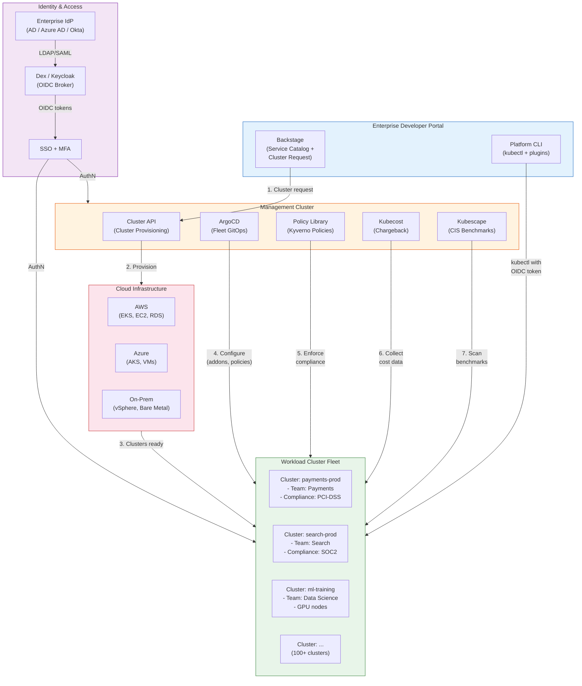
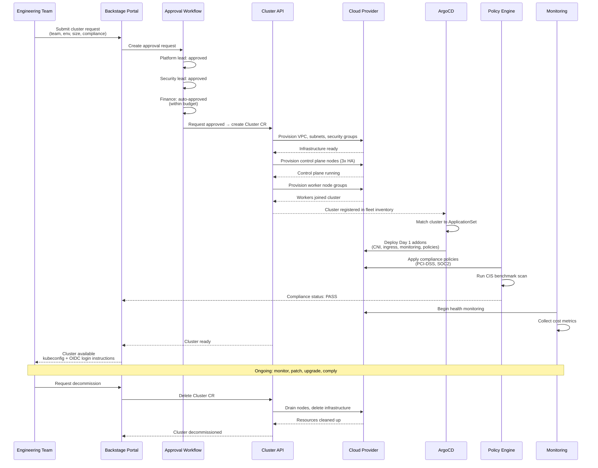

# Enterprise Kubernetes Platform

## 1. Overview

An enterprise Kubernetes platform is the operationalization of Kubernetes at organizational scale -- hundreds of clusters, thousands of developers, regulated industries, and the requirement that every aspect of the platform (provisioning, access, compliance, cost, lifecycle) is automated, auditable, and self-service. It is the difference between "we run some Kubernetes clusters" and "Kubernetes is our organization's standard compute platform with SSO integration, automated compliance, chargeback per team, and self-service cluster provisioning."

Enterprise platforms solve problems that do not exist at startup scale: How do you provision 50 clusters with consistent configuration? How do you integrate Kubernetes RBAC with your Active Directory groups so that when someone leaves the company, their cluster access is automatically revoked? How do you prove to a PCI-DSS auditor that every cluster in your fleet enforces the same security policies? How do you charge each business unit for the Kubernetes resources they consume?

The enterprise Kubernetes platform sits at the intersection of platform engineering, security engineering, and FinOps. It requires Cluster API or equivalent for declarative cluster provisioning, OIDC/SSO integration for identity federation, policy engines for compliance enforcement, fleet management for consistency at scale, and chargeback models for financial accountability. Companies like Goldman Sachs, Capital One, Mercedes-Benz, Intuit, and Bloomberg have built these platforms over years of investment, and their architectures provide the reference patterns for the industry.

This document covers the complete lifecycle of an enterprise Kubernetes platform: from cluster request through provisioning, configuration, compliance, monitoring, and decommissioning.

## 2. Why It Matters

- **Kubernetes without enterprise controls is a liability.** A Kubernetes cluster with default settings has no authentication (anonymous access allowed), no authorization (all authenticated users are cluster-admin), no network isolation (all Pods can talk to all Pods), and no audit logging. In a regulated enterprise, this is a compliance violation on day one. Enterprise platforms encode security controls into the provisioning process so that every cluster starts compliant.
- **Manual cluster provisioning does not scale.** Provisioning a production-ready cluster manually involves 30-50 configuration decisions (networking CNI, ingress controller, monitoring stack, logging pipeline, security policies, RBAC, certificate management). At 10 clusters, this is tedious. At 100 clusters, it is impossible to maintain consistency. Cluster API and fleet management tools automate this.
- **Identity federation is non-negotiable in the enterprise.** Enterprises have existing identity providers (Active Directory, Okta, Azure AD) with thousands of users and groups. Kubernetes' default authentication (client certificates, static tokens) does not integrate with these systems. OIDC integration via Dex or Keycloak bridges this gap, enabling SSO and group-based RBAC.
- **Compliance is continuous, not one-time.** SOC2, PCI-DSS, HIPAA, and similar frameworks require continuous compliance -- not just at audit time. Policy engines (OPA/Gatekeeper, Kyverno) enforce compliance at admission time, and continuous scanning tools (Falco, Kubescape) detect drift. Enterprise platforms automate both prevention and detection.
- **Cost visibility prevents cloud bill shock.** Without chargeback or showback, Kubernetes becomes a shared cost center where no team has an incentive to optimize. When a single cluster's monthly bill is $200K and 50 teams share it, cost awareness is zero. Chargeback per team, namespace, or label creates accountability and drives optimization.
- **Fleet management is the differentiator at scale.** Managing 5 clusters is feasible with manual processes. Managing 500 clusters requires fleet-level operations: roll out a policy change to all clusters, upgrade Kubernetes versions across the fleet in a controlled sequence, detect and remediate configuration drift across all clusters, and report compliance status for every cluster in the fleet.

## 3. Core Concepts

- **Cluster API (CAPI):** A Kubernetes subproject that provides declarative APIs for provisioning, upgrading, and operating Kubernetes clusters. CAPI uses a management cluster (running CAPI controllers) to provision and manage workload clusters. It supports multiple infrastructure providers (AWS, Azure, GCP, vSphere, bare metal) and bootstrap providers (kubeadm, Talos, MicroK8s). CAPI turns cluster provisioning into a Kubernetes-native operation: you create a `Cluster` object, and the controllers provision the infrastructure.
- **ClusterClass:** A CAPI feature that provides reusable, templatized cluster blueprints. Instead of defining every cluster from scratch, you define a ClusterClass that specifies the control plane configuration, worker node configuration, and add-on configuration. Teams create clusters by referencing a ClusterClass and overriding specific parameters. This enforces consistency: every cluster created from the same ClusterClass has the same CNI, monitoring stack, and security policies.
- **Management Cluster:** A dedicated Kubernetes cluster that runs the CAPI controllers, fleet management tools, and observability stack. The management cluster does not run application workloads -- it exists solely to manage the lifecycle of workload clusters. It is the single pane of glass for the entire fleet.
- **Workload Cluster:** A Kubernetes cluster that runs application workloads. Workload clusters are provisioned by the management cluster via CAPI and configured with consistent policies, monitoring, and access controls. Each workload cluster serves one or more teams or business units.
- **OIDC (OpenID Connect):** An identity layer on top of OAuth 2.0 that enables SSO. The Kubernetes API server can be configured to validate OIDC tokens, mapping the token's claims (username, groups) to Kubernetes RBAC subjects. This enables "log in with your corporate credentials" for kubectl, Backstage, and other tools.
- **Dex:** A CNCF project that acts as an OIDC identity broker. Dex connects to upstream identity providers (LDAP, Active Directory, SAML, GitHub, Google) and presents a unified OIDC interface to Kubernetes. Dex is lightweight (single binary), supports multiple connectors simultaneously, and is designed for Kubernetes environments.
- **Keycloak:** An open-source identity and access management solution that provides OIDC, SAML, and LDAP federation. Keycloak is more feature-rich than Dex (user management UI, fine-grained authorization, session management) but heavier to operate. It supports Active Directory and LDAP user federation, syncing users and groups locally for offline authorization.
- **Identity Provider (IdP) Federation:** The process of connecting Kubernetes authentication to an enterprise identity provider (Active Directory, Azure AD, Okta) so that users authenticate with their existing corporate credentials. Federation ensures that when a user is disabled in the corporate directory, their Kubernetes access is revoked without manual intervention.
- **Chargeback:** Billing internal teams or business units for the cloud resources their Kubernetes workloads consume. Chargeback requires cost allocation (attributing resources to teams via labels, namespaces, or node pools), cost calculation (translating resource consumption into dollar amounts), and financial reporting (generating reports per cost center). Tools like Kubecost, OpenCost, and cloud-native cost management tools (AWS Cost Explorer, GCP Billing) enable this.
- **Showback:** A lighter version of chargeback where cost information is shared with teams for awareness without actual financial transfers. Showback is the recommended starting point -- it creates visibility and accountability without the organizational friction of internal billing. Many organizations find that showback alone drives 20-30% cost reduction.
- **Fleet Management:** The practice of managing multiple Kubernetes clusters as a single fleet -- applying consistent configuration, enforcing policies, rolling out upgrades, and monitoring health across all clusters. Tools include Rancher, Tanzu Mission Control, Anthos Config Management, ArgoCD (ApplicationSets for fleet-wide GitOps), and Cluster API.
- **Compliance Automation:** Encoding regulatory requirements (SOC2, PCI-DSS, HIPAA) into automated checks that run continuously. This includes admission-time enforcement (policy engines), runtime detection (Falco, Kubescape), periodic scanning (CIS benchmarks), and automated reporting. Compliance automation transforms audit preparation from a months-long manual effort to a real-time dashboard.

## 4. How It Works

### Self-Service Cluster Provisioning

The enterprise cluster provisioning workflow automates the entire lifecycle from team request to running cluster:

**Step 1: Team submits a cluster request**

Teams submit requests through a self-service portal (Backstage) or a Kubernetes CRD on the management cluster:

```yaml
apiVersion: platform.enterprise.com/v1
kind: ClusterRequest
metadata:
  name: payments-prod
  namespace: cluster-requests
spec:
  team: payments
  environment: production
  clusterClass: standard-production
  region: us-east-1
  nodeGroups:
    - name: general
      instanceType: m5.2xlarge
      minSize: 3
      maxSize: 20
    - name: gpu
      instanceType: p3.2xlarge
      minSize: 0
      maxSize: 5
      taints:
        - key: nvidia.com/gpu
          effect: NoSchedule
  compliance:
    - pci-dss
    - soc2
  costCenter: CC-PAYMENTS-001
  approvers:
    - platform-team-lead
    - security-team-lead
```

**Step 2: Approval workflow**

The request triggers an approval workflow (integrated with ServiceNow, Jira, or a custom CRD-based approval controller):

```yaml
apiVersion: platform.enterprise.com/v1
kind: ApprovalWorkflow
metadata:
  name: payments-prod-approval
spec:
  request: payments-prod
  approvals:
    - role: platform-team-lead
      status: approved
      timestamp: "2025-03-15T10:00:00Z"
    - role: security-team-lead
      status: approved
      timestamp: "2025-03-15T14:30:00Z"
    - role: finance-approval
      status: auto-approved  # within budget threshold
  result: approved
```

**Step 3: Cluster API provisions the cluster**

Once approved, the platform controller creates CAPI resources:

```yaml
apiVersion: cluster.x-k8s.io/v1beta1
kind: Cluster
metadata:
  name: payments-prod
  namespace: clusters
  labels:
    team: payments
    environment: production
    compliance: pci-dss
    cost-center: CC-PAYMENTS-001
spec:
  topology:
    class: standard-production  # references ClusterClass
    version: v1.29.2
    controlPlane:
      replicas: 3
    workers:
      machineDeployments:
        - class: general
          name: general-pool
          replicas: 3
          metadata:
            labels:
              node-pool: general
        - class: gpu
          name: gpu-pool
          replicas: 0
          metadata:
            labels:
              node-pool: gpu
```

**Step 4: Post-provisioning configuration (Day 1)**

After the cluster is running, a configuration pipeline (ArgoCD ApplicationSet or Flux Kustomization) applies the Day 1 configuration:

```yaml
# ArgoCD ApplicationSet for fleet-wide configuration
apiVersion: argoproj.io/v1alpha1
kind: ApplicationSet
metadata:
  name: cluster-addons
  namespace: argocd
spec:
  generators:
    - clusterDecisionResource:
        configMapRef: cluster-inventory
        labelSelector:
          matchLabels:
            environment: production
  template:
    metadata:
      name: '{{name}}-addons'
    spec:
      project: platform
      source:
        repoURL: https://github.com/enterprise/cluster-addons
        targetRevision: main
        path: 'addons/production'
      destination:
        server: '{{server}}'
        namespace: kube-system
```

The Day 1 addon stack typically includes:
- **CNI:** Cilium or Calico for networking and network policy enforcement.
- **Ingress:** NGINX Ingress Controller or Envoy Gateway.
- **Certificate Management:** cert-manager with Let's Encrypt or enterprise CA.
- **Monitoring:** Prometheus + Grafana (or Datadog/New Relic agents).
- **Logging:** Fluent Bit forwarding to Elasticsearch or Splunk.
- **Policy Engine:** OPA/Gatekeeper or Kyverno with enterprise policy library.
- **Secrets Management:** External Secrets Operator connected to HashiCorp Vault or AWS Secrets Manager.
- **Cost Monitoring:** Kubecost or OpenCost for chargeback data.
- **RBAC:** Namespace creation with team-specific roles mapped to AD groups.

**Step 5: Compliance verification**

Automated compliance checks run immediately and continuously:

```yaml
# Kyverno policy: enforce PCI-DSS encryption requirements
apiVersion: kyverno.io/v1
kind: ClusterPolicy
metadata:
  name: require-encryption-at-rest
  annotations:
    policies.kyverno.io/category: PCI-DSS
    policies.kyverno.io/severity: high
spec:
  validationFailureAction: Enforce
  background: true
  rules:
    - name: require-encrypted-volumes
      match:
        resources:
          kinds:
            - PersistentVolumeClaim
      validate:
        message: "PCI-DSS: All PVCs must use an encrypted StorageClass."
        pattern:
          spec:
            storageClassName: "*-encrypted"
    - name: require-resource-labels
      match:
        resources:
          kinds:
            - Deployment
            - StatefulSet
      validate:
        message: "All workloads must have cost-center and team labels."
        pattern:
          metadata:
            labels:
              cost-center: "?*"
              team: "?*"
```

**Step 6: Ongoing monitoring and lifecycle**

The management cluster continuously monitors workload clusters:
- Health checks: API server responsiveness, etcd health, node readiness.
- Compliance drift detection: policy violations, CIS benchmark scores.
- Cost tracking: resource consumption per namespace, per team, per label.
- Certificate expiry: automated rotation before expiry.
- Version tracking: alert when clusters fall behind the supported version window.

### SSO / OIDC Integration

Enterprise SSO integration connects Kubernetes authentication to the corporate identity provider:

**Architecture: Dex as OIDC Broker**

```yaml
# Dex configuration
issuer: https://dex.platform.enterprise.com
storage:
  type: kubernetes
  config:
    inCluster: true
connectors:
  # Active Directory / LDAP
  - type: ldap
    id: active-directory
    name: Corporate AD
    config:
      host: ldap.enterprise.com:636
      insecureNoSSL: false
      bindDN: cn=svc-dex,ou=service-accounts,dc=enterprise,dc=com
      bindPW: $DEX_LDAP_BIND_PW
      usernamePrompt: Corporate Username
      userSearch:
        baseDN: ou=employees,dc=enterprise,dc=com
        filter: "(objectClass=person)"
        username: sAMAccountName
        idAttr: DN
        emailAttr: mail
        nameAttr: displayName
      groupSearch:
        baseDN: ou=groups,dc=enterprise,dc=com
        filter: "(objectClass=group)"
        userMatchers:
          - userAttr: DN
            groupAttr: member
        nameAttr: cn
  # Azure AD (as a second connector)
  - type: microsoft
    id: azure-ad
    name: Azure AD
    config:
      clientID: $AZURE_CLIENT_ID
      clientSecret: $AZURE_CLIENT_SECRET
      redirectURI: https://dex.platform.enterprise.com/callback
      tenant: $AZURE_TENANT_ID
      groups:
        - k8s-admins
        - k8s-developers
        - k8s-viewers
oauth2:
  skipApprovalScreen: true
staticClients:
  - id: kubectl-oidc
    name: kubectl
    redirectURIs:
      - http://localhost:8000
    secret: $KUBECTL_CLIENT_SECRET
  - id: backstage
    name: Backstage Portal
    redirectURIs:
      - https://backstage.platform.enterprise.com/api/auth/oidc/handler/frame
    secret: $BACKSTAGE_CLIENT_SECRET
```

**Kubernetes API server OIDC configuration:**

```yaml
# kube-apiserver flags for OIDC
apiServer:
  extraArgs:
    oidc-issuer-url: https://dex.platform.enterprise.com
    oidc-client-id: kubectl-oidc
    oidc-username-claim: email
    oidc-groups-claim: groups
    oidc-username-prefix: "oidc:"
    oidc-groups-prefix: "oidc:"
```

**RBAC mapped to AD groups:**

```yaml
# ClusterRoleBinding: AD group "k8s-platform-admins" gets cluster-admin
apiVersion: rbac.authorization.k8s.io/v1
kind: ClusterRoleBinding
metadata:
  name: platform-admins
subjects:
  - kind: Group
    name: oidc:k8s-platform-admins  # matches AD group via Dex
    apiGroup: rbac.authorization.k8s.io
roleRef:
  kind: ClusterRole
  name: cluster-admin
  apiGroup: rbac.authorization.k8s.io
---
# RoleBinding: AD group "team-payments" gets admin in their namespace
apiVersion: rbac.authorization.k8s.io/v1
kind: RoleBinding
metadata:
  name: team-payments-admin
  namespace: team-payments
subjects:
  - kind: Group
    name: oidc:team-payments
    apiGroup: rbac.authorization.k8s.io
roleRef:
  kind: ClusterRole
  name: admin
  apiGroup: rbac.authorization.k8s.io
---
# ClusterRoleBinding: all authenticated users get view access
apiVersion: rbac.authorization.k8s.io/v1
kind: ClusterRoleBinding
metadata:
  name: authenticated-viewers
subjects:
  - kind: Group
    name: oidc:k8s-all-users
    apiGroup: rbac.authorization.k8s.io
roleRef:
  kind: ClusterRole
  name: view
  apiGroup: rbac.authorization.k8s.io
```

**Developer authentication flow:**

```bash
# Developer authenticates via OIDC (one-time setup)
kubectl oidc-login setup \
  --oidc-issuer-url=https://dex.platform.enterprise.com \
  --oidc-client-id=kubectl-oidc \
  --oidc-client-secret=$CLIENT_SECRET

# Browser opens → corporate SSO login page → MFA → redirect back
# kubectl receives OIDC token and refreshes it automatically

# All kubectl commands now use OIDC identity
kubectl get pods -n team-payments  # works (team-payments group member)
kubectl get pods -n team-billing   # forbidden (not a member)
```

### Keycloak vs. Dex for Enterprise

| Feature | Dex | Keycloak |
|---|---|---|
| **Architecture** | Lightweight OIDC proxy (single binary) | Full IAM platform (Java-based) |
| **Resource footprint** | ~50 MB memory | ~512 MB - 1 GB memory |
| **User management** | None (delegates to upstream IdP) | Full user management UI, self-service registration |
| **IdP connectors** | LDAP, SAML, OIDC, GitHub, Google, Microsoft | LDAP, SAML, OIDC, social providers, custom SPI |
| **Group sync** | Via connector (LDAP group search) | Full LDAP/AD sync with local caching |
| **Session management** | Stateless (token-based) | Stateful sessions with SSO across applications |
| **Fine-grained authorization** | None | UMA, policy-based access control |
| **Best for** | Kubernetes-focused SSO, simple setups | Enterprise IAM, multi-application SSO, complex authorization |
| **Operational burden** | Low | Medium-High (requires PostgreSQL, upgrades) |

**Recommendation:** Dex for Kubernetes-only OIDC federation where the corporate IdP handles user management. Keycloak when you need a full IAM platform that serves both Kubernetes and other applications (Backstage, Grafana, ArgoCD, Jenkins).

### Chargeback and Showback

Enterprise cost allocation requires attributing Kubernetes resource consumption to business units:

**Cost allocation hierarchy:**

```
Cluster Cost ($50,000/month)
├── Shared overhead (15%): $7,500
│   ├── Control plane nodes
│   ├── Monitoring stack (Prometheus, Grafana)
│   ├── Ingress controllers
│   └── System namespaces (kube-system, cert-manager)
├── Team Payments (35%): $17,500
│   ├── Namespace: payments-prod
│   ├── Namespace: payments-staging
│   └── Attributed by: resource requests × node cost per unit
├── Team Checkout (25%): $12,500
│   └── Namespace: checkout-prod
├── Team Search (20%): $10,000
│   └── Namespace: search-prod
└── Idle/unallocated (5%): $2,500
    └── Requested but unused capacity
```

**Implementation with Kubecost:**

```yaml
# Kubecost configuration for enterprise chargeback
apiVersion: v1
kind: ConfigMap
metadata:
  name: kubecost-config
  namespace: kubecost
data:
  # Define allocation labels
  allocation-labels: |
    team: team
    cost-center: cost-center
    environment: environment
    project: project

  # Shared overhead distribution
  shared-overhead: |
    namespaces:
      - kube-system
      - monitoring
      - ingress-nginx
      - cert-manager
    distribution: weighted  # distribute by team's resource usage proportion

  # Cloud provider pricing
  cloud-pricing: |
    provider: aws
    region: us-east-1
    spot-discount: 0.7  # 70% discount for spot instances
    reserved-discount: 0.4  # 40% discount for reserved instances
```

**Chargeback report example:**

| Team | Namespace | CPU (cores) | Memory (GB) | Storage (GB) | Monthly Cost | Efficiency |
|---|---|---|---|---|---|---|
| Payments | payments-prod | 45.2 | 92.4 | 500 | $12,340 | 72% |
| Payments | payments-staging | 12.1 | 24.8 | 100 | $3,210 | 45% |
| Checkout | checkout-prod | 30.8 | 65.2 | 250 | $8,920 | 68% |
| Search | search-prod | 25.5 | 48.6 | 1000 | $9,100 | 81% |
| **Total** | | **113.6** | **231.0** | **1850** | **$33,570** | **67%** |

**Efficiency** = actual usage / requested resources. An efficiency of 67% means 33% of requested resources are idle. This metric drives right-sizing conversations.

### Compliance Automation

Enterprise Kubernetes platforms must demonstrate continuous compliance with regulatory frameworks:

**SOC2 on Kubernetes:**

| SOC2 Control | Kubernetes Implementation | Automated Check |
|---|---|---|
| **Access control** | OIDC SSO + RBAC + namespace isolation | Kyverno policy: no default service account use |
| **Change management** | GitOps (all changes via Git, reviewed, audited) | ArgoCD audit logs, Git commit signatures |
| **Encryption at rest** | etcd encryption, encrypted StorageClasses | Kyverno policy: only encrypted StorageClasses |
| **Encryption in transit** | mTLS via service mesh, TLS for ingress | Istio PeerAuthentication: STRICT mode |
| **Logging and monitoring** | Centralized logging (Fluentd → Splunk), audit logs | Alert on missing log collection agents |
| **Incident response** | PagerDuty integration, runbooks in Backstage | Alert on MTTR exceeding SLO |

**PCI-DSS on Kubernetes:**

| PCI-DSS Requirement | Kubernetes Implementation |
|---|---|
| **Req 1: Network segmentation** | Network policies: default-deny between PCI and non-PCI namespaces; dedicated node pools for PCI workloads |
| **Req 2: Secure configuration** | CIS Kubernetes Benchmark enforcement via Kyverno/OPA; Pod Security Admission (restricted profile) |
| **Req 3: Protect stored data** | Encrypted PVCs; Secrets encrypted at rest in etcd; Vault for sensitive credentials |
| **Req 6: Secure development** | Container image scanning (Trivy); no latest tags; signed images (Cosign/Notation) |
| **Req 7: Access restriction** | RBAC with least-privilege; no cluster-admin for developers; namespace-scoped access |
| **Req 8: Identity management** | OIDC SSO with MFA; no shared accounts; automated access review |
| **Req 10: Audit logging** | Kubernetes audit logs; API server request logging; centralized log aggregation |
| **Req 11: Security testing** | Runtime security (Falco); continuous vulnerability scanning; penetration testing |

**HIPAA on Kubernetes:**

| HIPAA Requirement | Kubernetes Implementation |
|---|---|
| **Access controls** | RBAC + OIDC with MFA; break-glass procedures for emergency access |
| **Audit controls** | Kubernetes audit policy logging all access to PHI namespaces |
| **Integrity controls** | Signed container images; immutable infrastructure (no kubectl exec in prod) |
| **Transmission security** | mTLS for all inter-service communication; TLS 1.3 for external traffic |
| **Encryption** | Encrypted etcd; encrypted PVCs; encrypted backups |

### Automated Cluster Lifecycle

The complete lifecycle from request to decommission:

| Phase | Actions | Automation |
|---|---|---|
| **Request** | Team submits cluster request with requirements | Backstage template or CRD |
| **Approval** | Platform and security team review; finance validates budget | Workflow engine (ServiceNow, custom controller) |
| **Provision** | CAPI creates cluster infrastructure | Cluster API + ClusterClass |
| **Configure** | Day 1 addons deployed (CNI, monitoring, policies, RBAC) | ArgoCD ApplicationSet, Flux |
| **Comply** | Compliance checks run; CIS benchmark scan | Kyverno, Kubescape, Trivy |
| **Operate** | Teams deploy workloads; platform monitors health | GitOps, Prometheus, alerting |
| **Upgrade** | Kubernetes version upgrade (control plane → workers) | CAPI rolling upgrade, maintenance windows |
| **Scale** | Node groups scale with workload demand | Cluster Autoscaler, Karpenter |
| **Decommission** | Cluster resources migrated; cluster destroyed; DNS and certs cleaned up | CAPI cluster deletion, resource cleanup controller |

## 5. Architecture / Flow



### Cluster Provisioning Lifecycle



## 6. Types / Variants

### Enterprise Kubernetes Distribution Comparison

| Platform | Type | Key Strength | Cluster Provisioning | SSO | Policy | Fleet Management |
|---|---|---|---|---|---|---|
| **Rancher (SUSE)** | Open source | Multi-cluster management UI | RKE2, CAPI, import existing | Built-in OIDC/SAML | OPA integration | Fleet (GitOps-based) |
| **OpenShift (Red Hat)** | Commercial | Integrated enterprise platform | IPI (Installer-Provisioned Infrastructure) | Built-in OAuth server | Built-in SCC + OPA | ACM (Advanced Cluster Management) |
| **Tanzu (VMware)** | Commercial | vSphere integration | TKG (Tanzu Kubernetes Grid) | Built-in OIDC (Pinniped) | OPA Gatekeeper | Tanzu Mission Control |
| **Anthos (Google)** | Commercial | Multi-cloud GKE experience | Anthos on-prem + GKE | Google IAM + OIDC | Policy Controller (OPA) | Anthos Config Management |
| **EKS + CAPI** | DIY on AWS | AWS-native integration | Cluster API Provider AWS | Dex/Keycloak + OIDC | Kyverno/OPA | ArgoCD ApplicationSets |
| **Palette (Spectro Cloud)** | Commercial | Full-stack cluster management | Declarative cluster profiles | Built-in OIDC | Built-in OPA | Central management console |

### Enterprise SSO Integration Patterns

| Pattern | Identity Provider | OIDC Broker | Use Case |
|---|---|---|---|
| **Direct OIDC** | Azure AD, Okta, Google | None (direct) | Cloud-native organizations using cloud IdP |
| **Dex broker** | LDAP/AD + SAML + OIDC | Dex | Multi-IdP federation, Kubernetes-focused |
| **Keycloak broker** | LDAP/AD + SAML + OIDC | Keycloak | Full IAM needs, multi-application SSO |
| **Pinniped** | Any OIDC provider | Pinniped (VMware) | Uniform authentication across heterogeneous clusters |

### Cost Allocation Models

| Model | Granularity | Implementation | Accuracy |
|---|---|---|---|
| **Cluster-level** | Cost per cluster | Cloud billing tags on cluster resources | Low (shared clusters not attributed) |
| **Namespace-level** | Cost per namespace | Kubecost/OpenCost namespace allocation | Medium (shared services not attributed) |
| **Label-level** | Cost per team/project/cost-center | Pod labels + Kubecost allocation | High (requires label discipline) |
| **Node-pool-level** | Cost per dedicated node pool | Dedicated node pools per team | High (but wastes resources) |
| **Request-based** | Cost per resource request | Resource requests × node cost per unit | Highest (most common enterprise approach) |

## 7. Use Cases

- **Self-service cluster provisioning.** A new product team needs a production Kubernetes cluster. They submit a request through Backstage, specifying their team, compliance requirements (SOC2), and estimated workload size. After automated approval (within budget), Cluster API provisions a production-grade cluster with HA control plane, auto-scaling node groups, monitoring stack, and security policies -- all in 30 minutes. Previously, this took 2-4 weeks of manual provisioning across infrastructure, security, and networking teams.
- **Enterprise-wide SSO.** An enterprise with 10,000 employees and Active Directory manages Kubernetes access through Dex. AD groups (`k8s-platform-admins`, `team-payments`, `team-search`) are mapped to Kubernetes RBAC. When an engineer joins the payments team in AD, they automatically get access to the payments namespaces across all clusters. When they leave the company, their AD account is disabled and Kubernetes access is revoked within minutes -- no manual RBAC cleanup required.
- **PCI-DSS compliance for payment processing.** A financial services company runs payment processing workloads on dedicated Kubernetes clusters with PCI-DSS compliance automation. Kyverno policies enforce encrypted storage, network segmentation, approved container images, and audit logging. Kubescape runs continuous CIS benchmark scans and reports compliance scores to a dashboard. During the annual PCI audit, the team produces automated compliance reports instead of weeks of manual evidence gathering.
- **Chargeback driving cost optimization.** An enterprise running $2M/month in Kubernetes infrastructure implements Kubecost chargeback per team. Monthly reports show each team their resource consumption and cost. Within three months, teams identify and eliminate over-provisioned deployments, unused preview environments, and right-size their resource requests. The total cost drops 25% ($500K/month savings) without any platform changes -- just visibility and accountability.
- **Fleet-wide security patching.** A critical CVE is discovered in the container runtime (containerd). The platform team uses Cluster API to roll out an updated node image across all 200 clusters in the fleet. The rollout proceeds in waves: canary clusters first (5%), then staging clusters (20%), then production clusters (75%) with automatic rollback if health checks fail. The entire fleet is patched within 48 hours without any application downtime.
- **Multi-cloud enterprise platform.** A global enterprise runs workloads on AWS (primary), Azure (DR), and on-premises vSphere (regulated data). Cluster API provisions clusters across all three environments from a single management cluster. ArgoCD ApplicationSets apply consistent configuration (monitoring, policies, RBAC) across the fleet. Teams deploy workloads via GitOps without knowing which infrastructure provider hosts their cluster.

## 8. Tradeoffs

| Decision | Option A | Option B | Guidance |
|---|---|---|---|
| **Managed K8s vs. self-managed** | EKS/GKE/AKS: less ops, cloud-managed control plane | Self-managed with CAPI: full control, portability | Managed for cloud-native; self-managed when you need cross-cloud consistency or on-prem |
| **Dex vs. Keycloak** | Dex: lightweight, Kubernetes-focused | Keycloak: full IAM, multi-application SSO | Dex when Kubernetes is the only consumer; Keycloak when multiple applications need SSO |
| **Rancher vs. OpenShift vs. DIY** | Rancher/OpenShift: integrated, supported | DIY (CAPI + ArgoCD + Kyverno): flexible, no vendor lock-in | Rancher/OpenShift for faster time-to-value; DIY for maximum control and cost optimization |
| **Showback vs. chargeback** | Showback: visibility without friction | Chargeback: financial accountability | Start with showback; move to chargeback only when showback alone does not drive behavior change |
| **Centralized vs. federated fleet management** | Centralized: single management cluster | Federated: regional management clusters | Centralized for < 200 clusters; federated for global deployments with regional autonomy |
| **Policy enforcement: warn vs. enforce** | Warn: visibility without blocking | Enforce: prevent violations at admission | Start with warn to identify violations; switch to enforce once teams are aware and ready |

## 9. Common Pitfalls

- **Building the platform before defining the operating model.** Technology without process fails. Before implementing Cluster API and SSO, define: Who approves cluster requests? Who is responsible for cluster upgrades? How is cost allocated? What is the support model? The operating model is harder than the technology.
- **SSO without automated offboarding.** Implementing OIDC SSO is straightforward. The hard part is ensuring that access is revoked promptly when employees leave or change roles. If Kubernetes RBAC bindings reference AD groups but the AD group membership is stale, former employees retain access. Automate AD group lifecycle and test offboarding regularly.
- **Compliance theater.** Installing OPA/Gatekeeper and writing a few policies does not make you compliant. Compliance requires comprehensive coverage (all relevant controls, not just the easy ones), continuous monitoring (not just admission-time checks), evidence collection (audit logs, scan results), and regular review (policies evolve as regulations change). Involve compliance and security teams in policy design from the beginning.
- **Cluster sprawl.** Self-service cluster provisioning without governance leads to cluster sprawl. Teams create clusters for experiments and never decommission them. Implement TTLs for non-production clusters, regular reviews of cluster utilization, and automated alerts for underutilized clusters. A cluster with 5% utilization for 3 months should be flagged for decommissioning.
- **Ignoring Day 2 operations.** Provisioning clusters is Day 1. Upgrading Kubernetes versions, rotating certificates, patching CVEs, scaling node groups, managing etcd backups, and handling node failures are Day 2. Day 2 operations consume 80% of the platform team's time but often receive 20% of the design attention. Design for Day 2 from the start.
- **Monolithic management cluster.** Running CAPI, ArgoCD, Prometheus, Kubecost, Backstage, and all fleet management tools on a single management cluster creates a single point of failure. If the management cluster goes down, you cannot manage or monitor any workload cluster. Size the management cluster for high availability, implement disaster recovery, and consider splitting responsibilities across multiple management clusters for very large fleets.
- **Chargeback without optimization levers.** Showing teams their cost without giving them tools to optimize is frustrating. Pair chargeback data with actionable recommendations: right-sizing suggestions (reduce CPU request from 2 to 0.5 based on actual usage), spot instance eligibility, unused PVC cleanup, and idle namespace detection. Kubecost provides these recommendations alongside cost data.
- **Over-engineering the platform for current scale.** Building a fleet management platform for 500 clusters when you have 5 is premature optimization. Start with managed Kubernetes (EKS/GKE), manual cluster configuration via GitOps, and Dex for SSO. Add Cluster API and fleet management tooling when you genuinely need to manage 20+ clusters with consistency requirements.

## 10. Real-World Examples

### Mercedes-Benz: 900+ Kubernetes Clusters with Cluster API

Mercedes-Benz Tech Innovation has built one of the largest enterprise Kubernetes platforms in the automotive industry, running nearly 1,000 Kubernetes clusters in production:

- **Background:** Mercedes-Benz adopted Kubernetes in its early days (v0.9) and built a custom fleet management solution because nothing suitable existed at the time. Their initial approach used self-written Terraform pipelines, which grew increasingly complex and difficult to maintain as the fleet scaled.
- **Migration to Cluster API:** After evaluating options, Mercedes-Benz migrated to Cluster API for declarative, Kubernetes-native cluster provisioning. CAPI allowed them to manage clusters using the same Kubernetes APIs and patterns they used for workloads, eliminating the impedance mismatch between cluster management and workload management.
- **Infrastructure:** The fleet runs on a managed OpenStack-based on-premises IaaS, with hundreds of independent development teams deploying applications.
- **Results:** Cluster API eliminated snowflake clusters (each cluster previously had unique configuration drift), reduced deployment time, enabled rolling upgrades across the fleet, allowed faster onboarding of new cloud environments, and standardized infrastructure configuration. The platform team can now roll out configuration changes to all 900+ clusters through a single GitOps pipeline.
- **Key lesson:** At Mercedes-Benz's scale, the management tooling is as critical as the clusters themselves. The management cluster running CAPI is treated as the most important piece of infrastructure, with its own HA, DR, and operational runbooks.

### Goldman Sachs: Cloud-Native Software Development at Scale

Goldman Sachs has been one of the most prominent financial services firms in cloud-native adoption:

- **Platform evolution:** Goldman Sachs transitioned from traditional bare-metal infrastructure to a cloud-native platform built on Kubernetes. Their platform team built an internal developer platform that abstracts infrastructure complexity for thousands of developers.
- **Spectro Cloud investment:** Goldman Sachs' Growth Equity division led a $75M Series C investment in Spectro Cloud (2024), a Kubernetes management platform. This investment signals their conviction that enterprise Kubernetes fleet management is a critical capability for the financial services industry.
- **Regulated workloads:** As a systemically important financial institution, Goldman Sachs runs workloads under stringent regulatory requirements (SOC2, SOX, PCI-DSS). Their Kubernetes platform implements comprehensive compliance automation with policy enforcement, audit logging, and automated evidence collection.
- **Scale:** Goldman Sachs employs ~45,000 people with ~10,000 engineers. The platform serves diverse workloads: trading systems (ultra-low-latency), risk computation (batch processing), and internal tools (standard web services).

### Capital One: Kubernetes as Cost Multiplier

Capital One was one of the earliest enterprise adopters of Kubernetes in the financial services industry:

- **Critical Stack:** Capital One built an internal Kubernetes distribution called Critical Stack, which they later open-sourced. Critical Stack included cluster provisioning, monitoring, and security features tailored for regulated financial environments.
- **AWS-native:** Capital One runs exclusively on AWS and was the first major US bank to close its data centers entirely. Their Kubernetes platform is built on EKS with extensive customization for security and compliance.
- **Cost impact:** Capital One publicly stated that Kubernetes is "a significant productivity multiplier" and estimated that without Kubernetes, their AWS costs would "easily triple or quadruple." This is one of the strongest public statements about Kubernetes' cost efficiency from an enterprise.
- **AI/ML workloads:** More recently, Capital One has extended their Kubernetes platform to support GPU workloads for machine learning, running distributed Spark applications on EKS with NVIDIA RAPIDS acceleration.

### Intuit: Zero to 2,000 Services in 18 Months

Intuit's Kubernetes journey is one of the most documented enterprise adoption stories:

- **Scale:** In 18 months, Intuit went from zero to 2,000 services running on Kubernetes across 150+ clusters. Deployment cycles decreased from days to minutes, and MTTR dropped from 45 minutes to less than 5 minutes.
- **Keikoproj:** Intuit open-sourced a set of declarative CRDs for managing Kubernetes at scale called Keikoproj. This includes controllers for instance management, upgrade orchestration, and cluster lifecycle automation. Keikoproj reflects the challenges of enterprise Kubernetes that are not covered by upstream Kubernetes: automated instance rotation, controlled upgrade rollouts, and cross-cluster resource management.
- **Recognition:** Intuit received the CNCF End User Award at KubeCon + CloudNativeCon EU 2019 for their contributions to the cloud-native ecosystem, validating their approach to enterprise Kubernetes adoption.
- **Key lesson:** Intuit's success was driven by investing heavily in platform tooling (Keikoproj) and treating the Kubernetes platform as a product with dedicated engineering resources. The 18-month timeline reflects an aggressive but achievable adoption pace for a large enterprise.

### Bloomberg: 90-95% Hardware Utilization

Bloomberg's Kubernetes adoption stands out for its focus on resource efficiency:

- **Motivation:** Bloomberg processes hundreds of billions of data points daily across 14,000+ applications on the Bloomberg Terminal. Their infrastructure team adopted Kubernetes in 2016 (when it was still in alpha) to improve resource utilization and deployment velocity.
- **Hardware utilization:** Bloomberg achieved 90-95% hardware utilization on their Kubernetes clusters -- a remarkable number given that typical enterprise utilization is 30-50%. This was achieved through aggressive bin-packing, accurate resource requests, priority-based preemption, and overcommitment where workload profiles allowed it.
- **Developer productivity:** Bloomberg reported that Kubernetes resulted in more productive developers, fewer deployment errors, improved service resiliency, and better automation. The platform abstracts infrastructure complexity, allowing financial data engineers to focus on data processing logic rather than infrastructure management.
- **Key lesson:** Bloomberg's high utilization demonstrates that Kubernetes' resource management capabilities (requests, limits, priority classes, preemption) can dramatically improve infrastructure efficiency when tuned by an experienced platform team. The 90-95% number is aspirational for most organizations but achievable with investment in resource optimization.

### Common Enterprise Adoption Patterns

Across these examples, consistent patterns emerge:

| Pattern | Description | Adopted By |
|---|---|---|
| **Platform as a product** | Dedicated platform team with product manager, roadmap, and developer SLOs | All five companies |
| **Cluster API or equivalent** | Declarative, automated cluster provisioning | Mercedes-Benz (CAPI), Goldman Sachs (Spectro Cloud), Capital One (EKS) |
| **SSO/OIDC integration** | Corporate identity mapped to Kubernetes RBAC | All five companies |
| **Compliance automation** | Policy engines + continuous scanning + automated reporting | Goldman Sachs, Capital One, Bloomberg |
| **Custom controllers** | Organization-specific operators for lifecycle management | Intuit (Keikoproj), Mercedes-Benz (custom fleet tools) |
| **Multi-cluster architecture** | 50-1000 clusters managed as a fleet | Mercedes-Benz (900+), Intuit (150+), Bloomberg (multiple) |
| **GitOps for fleet consistency** | ArgoCD or equivalent for fleet-wide configuration | All five companies |

### Enterprise Platform Maturity Indicators

| Maturity Level | Characteristics | Team Size | Cluster Count |
|---|---|---|---|
| **Exploratory** | Manual cluster setup, default security, no SSO | 2-3 engineers, part-time | 1-5 |
| **Standardized** | Scripted provisioning, OIDC SSO, basic policies | 5-10 engineers | 5-20 |
| **Automated** | CAPI, ArgoCD fleet management, compliance automation, showback | 10-20 engineers | 20-100 |
| **Optimized** | Full self-service, chargeback, < 1 hour provisioning, continuous compliance | 20-50 engineers | 100-500 |
| **Transformative** | Platform enables business agility; new products ship on Kubernetes in days | 50+ engineers | 500+ |

### Enterprise Platform Anti-Patterns

| Anti-Pattern | Symptom | Root Cause | Remedy |
|---|---|---|---|
| **Golden cage** | Teams bypass the platform entirely | Platform is too restrictive; no escape hatches | Provide override mechanisms with documentation; treat bypasses as feature requests |
| **Ticket-driven platform** | Self-service portal exists but tickets are still required | Automation covers only happy path; edge cases require manual intervention | Invest in automation for the top 5 edge cases based on ticket analysis |
| **Invisible costs** | Teams have no idea what their workloads cost | No cost attribution; shared billing without allocation | Deploy Kubecost/OpenCost; require cost-center labels; publish monthly showback reports |
| **Stale fleet** | Clusters run outdated Kubernetes versions for months | No automated upgrade pipeline; fear of breaking changes | Implement CAPI rolling upgrades with canary strategy; enforce maximum version age policy |
| **Hero culture** | One or two engineers are the only ones who can fix platform issues | Insufficient documentation; no runbooks; complex manual processes | Mandate runbooks for every operational procedure; practice incident response with rotation |
| **Compliance cliff** | Audit preparation takes months of manual evidence gathering | Compliance checks are manual, periodic, and retrospective | Automate continuous compliance with policy engines and real-time dashboards |

### Enterprise RBAC Model: Detailed Example

A comprehensive enterprise RBAC model maps organizational structure to Kubernetes access:

```
Organization Hierarchy          Kubernetes RBAC
========================        ==========================
CTO                        →   ClusterRole: cluster-admin (break-glass only)
VP Engineering             →   ClusterRole: cluster-viewer + namespace admin for all
Platform Team              →   ClusterRole: cluster-admin (operational)
Team Lead (Payments)       →   Role: admin in payments-* namespaces
Senior Engineer (Payments) →   Role: edit in payments-* namespaces
Junior Engineer (Payments) →   Role: view in payments-prod, edit in payments-dev
CI/CD Service Account      →   Role: deployer (custom) in target namespace
Monitoring Service Account →   ClusterRole: monitoring-reader (metrics, pods/log)
Audit Service Account      →   ClusterRole: audit-reader (read-only across all namespaces)
```

**Custom ClusterRole for CI/CD deployer:**
```yaml
apiVersion: rbac.authorization.k8s.io/v1
kind: ClusterRole
metadata:
  name: deployer
rules:
  - apiGroups: ["apps"]
    resources: ["deployments", "replicasets"]
    verbs: ["get", "list", "watch", "create", "update", "patch"]
  - apiGroups: [""]
    resources: ["services", "configmaps"]
    verbs: ["get", "list", "watch", "create", "update", "patch"]
  - apiGroups: ["networking.k8s.io"]
    resources: ["ingresses"]
    verbs: ["get", "list", "watch", "create", "update", "patch"]
  # Explicitly deny: secrets (managed by External Secrets Operator),
  # RBAC resources, namespace creation, node access
```

This model ensures that RBAC grows with the organization: new teams get access automatically through AD group membership, and the platform enforces least-privilege without manual configuration per developer.

### Fleet Upgrade Strategy

Upgrading Kubernetes across a fleet of 100+ clusters requires a structured approach:

| Phase | Clusters | Strategy | Duration | Rollback |
|---|---|---|---|---|
| **1. Lab** | 1-2 internal test clusters | Full upgrade, run integration test suite | 1-2 days | Rebuild cluster from scratch |
| **2. Canary** | 3-5 non-critical clusters | Upgrade, monitor for 48 hours | 2-3 days | CAPI rollback to previous version |
| **3. Staging** | All staging clusters (20%) | Rolling upgrade with PDB-aware draining | 3-5 days | CAPI rollback per cluster |
| **4. Production (wave 1)** | 25% of production clusters | Rolling upgrade during maintenance window | 5-7 days | CAPI rollback, traffic shifted to healthy clusters |
| **5. Production (wave 2)** | Remaining 75% of production | Rolling upgrade, 10 clusters per batch | 7-14 days | CAPI rollback per batch |

**Total fleet upgrade time: 3-4 weeks for 100+ clusters.** This timeline is consistent with what Mercedes-Benz and Intuit have published for their fleet upgrade cadences.

## 11. Related Concepts

- [Internal Developer Platform](./01-internal-developer-platform.md) -- the IDP that sits on top of the enterprise platform
- [Multi-Tenancy](./02-multi-tenancy.md) -- tenant isolation models for enterprise multi-team access
- [Self-Service Abstractions](./03-self-service-abstractions.md) -- Crossplane claims for infrastructure self-service
- [Developer Experience](./04-developer-experience.md) -- developer tooling in the enterprise context
- [RBAC and Access Control](../07-security-design/01-rbac-and-access-control.md) -- RBAC patterns for enterprise AD group mapping
- [Policy Engines](../07-security-design/02-policy-engines.md) -- compliance enforcement with OPA/Kyverno
- [Cost Observability](../09-observability-design/03-cost-observability.md) -- detailed cost allocation and optimization
- [Multi-Cluster Architecture](../02-cluster-design/03-multi-cluster-architecture.md) -- fleet architecture for multi-cluster management

## 12. Source Traceability

- Mercedes-Benz CNCF case study (cncf.io/case-studies/mercedes-benz) -- 900+ clusters, Cluster API migration, fleet management
- InfoWorld (infoworld.com, 2022) -- "Why Mercedes-Benz runs on 900 Kubernetes clusters"
- Goldman Sachs / Spectro Cloud (spectrocloud.com, 2024) -- $75M Series C investment, enterprise Kubernetes management
- Computer Weekly (computerweekly.com) -- Goldman Sachs cloud-native software development migration
- Capital One Kubernetes case study (kubernetes.io/case-studies/capital-one) -- AWS-native platform, Critical Stack, cost efficiency
- Intuit CNCF case study (cncf.io/case-studies/intuit) -- zero to 2,000 services, Keikoproj, CNCF End User Award
- Bloomberg CNCF blog (cncf.io/blog, 2019) -- 90-95% hardware utilization with Kubernetes
- Cluster API documentation (cluster-api.sigs.k8s.io) -- CAPI architecture, ClusterClass, provider ecosystem
- Dex project documentation (dexidp.io) -- OIDC broker architecture, LDAP/AD connectors
- Keycloak documentation (keycloak.org) -- OIDC, SAML, LDAP federation, enterprise IAM
- Kubecost documentation (kubecost.com) -- cost allocation, chargeback/showback, optimization
- CNCF Platform Engineering Maturity Model (tag-app-delivery.cncf.io) -- maturity levels, enterprise adoption patterns
- Kubernetes official documentation (kubernetes.io/docs/reference/access-authn-authz/authentication) -- OIDC configuration, RBAC
- Kubescape documentation (kubescape.io) -- CIS benchmark scanning, compliance automation
