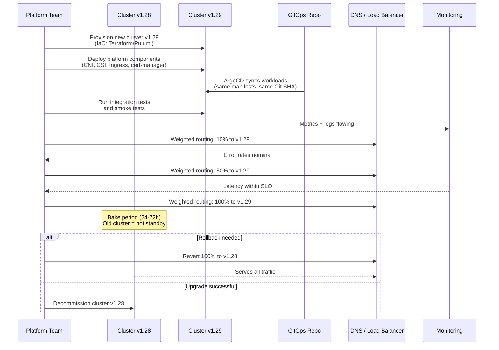

# Cluster Upgrades

## 1. Overview

Kubernetes cluster upgrades are the most consequential Day-2 operation you will perform. Every three months, a new minor version is released. Every release deprecates APIs, patches CVEs, and introduces features that your platform teams will want. Ignoring upgrades does not buy stability -- it buys technical debt that compounds until the cluster is so far behind that upgrading becomes a multi-quarter project with breaking changes stacked on top of each other.

An upgrade touches every layer of the cluster: the control plane (API server, etcd, scheduler, controller manager), the node images (OS, kubelet, container runtime), and the workloads themselves (API version compatibility, deprecated flags). The order in which you upgrade these layers is dictated by the **version skew policy** -- violate it and you get undefined behavior, silently dropped fields, or outright API rejections.

This document covers the two primary upgrade strategies (in-place rolling and blue-green cluster), managed Kubernetes upgrade mechanics, node image upgrades, PDB-aware draining, API deprecation handling, and pre-upgrade testing with kind/k3d.

Understanding cluster upgrades requires familiarity with the Kubernetes release cycle. The project releases three minor versions per year (approximately every 15 weeks). Each minor version receives patch releases for approximately 14 months. After that, the version enters end-of-life and receives no further patches -- not even for critical CVEs. This means you must upgrade at least once per year to stay within the support window, and quarterly upgrades are the recommended cadence for production clusters.

## 2. Why It Matters

- **Security patches have deadlines.** CVEs in the kubelet, container runtime, or API server are actively exploited. The window between disclosure and exploitation is shrinking -- from weeks to days. Clusters that lag behind on patches are exposed.
- **API deprecations break workloads silently.** When a deprecated API version is removed (e.g., `extensions/v1beta1` Ingress removed in 1.22), any manifest referencing it will fail to apply. If your CI/CD pipeline or Helm chart uses a removed API, deployments stop cold.
- **Managed Kubernetes enforces upgrade timelines.** EKS, GKE, and AKS end support for old minor versions. GKE auto-upgrades nodes on its release channel schedule. EKS deprecates versions approximately 14 months after release. You either upgrade proactively on your schedule or you get upgraded reactively on the provider's schedule.
- **Version skew violations cause subtle failures.** Running a kubelet two minor versions behind the API server is unsupported. Features that depend on newer kubelet capabilities (ephemeral containers, in-place resource resize) will silently not work, and debugging these failures is extremely difficult.
- **Upgrade confidence determines platform velocity.** Teams that upgrade quarterly with tested automation are teams that adopt new features (Gateway API, sidecar containers, CEL validation) quickly. Teams that upgrade annually are teams that are stuck on workarounds for problems already solved upstream.
- **Container runtime upgrades ride with node upgrades.** When you upgrade node images, you also update containerd or CRI-O. From the source material: the Docker shim was removed in Kubernetes 1.24, and the runtime hierarchy now goes through CRI directly to containerd or CRI-O. Runtime CVEs (e.g., in runc) are patched via node image updates, making node upgrades a security-critical operation beyond just the Kubernetes version itself.

## 3. Core Concepts

- **Version Skew Policy:** The formal rules governing which component versions can coexist. The API server must be the newest component. kubelets can be up to one minor version behind the API server. kube-proxy must match the kubelet. kubectl supports plus or minus one minor version from the API server. This policy dictates the upgrade order: control plane first, then workers.
- **In-Place Rolling Upgrade:** Upgrading the existing cluster by sequentially draining nodes, upgrading the kubelet and node image, and uncordoning. The cluster identity (certificates, DNS, etcd data) is preserved. This is the standard approach for most clusters.
- **Blue-Green Cluster Upgrade:** Provisioning an entirely new cluster at the target version, migrating workloads, validating, and switching traffic via DNS or load balancer. The old cluster remains as a rollback target until confidence is established. More expensive but provides the cleanest rollback path.
- **Node Image Upgrade:** Replacing the underlying OS image on worker nodes without changing the Kubernetes version. This applies OS patches, kernel updates, and container runtime updates. On managed Kubernetes, this is often a separate operation from the Kubernetes version upgrade.
- **Cordon:** Marking a node as unschedulable so no new Pods are placed on it. Existing Pods continue running. This is the first step in draining a node.
- **Drain:** Cordoning a node and then evicting all Pods from it, respecting PodDisruptionBudgets. Pods managed by controllers (Deployments, StatefulSets) are rescheduled onto other nodes. Standalone Pods are evicted and lost unless recreated.
- **PodDisruptionBudget (PDB):** A policy that limits the number of Pods that can be simultaneously unavailable during voluntary disruptions (upgrades, drains). PDBs are the mechanism that prevents an upgrade from taking down all replicas of a service at once.
- **Surge Upgrade:** Adding extra nodes to the cluster before draining old ones. This ensures capacity is never reduced during the upgrade. GKE supports `maxSurge` on node pools; EKS achieves this through managed node group update strategies.
- **API Deprecation:** The process by which Kubernetes removes old API versions. APIs go through alpha -> beta -> stable, and old versions are removed after a deprecation period (typically 2-3 minor releases after the replacement is stable). The `kubectl convert` plugin and `kubent` (kube-no-trouble) detect deprecated API usage.
- **Release Channels:** Managed Kubernetes providers offer channels (Rapid, Regular, Stable on GKE; similar on AKS) that control how quickly new versions are offered. Stable channels lag by weeks or months, giving the community time to discover regressions.
- **kind (Kubernetes in Docker):** A tool for running local Kubernetes clusters using Docker container "nodes." Used for pre-upgrade testing: you can provision a kind cluster at any Kubernetes version, deploy your manifests, and validate compatibility before touching production. kind clusters start in under 60 seconds.
- **k3d:** A wrapper around k3s that runs lightweight Kubernetes clusters in Docker. Similar use case to kind but uses k3s (which bundles components differently). Both are suitable for upgrade testing in CI pipelines.
- **Feature Gates:** Boolean flags that enable or disable alpha/beta features in Kubernetes components. Feature gates change status across versions: alpha features are off by default, beta features are on by default (as of 1.24+), and GA features have their gates removed. An upgrade can change the default state of feature gates, altering cluster behavior.

## 4. How It Works

### Pre-Flight Checklist

Before any upgrade, complete this checklist. Each item has caused production incidents when skipped:

```
[ ] etcd health verified (etcdctl endpoint health on all members)
[ ] etcd backup taken and verified (etcdctl snapshot save + snapshot status)
[ ] API deprecations scanned (kubent run against cluster AND Git manifests)
[ ] Helm chart compatibility checked (helm template rendered against target version)
[ ] Operator compatibility matrix checked (cert-manager, Prometheus, Istio, etc.)
[ ] Admission webhook compatibility verified (webhook caBundle, API version targets)
[ ] PDBs exist for all critical workloads (kubectl get pdb --all-namespaces)
[ ] Cluster has sufficient headroom for drain operations (15-20% free capacity)
[ ] Staging/test cluster upgraded first and validated
[ ] Rollback plan documented (in-place: re-upgrade back; blue-green: revert DNS)
[ ] Monitoring dashboards open (error rates, latency, Pod restarts, scheduling latency)
[ ] Communication sent to stakeholders (maintenance window, expected impact)
```

### In-Place Rolling Upgrade Sequence

The canonical upgrade sequence for a self-managed or managed cluster:

1. **Pre-flight checks:** Complete the pre-flight checklist above. This is the most important step -- most upgrade failures are preventable with thorough pre-flight validation.
2. **Upgrade control plane:** On self-managed clusters (kubeadm), run `kubeadm upgrade apply v1.XX.Y` on the first control plane node, then `kubeadm upgrade node` on remaining control plane nodes. On managed clusters, trigger the control plane upgrade via console or CLI (`aws eks update-cluster-version`, `gcloud container clusters upgrade`).
3. **Validate control plane:** Confirm the API server is serving the new version (`kubectl version`), verify all controllers are healthy (`kubectl get componentstatuses` or check Pod status in `kube-system`), confirm etcd cluster health.
4. **Upgrade worker nodes (rolling):** For each node or node group:
   - **Cordon** the node: `kubectl cordon <node>`
   - **Drain** the node: `kubectl drain <node> --ignore-daemonsets --delete-emptydir-data --timeout=300s`
   - **Upgrade** the kubelet and kubectl packages (or replace the node with a new one running the target version)
   - **Uncordon** the node: `kubectl uncordon <node>`
   - **Validate** the node: confirm it rejoins as Ready, Pods are scheduled, and health checks pass
   - **Wait** for all Pods on the node to become Ready before proceeding to the next node
5. **Post-upgrade validation:** Run smoke tests, verify all Deployments are healthy, check for increased error rates in monitoring, validate that Ingress and external-facing services are functional.

### kubeadm Upgrade in Detail

For self-managed clusters using kubeadm, the upgrade process has specific steps:

```bash
# Step 1: Upgrade kubeadm on the first control plane node
sudo apt-get update && sudo apt-get install -y kubeadm=1.29.0-1.1

# Step 2: Verify the upgrade plan
sudo kubeadm upgrade plan

# Step 3: Apply the upgrade (first control plane node only)
sudo kubeadm upgrade apply v1.29.0

# Step 4: Upgrade kubelet and kubectl
sudo apt-get install -y kubelet=1.29.0-1.1 kubectl=1.29.0-1.1
sudo systemctl daemon-reload
sudo systemctl restart kubelet

# Step 5: On additional control plane nodes
sudo kubeadm upgrade node
sudo apt-get install -y kubelet=1.29.0-1.1 kubectl=1.29.0-1.1
sudo systemctl daemon-reload
sudo systemctl restart kubelet

# Step 6: Upgrade worker nodes (after draining)
# On each worker node:
sudo apt-get install -y kubeadm=1.29.0-1.1
sudo kubeadm upgrade node
sudo apt-get install -y kubelet=1.29.0-1.1 kubectl=1.29.0-1.1
sudo systemctl daemon-reload
sudo systemctl restart kubelet
```

**What kubeadm upgrade does internally:**
- Updates the static Pod manifests in `/etc/kubernetes/manifests/` for API server, controller manager, scheduler, and etcd.
- The kubelet detects the manifest changes and restarts the static Pods with the new versions.
- Rotates certificates if they are near expiration.
- Updates the `kubeadm-config` ConfigMap in `kube-system` with the new version.
- Upgrades the CoreDNS deployment and kube-proxy DaemonSet to the version bundled with the target Kubernetes version.

### Blue-Green Cluster Upgrade Sequence

1. **Provision new cluster** at the target Kubernetes version using the same infrastructure-as-code (Terraform, Pulumi, CDK) that manages the existing cluster.
2. **Deploy workloads** to the new cluster via GitOps (ArgoCD, Flux) pointing at the same Git repository. The declarative model ensures workload parity.
3. **Validate** the new cluster: run integration tests, confirm all services are healthy, verify external connectivity.
4. **Shift traffic** gradually: update DNS records, adjust load balancer targets, or use weighted routing (Route 53 weighted records, Global Accelerator) to send a percentage of traffic to the new cluster.
5. **Monitor** for errors. If the new cluster is healthy, increase traffic to 100%.
6. **Decommission** the old cluster after a bake period (typically 24-72 hours).
7. **Rollback** if needed: revert DNS/LB to the old cluster, which is still running and serving as a hot standby.

### Managed Kubernetes Upgrade Cadence

| Provider | Control Plane | Worker Nodes | Auto-Upgrade | End of Support |
|---|---|---|---|---|
| **EKS** | Manual trigger; ~15 min for control plane | Managed node groups support rolling update; self-managed requires manual drain | Optional; extended support available for $0.60/hr | ~14 months after release |
| **GKE** | Auto-upgrade on release channel schedule | Auto-upgrade with surge settings (maxSurge, maxUnavailable) | Default on; opt-out possible | ~14 months on Regular channel |
| **AKS** | Manual or auto-upgrade channels | Node image auto-upgrade separate from K8s version | Auto-upgrade channels: none, patch, stable, rapid, node-image | ~12 months after GA |

### PDB-Aware Node Drain

When you drain a node, the eviction API checks PDBs before evicting each Pod:

1. The drain command issues eviction requests (not direct deletes) for each Pod.
2. The API server checks if evicting the Pod would violate any PDB (e.g., dropping below `minAvailable` or exceeding `maxUnavailable`).
3. If the eviction would violate a PDB, it is **rejected**. The drain command retries with backoff.
4. If the PDB is satisfied, the Pod is evicted. Its controller (Deployment, StatefulSet) creates a replacement on another node.
5. Once the replacement Pod is Running and Ready, the PDB budget is restored, allowing the next eviction.

**Critical detail:** PDBs only protect against **voluntary disruptions** (drains, upgrades, cluster autoscaler scale-down). They do not protect against involuntary disruptions (node crashes, OOM kills). This means your PDB is your upgrade safety net, but it is not your HA strategy -- you still need topology spread constraints and multiple replicas.

### API Deprecation Handling

The workflow for handling API deprecations across an upgrade:

1. **Detect:** Run `kubent` (kube-no-trouble) against your cluster to find all resources using deprecated or removed APIs. Run it against your Git manifests as well.
2. **Audit Helm charts:** Many deprecated APIs hide inside Helm templates. Run `helm template` to render manifests, then scan the output.
3. **Update manifests:** Change `apiVersion` fields to the replacement API version. For example, `policy/v1beta1` PodDisruptionBudget becomes `policy/v1`.
4. **Test:** Apply updated manifests to a test cluster running the target version. Verify that all resources are created successfully.
5. **Update stored objects:** Even if your manifests are updated, objects already stored in etcd may reference old API versions. The `kubectl convert` plugin can help, but the most reliable approach is to re-apply all manifests after the upgrade so etcd stores them under the new API version.

**Notable API removals by version:**

| Version | Removed API | Replacement |
|---|---|---|
| **1.22** | `extensions/v1beta1` Ingress, `networking.k8s.io/v1beta1` Ingress | `networking.k8s.io/v1` Ingress |
| **1.22** | `rbac.authorization.k8s.io/v1beta1` | `rbac.authorization.k8s.io/v1` |
| **1.25** | `policy/v1beta1` PodSecurityPolicy | PodSecurity admission (built-in) |
| **1.25** | `batch/v1beta1` CronJob | `batch/v1` CronJob |
| **1.26** | `flowcontrol.apiserver.k8s.io/v1beta1` | `flowcontrol.apiserver.k8s.io/v1beta3` |
| **1.27** | `storage.k8s.io/v1beta1` CSIStorageCapacity | `storage.k8s.io/v1` |
| **1.29** | `flowcontrol.apiserver.k8s.io/v1beta2` | `flowcontrol.apiserver.k8s.io/v1` |

### Upgrade Testing with kind/k3d

Pre-upgrade testing in CI catches API incompatibilities before they reach production:

```bash
# Create a kind cluster at the target version
kind create cluster --name upgrade-test --image kindest/node:v1.29.0

# Deploy all manifests from the Git repository
kubectl apply -R -f manifests/

# Run Helm installs for all charts
for chart in charts/*/; do
  helm template "$chart" | kubectl apply --dry-run=server -f -
done

# Run integration tests
./scripts/integration-test.sh

# Verify no deprecated APIs in the cluster
kubent --target-version 1.29

# Clean up
kind delete cluster --name upgrade-test
```

**CI pipeline integration:** Add this as a stage in your CI pipeline that runs on every merge to the main branch. The pipeline maintains a kind cluster at the *next* Kubernetes version (e.g., if production is 1.28, the CI cluster is 1.29). Any manifest change that breaks on the next version is caught before merge.

### Version Skew Policy in Detail

The version skew policy is the hard constraint that determines upgrade order and what component combinations are supported:

| Component | Allowed Versions Relative to API Server | Example (API Server at 1.29) |
|---|---|---|
| **kube-controller-manager** | Same minor version | Must be 1.29.x |
| **kube-scheduler** | Same minor version | Must be 1.29.x |
| **kubelet** | Same or one minor version older | 1.28.x or 1.29.x |
| **kube-proxy** | Same minor version as kubelet | Must match kubelet |
| **kubectl** | One minor version newer, same, or one older | 1.28.x, 1.29.x, or 1.30.x |
| **etcd** | Version bundled with K8s release | Managed by kubeadm; do not upgrade independently |

**Implications for upgrade order:**
1. Upgrade the API server first (it must be the newest component).
2. Upgrade controller manager and scheduler (must match API server).
3. Upgrade kubelets (can lag by one minor version, giving you a window).
4. Upgrade kube-proxy (matches kubelet).

**Multi-control-plane upgrade:** In HA setups with 3 control plane nodes, upgrade one at a time. While one node is being upgraded, the other two continue serving. The load balancer in front of the API server routes traffic to healthy nodes. etcd maintains quorum with 2 of 3 members available.

### Node Image Upgrades

Node image upgrades update the OS, kernel, container runtime, and system packages without changing the Kubernetes version. This is important for:

- **OS security patches:** Kernel CVEs, OpenSSL vulnerabilities, etc.
- **Container runtime updates:** containerd or CRI-O patches.
- **AMI/image refresh:** Updating to the latest EKS-optimized AMI, GKE Container-Optimized OS, or AKS node image.

**On EKS:**
```bash
# Check current and latest AMI versions
aws eks describe-nodegroup --cluster-name my-cluster --nodegroup-name my-ng \
  --query 'nodegroup.releaseVersion'

# Trigger node image update (rolls nodes like a Kubernetes version upgrade)
aws eks update-nodegroup-version --cluster-name my-cluster --nodegroup-name my-ng \
  --release-version <latest-ami-version>
```

**On GKE:**
Node images are updated as part of the auto-upgrade process. The `cos_containerd` (Container-Optimized OS) image is the default and receives automatic security patches.

**On AKS:**
```bash
# Check for available node image updates
az aks nodepool get-upgrades --resource-group myRG --cluster-name myCluster --nodepool-name myPool

# Apply node image update
az aks nodepool upgrade --resource-group myRG --cluster-name myCluster --nodepool-name myPool \
  --node-image-only
```

Node image upgrades follow the same drain/replace cycle as version upgrades and should be tested in staging first.

### Rollback Strategies

When an upgrade goes wrong, you need a rollback plan:

**In-place rolling upgrade rollback:**
- Kubernetes does not support downgrading the control plane in place. If the API server upgrade fails, the recommended path is to restore from the pre-upgrade etcd backup.
- Worker node rollback is possible: drain the upgraded node, reinstall the previous kubelet version, and uncordon. This works because the version skew policy allows kubelets to be one minor version behind the API server.
- If the control plane is upgraded but worker issues arise, you can keep the control plane at the new version and roll back individual worker nodes.

**Blue-green cluster rollback:**
- Revert DNS/load balancer to the old cluster. The old cluster is still running and has not been modified.
- This is the fastest rollback path -- it takes only as long as DNS propagation (60-300 seconds with low TTLs).
- The old cluster should remain as a hot standby for at least 24-72 hours after the upgrade is complete before decommissioning.

**Managed Kubernetes rollback:**
- EKS, GKE, and AKS do not support control plane version downgrades.
- If a managed control plane upgrade causes issues, the primary paths are: fix forward (address the issue at the new version) or restore the cluster from backup/IaC.
- Worker node groups can be rolled back by creating a new node group at the previous version and migrating workloads.

## 5. Architecture / Flow



## 6. Types / Variants

### Upgrade Strategy Comparison

| Strategy | Downtime Risk | Rollback Speed | Cost Overhead | Complexity | Best For |
|---|---|---|---|---|---|
| **In-place rolling** | Low (PDB-controlled) | Slow (must re-upgrade back) | None (same nodes) | Medium | Most production clusters, cost-sensitive environments |
| **Blue-green cluster** | Near-zero (DNS switch) | Fast (revert DNS) | 2x cluster cost during transition | High (two clusters to manage) | Mission-critical systems, major version jumps |
| **Canary cluster** | Near-zero | Fast (shift traffic back) | 1.1-1.5x cost during transition | High | Large-scale clusters with diverse workloads |
| **Node group rotation** | Low | Medium (create old node group) | Temporary extra capacity | Medium | Managed K8s (EKS, GKE) standard approach |

### Managed Node Group Update Strategies

| Provider | Strategy | Mechanism | Configuration |
|---|---|---|---|
| **EKS Managed Node Group** | Rolling replacement | Launches new nodes, drains old ones | `updateConfig.maxUnavailable` or `maxUnavailablePercentage` |
| **GKE Node Pool** | Surge upgrade | Adds surge nodes, drains original | `maxSurge`, `maxUnavailable` per pool |
| **AKS Node Pool** | Surge + drain | Similar to GKE surge approach | `max-surge` setting on node pool |
| **Karpenter** | Drift detection | Detects version drift, provisions replacement nodes, drains old | `consolidationPolicy: WhenEmpty` or `WhenUnderutilized` |

### Version Jump Strategies

| Scenario | Approach | Risk |
|---|---|---|
| **Patch upgrade (1.29.1 to 1.29.3)** | In-place, low ceremony | Minimal; patch releases are backward compatible |
| **Minor upgrade (1.28 to 1.29)** | In-place rolling with PDB + staging test | Moderate; API deprecations, feature gate changes |
| **Multi-minor jump (1.26 to 1.29)** | Sequential: 1.26->1.27->1.28->1.29 or blue-green to 1.29 | High; accumulated API removals, behavioral changes |
| **Major emergency (CVE)** | Patch upgrade, expedited; skip staging if necessary | Accept test gap for security urgency |

## 7. Use Cases

- **Quarterly minor version upgrade:** The most common scenario. A platform team upgrades from 1.28 to 1.29 across staging and production clusters. They run `kubent` to detect deprecated APIs, update Helm charts, test in staging, then perform rolling node group upgrades in production with PDBs ensuring zero downtime.
- **Emergency CVE patching:** A critical CVE (e.g., CVE-2024-21626 affecting runc) requires immediate node image updates. The team triggers node image upgrades across all node groups, accepting the risk of skipping staging since the patch only affects the container runtime, not Kubernetes itself.
- **Major version catch-up:** A team running 1.25 needs to reach 1.29. They choose blue-green cluster upgrade because the accumulated API removals (PodSecurityPolicy removed in 1.25, Flowcontrol beta in 1.26, etc.) make in-place sequential upgrades risky. They provision a 1.29 cluster, deploy updated manifests, and shift traffic.
- **GKE release channel auto-upgrade:** A team uses GKE Regular channel. GKE schedules an automatic upgrade from 1.28 to 1.29 with a 2-week notification window. The team uses maintenance windows to control when the upgrade occurs and sets surge upgrade settings to minimize workload disruption.
- **EKS extended support avoidance:** An EKS cluster is approaching the end of standard support for 1.27. The team must upgrade before the $0.60/hr extended support charge kicks in. They use managed node group rolling update with `maxUnavailable: 1` to upgrade worker nodes safely.
- **Pre-upgrade testing with kind/k3d:** Before upgrading production, a CI pipeline provisions a kind cluster at the target version, deploys all manifests, runs integration tests, and validates that no API incompatibilities exist. This catches issues like removed APIs or changed field defaults before they reach production.

## 8. Tradeoffs

| Decision | Option A | Option B | Guidance |
|---|---|---|---|
| **In-place vs. blue-green** | In-place: cheaper, simpler for small changes | Blue-green: cleaner rollback, safer for large jumps | In-place for patch and single minor upgrades; blue-green for multi-minor jumps or zero-tolerance environments |
| **Auto-upgrade vs. manual** | Auto: always current, less ops burden | Manual: full control over timing and validation | Auto for non-production; manual for production (with maintenance windows as a middle ground on GKE/AKS) |
| **Surge nodes vs. in-place drain** | Surge: maintains capacity during upgrade | In-place: no extra cost | Surge for production workloads where capacity reduction during upgrade is unacceptable |
| **Sequential minor hops vs. direct jump** | Sequential: safer, each step is small | Direct: faster, fewer change windows | Sequential for clusters with complex workloads; direct (via blue-green) for well-tested IaC-managed clusters |
| **Upgrade staging first vs. parallel** | Staging first: catches issues before production | Parallel: faster rollout | Always upgrade staging first; the time investment is negligible compared to a production incident |

## 9. Common Pitfalls

- **Upgrading workers before the control plane.** The version skew policy requires the API server to be at the highest version. Upgrading kubelets to 1.29 while the API server is at 1.28 is unsupported and can cause kubelet registration failures, feature incompatibility, and undefined behavior.
- **Forgetting to check PDBs before draining.** If critical services lack PDBs, a drain operation can evict all replicas simultaneously, causing downtime. Always audit PDBs before starting an upgrade: `kubectl get pdb --all-namespaces`.
- **Ignoring DaemonSet compatibility.** DaemonSet Pods cannot be evicted to another node -- they run one per node. If a DaemonSet uses an API or feature removed in the new version, the node will not come back healthy after upgrade. Test DaemonSets explicitly.
- **Skipping `kubent` for API deprecation checks.** Teams that rely on "it worked in staging" miss cases where staging has newer stored API versions or different Helm chart values. Run `kubent` against both the live cluster and the Git manifests.
- **Not accounting for webhook compatibility.** Admission webhooks (validating, mutating) may not be compatible with the new API server version. If a webhook targets a removed API version, the API server will reject requests. Check webhook configurations before upgrading.
- **Draining nodes without sufficient cluster capacity.** If the cluster is already at 90% utilization, draining a node leaves nowhere for the evicted Pods to go. They sit Pending, PDBs are never satisfied, and the drain hangs indefinitely. Always ensure headroom or use surge nodes.
- **Assuming managed Kubernetes upgrades are zero-risk.** EKS/GKE/AKS control plane upgrades can still cause brief API server unavailability (seconds to low minutes). Applications that make heavy API server calls (operators, custom controllers) may experience errors during this window.
- **Not testing CRDs and Operators.** Third-party operators (Prometheus, cert-manager, Istio) must be compatible with the target Kubernetes version. Check operator compatibility matrices before upgrading. An incompatible operator version can block the entire upgrade.
- **Upgrading etcd independently on self-managed clusters.** etcd versions are tightly coupled to Kubernetes versions. kubeadm manages this automatically, but manual etcd upgrades can lead to data format incompatibilities. Let kubeadm handle etcd upgrades unless you have a specific reason to decouple them.
- **Not setting a drain timeout.** Without `--timeout`, a drain command can hang indefinitely if a PDB cannot be satisfied (e.g., a single-replica Deployment with `minAvailable: 1`). Always use `--timeout=300s` (or similar) and have a process for manually resolving stuck drains.
- **Forgetting to upgrade cluster add-ons.** CoreDNS, kube-proxy, AWS VPC CNI, and other add-ons have their own version compatibility with Kubernetes. kubeadm upgrades CoreDNS and kube-proxy automatically, but EKS add-ons (VPC CNI, CoreDNS, kube-proxy) must be upgraded separately via `aws eks update-addon`.

## 10. Real-World Examples

- **Shopify's quarterly upgrade cadence:** Shopify runs thousands of nodes across multiple clusters and performs quarterly minor version upgrades. They use blue-green cluster upgrades for their largest clusters and in-place rolling upgrades for smaller ones. Their platform team publishes an internal upgrade checklist that includes API deprecation audits, operator compatibility checks, and staged rollout with canary traffic. Each upgrade takes 1-2 weeks from staging to production completion across all clusters.
- **EKS upgrade with Karpenter:** A team using Karpenter for node provisioning upgrades their EKS control plane to 1.29. Karpenter detects that existing nodes are running 1.28 kubelets (version drift). The `Drift` disruption reason triggers Karpenter to provision new 1.29 nodes, drain old nodes respecting PDBs, and terminate the old instances. The entire worker upgrade is automatic once the control plane is updated.
- **GKE release channel in a regulated environment:** A financial services company uses GKE Stable channel, which lags Regular by several weeks. They configure maintenance windows for weekday business hours only (when their SRE team is fully staffed). They use `maxSurge: 1, maxUnavailable: 0` on node pools to ensure no capacity reduction during upgrades. The conservative channel and maintenance window combination gives them automated upgrades with human oversight.
- **API deprecation incident:** A team upgrades from 1.24 to 1.25 without running `kubent`. Their ingress controller Helm chart still references `networking.k8s.io/v1beta1` Ingress (removed in 1.22 but they had been using stored objects). After upgrade, any new Ingress creation fails. They must emergency-update the Helm chart and re-deploy all Ingress resources. The fix takes 2 hours; the prevention (running `kubent`) would have taken 5 minutes.
- **Cost benchmarks from source material:** With compute at 70-80% of cluster costs and Spot instances providing 80-90% savings, upgrade strategies must account for Spot instance reclamation. Blue-green upgrades are particularly effective with Spot-heavy clusters because the new cluster can be provisioned on fresh Spot capacity without disrupting existing workloads. Soft affinity rules ensure that during the transition, workloads fall back to On-Demand if Spot capacity is constrained.
- **CERN's multi-cluster upgrade strategy:** CERN operates multiple large Kubernetes clusters (thousands of nodes each). They upgrade clusters sequentially -- completing one cluster's full upgrade cycle before starting the next. This limits blast radius: if an upgrade uncovers a regression, only one cluster is affected while the others continue serving. Their upgrade validation includes running physics simulation jobs on the upgraded cluster and comparing results against known-good baselines.
- **Webhook-related upgrade failure:** A company running Open Policy Agent (OPA) Gatekeeper as a validating admission webhook upgraded to 1.28. The Gatekeeper version was compatible, but its webhook configuration referenced `admissionregistration.k8s.io/v1beta1` (which was still supported but deprecated). On the next upgrade to 1.29, the webhook configuration was stored in etcd under the beta API. The old API version was planned for removal in 1.30. The team caught this during a `kubent` scan post-upgrade and updated the webhook configuration proactively, avoiding a future breakage.

### Kubernetes Release Timeline Reference

Understanding the release cadence helps plan upgrade schedules:

| Release | Release Date | End of Standard Support | End of Extended Support (EKS) |
|---|---|---|---|
| **1.27** | April 2023 | June 2024 | Extended support available |
| **1.28** | August 2023 | October 2024 | Extended support available |
| **1.29** | December 2023 | February 2025 | Extended support available |
| **1.30** | April 2024 | June 2025 | Extended support available |
| **1.31** | August 2024 | October 2025 | Extended support available |

**Planning implication:** If your current version is 1.28 and you upgrade quarterly, your schedule is:
- Q1: Upgrade to 1.29 (staging then production)
- Q2: Upgrade to 1.30 (staging then production)
- Q3: Upgrade to 1.31 (staging then production)

This keeps you within the support window at all times and avoids multi-minor version jumps. Each quarterly upgrade should be planned 2-4 weeks in advance: 1 week for staging upgrade and validation, 1 week for production rollout, and 1-2 weeks buffer for unexpected issues. The quarterly cadence also aligns with most organizations' change management processes, giving enough lead time for change advisory board (CAB) approval in regulated environments.

## 11. Related Concepts

- [Kubernetes Architecture](../01-foundations/01-kubernetes-architecture.md) -- version skew policy, control plane / data plane separation
- [Disaster Recovery](./02-disaster-recovery.md) -- etcd backup before upgrades, cluster recreation
- [Troubleshooting Patterns](./03-troubleshooting-patterns.md) -- debugging upgrade failures (node NotReady, Pod pending)
- [GitOps and Continuous Delivery](../08-deployment-design/02-gitops-and-continuous-delivery.md) -- ArgoCD/Flux for workload deployment during blue-green upgrades
- [Cluster Autoscaling and Karpenter](../06-scaling-design/03-cluster-autoscaling-and-karpenter.md) -- Karpenter drift detection for automated node upgrades
- [Cost Optimization](./04-cost-optimization.md) -- Spot instance considerations during upgrades

## 12. Source Traceability

- source/youtube-video-reports/7.md -- Five pillars of Kubernetes, lifecycle and operations considerations, versioning and maintenance (self-managed vs. vendor-managed)
- source/youtube-video-reports/1.md -- Container runtime hierarchy, Docker shim deprecation (CRI implications for node upgrades), Kubernetes cluster management context
- Kubernetes official documentation -- Version skew policy, kubeadm upgrade process, managed Kubernetes upgrade guides
- GKE documentation -- Release channels, surge upgrades, auto-upgrade mechanics
- EKS documentation -- Managed node group update strategies, extended support pricing
- AKS documentation -- Auto-upgrade channels, node image upgrade separation
