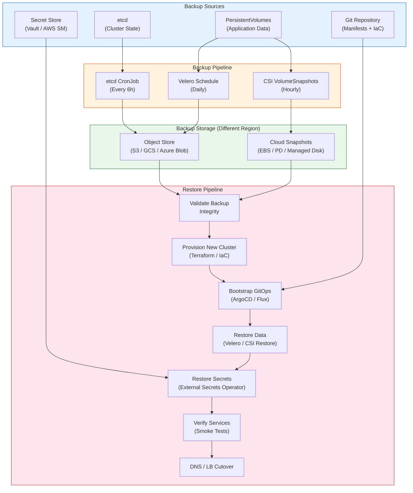

# Disaster Recovery

## 1. Overview

Disaster recovery (DR) for Kubernetes is the set of strategies, tools, and runbooks that enable you to restore cluster functionality and workloads after a catastrophic failure. "Catastrophic" ranges from an accidental `kubectl delete namespace production` to an entire availability zone going offline to an etcd corruption event that renders the control plane unrecoverable.

The fundamental insight is that Kubernetes clusters are **not** the source of truth -- your Git repository, backup system, and external state stores are. A well-designed DR strategy treats the cluster as disposable infrastructure that can be recreated from declarative definitions. The challenge lies in the state that does not live in Git: etcd cluster state, PersistentVolume data, in-flight workloads, and external integrations (DNS records, IAM bindings, certificates).

DR for Kubernetes spans three layers: **control plane recovery** (etcd backup/restore), **workload recovery** (Velero, GitOps), and **data recovery** (CSI snapshots, database replication). Each layer has different RTO/RPO characteristics and requires different tools.

## 2. Why It Matters

- **etcd is the single source of truth for cluster state.** If etcd data is lost and there is no backup, the entire cluster must be rebuilt from scratch -- every Deployment, Service, ConfigMap, Secret, RBAC binding, and CRD instance is gone. This is not a theoretical risk; etcd disk corruption, accidental deletion, and failed upgrades have caused production incidents at scale.
- **Kubernetes does not back up your data by default.** PersistentVolumes contain application data (databases, file stores, queues) that is not captured by cluster state backups. Losing a PV without a snapshot means data loss.
- **Multi-region availability requires deliberate DR design.** Running workloads in two regions does not automatically mean you have DR. Without tested failover procedures, a region failure becomes a scramble rather than a planned cutover.
- **Compliance mandates DR capabilities.** SOC 2, HIPAA, PCI-DSS, and FedRAMP all require documented and tested disaster recovery plans with defined RTO/RPO targets.
- **The blast radius of Kubernetes failures is large.** A single cluster often hosts dozens or hundreds of services. A cluster-level failure is a platform-level failure, making DR a platform team responsibility with organization-wide impact.

## 3. Core Concepts

- **RTO (Recovery Time Objective):** The maximum acceptable time from disaster detection to full service restoration. For Kubernetes clusters, RTO depends on whether you are restoring into an existing cluster (minutes to hours) or provisioning a new one (hours to a day).
- **RPO (Recovery Point Objective):** The maximum acceptable data loss measured in time. An RPO of 1 hour means you can lose up to 1 hour of data. For etcd, RPO is determined by backup frequency. For application data, RPO depends on snapshot or replication frequency.
- **etcd Snapshot:** A point-in-time backup of all etcd data, captured via `etcdctl snapshot save`. This contains every Kubernetes object (Deployments, Secrets, ConfigMaps, CRDs, RBAC rules). Restoring an etcd snapshot restores the cluster to the exact state at the time of the snapshot.
- **Velero:** The de facto standard for Kubernetes workload backup and restore. Velero captures Kubernetes resources (as JSON) and PersistentVolume data (via snapshots or file-level backup with Restic/Kopia) and stores them in an object store (S3, GCS, Azure Blob).
- **CSI Snapshot:** A storage-level snapshot of a PersistentVolume, taken via the Kubernetes VolumeSnapshot API. CSI snapshots are storage-provider-native (EBS snapshots, GCE PD snapshots, Ceph RBD snapshots) and are faster and more consistent than file-level backups.
- **GitOps as DR:** When all cluster configuration (manifests, Helm charts, Kustomize overlays) is stored in Git, a new cluster can be bootstrapped by pointing ArgoCD or Flux at the repository. The cluster converges to the desired state. GitOps provides the fastest path to workload recovery but does not cover application data.
- **Backup Location:** Where backup data is stored. Must be in a different failure domain than the cluster. For cloud clusters, this means a different region or a different cloud account. For on-premises, this means an off-site location or cloud storage.
- **Restore Testing:** The only way to validate that backups work. A backup that has never been restored is a backup that might not work. DR testing should be scheduled (quarterly at minimum) and automated where possible.
- **Immutable Backups:** Backups stored in a location where they cannot be deleted or modified for a specified retention period. AWS S3 Object Lock, Azure Immutable Blob Storage, and GCS retention policies provide this. Critical for protecting against ransomware or malicious insiders.
- **Recovery Runbook:** A step-by-step, tested document that describes exactly how to perform a recovery. Runbooks must specify who does what, in what order, with what commands, and what the expected outputs are. A runbook that has not been tested is a wishlist, not a plan.

## 4. How It Works

### etcd Backup and Restore

**Taking a snapshot:**

```bash
# Manual snapshot (self-managed clusters)
ETCDCTL_API=3 etcdctl snapshot save /backup/etcd-snapshot-$(date +%Y%m%d-%H%M%S).db \
  --endpoints=https://127.0.0.1:2379 \
  --cacert=/etc/kubernetes/pki/etcd/ca.crt \
  --cert=/etc/kubernetes/pki/etcd/server.crt \
  --key=/etc/kubernetes/pki/etcd/server.key

# Verify snapshot integrity
ETCDCTL_API=3 etcdctl snapshot status /backup/etcd-snapshot.db --write-out=table
```

**Automated backup with CronJob:**

```yaml
apiVersion: batch/v1
kind: CronJob
metadata:
  name: etcd-backup
  namespace: kube-system
spec:
  schedule: "0 */6 * * *"  # Every 6 hours
  jobTemplate:
    spec:
      template:
        spec:
          hostNetwork: true
          nodeSelector:
            node-role.kubernetes.io/control-plane: ""
          tolerations:
          - key: node-role.kubernetes.io/control-plane
            effect: NoSchedule
          containers:
          - name: etcd-backup
            image: bitnami/etcd:3.5
            command:
            - /bin/sh
            - -c
            - |
              etcdctl snapshot save /backup/etcd-$(date +%Y%m%d-%H%M%S).db \
                --endpoints=https://127.0.0.1:2379 \
                --cacert=/etc/kubernetes/pki/etcd/ca.crt \
                --cert=/etc/kubernetes/pki/etcd/server.crt \
                --key=/etc/kubernetes/pki/etcd/server.key
              # Upload to S3
              aws s3 cp /backup/etcd-*.db s3://my-etcd-backups/$(date +%Y/%m/%d)/
              # Prune local backups older than 7 days
              find /backup -name "etcd-*.db" -mtime +7 -delete
            volumeMounts:
            - name: etcd-certs
              mountPath: /etc/kubernetes/pki/etcd
              readOnly: true
            - name: backup-dir
              mountPath: /backup
          volumes:
          - name: etcd-certs
            hostPath:
              path: /etc/kubernetes/pki/etcd
          - name: backup-dir
            hostPath:
              path: /var/lib/etcd-backups
          restartPolicy: OnFailure
```

**Restoring an etcd snapshot (self-managed cluster):**

1. Stop the API server and etcd on all control plane nodes.
2. Restore the snapshot on each etcd member:
   ```bash
   ETCDCTL_API=3 etcdctl snapshot restore /backup/etcd-snapshot.db \
     --data-dir=/var/lib/etcd-restored \
     --name=cp-1 \
     --initial-cluster=cp-1=https://10.0.1.1:2380,cp-2=https://10.0.1.2:2380,cp-3=https://10.0.1.3:2380 \
     --initial-advertise-peer-urls=https://10.0.1.1:2380
   ```
3. Replace the etcd data directory with the restored data.
4. Start etcd and the API server.
5. Verify cluster state: check that all namespaces, Deployments, and Services are present.

**On managed Kubernetes:** etcd is managed by the provider. EKS, GKE, and AKS all perform automatic etcd backups. Restoring typically requires provider support or recreating the cluster from backup. GKE provides a `gcloud container clusters restore` capability.

### Velero Backup and Restore

**Installation and configuration:**

```bash
# Install Velero with AWS provider
velero install \
  --provider aws \
  --plugins velero/velero-plugin-for-aws:v1.9.0 \
  --bucket my-velero-backups \
  --backup-location-config region=us-east-1 \
  --snapshot-location-config region=us-east-1 \
  --secret-file ./credentials-velero
```

**Scheduled backups:**

```yaml
apiVersion: velero.io/v1
kind: Schedule
metadata:
  name: daily-full-backup
  namespace: velero
spec:
  schedule: "0 2 * * *"  # Daily at 2 AM
  template:
    includedNamespaces:
    - production
    - staging
    storageLocation: default
    volumeSnapshotLocations:
    - default
    ttl: 720h  # Retain for 30 days
    snapshotMoveData: true  # For CSI snapshot data movement
    defaultVolumesToFsBackup: false  # Use CSI snapshots, not file-level
```

**Velero restore workflow:**

```bash
# List available backups
velero backup get

# Restore entire backup
velero restore create --from-backup daily-full-backup-20240315020000

# Restore specific namespace
velero restore create --from-backup daily-full-backup-20240315020000 \
  --include-namespaces production

# Restore with resource mapping (e.g., different StorageClass)
velero restore create --from-backup daily-full-backup-20240315020000 \
  --namespace-mappings production:production-restored
```

### Cluster Recreation from GitOps

The fastest path to DR for stateless workloads:

1. **Provision new cluster** from IaC (Terraform, Pulumi). The cluster definition -- node pools, networking, IAM roles -- is in version control.
2. **Bootstrap ArgoCD/Flux** on the new cluster, pointing at the same Git repository.
3. **ArgoCD syncs all applications.** Every Deployment, Service, ConfigMap, Ingress, and CRD instance is recreated from the Git manifests.
4. **Restore Secrets** from an external secret store (AWS Secrets Manager, HashiCorp Vault) via External Secrets Operator. Secrets should never be in Git.
5. **Restore data** using Velero restore or database-native replication (for stateful workloads).
6. **Update DNS** to point to the new cluster.

### Stateful Workload DR

Stateful workloads require additional DR strategies beyond cluster-level backup:

| Workload Type | Primary DR Mechanism | RPO | RTO |
|---|---|---|---|
| **PostgreSQL/MySQL** | Streaming replication to standby region | Near-zero (async) to zero (sync) | Minutes (promote standby) |
| **Redis** | Redis Sentinel with cross-region replica | Seconds (async replication) | Seconds (automatic failover) |
| **Kafka** | MirrorMaker 2 cross-region replication | Seconds to minutes | Minutes (consumer re-pointing) |
| **Generic PV data** | Velero + CSI snapshots | Snapshot frequency (hourly) | Minutes to hours (restore) |
| **Object storage** | S3 cross-region replication | Near-zero | Near-zero (redirect) |

**Database-specific considerations for Kubernetes DR:**

- **PostgreSQL on Kubernetes (via CloudNativePG or Zalando operator):** These operators support continuous WAL archiving to S3/GCS. Recovery creates a new cluster from the base backup plus WAL replay. RPO is determined by WAL archiving frequency (typically seconds). The operator handles promotion of a standby to primary within the cluster; cross-region DR requires a standby cluster in the DR region with WAL shipping.
- **MongoDB (via MongoDB Community/Enterprise Operator):** Supports replica sets with members in different regions. Failover is automatic within the replica set. For full DR, configure a replica set member in the DR region as a secondary with priority 0 (only promoted during DR).
- **Elasticsearch:** Cross-cluster replication (CCR) replicates indices from a leader cluster to a follower cluster. The follower can be promoted to leader during DR. However, CCR only replicates data -- index settings, templates, and ILM policies must be managed separately (via GitOps).

### RTO/RPO Target Setting

Setting appropriate RTO/RPO targets requires understanding business impact:

| Tier | RTO Target | RPO Target | Investment Required | Example Workloads |
|---|---|---|---|---|
| **Tier 1: Mission-Critical** | < 15 minutes | < 1 minute | High (active-active, sync replication) | Payment processing, auth services, primary databases |
| **Tier 2: Business-Critical** | < 1 hour | < 15 minutes | Medium (warm standby, async replication) | Customer-facing APIs, order management |
| **Tier 3: Business-Operational** | < 4 hours | < 1 hour | Low-Medium (backup/restore, scheduled snapshots) | Internal tools, reporting, analytics |
| **Tier 4: Non-Critical** | < 24 hours | < 24 hours | Low (daily backups) | Dev/staging environments, documentation |

**How to measure actual RTO/RPO:**
- **RTO measurement:** Time from disaster detection to the moment health checks pass on the restored system. Include: detection time + decision time + restore execution time + validation time.
- **RPO measurement:** The timestamp of the most recent successfully restored data minus the timestamp of the disaster. Determined by: backup frequency, replication lag, or WAL archive shipping delay.

### DR Testing Framework

A structured approach to validating DR capabilities:

**Tabletop exercise (quarterly):**
- Walk through the DR runbook with the team, step by step.
- Identify assumptions that have changed since the last test.
- Update the runbook with any procedural changes.

**Component-level test (monthly):**
- Restore a single namespace from Velero backup into a test cluster.
- Verify all resources, PVCs, and application functionality.
- Measure restore time and data completeness.

**Full DR test (semi-annually):**
- Simulate a complete cluster failure.
- Execute the full DR runbook: provision new cluster, restore from backups, cutover DNS.
- Measure actual RTO and RPO; compare against targets.
- Document gaps and create remediation tickets.

**Chaos engineering integration (continuous):**
- Use tools like Litmus Chaos or Chaos Mesh to inject failures (Pod kill, node drain, network partition).
- Verify that applications recover within expected timeframes.
- Validate that PDBs, topology spread constraints, and replica counts provide sufficient resilience.

## 5. Architecture / Flow



## 6. Types / Variants

### DR Strategy Tiers

| Tier | Strategy | RTO | RPO | Cost | Best For |
|---|---|---|---|---|---|
| **Tier 1: Backup & Restore** | Periodic backups to object store; restore on demand | 4-24 hours | Hours (backup frequency) | Low | Non-critical environments, dev/staging |
| **Tier 2: Warm Standby** | Standby cluster provisioned but not running workloads; data replicated async | 1-4 hours | Minutes to hours | Medium | Business-critical applications |
| **Tier 3: Hot Standby** | Active-passive: standby cluster running workloads, data replicated sync | 5-30 minutes | Near-zero | High | Mission-critical, regulated workloads |
| **Tier 4: Active-Active** | Multiple clusters serving traffic simultaneously; automatic failover | Near-zero | Near-zero | Highest | Financial services, healthcare, global SaaS |

### Multi-Region Failover Patterns

| Pattern | Description | Complexity | Data Consistency |
|---|---|---|---|
| **Active-Passive** | Primary region serves all traffic; secondary is standby. Failover = promote secondary + DNS switch. | Medium | Strong (sync replication) or eventual (async) |
| **Active-Active Read** | Writes go to primary; reads served from both regions. Failover = promote secondary for writes. | High | Eventual for cross-region reads |
| **Active-Active Write** | Both regions accept writes. Conflict resolution required. | Very high | Eventual; conflict resolution complexity |
| **Pilot Light** | Minimal footprint in DR region (database replica, core infra). Full cluster provisioned only on failover. | Low | Depends on replication |

### Backup Tool Comparison

| Tool | Scope | PV Support | Strengths | Limitations |
|---|---|---|---|---|
| **etcdctl snapshot** | etcd data only | No | Complete cluster state, fast | Does not capture PV data; self-managed clusters only |
| **Velero** | K8s resources + PVs | CSI snapshots, Restic/Kopia | Full workload backup, scheduling, cross-cluster restore | Restore can be slow for large PV datasets; cannot restore into a running namespace |
| **Kasten K10** | K8s resources + PVs + databases | CSI, application-consistent | Database-aware snapshots, compliance features | Commercial product; higher cost |
| **Stash/KubeStash** | PVs primarily | Restic-based | Lightweight, flexible backup targets | Less mature than Velero for resource backup |
| **GitOps (ArgoCD/Flux)** | K8s resource definitions | No | Fastest workload recreation; single source of truth | Does not cover PV data, runtime Secrets, or CRD instances not in Git |

## 7. Use Cases

- **Accidental namespace deletion:** An engineer runs `kubectl delete namespace production`. Without DR, this is a career-defining incident. With Velero, the team runs `velero restore create --from-backup <latest> --include-namespaces production` and all resources (Deployments, Services, ConfigMaps, PVCs) are restored. PV data is restored from CSI snapshots. Total recovery time: 15-30 minutes with tested runbooks.
- **AZ failure with data loss:** An AWS availability zone becomes unavailable, taking down worker nodes and EBS volumes. Pods are rescheduled to nodes in other AZs by the scheduler. PVs bound to the failed AZ are inaccessible. The team restores PV data from cross-AZ EBS snapshots (taken hourly by Velero). Stateful workloads (databases) fail over to replicas in other AZs. Recovery time: 30 minutes to 2 hours depending on data volume.
- **Complete region failure:** A natural disaster takes out an entire cloud region. The DR plan activates: a new cluster is provisioned in the secondary region from Terraform. ArgoCD bootstraps workloads from Git. Database replicas in the secondary region are promoted. DNS is updated via Route 53 health checks (automatic) or manual failover. Recovery time: 1-4 hours for Tier 2 (warm standby).
- **etcd corruption after failed upgrade:** A self-managed cluster upgrade fails midway, leaving etcd in an inconsistent state. The team restores from the pre-upgrade etcd snapshot (taken as part of the upgrade runbook). The cluster returns to the pre-upgrade state. They investigate the upgrade failure, fix the root cause, and re-attempt. Recovery time: 30-60 minutes.
- **Ransomware or malicious deletion:** An attacker with cluster-admin credentials deletes workloads and PVs. Because backups are stored in a separate AWS account with cross-account IAM policies (the backup account has no inbound access from the production account), the attacker cannot delete backups. The team restores from Velero backups in the isolated account.
- **Compliance-driven DR testing:** A financial services company runs quarterly DR tests. They provision a temporary cluster in their DR region, restore from the latest Velero backup, run their full integration test suite against the restored cluster, record the RTO and RPO achieved, and then tear down the DR cluster. The test results are submitted as evidence for SOC 2 audits.

## 8. Tradeoffs

| Decision | Option A | Option B | Guidance |
|---|---|---|---|
| **etcd snapshot vs. Velero for cluster state** | etcd: complete, bit-for-bit restore | Velero: resource-level, portable across clusters | etcd for same-cluster restore; Velero for cross-cluster or selective restore |
| **CSI snapshots vs. file-level backup (Restic/Kopia)** | CSI: fast, storage-native, consistent | Restic: portable, any storage backend, smaller granularity | CSI for production PVs; Restic for portability or when CSI snapshots are not available |
| **Active-Active vs. Active-Passive** | Active-Active: near-zero RTO/RPO | Active-Passive: simpler, cheaper | Active-Passive for most workloads; Active-Active only for workloads that justify the complexity and cost |
| **GitOps-only DR vs. full backup** | GitOps: fast, no backup storage cost | Full backup: captures runtime state, PV data | GitOps for stateless workloads; full backup (Velero) for stateful workloads and runtime state |
| **Same-region vs. cross-region backups** | Same-region: faster restore, lower cost | Cross-region: survives region failure | Cross-region for production; same-region acceptable for non-critical environments |
| **Backup frequency vs. storage cost** | Frequent (hourly): lower RPO | Infrequent (daily): lower storage cost | Match backup frequency to RPO requirements; use lifecycle policies to tier old backups to cheaper storage |

## 9. Common Pitfalls

- **Never testing restores.** The most common DR failure. Teams take daily backups for years, then discover during an actual disaster that the backups are incomplete, corrupted, or that the restore procedure has undocumented dependencies. Schedule restore tests quarterly at minimum.
- **Backing up to the same failure domain.** Storing etcd snapshots on the same EBS volume as etcd data provides zero protection against AZ failure. Store backups in a different region and ideally a different account.
- **Forgetting Secrets in DR.** GitOps restores everything except Secrets (which should not be in Git). If your DR plan does not include Secret restoration (from Vault, AWS Secrets Manager, or sealed-secrets), your applications will crash on startup with missing credentials.
- **Ignoring PDB/PV dependencies during restore.** Restoring a StatefulSet that depends on PVCs before the PVCs are restored results in Pods stuck in Pending. Velero handles ordering, but custom restore scripts may not.
- **Assuming managed Kubernetes handles all DR.** EKS, GKE, and AKS back up etcd automatically, but they do not back up your PersistentVolumes, your application data, or your custom resources. You are still responsible for workload-level DR.
- **Not versioning your DR runbooks.** DR procedures that exist only in a wiki or someone's head are not DR procedures. They must be in Git, versioned, and tested by the on-call rotation.
- **Overlooking DNS TTL in failover.** If your DNS records have a 24-hour TTL, switching DNS during failover still routes traffic to the old cluster for up to 24 hours. Use low TTLs (60-300 seconds) for records involved in failover.
- **Restoring into a running cluster without namespace isolation.** Velero restores can conflict with existing resources. Always restore into a clean namespace or a clean cluster to avoid merge conflicts.
- **Not accounting for CRD instances.** Velero backs up CRD definitions and instances, but if the operator that manages those CRDs is not running in the restored cluster, the instances are meaningless. Restore operators before their CRD instances.

## 10. Real-World Examples

- **GitLab's database deletion incident (2017):** Though not Kubernetes-specific, GitLab's accidental production database deletion is the canonical DR cautionary tale. Five backup mechanisms were in place; none worked when tested during the incident. The root cause: backup procedures were never end-to-end tested. This incident led to industry-wide adoption of "DR testing" as a regular practice, not just a documented plan.
- **Large SaaS platform etcd recovery:** A company running self-managed Kubernetes experienced etcd leader election failures after a disk filled up. The etcd cluster became read-only, preventing any changes to cluster state (no new deployments, no scaling, no Pod scheduling). They restored from a 6-hour-old etcd snapshot, losing 6 hours of cluster state changes. All Deployments, Services, and ConfigMaps reverted to the snapshot state. GitOps (ArgoCD) then re-applied the latest desired state from Git, converging the cluster back to current within 20 minutes. Total downtime: 45 minutes. Lesson: etcd backup frequency directly determines RPO.
- **Multi-region failover at a fintech company:** A fintech running on EKS in us-east-1 experienced a partial AZ failure. Their DR strategy: active-passive with us-west-2 warm standby. The warm standby had the cluster provisioned via Terraform, ArgoCD configured but syncing was paused, and PostgreSQL streaming replication to a standby in us-west-2. Failover steps: promote PostgreSQL standby (2 minutes), unpause ArgoCD sync (5 minutes for full convergence), update Route 53 failover records (automatic via health checks). Total RTO: 12 minutes. RPO: approximately 30 seconds (async replication lag).
- **Velero-based namespace recovery:** A team accidentally applied a Kustomize overlay that deleted all resources in a namespace (the overlay set `resources: []`). Velero restore from the most recent daily backup recovered all 47 Deployments, 23 Services, 15 ConfigMaps, and 8 PVCs within 10 minutes. PV data was restored from CSI snapshots. The team added a CI check to prevent empty resource lists in Kustomize overlays.
- **Immutable backup preventing ransomware damage:** A company experienced a compromised service account that deleted Deployments and PVCs in multiple namespaces. The attacker also attempted to delete Velero backups. However, backups were stored in an S3 bucket in a separate AWS account with Object Lock (compliance mode, 30-day retention). The attacker could not delete the backups. The team restored all namespaces from the locked backups within 2 hours. Post-incident, they tightened RBAC to prevent service accounts from accessing the Velero namespace.

### DR Architecture Patterns in Detail

**Pattern 1: Single-cluster with backup/restore**

The simplest DR architecture. A single production cluster is backed up to a remote object store. On failure, a new cluster is provisioned and restored from backup.

- **Pros:** Simple, low cost, suitable for most workloads.
- **Cons:** Highest RTO (hours); requires manual or semi-automated recovery.
- **Implementation:** Velero scheduled backups to cross-region S3, etcd CronJob backups, IaC in Git.

**Pattern 2: Active-passive with warm standby**

A secondary cluster is provisioned in a DR region. It has the same IaC-provisioned infrastructure but workloads are paused or synced but not serving traffic. Database replication keeps the DR region data current.

- **Pros:** Faster RTO (minutes to 1 hour); infrastructure already provisioned.
- **Cons:** DR cluster consumes resources (cost); replication adds complexity.
- **Implementation:** Terraform provisions both clusters. ArgoCD syncs to both but DR cluster has auto-sync paused. Database streaming replication to DR. Route 53 failover routing.

**Pattern 3: Active-active multi-region**

Both regions serve traffic simultaneously. Data is replicated bidirectionally. Failover is automatic: when health checks detect a region failure, traffic shifts entirely to the healthy region.

- **Pros:** Near-zero RTO/RPO; always-on redundancy.
- **Cons:** Highest cost (2x infrastructure); data conflict resolution for writes; application must be designed for multi-region (idempotent writes, conflict-free data structures).
- **Implementation:** Global load balancer (AWS Global Accelerator, Cloudflare). CockroachDB or Spanner for multi-region consistent data. ArgoCD ApplicationSets deploying to both clusters.

## 11. Related Concepts

- [Cluster Upgrades](./01-cluster-upgrades.md) -- etcd backup is a prerequisite for every upgrade
- [Troubleshooting Patterns](./03-troubleshooting-patterns.md) -- debugging restore failures, Pod pending after restore
- [Kubernetes Architecture](../01-foundations/01-kubernetes-architecture.md) -- etcd as the single source of truth, control plane components
- [GitOps and Continuous Delivery](../08-deployment-design/02-gitops-and-continuous-delivery.md) -- GitOps as the foundation for cluster recreation
- [Storage Design](../05-storage-design/01-persistent-volumes-and-storage-classes.md) -- PVs, PVCs, CSI snapshots
- [Security Design](../07-security-design/01-rbac-and-access-control.md) -- RBAC for backup access, cross-account IAM for backup isolation

## 12. Source Traceability

- source/youtube-video-reports/7.md -- Five pillars of Kubernetes (storage pillar: PVs, PVCs, StorageClasses), lifecycle and operations (self-managed vs. vendor-managed), strategic framework for architectural analysis
- source/youtube-video-reports/1.md -- Availability nines framework (RTO/RPO context), strong consistency requirements for critical systems, redundancy for high-scale applications
- Kubernetes official documentation -- etcd backup and restore procedures, VolumeSnapshot API
- Velero documentation -- Backup schedules, restore procedures, CSI integration
- AWS/GCP/Azure documentation -- Managed Kubernetes backup capabilities, cross-region replication
