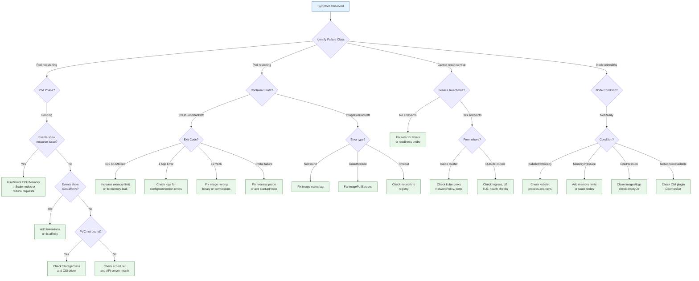

# Troubleshooting Patterns

## 1. Overview

Troubleshooting Kubernetes is fundamentally about understanding the **dependency chain** that leads to a running, reachable workload. Every symptom -- a Pod stuck in Pending, a CrashLoopBackOff, a Service returning 503s -- is a failure at a specific point in that chain. The difference between a 5-minute fix and a 2-hour firefight is whether you have a systematic decision tree or whether you are running `kubectl get pods` repeatedly and hoping something changes.

This document provides actionable decision trees for the most common Kubernetes failure modes, organized by symptom. Each decision tree starts with the observable symptom, branches through diagnostic commands, and terminates at root causes with remediation steps. The goal is to eliminate guesswork: when you see CrashLoopBackOff, you should know exactly which five things to check and in what order.

The troubleshooting tools covered include `kubectl describe`, `kubectl logs`, `kubectl debug`, ephemeral containers, `crictl` for runtime-level debugging, and `kubectl exec` for in-container diagnostics. These tools map to different layers of the stack: Kubernetes API layer, container runtime layer, and application layer.

## 2. Why It Matters

- **MTTR (Mean Time to Recovery) is the metric that matters.** In a production incident, every minute of downtime costs money and trust. Structured troubleshooting reduces MTTR from hours to minutes by eliminating random exploration.
- **Kubernetes surfaces symptoms, not root causes.** `Pending` could mean 10 different things. `CrashLoopBackOff` could mean 8 different things. Without a decision tree, engineers waste time investigating the wrong branch.
- **Most Kubernetes failures follow known patterns.** The same 10-15 failure modes account for 90% of incidents. Learning these patterns once eliminates repeated investigations.
- **Production debugging is constrained.** You cannot SSH into nodes in managed Kubernetes. You cannot always install debugging tools in production containers. Knowing when to use `kubectl debug` vs. `kubectl exec` vs. `crictl` vs. node-level logs determines whether you can diagnose the issue at all.
- **On-call engineers need runbooks, not expertise.** Not everyone on the on-call rotation is a Kubernetes expert. Decision trees convert expertise into repeatable procedures that any engineer can follow.

## 3. Core Concepts

- **Pod Phase:** The high-level state of a Pod: Pending, Running, Succeeded, Failed, Unknown. The phase tells you where in the lifecycle the Pod is stuck.
- **Container State:** Within a running Pod, each container has a state: Waiting, Running, Terminated. The `reason` field on Waiting and Terminated states is the primary diagnostic signal (e.g., `CrashLoopBackOff`, `OOMKilled`, `ImagePullBackOff`).
- **Events:** Kubernetes emits events for state transitions and errors. Events are the narrative of what happened and when. Access them via `kubectl describe pod` or `kubectl get events --sort-by=.metadata.creationTimestamp`. Events expire after 1 hour by default.
- **Conditions:** Structured boolean status fields on objects. Node conditions (Ready, MemoryPressure, DiskPressure, PIDPressure) and Pod conditions (PodScheduled, Initialized, ContainersReady, Ready) tell you which stage of the lifecycle has failed.
- **Exit Codes:** When a container terminates, it returns an exit code. Exit code 0 = success. Exit code 1 = application error. Exit code 137 = SIGKILL (often OOMKilled). Exit code 143 = SIGTERM (graceful shutdown). Exit code 126 = command not executable. Exit code 127 = command not found.
- **Backoff:** When a container crashes repeatedly, Kubernetes applies exponential backoff before restarting it: 10s, 20s, 40s, ... up to 5 minutes. This is CrashLoopBackOff -- the Pod is in a restart loop with increasing delays.
- **Ephemeral Containers:** Temporary containers injected into a running Pod for debugging. They share the Pod's network namespace and can access the same volumes. Added via `kubectl debug`. Useful when the application container lacks debugging tools (distroless images, minimal Alpine).
- **kubectl debug:** A command that supports two modes: (1) add an ephemeral container to an existing Pod, (2) create a copy of a Pod with a different image or modified command. Also supports node-level debugging by creating a privileged Pod on a specific node.
- **crictl:** A CLI for CRI-compatible container runtimes (containerd, CRI-O). Used for node-level debugging when kubectl cannot reach the Pod (kubelet issues, runtime crashes). Commands mirror Docker CLI: `crictl ps`, `crictl logs`, `crictl inspect`.

## 4. How It Works

### The Universal Troubleshooting Workflow

For any Kubernetes issue, start with this sequence:

1. **Identify the symptom:** What is the observable behavior? Pod not starting? Service not reachable? Slow response times?
2. **Gather context:** `kubectl get pods -o wide` (which node?), `kubectl describe pod <name>` (events, conditions), `kubectl logs <pod> [--previous]` (application output).
3. **Locate the failure in the dependency chain:**
   - **Scheduling** (Pod Pending) -- resources, affinity, taints, PVC binding
   - **Image pulling** (ImagePullBackOff) -- image name, registry auth, network
   - **Container startup** (CrashLoopBackOff) -- command, config, resources, probes
   - **Networking** (Service unreachable) -- endpoints, DNS, NetworkPolicy, kube-proxy
   - **Node health** (Node NotReady) -- kubelet, runtime, disk, memory
4. **Apply the specific decision tree** for the identified failure class.
5. **Validate the fix:** Confirm the Pod reaches Running/Ready, the Service has endpoints, the node is Ready.

### Decision Tree: Pod Pending

```
Pod is Pending
├── kubectl describe pod → check Events
│
├── "Insufficient cpu/memory"
│   ├── Check node allocatable: kubectl describe node | grep -A5 Allocated
│   ├── Are requests too high? → Lower requests or add nodes
│   ├── Is the cluster full? → Scale node group or add node pool
│   └── Are there resource quotas blocking? → kubectl describe quota -n <ns>
│
├── "0/N nodes are available: N node(s) had taints..."
│   ├── Check taints: kubectl get nodes -o json | jq '.items[].spec.taints'
│   ├── Does the Pod have matching tolerations? → Add tolerations
│   └── Are all nodes tainted (e.g., control-plane only)? → Add worker nodes
│
├── "0/N nodes are available: N node(s) didn't match Pod's node affinity"
│   ├── Check nodeSelector / nodeAffinity in Pod spec
│   ├── Do matching nodes exist? → kubectl get nodes -l <label>
│   └── No matching nodes? → Add labels to nodes or adjust affinity
│
├── "persistentvolumeclaim not found" or "waiting for volume to be bound"
│   ├── Check PVC status: kubectl get pvc -n <ns>
│   ├── PVC is Pending → Check StorageClass exists, CSI driver is installed
│   ├── PVC bound but wrong AZ → Check volumeBindingMode: WaitForFirstConsumer
│   └── No available PVs? → Provision PV or check StorageClass provisioner
│
├── "no preemption victims found"
│   ├── Pod has a PriorityClass but cannot preempt lower-priority Pods
│   └── Check PDB constraints on lower-priority Pods
│
└── No events at all
    ├── Scheduler not running? → kubectl get pods -n kube-system | grep scheduler
    └── API server overloaded? → Check API server logs
```

### Decision Tree: CrashLoopBackOff

```
Container is CrashLoopBackOff
├── kubectl logs <pod> [--previous] → check application output
├── kubectl describe pod → check Last State → Exit Code and Reason
│
├── Exit Code 137 (OOMKilled)
│   ├── Reason: "OOMKilled" in container status
│   ├── Container exceeded memory limit → Increase memory limit
│   ├── Memory leak in application → Profile with pprof / heap dump
│   └── JVM: -Xmx not aligned with container limit → Set -Xmx to 75% of limit
│
├── Exit Code 1 (Application Error)
│   ├── Check logs for stack traces, config errors
│   ├── Missing environment variable? → Check ConfigMap/Secret mounts
│   ├── Database connection refused? → Check Service endpoint, credentials
│   ├── Permission denied on file/volume? → Check securityContext (runAsUser, fsGroup)
│   └── Config file syntax error? → Validate ConfigMap content
│
├── Exit Code 127 (Command Not Found)
│   ├── Wrong entrypoint/command in container spec
│   ├── Image does not contain the binary → Verify image tag, check Dockerfile
│   └── Multi-stage build did not copy binary → Rebuild image
│
├── Exit Code 126 (Command Not Executable)
│   ├── Binary lacks execute permission → Fix in Dockerfile (chmod +x)
│   └── Wrong architecture (AMD64 image on ARM node) → Check node architecture
│
├── Liveness Probe Failure
│   ├── Container starts but liveness probe fails → kubelet kills it
│   ├── Is initialDelaySeconds sufficient? → Increase it
│   ├── Is the probe endpoint correct? → Test with kubectl exec curl
│   ├── Is timeoutSeconds too low? → Increase it
│   └── Use startupProbe for slow-starting containers
│
├── Readiness probe irrelevant (does not cause CrashLoopBackOff)
│   └── Readiness probe failures remove Pod from Service, not restart it
│
└── Container exits immediately (Exit Code 0)
    ├── Entrypoint completes and exits → Application expects to run as daemon
    ├── Script-based entrypoint: missing "exec" or background process exits
    └── Check if command is correct (e.g., "echo hello" vs. a long-running server)
```

### Decision Tree: ImagePullBackOff

```
Container is ImagePullBackOff or ErrImagePull
├── kubectl describe pod → check Events for pull error message
│
├── "repository does not exist" or "not found"
│   ├── Typo in image name or tag → Verify image:tag
│   ├── Image was deleted from registry → Check registry
│   └── Private registry without imagePullSecrets → Add imagePullSecrets to Pod spec or ServiceAccount
│
├── "unauthorized" or "authentication required"
│   ├── imagePullSecrets missing or incorrect → kubectl get secret <name> -o yaml
│   ├── Registry credential expired → Refresh token in Secret
│   └── ECR token expired (12h TTL) → Use ECR credential helper or CronJob to refresh
│
├── "TLS handshake timeout" or "connection refused"
│   ├── Network policy blocking egress to registry → Check NetworkPolicy
│   ├── Node cannot reach registry (VPC, firewall) → Check node networking
│   └── Registry is down → Check registry status
│
├── "manifest unknown"
│   ├── Tag exists but architecture does not match → Multi-arch image needed
│   └── Tag was overwritten and cache is stale → Force pull with imagePullPolicy: Always
│
└── "context deadline exceeded"
    ├── Large image on slow network → Use smaller base image
    └── Registry rate limit (Docker Hub: 100 pulls/6h for anonymous) → Use registry mirror or cache
```

### Decision Tree: Node NotReady

```
Node is NotReady
├── kubectl describe node <name> → check Conditions and Events
│
├── Condition: Ready = False, Reason: KubeletNotReady
│   ├── Kubelet process down → SSH to node, check systemctl status kubelet
│   ├── Kubelet certificate expired → Check /var/lib/kubelet/pki/
│   ├── Kubelet cannot reach API server → Check network, firewall, security groups
│   └── Kubelet misconfiguration → Check /var/lib/kubelet/config.yaml
│
├── Condition: MemoryPressure = True
│   ├── Node running out of memory → Check node memory usage (top, free -h)
│   ├── Pods without memory limits consuming all memory → Add limits
│   └── Kubelet evicting Pods → Check kubelet eviction thresholds
│
├── Condition: DiskPressure = True
│   ├── Container images filling disk → Clean unused images: crictl rmi --prune
│   ├── Container logs filling disk → Configure log rotation
│   ├── emptyDir volumes consuming disk → Set sizeLimit on emptyDir
│   └── Large PVs consuming local disk → Use network-attached storage
│
├── Condition: PIDPressure = True
│   ├── Fork bomb or process leak in a container → Identify and kill
│   └── Too many Pods on node → Reduce max-pods or add nodes
│
├── Condition: NetworkUnavailable = True
│   ├── CNI plugin not running → Check CNI DaemonSet (Calico, Cilium, etc.)
│   ├── CNI configuration error → Check /etc/cni/net.d/
│   └── Node network interface down → Check OS-level networking
│
└── Node disappeared from kubectl get nodes
    ├── Node terminated (Spot reclamation, ASG scale-in)
    ├── Kubelet cannot register → Check kubelet logs (journalctl -u kubelet)
    └── API server not reachable from node → Network partition
```

### Decision Tree: DNS Resolution Failures

```
DNS Resolution Failing
├── Verify CoreDNS is running:
│   kubectl get pods -n kube-system -l k8s-app=kube-dns
│
├── CoreDNS Pods not running / CrashLoopBackOff
│   ├── Check CoreDNS logs: kubectl logs -n kube-system -l k8s-app=kube-dns
│   ├── CoreDNS loop plugin causing crash (on-prem with resolve.conf loop)
│   └── Insufficient resources for CoreDNS → Check requests/limits
│
├── CoreDNS running but resolution fails
│   ├── Test from Pod: kubectl exec -it <pod> -- nslookup kubernetes.default
│   ├── Pod DNS policy overridden? → Check dnsPolicy in Pod spec
│   ├── Pod /etc/resolv.conf incorrect → Check dnsConfig, dnsPolicy
│   ├── NetworkPolicy blocking UDP/TCP 53 to kube-dns Service → Adjust policy
│   └── ndots:5 causing slow external resolution → Add search domain or set ndots:2
│
├── Intermittent DNS failures
│   ├── CoreDNS overloaded → Check CPU/memory usage, increase replicas
│   ├── ConnTrack table full → Check conntrack entries (sysctl net.netfilter.nf_conntrack_count)
│   ├── DNS race condition (Linux kernel <5.0) → Enable dns-node-cache (NodeLocal DNSCache)
│   └── UDP packet drops under load → Deploy NodeLocal DNSCache for TCP fallback
│
└── External DNS (non-cluster) resolution fails
    ├── CoreDNS forward plugin misconfigured → Check Corefile
    ├── Upstream DNS unreachable → Check VPC DNS, /etc/resolv.conf on nodes
    └── Firewall blocking outbound DNS → Check security groups, network policies
```

### Decision Tree: Service Not Reachable

```
Service Not Reachable
├── Verify Service exists: kubectl get svc <name> -n <ns>
│
├── Service has no endpoints
│   ├── kubectl get endpoints <svc-name> -n <ns>
│   ├── Selector does not match any Pods → Compare svc selector with pod labels
│   ├── Pods exist but not Ready → Check readiness probe
│   └── Pods in wrong namespace → Service and Pods must be in same namespace
│
├── Service has endpoints but not reachable
│   ├── From within cluster (Pod-to-Service)
│   │   ├── Test: kubectl exec -it <pod> -- curl <svc>.<ns>.svc.cluster.local:<port>
│   │   ├── kube-proxy not running → Check kube-proxy DaemonSet
│   │   ├── iptables/IPVS rules missing → kubectl exec on node, check iptables
│   │   ├── NetworkPolicy blocking traffic → Check ingress NetworkPolicies on target
│   │   └── Pod is listening on wrong port → Verify containerPort matches Service targetPort
│   │
│   ├── From outside cluster (Ingress/LoadBalancer)
│   │   ├── Ingress controller not running → Check ingress controller Pods
│   │   ├── Ingress rule misconfigured → kubectl describe ingress <name>
│   │   ├── TLS certificate error → Check cert-manager Certificate resource
│   │   ├── LoadBalancer not provisioned → Check cloud provider (SG, subnet tags)
│   │   └── Health check failing → Cloud LB health checks target node port
│   │
│   └── Intermittent connectivity
│       ├── Some Pods unhealthy → Check readiness across all replicas
│       ├── kube-proxy iptables stale → Restart kube-proxy Pods
│       ├── CNI plugin issue → Check CNI logs on affected nodes
│       └── MTU mismatch (overlay networks) → Verify MTU settings in CNI config
```

### Using kubectl debug

**Add an ephemeral debug container to a running Pod:**

```bash
# Attach a debug container with networking tools
kubectl debug -it <pod-name> --image=nicolaka/netshoot --target=<container-name>

# Inside the ephemeral container, you can:
# - curl localhost:<port> to test the application
# - nslookup <service> to test DNS
# - tcpdump to capture network traffic
# - dig, ping, traceroute for network diagnostics
```

**Create a debug copy of a Pod with a different image:**

```bash
# Copy the Pod but replace the image (useful for distroless containers)
kubectl debug <pod-name> -it --copy-to=debug-pod --image=ubuntu -- bash

# Copy the Pod and change the command (useful for investigating startup issues)
kubectl debug <pod-name> -it --copy-to=debug-pod --container=<container> -- sh
```

**Debug a node:**

```bash
# Create a privileged Pod on a specific node for node-level debugging
kubectl debug node/<node-name> -it --image=ubuntu

# This gives you a shell with access to the node's filesystem at /host
# chroot /host to access the node's root filesystem
# systemctl status kubelet  (after chroot)
# journalctl -u kubelet -n 100
# crictl ps  (list containers)
# crictl logs <container-id>
```

### Using crictl for Runtime Debugging

When kubectl cannot help (kubelet issues, runtime problems), `crictl` provides direct access to the container runtime:

```bash
# List all containers on the node
crictl ps -a

# Get container logs
crictl logs <container-id>

# Inspect a container (full JSON with state, config, mounts)
crictl inspect <container-id>

# List Pod sandboxes
crictl pods

# Pull an image (test registry connectivity)
crictl pull <image>

# Check container runtime info
crictl info
```

## 5. Architecture / Flow



## 6. Types / Variants

### Troubleshooting Tool Selection

| Scenario | Primary Tool | When to Use | Limitations |
|---|---|---|---|
| **Pod not starting** | `kubectl describe pod` | Always the first command for any Pod issue | Shows events and conditions but not application logs |
| **Application crashing** | `kubectl logs --previous` | Container has crashed; need last output | Only available if container ran long enough to produce output |
| **Running but misbehaving** | `kubectl exec` | Container has a shell and basic tools | Distroless images lack shell; use kubectl debug instead |
| **Distroless container** | `kubectl debug` (ephemeral) | Need tools not in the container image | Requires ephemeral container support (K8s 1.25+) |
| **Network issues** | `kubectl debug` + netshoot | Need tcpdump, dig, curl, traceroute | Ephemeral containers share network namespace |
| **Kubelet/runtime issues** | `crictl` on node | kubectl not working, need runtime-level view | Requires node access (SSH or kubectl debug node/) |
| **API server issues** | API server logs, etcd health | kubectl commands timing out or failing | Need control plane node access |
| **Intermittent issues** | Prometheus + Grafana | Need historical data, not point-in-time | Requires monitoring to be set up in advance |

### Troubleshooting by Kubernetes Layer

| Layer | Components | Common Failures | Diagnostic Commands |
|---|---|---|---|
| **Application** | Container process | Crashes, config errors, connection failures | `kubectl logs`, `kubectl exec` |
| **Pod** | Init containers, volumes, probes | Init failures, volume mount errors, probe misconfiguration | `kubectl describe pod`, `kubectl logs -c <init-container>` |
| **Scheduling** | kube-scheduler, resource quotas | Insufficient resources, affinity mismatches, taints | `kubectl describe pod` (events), `kubectl describe node` |
| **Networking** | kube-proxy, CNI, CoreDNS | DNS failure, Service routing, NetworkPolicy blocking | `kubectl exec -- nslookup`, `kubectl get endpoints` |
| **Node** | kubelet, container runtime, OS | Node NotReady, disk/memory pressure, runtime failures | `kubectl describe node`, `crictl`, `journalctl -u kubelet` |
| **Control Plane** | API server, etcd, controllers | API timeout, scheduling delays, reconciliation lag | API server logs, `etcdctl endpoint health`, component Pod logs |

### Common Error Messages and Their Meanings

| Error Message | Where Seen | Root Cause | Quick Fix |
|---|---|---|---|
| `0/3 nodes are available: 3 Insufficient cpu` | Pod events | Node CPU fully allocated | Add nodes or reduce CPU requests |
| `Back-off restarting failed container` | Pod events | Container keeps crashing (CrashLoopBackOff) | Check logs with `--previous` flag |
| `OOMKilled` | Container last state | Container exceeded memory limit | Increase memory limit or fix leak |
| `Liveness probe failed` | Pod events | Health endpoint not responding in time | Increase timeout, fix health endpoint, add startupProbe |
| `FailedScheduling...unbound PVC` | Pod events | PVC not bound to a PV | Check StorageClass, CSI driver, available PVs |
| `ErrImagePull` / `ImagePullBackOff` | Container state | Cannot pull container image | Fix image name, add pull secrets, check network |
| `FailedMount...timeout waiting for volume` | Pod events | Volume not attaching to node | Check CSI driver, node IAM permissions, AZ matching |
| `dial tcp: lookup ... no such host` | Application logs | DNS resolution failing | Check CoreDNS, NetworkPolicy, ndots setting |
| `connection refused` | Application logs | Target service not listening | Check target Pod readiness, correct port |
| `context deadline exceeded` | Application logs | Request timeout to dependency | Check dependency health, network path, resource pressure |

## 7. Use Cases

- **Production incident: Pod stuck Pending for 30 minutes.** On-call engineer follows the decision tree. `kubectl describe pod` shows "0/20 nodes are available: 20 Insufficient memory." The cluster autoscaler log shows it cannot provision new nodes (AWS account limit reached). Fix: request AWS limit increase or reduce memory requests on lower-priority workloads. Time to diagnose: 3 minutes.
- **Application CrashLoopBackOff after deployment.** New version deployed, Pods crash immediately. `kubectl logs --previous` shows "Error: REDIS_URL environment variable not set." The new version added a Redis dependency but the ConfigMap was not updated. Fix: update ConfigMap with REDIS_URL, redeploy. Time to diagnose: 2 minutes.
- **OOMKilled in JVM application.** Java container OOMKilled with 512Mi limit. `kubectl logs` shows no heap dump. Engineer adds `-XX:+HeapDumpOnOutOfMemoryError` to JVM args, increases limit to 1Gi temporarily, and discovers the heap grows unbounded when processing large payloads. Fix: implement streaming processing instead of loading full payload into memory. Increase memory limit to 768Mi as a permanent fix.
- **Intermittent 503s from Ingress.** Some requests return 503, others succeed. `kubectl get endpoints` shows the Service has 3 endpoints, but one Pod is flapping between Ready and NotReady. `kubectl describe pod` shows the readiness probe failing intermittently due to the application's dependency on a database that is under heavy load. Fix: increase readiness probe `failureThreshold` from 3 to 5 to tolerate brief database latency spikes, and address the database performance issue separately.
- **DNS resolution failing for external domains.** Pods cannot resolve `api.stripe.com`. Internal DNS (`kubernetes.default`) works fine. `kubectl exec -- cat /etc/resolv.conf` shows the correct CoreDNS Service IP. CoreDNS logs show `SERVFAIL` for external domains. Investigation reveals a NetworkPolicy in the `kube-system` namespace that blocks CoreDNS egress to the VPC DNS server on port 53. Fix: add an egress rule allowing CoreDNS to reach the VPC DNS.
- **Node NotReady after Spot instance reclamation.** An EKS node disappears from `kubectl get nodes`. CloudWatch shows a Spot interruption event. Karpenter detects the missing node and provisions a replacement. Pods on the terminated node are rescheduled by their controllers. No manual intervention needed, but the incident prompts the team to add PDBs to all critical workloads and ensure topology spread constraints distribute replicas across multiple AZs.
- **Debugging a distroless container.** A Go application in a distroless container is returning incorrect data, but the container has no shell. Engineer uses `kubectl debug -it <pod> --image=nicolaka/netshoot --target=app` to attach an ephemeral container. From the ephemeral container, they `curl localhost:8080/debug/pprof/heap` to capture a heap profile and `tcpdump -i eth0` to inspect network traffic. They discover the application is connecting to a stale database endpoint cached in a ConfigMap.

## 8. Tradeoffs

| Decision | Option A | Option B | Guidance |
|---|---|---|---|
| **kubectl debug vs. kubectl exec** | debug: works on distroless, adds tools | exec: simpler, no extra container | Use exec when the container has basic tools; debug when it does not |
| **Ephemeral container vs. Pod copy** | Ephemeral: modifies running Pod, shares PID namespace | Copy: new Pod, can change image/command | Ephemeral for live debugging; copy for startup investigation |
| **Node-level debug vs. SSH** | kubectl debug node/: no SSH keys needed, audit logged | SSH: full access, familiar tools | kubectl debug node/ for managed K8s; SSH for self-managed when deeper access is needed |
| **Rich debug images vs. minimal** | Rich (netshoot, busybox): more tools | Minimal: smaller attack surface | Rich for networking issues; minimal for quick checks |
| **Point-in-time debugging vs. observability** | Debug: reactive, manual | Observability: proactive, automated | Invest in observability (metrics, logs, traces) to reduce the need for manual debugging |

## 9. Common Pitfalls

- **Not checking events first.** `kubectl get pods` shows status but not why. Always run `kubectl describe pod` first -- the Events section at the bottom tells you what happened and when.
- **Forgetting `--previous` flag on logs.** When a container is in CrashLoopBackOff, `kubectl logs <pod>` shows the current (restarting) container's output, which may be empty. `kubectl logs <pod> --previous` shows the last crashed container's output.
- **Debugging the wrong container in a multi-container Pod.** Pods with sidecars have multiple containers. Logs default to the first container. Use `kubectl logs <pod> -c <container-name>` to specify which container.
- **Assuming Pending means "waiting to schedule."** Pending can also mean the Pod is waiting for init containers, volumes, or image pulls. The events tell you which.
- **Ignoring the difference between readiness and liveness probe failures.** Readiness probe failure removes the Pod from Service endpoints (no traffic) but does not restart it. Liveness probe failure restarts the container. Confusing the two leads to wrong remediation.
- **Not checking resource quotas.** A Pod can fail to schedule not because the cluster lacks capacity, but because the namespace's ResourceQuota is exhausted. `kubectl describe quota -n <namespace>` reveals this.
- **Overlooking init container failures.** If a Pod is stuck in `Init:0/2`, an init container has not completed. Check init container logs: `kubectl logs <pod> -c <init-container-name>`.
- **Not checking for NetworkPolicy.** When a Service has endpoints but traffic does not reach the Pods, NetworkPolicy is the most frequently overlooked cause. Many teams deploy default-deny policies and forget to add allow rules for new services.
- **Running debugging Pods and forgetting to clean up.** `kubectl debug` creates Pods that persist after you detach. Delete them when done to avoid wasting resources.

## 10. Real-World Examples

- **Shopify's incident taxonomy:** Shopify categorizes Kubernetes incidents by the troubleshooting decision tree layer: scheduling (12% of incidents), container lifecycle (35%), networking (28%), node health (15%), control plane (10%). This categorization drives their runbook investment -- container lifecycle gets the most detailed runbooks because it is the most common failure mode.
- **Datadog's approach to DNS debugging:** Datadog documented that their Kubernetes clusters experienced intermittent DNS failures correlated with high Pod churn. The root cause: ConnTrack table exhaustion during UDP DNS queries. Their fix: deploying NodeLocal DNSCache (node-level caching DNS that avoids ConnTrack for intra-node DNS queries). This reduced DNS latency by 80% and eliminated intermittent failures.
- **OOMKilled debugging at scale:** A SaaS company discovered that 15% of their Pods were experiencing OOMKills weekly. The root cause: developers were setting memory requests but not limits, relying on QoS class BestEffort. Under memory pressure, the kernel OOM killer targeted their Pods. Fix: enforce LimitRange in all namespaces to require memory limits, and set limits to 2x requests as a starting point.
- **ImagePullBackOff from Docker Hub rate limiting:** After Docker Hub introduced rate limits (100 pulls/6 hours for anonymous), a company with 500 nodes experienced ImagePullBackOff during rolling deployments. Each node pulled the image independently. Fix: deploy a pull-through cache registry (Harbor) within the VPC, configured as a Docker Hub mirror. All nodes pull from the local cache, which pulls from Docker Hub once.
- **The "it works on my machine" node debugging:** A developer reported that their Pod worked in staging but was OOMKilled in production. Same image, same resource limits. Investigation with `kubectl debug node/` on the production node revealed that the node had 16 GB RAM but 6 GB was consumed by a logging DaemonSet not present in staging. The effective allocatable memory was 10 GB minus system reserved, leaving insufficient headroom. Fix: account for DaemonSet resource consumption in capacity planning and use dedicated node pools for workloads with large memory footprints.

## 11. Related Concepts

- [Kubernetes Architecture](../01-foundations/01-kubernetes-architecture.md) -- control plane components, kubelet, node lifecycle, reconciliation loops
- [Cluster Upgrades](./01-cluster-upgrades.md) -- troubleshooting upgrade failures (node NotReady after upgrade, API deprecation errors)
- [Disaster Recovery](./02-disaster-recovery.md) -- when troubleshooting fails and you need to restore
- [Observability Design](../09-observability-design/01-metrics-and-monitoring.md) -- Prometheus/Grafana for proactive issue detection
- [Networking Design](../04-networking-design/01-service-networking.md) -- Service, kube-proxy, DNS internals relevant to networking troubleshooting
- [Capacity Planning](./05-capacity-planning.md) -- preventing resource-related failures through proper planning

## 12. Source Traceability

- source/youtube-video-reports/7.md -- Five pillars of Kubernetes (computation, networking, storage, security, custom resources), observability: monitoring vs. logging for proactive vs. reactive debugging
- source/youtube-video-reports/1.md -- Container runtime hierarchy (CRI, containerd, runc), Kubernetes cluster management context, load balancing and traffic management
- Kubernetes official documentation -- Pod lifecycle, container states, exit codes, kubectl debug, ephemeral containers
- Kubernetes troubleshooting guide -- Official decision trees for Pod failures, node issues
- crictl documentation -- Container runtime CLI usage for node-level debugging
