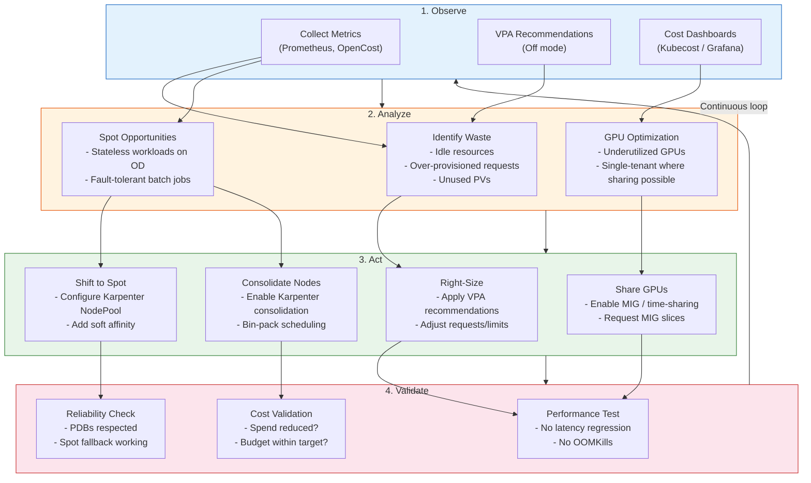

# Cost Optimization

## 1. Overview

Kubernetes cost optimization is the practice of minimizing infrastructure spend while maintaining the performance and reliability guarantees your workloads require. This is not about cutting corners -- it is about eliminating waste. In a typical production Kubernetes cluster, 30-50% of provisioned compute resources are idle. That is not a rounding error; for a company spending $1M/month on cloud compute, that is $300K-$500K/month of pure waste.

The cost structure of a Kubernetes cluster is heavily compute-dominated: **70-80% of costs are compute** (EC2, GCE, Azure VMs), 10-15% is storage (EBS, PD, managed disks), and the remaining 10% is networking and miscellaneous (NAT gateway, cross-AZ traffic, load balancers). This means compute optimization delivers the highest ROI. The three levers for compute cost reduction are: **right-sizing** (matching resource requests to actual usage), **spot/preemptible instances** (using discounted compute with interruption risk), and **node consolidation** (packing workloads efficiently onto fewer nodes).

For GenAI and ML workloads, cost optimization takes on additional dimensions: GPU instances are 10-50x more expensive than CPU instances, making right-sizing and spot usage critical. NVIDIA Multi-Instance GPU (MIG) and GPU time-sharing allow multiple workloads to share a single physical GPU, dramatically improving utilization.

## 2. Why It Matters

- **Compute is the largest line item and the most wasteful.** From the source material: 70-80% of cluster costs are compute. AMD and ARM instances are 30-40% cheaper than Intel equivalents, and Spot instances provide 80-90% savings over on-demand. These are multiplicative savings -- combining architecture choice with purchase strategy can reduce compute costs by 90%.
- **Over-provisioning is the default behavior.** Developers set generous resource requests "just in case." Without feedback loops (VPA recommendations, cost dashboards), over-provisioning compounds as teams add services and never revisit their requests.
- **Under-provisioning causes outages.** The flip side of cost optimization is reliability. Aggressive right-sizing without proper monitoring leads to OOMKills, CPU throttling, and cascading failures. The goal is the sweet spot where resources match actual need.
- **GPU costs dominate AI/ML budgets.** A single `p4d.24xlarge` (8x A100 GPUs) costs $32.77/hour on-demand. A cluster running 10 of these for inference costs $2.4M/year. Even small efficiency gains (30% GPU utilization improvement) save hundreds of thousands of dollars.
- **FinOps is an organizational capability.** Cost optimization is not a one-time project -- it is a continuous practice that requires tooling (cost dashboards, anomaly detection), process (regular review cadences), and culture (teams accountable for their spend).

## 3. Core Concepts

- **Resource Requests and Limits:** Requests are the guaranteed minimum resources a container gets (used for scheduling). Limits are the maximum (enforced by cgroups). The gap between request and actual usage is waste. The gap between actual usage and limit is the burst headroom.
- **Right-Sizing:** Adjusting resource requests and limits to match actual usage. The primary tool is the Vertical Pod Autoscaler (VPA) in recommendation mode (`Off` or `Initial`), which observes actual CPU and memory consumption and suggests optimal request values.
- **VPA (Vertical Pod Autoscaler):** Operates in four modes: `Off` (recommendations only -- the safest mode for production), `Initial` (sets requests at Pod creation but does not update running Pods), `Auto` (evicts and recreates Pods with updated requests), `Recreate` (same as Auto). In practice, most teams use `Off` mode to generate recommendations that humans review before applying.
- **Spot Instances (Preemptible/Spot VMs):** Cloud provider excess capacity sold at 60-90% discount with 2-minute interruption notice (AWS Spot), 30-second notice (GCE Preemptible), or 30-second notice (Azure Spot). Suitable for stateless, fault-tolerant workloads. From the source material: Spot instances provide 80-90% savings over on-demand.
- **Affinity Rules for Cost Optimization:** From the source material: Hard affinity forces a Pod onto a specific node group. Soft affinity (preferred) tries Spot nodes first but falls back to on-demand if Spot capacity is unavailable. This ensures availability while maximizing Spot usage.
- **Node Consolidation:** The practice of packing workloads onto fewer nodes and terminating empty or underutilized ones. Karpenter's consolidation policy automatically identifies nodes that can be removed by moving their Pods elsewhere.
- **Bin Packing:** Scheduling Pods to minimize the number of nodes needed. The `MostAllocated` scoring strategy in kube-scheduler (or Karpenter's bin-packing behavior) prefers nodes with the most resources already allocated, leading to dense packing and empty nodes that can be removed.
- **GPU Time-Sharing:** NVIDIA's mechanism for multiple containers to share a single GPU by time-slicing the GPU's compute cycles. Each container gets a fraction of GPU time. Suitable for inference workloads with bursty GPU utilization.
- **MIG (Multi-Instance GPU):** NVIDIA's hardware-level GPU partitioning (available on A100 and H100 GPUs). A single A100 can be split into up to 7 isolated GPU instances, each with its own memory, cache, and compute resources. Unlike time-sharing, MIG provides hard isolation -- no noisy-neighbor effects.
- **FinOps:** The practice of bringing financial accountability to cloud spending. In Kubernetes, this means attributing costs to teams/namespaces (via labels), setting budgets, alerting on anomalies, and conducting regular cost review cadences.

## 4. How It Works

### Right-Sizing with VPA Recommendations

**Step 1: Deploy VPA in recommendation mode:**

```yaml
apiVersion: autoscaling.k8s.io/v1
kind: VerticalPodAutoscaler
metadata:
  name: my-app-vpa
  namespace: production
spec:
  targetRef:
    apiVersion: apps/v1
    kind: Deployment
    name: my-app
  updatePolicy:
    updateMode: "Off"  # Recommendation only -- does not modify Pods
  resourcePolicy:
    containerPolicies:
    - containerName: app
      minAllowed:
        cpu: 50m
        memory: 64Mi
      maxAllowed:
        cpu: 4
        memory: 8Gi
```

**Step 2: Review recommendations after 24-48 hours of data collection:**

```bash
kubectl get vpa my-app-vpa -o jsonpath='{.status.recommendation}' | jq .
```

Output example:
```json
{
  "containerRecommendations": [{
    "containerName": "app",
    "lowerBound":    {"cpu": "25m",  "memory": "64Mi"},
    "target":        {"cpu": "100m", "memory": "256Mi"},
    "uncappedTarget":{"cpu": "100m", "memory": "256Mi"},
    "upperBound":    {"cpu": "500m", "memory": "1Gi"}
  }]
}
```

**Step 3: Apply recommendations.** Set requests to the `target` value. Set limits based on your QoS strategy:
- **Guaranteed QoS (requests == limits):** Set both to `upperBound`. Safest for critical workloads.
- **Burstable QoS (requests < limits):** Set requests to `target`, limits to `upperBound`. Good balance.
- **No limits (BestEffort risk):** Never do this in production.

### Spot Instance Architecture with Karpenter

**Karpenter NodePool with Spot and fallback:**

```yaml
apiVersion: karpenter.sh/v1
kind: NodePool
metadata:
  name: general-workloads
spec:
  template:
    spec:
      requirements:
      - key: karpenter.sh/capacity-type
        operator: In
        values: ["spot", "on-demand"]  # Prefer spot, fallback to OD
      - key: kubernetes.io/arch
        operator: In
        values: ["amd64", "arm64"]  # ARM is 30-40% cheaper
      - key: node.kubernetes.io/instance-type
        operator: In
        values:  # Diversify instance types for Spot availability
        - m6g.xlarge   # ARM Graviton
        - m6i.xlarge   # Intel
        - m5.xlarge     # Intel (previous gen, more Spot availability)
        - m5a.xlarge    # AMD (30-40% cheaper)
        - c6g.xlarge    # ARM compute-optimized
        - r6g.xlarge    # ARM memory-optimized
      nodeClassRef:
        group: karpenter.k8s.aws/v1
        kind: EC2NodeClass
        name: default
  disruption:
    consolidationPolicy: WhenEmptyOrUnderutilized
    consolidateAfter: 60s
  limits:
    cpu: "1000"
    memory: 2000Gi
```

**Workload Deployment with Spot preference (soft affinity):**

```yaml
apiVersion: apps/v1
kind: Deployment
metadata:
  name: web-api
spec:
  replicas: 10
  template:
    spec:
      affinity:
        nodeAffinity:
          preferredDuringSchedulingIgnoredDuringExecution:
          - weight: 80
            preference:
              matchExpressions:
              - key: karpenter.sh/capacity-type
                operator: In
                values: ["spot"]
          - weight: 20
            preference:
              matchExpressions:
              - key: karpenter.sh/capacity-type
                operator: In
                values: ["on-demand"]
      topologySpreadConstraints:
      - maxSkew: 1
        topologyKey: topology.kubernetes.io/zone
        whenUnsatisfiable: DoNotSchedule
        labelSelector:
          matchLabels:
            app: web-api
      containers:
      - name: app
        resources:
          requests:
            cpu: 250m
            memory: 512Mi
          limits:
            cpu: 500m
            memory: 1Gi
```

### Spot Interruption Handling

When AWS reclaims a Spot instance (2-minute warning):

1. **AWS Node Termination Handler (NTH)** or **Karpenter's built-in handler** receives the interruption event.
2. The node is cordoned (no new Pods scheduled).
3. Pods are drained with graceful shutdown (respecting terminationGracePeriodSeconds).
4. Controllers (Deployments, StatefulSets) create replacement Pods.
5. Karpenter provisions a new node (potentially Spot if available, or on-demand as fallback).

**Key configuration:** Set `terminationGracePeriodSeconds` to less than 120 seconds for Spot workloads (the interruption warning is 2 minutes). If your graceful shutdown takes longer, you risk ungraceful termination.

### Node Consolidation with Karpenter

Karpenter's consolidation works by continuously evaluating whether Pods on a node can be rescheduled onto other existing nodes:

1. **Identify underutilized nodes:** Nodes where the sum of Pod requests is significantly less than node capacity.
2. **Simulate rescheduling:** Can all Pods on this node fit on other nodes (considering affinity, topology spread, taints)?
3. **If yes:** Cordon the node, drain Pods (respecting PDBs), terminate the node.
4. **If replacement is cheaper:** Karpenter can also replace a node with a smaller/cheaper instance type.

**Consolidation policies:**
- `WhenEmpty`: Only remove nodes with zero non-DaemonSet Pods. Conservative; good starting point.
- `WhenEmptyOrUnderutilized`: Also consolidates underutilized nodes. More aggressive; higher savings.

### GPU Cost Optimization for GenAI Workloads

**GPU time-sharing configuration (GKE):**

```yaml
apiVersion: v1
kind: Node
metadata:
  labels:
    cloud.google.com/gke-gpu-sharing-strategy: time-sharing
    cloud.google.com/gke-max-shared-clients-per-gpu: "4"
```

With time-sharing, 4 inference containers can share one T4 GPU. Each gets 25% of GPU time on average. Cost: 1 GPU instead of 4. Tradeoff: latency increases under contention.

**NVIDIA MIG partitioning (A100):**

A single A100 (40 GB) can be partitioned into:

| MIG Profile | GPU Memory | Compute (SMs) | Use Case |
|---|---|---|---|
| `1g.5gb` | 5 GB | 1/7 of SMs | Small inference models |
| `2g.10gb` | 10 GB | 2/7 of SMs | Medium inference, fine-tuning |
| `3g.20gb` | 20 GB | 3/7 of SMs | Large inference models |
| `4g.20gb` | 20 GB | 4/7 of SMs | Large inference with more compute |
| `7g.40gb` | 40 GB | 7/7 of SMs (full GPU) | Training, large model inference |

**Requesting a MIG slice in a Pod:**

```yaml
containers:
- name: inference
  resources:
    limits:
      nvidia.com/mig-1g.5gb: 1  # Request one 1g.5gb MIG slice
```

**GPU Spot instances for inference:**

GPU Spot instances (p3, g4dn, g5 on AWS) offer 60-70% savings. For inference workloads:
- Deploy multiple replicas across Spot and on-demand.
- Use soft affinity for Spot preference with on-demand fallback.
- Set `terminationGracePeriodSeconds` to allow in-flight inference requests to complete.
- Use model caching (load model from S3/EFS into memory) to minimize cold start time on new instances.

### FinOps in Practice

**Cost attribution with labels:**

```yaml
metadata:
  labels:
    team: platform
    service: api-gateway
    environment: production
    cost-center: eng-platform-2024
```

**OpenCost / Kubecost integration:**

OpenCost (CNCF sandbox project) integrates with Prometheus to attribute costs to namespaces, labels, and individual workloads. From the source material: tools like OpenCost translate CPU and memory usage into actual currency, allowing teams to baseline their Requests against actual spend.

**Cost review cadence:**
1. **Daily:** Automated anomaly alerts (spend > 120% of baseline).
2. **Weekly:** Team-level cost dashboards reviewed in standup.
3. **Monthly:** Platform team reviews cluster-wide efficiency (requests vs. actual usage).
4. **Quarterly:** Right-sizing sprint: apply VPA recommendations, adjust node pools, review Spot vs. OD ratio.

## 5. Architecture / Flow



## 6. Types / Variants

### Cost Optimization Strategies by Impact

| Strategy | Savings Potential | Implementation Effort | Risk | Time to Value |
|---|---|---|---|---|
| **Right-sizing (VPA Off mode)** | 20-40% of compute | Low | Low (recommendations only) | 1-2 weeks |
| **Spot instances** | 60-90% on Spot nodes | Medium | Medium (interruptions) | 1-2 weeks |
| **ARM/Graviton instances** | 30-40% vs. Intel | Medium (multi-arch builds) | Low (once images build) | 2-4 weeks |
| **Node consolidation** | 10-30% of compute | Low (Karpenter config) | Low | Days |
| **GPU MIG partitioning** | 2-7x GPU utilization | High (MIG setup, NVIDIA drivers) | Medium (noisy neighbor risk) | 2-4 weeks |
| **GPU time-sharing** | 2-4x GPU utilization | Medium (GKE native) | Medium (latency under contention) | 1 week |
| **Reserved Instances / Savings Plans** | 30-60% vs. on-demand | Low (commitment) | Low (commitment lock-in) | Immediate |
| **Idle resource cleanup** | Variable (5-15%) | Low | Low | Days |

### Spot Instance Suitability Matrix

| Workload Type | Spot Suitable? | Rationale | Configuration |
|---|---|---|---|
| **Stateless web APIs** | Yes | Multiple replicas, fast restart | Soft affinity Spot + topology spread |
| **Batch processing / Jobs** | Yes (ideal) | Tolerant of interruption, checkpointable | Hard affinity Spot, retry on failure |
| **CI/CD runners** | Yes (ideal) | Ephemeral, no state | Hard affinity Spot |
| **ML training (checkpointed)** | Yes | Checkpoint to S3/EFS, resume on new node | Spot with checkpoint save on SIGTERM |
| **ML inference** | Yes (with caveats) | Multiple replicas, model cached | Soft affinity Spot, OD fallback |
| **Databases (StatefulSets)** | No | State loss on interruption | On-demand only, or Reserved |
| **Kafka brokers** | No | Rebalancing overhead, data loss risk | On-demand only |
| **Single-replica services** | No | No redundancy during interruption | On-demand |

### Purchase Strategy Comparison

| Strategy | Discount | Commitment | Flexibility | Best For |
|---|---|---|---|---|
| **On-Demand** | 0% (baseline) | None | Full | Unpredictable workloads, peak capacity |
| **Spot** | 60-90% | None (can be reclaimed) | High (diverse instance types) | Fault-tolerant, stateless workloads |
| **Reserved Instances (1yr)** | 30-40% | 1 year | Low (specific instance type) | Stable baseline workloads |
| **Reserved Instances (3yr)** | 50-60% | 3 years | Very low | Known long-term workloads |
| **Savings Plans (Compute)** | 30-40% | 1-3 years ($/hour) | Medium (any instance family) | Diverse but stable compute usage |
| **Savings Plans (EC2)** | 40-50% | 1-3 years (specific family) | Low | Committed to instance family |

## 7. Use Cases

- **Right-sizing a microservices platform:** A company with 200 microservices discovers via VPA recommendations that the average CPU request is 500m but average usage is 120m. Memory requests average 1Gi but usage averages 350Mi. After applying VPA recommendations (setting requests to p95 of actual usage with 20% buffer), they reduce cluster size from 80 nodes to 45 nodes. Annual savings: $480K.
- **Spot migration for stateless APIs:** A SaaS company runs 500 API server replicas on on-demand `m5.xlarge` instances. They configure Karpenter with Spot preference (soft affinity) across 6 instance types (m5.xlarge, m5a.xlarge, m6i.xlarge, m6g.xlarge, c5.xlarge, c6g.xlarge). Instance diversification ensures Spot availability. Result: 85% of Pods run on Spot nodes, 15% on on-demand fallback. Annual savings: $720K.
- **GPU MIG for inference serving:** A GenAI company runs 20 A100 GPUs for LLM inference. Each model fits in 5 GB of GPU memory, but each GPU has 40 GB. They enable MIG and partition each A100 into seven `1g.5gb` slices. Each slice runs an inference instance. Result: 7x the inference throughput per GPU. They reduce from 20 GPUs to 3 GPUs. Annual savings: over $1M (A100 on-demand is ~$12/hour each).
- **GPU Spot for ML training:** An ML team runs training jobs on `p3.8xlarge` (4x V100) instances. Training jobs checkpoint to S3 every 30 minutes. They switch to Spot instances with Karpenter and configure SIGTERM handlers that save the checkpoint immediately. Interruptions occur 2-3 times per training run (8-hour job), adding 30 minutes of overhead. Cost: $3.50/hour (Spot) vs. $12.24/hour (on-demand). Annual savings: $180K per training pipeline.
- **Node consolidation after business hours:** An e-commerce platform sees 80% traffic during business hours and 20% at night. HPA scales Deployments down at night, but nodes remain provisioned. Enabling Karpenter consolidation (`WhenEmptyOrUnderutilized`) removes underutilized nodes during off-peak hours. The cluster shrinks from 100 nodes during peak to 30 nodes at night. Annual savings: $200K.
- **FinOps cost review catches runaway PVs:** A monthly cost review reveals that `gp3` EBS volumes account for 18% of cluster costs -- double the expected 10-15%. Investigation shows 200 PVCs from deleted namespaces (test environments) that were never cleaned up. Adding a PVC cleanup policy and lifecycle labels reduces storage costs by 40%.

## 8. Tradeoffs

| Decision | Option A | Option B | Guidance |
|---|---|---|---|
| **VPA Auto vs. Off mode** | Auto: automatic right-sizing | Off: recommendations only, human review | Off for production (avoids unexpected Pod restarts); Auto acceptable for non-critical |
| **Spot-heavy vs. balanced** | 80%+ Spot: maximum savings | 50/50 Spot/OD: more stable | 80% Spot for stateless web workloads with 3+ replicas; 50/50 for less tolerant workloads |
| **Aggressive consolidation vs. headroom** | Aggressive: minimum nodes, maximum savings | Headroom: extra capacity for bursts | Aggressive for predictable workloads with HPA; headroom for bursty workloads |
| **MIG vs. time-sharing for GPU** | MIG: hard isolation, no contention | Time-sharing: simpler setup, some contention | MIG for production inference (predictable latency); time-sharing for development and experimentation |
| **Reserved Instances vs. Spot + OD** | RI: predictable discount, no interruptions | Spot + OD: higher discount, interruption risk | RI for stable baseline; Spot + OD for variable workloads. Cover baseline with Savings Plans, variable with Spot. |
| **Optimize requests vs. optimize limits** | Tight requests: better bin-packing | Tight limits: prevent burst-induced contention | Optimize requests for scheduling efficiency; set limits to prevent memory OOM but allow CPU burst |

## 9. Common Pitfalls

- **Right-sizing based on average usage.** Setting requests to average CPU usage means the container is under-provisioned 50% of the time. Use p95 or p99 of actual usage with a 10-20% buffer for requests.
- **Running Spot instances without diversification.** If all Spot capacity is in one instance type and one AZ, a single Spot pool interruption takes down all Spot nodes simultaneously. Diversify across at least 5-6 instance types and 3 AZs.
- **Enabling VPA Auto mode on production workloads.** VPA Auto evicts and recreates Pods to apply new resource values. If PDBs are not configured, this can cause downtime. Use Off mode in production and apply recommendations during maintenance windows.
- **Ignoring CPU throttling.** A container at its CPU limit is throttled, not killed. But throttling causes latency spikes that are invisible in error rate metrics. Monitor `container_cpu_cfs_throttled_seconds_total` in Prometheus to detect throttling.
- **Setting memory limits too close to requests.** Memory is incompressible -- exceeding the limit means OOMKill, not throttling. Always set memory limits with at least 25-50% headroom above the p99 usage to handle spikes.
- **Consolidating without PDBs.** Karpenter consolidation respects PDBs during node drain. Without PDBs, consolidation can evict all replicas of a service simultaneously. Always deploy PDBs before enabling consolidation.
- **Not accounting for DaemonSet overhead.** Every node runs DaemonSet Pods (logging, monitoring, CNI, kube-proxy). If DaemonSets consume 2 GB per node and you have 100 nodes, that is 200 GB of memory committed to infrastructure. Account for this in capacity planning and cost attribution.
- **Optimizing GPU cost without profiling GPU utilization.** Deploying MIG without understanding actual GPU memory and compute usage can lead to slices that are too small (models do not fit) or too large (still wasteful). Profile with `nvidia-smi` and DCGM before partitioning.
- **Treating cost optimization as a one-time project.** Workload profiles change. New services deploy. Instance pricing changes. A right-sizing exercise that is never repeated becomes stale within 3-6 months. Build continuous feedback loops.
- **Not using the HPA + resource request synergy.** From the source material: trigger HPA at approximately 80% of the resource limit. This creates a buffer where the Pod can scale vertically (burst to limit) while HPA spins up a new Pod horizontally. If HPA targets 50% of limit, you are over-provisioning; if 95%, you risk performance degradation before scale-out.

## 10. Real-World Examples

- **Spotify's cluster efficiency program:** Spotify runs thousands of Kubernetes nodes. Their platform team implemented a continuous right-sizing program using VPA recommendations (Off mode) combined with a custom dashboard that shows each team's "request efficiency" (actual usage / requested). Teams with efficiency below 40% are flagged in monthly reviews. This cultural approach -- making cost visible at the team level -- reduced cluster-wide over-provisioning by 35% within 6 months.
- **Cost benchmarks from source material:** Compute: 70-80% of cluster costs. Storage: 10-15%. Network: ~10%. AMD/ARM instances: 30-40% cheaper than Intel. Spot: 80-90% savings. The source recommends using soft affinity rules to prefer Spot instances with on-demand fallback, and triggering HPA at ~80% of resource limits to balance cost and performance.
- **Karpenter consolidation at a fintech:** A fintech company running 200 nodes enabled Karpenter's `WhenEmptyOrUnderutilized` consolidation. Within 24 hours, Karpenter consolidated from 200 nodes to 140 nodes by repacking Pods onto fewer, right-sized instances. It also replaced several oversized `m5.4xlarge` nodes with smaller `m5.xlarge` nodes. Monthly savings: $45K. The consolidation was invisible to application teams -- all PDBs were respected and no downtime occurred.
- **GPU MIG at a GenAI startup:** A startup running LLM inference on 10 A100 GPUs (each running one model instance at 15% GPU utilization) switched to MIG with `3g.20gb` profiles. Each A100 now runs 2 inference instances in isolated MIG partitions. They reduced from 10 GPUs to 5 GPUs with the same throughput. The MIG isolation ensures that one inference instance's latency spike does not affect another.
- **OpenCost adoption at a SaaS company:** A SaaS company deployed OpenCost integrated with Prometheus and Grafana. Within the first month, they discovered: (1) a test namespace consuming 12% of cluster compute that should have been scaled down nightly, (2) a team running `c5.9xlarge` nodes for workloads that needed only `c5.xlarge` (manual node selector, never updated), (3) 50 unattached EBS volumes from deleted StatefulSets. Total waste identified: $28K/month.

## 11. Related Concepts

- [Capacity Planning](./05-capacity-planning.md) -- resource quota design, request/limit ratios, node headroom
- [Cluster Autoscaling and Karpenter](../06-scaling-design/03-cluster-autoscaling-and-karpenter.md) -- Karpenter NodePools, consolidation, Spot integration
- [Kubernetes Architecture](../01-foundations/01-kubernetes-architecture.md) -- resource requests and limits, QoS classes, node allocatable resources
- [Horizontal Pod Autoscaling](../06-scaling-design/01-horizontal-pod-autoscaling.md) -- HPA target utilization and its interaction with cost optimization
- [Troubleshooting Patterns](./03-troubleshooting-patterns.md) -- debugging OOMKill, CPU throttling, Pod pending from resource exhaustion
- [Cluster Upgrades](./01-cluster-upgrades.md) -- Spot instance considerations during rolling upgrades

## 12. Source Traceability

- source/youtube-video-reports/7.md -- Kubernetes cost structure (70-80% compute, 10-15% storage, 10% network), AMD/ARM 30-40% cheaper than Intel, Spot 80-90% savings, affinity rules (hard/soft) for Spot fallback, HPA at 80% of limit, OpenCost for cost visibility, requests vs. limits baselining
- source/youtube-video-reports/1.md -- Spot instances and affinity rules, purchase strategy for cost optimization, load balancing and traffic management context
- NVIDIA MIG documentation -- Multi-Instance GPU partitioning profiles, isolation guarantees
- Karpenter documentation -- NodePool configuration, consolidation policies, Spot instance diversification
- OpenCost/Kubecost documentation -- Cost attribution, Prometheus integration, namespace-level cost reporting
