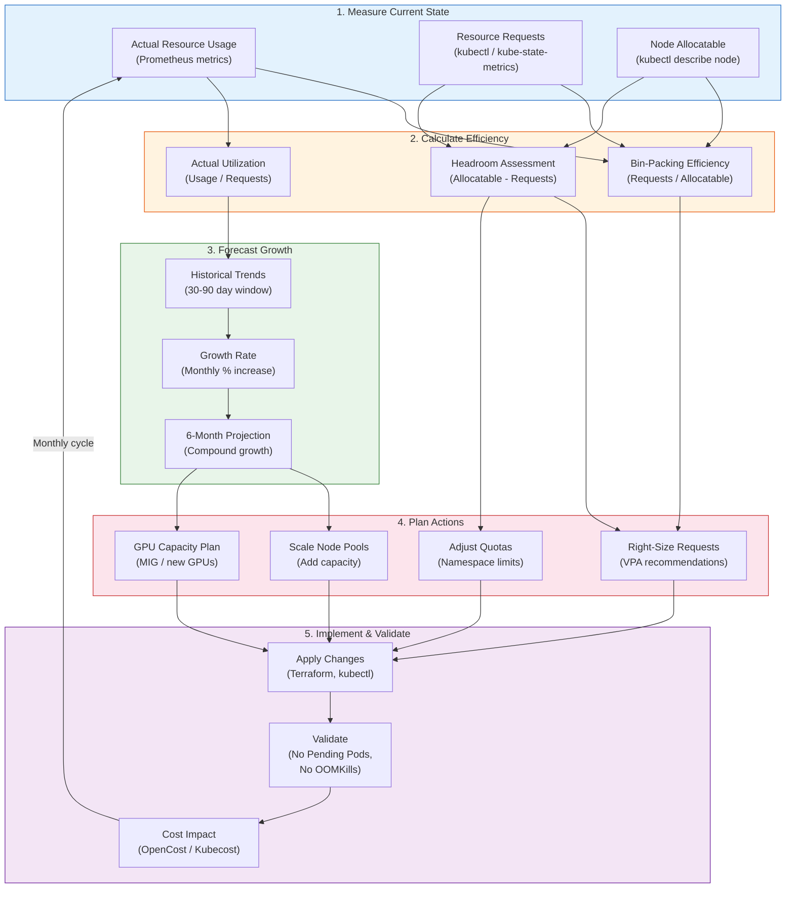

# Capacity Planning

## 1. Overview

Capacity planning for Kubernetes is the practice of ensuring your cluster has enough resources (CPU, memory, storage, GPU, network) to handle current workloads plus anticipated growth, while avoiding the over-provisioning that wastes money. It sits at the intersection of reliability engineering and cost optimization: too little capacity causes outages (Pods Pending, OOMKills, scheduling failures), too much capacity wastes budget.

The fundamental unit of capacity planning in Kubernetes is the **resource request**. Requests determine how the scheduler places Pods and how much capacity each node must reserve. The gap between total node capacity and total Pod requests is your **headroom** -- the buffer that absorbs traffic spikes, DaemonSet overhead, system processes, and the chaos of real-world operations. Getting headroom right (typically 15-20%) is the core art of capacity planning.

For GenAI and ML workloads, capacity planning adds GPU dimensions: GPU memory, GPU compute (SMs/CUDA cores), and the forecasting challenge of predicting inference demand for models that are often deployed experimentally and scaled rapidly when they succeed.

## 2. Why It Matters

- **Scheduling failures are capacity failures.** When a Pod is Pending with "Insufficient cpu" or "Insufficient memory," you have a capacity planning problem. In production, this means new deployments fail, HPA cannot scale out, and incident response is blocked because there is no room for replacement Pods.
- **Node headroom prevents cascading failures.** Without headroom, a single node failure leaves no room for rescheduling. Pods from the failed node compete with existing Pods for the remaining capacity, creating a cascade where multiple services are degraded simultaneously.
- **Resource requests drive scheduling accuracy.** If requests do not reflect actual usage, the scheduler makes suboptimal decisions. Over-requesting wastes capacity. Under-requesting leads to memory pressure and CPU contention at runtime despite the scheduler believing the node has capacity.
- **GPU capacity is scarce and expensive.** Unlike CPU, GPUs cannot be shared by default (fractional GPU is not a native Kubernetes concept). A workload requesting 1 GPU gets an entire GPU even if it uses 10% of it. Capacity planning for GPUs requires understanding MIG, time-sharing, and workload-specific memory requirements.
- **Growth planning prevents midnight emergencies.** Without historical trend analysis, you discover capacity limits at 3 AM when traffic spikes exceed provisioned capacity and the autoscaler hits cloud provider limits (account quotas, AZ capacity).

## 3. Core Concepts

- **Resource Request:** The guaranteed minimum CPU and memory a container needs. The scheduler uses requests for placement decisions. A node is "full" when the sum of Pod requests equals allocatable capacity, even if actual usage is much lower.
- **Resource Limit:** The maximum CPU and memory a container can use. CPU limits cause throttling; memory limits cause OOMKill. Limits are enforced by Linux cgroups at runtime, independent of the scheduler.
- **Allocatable Resources:** The resources on a node available for Pod scheduling. `Allocatable = Capacity - System Reserved - Kube Reserved - Eviction Threshold`. On a 16 GB node, allocatable memory might be 13.5 GB after reserves.
- **QoS Classes:** Determined by how requests and limits are set:
  - **Guaranteed:** requests == limits for all containers. Highest priority; last evicted under pressure.
  - **Burstable:** requests < limits for at least one container. Medium priority.
  - **BestEffort:** no requests or limits. Lowest priority; first evicted.
- **Request-to-Limit Ratio:** The relationship between resource requests and limits. A 1:1 ratio means Guaranteed QoS (no bursting). A 1:2 ratio means the container can burst to 2x its request. Common guidance: 1:1 for critical production workloads, 1:2 for general workloads, with memory limits always being more generous than CPU limits (because memory over-limit = OOMKill, CPU over-limit = throttling only).
- **Node Headroom:** The unallocated capacity on a node reserved for DaemonSets, system processes, burst capacity, and scheduling buffer. Typically 15-20% of total node capacity. Without headroom, the cluster operates at maximum efficiency but zero resilience.
- **ResourceQuota:** A namespace-level policy that limits the total amount of resources (CPU requests, memory limits, object count) that all Pods in the namespace can consume. Quotas prevent any single team or application from exhausting cluster capacity.
- **LimitRange:** A namespace-level policy that sets default, minimum, and maximum resource requests and limits for containers. Ensures that every Pod has resource requests (preventing BestEffort QoS) and that no single container requests an unreasonable amount.
- **Bin-Packing Efficiency:** The ratio of total Pod requests to total node allocatable capacity. 100% bin-packing means every byte of allocatable capacity is claimed by Pod requests. In practice, 70-85% is the target range: high enough to be cost-efficient, low enough to leave headroom.
- **Overcommit Ratio:** When the sum of Pod resource requests exceeds the actual physical resources. Kubernetes supports CPU overcommit (via throttling) but memory overcommit is dangerous (leads to OOMKill). Overcommit ratios above 1.5:1 for CPU and above 1:1 for memory are risky in production.

## 4. How It Works

### Resource Quota Design

**Namespace-level quota example:**

```yaml
apiVersion: v1
kind: ResourceQuota
metadata:
  name: team-alpha-quota
  namespace: team-alpha
spec:
  hard:
    requests.cpu: "100"          # Total CPU requests across all Pods
    requests.memory: 200Gi       # Total memory requests
    limits.cpu: "200"            # Total CPU limits
    limits.memory: 400Gi         # Total memory limits
    pods: "500"                  # Maximum number of Pods
    persistentvolumeclaims: "50" # Maximum PVCs
    requests.nvidia.com/gpu: "4" # Maximum GPU requests
```

**LimitRange to enforce defaults and bounds:**

```yaml
apiVersion: v1
kind: LimitRange
metadata:
  name: default-limits
  namespace: team-alpha
spec:
  limits:
  - type: Container
    default:              # Applied if no limits specified
      cpu: 500m
      memory: 512Mi
    defaultRequest:       # Applied if no requests specified
      cpu: 100m
      memory: 128Mi
    min:
      cpu: 50m
      memory: 64Mi
    max:
      cpu: "8"
      memory: 16Gi
  - type: Pod
    max:
      cpu: "16"
      memory: 32Gi
```

### Request/Limit Ratio Strategy

| QoS Goal | CPU Ratio | Memory Ratio | When to Use |
|---|---|---|---|
| **Guaranteed (1:1)** | requests == limits | requests == limits | Databases, message queues, latency-sensitive APIs. Highest scheduling priority; no burst capacity. |
| **Burstable (1:2)** | requests = X, limits = 2X | requests = X, limits = 1.5-2X | General web services, background workers. Balance between efficiency and safety. |
| **Burstable (1:4)** | requests = X, limits = 4X | NOT RECOMMENDED for memory | Batch jobs, CI runners where burst is expected and transient. Never exceed 1:2 for memory. |
| **No limits (BestEffort)** | No requests or limits set | No requests or limits set | NEVER in production. First to be evicted. Unpredictable scheduling. |

**Why the ratio matters:**
- **CPU** is compressible: exceeding a CPU limit causes throttling (slower execution) but not termination. A 1:4 CPU ratio means the container gets its requested CPU guaranteed and can burst to 4x when the node has spare cycles.
- **Memory** is incompressible: exceeding a memory limit triggers the OOM killer, terminating the container. A memory limit should never be more than 2x the request, and for critical workloads, 1:1 is safest.

### Node Headroom Calculation

**Formula:**
```
Allocatable = Node Capacity - System Reserved - Kube Reserved - Eviction Threshold
Usable for Pods = Allocatable - DaemonSet Requests - Headroom Buffer
```

**Example for a `m5.2xlarge` (8 vCPU, 32 GB RAM):**

| Component | CPU | Memory |
|---|---|---|
| **Node capacity** | 8000m | 32 Gi |
| **System reserved** | 100m | 500 Mi |
| **Kube reserved** | 200m | 500 Mi |
| **Eviction threshold** | 0 | 100 Mi |
| **= Allocatable** | 7700m | 30.9 Gi |
| **DaemonSets** (monitoring, logging, CNI, kube-proxy) | 600m | 1.5 Gi |
| **Headroom buffer (15%)** | 1155m | 4.6 Gi |
| **= Usable for workload Pods** | 5945m | 24.8 Gi |

The 15-20% headroom serves multiple purposes:
- **Scheduling buffer:** Allows new Pods to be scheduled without waiting for autoscaler.
- **Burst capacity:** Burstable Pods can use headroom temporarily.
- **Node failure absorption:** When a node fails, its Pods must fit on remaining nodes.
- **DaemonSet upgrades:** New DaemonSet versions may have different resource requirements.

### GPU Capacity Forecasting

GPU capacity planning differs from CPU/memory:

1. **Profile the model:** Determine GPU memory required for the model weights, activations, and KV cache. A 7B parameter model at FP16 needs ~14 GB GPU memory. A 70B model at FP16 needs ~140 GB (multiple GPUs).
2. **Measure throughput:** Benchmark tokens/second per GPU at target latency (e.g., p99 < 200ms for first token). This gives you the capacity of one GPU.
3. **Project demand:** Estimate requests/second based on product usage data or growth projections.
4. **Calculate GPU count:** `GPUs needed = (peak requests/second) / (throughput per GPU) * (1 + headroom)`
5. **Account for MIG:** If using MIG, each physical GPU provides multiple inference instances. Recalculate based on MIG profile throughput.

**Example:**
- Model: 7B parameter LLM, FP16
- GPU memory: 14 GB (fits on A100 `3g.20gb` MIG slice or full T4)
- Throughput: 50 requests/second per T4 at p99 < 200ms
- Peak demand: 300 requests/second
- Headroom: 20%
- GPUs needed: (300 / 50) * 1.2 = 7.2, round up to 8 T4 GPUs

### Growth Planning from Historical Metrics

**Step 1: Collect metrics over 30-90 days:**
```promql
# Average CPU usage by namespace over 30 days
avg_over_time(
  namespace_cpu:kube_pod_container_resource_requests:sum[30d]
)
```

**Step 2: Calculate growth rate:**
```
Monthly growth rate = (Current month usage - Previous month usage) / Previous month usage
```

**Step 3: Project forward:**
```
Projected capacity (N months) = Current usage * (1 + monthly_growth_rate) ^ N
```

**Step 4: Plan provisioning cadence:**
- If projected capacity exceeds current allocatable within 2 months, initiate node pool expansion.
- If GPU demand is growing >20%/month, secure Reserved Instances or Savings Plans for baseline.
- Review projections monthly; adjust for seasonal patterns (holiday traffic, batch processing cycles).

### Bin-Packing Efficiency Analysis

**Calculating bin-packing efficiency:**

```promql
# Cluster-wide CPU bin-packing efficiency
sum(kube_pod_container_resource_requests{resource="cpu"}) /
sum(kube_node_status_allocatable{resource="cpu"}) * 100
```

| Efficiency Range | Assessment | Action |
|---|---|---|
| **< 50%** | Significantly over-provisioned | Reduce node count, enable consolidation |
| **50-70%** | Moderately over-provisioned | Right-size requests, consider consolidation |
| **70-85%** | Healthy range | Maintain; monitor for growth |
| **85-95%** | Tight; limited headroom | Add headroom; risk of scheduling failures |
| **> 95%** | Critically tight | Add nodes immediately; PDB-safe scale-out |

### Cluster Right-Sizing Cadence

A structured approach to continuously right-sizing the cluster:

**Weekly:**
- Review bin-packing efficiency dashboards.
- Check for Pods in Pending state (capacity signal).
- Review VPA recommendations for top-10 resource consumers.

**Monthly:**
- Apply VPA-recommended right-sizing for workloads with stable usage patterns.
- Review node pool instance types (are there cheaper alternatives?).
- Audit namespace quotas: are any teams consistently hitting quota limits?

**Quarterly:**
- Full capacity forecast: project 6-month growth from historical trends.
- Review Spot vs. on-demand ratio and Reserved Instance coverage.
- Assess GPU capacity: are inference workloads growing? Do we need more MIG slices?
- Review and adjust headroom targets based on actual failure recovery patterns.

## 5. Architecture / Flow



## 6. Types / Variants

### Capacity Planning Strategies

| Strategy | Description | Best For | Limitations |
|---|---|---|---|
| **Reactive** | Add capacity when Pods go Pending or alerts fire | Small clusters, early-stage | Causes incidents; scaling has lead time |
| **Threshold-based** | Alert when utilization exceeds 80%; add capacity proactively | Medium clusters with predictable growth | Does not account for growth trends |
| **Forecast-based** | Use historical trends to project future needs | Large clusters, mature platforms | Requires good historical data; misses sudden changes |
| **Reservation-based** | Pre-purchase Reserved Instances / Savings Plans based on baseline | Stable, long-running workloads | Commitment risk if workloads change |
| **Autoscaler-managed** | Let Cluster Autoscaler / Karpenter handle dynamically | Dynamic workloads, cloud-native | Still needs account quotas, AZ capacity limits |

### Node Sizing Strategies

| Strategy | Node Size | Pods per Node | Tradeoff |
|---|---|---|---|
| **Many small nodes** | 4 CPU / 16 GB | 10-20 Pods | Better fault isolation (fewer Pods per failure domain), higher overhead (DaemonSets per node), more scheduling flexibility |
| **Fewer large nodes** | 16 CPU / 64 GB | 50-80 Pods | Better bin-packing efficiency, lower DaemonSet overhead, larger blast radius per node failure |
| **Mixed (recommended)** | Variety of sizes | Varies | Match node size to workload size; small nodes for small Pods, large nodes for large Pods |

### Resource Quota Models

| Model | Description | Governance | Best For |
|---|---|---|---|
| **Hard quotas** | Strict limits; reject Pods that exceed quota | Centralized (platform team sets quotas) | Multi-tenant clusters, regulated environments |
| **Soft quotas** | Warn but do not enforce; rely on team discipline | Decentralized (teams self-manage) | Trusted teams, small organizations |
| **Hierarchical quotas** | Organization -> Team -> Namespace quotas | Centralized with delegation | Large organizations with cost center allocation |
| **Dynamic quotas** | Quotas adjusted based on historical usage | Automated (custom controller) | Mature platforms with usage data |

## 7. Use Cases

- **Multi-tenant platform quota design:** A platform team supports 20 product teams on a shared cluster. Total cluster capacity: 500 CPU, 1 TB memory. They allocate quotas based on each team's historical usage plus 30% growth buffer. A ResourceQuota per namespace enforces the allocation. LimitRanges ensure every container has requests and limits. Monthly reviews adjust quotas based on actual usage, reclaiming capacity from teams that consistently under-utilize.
- **GPU capacity planning for inference scale-up:** A GenAI team launches a new LLM inference service. Initial demand: 50 requests/second. Profiling shows each T4 GPU handles 25 requests/second at target latency. They provision 3 T4 GPUs (50/25 * 1.2 headroom = 2.4, rounded up). Growth forecast: 40% month-over-month. In 3 months, they will need 8 GPUs. They secure Reserved Instances for 4 GPUs (baseline) and plan to use Spot for the variable portion.
- **Node headroom validation after incident:** A node failure causes 30 Pods to go Pending because the remaining nodes have insufficient headroom. Post-incident review reveals bin-packing was at 92% -- well above the recommended 85% maximum. The team adds a Prometheus alert for bin-packing efficiency > 85% and increases the Karpenter node pool `limits` to provide 20% headroom at all times.
- **Request/limit ratio standardization:** A company discovers that half their teams set CPU limits equal to requests (Guaranteed, expensive) and the other half set no limits at all (BestEffort, dangerous). They establish a company-wide standard: CPU ratio 1:2, memory ratio 1:1.5, enforced via LimitRange defaults. This reduces total CPU requests by 30% (previously Guaranteed Pods now allow bursting) while eliminating BestEffort risk.
- **Seasonal capacity planning:** An e-commerce platform sees 3x traffic during Black Friday week. Historical data shows the pattern is consistent year-over-year. Three months before Black Friday, the team: increases Karpenter node pool limits by 3x, secures Savings Plans for the incremental baseline, configures additional Spot instance types for burst capacity, and runs a load test at 3x expected traffic to validate. The cluster autoscales smoothly during the event.

## 8. Tradeoffs

| Decision | Option A | Option B | Guidance |
|---|---|---|---|
| **Guaranteed (1:1) vs. Burstable (1:2)** | Guaranteed: predictable, no contention | Burstable: better efficiency, allows burst | Guaranteed for databases and latency-critical APIs; Burstable for everything else |
| **Large headroom (25%) vs. small headroom (10%)** | Large: absorbs failures, burst, growth | Small: cost-efficient, higher utilization | 15-20% for production; 10% acceptable if cluster autoscaler responds in < 2 minutes |
| **Hard quotas vs. soft quotas** | Hard: enforced, prevents noisy neighbor | Soft: flexible, requires team discipline | Hard for multi-tenant production; soft for single-team or trusted environments |
| **Few large nodes vs. many small nodes** | Large: better bin-packing, less DaemonSet overhead | Small: better fault isolation, more scheduling options | Large nodes for dense workloads; small nodes for fault-sensitive applications |
| **Over-provision vs. autoscale** | Over-provision: instant capacity, higher cost | Autoscale: efficient, but scaling lag | Over-provision for latency-sensitive workloads where scaling lag is unacceptable; autoscale for cost-sensitive workloads |
| **Static quota allocation vs. dynamic** | Static: simple, predictable | Dynamic: efficient, adapts to changing usage | Static for initial rollout; dynamic once you have 6+ months of usage data |

## 9. Common Pitfalls

- **Not subtracting system overhead from node capacity.** A 32 GB node does not have 32 GB for Pods. System reserved, kube reserved, eviction thresholds, and DaemonSets typically consume 15-25% of node capacity. Capacity plans that ignore this overshoot by that same 15-25%.
- **Setting requests without looking at actual usage.** Developers often copy-paste resource requests from templates or Stack Overflow. Requests should be based on VPA recommendations derived from actual production usage, not guesses.
- **Using the same request/limit ratio for CPU and memory.** CPU is compressible (throttling); memory is not (OOMKill). A 1:4 CPU ratio is often fine; a 1:4 memory ratio will cause OOMKills under load. Always be more conservative with memory limits.
- **Forgetting GPU memory in capacity planning.** A GPU with 16 GB memory assigned to a model that uses 4 GB is 75% wasted. Profile GPU memory usage and consider MIG or time-sharing to improve utilization.
- **Planning based on average usage instead of peak.** Capacity must handle peak demand. If average CPU usage is 40% but peak is 90%, planning for 40% means 50% of the time you are under-capacity. Plan for p95 peak with headroom.
- **Not accounting for cluster autoscaler lag.** When the cluster autoscaler provisions a new node, it takes 2-5 minutes (cloud provider API -> instance launch -> kubelet registration -> Pod scheduling). During this time, Pods are Pending. Plan headroom to absorb this lag.
- **Setting namespace quotas too tight.** Quotas that perfectly match current usage leave no room for growth, new deployments, or incident response (scaling up replicas). Set quotas with 20-30% growth buffer and review quarterly.
- **Ignoring inter-AZ data transfer costs.** Cross-AZ traffic in AWS costs $0.01/GB in each direction. A cluster spread across 3 AZs with chatty microservices can accumulate significant cross-AZ data transfer costs. Use topology-aware routing (service topology, topology spread constraints) to minimize cross-AZ traffic.
- **Not testing capacity at scale.** Capacity plans are theoretical until validated. Run load tests that simulate projected peak traffic and verify that the cluster handles it without Pending Pods, OOMKills, or latency degradation.

## 10. Real-World Examples

- **Google's cluster sizing guidance:** Google's GKE documentation recommends that node pools be sized so that the largest Pod can fit on any node with at least 10% headroom. For a Pod requesting 4 CPU and 8 GB, the minimum node should have at least 5 CPU and 9 GB allocatable. Google also recommends at least 3 nodes per zone for HA, with node auto-provisioning enabled to handle unexpected workload sizes.
- **Cost benchmarks from source material:** Compute is 70-80% of cluster costs. Requests vs. limits are the primary levers. The source material recommends triggering HPA at approximately 80% of the resource limit, creating a bandwidth buffer for vertical burst while horizontal scaling activates. This request/limit/HPA alignment is the foundation of capacity planning that balances cost and performance.
- **Airbnb's quota system:** Airbnb runs a multi-tenant Kubernetes platform where each team gets a namespace with resource quotas proportional to their allocation from the capacity planning process. They use a hierarchical model: organization-level budget -> team-level allocation -> namespace-level quota. Teams can request quota increases through a self-service portal that checks against total cluster capacity.
- **Datadog's node sizing analysis:** Datadog published findings on optimal node sizes for their Kubernetes clusters. They found that `m5.2xlarge` (8 CPU, 32 GB) provided the best balance of bin-packing efficiency and fault isolation for their workload mix. Smaller nodes (`m5.xlarge`) had too much DaemonSet overhead (30% of capacity). Larger nodes (`m5.4xlarge`) had acceptable overhead but larger blast radius per node failure.
- **GPU capacity planning at a search company:** A company running ML inference on GPU clusters tracks three metrics weekly: GPU utilization (target: >70%), GPU memory utilization (target: >60%), and inference latency (target: p99 < 100ms). When GPU utilization drops below 50%, they consolidate models onto fewer GPUs using MIG. When latency approaches the SLO, they scale out. This balanced approach maintains 65% GPU utilization while staying within latency SLOs.
- **bin-packing optimization with Karpenter:** A company running 300 nodes with Cluster Autoscaler at 65% bin-packing efficiency switched to Karpenter. Karpenter's right-sizing (choosing optimal instance types) and consolidation improved bin-packing to 82%. The cluster shrank to 235 nodes. The key insight: Cluster Autoscaler works with node groups (fixed instance types), while Karpenter selects from a pool of instance types per Pod, leading to inherently better bin-packing.

### Capacity Planning Metrics Dashboard

The essential Prometheus queries for a capacity planning dashboard:

**Cluster-level metrics:**

```promql
# Total allocatable CPU across all nodes
sum(kube_node_status_allocatable{resource="cpu"})

# Total requested CPU across all Pods
sum(kube_pod_container_resource_requests{resource="cpu"})

# CPU bin-packing efficiency (%)
sum(kube_pod_container_resource_requests{resource="cpu"}) /
sum(kube_node_status_allocatable{resource="cpu"}) * 100

# Actual CPU utilization vs. requests (request accuracy)
sum(rate(container_cpu_usage_seconds_total[5m])) /
sum(kube_pod_container_resource_requests{resource="cpu"}) * 100

# Memory headroom (bytes available for new Pods)
sum(kube_node_status_allocatable{resource="memory"}) -
sum(kube_pod_container_resource_requests{resource="memory"})
```

**Namespace-level metrics:**

```promql
# Namespace CPU request utilization (how well are requests sized?)
sum by (namespace) (rate(container_cpu_usage_seconds_total{namespace!=""}[5m])) /
sum by (namespace) (kube_pod_container_resource_requests{resource="cpu",namespace!=""}) * 100

# Namespace quota utilization (approaching limits?)
kube_resourcequota{type="used"} / kube_resourcequota{type="hard"} * 100
```

**Alert rules for capacity:**

```yaml
# Alert when cluster-wide CPU requests exceed 85% of allocatable
- alert: ClusterCPUCapacityHigh
  expr: >
    sum(kube_pod_container_resource_requests{resource="cpu"}) /
    sum(kube_node_status_allocatable{resource="cpu"}) > 0.85
  for: 15m
  labels:
    severity: warning
  annotations:
    summary: "Cluster CPU capacity above 85% -- schedule capacity expansion"

# Alert when namespace quota is 90% utilized
- alert: NamespaceQuotaNearLimit
  expr: >
    kube_resourcequota{type="used"} / kube_resourcequota{type="hard"} > 0.90
  for: 10m
  labels:
    severity: warning
  annotations:
    summary: "Namespace {{ $labels.namespace }} approaching resource quota limit"
```

### Instance Type Selection for Capacity Efficiency

Choosing the right instance types affects bin-packing efficiency significantly:

| Instance Family | vCPU:Memory Ratio | Best For | Capacity Planning Note |
|---|---|---|---|
| **m-type (General)** | 1:4 (e.g., 8 CPU / 32 GB) | Mixed workloads, microservices | Good default; balanced ratio matches most web services |
| **c-type (Compute)** | 1:2 (e.g., 8 CPU / 16 GB) | CPU-intensive (encoding, compilation) | Pods waste memory if they need little RAM per CPU core |
| **r-type (Memory)** | 1:8 (e.g., 8 CPU / 64 GB) | Memory-intensive (caches, in-memory DBs) | Pods waste CPU if they need little compute per GB |
| **g-type (GPU)** | Varies (GPU-attached) | ML inference, training | GPU is the limiting resource; CPU/memory ratios are secondary |
| **Graviton/ARM** | Same ratios, 30-40% cheaper | Any workload with ARM-compatible images | Requires multi-arch container builds (buildx) |

**The "tetris problem":** When all Pods request 1 CPU and 2 GB, an 8 CPU / 32 GB node fits exactly 8 Pods (CPU-limited with memory to spare). But if Pods request 1 CPU and 6 GB, the same node fits only 5 Pods (memory-limited with CPU wasted). Choosing instance types whose CPU:memory ratio matches your workload mix minimizes waste. Karpenter automates this by selecting instance types dynamically based on pending Pod requirements.

## 11. Related Concepts

- [Cost Optimization](./04-cost-optimization.md) -- right-sizing, Spot instances, node consolidation, GPU cost optimization
- [Kubernetes Architecture](../01-foundations/01-kubernetes-architecture.md) -- resource units, QoS classes, node allocatable capacity, scalability limits
- [Cluster Autoscaling and Karpenter](../06-scaling-design/03-cluster-autoscaling-and-karpenter.md) -- dynamic capacity management, node provisioning, consolidation
- [Horizontal Pod Autoscaling](../06-scaling-design/01-horizontal-pod-autoscaling.md) -- HPA interaction with capacity headroom
- [Troubleshooting Patterns](./03-troubleshooting-patterns.md) -- debugging Pod Pending (capacity issues), OOMKilled
- [Cluster Upgrades](./01-cluster-upgrades.md) -- surge capacity needed during rolling upgrades

## 12. Source Traceability

- source/youtube-video-reports/7.md -- Kubernetes cost structure (70-80% compute), requests vs. limits for capacity baselining, HPA at 80% of limit for capacity-aware scaling, OpenCost for cost-to-capacity correlation
- source/youtube-video-reports/1.md -- Spot instances and affinity rules for capacity diversification, scaling paradigms (horizontal scaling as the path to massive scale), availability nines framework for capacity SLOs
- Kubernetes official documentation -- ResourceQuota, LimitRange, node allocatable resources, QoS classes
- GKE documentation -- Node auto-provisioning, cluster sizing recommendations
- Karpenter documentation -- Bin-packing behavior, right-sizing instance selection, consolidation mechanics
