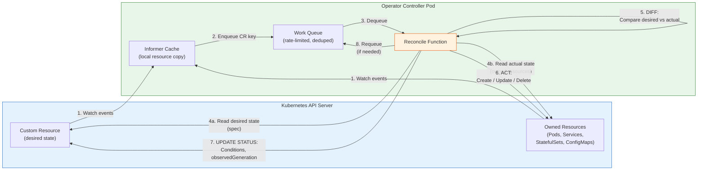

# Operator Pattern

## 1. Overview

The Operator pattern is the mechanism by which Kubernetes is extended to manage complex, stateful applications using the same declarative, reconciliation-driven model that manages built-in resources like Deployments and Services. An operator encodes the operational knowledge of a human expert -- backup schedules, failover procedures, upgrade sequences, capacity tuning -- into software that runs inside the cluster as a controller.

At its core, an operator is a custom controller paired with one or more Custom Resource Definitions (CRDs). The CRD defines the desired state of an application (e.g., "a 3-node PostgreSQL cluster with streaming replication"), and the controller continuously reconciles the actual state of the cluster toward that desired state. This is the same watch-diff-act-update pattern that every built-in Kubernetes controller follows, extended to domain-specific logic.

The operator pattern is the single most important extension mechanism in Kubernetes. It is how the ecosystem manages databases (CloudNativePG, Strimzi), certificates (cert-manager), continuous delivery (ArgoCD), monitoring (Prometheus Operator), and hundreds of other complex workloads without requiring users to write imperative scripts or manually orchestrate Pod lifecycles.

## 2. Why It Matters

- **Encodes operational expertise as code.** Without operators, managing stateful workloads on Kubernetes requires runbooks, manual intervention, and tribal knowledge. An operator codifies backup procedures, failover logic, version upgrades, and capacity management into a controller that executes automatically. The knowledge does not leave with the person who wrote the runbook.
- **Enables declarative management of complex applications.** Users declare "I want a 5-node Kafka cluster with rack-awareness" and the operator handles broker configuration, topic creation, rolling upgrades, and rebalancing. This is the same user experience as native Kubernetes resources.
- **Makes Day 2 operations programmable.** Day 1 (installation) is the easy part. Day 2 -- upgrades, scaling, backup, recovery, performance tuning -- is where operators provide their primary value. A well-built operator handles the entire application lifecycle, not just initial deployment.
- **Reduces cognitive load for platform consumers.** Application teams do not need to understand the internals of PostgreSQL replication or Kafka broker configuration. They interact with a high-level Custom Resource, and the operator manages the details.
- **Follows the Kubernetes API model.** Operators extend the Kubernetes API with new resource types. This means standard tooling (kubectl, GitOps, RBAC, admission controllers) works with operator-managed resources without modification.

## 3. Core Concepts

- **Reconciliation loop:** The fundamental pattern of every operator. The controller watches for changes to its managed resources, computes the difference between desired and actual state, takes corrective action, and updates the status subresource. This loop runs continuously -- it never "finishes." If the controller crashes and restarts, it simply re-observes the current state and converges.
- **Level-triggered vs. edge-triggered design:** Operators are designed to be level-triggered (react to the current state of the world) rather than edge-triggered (react to individual events). A level-triggered controller asks "what is the current state, and does it match the desired state?" every time it reconciles, regardless of what specific event triggered the reconciliation. This makes operators resilient to missed events, controller restarts, and partial failures. If you restart an operator, it does not need to replay a log of events -- it simply looks at the current state and acts.
- **Custom Resource Definition (CRD):** The schema that defines the operator's API. A CRD registers a new resource type (e.g., `PostgresCluster`) with the Kubernetes API server. Users create instances of this type (Custom Resources or CRs) to declare their desired state. The CRD defines the spec (what the user wants), status (what is actually true), and validation rules.
- **Controller-runtime:** The Go library (part of the Kubernetes controller-tools ecosystem) that provides the framework for building operators. It handles watch setup, work queue management, leader election, and the reconcile loop structure. Most Go-based operators are built on controller-runtime (either directly or through higher-level frameworks like Kubebuilder or Operator SDK).
- **Informer and work queue:** The informer watches the API server for changes to relevant resources and places events onto a work queue. The controller processes items from the queue by calling the Reconcile function. The work queue provides rate limiting, deduplication, and retry with exponential backoff.
- **Owner references and garbage collection:** An operator sets owner references on the resources it creates (Pods, Services, ConfigMaps) pointing back to the Custom Resource. When the CR is deleted, Kubernetes garbage collection automatically cleans up all owned resources. This prevents orphaned resources.
- **Finalizers:** A mechanism that allows an operator to perform cleanup logic before a Custom Resource is deleted. When a CR has a finalizer, the API server marks it for deletion but does not remove it until the operator removes the finalizer. This enables operators to clean up external resources (cloud load balancers, DNS records, database users) before the CR is garbage collected.
- **Status subresource:** The status section of a Custom Resource is updated by the controller (not the user) to reflect the observed state. Enabling the status subresource means updates to spec and status go through separate API endpoints, preventing accidental overwrites and enabling finer-grained RBAC.
- **Leader election:** In HA deployments, multiple replicas of an operator run simultaneously, but only one (the leader) actively reconciles. If the leader fails, another replica takes over. Controller-runtime provides built-in leader election using Kubernetes Lease objects.

## 4. How It Works

### The Reconciliation Loop in Detail

Every operator follows the same fundamental loop:

1. **Watch:** The controller registers watches on the primary Custom Resource and any secondary resources it manages (Pods, Services, StatefulSets, ConfigMaps). The informer cache keeps a local copy of these resources, reducing API server load. When a watched resource changes, the informer places the owning CR's key (namespace/name) onto the work queue.

2. **Diff:** The Reconcile function is called with the CR's key. The controller fetches the CR's spec (desired state) and observes the actual state by reading owned resources from the informer cache. It computes the difference -- what exists that should not, what is missing, what has drifted from the desired configuration.

3. **Act:** Based on the diff, the controller takes corrective action: create missing resources, update resources that have drifted, delete resources that should not exist, trigger operational tasks (backups, failovers, upgrades). Each action should be idempotent -- running it twice should produce the same result as running it once.

4. **Update status:** After acting, the controller updates the CR's status subresource to reflect the current observed state. This includes conditions (e.g., `Ready: True`, `Degraded: False`), observed generation (to track whether the controller has processed the latest spec change), and application-specific metrics (replica count, backup timestamp, version).

5. **Requeue or wait:** If the reconciliation completed successfully, the controller waits for the next watch event. If it encountered a transient error or needs to check progress later, it requeues the CR with a delay (e.g., requeue after 30 seconds to check if a Pod has become ready).

### Operator SDK Scaffolds

The Operator SDK provides three scaffolding approaches:

| Scaffold | Language | Best For | Maturity Ceiling |
|---|---|---|---|
| **Go** | Go + controller-runtime | Full-featured operators requiring fine-grained control, complex reconciliation logic, high performance | Level 5 (Auto-Pilot) |
| **Ansible** | Ansible playbooks | Teams with Ansible expertise, operators that primarily configure applications using existing Ansible roles | Level 3 (Full Lifecycle) |
| **Helm** | Helm charts | Simple install/upgrade operators wrapping existing Helm charts, minimal Day 2 logic | Level 2 (Seamless Upgrades) |

The Go scaffold is the most capable and is used by all major production operators. Ansible and Helm scaffolds are lower-barrier entry points that trade capability for simplicity.

### Operator Maturity Model (5 Levels)

The Operator Capability Levels, defined by the Operator Framework, describe increasing sophistication:

| Level | Name | Capabilities | Example |
|---|---|---|---|
| **1** | Basic Install | Automated provisioning via CR, all install configuration in the CR spec, idempotent installation | Helm-based operator that installs a chart |
| **2** | Seamless Upgrades | Patch and minor version upgrades, operator upgrades do not break existing CRs, upgrade rollback support | Operator handles version bumps in CR spec |
| **3** | Full Lifecycle | Backup and restore, application-aware scaling, failure recovery, data migration between versions | CloudNativePG backup to S3, Strimzi rolling restarts |
| **4** | Deep Insights | Prometheus metrics for application health, alerting rules shipped with operator, log aggregation, anomaly detection | Prometheus Operator auto-configures ServiceMonitors |
| **5** | Auto-Pilot | Horizontal and vertical auto-scaling based on metrics, automatic failover, automatic performance tuning, self-healing beyond simple restart | Operator detects slow queries, adjusts PG shared_buffers |

Each level builds on the previous. A Level 5 operator includes all capabilities from Levels 1-4. Most production operators target Level 3 or 4; Level 5 is aspirational for all but the most mature projects.

## 5. Architecture / Flow



### Reconciliation Loop Pseudocode

```
func Reconcile(ctx, request):
    // WATCH: triggered by informer event
    cr = client.Get(request.NamespacedName)
    if cr.NotFound:
        return  // CR deleted, owned resources cleaned up by GC

    // DIFF: compare desired vs actual
    desiredStatefulSet = buildStatefulSet(cr.Spec)
    actualStatefulSet = client.Get(statefulSetName)

    if actualStatefulSet.NotFound:
        // ACT: create missing resource
        client.Create(desiredStatefulSet)
        setOwnerReference(cr, desiredStatefulSet)
    else if actualStatefulSet != desiredStatefulSet:
        // ACT: update drifted resource
        client.Update(desiredStatefulSet)

    // UPDATE STATUS
    cr.Status.ReadyReplicas = countReadyPods()
    cr.Status.Conditions = computeConditions()
    cr.Status.ObservedGeneration = cr.Generation
    client.Status().Update(cr)

    if cr.Status.ReadyReplicas < cr.Spec.Replicas:
        return RequeueAfter(30 * time.Second)
    return nil  // wait for next watch event
```

### Testing Operators

Operator testing requires a layered approach because reconciliation logic interacts with a live API server:

| Test Layer | Tool | What It Tests | Speed |
|---|---|---|---|
| **Unit tests** | Go standard testing | Individual functions: resource builders, diff logic, status computation | Milliseconds |
| **envtest integration** | controller-runtime envtest | Full reconciliation loop against a real API server + etcd (in-process) | Seconds |
| **Kind/k3s e2e tests** | kind, k3s in CI | End-to-end operator behavior in a real cluster: installation, upgrade, failure recovery | Minutes |
| **Chaos testing** | LitmusChaos, Chaos Mesh | Operator resilience: Pod kill during reconciliation, network partition, API server unavailability | Minutes |

**envtest in detail:** The envtest package starts a real kube-apiserver and etcd binary as part of the test process. This enables testing the actual reconciliation loop -- creating CRs, verifying that the controller creates the expected resources, simulating failures, and asserting on status updates. Unlike mocking the Kubernetes client (which tests the test, not the code), envtest exercises the full controller-runtime machinery: informer cache, work queue, rate limiting, and retry behavior.

**Integration test pattern:**

```go
// Example envtest integration test structure
func TestPostgresClusterReconciler(t *testing.T) {
    // Setup: envtest starts API server + etcd
    // Create: submit a PostgresCluster CR
    // Assert: controller creates StatefulSet, Service, Secret
    // Mutate: delete the StatefulSet (simulate failure)
    // Assert: controller recreates the StatefulSet (self-healing)
    // Update: change CR spec (scale replicas)
    // Assert: controller updates StatefulSet replicas
    // Delete: delete the CR
    // Assert: all owned resources are garbage collected
}
```

### Operator Observability

Production operators must expose metrics for operational visibility:

| Metric | Type | Purpose |
|---|---|---|
| `controller_reconcile_total` | Counter | Total reconciliation attempts (by result: success, error, requeue) |
| `controller_reconcile_duration_seconds` | Histogram | Time spent in each reconciliation call |
| `controller_reconcile_errors_total` | Counter | Failed reconciliation attempts |
| `workqueue_depth` | Gauge | Number of items waiting to be reconciled |
| `workqueue_adds_total` | Counter | Total items added to the work queue |
| `workqueue_retries_total` | Counter | Items retried due to errors |
| Custom: `managed_resources_total` | Gauge | Number of CRs the operator is managing |
| Custom: `managed_resource_status` | Gauge | Status of each managed CR (1=healthy, 0=degraded) |

Controller-runtime exposes the first six metrics automatically via the `/metrics` endpoint. Custom metrics specific to your operator's domain should be added to provide application-level observability.

### Operator Deployment Best Practices

| Practice | Description | Why |
|---|---|---|
| **Deploy as a Deployment with 2+ replicas** | Run multiple operator Pods with leader election | High availability; if the leader crashes, a follower takes over in seconds |
| **Use a dedicated namespace** | Run the operator in its own namespace (e.g., `postgres-operator-system`) | Isolate operator RBAC, resource quotas, and network policies from application namespaces |
| **Pin the operator image tag** | Never use `:latest`; use immutable tags or digests | Reproducible deployments; rollback to a known version when issues arise |
| **Set resource requests and limits** | Operators consuming unbounded memory during large reconciliations can OOMKill | Predictable scheduling and resource isolation |
| **Implement graceful shutdown** | Handle SIGTERM: stop accepting new reconciliations, finish in-progress ones, release leader lock | Clean handoff to the new leader during upgrades |

## 6. Types / Variants

### By Implementation Approach

| Approach | Framework | When to Use |
|---|---|---|
| **Kubebuilder** | controller-runtime (Go) | Standard Go operator, most common choice for new operators |
| **Operator SDK (Go)** | controller-runtime + OLM integration | Go operator that will be published to OperatorHub |
| **Operator SDK (Ansible)** | Ansible Runner | Teams with existing Ansible roles, simpler Day 2 logic |
| **Operator SDK (Helm)** | Helm controller | Wrapping an existing Helm chart as an operator |
| **KUDO** | Declarative (YAML plans) | Multi-step operational plans without Go code |
| **Metacontroller** | Webhook-based (any language) | Polyglot teams, operators in Python/Node/Rust |
| **Shell-operator** | Bash/Python hooks | Quick prototypes, simple automation scripts |

### Popular Production Operators

| Operator | Manages | Maturity Level | Key Capabilities |
|---|---|---|---|
| **Prometheus Operator** | Prometheus, Alertmanager, Thanos | Level 4 | ServiceMonitor/PodMonitor CRDs, auto-discovers scrape targets, manages alerting rules, manages Thanos sidecar |
| **Strimzi** | Apache Kafka | Level 4 | Kafka cluster lifecycle, topic management, user management, rolling upgrades with rack awareness, Cruise Control integration |
| **CloudNativePG** | PostgreSQL | Level 4 | Primary/replica topology, automated failover, continuous backup to object storage, point-in-time recovery, connection pooling via PgBouncer |
| **cert-manager** | TLS certificates | Level 3 | Automated certificate issuance (Let's Encrypt, Vault, Venafi), automatic renewal, Certificate and Issuer CRDs |
| **ArgoCD** | GitOps deployments | Level 3 | Application CRD, multi-cluster deployment, sync waves, health checks, SSO integration |
| **Rook-Ceph** | Ceph storage | Level 4 | CephCluster CRD, automated OSD provisioning, pool management, RBD/CephFS/RGW, self-healing storage |
| **Crossplane** | Cloud infrastructure | Level 3 | Provisions cloud resources (RDS, S3, VPCs) via CRDs, composition for platform abstractions |

### When to Build vs. Use an Existing Operator

**Build your own when:**
- No existing operator manages your specific application or internal platform abstraction.
- Existing operators do not support your specific operational requirements (e.g., custom failover logic, compliance-specific backup retention).
- You need tight integration with internal systems (secret stores, identity providers, monitoring platforms).
- The application is internally developed and requires domain-specific reconciliation logic.

**Use an existing operator when:**
- A mature, actively maintained operator exists for your workload (always check OperatorHub.io and ArtifactHub first).
- The operator is backed by a vendor or active open-source community (look for: >50 contributors, regular releases, active issue triage).
- Your requirements align with the operator's capability level -- do not build a Level 3 operator when an existing one already provides Level 4.
- You can extend the operator through configuration rather than forking its code.

### Error Handling and Retry Strategies

How an operator handles errors determines its reliability in production:

| Error Type | Example | Handling Strategy |
|---|---|---|
| **Transient API error** | API server temporarily unavailable, rate limited (429) | Return error from Reconcile; controller-runtime retries with exponential backoff |
| **Resource conflict** | Optimistic concurrency failure (resourceVersion mismatch) | Return error; controller-runtime retries; the informer cache will be updated with the latest version |
| **External dependency unavailable** | Cloud API down, external database unreachable | Return `RequeueAfter(30 * time.Second)`; update status condition to `Degraded` with reason |
| **Permanent error** | Invalid CR spec that passed validation, unsupported configuration | Update status condition to `Error` with descriptive message; do not requeue (human intervention needed) |
| **Partial failure** | 2 of 3 replicas created successfully, third failed | Update status to reflect partial state; return error to requeue; next reconciliation picks up where it left off |

The key principle: **optimistic, idempotent retry.** Assume transient failures are the norm, make every operation idempotent, and let the work queue handle retries. Do not build custom retry loops inside the Reconcile function -- the framework's work queue with exponential backoff is more reliable and better tested.

### Operator Lifecycle Management (OLM)

For operators distributed through OperatorHub, the Operator Lifecycle Manager (OLM) handles:

| OLM Feature | What It Does |
|---|---|
| **ClusterServiceVersion (CSV)** | Declares the operator's metadata, RBAC requirements, owned CRDs, and dependencies |
| **Install plans** | Automated installation and upgrade of operators, including CRD schema migrations |
| **Dependency resolution** | Ensures required operators (dependencies) are installed before the dependent operator |
| **Subscription channels** | alpha, beta, stable -- users subscribe to a channel and receive automatic upgrades |
| **Catalog sources** | Registries of available operators (OperatorHub.io, Red Hat Certified Operators, custom catalogs) |

## 7. Use Cases

- **Database lifecycle management:** CloudNativePG manages PostgreSQL clusters including primary election, streaming replication setup, automated failover when the primary fails, continuous WAL archiving to S3, and point-in-time recovery. A DBA's weekend runbook becomes a CR spec and a controller that executes it at 3 AM without human intervention.
- **Certificate automation:** cert-manager watches Certificate CRs, obtains TLS certificates from issuers (Let's Encrypt, HashiCorp Vault, AWS ACM), stores them as Kubernetes Secrets, and renews them before expiry. Without cert-manager, teams manually create certificates and forget to renew them -- leading to outages.
- **Message broker management:** Strimzi manages Kafka clusters, topics, users, and connector instances. It handles rolling upgrades that respect Kafka's ISR (in-sync replica) requirements, ensuring zero message loss during version upgrades. It configures rack-awareness so replicas are spread across failure domains.
- **GitOps continuous delivery:** ArgoCD's Application CRD defines the desired state of a deployment (Git repository, path, target cluster). The ArgoCD controller continuously reconciles the cluster state with the Git repository, detecting and optionally auto-correcting drift.
- **Infrastructure provisioning:** Crossplane's Managed Resource CRDs (e.g., `RDSInstance`, `S3Bucket`) let platform teams expose cloud infrastructure as Kubernetes-native resources. Application teams create a `Database` CR, and the operator provisions an RDS instance, creates the connection secret, and manages its lifecycle.
- **Monitoring stack management:** The Prometheus Operator manages Prometheus server instances, Alertmanager clusters, and recording/alerting rules. Application teams create ServiceMonitor CRs to define scrape targets, and the operator automatically configures Prometheus to scrape them -- no manual prometheus.yml editing.

### Advanced Operator Patterns

**Multi-cluster operators:** Operators that manage resources across multiple Kubernetes clusters. Examples include ArgoCD (deploys applications to multiple clusters from a hub cluster) and Submariner (connects Pod networks across clusters). Multi-cluster operators face unique challenges: credential management for remote clusters, eventual consistency across cluster boundaries, and handling partial failures where one cluster is unreachable.

**Composite operators:** An operator that orchestrates other operators. For example, a "platform" operator that creates a PostgresCluster CR (managed by CloudNativePG), a KafkaCluster CR (managed by Strimzi), and a Prometheus CR (managed by Prometheus Operator) to provision a complete application stack from a single high-level CR. This pattern is used by Crossplane's Compositions and by internal platform teams.

**Webhook-based operators (Metacontroller):** Instead of running a Go controller with controller-runtime, Metacontroller calls external webhooks (in any language) for reconciliation logic. The operator logic is a simple HTTP server that receives the CR's current state and returns the desired child resources. This enables operator development in Python, Node.js, Rust, or any language with an HTTP server. The tradeoff is less control over watch behavior and work queue tuning.

**Event-driven operators with KEDA:** Operators that scale their reconciliation resources based on the number of CRs or event volume. For operators managing thousands of CRs, KEDA can scale the operator's replica count based on the work queue depth metric, ensuring reconciliation throughput keeps up with demand.

## 8. Tradeoffs

| Decision | Option A | Option B | Guidance |
|---|---|---|---|
| **Go vs. Ansible scaffold** | Go: full control, best performance, access to all controller-runtime features | Ansible: faster for teams with Ansible skills, limited to Ansible's capabilities | Go for production operators that need Level 3+; Ansible for configuration-focused operators |
| **Single CR vs. multiple CRs** | Single CR: simpler API, all config in one place | Multiple CRs: separation of concerns (e.g., Cluster + Backup + User) | Multiple CRs when distinct lifecycle or ownership; single CR for tightly coupled config |
| **Namespace-scoped vs. cluster-scoped** | Namespace: multi-tenant safe, easier RBAC | Cluster: can manage cross-namespace resources | Namespace-scoped by default; cluster-scoped only for infrastructure-level operators |
| **Built-in vs. webhook validation** | CEL in CRD: no external dependency, fast | Webhook: can check external state, cross-resource validation | CEL for schema validation; webhooks for business logic that requires external lookups |
| **Polling vs. watch-based reconciliation** | Polling: simpler, predictable load | Watch: event-driven, lower latency | Always watch-based for primary resources; periodic requeue for external state checks |

### Security Considerations for Operators

Operators run with elevated privileges because they create and manage resources on behalf of users. This makes security critical:

| Security Concern | Risk | Mitigation |
|---|---|---|
| **Overly broad RBAC** | Operator has cluster-admin; compromised operator = compromised cluster | Grant minimum required RBAC: specific verbs on specific resources in specific namespaces |
| **Webhook certificate management** | Expired webhook certificates block all resource creation for the CRD | Use cert-manager to auto-rotate webhook certificates; set short rotation periods |
| **Supply chain attacks** | Malicious operator image pushed to registry | Sign operator images (cosign/sigstore), use image digests, scan with Trivy/Grype |
| **Secret handling** | Operator stores database passwords in ConfigMaps or logs them | Use Kubernetes Secrets with encryption at rest; never log secret values; use external secret stores |
| **Namespace escalation** | Namespace-scoped operator creates resources in other namespaces | Validate that all created resources are in the CR's namespace; add namespace checks in reconciler |

### Operator Development Workflow

A typical operator development workflow for a Go-based operator:

```
1. Define the CRD schema         → api/v1/types.go
2. Generate CRD manifests        → make manifests (controller-gen)
3. Implement reconciler          → controllers/reconciler.go
4. Write unit tests              → controllers/reconciler_test.go
5. Write envtest integration     → controllers/integration_test.go
6. Run locally against cluster   → make run (uses kubeconfig)
7. Build container image         → make docker-build
8. Deploy to dev cluster         → make deploy
9. Run e2e tests                 → make test-e2e (kind cluster)
10. Release to OperatorHub       → make bundle (generate OLM bundle)
```

Each step has a corresponding Makefile target generated by Kubebuilder. The workflow enables rapid iteration: steps 1-6 happen in minutes on a laptop using a kind cluster.

## 9. Common Pitfalls

- **Non-idempotent reconciliation.** If the Reconcile function creates a resource without first checking whether it already exists, it will fail on the second run with an "already exists" error. Every action in the reconcile loop must be idempotent: check-before-create, use server-side apply, or use CreateOrUpdate helpers.
- **Edge-triggered thinking.** Building an operator that reacts to specific events ("a Pod was deleted") rather than computing the full diff between desired and actual state. If the operator misses an event (controller restart, network partition), it never recovers. Always reconcile based on current state, not event history.
- **Ignoring requeue and error handling.** Returning `nil` from Reconcile when an operation failed silently. The controller never retries, and the resource stays in a broken state. Always return an error (triggers requeue with backoff) or an explicit `RequeueAfter` when the reconciliation is not yet complete.
- **Missing owner references.** Creating Pods, Services, or ConfigMaps without setting owner references back to the CR. When the CR is deleted, these resources become orphans that consume cluster resources indefinitely.
- **Unbounded reconciliation scope.** An operator that reconciles hundreds of resources in a single Reconcile call, making it slow and brittle. Break complex reconciliation into sub-reconcilers, each handling a specific concern (e.g., StatefulSet management, Service creation, backup scheduling).
- **No status conditions.** Users have no visibility into what the operator is doing or why it is stuck. Always update status conditions with meaningful messages: `Ready`, `Degraded`, `Progressing`, `Error`, including a human-readable reason and message.
- **Testing only the happy path.** Operators must handle: CR deletion during reconciliation, API server unavailability, resources modified by other controllers, quota exhaustion, and version skew between operator and CRD. Use envtest for integration tests and chaos testing for resilience validation.
- **Tight coupling to specific Kubernetes versions.** Using API features that are alpha or beta without feature-gating, causing the operator to break on clusters that do not have the feature enabled.
- **Overly broad RBAC.** Granting the operator `cluster-admin` because "it needs access to everything." Operators should request the minimum RBAC permissions needed for their specific resources.

### Operator Performance Considerations

As operator adoption grows, performance becomes critical:

| Concern | Symptom | Mitigation |
|---|---|---|
| **API server load from watches** | High API server latency, throttling (429 responses) | Use shared informer caches, reduce watch scope with label selectors, increase cache resync interval |
| **Slow reconciliation** | CRs stuck in "Progressing" state, long time to converge | Profile Reconcile function, break into sub-reconcilers, increase concurrency (MaxConcurrentReconciles) |
| **Memory growth** | Operator Pod OOMKilled as CR count grows | Use paging for list operations, avoid caching entire cluster state, set memory limits with headroom |
| **Conflict storms** | Frequent "conflict" errors in logs, status updates failing | Use server-side apply (SSA) instead of client-side update, reduce status update frequency |
| **Leader election churn** | Operator restarts frequently, causing reconciliation gaps | Increase lease duration, ensure operator has stable resource allocation |

## 10. Real-World Examples

- **CloudNativePG in production at EDB:** EnterpriseDB's CloudNativePG operator manages PostgreSQL on Kubernetes with automated failover that completes in under 10 seconds. When the primary Pod becomes unresponsive, the operator promotes the replica with the least replication lag, reconfigures the remaining replicas to follow the new primary, and updates the Service endpoints -- all without human intervention. Organizations running hundreds of PostgreSQL instances on Kubernetes report that CloudNativePG reduced their DBA on-call incidents by over 60%.
- **Strimzi at large-scale event streaming platforms:** Strimzi manages Kafka clusters with hundreds of brokers. Its reconciliation loop handles rolling restarts that respect ISR constraints, ensuring zero message loss. When a broker Pod is rescheduled to a new node, Strimzi waits for the broker to rejoin the ISR before proceeding to the next broker. Cruise Control integration enables automated partition rebalancing after cluster topology changes.
- **cert-manager adoption:** cert-manager is installed on over 50% of Kubernetes clusters worldwide (based on CNCF survey data). It processes millions of certificate issuance and renewal operations daily. A common production pattern is cert-manager with Let's Encrypt for public-facing TLS and with HashiCorp Vault for internal mTLS certificates, all managed through the same Certificate CRD API.
- **Prometheus Operator as the monitoring standard:** The Prometheus Operator is the de facto standard for monitoring on Kubernetes. The kube-prometheus-stack Helm chart (which deploys the Prometheus Operator, Grafana, and default alerting rules) has over 5,000 GitHub stars and is installed on the majority of production Kubernetes clusters. The ServiceMonitor and PodMonitor CRDs have become the standard interface for declaring scrape targets.
- **Operator testing with envtest:** The controller-runtime envtest package runs a real API server and etcd in-process, allowing integration tests that exercise the full reconciliation loop without a real cluster. Combined with Ginkgo/Gomega test framework, this enables TDD for operator development. Production operator teams typically maintain: unit tests for individual functions, envtest integration tests for reconciliation logic, and end-to-end tests against ephemeral clusters (kind or k3s in CI).

### Operator Ecosystem and Discovery

Finding and evaluating operators before building your own:

| Registry | URL | Contents |
|---|---|---|
| **OperatorHub.io** | operatorhub.io | Community and vendor operators with OLM integration; filterable by capability level |
| **ArtifactHub** | artifacthub.io | Broader CNCF artifact registry including operators, Helm charts, OPA policies |
| **GitHub search** | github.com/topics/kubernetes-operator | Open-source operators; evaluate by stars, recent commits, contributor count |
| **Red Hat Certified** | catalog.redhat.com | Certified operators tested on OpenShift; enterprise support available |

**Evaluation criteria for existing operators:**

| Criterion | Green Flag | Red Flag |
|---|---|---|
| **Active maintenance** | Releases within last 3 months, active issue triage | No release in 6+ months, stale issues |
| **Community size** | >50 contributors, >500 GitHub stars | Single maintainer, <10 stars |
| **Documentation** | Complete API reference, quickstart guide, production runbook | README only, no API docs |
| **Testing** | envtest + e2e tests in CI, chaos testing | No tests, or tests are disabled in CI |
| **Maturity level** | Level 3+ (backup, restore, auto-recovery) | Level 1 only (basic install, no Day 2) |
| **CRD design** | Status subresource, printer columns, CEL validation, multiple versions | No status, no validation, single version |
| **Security** | Minimal RBAC, signed images, security advisories process | cluster-admin RBAC, unsigned images |

## 11. Related Concepts

- [CRD-Driven Design](./03-crd-driven-design.md) -- designing Custom Resource Definitions that operators manage
- [Control Plane Internals](../01-foundations/02-control-plane-internals.md) -- the controller pattern that operators extend
- [Pod Design Patterns](../03-workload-design/01-pod-design-patterns.md) -- Pod-level patterns that operators orchestrate
- [GitOps and Flux/ArgoCD](../08-deployment-design/01-gitops-and-flux-argocd.md) -- GitOps operators as a specific operator category
- [Kubernetes Anti-Patterns](./04-kubernetes-anti-patterns.md) -- anti-patterns that operators can help prevent
- [Sidecar and Ambassador Patterns](./02-sidecar-and-ambassador.md) -- Pod-level patterns complementing operator-level automation

### Imperative vs. Declarative: A Concrete Comparison

Understanding why the operator pattern (declarative) is superior to shell scripts (imperative) for managing complex applications:

**Imperative approach (shell script for PostgreSQL HA):**
```bash
# Create primary
kubectl run pg-primary --image=postgres:16 --port=5432
# Wait for it to be ready
sleep 30
# Create replica - hope the primary is ready
kubectl run pg-replica --image=postgres:16 --env="PGMASTER=pg-primary"
# What if pg-primary crashes?
# What if pg-replica has stale replication credentials?
# What if someone deletes the Service?
# What if a node is drained during a backup?
# Each "what if" requires more script code that gets tested only when the failure occurs.
```

**Declarative approach (operator):**
```yaml
apiVersion: database.example.com/v1
kind: PostgresCluster
spec:
  replicas: 3
  postgresVersion: "16"
  backup:
    schedule: "0 2 * * *"
# The operator handles ALL the "what ifs" automatically through reconciliation.
# Primary crashes? Operator promotes a replica.
# Service deleted? Operator recreates it.
# Node drained during backup? Operator reschedules and retries.
```

## 12. Source Traceability

- source/extracted/acing-system-design/ch03-a-walkthrough-of-system-design-concepts.md -- Kubernetes cluster management, pod architecture, sidecar pattern context
- docs/kubernetes-system-design/01-foundations/01-kubernetes-architecture.md -- Reconciliation loop pattern, controller model, level-triggered vs edge-triggered design
- Operator SDK documentation (sdk.operatorframework.io) -- Operator capability levels, scaffolding approaches, best practices
- Kubernetes official documentation (kubernetes.io/docs/concepts/extend-kubernetes/operator/) -- Operator pattern definition and API conventions
- Kubebuilder book (book.kubebuilder.io) -- Controller-runtime patterns, good practices for operator development
