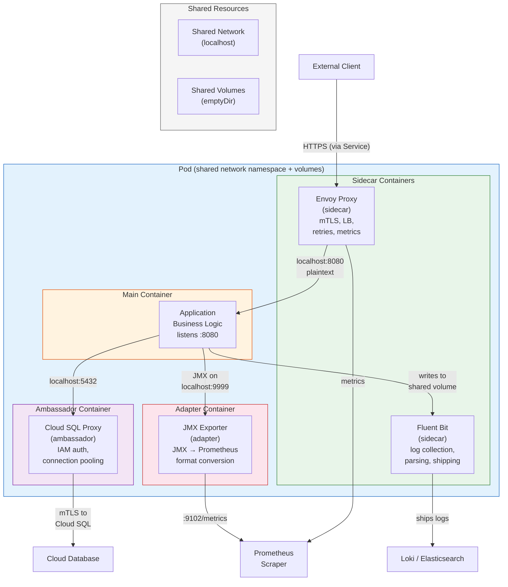

# Sidecar and Ambassador Patterns

## 1. Overview

The sidecar, ambassador, and adapter patterns are the three foundational multi-container Pod patterns in Kubernetes. Each pattern adds a helper container alongside the main application container within the same Pod, exploiting the fact that containers in a Pod share the same network namespace (localhost), storage volumes, and lifecycle. These patterns enable separation of concerns at the container level -- the application container focuses on business logic while helper containers handle cross-cutting infrastructure concerns.

The **sidecar** pattern adds functionality to the main container: a service mesh proxy (Envoy) handles networking, a log collector (Fluent Bit) ships logs, or a config reloader watches for configuration changes. The **ambassador** pattern provides a local proxy that simplifies how the main container accesses external services: connection pooling, protocol translation, or service discovery. The **adapter** pattern normalizes the main container's output to match a standard interface: converting proprietary metrics formats to Prometheus exposition format, or transforming log output to structured JSON.

With Kubernetes 1.28+ introducing native sidecar containers (KEP-753), these patterns gained first-class lifecycle support -- sidecar containers now start before and terminate after the main container, solving long-standing ordering problems that plagued service mesh proxies, log collectors, and any helper that must outlive the application it serves.

## 2. Why It Matters

- **Separation of concerns without code changes.** The application container runs unmodified business logic. Infrastructure concerns (TLS termination, metrics collection, log shipping, circuit breaking) are handled by purpose-built sidecar containers. This means application developers do not need to embed Envoy, Fluent Bit, or OpenTelemetry libraries into every application.
- **Polyglot infrastructure.** When networking, logging, and observability are handled by sidecar containers, every application gets the same infrastructure capabilities regardless of programming language. A Go service and a Python service both get mTLS, distributed tracing, and structured logging through the same Envoy sidecar -- no language-specific SDK required.
- **Independent versioning and updates.** The sidecar container image can be updated independently of the application container. When Envoy releases a security patch, the platform team updates the sidecar image without requiring application teams to rebuild their applications.
- **Standardized platform capabilities.** Platform teams inject sidecars (via mutating admission webhooks or native sidecar injection) to guarantee that every workload gets consistent logging, monitoring, and security capabilities. This is the foundation of service mesh architectures like Istio and Linkerd.
- **Native sidecar support solves lifecycle ordering.** Before Kubernetes 1.28, sidecar containers had no guaranteed startup or shutdown ordering relative to the main container. This caused race conditions where the application started before Envoy was ready (connection failures) or Envoy terminated before the application finished draining (dropped requests). Native sidecar containers solve both problems.

## 3. Core Concepts

- **Sidecar pattern:** A helper container that extends or enhances the main container's functionality. The sidecar runs in the same Pod, sharing the network namespace (can communicate over localhost) and volumes. Common sidecars: service mesh proxy (Envoy/Linkerd-proxy), log collector (Fluent Bit/Fluentd), config reloader (Reloader), TLS termination proxy, secrets injector (Vault Agent).
- **Ambassador pattern:** A proxy container that simplifies the main container's access to external services. The application connects to localhost on a known port, and the ambassador handles service discovery, connection pooling, retries, circuit breaking, and protocol translation to the actual external service. The name comes from the diplomatic metaphor -- the ambassador represents the application to the outside world.
- **Adapter pattern:** A container that transforms the main container's output to match a standard interface expected by external consumers. The adapter reads from a shared volume or localhost endpoint and converts the data to a canonical format. Common adapters: Prometheus exporter (converts proprietary metrics to Prometheus format), log format converter (converts application-specific logs to structured JSON), protocol adapter (converts gRPC to REST).
- **Shared network namespace:** All containers in a Pod share the same IP address and port space. Container A can reach Container B via `localhost:port`. This is what makes sidecar networking zero-latency (no network hop) and enables transparent proxying -- the sidecar intercepts traffic on localhost without the application knowing.
- **Shared volumes:** Containers in a Pod can mount the same volumes (emptyDir, ConfigMap, Secret, PVC). This is how log sidecars read application log files, config reloaders write updated configuration, and adapters access application output.
- **Native sidecar containers (K8s 1.28+):** Init containers with `restartPolicy: Always` that start before regular containers and remain running for the Pod's lifetime. They are restarted automatically if they crash, and they terminate after all regular containers have exited. This is not a new container type -- it reuses the init container spec with a behavioral change triggered by the restartPolicy field.
- **Sidecar injection:** The mechanism by which sidecar containers are added to Pods automatically, typically via mutating admission webhooks. Service meshes (Istio, Linkerd) inject their proxy sidecar into every Pod in a namespace labeled for injection, without requiring application teams to modify their Pod specs.
- **Traffic interception (iptables/eBPF):** Service mesh sidecars use iptables rules or eBPF programs (injected via an init container) to redirect all inbound and outbound Pod traffic through the proxy. This is how Envoy can perform mTLS, load balancing, and observability without the application being aware of the proxy.

## 4. How It Works

### Sidecar Pattern: Service Mesh Proxy (Envoy)

The most common sidecar pattern in production Kubernetes is the service mesh proxy:

1. **Injection:** When a Pod is created in a namespace with the `istio-injection: enabled` label, Istio's mutating admission webhook modifies the Pod spec to add an Envoy sidecar container and an init container that configures iptables rules.
2. **Traffic interception:** The iptables rules redirect all inbound and outbound TCP traffic through Envoy. The application sends traffic to the destination service's ClusterIP, but iptables redirects it to Envoy on localhost.
3. **Proxy processing:** Envoy performs mTLS encryption, load balancing (round-robin, least-connections, or locality-aware), retries, timeouts, circuit breaking, and collects metrics (request count, latency, error rate).
4. **Observability:** Envoy emits metrics in Prometheus format, access logs in structured JSON, and distributed tracing spans (Jaeger/Zipkin). The service mesh control plane (Istiod) aggregates this data for the mesh-wide view.

### Sidecar Pattern: Log Collector (Fluent Bit)

1. The application writes logs to stdout/stderr or to a file in a shared emptyDir volume.
2. The Fluent Bit sidecar reads from the shared volume (or from the container runtime's log path).
3. Fluent Bit parses, filters, enriches (adds Kubernetes metadata: Pod name, namespace, labels), and buffers the logs.
4. Fluent Bit ships the logs to a centralized backend (Elasticsearch, Loki, CloudWatch, S3).

### Sidecar Pattern: Config Reloader

1. A ConfigMap or Secret is mounted as a volume in the Pod.
2. The config reloader sidecar watches the mounted file for changes (using inotify or polling).
3. When the file changes (because the ConfigMap was updated), the reloader sends a signal (SIGHUP) to the main container or calls a reload endpoint (e.g., `localhost:9090/-/reload` for Prometheus).
4. The main container reloads its configuration without restarting, avoiding downtime.

### Ambassador Pattern: Database Proxy

1. The application connects to `localhost:5432` as if it were a local PostgreSQL instance.
2. The ambassador container (e.g., Cloud SQL Auth Proxy, PgBouncer) listens on localhost:5432.
3. The ambassador handles authentication (IAM, mTLS), connection pooling, and routing to the actual database endpoint (which might be a cloud-managed instance with a complex connection string).
4. The application code does not need to know about connection pooling, IAM authentication, or the actual database endpoint -- it just connects to localhost.

### Adapter Pattern: Metrics Transformation

1. The application exposes metrics in a proprietary format (e.g., JMX for Java applications, StatsD, or a custom JSON endpoint).
2. The adapter container (e.g., JMX Exporter, StatsD Exporter) reads the proprietary metrics from the application via localhost.
3. The adapter transforms the metrics into Prometheus exposition format and exposes them on a standard endpoint (e.g., `localhost:9102/metrics`).
4. Prometheus scrapes the adapter's endpoint, and the metrics are now available in the standard format for dashboards and alerting.

### Native Sidecar Container Lifecycle (K8s 1.28+)

The lifecycle ordering with native sidecar containers:

1. **Startup:** Regular init containers run sequentially to completion first. Then native sidecar containers (init containers with `restartPolicy: Always`) start in order and must pass their startup/readiness probes before the next one starts. Finally, regular containers start.
2. **Running:** Native sidecars run alongside regular containers for the Pod's lifetime. If a native sidecar crashes, it is automatically restarted (unlike regular init containers). Readiness probes on sidecars contribute to the Pod's overall readiness.
3. **Shutdown:** When the Pod is terminated, regular containers receive SIGTERM first and are given the grace period to shut down. After all regular containers exit, native sidecar containers receive SIGTERM in reverse order. This ensures the sidecar (e.g., Envoy) remains available while the application is draining connections.

```yaml
apiVersion: v1
kind: Pod
metadata:
  name: app-with-native-sidecar
spec:
  initContainers:
  - name: envoy-sidecar
    image: envoyproxy/envoy:v1.30
    restartPolicy: Always  # This makes it a native sidecar
    ports:
    - containerPort: 15001
    readinessProbe:
      httpGet:
        path: /ready
        port: 15021
  - name: log-collector
    image: fluent/fluent-bit:3.0
    restartPolicy: Always  # Another native sidecar
    volumeMounts:
    - name: logs
      mountPath: /var/log/app
  containers:
  - name: app
    image: my-app:v1.2.3
    ports:
    - containerPort: 8080
    volumeMounts:
    - name: logs
      mountPath: /var/log/app
  volumes:
  - name: logs
    emptyDir: {}
```

## 5. Architecture / Flow



### Lifecycle Ordering with Native Sidecars

```
┌─────────────────── Pod Startup ───────────────────┐
│                                                     │
│  1. Init containers (regular) run sequentially      │
│     ├── iptables-init (configures traffic capture)  │
│     └── completes                                   │
│                                                     │
│  2. Native sidecar containers start (in order)      │
│     ├── envoy-sidecar starts, passes readiness      │
│     └── fluent-bit-sidecar starts, passes readiness │
│                                                     │
│  3. Regular containers start                        │
│     └── app container starts                        │
│                                                     │
├─────────────────── Pod Running ───────────────────  │
│                                                     │
│  Sidecars + app all running                         │
│  If sidecar crashes → auto-restarted                │
│  Sidecar readiness → contributes to Pod readiness   │
│                                                     │
├─────────────────── Pod Shutdown ──────────────────  │
│                                                     │
│  1. Regular containers receive SIGTERM               │
│     └── app drains connections, exits               │
│                                                     │
│  2. Native sidecars receive SIGTERM (reverse order)  │
│     ├── fluent-bit flushes remaining logs, exits    │
│     └── envoy drains connections, exits             │
│                                                     │
└─────────────────────────────────────────────────────┘
```

## 6. Types / Variants

### Sidecar Pattern Variants

| Sidecar Type | Example | Function | Resource Overhead |
|---|---|---|---|
| **Service mesh proxy** | Envoy (Istio), Linkerd-proxy | mTLS, load balancing, retries, observability | 50-100 MB RAM, 50-100m CPU per Pod |
| **Log collector** | Fluent Bit, Vector, Filebeat | Log parsing, enrichment, shipping | 20-50 MB RAM, 10-50m CPU per Pod |
| **Config reloader** | Reloader, configmap-reload | Watches ConfigMap/Secret changes, signals main container | 10-20 MB RAM, minimal CPU |
| **TLS termination** | nginx, HAProxy | Terminates TLS, forwards plaintext to app on localhost | 20-50 MB RAM, depends on traffic |
| **Secrets injector** | Vault Agent, External Secrets sidecar | Fetches secrets from external vault, writes to shared volume | 30-60 MB RAM, minimal CPU |
| **Tracing agent** | Jaeger Agent, OTEL Collector | Receives spans from app via localhost, batches and ships | 30-50 MB RAM, 20-50m CPU |

### Ambassador Pattern Variants

| Ambassador Type | Example | Function |
|---|---|---|
| **Database proxy** | Cloud SQL Auth Proxy, PgBouncer | IAM authentication, connection pooling, failover |
| **Rate limiting proxy** | Local rate limiter (Envoy) | Per-pod rate limiting before traffic leaves the Pod |
| **Protocol bridge** | gRPC-Web proxy, REST-to-gRPC | Translates between protocols so the app speaks one protocol |
| **Service discovery proxy** | Consul Connect sidecar | Resolves service names, handles retries, circuit breaking |

### Adapter Pattern Variants

| Adapter Type | Example | Function |
|---|---|---|
| **Metrics exporter** | JMX Exporter, StatsD Exporter, Redis Exporter | Converts proprietary metrics to Prometheus format |
| **Log format converter** | Fluentd with format plugins | Converts application log formats to structured JSON |
| **Health check adapter** | Custom HTTP-to-TCP health bridge | Exposes HTTP health endpoint for apps that only support TCP health checks |

### Pattern Selection Guide

Choosing between sidecar, ambassador, and adapter depends on the direction of data flow and the relationship between the helper and main container:

| Pattern | Data Flow Direction | Relationship | Decision Criterion |
|---|---|---|---|
| **Sidecar** | Same as main container (extends functionality) | Helper adds capability to the main container | "I need my app to also do X" (logging, mTLS, metrics) |
| **Ambassador** | Outbound (simplifies access to external services) | Helper proxies outbound connections from main container | "I need my app to connect to Y without knowing the complexity" |
| **Adapter** | Outbound (transforms output for external consumers) | Helper normalizes main container's output | "External system Z needs data in a different format" |

### Resource Impact at Scale

Understanding the aggregate resource impact of sidecar patterns is critical for capacity planning:

| Scenario | Pods | Sidecar RAM/Pod | Sidecar CPU/Pod | Total Sidecar RAM | Total Sidecar CPU |
|---|---|---|---|---|---|
| Small cluster, Envoy only | 100 | 128 Mi | 100m | 12.5 Gi | 10 cores |
| Medium cluster, Envoy + Fluent Bit | 500 | 200 Mi | 150m | 97.7 Gi | 75 cores |
| Large cluster, Envoy + Fluent Bit + Vault Agent | 2,000 | 280 Mi | 200m | 547 Gi | 400 cores |
| XL cluster, full sidecar stack | 5,000 | 350 Mi | 250m | 1,709 Gi | 1,250 cores |

These numbers drive the decision between sidecar-per-Pod and sidecarless architectures. For clusters with thousands of Pods, the sidecar overhead often exceeds the resource consumption of the actual applications.

### Sidecarless Architectures (Emerging)

Traditional sidecar-per-Pod service meshes nearly double the container count in a cluster. Emerging alternatives reduce this overhead:

| Approach | Example | How It Works | Tradeoff |
|---|---|---|---|
| **Node-level proxy** | Cilium Service Mesh | eBPF programs in the kernel handle L4/L7 traffic management. No sidecar container per Pod. | Requires eBPF-capable kernel; fewer L7 features than Envoy |
| **Sidecarless service mesh** | Istio Ambient Mesh | Two-layer architecture: ztunnel (per-node L4 proxy) + waypoint proxy (per-service L7 proxy). | Newer, less battle-tested; some features still maturing |
| **Client library** | gRPC with xDS, Dapr SDK | Application includes a library that handles service discovery, retries, mTLS. | Language-specific; harder to enforce across polyglot teams |

## 7. Use Cases

- **Service mesh for microservices:** Istio or Linkerd injects Envoy/Linkerd-proxy sidecars into every Pod in a namespace. All inter-service communication gets mTLS encryption, retry policies, circuit breaking, and distributed tracing without any application code changes. This is the canonical sidecar use case and the foundation of zero-trust networking in Kubernetes.
- **Centralized log collection:** Fluent Bit sidecars in every Pod parse application logs, add Kubernetes metadata (pod name, namespace, node, labels), and ship them to a centralized log backend (Elasticsearch, Loki). The application writes to stdout or a file; the sidecar handles everything else. This is preferred over DaemonSet-based collection when per-application log parsing rules are needed.
- **Cloud database connectivity:** Google Cloud SQL Auth Proxy runs as an ambassador sidecar, handling IAM-based authentication and TLS to Cloud SQL instances. The application connects to `localhost:5432` with a simple password, while the ambassador handles the complexity of Google IAM tokens, certificate rotation, and connection multiplexing.
- **Legacy application monitoring:** A legacy Java application exposes metrics only via JMX. A JMX Exporter adapter sidecar scrapes JMX beans and exposes them in Prometheus format. The monitoring team scrapes the adapter's endpoint and gets the same metrics experience as a cloud-native application with native Prometheus support.
- **Config hot-reload for stateful services:** Prometheus uses a config reloader sidecar that watches the mounted ConfigMap for changes. When an administrator updates a Prometheus alerting rule, the reloader sends an HTTP POST to `localhost:9090/-/reload`, and Prometheus picks up the new rules without restarting -- preserving in-memory TSDB state and active alert state.
- **TLS termination for non-TLS applications:** An nginx sidecar terminates TLS and forwards plaintext HTTP to the application on localhost. Combined with cert-manager for automatic certificate management, this pattern adds TLS to any application without modifying application code.

### Sidecar Injection Mechanisms

| Mechanism | How It Works | Pros | Cons |
|---|---|---|---|
| **Mutating admission webhook** | Webhook intercepts Pod creation and adds sidecar containers to the spec before persistence | Automatic, transparent to users, can be namespace-scoped via labels | Webhook unavailability blocks Pod creation, invisible changes in manifests |
| **Init container + native sidecar** | Sidecar defined in Pod spec as init container with restartPolicy: Always | Explicit in manifests, no webhook dependency, proper lifecycle ordering | Requires K8s 1.28+, must be added to every Pod spec (or templated) |
| **CRD-based injection** | Operator watches Pods and injects sidecars based on CRD configuration | Flexible, declarative configuration, can be complex injection rules | More complex, eventual consistency (brief window without sidecar) |
| **Helm/Kustomize templates** | Sidecar containers added at template rendering time | Explicit, auditable in Git, no runtime mutation | Must be maintained in every template, updates require re-rendering |

### Sidecar Communication Patterns

Understanding how sidecars communicate with the main container is essential for debugging:

| Communication Path | Protocol | Example | Latency |
|---|---|---|---|
| **localhost TCP** | HTTP, gRPC, TCP | App → localhost:15001 (Envoy) | <0.1ms (loopback) |
| **Shared volume** | Filesystem | App writes logs → Fluent Bit reads from shared emptyDir | Depends on inotify/polling interval |
| **Unix domain socket** | UDS | App → /var/run/secrets.sock (Vault Agent) | <0.1ms |
| **Process signal** | SIGHUP, SIGUSR1 | Config reloader → SIGHUP to main process | Instant |
| **Shared process namespace** | /proc filesystem | Debug sidecar reads main container's /proc | N/A (same kernel namespace) |

## 8. Tradeoffs

| Decision | Option A | Option B | Guidance |
|---|---|---|---|
| **Sidecar proxy vs. client library** | Sidecar: language-agnostic, independent updates, guaranteed coverage | Library: lower latency (no extra hop), lower resource overhead | Sidecar for platform-wide guarantees; library for latency-critical, single-language environments |
| **Per-Pod sidecar vs. DaemonSet** | Per-Pod: isolated, per-app configuration, lifecycle tied to Pod | DaemonSet: shared per node, lower total resource usage | Per-Pod for app-specific config (log parsing, proxy rules); DaemonSet for node-level concerns (node metrics, kernel tuning) |
| **Native sidecar vs. regular container** | Native sidecar: guaranteed lifecycle ordering, auto-restart | Regular container: works on K8s <1.28, simpler spec | Native sidecar for K8s 1.29+; regular container with preStop hooks for older clusters |
| **Sidecar injection (webhook) vs. explicit spec** | Injection: automatic, consistent, platform-enforced | Explicit: visible in manifests, no hidden changes | Injection for platform-wide sidecars (mesh proxy); explicit for application-specific sidecars |
| **Envoy sidecar vs. Cilium eBPF** | Envoy: mature, full L7 features, large ecosystem | Cilium: lower overhead, kernel-level, no sidecar | Envoy for L7 features (header-based routing, JWT auth); Cilium for L4 and environments prioritizing lower overhead |

### When NOT to Use Each Pattern

Understanding when a pattern is inappropriate is as important as knowing when to use it:

| Pattern | Do NOT Use When | Better Alternative |
|---|---|---|
| **Sidecar (mesh proxy)** | Application is a batch Job (sidecar prevents Job completion pre-1.28); traffic is exclusively north-south (client to service) with no east-west | Use native sidecars for Jobs on K8s 1.28+; use Ingress-level TLS for north-south only |
| **Sidecar (log collector)** | All applications write structured JSON to stdout and a DaemonSet collector is sufficient | DaemonSet-based Fluent Bit/Vector (lower resource overhead) |
| **Ambassador (db proxy)** | Application already handles connection pooling, retries, and authentication | Direct connection (fewer moving parts, lower latency) |
| **Adapter (metrics)** | Application can be modified to expose Prometheus metrics natively | Native /metrics endpoint (no extra container, no translation lag) |
| **Any multi-container pattern** | The helper logic is tightly coupled to the application and changes in lockstep | Embed the logic in the application container (simpler, fewer failure modes) |

## 9. Common Pitfalls

- **Sidecar startup race conditions (pre-1.28).** The application starts before the Envoy sidecar is ready, causing connection failures for the first few seconds. Before native sidecars, teams used workarounds: sleep in the app's command, postStart hooks that curl Envoy's ready endpoint, or custom init containers that wait for the proxy. With K8s 1.29+ and native sidecars, this is solved by lifecycle ordering.
- **Sidecar not draining during shutdown.** The main container receives SIGTERM and starts draining, but the Envoy sidecar terminates simultaneously, dropping in-flight requests. Fix: use preStop hooks on sidecars (`sleep 5` to outlast the app's drain) or migrate to native sidecar containers that terminate after regular containers.
- **Resource overhead of sidecar-per-Pod.** In a cluster with 1,000 Pods, each with an Envoy sidecar requesting 100m CPU and 128 Mi memory, the sidecars alone consume 100 CPU cores and 128 GB memory. This is a significant cost. Evaluate whether sidecarless alternatives (Cilium, Ambient Mesh) are appropriate for your L7 feature requirements.
- **Sidecar volume mount conflicts.** Two sidecars writing to the same file in a shared emptyDir volume. Use distinct file paths or subdirectories within shared volumes, and ensure only one writer per file.
- **Ambassador masking connection failures.** The ambassador proxy retries failed connections transparently, hiding persistent backend issues from the application. Ensure the ambassador has reasonable retry limits and surfaces errors (via metrics and logs) so operators can detect backend degradation.
- **Adapter adding latency.** A metrics adapter that scrapes the application synchronously on every Prometheus scrape request can add latency to the application if the metrics endpoint is slow. Use caching in the adapter: scrape the application on a timer and serve cached metrics to Prometheus.
- **Ignoring sidecar resource requests.** Not setting resource requests on sidecar containers means the scheduler does not account for them, leading to node over-commitment and OOMKill. Always set resource requests and limits on every container in the Pod, including sidecars.
- **Injecting sidecars into Jobs and CronJobs.** Service mesh sidecar injection into Jobs prevents the Job from completing because the sidecar never exits. Use Pod annotations to disable injection for batch workloads, or use native sidecars (which terminate after the main container).

### Migration Path: Traditional Sidecars to Native Sidecars

For teams running Kubernetes 1.29+ and wanting to migrate from traditional sidecar containers to native sidecars:

| Step | Action | Verification |
|---|---|---|
| **1. Verify cluster version** | Ensure all nodes run K8s 1.29+ (feature GA) | `kubectl get nodes -o wide` |
| **2. Identify sidecar containers** | Audit Pod specs for containers that are logically sidecars | Review Helm charts, Kustomize overlays, and webhook injection configs |
| **3. Move to initContainers** | Move the sidecar container spec from `containers` to `initContainers` | Pod spec update |
| **4. Add restartPolicy: Always** | Set `restartPolicy: Always` on the init container | This is the flag that makes it a native sidecar |
| **5. Remove workarounds** | Remove preStop sleep hacks, postStart wait loops, and custom init containers that waited for proxy readiness | Simplifies Pod spec |
| **6. Test lifecycle ordering** | Verify sidecar starts before app and terminates after app | Watch Pod events: `kubectl get events --field-selector involvedObject.name=my-pod` |
| **7. Update admission webhooks** | If using webhook-based injection (Istio), update the webhook to inject native sidecars instead of regular containers | Coordinate with service mesh upgrade |

## 10. Real-World Examples

- **Istio service mesh at scale (source material: ch03).** As described in the source material, "all service requests and responses are routed through the sidecar. The service and sidecar are on the same host so they can address each other over localhost, and there is no network latency. However, the sidecar does consume system resources." Organizations running Istio at scale (10,000+ Pods) report 5-10% latency overhead per hop from the Envoy sidecar, with total sidecar resource consumption of 10-15% of cluster capacity.
- **Fluent Bit as the CNCF standard log collector.** Fluent Bit processes over 10 billion log events per day across CNCF member organizations. In sidecar mode, it enables per-application log parsing rules -- a Java application gets multiline exception parsing while a Go application gets single-line JSON parsing. The sidecar pattern ensures logs are collected even if the DaemonSet on the node is overloaded.
- **Google Cloud SQL Auth Proxy.** Google recommends running Cloud SQL Auth Proxy as a sidecar in every Pod that needs database access. The proxy handles short-lived OAuth2 token refresh (every 54 minutes), TLS certificate pinning, and connection multiplexing. Applications connect to `localhost:5432` with static credentials, completely unaware of the IAM complexity.
- **Sidecarless service mesh adoption.** Cilium's eBPF-based service mesh and Istio's Ambient Mesh are gaining adoption for organizations where sidecar overhead is prohibitive. Cilium reports 40-60% lower resource consumption compared to sidecar-based meshes for L4 traffic management. However, L7 features (header-based routing, JWT validation) still require a proxy component.
- **Vault Agent sidecar for secret injection.** HashiCorp Vault Agent runs as a sidecar that authenticates to Vault using the Pod's ServiceAccount token, fetches secrets, and writes them to a shared emptyDir volume as files. The application reads secrets from the filesystem, with Vault Agent automatically rotating them when they expire. This pattern avoids storing secrets in Kubernetes Secrets (which are base64-encoded, not encrypted at rest by default).

### Debugging Multi-Container Pods

Debugging multi-container Pods requires targeting the correct container:

```bash
# View logs from a specific container
kubectl logs my-pod -c envoy-sidecar

# Exec into a specific container
kubectl exec -it my-pod -c app -- /bin/sh

# View all container statuses
kubectl get pod my-pod -o jsonpath='{.status.containerStatuses[*].name}'

# Check init container (native sidecar) logs
kubectl logs my-pod -c envoy-sidecar --previous  # previous instance if restarted

# View container resource consumption
kubectl top pod my-pod --containers
```

Common debugging scenarios:

| Symptom | Likely Cause | Debug Command |
|---|---|---|
| App cannot reach external services | Envoy sidecar not ready, iptables rules not configured | `kubectl logs my-pod -c istio-init` (check iptables setup) |
| Logs not appearing in centralized system | Fluent Bit sidecar crashlooping or misconfigured | `kubectl logs my-pod -c fluent-bit` |
| High latency on all requests | Sidecar proxy resource-constrained (CPU throttled) | `kubectl top pod my-pod --containers` |
| Pod stuck in Init | Native sidecar readiness probe failing | `kubectl describe pod my-pod` (check init container events) |

## 11. Related Concepts

- [Pod Design Patterns](../03-workload-design/01-pod-design-patterns.md) -- foundational Pod patterns that sidecar, ambassador, and adapter extend
- [Operator Pattern](./01-operator-pattern.md) -- operators that manage sidecar injection and service mesh lifecycle
- [Control Plane Internals](../01-foundations/02-control-plane-internals.md) -- admission webhooks used for sidecar injection
- [Kubernetes Anti-Patterns](./04-kubernetes-anti-patterns.md) -- anti-patterns involving incorrect sidecar usage
- [GitOps and Flux/ArgoCD](../08-deployment-design/01-gitops-and-flux-argocd.md) -- managing sidecar configuration through GitOps

### Performance Benchmarks: Sidecar vs. Sidecarless

Understanding the measured performance differences helps make informed architecture decisions:

| Metric | Envoy Sidecar (Istio) | Linkerd-proxy Sidecar | Cilium eBPF (No Sidecar) | No Mesh |
|---|---|---|---|---|
| **Added latency (p50)** | 1-3 ms | 0.5-1.5 ms | 0.1-0.5 ms | 0 ms |
| **Added latency (p99)** | 5-15 ms | 2-5 ms | 0.5-2 ms | 0 ms |
| **Memory per Pod** | 50-150 Mi | 20-50 Mi | 0 (kernel-level) | 0 |
| **CPU per Pod** | 50-200m | 20-100m | Shared (per-node) | 0 |
| **L7 features** | Full (headers, JWT, WASM) | HTTP routing, retries | Limited (HTTP only) | None |
| **mTLS** | Yes | Yes | Yes (WireGuard) | No |

These benchmarks are approximate and depend heavily on request size, connection reuse, and workload characteristics. Always benchmark with your actual traffic patterns before making architecture decisions.

## 12. Source Traceability

- source/extracted/acing-system-design/ch03-a-walkthrough-of-system-design-concepts.md -- Service mesh sidecar architecture (Envoy proxy, Istio control plane), sidecarless service mesh discussion, rate limiting sidecar pattern
- source/extracted/acing-system-design/ch09-part-2.md -- Sidecar pattern for rate limiting, sidecar as distributed policy enforcement
- docs/kubernetes-system-design/01-foundations/01-kubernetes-architecture.md -- Pod networking model, shared namespace, DaemonSet pattern
- Kubernetes official documentation (kubernetes.io/docs/concepts/workloads/pods/sidecar-containers/) -- Native sidecar containers KEP-753, restartPolicy: Always
- Istio documentation (istio.io) -- Envoy sidecar injection, traffic interception, Ambient Mesh
