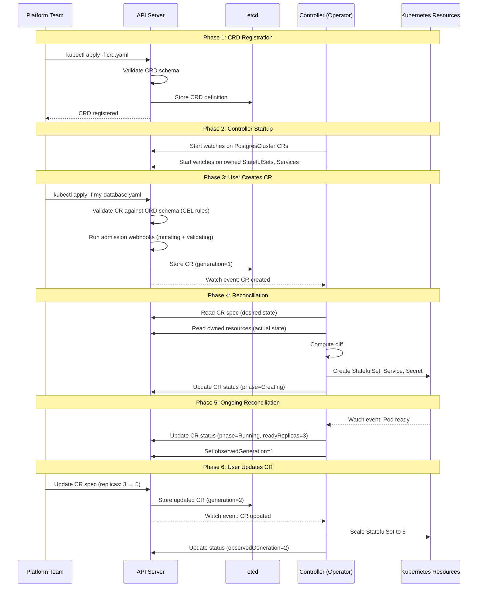

# CRD-Driven Design

## 1. Overview

Custom Resource Definitions (CRDs) are the primary mechanism for extending the Kubernetes API with domain-specific abstractions. A CRD registers a new resource type -- `PostgresCluster`, `Certificate`, `VirtualService`, `Application` -- that users can create, read, update, and delete through the same kubectl commands, RBAC policies, admission controllers, and watch APIs as built-in resources like Deployments and Services.

CRD-driven design is the practice of modeling your platform's domain concepts as Custom Resources with well-defined schemas, versioning strategies, and validation rules, backed by controllers that reconcile desired state to actual state. When done well, CRDs create a self-service platform API where application teams declare what they need ("give me a PostgreSQL database with 100 GB storage and daily backups") and the platform delivers it without tickets, manual provisioning, or tribal knowledge.

The power of CRDs comes from inheriting the entire Kubernetes API machinery: authentication, authorization (RBAC), admission control (validating and mutating webhooks), audit logging, server-side apply, watch-based change notifications, and garbage collection via owner references. A well-designed CRD gets all of this for free. A poorly designed CRD -- one that ignores API conventions, lacks proper versioning, or conflates spec and status -- creates technical debt that is expensive to fix once Custom Resources are deployed in production.

## 2. Why It Matters

- **Turns platform capabilities into self-service APIs.** Instead of filing a ticket to get a database, a development team creates a `Database` CR. Instead of configuring a load balancer through a cloud console, they create an `IngressRoute` CR. CRDs make the platform's capabilities discoverable and programmable through a single, consistent API.
- **Enables GitOps for everything.** Because CRDs are Kubernetes resources, they can be stored in Git and deployed through ArgoCD or Flux. This means infrastructure provisioning (Crossplane), certificate management (cert-manager), monitoring configuration (Prometheus Operator), and application deployment (ArgoCD) all flow through the same GitOps pipeline.
- **Provides a stable contract between platform and application teams.** The CRD schema is the API contract. Application teams know exactly what fields they can set and what values are valid. Platform teams can evolve the implementation behind the CRD without breaking consumers, as long as the API contract is maintained.
- **Leverages Kubernetes' built-in machinery.** RBAC controls who can create which Custom Resources. Admission webhooks enforce organizational policies. Audit logging tracks who changed what and when. Server-side apply enables safe concurrent updates. All of this works with CRDs without additional implementation.
- **Schema evolution is manageable with proper versioning.** CRDs support multiple API versions (v1alpha1, v1beta1, v1) with conversion webhooks, allowing the schema to evolve while maintaining backward compatibility. This is the same versioning model used by core Kubernetes APIs.

## 3. Core Concepts

- **Custom Resource Definition (CRD):** A Kubernetes resource (of kind `CustomResourceDefinition` in the `apiextensions.k8s.io/v1` API group) that defines the schema for a new resource type. The CRD itself is cluster-scoped; the Custom Resources it defines can be either namespace-scoped or cluster-scoped.
- **Custom Resource (CR):** An instance of a CRD. If the CRD defines `PostgresCluster`, then a CR is a specific PostgresCluster (e.g., "my-app-db in the production namespace"). CRs have the same lifecycle as built-in resources: create, read, update, patch, delete, watch.
- **Spec/Status split:** The fundamental contract: the user writes the `spec` (desired state), the controller writes the `status` (observed state). Enabling the status subresource (`/status`) means spec and status are updated through separate API endpoints, preventing a controller's status update from accidentally overwriting a user's spec change (and vice versa).
- **API versioning (v1alpha1 → v1beta1 → v1):** CRDs support multiple served versions simultaneously. The convention follows core Kubernetes API maturity: `v1alpha1` (experimental, may change without notice), `v1beta1` (feature-complete, may have breaking changes), `v1` (stable, backward-compatible changes only). A storage version is designated as the canonical format in etcd.
- **CEL validation expressions:** Common Expression Language (CEL) rules embedded in the CRD schema that validate field values without requiring a webhook. CEL is non-Turing-complete by design, enabling the API server to compute worst-case execution cost at CRD registration time. CEL graduated to GA in Kubernetes 1.29.
- **Conversion webhooks:** When a CRD serves multiple API versions, a conversion webhook translates between versions. A client that creates a `v1alpha1` resource can read it back as `v1beta1` because the webhook converts between the formats. The webhook is called by the API server transparently.
- **Printer columns:** Custom columns displayed by `kubectl get <resource>`. Without printer columns, `kubectl get` shows only name and age. With printer columns, you can display meaningful fields like status, version, replicas, or endpoint directly in the CLI output.
- **Categories and short names:** Categories group related CRDs (e.g., `kubectl get all` includes resources in the "all" category). Short names provide aliases (e.g., `pg` for `PostgresCluster`). Both improve the CLI user experience.
- **Structural schema:** Since Kubernetes 1.15, CRDs require structural schemas (no arbitrary JSON objects). Every field must be typed, and pruning removes unknown fields. This ensures CRs are well-defined and that the API server can validate them efficiently.
- **Server-side apply (SSA):** SSA tracks which controller or user owns which fields of a CR. This enables safe concurrent updates: the operator can update status fields while a user updates spec fields without conflict. SSA is the recommended approach for controllers managing CRs.
- **ObservedGeneration:** A status field pattern where the controller records which generation of the spec it has processed. If `status.observedGeneration < metadata.generation`, the controller has not yet reconciled the latest spec change. This provides a simple progress indicator.

## 4. How It Works

### CRD Registration and Controller Startup

1. **Define the CRD schema:** The platform team creates a CRD manifest that defines the API group, version(s), resource name, scope, schema (OpenAPI v3), validation rules (CEL), printer columns, and status subresource.

2. **Register the CRD:** `kubectl apply -f crd.yaml` submits the CRD to the API server. The API server validates the schema, registers the new resource type, and begins serving the new API endpoint (e.g., `/apis/database.example.com/v1/namespaces/*/postgresclusters`).

3. **Deploy the controller:** The controller (an operator) is deployed as a Deployment in the cluster. On startup, it registers watches on the CRD's Custom Resources and any owned secondary resources (StatefulSets, Services, Secrets).

4. **User creates a CR:** An application team creates a Custom Resource (`kubectl apply -f my-database.yaml`). The API server validates the CR against the CRD schema (including CEL rules), runs admission webhooks, and persists it to etcd.

5. **Controller reconciles:** The controller's informer detects the new CR and enqueues it. The Reconcile function reads the CR's spec, creates the necessary resources (StatefulSet, Service, Secret with credentials), and updates the CR's status with the observed state.

6. **Ongoing reconciliation:** The controller continuously watches for changes to the CR (spec updates) and owned resources (Pod failures, Service changes). It reconciles continuously, maintaining the desired state.

### CRD Schema Example with CEL Validation

```yaml
apiVersion: apiextensions.k8s.io/v1
kind: CustomResourceDefinition
metadata:
  name: postgresclusters.database.example.com
spec:
  group: database.example.com
  names:
    kind: PostgresCluster
    listKind: PostgresClusterList
    plural: postgresclusters
    singular: postgrescluster
    shortNames:
    - pg
    categories:
    - all
    - database
  scope: Namespaced
  versions:
  - name: v1
    served: true
    storage: true
    subresources:
      status: {}
    additionalPrinterColumns:
    - name: Status
      type: string
      jsonPath: .status.phase
    - name: Replicas
      type: integer
      jsonPath: .spec.replicas
    - name: Version
      type: string
      jsonPath: .spec.postgresVersion
    - name: Age
      type: date
      jsonPath: .metadata.creationTimestamp
    schema:
      openAPIV3Schema:
        type: object
        required: [spec]
        properties:
          spec:
            type: object
            required: [replicas, postgresVersion, storage]
            x-kubernetes-validations:
            - rule: "self.replicas >= 1 && self.replicas <= 16"
              message: "replicas must be between 1 and 16"
            - rule: "self.replicas % 2 == 1"
              message: "replicas must be odd for quorum-based replication"
            - rule: "!has(oldSelf) || self.postgresVersion >= oldSelf.postgresVersion"
              message: "PostgreSQL version downgrades are not supported"
            properties:
              replicas:
                type: integer
                minimum: 1
                maximum: 16
              postgresVersion:
                type: string
                enum: ["14", "15", "16", "17"]
              storage:
                type: object
                required: [size]
                properties:
                  size:
                    type: string
                    pattern: "^[0-9]+(Gi|Ti)$"
                  storageClassName:
                    type: string
              backup:
                type: object
                properties:
                  schedule:
                    type: string
                    description: "Cron schedule for backups"
                  retentionDays:
                    type: integer
                    minimum: 1
                    maximum: 365
                    default: 30
                  destination:
                    type: string
                    description: "S3 bucket URI for backup storage"
          status:
            type: object
            properties:
              phase:
                type: string
                enum: ["Creating", "Running", "Degraded", "Failed", "Deleting"]
              readyReplicas:
                type: integer
              observedGeneration:
                type: integer
              primaryEndpoint:
                type: string
              lastBackupTime:
                type: string
                format: date-time
              conditions:
                type: array
                items:
                  type: object
                  properties:
                    type:
                      type: string
                    status:
                      type: string
                      enum: ["True", "False", "Unknown"]
                    reason:
                      type: string
                    message:
                      type: string
                    lastTransitionTime:
                      type: string
                      format: date-time
```

### CEL Validation Capabilities

| CEL Feature | Example | Purpose |
|---|---|---|
| **Field range validation** | `self.replicas >= 1 && self.replicas <= 16` | Enforce business constraints beyond OpenAPI min/max |
| **Cross-field validation** | `self.backup.schedule != '' || !self.backup.enabled` | Ensure consistency between related fields |
| **Transition rules** | `!has(oldSelf) \|\| self.version >= oldSelf.version` | Prevent invalid state transitions (e.g., version downgrades) |
| **String pattern matching** | `self.name.matches('^[a-z][a-z0-9-]*$')` | Enforce naming conventions |
| **List uniqueness** | `self.users.map(u, u.name).unique()` | Ensure unique entries in arrays |
| **Conditional requirements** | `!self.ha || self.replicas >= 3` | Require minimum replicas when HA is enabled |

### Conversion Webhook for Multi-Version CRDs

When evolving a CRD from v1alpha1 to v1, a conversion webhook handles translation:

```
Client sends v1alpha1 CR:
  spec:
    dbVersion: "15"          # v1alpha1 field name
    diskSize: "100Gi"        # v1alpha1 field name

Conversion webhook translates to v1 (storage version):
  spec:
    postgresVersion: "15"    # v1 field name (renamed)
    storage:
      size: "100Gi"          # v1 nested structure (restructured)

Client reads back as v1:
  spec:
    postgresVersion: "15"
    storage:
      size: "100Gi"
```

The conversion webhook is called by the API server whenever a client requests a version different from the storage version. This happens transparently -- clients are unaware of the conversion.

## 5. Architecture / Flow



## 6. Types / Variants

### CRD Scope

| Scope | When to Use | Examples |
|---|---|---|
| **Namespaced** | Per-team or per-application resources, multi-tenant isolation | PostgresCluster, Certificate, Application |
| **Cluster-scoped** | Infrastructure-level resources shared across namespaces | ClusterIssuer, StorageClass-like abstractions, platform policies |

### CRD Versioning Strategies

| Strategy | Approach | When to Use |
|---|---|---|
| **Single version** | Only serve v1, evolve with backward-compatible additions | Stable CRDs where the schema is well-understood |
| **Hub-and-spoke conversion** | All versions convert through a "hub" version (typically the storage version) | CRDs with multiple active versions and complex field mappings |
| **Inline conversion** | Conversion webhook translates directly between any two versions | Simple renames or structural changes between two versions |
| **Version deprecation** | Stop serving old versions after a migration period | Forcing adoption of a new version, removing deprecated fields |

### CRDs vs. Alternative Extension Mechanisms

| Mechanism | When to Use | When NOT to Use |
|---|---|---|
| **CRDs** | Domain-specific resources with controllers, self-service platform APIs, GitOps-managed configuration | Simple configuration (use ConfigMaps), transient data (use annotations), high-throughput data (CRDs are stored in etcd) |
| **ConfigMaps** | Application configuration, feature flags, static data | When you need schema validation, status tracking, or controller reconciliation |
| **Annotations** | Metadata for third-party tools, non-identifying information, configuration hints for controllers | When you need a first-class API, RBAC control, or watch-based change detection on the data itself |
| **Aggregated APIs** | Custom API servers with their own storage backend (not etcd), high-throughput APIs, APIs requiring custom authentication | When CRDs + webhooks are sufficient; aggregated APIs are significantly more complex to operate |
| **Admission webhooks (alone)** | Policy enforcement, mutation, validation without a new resource type | When you need to track state, expose an API, or manage resource lifecycle |

### Controller-Runtime Patterns

| Pattern | Description | When to Use |
|---|---|---|
| **Single controller, single CR** | One controller reconciles one CRD | Simple operators with one resource type |
| **Multi-resource controller** | One controller watches the primary CR and secondary resources (Pods, Services) | Operators that create and manage child resources |
| **Sub-reconciler pattern** | Reconcile function delegates to sub-reconcilers (e.g., StatefulSetReconciler, ServiceReconciler, BackupReconciler) | Complex operators where a single Reconcile function would be >500 lines |
| **Composite controller** | Multiple controllers manage different aspects of the same CR | Very complex CRDs where concerns are truly independent (rare) |
| **Watching external state** | Controller periodically checks external state (cloud API, external database) and updates CR status | CRDs that represent external resources (Crossplane pattern) |

### CRD API Conventions

Following Kubernetes API conventions ensures CRDs feel native to the ecosystem:

| Convention | Description | Example |
|---|---|---|
| **spec/status split** | Users write spec; controllers write status | `spec.replicas: 3` / `status.readyReplicas: 2` |
| **Conditions array** | Standard status reporting via typed conditions with True/False/Unknown | `conditions: [{type: Ready, status: "True", reason: AllReplicasAvailable}]` |
| **ObservedGeneration** | Controller tracks which spec version it has processed | `status.observedGeneration: 5` (matches `metadata.generation: 5` when reconciled) |
| **Finalizers for cleanup** | Controller adds finalizer on create, removes after cleanup on delete | `metadata.finalizers: ["database.example.com/cleanup"]` |
| **Owner references** | Created resources point back to the CR for garbage collection | StatefulSet has ownerReference to PostgresCluster CR |
| **Label selectors** | Use labels and selectors for loose coupling (not hardcoded names) | ServiceMonitor selects Services by label, not by name |
| **Default values** | Use CRD defaulting (x-kubernetes-default) or mutating webhook | `backup.retentionDays` defaults to 30 if not specified |
| **Immutable fields** | Fields that cannot be changed after creation (validated via CEL transition rules) | `storage.storageClassName` cannot change after creation |

### CRD Schema Evolution Best Practices

Evolving a CRD schema in production requires discipline to avoid breaking existing CRs:

| Change Type | Safe in Same Version? | Strategy |
|---|---|---|
| **Add optional field** | Yes | Add with a default value; existing CRs are unaffected |
| **Add required field** | No | New version (v1beta1 → v1) with conversion webhook that populates the field |
| **Remove field** | No | Deprecate (add `deprecated` description), stop reading in controller, remove in next version |
| **Rename field** | No | New version with conversion webhook that maps old name to new name |
| **Change field type** | No | New version with conversion webhook that handles type conversion |
| **Change validation** | Depends | Loosening validation (wider range) is safe; tightening (narrower range) may break existing CRs |
| **Restructure nesting** | No | New version with conversion webhook that flattens/nests fields |

**CI/CD schema diffing:** Use tools like `crd-diff` or custom scripts that compare the OpenAPI schema between the current and proposed CRD version. Fail the CI pipeline if breaking changes are detected without a corresponding version bump and conversion webhook.

## 7. Use Cases

- **Internal platform API (Platform-as-Product).** A platform team defines CRDs for `Application`, `Database`, `Cache`, `MessageQueue`, and `Certificate`. Application teams create CRs to request infrastructure, and operators provision the underlying resources. This is the internal developer platform (IDP) pattern used by organizations like Spotify (Backstage + CRDs) and Mercari.
- **Multi-cloud infrastructure provisioning (Crossplane).** Crossplane defines CRDs for cloud resources (`RDSInstance`, `S3Bucket`, `VPC`). Platform teams compose these into higher-level abstractions (`ProductionDatabase` that includes RDS + security group + parameter group). Application teams create `ProductionDatabase` CRs, and Crossplane provisions the cloud resources.
- **Certificate lifecycle management (cert-manager).** cert-manager defines `Certificate`, `Issuer`, and `ClusterIssuer` CRDs. Users create Certificate CRs specifying the domain name and issuer, and cert-manager obtains, renews, and stores TLS certificates automatically. The CRD schema validates that the domain matches the issuer's allowed domains.
- **Progressive delivery (Argo Rollouts).** Argo Rollouts defines a `Rollout` CRD that replaces Deployment for canary and blue-green deployments. The Rollout spec defines traffic weight steps, analysis templates, and promotion criteria. The controller manages the rollout lifecycle, pausing for manual approval or automated analysis.
- **Policy enforcement (Kyverno, OPA Gatekeeper).** Kyverno defines `ClusterPolicy` and `Policy` CRDs that express admission policies as Kubernetes resources. A policy CR that says "all Pods must have resource limits" is applied via `kubectl apply`, and the Kyverno admission webhook enforces it on every Pod creation.

## 8. Tradeoffs

| Decision | Option A | Option B | Guidance |
|---|---|---|---|
| **CRD vs. ConfigMap** | CRD: schema validation, status, RBAC, watch, GitOps | ConfigMap: simple, no controller needed, no CRD registration | CRD when you need lifecycle management, validation, or status tracking; ConfigMap for static config |
| **CEL validation vs. webhook** | CEL: no external dependency, computed cost limits, fast | Webhook: arbitrary logic, cross-resource validation, external lookups | CEL for all self-contained validation; webhooks for cross-resource or external-state checks |
| **Single version vs. multi-version** | Single: simpler, no conversion webhook needed | Multi: backward compatibility, gradual migration | Start single (v1alpha1); add versions when breaking changes are needed |
| **Namespace-scoped vs. cluster-scoped** | Namespace: multi-tenant safe, standard RBAC | Cluster: cross-namespace resources, infrastructure-level | Namespace-scoped by default; cluster-scoped only for genuinely global resources |
| **Status subresource: enabled vs. disabled** | Enabled: separate spec/status updates, RBAC split | Disabled: simpler, single update endpoint | Always enable status subresource for production CRDs |
| **Storage version: newest vs. oldest** | Newest: latest schema features in storage | Oldest: easier rollback of CRD version changes | Store the most stable version; convert on read for newer clients |

## 9. Common Pitfalls

- **No status subresource.** Without the status subresource, a controller updating the CR's status also overwrites the spec (because they are part of the same resource). If a user updates the spec between the controller's read and write, the user's change is lost. Always enable the status subresource.
- **Breaking changes without version bump.** Renaming a field, changing its type, or removing it in the same version breaks existing CRs. Treat each CRD version as an API contract: additive changes (new optional fields) are fine; breaking changes require a new version with a conversion webhook.
- **Storing high-throughput data in CRDs.** CRDs are stored in etcd, which is optimized for configuration data, not high-throughput writes. If your CRD status is updated multiple times per second per CR, and you have thousands of CRs, you will overload etcd. Use CRDs for declarative configuration; use external storage (Prometheus, databases) for metrics and event data.
- **No CEL validation.** Relying on webhook validation for rules that could be expressed in CEL. CEL validation runs in-process in the API server, is faster, has no external dependency (webhook unavailability does not block API calls), and has computed cost bounds. Use CEL for everything it can express.
- **God CRD with too many fields.** A single CRD with 50+ fields covering every aspect of the application (compute, networking, storage, monitoring, backup, security). This becomes unmanageable and impossible to version. Split into multiple CRDs with clear ownership (e.g., `Cluster`, `Backup`, `User`, `ConnectionPooler`).
- **No printer columns.** Without printer columns, `kubectl get postgresclusters` shows only name and age. Users must `kubectl describe` or `kubectl get -o yaml` every resource to see its state. Add printer columns for the most important status fields: phase, ready replicas, version, endpoint.
- **Ignoring observedGeneration.** Without observedGeneration, users cannot tell whether the controller has processed their latest spec change. A CR that shows `Ready: True` might be reflecting the status of the previous spec version. Always update `status.observedGeneration = metadata.generation` at the end of successful reconciliation.
- **CRD proliferation (too many CRDs).** Every CRD adds load to the API server: schema validation, discovery, OpenAPI spec generation, and watch connections. A cluster with hundreds of CRDs has measurably slower API server response times. Be intentional about CRD creation; consolidate where the lifecycle is shared.
- **Missing finalizers for external resources.** If a CR represents an external resource (cloud database, DNS record, certificate), deleting the CR without a finalizer leaves the external resource orphaned. Always add a finalizer when the controller manages external state, and remove it only after cleanup is complete.

### CRD Performance and Scalability

CRDs stored in etcd have performance characteristics that differ from application databases:

| Dimension | Practical Limit | Impact of Exceeding |
|---|---|---|
| **CR count per CRD** | 10,000-50,000 (depends on CR size) | Slow list operations, high API server memory, etcd latency |
| **CR size** | 1.5 MB max (etcd value size limit) | API server rejects creation; design CRs to be configuration, not data |
| **CRD count per cluster** | <100 recommended | Slow discovery, large OpenAPI spec, IDE/kubectl slowness |
| **Watch connections per CRD** | ~1,000 concurrent | API server memory pressure; use shared informers |
| **Status update frequency** | <1 update/second per CR | etcd write amplification; batch status updates |

**Optimization strategies:**
- Use label selectors on watches to reduce event volume (only watch CRs in relevant namespaces).
- Enable server-side apply to reduce conflict retries.
- Use printer columns instead of requiring `kubectl describe` (reduces API calls).
- Implement pagination for list operations when CR count exceeds 500.
- Use status conditions (array of conditions) instead of frequent full-status rewrites.

### Custom Resource Example: Minimal Production CR

A well-designed CR that follows all conventions:

```yaml
apiVersion: database.example.com/v1
kind: PostgresCluster
metadata:
  name: orders-db
  namespace: production
  labels:
    app.kubernetes.io/name: orders-db
    app.kubernetes.io/part-of: order-service
    app.kubernetes.io/managed-by: postgres-operator
spec:
  replicas: 3
  postgresVersion: "16"
  storage:
    size: 100Gi
    storageClassName: fast-ssd
  backup:
    schedule: "0 2 * * *"
    retentionDays: 30
    destination: s3://backups/orders-db/
status:
  phase: Running
  readyReplicas: 3
  observedGeneration: 5
  primaryEndpoint: orders-db-primary.production.svc.cluster.local:5432
  lastBackupTime: "2026-03-21T02:00:15Z"
  conditions:
  - type: Ready
    status: "True"
    reason: AllReplicasAvailable
    message: "3/3 replicas ready, primary accepting connections"
    lastTransitionTime: "2026-03-20T14:30:00Z"
  - type: BackupReady
    status: "True"
    reason: BackupCompleted
    message: "Last backup completed successfully at 02:00 UTC"
    lastTransitionTime: "2026-03-21T02:00:15Z"
```

## 10. Real-World Examples

- **Crossplane composition pattern.** Crossplane defines low-level CRDs (Managed Resources) for cloud resources and high-level CRDs (Composite Resources) for platform abstractions. A platform team creates a `CompositeResourceDefinition` (XRD) for `ProductionDatabase` that composes an RDS instance, a security group, a subnet group, and a parameter group. Application teams create `ProductionDatabase` CRs without knowing the cloud-specific details. This pattern is used by organizations to provide self-service cloud infrastructure while enforcing compliance guardrails through the Composition's configuration.
- **cert-manager CRD evolution.** cert-manager's Certificate CRD evolved from v1alpha2 to v1beta1 to v1 over several releases, using conversion webhooks to maintain backward compatibility. The v1alpha2-to-v1 migration involved renaming fields (`acme` to `issuerRef`), restructuring nested objects, and deprecating fields. The conversion webhook served both versions simultaneously for 18 months, giving users time to migrate their manifests.
- **Prometheus Operator CRDs.** The Prometheus Operator defines ServiceMonitor, PodMonitor, PrometheusRule, and Alertmanager CRDs. ServiceMonitor is particularly well-designed: it uses label selectors (matching the Kubernetes convention) to discover Services whose Pods should be scraped, and the controller automatically generates the corresponding Prometheus scrape configuration. Printer columns show the scrape interval and last scrape time.
- **Kyverno policy-as-CRD.** Kyverno's ClusterPolicy CRD allows policy rules to be expressed as Kubernetes resources. A policy that requires resource limits on all containers is a YAML file that can be version-controlled, reviewed in a PR, and deployed through GitOps. The CRD's status subresource reports how many resources are compliant and how many are in violation, providing real-time policy compliance visibility.
- **CRD schema evolution at scale.** Organizations managing 50+ CRDs report that schema evolution is the most challenging operational aspect. Best practice: treat CRD schemas with the same rigor as public API schemas -- use schema diffing in CI to detect breaking changes, require conversion webhook tests before merging version bumps, and maintain a deprecation schedule that gives consumers at least two minor versions to migrate.

## 11. Related Concepts

- [Operator Pattern](./01-operator-pattern.md) -- operators are the controllers that reconcile Custom Resources
- [Control Plane Internals](../01-foundations/02-control-plane-internals.md) -- API server, etcd, and admission controllers that underpin CRDs
- [Kubernetes Anti-Patterns](./04-kubernetes-anti-patterns.md) -- CRD anti-patterns including API server bloat
- [GitOps and Flux/ArgoCD](../08-deployment-design/01-gitops-and-flux-argocd.md) -- managing CRs through Git repositories
- [Pod Design Patterns](../03-workload-design/01-pod-design-patterns.md) -- Pod-level resources managed by CRD controllers

## 12. Source Traceability

- docs/kubernetes-system-design/01-foundations/01-kubernetes-architecture.md -- Spec/status split, reconciliation model, API structure, Custom Resources as fifth pillar
- source/extracted/acing-system-design/ch03-a-walkthrough-of-system-design-concepts.md -- Kubernetes API patterns, service mesh CRD usage
- Kubernetes official documentation (kubernetes.io/docs/tasks/extend-kubernetes/custom-resources/) -- CRD specification, structural schemas, validation rules
- Kubernetes Enhancement Proposal KEP-2876 -- CRD validation expression language (CEL) design and implementation
- Google Open Source Blog (opensource.googleblog.com) -- CRD validation using CEL, cost estimation system
