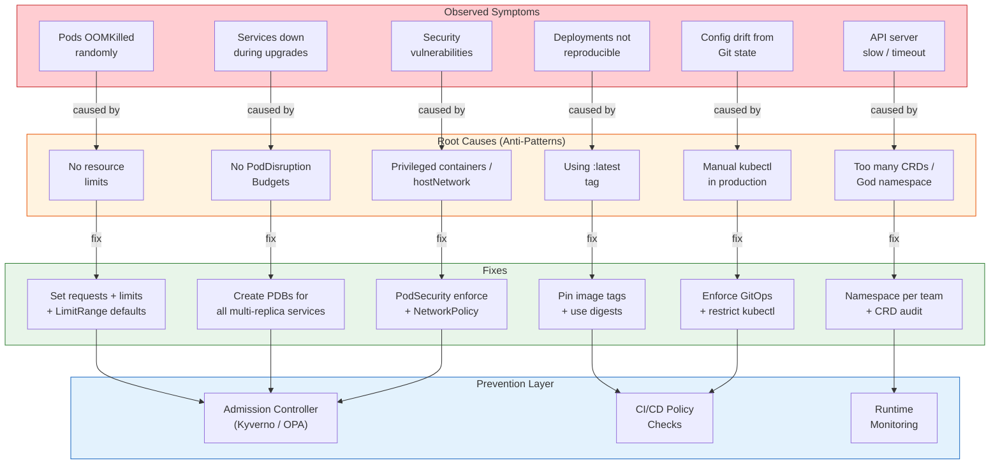

# Kubernetes Anti-Patterns

## 1. Overview

Anti-patterns are recurring practices that appear reasonable at first but lead to production incidents, operational toil, security vulnerabilities, or cost waste. In Kubernetes, anti-patterns are especially dangerous because the system's complexity means that a seemingly minor shortcut -- skipping resource limits, using the `:latest` tag, putting everything in the default namespace -- can cascade into cluster-wide outages that are difficult to diagnose and expensive to fix.

This document catalogs the most common and most damaging Kubernetes anti-patterns, organized by the symptoms they produce. Each anti-pattern includes the root cause, the production impact, real-world incidents where available, and the concrete fix. The goal is not to create fear but to build pattern recognition: when you see the symptom, you immediately recognize the cause and know the fix.

According to the Komodor 2025 Enterprise Kubernetes Report, 79% of production outages originate from recent system changes, and operations teams spend over 60% of their time troubleshooting issues. The majority of these issues trace back to well-known anti-patterns that are preventable with proper guardrails. More than 82% of Kubernetes workloads are overprovisioned -- using less than half of the CPU and memory they request -- while 11% are underprovisioned and only 7% have accurate resource configurations.

## 2. Why It Matters

- **Anti-patterns cause cascading failures.** A single Pod without resource limits can OOMKill its neighbors on the same node, triggering a cascade of rescheduling that destabilizes the entire cluster. Understanding anti-patterns is understanding failure modes.
- **Production incidents are expensive.** Teams spend an average of 34 workdays annually troubleshooting Kubernetes issues (Komodor 2025). Most of these issues are caused by preventable anti-patterns. Learning from others' incidents is cheaper than experiencing your own.
- **Kubernetes makes anti-patterns easy.** The system is permissive by default: no resource limits required, no PodDisruptionBudgets enforced, no network policies active, `:latest` tag works fine. The defaults optimize for "getting started" rather than "running in production."
- **Anti-patterns compound over time.** A cluster that starts with one anti-pattern accumulates more. No resource limits leads to noisy neighbors, which leads to oversized nodes (to "give everything room"), which leads to cost waste, which leads to pressure to pack more workloads, which leads to worse noisy-neighbor problems.
- **Detection requires intent.** Anti-patterns are invisible until they cause an incident. Proactive detection through policy enforcement (Kyverno, OPA Gatekeeper), resource auditing, and architectural review is the only way to catch them before they cause production impact.

## 3. Core Concepts

- **Noisy neighbor:** A workload that consumes more than its fair share of shared resources (CPU, memory, I/O, network bandwidth), degrading the performance of other workloads on the same node. This is the most common symptom of missing resource limits.
- **Configuration drift:** The divergence between what is declared in Git (or what should be deployed) and what is actually running in the cluster. Caused by manual kubectl commands, ad-hoc patches, and bypassing GitOps pipelines.
- **Blast radius:** The scope of impact when something fails. Anti-patterns increase blast radius: a God namespace means one misconfigured NetworkPolicy affects every workload; a single-replica critical service means one Pod failure causes a complete outage.
- **Guardrails vs. gates:** Guardrails are policies that prevent anti-patterns automatically (admission controllers that reject Pods without resource limits). Gates are manual reviews that catch anti-patterns before deployment (PR reviews, architecture reviews). Guardrails are more reliable because they cannot be skipped.
- **Toil:** Repetitive, manual, automatable work that scales linearly with cluster size. Anti-patterns generate toil: manually managing deployments with kubectl, manually rotating certificates, manually resizing PVCs.

## 4. How It Works

Anti-patterns operate through a consistent mechanism: **a shortcut that saves time in development creates a hidden failure mode that manifests in production.** The time between the shortcut and the incident is what makes anti-patterns dangerous -- the person who introduced the pattern may not be the person who deals with the outage, and the causal link is not obvious.

### The Anti-Pattern Lifecycle

1. **Introduction:** A developer takes a shortcut that works in development. No resource limits because "it works on my machine." The `:latest` tag because "I always push the latest version." Everything in the default namespace because "we only have one team."
2. **Accumulation:** The pattern spreads through copy-paste, templates, and Helm charts. More workloads adopt the same shortcut because "that is how we do it here."
3. **Stress:** The cluster grows. More teams, more workloads, more traffic. The shortcut that worked at small scale begins to fail at larger scale.
4. **Incident:** A seemingly unrelated change triggers the failure. A new deployment consumes more memory than expected, OOMKilling its neighbors. A node upgrade evicts all replicas of a service because there is no PodDisruptionBudget.
5. **Diagnosis:** The team spends hours tracing the root cause through logs, metrics, and events. The connection between the original shortcut and the incident is not obvious.
6. **Fix (reactive):** The specific instance is fixed. Resource limits are added to the offending workload. A PDB is created for the affected service.
7. **Prevention (proactive):** Guardrails are implemented to prevent the anti-pattern cluster-wide. An admission controller rejects Pods without resource limits. A CI check fails if a Helm chart uses `:latest`.

## 5. Architecture / Flow



## 6. Types / Variants

### Resource Management Anti-Patterns

#### Anti-Pattern 1: No Resource Limits (Noisy Neighbors)

**What it looks like:**
```yaml
containers:
- name: app
  image: my-app:v1.0
  # No resources section at all
```

**Why it happens:** Kubernetes does not require resource requests or limits. Pods without them are classified as BestEffort QoS, meaning they are the first to be evicted under memory pressure and have no CPU guarantees.

**Production impact:** A single runaway container (memory leak, uncontrolled cache growth, log buffer overflow) consumes all available memory on the node, triggering the Linux OOM killer. The OOM killer does not just kill the offending container -- it kills the container using the most memory, which may be a perfectly healthy workload that simply happens to be larger. This cascading OOMKill can destabilize an entire node, rescheduling all its Pods and potentially causing a domino effect across the cluster.

**Real-world incident:** More than 82% of Kubernetes workloads are overprovisioned, using less than half of the CPU and memory they request, while 11% are underprovisioned (Komodor 2025). A common production failure pattern: a Pod without limits consumes 90% of node memory, the OOM killer terminates a co-located database Pod (which was using memory for its legitimate cache), the database Pod restarts cold (empty cache), query latency spikes 10x, upstream services timeout, and the incident escalates from "one Pod using too much memory" to "service degradation across the cluster."

**Fix:**
```yaml
resources:
  requests:
    cpu: 100m
    memory: 128Mi
  limits:
    cpu: 500m
    memory: 512Mi
```

Enforce cluster-wide with a LimitRange (sets defaults for Pods that omit resources) and ResourceQuota (caps total resource consumption per namespace). Use an admission controller (Kyverno/OPA) to reject Pods without resource requests.

---

#### Anti-Pattern 2: Using the :latest Tag

**What it looks like:**
```yaml
containers:
- name: app
  image: my-app:latest  # or just: my-app (defaults to :latest)
```

**Why it happens:** It is the simplest tag to use during development. Developers push to `:latest`, the Pod restarts and picks up the new image. No need to update the manifest.

**Production impact:** Deployments become non-reproducible. `kubectl rollout restart` may pull a different image version than what was originally deployed. Rollbacks do not work because the `:latest` tag has been overwritten. Two Pods in the same Deployment may run different code if they started at different times. Debugging is impossible because you cannot determine which version is running without inspecting the image digest.

**Real-world incident:** A production incident at a mid-sized SaaS company involved a developer pushing a breaking change to `:latest` on a Friday afternoon. The change was not deployed immediately, but over the weekend, a node was drained for maintenance. When Pods were rescheduled on new nodes, they pulled the broken `:latest` image. The service degraded gradually as nodes were drained one by one, making the issue difficult to correlate. Rollback with `kubectl rollout undo` had no effect because the Deployment spec had not changed -- it still said `:latest`.

**Fix:** Pin images to immutable tags (`my-app:v1.2.3`) or digests (`my-app@sha256:abc123...`). Use a CI/CD pipeline that updates the tag in the manifest and commits it to Git. Enforce with an admission controller that rejects `:latest` and untagged images.

---

### Deployment Anti-Patterns

#### Anti-Pattern 3: No PodDisruptionBudgets (Unsafe Upgrades)

**What it looks like:** A Deployment with 3 replicas and no PDB. During a node upgrade (`kubectl drain`), all 3 replicas happen to be on nodes being drained simultaneously, causing complete service unavailability.

**Why it happens:** PDBs are optional and often forgotten. The default behavior when draining a node is to evict all Pods on that node, regardless of whether their siblings are still running on other nodes.

**Production impact:** During cluster upgrades, node replacements, or autoscaler scale-downs, services experience complete outages because all replicas are evicted simultaneously. This is especially dangerous with StatefulSets where Pods cannot be rescheduled instantly (they need to reattach persistent volumes).

**Real-world incident:** A major e-commerce platform experienced a 12-minute outage during a routine cluster upgrade. The cluster autoscaler drained two nodes simultaneously, and all three replicas of the checkout service happened to be on those nodes. With no PDB, the drain proceeded without checking that at least one checkout Pod remained running. The checkout service was completely unavailable until new Pods were scheduled, pulled images, passed readiness probes, and joined the Service endpoints.

**Fix:**
```yaml
apiVersion: policy/v1
kind: PodDisruptionBudget
metadata:
  name: my-app-pdb
spec:
  minAvailable: 1    # or: maxUnavailable: 1
  selector:
    matchLabels:
      app: my-app
```

Create a PDB for every multi-replica service. `minAvailable: 1` ensures at least one Pod is always running during voluntary disruptions. For critical services, use `minAvailable: "50%"` or higher.

---

#### Anti-Pattern 4: Manual kubectl in Production (Bypassing GitOps)

**What it looks like:** Operators using `kubectl edit`, `kubectl set image`, `kubectl scale`, or `kubectl apply` directly against production clusters instead of committing changes to Git and letting a GitOps controller (ArgoCD, Flux) apply them.

**Why it happens:** It is faster. When there is an incident, the instinct is to fix it immediately rather than go through a PR process. Over time, "quick fixes" become the norm, and the Git repository diverges from the cluster state.

**Production impact:** Configuration drift. The cluster state does not match what is in Git. The next GitOps sync overwrites the manual change, potentially reverting a critical fix. Or worse, GitOps is disabled because "it keeps reverting our changes." Audit trails are lost -- kubectl commands are not recorded in Git history. Rollbacks are impossible because there is no previous known-good state in Git.

**Real-world incident:** Configuration drift fuels an estimated 70% of outages. A documented incident involved a junior developer's tweak to a ConfigMap logging level from INFO to DEBUG that flooded node disks in eight minutes, crashing kubelets cluster-wide and requiring 45 minutes of manual recovery via SSH. The change was made with `kubectl edit` and was not tracked in Git, so the team initially could not identify what had changed.

**Fix:** Enforce GitOps with ArgoCD or Flux. Restrict kubectl write access in production using RBAC (read-only for most users, write access only for break-glass scenarios with audit logging). Use ArgoCD's auto-sync with self-heal to automatically revert manual changes.

---

### Namespace and Organization Anti-Patterns

#### Anti-Pattern 5: God Namespace (Everything in Default)

**What it looks like:** All workloads, from all teams, deployed into the `default` namespace. No ResourceQuotas, no LimitRanges, no NetworkPolicies.

**Why it happens:** Namespaces require planning and coordination. The `default` namespace exists from cluster creation and requires no setup. When teams are small or the cluster is new, everything goes into `default` because "we will organize later."

**Production impact:** No resource isolation: one team's memory leak affects all other teams. No RBAC granularity: everyone has access to everything. No network segmentation: all Pods can communicate with all other Pods. No resource quotas: one team can consume the entire cluster's capacity. Service name collisions: two teams cannot both have a Service named `api`.

**Fix:** Create namespaces per team or per environment. Apply ResourceQuotas (total CPU/memory per namespace), LimitRanges (default and max per Pod), and NetworkPolicies (deny all, then allow specific traffic). Use admission controllers to prevent resource creation in the `default` namespace.

---

#### Anti-Pattern 6: Single-Replica Critical Services

**What it looks like:**
```yaml
spec:
  replicas: 1  # "We'll scale up when we need to"
```

**Why it happens:** Single-replica deployments are simpler: no need to think about session affinity, leader election, shared state, or PodDisruptionBudgets. Scaling up is deferred because "the service handles low traffic."

**Production impact:** A single-replica service has zero tolerance for any disruption. A node failure, a routine node drain, an OOM kill, or even a container restart causes a complete service outage. The Pod must be rescheduled, start, pass readiness probes, and rejoin the Service endpoints before traffic is served. For a typical application, this takes 30-90 seconds. For a service with slow startup or volume attachment, it can take minutes.

**Fix:** Run at least 2 replicas for any service that must survive node failures. Use Pod topology spread constraints to ensure replicas are on different nodes and, ideally, different availability zones. Combine with PDBs to ensure safe voluntary disruptions.

---

### Security Anti-Patterns

#### Anti-Pattern 7: Privileged Containers

**What it looks like:**
```yaml
securityContext:
  privileged: true
```

**Why it happens:** Certain workloads (CNI plugins, storage drivers, monitoring agents) genuinely need elevated privileges. But the pattern spreads: developers encounter a permission error and add `privileged: true` rather than diagnosing the specific capability needed.

**Production impact:** A privileged container has full access to the host's devices, network stack, and file systems. If the container is compromised (through a vulnerable dependency, misconfigured service, or supply chain attack), the attacker has root access to the host and can escape the container, access other Pods on the same node, and potentially pivot to the control plane.

**Fix:** Use specific Linux capabilities (`NET_ADMIN`, `SYS_PTRACE`) instead of blanket `privileged: true`. Enforce PodSecurity Standards at the namespace level (`restricted` profile for application namespaces, `baseline` for system components). Audit existing privileged containers and remove unnecessary privileges.

---

#### Anti-Pattern 8: hostNetwork Without Justification

**What it looks like:**
```yaml
spec:
  hostNetwork: true
```

**Why it happens:** Developers use `hostNetwork` to bypass Service/DNS resolution issues, expose services on well-known ports without NodePort/LoadBalancer, or work around CNI limitations.

**Production impact:** Pods using `hostNetwork` share the host's network namespace, meaning they use the host's IP address and port space. Port conflicts between Pods on the same node cause startup failures. The Pod bypasses NetworkPolicies (which operate on Pod-level networking, not host networking). Network isolation is broken.

**Fix:** Use Services (ClusterIP, NodePort, LoadBalancer) for service exposure. Use HostPort only when a Pod needs a specific port on the host (e.g., node-level monitoring). Restrict `hostNetwork` through PodSecurity Standards. The only legitimate uses of `hostNetwork` are CNI plugins, kube-proxy, and specific monitoring agents that need host-level network visibility.

---

### Operational Anti-Patterns

#### Anti-Pattern 9: Storing State in ConfigMaps (Race Conditions)

**What it looks like:** Using ConfigMaps as a key-value store for runtime state: leader election, feature flags that are updated by controllers, counters, or locks.

**Why it happens:** ConfigMaps are easy to read and write with kubectl or the Kubernetes API. They feel like a convenient database for small amounts of state.

**Production impact:** ConfigMaps have no concurrency control. Two controllers updating the same ConfigMap simultaneously experience a last-write-wins race condition. There is no transactional update, no compare-and-swap (without implementing optimistic concurrency yourself using resourceVersion), and no change notification guarantee. Leaders disagree on who holds the lock, feature flags flap between values, and counters lose increments.

**Fix:** Use Kubernetes Lease objects for leader election (built-in concurrency control). Use CRDs with status subresources for controller state (proper spec/status split, optimistic concurrency). Use external stores (Redis, etcd directly, cloud-native key-value stores) for runtime state that requires strong consistency.

---

#### Anti-Pattern 10: Too Many CRDs (API Server Bloat)

**What it looks like:** A cluster with 200+ CRDs installed by various operators, tools, and platform components. Many are unused or from abandoned experiments.

**Why it happens:** Installing an operator is easy (`helm install`). Uninstalling cleanly is harder (CRDs are often not removed with the operator because they contain user data). Over time, CRDs accumulate.

**Production impact:** Each CRD adds to the API server's work: schema validation, discovery endpoint generation, OpenAPI spec compilation, and watch connection management. Clusters with hundreds of CRDs report measurably slower `kubectl` response times (discovery calls take seconds instead of milliseconds), slower API server startup, and increased etcd size. The OpenAPI spec becomes so large that some clients (including older kubectl versions and some IDE plugins) fail to parse it.

**Fix:** Audit CRDs regularly. Remove CRDs from uninstalled operators (after verifying no CRs exist). Use `kubectl api-resources | wc -l` to track CRD count as a metric. Set a soft limit (e.g., <100 CRDs per cluster) and require justification for new CRD installations.

---

#### Anti-Pattern 11: Ignoring Pod Topology Spread

**What it looks like:** A Deployment with 3 replicas and no topology spread constraints. All 3 replicas are scheduled on the same node (or same availability zone) because the scheduler optimizes for resource efficiency, not fault tolerance by default.

**Why it happens:** Topology spread constraints require understanding of node labels (topology.kubernetes.io/zone), and the default scheduler behavior is "pack" (fill nodes before spreading).

**Production impact:** A single node failure (or AZ failure) takes out all replicas simultaneously, causing a complete service outage. This is the most common cause of "we had 3 replicas but still had downtime during a node failure."

**Fix:**
```yaml
topologySpreadConstraints:
- maxSkew: 1
  topologyKey: topology.kubernetes.io/zone
  whenUnsatisfiable: DoNotSchedule
  labelSelector:
    matchLabels:
      app: my-app
- maxSkew: 1
  topologyKey: kubernetes.io/hostname
  whenUnsatisfiable: ScheduleAnyway
  labelSelector:
    matchLabels:
      app: my-app
```

The first constraint hard-enforces zone spread (schedule will fail if it would create skew > 1 across zones). The second constraint soft-prefers node spread (scheduler tries but does not block).

### Anti-Pattern Detection and Prevention

Prevention is always cheaper than remediation. Here is a layered defense approach:

#### Static Analysis (Pre-Deploy)

| Tool | What It Checks | Integration Point |
|---|---|---|
| **kube-linter** | Resource limits, security context, liveness/readiness probes, image tags | CI/CD pipeline (fails build) |
| **Polaris** | Best practices score: resource requests, health checks, security, networking | CI/CD pipeline + in-cluster dashboard |
| **kubesec** | Security risk scoring: privileged, hostNetwork, capabilities | CI/CD pipeline |
| **Datree** | Custom policy rules, schema validation, K8s version compatibility | Git pre-commit hook or CI/CD |
| **conftest (OPA)** | Custom Rego policies on manifests | CI/CD pipeline |

#### Runtime Enforcement (Admission Control)

| Tool | Approach | Key Capability |
|---|---|---|
| **Kyverno** | Kubernetes-native policies as CRDs | Validate, mutate, generate resources; no external language (YAML-based rules) |
| **OPA Gatekeeper** | OPA/Rego-based policies as CRDs | Constraint templates + constraints; powerful logic but steeper learning curve |
| **PodSecurity Admission** | Built-in Kubernetes feature (no additional installation) | Enforce, audit, or warn against privileged, baseline, or restricted Pod profiles |
| **Kubewarden** | WebAssembly-based policies | Polyglot policy authoring (Rego, Go, Rust → Wasm) |

#### Runtime Monitoring (Post-Deploy)

| Tool | What It Detects | Response |
|---|---|---|
| **Goldilocks** | Resource over/under-provisioning based on VPA recommendations | Generates right-sizing recommendations per container |
| **Kubecost** | Cost waste from idle resources, overprovisioned requests | Cost allocation reports, alerts on spending anomalies |
| **Falco** | Runtime security violations (privileged escalation, unexpected network, suspicious exec) | Alerts, can trigger automated response via Falco Sidekick |
| **Prometheus + alerting rules** | OOMKills, CrashLoopBackOff, high error rates, resource pressure | PagerDuty/Slack alerts, automated remediation via operators |

### Anti-Pattern Severity Classification

Not all anti-patterns carry equal risk. Prioritize remediation based on severity:

| Severity | Anti-Pattern | Impact | Remediation Priority |
|---|---|---|---|
| **Critical** | No resource limits on critical path | Cascading OOMKill, cluster instability | Immediate (deploy admission controller this week) |
| **Critical** | Privileged containers in production | Container escape, cluster compromise | Immediate (audit and restrict) |
| **High** | No PDBs for critical services | Outage during upgrades | Before next cluster upgrade |
| **High** | Using :latest tag in production | Non-reproducible deployments, failed rollbacks | Within 2 weeks (CI/CD policy) |
| **Medium** | God namespace | Resource contention, RBAC gaps | Within 1 month (plan namespace strategy) |
| **Medium** | Manual kubectl in production | Configuration drift | Within 1 month (implement GitOps) |
| **Low** | Single-replica non-critical services | Brief outage during disruptions | As part of regular service hardening |
| **Low** | Too many CRDs | API server slowness | Quarterly audit |

## 7. Use Cases

Anti-patterns are not "use cases" in the traditional sense, but here are the contexts where they most commonly appear:

- **Startup MVP clusters:** Speed over safety. No resource limits, no PDBs, everything in default namespace, `:latest` tags. Acceptable for a prototype; becomes technical debt when the cluster is promoted to production without hardening.
- **Cluster upgrades and migrations:** Missing PDBs and topology spread cause outages during node drains. Manual kubectl during migration creates drift. These anti-patterns are dormant until the first upgrade.
- **Multi-team platform adoption:** The God namespace pattern emerges when a second team starts using a single-team cluster. Resource contention, naming conflicts, and permission issues appear immediately.
- **Cost optimization pressures:** Teams remove resource requests to "fit more Pods" on existing nodes, creating BestEffort Pods that are first to be evicted. The apparent savings are offset by incident costs.
- **Compliance and audit failures:** Privileged containers, missing network policies, and no RBAC granularity fail security audits. These are often the first anti-patterns addressed because compliance is non-negotiable.

## 8. Tradeoffs

| Decision | Strict Enforcement | Flexible Approach | Guidance |
|---|---|---|---|
| **Resource limits on all Pods** | Admission controller rejects Pods without limits | LimitRange sets defaults, monitoring alerts on Pods without explicit limits | Strict for production namespaces; flexible for development/sandbox |
| **Blocking :latest tag** | Reject at admission | Warn but allow, enforce in CI/CD pipeline | Block in production; allow in development with monitoring |
| **Mandatory PDBs** | Require PDB for all Deployments with >1 replica | Create PDBs during incident postmortems | Mandatory for critical services; recommended for all production workloads |
| **Restrict kubectl write access** | Read-only RBAC for all users, GitOps only | Break-glass write access with audit logging | GitOps-only for production; liberal access for development clusters |
| **Namespace per team vs. per service** | Per service: finest granularity, most isolation | Per team: fewer namespaces, simpler management | Per team for most organizations; per service for large platforms with strong automation |

## 9. Common Pitfalls

The anti-patterns described in Section 6 are themselves the pitfalls. Here are meta-pitfalls -- mistakes in addressing anti-patterns:

- **Fixing symptoms instead of root causes.** Adding resource limits to the Pod that caused an OOMKill but not enforcing limits cluster-wide. The next incident will come from a different Pod.
- **Over-correcting with overly strict policies.** Blocking all Pod creation that does not meet every best practice simultaneously. Development teams cannot deploy at all, and they bypass the platform entirely (shadow IT).
- **Implementing guardrails without communication.** Enabling an admission controller that rejects Pods without resource limits on Monday morning without warning. Every CI/CD pipeline in the organization breaks.
- **Treating anti-patterns as binary.** Not every cluster needs every guardrail. A development cluster can tolerate `:latest` tags. A single-node test cluster does not need topology spread constraints. Match the enforcement level to the environment's risk profile.
- **Ignoring anti-patterns in Helm charts and shared templates.** A Helm chart that defaults to no resource limits propagates the anti-pattern to every release that uses it. Audit shared templates with the same rigor as production manifests.

## 10. Real-World Examples

- **Komodor 2025 Enterprise Kubernetes Report:** 79% of production outages originate from recent system changes. Over 60% of ops teams' time is spent troubleshooting. Only 20% of incidents are resolved without escalation. The report found that configuration changes (ConfigMap updates, image tag changes, resource limit adjustments) are the leading cause of incidents, not infrastructure failures.
- **ConfigMap logging level change cascading to cluster outage:** A junior developer changed a ConfigMap logging level from INFO to DEBUG using `kubectl edit`. The increased log volume filled node disks in eight minutes, crashing kubelets cluster-wide. Recovery required 45 minutes of manual SSH access to nodes to clear disk space and restart kubelets. The change was not tracked in Git, making root cause identification difficult.
- **k8s.af -- Kubernetes Failure Stories collection:** A curated, community-maintained list of public Kubernetes failure stories. Notable incidents include: a European bank losing all production Pods due to an accidental `kubectl delete` in the wrong context, a gaming company tracing intermittent operator failures to a race condition in CR finalizers, and multiple organizations experiencing etcd disk exhaustion from CRD proliferation. The collection serves as a learning resource for SRE, Ops, and platform teams.
- **The :latest tag incident pattern:** Multiple organizations have reported the same pattern: a developer pushes a broken image to `:latest`, the issue is not immediately visible because running Pods are not affected, but when nodes are drained or Pods are rescheduled (sometimes days later), the broken image is pulled and the service fails. The time gap between cause and effect makes diagnosis extremely difficult.
- **PDB absence during cluster upgrades:** A recurring pattern reported by multiple cloud-native consultancies: organizations perform their first cluster upgrade without PDBs and experience service outages. The fix is straightforward (create PDBs), but the incident often occurs during business hours because the team did not anticipate the impact of node drains.
- **Resource overprovisioning waste:** The finding that 82% of workloads are overprovisioned means organizations are paying for approximately 2x the compute they actually need. A cluster with $100K/month in compute costs likely has $40-50K/month in waste from overprovisioned resource requests. Tools like Goldilocks, Kubecost, and VPA recommendations help right-size resource requests based on actual utilization.

## 11. Related Concepts

- [Pod Design Patterns](../03-workload-design/01-pod-design-patterns.md) -- proper Pod design that avoids anti-patterns
- [Control Plane Internals](../01-foundations/02-control-plane-internals.md) -- understanding how anti-patterns stress the control plane
- [GitOps and Flux/ArgoCD](../08-deployment-design/01-gitops-and-flux-argocd.md) -- GitOps as the antidote to manual kubectl
- [CRD-Driven Design](./03-crd-driven-design.md) -- proper CRD design to avoid API server bloat
- [Operator Pattern](./01-operator-pattern.md) -- operators that enforce best practices and prevent anti-patterns
- [Sidecar and Ambassador Patterns](./02-sidecar-and-ambassador.md) -- proper sidecar patterns to avoid resource and lifecycle pitfalls

## 12. Source Traceability

- source/extracted/acing-system-design/ch03-a-walkthrough-of-system-design-concepts.md -- System design anti-patterns, tight coupling, client-server pattern discussion
- docs/kubernetes-system-design/01-foundations/01-kubernetes-architecture.md -- Resource requests/limits, QoS classes, PDBs, namespace best practices, reconciliation model
- Komodor 2025 Enterprise Kubernetes Report -- 79% outages from system changes, 82% workloads overprovisioned, 34 workdays/year troubleshooting
- k8s.af -- Curated Kubernetes failure stories from production environments
- Kubernetes official documentation (kubernetes.io/blog/2025/10/20/seven-kubernetes-pitfalls-and-how-to-avoid/) -- Seven common pitfalls and prevention strategies
