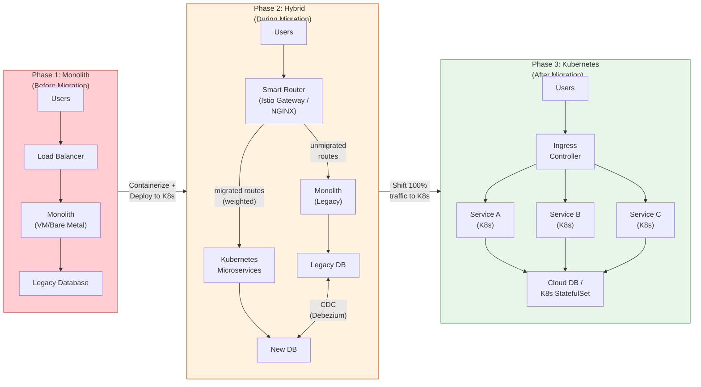

# Migration Patterns

## 1. Overview

Migrating workloads to Kubernetes is not a single event but a series of deliberate, risk-managed transitions that move an organization from its current infrastructure (bare metal, VMs, legacy PaaS, or another orchestrator) to a Kubernetes-native architecture. Migration patterns provide structured approaches to this transition, each with different risk profiles, timelines, and organizational requirements.

The Strangler Fig pattern -- incrementally replacing monolith functionality with Kubernetes-native microservices while both systems run in parallel -- is the most widely adopted migration strategy for production systems. It is named after the strangler fig tree, which grows around an existing tree, gradually replacing it until the host tree withers away. In a Kubernetes migration, the "host tree" is your legacy system, and the "fig" is the new Kubernetes-based architecture. At any point during the migration, you can stop and have a working system.

Migration is as much an organizational challenge as a technical one. The technical patterns (containerization, traffic shifting, data migration) must be paired with organizational change management: training, team restructuring, incident response processes, and cultural shifts from manual operations to declarative, GitOps-driven workflows. Organizations that treat migration as purely a technology project consistently underestimate the timeline and overestimate the benefits in the first year.

## 2. Why It Matters

- **Risk management is the primary concern.** A failed migration can take down production systems. The patterns described here are designed to minimize risk by enabling incremental progress, parallel operation of old and new systems, and rollback at every stage.
- **Most organizations have running production systems.** Unlike greenfield projects where you can design for Kubernetes from the start, most migrations involve existing systems that are serving live traffic. The migration must happen without downtime, data loss, or degraded user experience.
- **Stateful workloads are the hard part.** Containerizing a stateless web service is straightforward. Migrating a database, a message queue, or a cache to Kubernetes -- while maintaining data integrity, replication, and availability -- is where most migration projects stall or fail. The patterns here specifically address stateful migration.
- **Migration scope is often underestimated.** It is not just "put the app in a container." It includes: networking (DNS, load balancers, firewall rules), monitoring (new observability stack), security (RBAC, network policies, secrets management), CI/CD (new pipelines), and operations (on-call processes, runbooks, incident response).
- **Organizational readiness determines success.** A team that does not understand Kubernetes debugging, resource management, and declarative operations will not succeed in production, regardless of how good the migration tooling is. Training and gradual exposure are prerequisites.

## 3. Core Concepts

- **Strangler Fig pattern:** Incrementally route traffic from the legacy system to the new Kubernetes-based system, service by service. Both systems run in parallel. The legacy system handles traffic for un-migrated services; the new system handles migrated services. Once all traffic is routed to the new system, the legacy system is decommissioned.
- **Lift and shift:** Containerize the existing application with minimal code changes (often just adding a Dockerfile), deploy it to Kubernetes, and optimize later. This gets the application onto Kubernetes quickly but does not take advantage of Kubernetes-native features (auto-scaling, rolling updates, health checks) until further refactoring.
- **Refactor first:** Decompose the monolith into microservices before containerizing. Each microservice is designed for Kubernetes (stateless, health-checked, resource-aware) from the start. Higher upfront investment but better long-term architecture. Best for applications that will benefit significantly from microservice decomposition.
- **Container-first migration:** The intermediate step between legacy and Kubernetes: containerize the application (Docker) and run it in a container runtime without Kubernetes. This validates that the application runs correctly in a container (file system, networking, environment variables, process model) before adding the complexity of Kubernetes scheduling and orchestration.
- **Dual-write:** During stateful migration, both the old and new systems write to their respective data stores. A synchronization process keeps them consistent. This enables parallel operation and validation before cutover. The risk is data inconsistency if the sync process has bugs or lag.
- **Change Data Capture (CDC):** A pattern for replicating data from the legacy database to the new system in real-time. Tools like Debezium read the database's transaction log (WAL for PostgreSQL, binlog for MySQL) and stream changes to the new system. CDC provides near-real-time replication without modifying the legacy application.
- **Blue-green database cutover:** Both databases run in parallel with CDC keeping them in sync. Traffic is switched to the new database atomically (by updating the connection string or DNS). If the cutover fails, traffic is switched back. This requires both databases to be at the same state at the moment of cutover.
- **Traffic shifting (weighted routing):** During migration, traffic is gradually shifted from the legacy system to the new Kubernetes-based system. Service mesh (Istio) or ingress controller (NGINX, Traefik) supports weighted routing: start with 1% of traffic to the new system, increase to 10%, 50%, and finally 100% as confidence grows.
- **Migration wave:** A group of services or workloads that are migrated together in a single phase. Waves are ordered by dependency, risk, and complexity: start with stateless, low-risk services; end with stateful, critical services.
- **Dependency mapping:** Before migration, map all dependencies between services, databases, external APIs, and infrastructure components. Dependencies determine the order of migration waves and identify services that must be migrated together (because they cannot operate across the old/new boundary).
- **Rollback strategy:** Every migration stage must have a tested rollback plan. For traffic shifting: revert the weight to 0% on the new system. For database cutover: reverse the CDC direction and switch traffic back. For containerization: redeploy the VM-based version. Rollback must be tested before the migration, not improvised during an incident.

## 4. How It Works

### Strangler Fig Migration (Detailed Steps)

The Strangler Fig pattern is the safest approach for migrating an existing production system to Kubernetes:

**Phase 1: Preparation (Weeks 1-4)**

1. **Dependency mapping:** Catalog all services, their dependencies, data stores, external APIs, and network requirements. Use service mesh telemetry, application performance monitoring (APM), or manual interviews to build the dependency graph.
2. **Migration wave planning:** Group services into waves based on: dependency order (leaf services first), risk (low-risk, low-traffic services first), complexity (stateless before stateful), and team readiness (most Kubernetes-experienced team first).
3. **Platform readiness:** Provision the Kubernetes cluster, configure networking (CNI, ingress, DNS), set up monitoring (Prometheus, Grafana, Loki), establish CI/CD pipelines (ArgoCD/Flux), and implement security baseline (RBAC, PodSecurity, NetworkPolicies).
4. **Team training:** Train operations teams on Kubernetes debugging (kubectl, log aggregation, metrics), deployment workflows (GitOps), and incident response in a Kubernetes context.

**Phase 2: Proxy Layer (Week 5)**

5. **Deploy the routing layer:** Set up a reverse proxy or API gateway (Istio ingress gateway, NGINX, Traefik, or a cloud load balancer) in front of both the legacy system and the Kubernetes cluster. All traffic flows through this router. Initially, 100% of traffic routes to the legacy system.

**Phase 3: Incremental Migration (Weeks 6-N)**

6. **Containerize the first service:** Choose a low-risk, stateless, well-understood service. Write a Dockerfile, build a container image, deploy to Kubernetes with proper resource requests, health checks, and replicas.
7. **Parallel validation:** Run the new Kubernetes-based service alongside the legacy version. Use traffic mirroring (send a copy of production traffic to the new service without affecting users) or shadow mode to compare responses.
8. **Traffic shifting:** Gradually route traffic to the new service: 1% → 5% → 10% → 25% → 50% → 100%. Monitor error rates, latency, and business metrics at each step. Automated canary analysis (Flagger, Argo Rollouts) can make promotion decisions based on metrics.
9. **Decommission legacy service:** Once 100% of traffic is on the new service with acceptable metrics, decommission the legacy version of that service.
10. **Repeat for each wave:** Move to the next migration wave. Each wave is larger and may include more complex services. Apply lessons learned from previous waves.

**Phase 4: Stateful Migration (Late Waves)**

11. **Set up CDC:** Deploy Debezium or a similar CDC tool to stream changes from the legacy database to the new Kubernetes-hosted database (or cloud-managed database).
12. **Validate data consistency:** Compare data between legacy and new databases using checksum tools or row-count validation queries.
13. **Blue-green cutover:** When the databases are in sync and the team is confident, switch the application's database connection to the new database. Monitor for errors and data integrity issues. Maintain the ability to switch back for a defined period (24-72 hours).

**Phase 5: Decommission Legacy (Final)**

14. **Decommission legacy infrastructure:** After all services and data stores are migrated and stable (typically after 2-4 weeks of monitoring), decommission the legacy infrastructure. Keep backups for the retention period.
15. **Post-migration optimization:** Tune resource requests (right-size based on actual usage), implement auto-scaling, optimize networking (service mesh, eBPF), and adopt Kubernetes-native features that were not possible on the legacy platform.

### Stateful Migration Patterns

| Pattern | How It Works | Risk Level | Best For |
|---|---|---|---|
| **Dual-write** | Application writes to both old and new databases simultaneously | High (consistency risk) | Simple schemas, low write volume, when CDC is not available |
| **CDC (Debezium)** | Reads database transaction log, streams changes to new database in near-real-time | Medium (lag risk) | Complex schemas, high write volume, minimal application changes |
| **Blue-green cutover** | Both databases in sync via CDC, atomic traffic switch | Medium (cutover moment risk) | Databases where dual-write is impractical, requires zero-downtime |
| **Dump and restore** | Take a database dump, restore to new system, switch over | High (downtime window) | Small databases where a maintenance window is acceptable |
| **Application-level migration** | Application reads from both databases, writes to new; gradually shifts read traffic | Medium (application complexity) | When CDC is not supported or schema is being restructured |

### Traffic Shifting During Migration

```
Week 1:  [████████████████████] Legacy 100% | K8s 0%
Week 2:  [███████████████████ ] Legacy 95%  | K8s 5%
Week 3:  [█████████████████   ] Legacy 85%  | K8s 15%
Week 4:  [█████████████       ] Legacy 65%  | K8s 35%
Week 5:  [██████████          ] Legacy 50%  | K8s 50%
Week 6:  [█████               ] Legacy 25%  | K8s 75%
Week 7:  [██                  ] Legacy 10%  | K8s 90%
Week 8:  [                    ] Legacy 0%   | K8s 100%
```

At each step, the team monitors:
- Error rate (should remain at or below baseline)
- Latency (p50, p95, p99 should not degrade)
- Business metrics (conversion rate, order volume, user engagement)
- Infrastructure metrics (CPU utilization, memory usage, network throughput)

If any metric degrades beyond the defined threshold, traffic is shifted back to the previous ratio.

## 5. Architecture / Flow



### Migration Wave Example

```
Wave 1 (Low Risk):          Wave 2 (Medium Risk):        Wave 3 (High Risk):
├── Static asset server     ├── User API service         ├── Payment service
├── Health check service    ├── Notification service     ├── Order database
├── Internal docs site      ├── Search service           ├── Session store
└── Monitoring dashboards   ├── Email worker             └── Authentication service
                            └── Image processing

Timeline: Weeks 1-3         Timeline: Weeks 4-8          Timeline: Weeks 9-16
Stateless, no data          Stateless, external deps     Stateful, critical path
```

## 6. Types / Variants

### Migration Strategy Comparison

| Strategy | Timeline | Risk | Effort | Best For |
|---|---|---|---|---|
| **Strangler Fig** | 3-12 months | Low (incremental) | Medium-High | Production systems that cannot tolerate downtime |
| **Lift and Shift** | 1-3 months | Medium (big bang at the end) | Low | Applications that need to move quickly, optimization deferred |
| **Refactor First** | 6-18 months | Low (but long timeline) | High | Monoliths that will benefit from decomposition |
| **Big Bang** | 1-4 weeks | High (all-or-nothing) | Medium | Small applications, development environments, non-critical systems |
| **Hybrid (permanent)** | Ongoing | Low | Medium | Organizations where some workloads cannot or should not run on K8s |

### Container-First Migration Steps

Before deploying to Kubernetes, validate containerization:

| Step | Activity | Validates |
|---|---|---|
| **1. Dockerize** | Write Dockerfile, build image, run locally | Application starts in container, file paths work, dependencies are present |
| **2. Environment variables** | Replace config files with env vars or mounted ConfigMaps | Application reads configuration from environment, not hardcoded paths |
| **3. Logging** | Configure application to log to stdout/stderr | Kubernetes log collection works, no file-based log rotation needed |
| **4. Health checks** | Add HTTP health and readiness endpoints | Kubernetes can determine if the container is alive and ready for traffic |
| **5. Graceful shutdown** | Handle SIGTERM, drain connections, flush state | Rolling updates and node drains do not drop in-flight requests |
| **6. Stateless verification** | Run multiple container instances simultaneously | Application does not store session state locally, is horizontally scalable |
| **7. Resource profiling** | Measure CPU and memory under load | Resource requests and limits can be set accurately |

### Rollback Strategies by Migration Phase

| Phase | Rollback Mechanism | Time to Rollback | Risk |
|---|---|---|---|
| **Containerization** | Redeploy VM-based version | Minutes (if VM is still available) | Low |
| **Traffic shifting (1-50%)** | Set weight to 0% on new service | Seconds (routing change) | Low |
| **Traffic shifting (>50%)** | Set weight to 0%, but new service was handling majority | Seconds (routing), but legacy must handle sudden load increase | Medium |
| **Database cutover** | Reverse CDC direction, switch connection back | Minutes to hours (depends on data volume changed since cutover) | High |
| **Legacy decommissioned** | Rebuild legacy environment from backup | Hours to days | Very High |

## 7. Use Cases

- **Monolith to microservices on Kubernetes.** An e-commerce platform running a Java monolith on VMs migrates to Kubernetes using the Strangler Fig pattern. The team starts by migrating the product catalog API (stateless, read-heavy), then the search service, then the order processing service, and finally the payment service with its database. Each wave increases confidence and builds Kubernetes expertise within the team.
- **Docker Swarm to Kubernetes.** An organization already running containers on Docker Swarm migrates to Kubernetes for better ecosystem support, auto-scaling, and CRD-based extensions. The containerized applications require minimal changes (Dockerfiles are reused), but the orchestration layer (Compose files) must be rewritten as Kubernetes manifests. Traffic shifting through a shared load balancer enables gradual migration.
- **Cloud VM to managed Kubernetes.** An organization running applications on cloud VMs (EC2, GCE) migrates to managed Kubernetes (EKS, GKE) for better density, auto-scaling, and operational consistency. The lift-and-shift approach containerizes existing applications, deploys them to Kubernetes, and then iteratively improves (adding health checks, resource tuning, auto-scaling) in subsequent sprints.
- **On-premises to cloud Kubernetes.** A financial institution migrates from on-premises bare metal to cloud Kubernetes. Data residency requirements mean some workloads must remain on-premises. The hybrid model uses a cloud Kubernetes cluster for stateless services and an on-premises cluster for data-sensitive workloads, with a service mesh spanning both clusters.
- **Database migration to Kubernetes.** A PostgreSQL database running on a dedicated VM is migrated to CloudNativePG on Kubernetes. CDC (Debezium) replicates data from the VM-hosted PostgreSQL to the Kubernetes-hosted instance. After validation, a blue-green cutover switches the application's connection string. The CloudNativePG operator then manages backups, failover, and upgrades.
- **Mesos/Marathon to Kubernetes.** Pinterest's widely documented migration from Mesos to Kubernetes took 2 years and required building custom controllers for their specific deployment patterns. The declarative model significantly reduced deployment-related incidents because configuration drift was eliminated. Key lesson: the migration timeline was dominated by organizational change (training, process changes, team restructuring), not technical containerization.

### Organizational Change Management

Migration is as much about people as technology. Key organizational patterns:

| Dimension | Before Migration | After Migration | Transition Pattern |
|---|---|---|---|
| **Deployment model** | SSH/Ansible, manual runbooks, Jenkins imperative pipelines | GitOps (ArgoCD/Flux), declarative manifests, PR-based deployments | Train 1 team first; establish GitOps workflow; migrate teams in waves |
| **On-call / Incident response** | SSH into VMs, read logs on disk, restart processes | kubectl, centralized logging (Loki/Elasticsearch), Kubernetes-aware alerting | Pair on-call rotation with K8s-experienced engineer for 2-4 weeks |
| **Capacity planning** | VM sizing, manual scaling, long-lead procurement | Resource requests/limits, HPA/VPA, cluster autoscaler | Start with overprovisioned resources; right-size after 2 weeks of production metrics |
| **Networking** | Static IPs, hardcoded DNS, perimeter firewall | Services, Ingress, NetworkPolicies, service mesh | Map existing network rules to K8s equivalents before migration |
| **Security model** | SSH keys, host-level firewalls, PAM | RBAC, PodSecurity, OPA/Kyverno, ServiceAccounts | Define RBAC roles during platform setup; enforce from day one |

### Success Metrics

Define these before migration starts and track them throughout:

| Metric Category | Specific Metrics | Target |
|---|---|---|
| **Reliability** | Error rate, availability (uptime), incident count | Equal or better than pre-migration baseline |
| **Performance** | Latency (p50, p95, p99), throughput | Within 10% of pre-migration baseline during migration; better after optimization |
| **Developer experience** | Deployment frequency, lead time for changes, time to first deployment for new services | Improvement within 3 months of migration completion |
| **Cost** | Infrastructure cost per transaction, resource utilization, cost per team | Neutral during migration; 20-40% reduction after optimization (right-sizing, spot instances) |
| **Operational** | Mean time to recovery (MTTR), on-call burden, manual intervention frequency | Improvement within 6 months |
| **Migration progress** | Services migrated / total services, traffic percentage on K8s, data stores migrated | Track weekly; use as executive reporting metric |

### Dependency Mapping Techniques

Before planning migration waves, you need a complete dependency graph:

| Technique | How It Works | Discovers |
|---|---|---|
| **Service mesh telemetry** | Analyze Istio/Linkerd traffic logs from existing mesh (if present) | Runtime service-to-service dependencies, traffic volumes, latency |
| **APM tracing** | Distributed tracing (Jaeger, Datadog, New Relic) traces requests across services | Call chains, downstream dependencies, external API calls |
| **Network flow logs** | Analyze VPC flow logs, firewall logs, or tcpdump captures | TCP-level connectivity, database connections, external endpoints |
| **Static analysis** | Scan application code for connection strings, URLs, client library usage | Configured dependencies (may include unused ones) |
| **Team interviews** | Ask service owners about their dependencies | Undocumented dependencies, operational dependencies (monitoring, alerting) |
| **Architecture documents** | Review existing architecture diagrams, runbooks, incident reports | Historical dependencies, known failure modes |

The most reliable approach combines runtime telemetry (what is actually communicating) with static analysis (what is configured) and team interviews (what is not captured by either).

### Istio VirtualService for Traffic Shifting

A concrete example of weighted routing during migration using Istio:

```yaml
apiVersion: networking.istio.io/v1beta1
kind: VirtualService
metadata:
  name: product-catalog
spec:
  hosts:
  - product-catalog.example.com
  http:
  - route:
    - destination:
        host: product-catalog-legacy  # ServiceEntry pointing to VM
      weight: 80
    - destination:
        host: product-catalog-k8s.production.svc.cluster.local
      weight: 20
    retries:
      attempts: 3
      perTryTimeout: 2s
    timeout: 10s
```

The `weight` field is adjusted in the Git repository as the migration progresses. Each weight change goes through a PR, is reviewed, and is applied by ArgoCD. If metrics degrade after increasing the weight, a revert PR restores the previous ratio within minutes.

### Migration Tooling Comparison

| Tool | Category | Function | When to Use |
|---|---|---|---|
| **Velero** | Backup/Restore | Backs up K8s resources and PVs; can migrate between clusters | Cluster-to-cluster migration, disaster recovery |
| **Konveyor (Crane)** | Application migration | Discovers, assesses, and migrates workloads from VMs or other platforms to K8s | Enterprise VM-to-K8s migration |
| **Debezium** | Data migration (CDC) | Streams database changes via Kafka Connect | Database migration with near-zero downtime |
| **Istio/Linkerd** | Traffic management | Weighted routing, traffic mirroring, circuit breaking | Gradual traffic shifting during migration |
| **Kompose** | Manifest conversion | Converts Docker Compose files to K8s manifests | Docker Compose/Swarm to K8s migration |
| **Move2Kube** | Application modernization | Analyzes source artifacts and generates K8s deployment manifests | Automated containerization assessment |

### Migration Timeline Estimation

Realistic timelines based on migration complexity:

| Scenario | Services | Data Stores | Team Size | Estimated Timeline |
|---|---|---|---|---|
| **Small stateless** | 5-10 microservices, no database migration | 0 (databases stay on VMs) | 2-3 engineers | 1-2 months |
| **Medium mixed** | 10-30 services, some stateful | 1-3 databases (CDC migration) | 4-6 engineers | 3-6 months |
| **Large enterprise** | 50+ services, complex dependencies | 5+ databases, message queues, caches | 8-12 engineers (dedicated team) | 6-18 months |
| **Legacy monolith** | 1 monolith → microservices | 1 large database (restructuring) | 6-10 engineers | 12-24 months |

These estimates include organizational change management time. The technical containerization is typically 20-30% of the total effort; the remaining 70-80% is testing, training, process changes, and gradual traffic shifting.

## 8. Tradeoffs

| Decision | Option A | Option B | Guidance |
|---|---|---|---|
| **Strangler Fig vs. Big Bang** | Strangler: incremental, low risk, longer timeline | Big Bang: faster, higher risk, requires maintenance window | Strangler for production systems; Big Bang only for non-critical or small systems |
| **Lift and Shift vs. Refactor** | Lift: fast, minimal code changes, deferred optimization | Refactor: slow, better architecture, immediate K8s benefits | Lift and shift to get on K8s quickly, then refactor iteratively on the platform |
| **CDC vs. Dual-Write** | CDC: no application changes, near-real-time, handles complex schemas | Dual-write: simpler infrastructure, but requires app changes and consistency management | CDC for databases with good WAL support (PostgreSQL, MySQL); dual-write when CDC is not supported |
| **Managed K8s vs. Self-managed** | Managed (EKS/GKE): less ops burden, faster start | Self-managed: full control, but must operate the control plane | Managed for most migrations; self-managed only for air-gapped or highly customized environments |
| **Migrate databases to K8s vs. keep on VMs** | K8s: unified management, operator-driven lifecycle | VMs/Cloud-managed: proven, simpler, better-understood failure modes | Cloud-managed (RDS, Cloud SQL) for most teams; K8s-hosted (CloudNativePG, Strimzi) when the team has K8s database operator expertise |
| **Service mesh during migration vs. after** | During: enables traffic shifting, observability from day one | After: less complexity during migration, add mesh when stable | Lightweight mesh (Linkerd) during migration for traffic shifting; full mesh (Istio) after migration for advanced features |

## 9. Common Pitfalls

- **Migrating everything at once.** Attempting to containerize and migrate the entire application stack in a single effort. One failure blocks the entire migration, and rollback means reverting everything. Use migration waves with independent rollback per wave.
- **Ignoring stateful workloads until the end.** Teams migrate all stateless services first and defer the database "because it is hard." By the time they address the database, the team is fatigued, timelines are compressed, and shortcuts are taken. Plan database migration from the start, even if it executes in a later wave.
- **Underestimating network differences.** On VMs, services communicate via hardcoded IPs, DNS names that resolve to static IPs, or cloud-specific service discovery. In Kubernetes, networking is dynamic: Pod IPs change, Services provide stable endpoints, DNS resolution follows a different pattern (`service.namespace.svc.cluster.local`). Applications with hardcoded connection strings or IP-based service discovery require changes.
- **Not testing rollback.** The rollback plan exists on paper but has never been executed. During a failed migration attempt, the team discovers that the rollback procedure has gaps (e.g., the legacy database does not have reverse CDC configured). Test every rollback procedure before the migration, not during.
- **Treating migration as a technology project.** Kubernetes requires different operational skills than VMs. If the team has not been trained on Kubernetes debugging, deployment, and incident response, the migration will succeed technically but fail operationally -- the team cannot effectively manage the new platform.
- **Forgetting about DNS TTL during traffic shifting.** When shifting traffic at the DNS level, clients cache DNS records for the TTL duration. A DNS-level cutover with a 300-second TTL means 5 minutes of mixed traffic after the switch. Use low TTLs (30 seconds) before cutover, or use an application-level routing layer (service mesh, load balancer) that does not depend on DNS.
- **No success metrics defined.** Migrating without defining what "success" looks like. Is it "same error rate"? "Better latency"? "Lower cost"? Without metrics, the team cannot determine whether the migration is working or when it is complete. Define quantitative success criteria before starting and measure them at every traffic-shifting milestone.
- **Copying VM anti-patterns to Kubernetes.** Migrating VMs to Kubernetes but running one Pod per node with hostNetwork, local storage, and no health checks -- essentially recreating VMs in containers. This gains no Kubernetes benefits (auto-scaling, self-healing, declarative management) while incurring migration costs.
- **Premature legacy decommissioning.** Shutting down the legacy system too soon after cutover. If issues emerge after the cutover, there is no fallback. Maintain the legacy system in a warm standby state for at least 2-4 weeks after full traffic cutover, with the ability to switch back within minutes.
- **No capacity planning for the Kubernetes cluster.** Teams provision a Kubernetes cluster with the same resources as their VM fleet without accounting for Kubernetes overhead: kubelet, kube-proxy, container runtime, DaemonSets (monitoring, logging, mesh proxy), and system reserved resources consume 10-20% of node capacity. A node with 16 GB RAM has only approximately 13 GB allocatable to application Pods.
- **Ignoring data gravity during migration planning.** Services that are data-intensive (high read/write volume to databases) should be migrated close to their data stores. Migrating a compute service to Kubernetes while its database remains on a VM in a different network introduces cross-environment latency that did not exist before.

### Migration Risk Register

Track and mitigate risks throughout the migration:

| Risk | Likelihood | Impact | Mitigation |
|---|---|---|---|
| **Data loss during database cutover** | Low | Critical | Test cutover procedure 3+ times in staging; maintain reverse CDC for 72 hours |
| **Performance degradation on K8s** | Medium | High | Run load tests against K8s deployment before traffic shift; compare latency distributions |
| **Team unable to debug K8s issues** | High | High | Mandatory K8s training before Wave 1; pair on-call with experienced engineer |
| **Legacy system cannot handle traffic if rollback needed** | Medium | High | Keep legacy system warm (scaled, monitored) for 4 weeks after full cutover |
| **Network connectivity between legacy and K8s** | Medium | Medium | Test cross-environment connectivity early; establish VPN/peering before migration |
| **CI/CD pipeline failures during migration** | Medium | Medium | Run old and new pipelines in parallel; do not decommission old pipeline until K8s pipeline is proven |
| **Cost overrun (running both environments)** | High | Medium | Budget for 2-3 months of double-running costs; track and report weekly |

## 10. Real-World Examples

- **Pinterest: Mesos to Kubernetes (2 years).** Pinterest migrated from Mesos to Kubernetes over a two-year period, handling approximately 30,000 Pods across multiple clusters. They built custom controllers for their specific deployment patterns (Pintainer, a custom CRD) because the native Deployment resource did not meet their requirements for canary deployments and traffic shifting. Key finding: the declarative model significantly reduced deployment-related incidents because configuration drift was eliminated. The team reported that the migration timeline was dominated by organizational change, not containerization.
- **Airbnb: Monolith to Kubernetes microservices.** Airbnb migrated from a monolithic architecture to Kubernetes-based microservices over several years. Their platform team manages the cluster infrastructure while approximately 1,000 engineers deploy services via a GitOps pipeline. They use a multi-cluster architecture with clusters specialized by workload type (web-serving vs. batch processing). The migration used the Strangler Fig pattern, with an API gateway routing traffic between the monolith and new microservices.
- **Shopify: Large-scale Kubernetes migration.** Shopify runs one of the largest Kubernetes deployments, with clusters spanning thousands of nodes and approximately 15,000 Pods per cluster. Their migration involved a container-first approach (Docker on VMs before Kubernetes) that validated containerization before adding orchestration complexity. They publish internal SLOs including Pod scheduling latency p99 < 5 seconds.
- **IBM Kubernetes migration framework.** IBM's published migration methodology recommends: (1) Discovery and assessment -- inventory existing applications, dependencies, and constraints; (2) Planning -- define migration waves, success criteria, and rollback procedures; (3) Pilot -- migrate one non-critical service end-to-end to validate the platform; (4) Migration -- execute waves with increasing complexity; (5) Optimization -- tune resource usage, implement auto-scaling, adopt Kubernetes-native patterns.
- **Strangler Fig with Istio weighted routing.** A common production pattern uses Istio's VirtualService for traffic shifting during migration. The VirtualService defines weighted routing between the legacy (running outside K8s, accessed via ServiceEntry) and the new Kubernetes-based service. Weights are adjusted via GitOps: a PR that changes the weight from 10/90 to 20/80 is reviewed, approved, and applied by ArgoCD. This provides an auditable, reversible traffic shifting mechanism.
- **CDC with Debezium for database migration.** Organizations migrating PostgreSQL databases report that Debezium-based CDC provides near-real-time replication (typically <1 second lag) with minimal impact on the source database. The key operational challenge is handling schema changes during the migration: DDL changes on the source database must be replicated to the target, which requires careful coordination between the application team and the migration team.
- **CERN multi-cluster migration.** CERN operates Kubernetes clusters for physics data processing, running 320,000+ cores. Their migration from legacy compute infrastructure to Kubernetes used a multi-cluster federation model because a single cluster cannot scale to their total node count. Each cluster runs up to approximately 5,000 nodes (the tested Kubernetes scalability limit), and a higher-level orchestration layer distributes workloads across clusters. This demonstrates that migration patterns must account for the target platform's scalability boundaries.

### Post-Migration Optimization Checklist

After all workloads are migrated, optimize the Kubernetes deployment:

| Area | Optimization | Expected Benefit |
|---|---|---|
| **Resource right-sizing** | Install VPA in recommendation mode; adjust requests/limits based on 2 weeks of production metrics | 20-40% cost reduction from eliminating overprovisioning |
| **Horizontal Pod Autoscaler** | Configure HPA for stateless services based on CPU, memory, or custom metrics | Automatic scaling reduces cost during low-traffic periods |
| **Cluster autoscaler** | Enable node autoscaling with appropriate min/max bounds | Nodes scale down during off-peak, reducing infrastructure cost |
| **Spot/Preemptible instances** | Use Spot instances for fault-tolerant workloads (batch jobs, stateless services with multiple replicas) | 60-80% cost reduction on compute |
| **Pod topology spread** | Add topology spread constraints to distribute replicas across zones and nodes | Improved fault tolerance without additional replicas |
| **Network policies** | Implement deny-all default with explicit allow rules per service | Reduced blast radius from security incidents |
| **Observability stack** | Migrate from VM-based monitoring to Kubernetes-native stack (Prometheus, Loki, Tempo) | Unified observability across all workloads |
| **GitOps enforcement** | Restrict kubectl write access; all changes through Git PRs | Eliminates configuration drift |

### Common Migration Anti-Patterns

| Anti-Pattern | Why It Happens | Better Approach |
|---|---|---|
| **"Lift and forget"** | Team lifts and shifts, then never optimizes | Schedule optimization sprints after migration; track resource utilization |
| **Migrating the database first** | Database is the hardest; starting there maximizes risk of early failure | Migrate stateless services first to build confidence and expertise |
| **No parallel validation** | Traffic is shifted without comparing old/new responses | Use traffic mirroring (Istio mirror) to validate before shifting real traffic |
| **Single-person migration** | One "Kubernetes expert" does everything | Cross-train the team; pair programming during migration builds collective expertise |
| **Skipping staging** | "It works in dev, let's go to prod" | Full staging migration first; staging should mirror production topology |
| **Ignoring cost during migration** | Running both environments without tracking double-run cost | Budget for double-running; set a deadline for legacy decommission |

## 11. Related Concepts

- [Operator Pattern](./01-operator-pattern.md) -- operators (CloudNativePG, Strimzi) that manage stateful workloads post-migration
- [Sidecar and Ambassador Patterns](./02-sidecar-and-ambassador.md) -- service mesh sidecars that enable traffic shifting during migration
- [GitOps and Flux/ArgoCD](../08-deployment-design/01-gitops-and-flux-argocd.md) -- GitOps workflows for managing migration configuration
- [Kubernetes Anti-Patterns](./04-kubernetes-anti-patterns.md) -- anti-patterns to avoid during and after migration
- [Pod Design Patterns](../03-workload-design/01-pod-design-patterns.md) -- container design principles for newly migrated workloads
- [Control Plane Internals](../01-foundations/02-control-plane-internals.md) -- understanding the platform you are migrating to

### Kubernetes Readiness Assessment

Before starting the migration, assess organizational and technical readiness:

| Dimension | Question | Ready If | Not Ready If |
|---|---|---|---|
| **Team skills** | Can the team debug a CrashLoopBackOff? | At least 2 engineers have production K8s experience | No one has used kubectl beyond tutorials |
| **CI/CD maturity** | Is there an automated deployment pipeline? | Deployments are automated, tested, and version-controlled | Deployments are manual SSH/SCP |
| **Monitoring** | Is there centralized monitoring and alerting? | Prometheus/Grafana or equivalent with alert runbooks | No monitoring, or monitoring is per-host only |
| **Containerization** | Are applications containerized or containerizable? | Docker images exist or can be created without major refactoring | Applications depend on host-specific resources (local file paths, kernel modules, hardware) |
| **Configuration management** | Are configurations externalized? | Applications read config from environment variables or config files | Configuration is hardcoded or compiled into the application |
| **Statelessness** | Can the application run as multiple instances? | Sessions are stored externally (Redis, database), no local state | Sessions stored in local memory, file-based locks |
| **Network architecture** | Is the network architecture documented? | Network diagrams exist, firewall rules are documented | Undocumented network dependencies, unknown port usage |

A score of "Not Ready" in any critical dimension (team skills, monitoring) should trigger a readiness phase before the migration begins.

## 12. Source Traceability

- source/extracted/acing-system-design/ch03-a-walkthrough-of-system-design-concepts.md -- Scaling services, horizontal scalability, Kubernetes cluster management, CQRS pattern for service decomposition
- docs/kubernetes-system-design/01-foundations/01-kubernetes-architecture.md -- Pinterest migration from Mesos to Kubernetes, Airbnb monolith-to-microservices, Shopify large-scale Kubernetes deployment, cluster scalability limits
- IBM Kubernetes migration methodology (ibm.com/think/insights/kubernetes-migration) -- Discovery, planning, pilot, migration, optimization framework
- Kubernetes official documentation (kubernetes.io) -- Container-first migration, StatefulSet patterns, traffic management
- Debezium documentation (debezium.io) -- Change Data Capture for database migration
