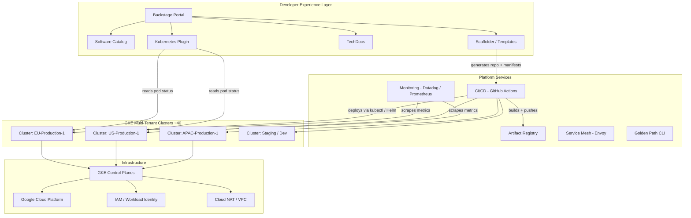

# Spotify's Kubernetes Platform

## 1. Overview

Spotify is a music streaming platform serving 600M+ monthly active users with a microservices architecture running on Google Kubernetes Engine (GKE). The defining challenge of Spotify's infrastructure story is not Kubernetes itself -- it is developer experience at scale. With 2,000+ microservices, 5,000+ engineers, and hundreds of autonomous squads, the problem was never "how do we run containers" but "how do we make 5,000 engineers productive on a shared platform without a 100-person infrastructure team hand-holding every deployment."

Spotify's answer was Backstage -- an internal developer portal that became so successful it was open-sourced in 2020, donated to CNCF in 2022, and is now the de facto standard for internal developer platforms across the industry. Backstage did not emerge from a Kubernetes migration project. It emerged from the realization that Kubernetes alone does not solve developer experience -- it merely shifts complexity from "how do I manage VMs" to "how do I write 15 YAML files correctly."

The Spotify platform story is a canonical study in how platform engineering transforms Kubernetes from an infrastructure technology into a self-service product. The key numbers: ~40 multi-tenant GKE clusters, 270,000+ pods at peak, 2,000+ production services, 125,000+ deployments per year, and a platform team of ~50 engineers serving 5,000+ developers. Spotify's platform achieved a 2x reduction in new engineer onboarding time and reduced the "time from idea to production" from weeks to hours for standard service types.

## 2. Requirements

### Functional Requirements
- Engineers can create, deploy, and operate microservices without infrastructure expertise.
- A centralized catalog provides ownership, documentation, and dependency information for all services.
- Golden path templates generate new services with CI/CD, monitoring, and Kubernetes manifests pre-configured.
- Multi-tenant clusters support hundreds of services per cluster with resource isolation.
- Engineers can view deployment status, logs, metrics, and documentation from a single portal.

### Non-Functional Requirements
- **Scale**: 2,000+ microservices across ~40 GKE clusters, 270,000+ pods at peak.
- **Developer velocity**: New service from template to production in < 1 hour.
- **Onboarding**: New engineer productive in < 1 week (down from 2-3 weeks pre-Backstage).
- **Availability**: Platform services (CI/CD, catalog, portal) at 99.9%+ uptime.
- **Multi-tenancy**: Hundreds of squads sharing clusters without noisy-neighbor incidents.
- **Consistency**: Every service deployed via golden paths follows the same observability, security, and deployment standards.

## 3. High-Level Architecture



## 4. Core Design Decisions

### Backstage as the Single Pane of Glass

Before Backstage, Spotify engineers juggled 10+ tools to manage a single service: GitHub for code, Jenkins/CircleCI for CI, GCP Console for infrastructure, PagerDuty for alerts, Datadog for metrics, Confluence for documentation, and internal tools for service discovery. Backstage unified these into a single portal where an engineer can see their service's code, CI status, deployment state, metrics, documentation, on-call schedule, and dependencies in one place.

The critical insight is that Backstage is not a tool replacement -- it is a tool aggregation layer. It does not replace Datadog or GitHub. It embeds their UIs and data into a single context-aware portal through a [plugin architecture](../10-platform-design/01-internal-developer-platform.md). This means engineers spend less time context-switching and more time on actual development.

### Golden Paths over Mandates

Spotify does not mandate how engineers deploy services. Instead, they provide golden paths -- opinionated, well-tested, and well-documented workflows -- that make the "right way" also the "easy way." A golden path for a new Java microservice generates a repository with a Dockerfile, Helm chart, CI pipeline, Prometheus metrics endpoint, health checks, Kubernetes resource limits, and Datadog integration pre-configured. Engineers who follow the golden path get a production-ready service in minutes. Engineers who deviate are free to do so but lose platform support.

This "guardrails not gates" philosophy is foundational to Spotify's culture of autonomous squads. The platform team provides paved roads; squads choose whether to take them. In practice, 85%+ of new services are created through golden path templates because the alternative (manual setup) is tedious and error-prone. See [self-service abstractions](../10-platform-design/03-self-service-abstractions.md).

### GKE Multi-Tenant Clusters

Spotify runs approximately 40 multi-tenant GKE clusters rather than thousands of single-tenant clusters. Each cluster hosts services from many squads, isolated via namespaces, resource quotas, and network policies. This approach keeps control plane overhead manageable and simplifies cluster upgrades, monitoring, and security policy enforcement. The trade-off is that a cluster-wide incident (e.g., etcd corruption, kube-apiserver overload) affects many teams simultaneously. See [multi-tenancy](../10-platform-design/02-multi-tenancy.md).

The cluster topology follows a regional model: production clusters exist in EU, US, and APAC regions. Staging and development clusters are separate from production. Each cluster runs 2,000-10,000 pods depending on the region and workload mix.

### Software Catalog as the Source of Truth

The software catalog is the foundation of Backstage. Every service, library, API, infrastructure component, and team is registered in the catalog with standardized metadata: ownership (squad + tribe), lifecycle (production, deprecated, experimental), dependencies (upstream and downstream), and deployment targets (cluster + namespace). The catalog is populated from `catalog-info.yaml` files in each service's repository, keeping metadata close to the code and updated through standard pull request workflows.

The catalog powers operational workflows: incident response ("who owns this service?"), dependency tracking ("what breaks if this API changes?"), compliance audits ("which services handle PII?"), and cost allocation ("how much compute does this squad consume?"). See [developer experience](../10-platform-design/04-developer-experience.md).

## 5. Deep Dives

### 5.1 The Backstage Architecture

Backstage consists of three layers:

1. **Frontend (React SPA)**: A single-page application that renders the portal UI. The frontend is built on a plugin architecture where each plugin provides a React component (card, page, or tab) that integrates with a backend service. Plugins include the software catalog browser, TechDocs viewer, CI/CD status, Kubernetes Pod viewer, cost dashboard, and API documentation.

2. **Backend (Node.js)**: A set of backend services that aggregate data from external systems. The backend handles catalog indexing (reading `catalog-info.yaml` from thousands of repositories), authentication (OIDC with Spotify's internal IdP), and plugin APIs (proxying requests to Datadog, GitHub, GKE, etc.). The backend uses a PostgreSQL database for catalog storage and search.

3. **Plugin Ecosystem**: Backstage ships with core plugins (catalog, scaffolder, TechDocs, search) and supports community plugins (200+ in the open-source ecosystem). Spotify maintains internal plugins for GKE integration, cost dashboards, incident management, and squad health metrics. Each plugin is an independent npm package that registers routes, API endpoints, and UI components.

**Catalog ingestion pipeline:**
```
Git repositories (catalog-info.yaml)
  → Backstage Entity Processor (periodic scan, ~5 min interval)
    → Entity validation (schema check)
      → Relationship resolution (owner, dependsOn, consumesAPI)
        → PostgreSQL storage (entities table + search index)
          → Frontend renders catalog with full-text search
```

### 5.2 Golden Path Template System

The Backstage Scaffolder enables template-driven service creation. A golden path template is a parameterized project generator that:

1. **Prompts the developer** for inputs: service name, language (Java/Go/Python), team ownership, GKE cluster target, resource tier (small/medium/large).
2. **Generates the repository** from a cookiecutter/yeoman template: source code skeleton, Dockerfile, Helm chart, `catalog-info.yaml`, CI pipeline definition, monitoring dashboards.
3. **Creates the CI/CD pipeline** in GitHub Actions (or Spotify's internal system) with build, test, security scan, and deploy stages.
4. **Registers the service** in the Backstage catalog automatically.
5. **Provisions the namespace** in the target GKE cluster with appropriate resource quotas and RBAC.

**Template example (simplified):**
```yaml
apiVersion: scaffolder.backstage.io/v1beta3
kind: Template
metadata:
  name: java-microservice
  title: Java Microservice (Golden Path)
  description: Creates a Spring Boot microservice with CI/CD, monitoring, and K8s deployment
spec:
  owner: platform-team
  type: service
  parameters:
    - title: Service Info
      properties:
        name:
          type: string
          description: Service name (kebab-case)
        owner:
          type: string
          ui:field: OwnerPicker
        cluster:
          type: string
          enum: [eu-prod-1, us-prod-1, apac-prod-1]
        resourceTier:
          type: string
          enum: [small, medium, large]
          description: "small: 0.5 CPU, 512Mi | medium: 2 CPU, 2Gi | large: 4 CPU, 8Gi"
  steps:
    - id: generate
      action: fetch:template
      input:
        url: ./skeleton
        values:
          name: ${{ parameters.name }}
          owner: ${{ parameters.owner }}
    - id: publish
      action: publish:github
      input:
        repoUrl: github.com?owner=spotify&repo=${{ parameters.name }}
    - id: register
      action: catalog:register
      input:
        repoContentsUrl: ${{ steps.publish.output.repoContentsUrl }}
        catalogInfoPath: /catalog-info.yaml
```

The template system is the highest-leverage investment Spotify's platform team made. A single golden path template encodes months of accumulated best practices (Dockerfile optimization, Helm chart structure, monitoring configuration, security settings) into a reusable, self-service artifact.

### 5.3 Multi-Tenant GKE Cluster Design

Spotify's multi-tenant GKE clusters enforce isolation through layered mechanisms:

**Namespace isolation**: Each squad or service group gets a dedicated namespace with:
- `ResourceQuota` limiting total CPU, memory, and pod count
- `LimitRange` setting default and max container resource limits
- `NetworkPolicy` implementing default-deny with explicit allowlists
- `RBAC RoleBinding` granting squad members edit access to their namespace only

**Node pool strategy**: Clusters use multiple node pools optimized for different workload profiles:
- **General-purpose pool**: e2-standard-8 instances for stateless microservices
- **Memory-optimized pool**: n2-highmem-16 instances for caching and data processing services
- **Spot pool**: Preemptible/spot instances for batch jobs and non-critical workloads (30-40% cost savings)

See [node pool strategy](../02-cluster-design/02-node-pool-strategy.md) for detailed patterns.

**Resource right-sizing**: Spotify runs a continuous right-sizing program that analyzes actual resource consumption (via Prometheus metrics) against requests/limits and recommends adjustments. The program identified that 60% of services were over-provisioned by 2x or more, and right-sizing saved approximately 20% of cluster compute costs.

**Pod security and admission control**: All tenant namespaces enforce Pod Security Admission at the `restricted` level. Additionally, OPA/Gatekeeper policies enforce:
- Images must come from the approved internal registry (eu.gcr.io/spotify-platform/)
- All containers must have resource requests and limits
- No privileged containers or hostPath volumes
- Required labels: `app`, `squad`, `tribe`, `cost-center`

These policies are managed centrally by the platform team and deployed to all clusters via GitOps. Policy violations are blocked at admission time, providing immediate feedback to developers rather than failing in production. See [policy engines](../07-security-design/02-policy-engines.md).

### 5.4 CI/CD Integration

Spotify's deployment pipeline follows a GitOps-influenced model:

1. **Code push** to GitHub triggers a CI pipeline (GitHub Actions or internal system).
2. **Build stage**: Compile, unit test, security scan (Snyk for dependencies, Trivy for container images).
3. **Package stage**: Build Docker image, push to Artifact Registry, generate Helm chart.
4. **Deploy to staging**: Automatic deployment to the staging cluster namespace.
5. **Integration tests**: Automated tests run against the staging deployment.
6. **Deploy to production**: Canary deployment (5% traffic for 15 minutes, then progressive rollout to 100%).
7. **Post-deploy validation**: Automated checks on error rate, latency, and resource consumption.

The pipeline supports 125,000+ deployments per year across all services. The median deployment time (from push to production traffic) is approximately 20 minutes for services following the golden path. See [CI/CD pipelines](../08-deployment-design/03-cicd-pipelines.md) and [progressive delivery](../08-deployment-design/04-progressive-delivery.md).

### 5.5 Back-of-Envelope Estimation

**Cluster resource math:**
- 40 clusters x average 6,750 pods = 270,000 pods
- Average pod: 0.5 CPU request, 512 Mi memory request
- Total cluster CPU: 270,000 x 0.5 = 135,000 cores
- Total cluster memory: 270,000 x 512 Mi = ~135 TB
- At ~$0.03/core-hour (GKE): 135,000 cores x $0.03 x 8,760 hours = ~$35.5M/year baseline compute

**Backstage catalog scale:**
- 2,000+ services x ~10 entities each (service + API + component + system) = 20,000+ catalog entities
- Catalog refresh: 20,000 entities / 5 min refresh = ~67 entities/sec ingestion rate
- PostgreSQL storage: 20,000 entities x ~10 KB = ~200 MB (trivial)

**Deployment throughput:**
- 125,000 deployments/year = ~342 deployments/day = ~14/hour
- At peak (weekday business hours, ~10 effective hours): ~34 deployments/hour
- Each deployment creates/updates ~5-20 Kubernetes objects (Deployment, Service, ConfigMap, HPA, etc.)
- kube-apiserver write load from deployments: ~34 x 10 = ~340 writes/hour (negligible versus total API traffic)

**Network policy scale:**
- 40 clusters x ~100 namespaces/cluster x 4 policies/namespace = 16,000 network policies fleet-wide
- Cilium eBPF-based enforcement: < 1% CPU overhead per node even at this scale
- Policy updates propagate via GitOps within 5 minutes of merge

**GKE cost estimation:**
- 270,000 pods with average 0.5 CPU request on GKE e2-standard-8 nodes
- Nodes needed: 270,000 x 0.5 / 8 (CPUs per node) / 0.75 (utilization target) = ~22,500 nodes
- GKE management fee: $0.10/hour per cluster x 40 clusters = $4/hour = ~$35K/year
- This is dwarfed by compute cost, confirming that GKE management overhead is negligible at Spotify's scale

## 6. Data Model

### Backstage Catalog Entity (catalog-info.yaml)
```yaml
apiVersion: backstage.io/v1alpha1
kind: Component
metadata:
  name: playlist-service
  description: Manages user playlists and collaborative playlists
  annotations:
    backstage.io/techdocs-ref: dir:.
    github.com/project-slug: spotify/playlist-service
    datadoghq.com/dashboard-url: https://app.datadoghq.com/dashboard/xyz
  tags:
    - java
    - spring-boot
    - grpc
  links:
    - url: https://runbook.spotify.net/playlist-service
      title: Runbook
spec:
  type: service
  lifecycle: production
  owner: squad-playlists
  system: music-discovery
  dependsOn:
    - component:user-service
    - resource:playlist-database
  providesApis:
    - playlist-api
  consumesApis:
    - user-api
    - recommendation-api
```

### Kubernetes Namespace Configuration
```yaml
apiVersion: v1
kind: Namespace
metadata:
  name: squad-playlists
  labels:
    squad: playlists
    tribe: music-discovery
    cost-center: cc-4567
---
apiVersion: v1
kind: ResourceQuota
metadata:
  name: squad-playlists-quota
  namespace: squad-playlists
spec:
  hard:
    requests.cpu: "100"
    requests.memory: 200Gi
    limits.cpu: "200"
    limits.memory: 400Gi
    pods: "500"
    services: "50"
---
apiVersion: v1
kind: LimitRange
metadata:
  name: squad-playlists-limits
  namespace: squad-playlists
spec:
  limits:
    - default:
        cpu: "1"
        memory: 1Gi
      defaultRequest:
        cpu: 250m
        memory: 256Mi
      type: Container
```

### Deployment Resource Configuration (Helm values)
```yaml
# values-production.yaml (generated by golden path template)
replicaCount: 3
image:
  repository: eu.gcr.io/spotify-platform/playlist-service
  tag: "{{ .Values.global.imageTag }}"
resources:
  requests:
    cpu: 500m
    memory: 512Mi
  limits:
    cpu: "1"
    memory: 1Gi
autoscaling:
  enabled: true
  minReplicas: 3
  maxReplicas: 20
  targetCPUUtilization: 70
monitoring:
  enabled: true
  serviceMonitor: true
  datadogAnnotations: true
networkPolicy:
  enabled: true
  allowFrom:
    - namespaceSelector:
        matchLabels:
          role: ingress-gateway
```

## 7. Scaling Considerations

### Observability Integration

Backstage integrates observability tooling into the developer portal, eliminating the need to switch between Grafana, Datadog, and PagerDuty:

**Metrics dashboards in Backstage:**
- Each service's Backstage page includes an embedded Grafana or Datadog dashboard showing key metrics: request rate, error rate, latency percentiles, and resource utilization.
- Dashboards are auto-generated from golden path templates when a service is created. Engineers do not need to configure monitoring -- it works out of the box.
- The dashboard is scoped to the service's namespace and pods, ensuring engineers see only their own metrics.

**Incident integration:**
- PagerDuty integration surfaces active incidents on the service's Backstage page.
- The on-call schedule is visible directly in Backstage, answering "who is on-call for this service right now?" without leaving the portal.
- Post-incident, the service's Backstage page links to the incident retrospective document.

**Cost visibility:**
- Each squad's Backstage page includes a cost widget showing their monthly Kubernetes spend (compute, storage, networking).
- Cost data comes from a Kubecost or GKE billing integration, attributed via namespace labels.
- Right-sizing recommendations are surfaced directly in Backstage: "Your search-ranking service is using 0.3 CPU on average but requesting 2 CPU. Reducing to 0.5 CPU would save $X/month."

This integration transforms Backstage from a deployment tool into the primary operational interface for developers. Engineers open Backstage when they start their day, check service health, review recent deployments, investigate alerts, and optimize costs -- all from one place.

See [monitoring and metrics](../09-observability-design/01-monitoring-and-metrics.md), [logging and tracing](../09-observability-design/02-logging-and-tracing.md), and [cost observability](../09-observability-design/03-cost-observability.md).

### Platform Team Scaling

Spotify's platform team of ~50 engineers supports 5,000+ developers -- a 1:100 ratio. This is achievable only because the platform is self-service. Without Backstage and golden paths, the ratio would need to be 1:20 or worse, requiring a 250+ person platform organization.

The platform team is organized into sub-teams: Backstage core (portal, catalog, scaffolder), CI/CD (pipeline infrastructure), cluster operations (GKE provisioning, upgrades, monitoring), security (policy enforcement, supply chain), and developer advocacy (documentation, training, feedback loops).

### Cluster Scaling

GKE clusters auto-scale using the cluster autoscaler. Node pools scale from a minimum of 3 nodes (for availability) to hundreds of nodes during traffic peaks. Spotify uses node auto-provisioning (NAP) on GKE, which automatically creates new node pools when existing pools cannot satisfy pending pod resource requests. This eliminates the need to pre-define every possible instance type.

Cluster upgrades follow a rolling strategy: nodes are cordoned and drained one at a time, with PodDisruptionBudgets ensuring application availability during upgrades. Spotify upgrades GKE clusters within 2-4 weeks of a new Kubernetes minor release, after validation in staging clusters. See [cluster topology](../02-cluster-design/01-cluster-topology.md).

### Catalog Scaling

As the catalog grows beyond 20,000 entities, search and relationship resolution become the bottleneck. Backstage addresses this with incremental processing (only re-process entities whose source files changed), relationship caching, and PostgreSQL full-text search indexes. At Spotify's scale, catalog queries typically complete in < 200ms.

## 8. Failure Modes & Mitigations

| Failure | Impact | Mitigation |
|---------|--------|------------|
| Backstage portal outage | Developers lose visibility but deployments continue (CI/CD is independent) | Backstage runs as a highly-available deployment on dedicated infrastructure; cached data serves read-only mode during backend failures |
| GKE cluster control plane unavailable | Existing pods continue running but no new deployments or scaling | GKE regional clusters provide 99.95% SLA; multi-region deployment means other regions absorb traffic |
| Golden path template bug | Newly created services have incorrect configuration | Template changes go through PR review and staging validation; existing services are unaffected |
| Catalog sync failure | Stale service metadata in the portal | Incremental sync retries with exponential backoff; last-known-good state is displayed with a staleness indicator |
| Namespace resource quota exhausted | Squad cannot deploy new pods or scale existing services | Alerting on quota utilization at 80%; self-service quota increase requests through Backstage |
| CI/CD pipeline congestion | Deployment queue grows, time-to-production increases | Pipeline workers auto-scale; priority queues ensure production hotfixes bypass the queue |
| Node pool capacity exhaustion | Pods stuck in Pending state | Cluster autoscaler provisions new nodes; NAP creates new node pools if existing types are insufficient |

### Cascade Failure Scenario

Consider a scenario where a popular shared library introduces a regression:

1. **Trigger**: A new version of the `spotify-commons` library (used by 800+ services) introduces a memory leak.
2. **Propagation**: As services rebuild and redeploy (automated dependency updates), pods begin OOM-killing.
3. **Amplification**: OOM kills trigger restarts, which trigger re-scheduling, which increases cluster autoscaler activity.
4. **Detection**: Backstage dependency graph shows 800+ services depend on the library. Monitoring dashboards in Backstage surface the correlated OOM spike.
5. **Mitigation**: Platform team pins the library version in the golden path template. Affected services roll back to the previous image tag via CI/CD. The library team patches the leak.
6. **Prevention**: Backstage TechDocs are updated with a "dependency update policy" requiring canary testing for shared libraries with > 100 dependents.

## 9. Key Takeaways

- Backstage is not just a portal -- it is the connective tissue between Kubernetes, CI/CD, monitoring, documentation, and organizational metadata. Its value compounds as more plugins and integrations are added.
- Golden paths achieve 85%+ adoption not through mandates but through convenience. Making the right thing the easy thing is the core platform engineering principle.
- Multi-tenant GKE clusters (40 clusters for 2,000+ services) are more operationally efficient than single-tenant clusters (2,000+ clusters), but require robust namespace isolation, resource quotas, and network policies.
- The software catalog is the highest-value Backstage feature. Without it, Backstage is just a portal. With it, Backstage becomes the organizational nervous system that connects code, people, infrastructure, and operations.
- A 1:100 platform-to-developer ratio is achievable only with radical self-service. Every manual process that requires a platform engineer is a scaling bottleneck.
- Right-sizing programs driven by Prometheus metrics data consistently find 50-60% over-provisioning. Automated right-sizing recommendations recoup 20%+ of compute spend.
- Backstage's open-source ecosystem (2,600+ adopters, 200+ plugins) means Spotify's internal platform innovation benefits the entire industry, and community plugins flow back to improve Spotify's platform.
- The platform team's investment in developer advocacy (documentation, training, feedback loops, internal tech talks) is as important as the tooling itself. A great platform with poor documentation has low adoption.

## 10. Related Concepts

- [Internal Developer Platform (Backstage architecture, plugin ecosystem, golden paths)](../10-platform-design/01-internal-developer-platform.md)
- [Multi-Tenancy (namespace isolation, resource quotas, virtual clusters)](../10-platform-design/02-multi-tenancy.md)
- [Self-Service Abstractions (templates, platform APIs)](../10-platform-design/03-self-service-abstractions.md)
- [Developer Experience (cognitive load, paved roads)](../10-platform-design/04-developer-experience.md)
- [Node Pool Strategy (instance types, spot pools, auto-provisioning)](../02-cluster-design/02-node-pool-strategy.md)
- [CI/CD Pipelines (build, test, deploy automation)](../08-deployment-design/03-cicd-pipelines.md)
- [Progressive Delivery (canary deployments, traffic shifting)](../08-deployment-design/04-progressive-delivery.md)
- [RBAC and Access Control (namespace-scoped roles)](../07-security-design/01-rbac-and-access-control.md)

## 11. Comparison with Related Systems

| Aspect | Spotify (Backstage + GKE) | Airbnb (OneTouch + EKS) | Pinterest (Custom + EKS) |
|--------|--------------------------|------------------------|-------------------------|
| Developer portal | Backstage (open-sourced) | Internal tool (OneTouch) | Internal tooling |
| Cluster provider | GKE (~40 clusters) | EKS (~100 clusters) | EKS |
| Service count | 2,000+ microservices | 1,000+ services | 1,000+ services |
| Deployment model | GitOps-influenced CI/CD | OneTouch + Kubernetes API | CI/CD pipeline |
| Service catalog | Backstage Catalog (catalog-info.yaml) | Internal service registry | Internal |
| Multi-tenancy | Namespace per squad, shared clusters | Namespace per service | Namespace per team |
| Golden paths | Backstage Scaffolder templates | kube-gen templates | Internal templates |
| Cost optimization | Right-sizing program + spot pools | Dynamic cluster scaling | Spot instances + bin-packing |
| Key differentiator | Open-source developer portal ecosystem | Multi-cluster abstraction | Cost efficiency at scale |

### Architectural Lessons

1. **The developer portal is the platform's user interface.** Without Backstage, Spotify's platform would be a collection of tools that engineers must discover and learn independently. The portal creates a unified experience that makes the platform discoverable and usable.

2. **Catalog-info.yaml as code keeps metadata fresh.** Storing service metadata in the repository (not a separate database) means it is updated alongside code changes, reviewed in PRs, and versioned in Git. This solves the "stale wiki" problem that plagues service registries.

3. **Golden paths must be maintained like products.** An outdated golden path template is worse than no template -- it generates services with obsolete configurations. Spotify invests significant platform team time in keeping templates current with the latest security patches, library versions, and Kubernetes best practices.

4. **Multi-tenant clusters require continuous investment in isolation.** Namespace isolation is not a one-time setup. It requires ongoing monitoring (quota utilization, noisy neighbors), policy enforcement (network policies, admission controllers), and capacity planning (node pool sizing, cluster autoscaler tuning).

5. **Platform adoption is earned, not mandated.** Spotify's autonomous squad culture means the platform team cannot force adoption. They must build a platform so good that squads choose to use it. This product mindset -- user research, feedback loops, NPS scores for internal tools -- is what separates successful platform teams from infrastructure teams that build tools nobody uses.

## 12. Source Traceability

| Section | Source |
|---------|--------|
| Backstage origin and architecture | Spotify Engineering Blog: "What the Heck is Backstage Anyway?" (2020), "How We Use Backstage at Spotify" (2020) |
| GKE multi-tenant platform, 40 clusters, 270K pods | Altoros: "Spotify Runs 1,600+ Production Services on Kubernetes" (citing KubeCon EU 2019 talk by Spotify SRE team) |
| Golden paths and developer experience | Spotify Engineering Blog: "Designing a Better Kubernetes Experience for Developers" (2021) |
| Backstage CNCF graduation, plugin ecosystem | CNCF Backstage project page, BackstageCon talks (2022-2025) |
| Software catalog architecture | Backstage.io documentation, Backstage 101 (backstage.spotify.com) |
| Platform team structure and ratios | InfoQ presentation: "Demystifying Kubernetes Platforms with Backstage" (DockerCon 2023) |
| Engineer onboarding reduction (2x) | getdx.com: "What is Spotify Backstage and how does it work" (2025) |
