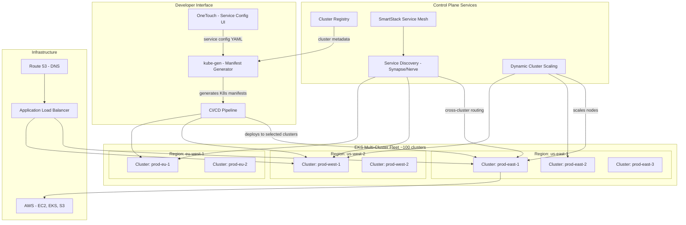

# Airbnb's Multi-Cluster Kubernetes Architecture

## 1. Overview

Airbnb operates one of the largest multi-cluster Kubernetes deployments in the industry: 7,000+ nodes across nearly 100 clusters, supporting 1,000+ services with 125,000+ deployments per year. The defining architectural challenge was not adopting Kubernetes -- it was building a deployment abstraction layer (OneTouch) that lets 1,000+ engineers deploy to a multi-cluster environment without understanding cluster topology, namespace configuration, or Kubernetes internals.

Airbnb's migration from manually orchestrated EC2 instances to Kubernetes was driven by the scaling limits of their previous infrastructure. As the company grew from hundreds to thousands of microservices, the operational cost of managing individual EC2 instances, AMIs, and deployment scripts became unsustainable. Kubernetes provided the orchestration layer, but the real innovation was OneTouch -- a service configuration interface that generates complete Kubernetes manifests from a single high-level YAML file, abstracting away the 15-20 Kubernetes objects typically required for a production service.

The multi-cluster architecture treats clusters as "giant pools of compute and memory" rather than deployment targets. Engineers deploy to a service, not to a cluster. OneTouch handles cluster selection, namespace creation, resource allocation, and traffic routing transparently. This abstraction enabled Airbnb to scale from a handful of clusters to nearly 100 without increasing the cognitive load on application developers. SmartStack, Airbnb's service mesh, provides cross-cluster service discovery and load balancing, making the multi-cluster topology invisible to application code.

## 2. Requirements

### Functional Requirements
- Engineers can deploy services through a single configuration file (OneTouch) without Kubernetes expertise.
- Services are automatically distributed across multiple clusters based on resource availability and isolation requirements.
- Cross-cluster service discovery enables any service to call any other service regardless of cluster placement.
- Dynamic cluster scaling adjusts node counts based on real-time demand.
- Multi-region deployment supports failover and latency optimization.

### Non-Functional Requirements
- **Scale**: 7,000+ nodes, ~100 clusters, 1,000+ services, 125,000+ deployments/year.
- **Deployment velocity**: Median deployment time (code push to production traffic) < 30 minutes.
- **Availability**: 99.99% for critical path services (search, booking, payments).
- **Cross-cluster latency**: Service-to-service calls across clusters < 5ms additional overhead vs. intra-cluster.
- **Cluster operations**: Node scaling latency < 5 minutes for cluster autoscaler response.
- **Blast radius**: Single cluster failure affects < 15% of total production capacity.

## 3. High-Level Architecture



## 4. Core Design Decisions

### OneTouch: High-Level Service Abstraction

OneTouch is Airbnb's internal service configuration interface that abstracts Kubernetes complexity behind a single YAML file. Engineers define what they want (service name, resource tier, scaling parameters, environment) -- not how to achieve it (Deployments, Services, HPA, PDB, NetworkPolicy, ConfigMaps, ServiceAccounts). The `kube-gen` tool takes the OneTouch configuration and generates the complete set of Kubernetes objects, including boilerplate that every service needs: health check probes, metrics annotations, log shipping sidecars, service mesh integration, and network policies.

This abstraction was critical for adoption. Airbnb has 1,000+ engineers who need to deploy services but should not need to understand Kubernetes API objects. OneTouch reduced the learning curve from "understand Kubernetes" to "fill in 10 fields in a YAML file." See [self-service abstractions](../10-platform-design/03-self-service-abstractions.md).

**OneTouch impact metrics:**
- Before OneTouch: Creating a new service required 3-5 days of YAML configuration, PR reviews with the infrastructure team, and manual cluster selection. Engineers needed to understand 15+ Kubernetes resource types.
- After OneTouch: New service creation takes < 1 hour. Engineers configure 10 high-level fields; kube-gen generates 15-20 Kubernetes objects automatically.
- Adoption: 95%+ of services at Airbnb are deployed through OneTouch. The remaining 5% are specialized workloads (ML training, batch processing) that require custom Kubernetes configurations.

### Clusters as Compute Pools

Airbnb treats clusters as interchangeable compute pools rather than named deployment targets. A service declares its resource requirements, and the platform selects which cluster(s) to deploy to based on available capacity, isolation constraints, and regional requirements. This design enables:

- **Cluster draining**: When a cluster needs maintenance or upgrade, services are migrated to other clusters without developer intervention.
- **Capacity balancing**: New clusters can be added to a region, and workloads redistribute automatically.
- **Blast radius control**: Critical services are spread across multiple clusters so that a single cluster failure never takes down more than a fraction of any service.

This approach differs from organizations that treat clusters as environments (e.g., "staging cluster," "production cluster"). Airbnb has many production clusters, and a service may run across 3-5 of them simultaneously. See [multi-cluster architecture](../02-cluster-design/03-multi-cluster-architecture.md).

### Namespace-per-Service Model

Each service gets its own namespace in every cluster it is deployed to. This provides natural isolation boundaries: RBAC scopes access to the service's namespace, resource quotas prevent any single service from consuming disproportionate cluster resources, and network policies restrict lateral movement. The namespace name follows a convention: `{service-name}` in production, `{service-name}-staging` in staging environments.

The namespace-per-service model (as opposed to namespace-per-team) was chosen because Airbnb's microservices architecture means a single team may own 5-10 services with different resource profiles, scaling characteristics, and blast radius requirements. Isolating at the service level provides finer-grained control. See [multi-tenancy](../10-platform-design/02-multi-tenancy.md).

### SmartStack for Cross-Cluster Service Discovery

SmartStack is Airbnb's service mesh, consisting of two components: **Nerve** (registration) and **Synapse** (discovery). Every service instance registers itself in a service registry (backed by ZooKeeper) via Nerve. When a service needs to call another service, Synapse provides a local proxy that routes to healthy instances, regardless of which cluster they run in.

SmartStack was originally built for the pre-Kubernetes infrastructure and was a key enabler of the Kubernetes migration. Because service discovery was already decoupled from infrastructure placement, migrating a service from EC2 to Kubernetes did not require any changes to its callers -- they continued to discover the service through SmartStack. This decoupling meant migration could happen service-by-service without coordination across teams.

### Resource Management and Standardization

Airbnb standardizes resource management across all services through kube-gen defaults:

- **Default resource requests**: Every service gets reasonable defaults based on its language and framework. A Java/Dropwizard service defaults to 1 CPU / 2 Gi memory request; a Go service defaults to 0.25 CPU / 256 Mi.
- **PodDisruptionBudgets**: Every production service gets a PDB with `minAvailable: 80%` by default, ensuring availability during cluster maintenance and node upgrades.
- **TopologySpreadConstraints**: Production services with 3+ replicas are automatically spread across availability zones (`maxSkew: 1` on `topology.kubernetes.io/zone`).
- **Health checks**: kube-gen adds standardized liveness and readiness probes based on the framework. Dropwizard services get `/healthcheck` probes; Spring Boot services get `/actuator/health`.
- **Priority classes**: Production services run at `system-cluster-critical` priority; staging services at `default` priority. During capacity pressure, staging pods are preempted before production pods.

These defaults mean that an engineer creating a new service via OneTouch gets a production-ready deployment without understanding Kubernetes resource management. The defaults encode the operational lessons learned across thousands of deployments. Engineers can override any default, but few need to.

## 5. Deep Dives

### 5.1 The kube-gen Manifest Generator

`kube-gen` is the internal tool that transforms high-level OneTouch service definitions into complete Kubernetes manifest sets. A typical service definition:

```yaml
# OneTouch service configuration (simplified)
service:
  name: search-ranking
  team: search-relevance
  language: java

environment:
  staging:
    replicas: 2
    resources:
      cpu: "1"
      memory: 2Gi
  production:
    replicas: 10
    resources:
      cpu: "4"
      memory: 8Gi
    autoscaling:
      min: 10
      max: 50
      targetCPU: 70

networking:
  ports:
    - name: grpc
      port: 9090
    - name: http
      port: 8080
  ingress: internal-only

dependencies:
  - search-index-service
  - user-profile-service
  - feature-store
```

From this 30-line configuration, `kube-gen` produces 15-20 Kubernetes objects:

- **Deployment** with proper resource requests/limits, affinity rules, and topology spread constraints
- **HorizontalPodAutoscaler** configured for CPU-based scaling
- **PodDisruptionBudget** ensuring at least 80% of replicas are available during disruptions
- **Service** (ClusterIP) for in-cluster traffic
- **NetworkPolicy** allowing traffic from dependent services and blocking everything else
- **ServiceAccount** with minimal RBAC permissions
- **ConfigMap** with environment-specific configuration
- **ServiceMonitor** for Prometheus metric scraping
- Sidecar injection annotations for SmartStack proxy and log shipping

### 5.2 Dynamic Cluster Scaling

Airbnb's infrastructure spans thousands of nodes that must scale dynamically with demand -- traffic patterns vary dramatically between weekdays and weekends, and between peak booking seasons and off-peak periods. The dynamic cluster scaling system operates at two levels:

**Pod-level autoscaling**: HPA scales individual services based on CPU utilization (default) or custom metrics (request rate, queue depth). Most services use CPU-based scaling with a 70% target utilization.

**Node-level autoscaling**: The Kubernetes Cluster Autoscaler monitors pending pods and scales node groups up (when pods are unschedulable) or down (when nodes are underutilized for > 10 minutes). Airbnb tuned the scale-down delay to prevent thrashing during transient load spikes.

**Cluster-level decisions**: A centralized scaling controller monitors aggregate cluster utilization across the fleet and makes decisions about:
- When to add new node groups (instance type diversification for spot availability)
- When to create entirely new clusters (when existing clusters approach etcd or apiserver limits)
- When to drain and decommission clusters (during fleet consolidation)

**Krispr approach**: Airbnb developed Krispr (Kubernetes Resource Infrastructure Provider) to manage infrastructure-as-code for their cluster fleet. Krispr declaratively defines cluster configurations, node pool specifications, and add-on installations, enabling consistent cluster provisioning across the fleet.

### 5.3 Migration from Mesos / EC2

Airbnb's migration to Kubernetes was a multi-year effort. The strategy:

1. **Phase 1 -- New services on Kubernetes**: All new services were deployed to Kubernetes from the start, establishing patterns and building platform tooling.
2. **Phase 2 -- Stateless service migration**: Existing stateless services were migrated using a traffic-shifting approach: deploy the service to Kubernetes, route 1% of traffic, validate metrics, gradually increase to 100%, then decommission the EC2 instances.
3. **Phase 3 -- Stateful and complex services**: Services with state, custom networking, or unique dependencies were migrated last with custom plans.

SmartStack was the critical enabler. Because callers discovered services through SmartStack (not by IP address or DNS directly tied to infrastructure), migrating a service from EC2 to Kubernetes was transparent to its callers. The service simply registered its new Kubernetes pod IPs in the SmartStack registry, and callers routed to them automatically. See [service mesh](../04-networking-design/03-service-mesh.md).

**Migration timeline and lessons:**
- Phase 1 took approximately 6 months to establish tooling, golden paths, and confidence.
- Phase 2 took approximately 12 months, migrating hundreds of stateless services. The first 10 services took 2-3 weeks each; the last 100 services took 2-3 days each as patterns matured.
- Phase 3 is ongoing for the most complex stateful services.
- Key lesson: Service discovery decoupling (SmartStack) was the single most important architectural decision that enabled smooth migration. Without it, every migration would require coordinating caller-side changes.

### 5.4 Multi-Region Failover

Airbnb deploys to multiple AWS regions (us-east-1, us-west-2, eu-west-1) for latency optimization and disaster recovery. The failover architecture:

- **Active-active**: Critical services run in all regions simultaneously. Route 53 routes users to the nearest region based on latency.
- **Regional isolation**: Each region is a failure domain. A regional failure (e.g., us-east-1 outage) does not affect other regions.
- **Cross-region replication**: Stateful services (databases, caches) replicate across regions with eventual consistency. The replication lag is < 1 second for critical data paths.
- **Failover automation**: Automated health checks detect regional degradation and shift traffic to healthy regions within 2-3 minutes through Route 53 health checks and DNS-based failover.

### 5.5 CI/CD Integration and Deployment Pipeline

Airbnb's deployment pipeline integrates OneTouch service definitions with a multi-cluster deployment strategy:

**Pipeline stages:**

1. **Code push**: Engineer pushes code to the service repository (GitHub).
2. **CI build**: Automated pipeline compiles code, runs unit and integration tests, performs security scanning (dependency audit, container image scan).
3. **Artifact creation**: Docker image built and pushed to an internal container registry. Helm chart or raw manifests generated by kube-gen from the OneTouch configuration.
4. **Canary deployment**: A single replica is deployed to one production cluster (the canary cluster). SmartStack routes a small percentage of traffic (1-5%) to the canary instance.
5. **Automated validation**: Metrics comparison between canary and baseline (error rate, latency P50/P95/P99, business KPIs). If the canary degrades any metric beyond thresholds, the deployment is automatically rolled back.
6. **Progressive rollout**: If canary passes (15-30 minute observation window), the deployment rolls out to remaining clusters in waves (25% -> 50% -> 100%).
7. **Post-deployment monitoring**: Automated alerts track the service for 2 hours post-deployment, with automatic rollback if anomalies are detected.

This pipeline enables 125,000+ deployments per year (approximately 342/day) with a median time from push to full production rollout of approximately 45 minutes. The rollback rate is < 3%, reflecting the effectiveness of the canary validation stage.

**Multi-cluster deployment ordering:**
- Services in the canary cluster receive traffic first.
- If the canary passes, clusters in the primary region (us-east-1) receive the deployment.
- Then secondary regions (us-west-2, eu-west-1) receive the deployment.
- At each stage, SmartStack health checks verify that the new version is serving correctly before proceeding.

See [CI/CD pipelines](../08-deployment-design/03-cicd-pipelines.md) and [progressive delivery](../08-deployment-design/04-progressive-delivery.md).

### 5.6 Observability Across the Fleet

Observability at Airbnb's scale (7,000+ nodes, ~100 clusters) requires a fleet-wide approach:

**Metrics aggregation:**
- Prometheus runs on each cluster, scraping pod-level and node-level metrics.
- Thanos (or a similar long-term storage backend) aggregates metrics from all clusters into a centralized query layer.
- Engineers query metrics across all clusters from a single Grafana dashboard, filtered by service name (not cluster name). This abstracts the multi-cluster topology from developers.

**Distributed tracing:**
- SmartStack sidecars propagate trace context (W3C Trace Context headers) across service calls.
- Traces span multiple clusters (service A in cluster-1 calls service B in cluster-3), and the centralized tracing backend (Jaeger or equivalent) stitches these spans into a single trace.
- Trace-based debugging replaces single-service debugging: engineers can see the full request path across 10+ services in different clusters.

**Centralized logging:**
- Logs are shipped from each cluster via a DaemonSet (FluentBit) to a centralized logging backend.
- Logs are tagged with cluster name, namespace, pod name, and service name, enabling cross-cluster log correlation.
- Engineers search logs by service name, automatically spanning all clusters where the service is deployed.

**Alerting:**
- Alerts are defined per-service (not per-cluster). An alert for "search-ranking error rate > 1%" fires regardless of which cluster the error originates from.
- PagerDuty integration routes alerts to the owning team based on the service's ownership metadata in the service registry.

**Observability scale math:**
- ~100 clusters x 30 pods/node x 70 nodes/cluster = ~210,000 pods
- Average 20 metrics per pod x 5 labels = ~21M active time series fleet-wide
- Thanos compaction and downsampling reduces long-term storage cost by 10-20x
- Log volume: ~210,000 pods x 10 log lines/sec = ~2.1M log lines/sec = ~180 billion log lines/day
- Centralized tracing: ~50,000 requests/sec x 5 spans/request = ~250,000 spans/sec

These numbers validate the need for fleet-level observability infrastructure (Thanos for metrics, a scalable log backend, and sampling for traces) rather than per-cluster observability tools.

See [monitoring and metrics](../09-observability-design/01-monitoring-and-metrics.md) and [logging and tracing](../09-observability-design/02-logging-and-tracing.md).

### 5.7 Back-of-Envelope Estimation

**Cluster fleet sizing:**
- ~100 clusters x 70 nodes (average) = 7,000 nodes
- Average node: m5.4xlarge (16 vCPU, 64 GB memory)
- Total fleet compute: 7,000 x 16 = 112,000 vCPUs, 7,000 x 64 GB = 448 TB memory
- At ~75% utilization target: 84,000 effective vCPUs, 336 TB effective memory

**Deployment throughput:**
- 125,000 deployments/year = ~342/day = ~34/hour during business hours
- Each deployment touches 2-5 clusters (multi-cluster spread)
- Total cluster-level deployments: ~34 x 3.5 = ~119 cluster deploys/hour
- kube-apiserver write load per cluster: ~1.2 deploy/hour/cluster (easily manageable)

**Service mesh overhead:**
- SmartStack sidecar per pod: ~50 MB memory, ~0.05 CPU
- 7,000 nodes x ~30 pods/node = ~210,000 pods
- Sidecar overhead: 210,000 x 50 MB = ~10.5 TB (significant -- approximately 2.3% of fleet memory)

## 6. Data Model

### OneTouch Service Configuration
```yaml
# Stored in service repository: .onetouch/config.yaml
apiVersion: onetouch.airbnb.com/v1
kind: ServiceConfig
metadata:
  name: search-ranking
  team: search-relevance
  oncall: search-ranking-oncall
spec:
  language: java
  framework: dropwizard
  ports:
    grpc: 9090
    http: 8080
    admin: 9091
  environments:
    staging:
      clusters: [staging-east-1]
      replicas: 2
      resources: { cpu: "1", memory: 2Gi }
    canary:
      clusters: [prod-east-1]
      replicas: 1
      resources: { cpu: "4", memory: 8Gi }
    production:
      clusters: [prod-east-1, prod-east-2, prod-west-1]
      replicas: { min: 10, max: 50 }
      resources: { cpu: "4", memory: 8Gi }
      autoscaling:
        metric: cpu
        target: 70
  dependencies:
    upstream: [search-index, user-profile, feature-store]
    downstream: [api-gateway, search-api]
```

### Cluster Registry
```yaml
# Centralized cluster metadata
apiVersion: registry.airbnb.com/v1
kind: Cluster
metadata:
  name: prod-east-1
spec:
  provider: eks
  region: us-east-1
  kubernetesVersion: "1.29"
  nodeGroups:
    - name: general
      instanceType: m5.4xlarge
      min: 20
      max: 200
      capacityType: on-demand
    - name: spot
      instanceTypes: [m5.4xlarge, m5a.4xlarge, m5d.4xlarge]
      min: 10
      max: 150
      capacityType: spot
  capacity:
    totalCPU: 3200
    totalMemory: 12800Gi
    allocatedCPU: 2400
    allocatedMemory: 9600Gi
    utilizationPercent: 75
  status: healthy
  lastUpgraded: "2025-11-15T00:00:00Z"
```

## 7. Scaling Considerations

### Security and Access Control

Airbnb's multi-cluster environment requires a robust security model:

- **Service account injection**: Airbnb's custom control plane injects specific service account tokens into pods, ensuring each service has the minimum IAM permissions required for its operation. This follows the principle of least privilege across the entire fleet.
- **Network policies per namespace**: Each service's namespace includes default-deny network policies generated by kube-gen. Allowed traffic paths are derived from the service's declared dependencies in the OneTouch configuration.
- **Image scanning**: Container images are scanned for vulnerabilities before being pushed to the internal registry. Images with critical CVEs are blocked from deployment.
- **Secrets management**: Secrets are stored in AWS Secrets Manager and injected via the CSI Secrets Store Driver, not stored in etcd. This ensures secrets are encrypted, auditable, and rotatable without pod restarts.

See [RBAC and access control](../07-security-design/01-rbac-and-access-control.md) and [secrets management](../07-security-design/04-secrets-management.md).

### API Server Scaling

With ~100 clusters, kube-apiserver scaling is a primary concern. Airbnb's mitigations:
- **Watch bookmark optimization**: Reduces re-list storms when apiserver connections are reset.
- **API priority and fairness**: Ensures high-priority requests (pod scheduling, health checks) are not starved by bulk queries (list all pods, watch all events).
- **Custom resource caching**: Controllers that read frequently but write rarely use informer caches to minimize API server load.
- **etcd compaction**: Regular compaction and defragmentation prevent etcd from growing unbounded. Etcd size is monitored with alerts at 4 GB and 6 GB.

### Cross-Cluster Networking

SmartStack's cross-cluster service discovery introduces a fan-out problem: a service with 100 instances across 5 clusters must be discoverable from any cluster. SmartStack uses ZooKeeper as the backing store, with each cluster running local ZooKeeper observers that replicate from a central ZooKeeper ensemble. This ensures sub-second propagation of instance registration/deregistration while keeping reads local.

### Fleet Operations

Operating ~100 clusters requires fleet-level tooling:
- **Rolling upgrades**: Kubernetes version upgrades propagate from canary clusters (1-2 clusters) to staging clusters to production clusters over 2-3 weeks. If a canary cluster upgrade causes issues, the rollout halts.
- **Configuration drift detection**: A fleet controller continuously compares cluster configurations against the desired state in the cluster registry, alerting on drift.
- **Centralized monitoring**: A single Prometheus/Thanos deployment aggregates metrics from all clusters, enabling cross-cluster dashboards and alerting.

See [cluster topology](../02-cluster-design/01-cluster-topology.md) and [monitoring and metrics](../09-observability-design/01-monitoring-and-metrics.md).

## 8. Failure Modes & Mitigations

| Failure | Impact | Mitigation |
|---------|--------|------------|
| Single cluster failure | Services on that cluster experience downtime | Multi-cluster deployment ensures replicas exist on other clusters; SmartStack routes traffic to healthy instances |
| SmartStack registry (ZooKeeper) failure | Service discovery is stale | Local ZooKeeper observers serve cached data; services continue routing to last-known-good instance list |
| kube-gen generates invalid manifests | Deployment fails at apply time | Manifest validation in CI pipeline (kubeval + OPA policy checks) catches errors before deployment |
| Cluster autoscaler lag | Pods stuck Pending during traffic spike | Over-provision 15-20% headroom; use pod priority to preempt low-priority workloads during capacity crunch |
| Cross-region network partition | Services in affected region cannot call services in other regions | Regional isolation ensures each region is self-sufficient for critical path; cross-region calls are for non-critical enrichment |
| Spot instance interruption | Pods on spot nodes are terminated | PodDisruptionBudgets ensure minimum availability; graceful termination handlers complete in-flight requests; on-demand nodes provide baseline capacity |
| OneTouch configuration error | Service deployed with wrong resources or scaling parameters | Configuration review in PR process; staging deployment validates configuration before production |

### Cascade Failure Scenario

Consider a cascading failure during a Black Friday booking spike:

1. **Trigger**: Search traffic increases 5x from normal levels. HPA scales search-ranking pods from 10 to 50 per cluster.
2. **Amplification**: Cluster autoscaler provisions new nodes, but EC2 capacity in us-east-1 is constrained. Nodes take 5-7 minutes to provision instead of the usual 2-3 minutes.
3. **Spillover**: Pending pods in us-east-1 clusters trigger SmartStack to route more traffic to us-west-2, which also begins to saturate.
4. **Database pressure**: Search-ranking scaling increases database query volume 5x, causing connection pool exhaustion.
5. **Mitigation chain**: Rate limiting at the API gateway caps request rate. Circuit breakers on database calls prevent connection pool exhaustion. Priority-based pod scheduling evicts low-priority batch jobs to free capacity for search-ranking. Traffic is globally load-balanced to distribute the spike across all regions.

## 9. Key Takeaways

- OneTouch/kube-gen transforms Kubernetes from a complex orchestrator into a transparent infrastructure layer. Engineers define what they want; the platform figures out how.
- Treating clusters as interchangeable compute pools enables fleet-level operations (draining, rebalancing, upgrading) without developer coordination.
- Namespace-per-service provides finer isolation granularity than namespace-per-team, at the cost of more namespaces to manage (mitigated by automation).
- SmartStack (or any service mesh) is the critical enabler for multi-cluster architectures. Without transparent cross-cluster service discovery, every multi-cluster deployment becomes a manual routing exercise.
- CI/CD integration with multi-cluster deployment requires canary validation at each cluster before progressing. Airbnb's 125,000+ annual deployments demonstrate that high deployment velocity is achievable in a multi-cluster environment with proper automation.
- Fleet-wide observability (metrics, logs, traces) must abstract cluster topology from developers. Engineers should query by service name, not by cluster name. Thanos (or equivalent) provides this abstraction for Prometheus metrics.
- Security at the fleet level requires automation: service account injection, network policy generation from dependency declarations, image scanning, and secrets rotation must all be automated to operate consistently across ~100 clusters.
- The Mesos/EC2-to-Kubernetes migration was successful because SmartStack decoupled service discovery from infrastructure placement, enabling incremental migration without caller-side changes.
- Dynamic cluster scaling at fleet level requires monitoring not just pod utilization but aggregate cluster utilization, etcd size, and apiserver latency across the entire fleet.

## 10. Related Concepts

- [Multi-Cluster Architecture (federation, fleet topology, cross-cluster networking)](../02-cluster-design/03-multi-cluster-architecture.md)
- [Multi-Tenancy (namespace isolation models, RBAC, resource quotas)](../10-platform-design/02-multi-tenancy.md)
- [Self-Service Abstractions (OneTouch-style high-level APIs)](../10-platform-design/03-self-service-abstractions.md)
- [Service Mesh (cross-cluster discovery, traffic management)](../04-networking-design/03-service-mesh.md)
- [Horizontal Pod Autoscaling (HPA configuration, custom metrics)](../06-scaling-design/01-horizontal-pod-autoscaling.md)
- [Vertical and Cluster Autoscaling (node provisioning, scale-down policies)](../06-scaling-design/02-vertical-and-cluster-autoscaling.md)
- [Cluster Topology (regional distribution, control plane sizing)](../02-cluster-design/01-cluster-topology.md)
- [Monitoring and Metrics (fleet-wide observability)](../09-observability-design/01-monitoring-and-metrics.md)

## 11. Comparison with Related Systems

| Aspect | Airbnb (OneTouch + EKS) | Spotify (Backstage + GKE) | Pinterest (Custom + EKS) |
|--------|------------------------|--------------------------|-------------------------|
| Cluster count | ~100 clusters | ~40 clusters | Multiple clusters |
| Abstraction layer | OneTouch + kube-gen | Backstage Scaffolder | Internal tooling |
| Service mesh | SmartStack (custom) | Envoy-based | Envoy-based |
| Cluster strategy | Clusters as compute pools | Multi-tenant shared clusters | Cost-optimized clusters |
| Migration path | EC2/Mesos to EKS | GCE to GKE | EC2 to EKS |
| Service discovery | SmartStack (ZooKeeper-backed) | Kubernetes DNS + Envoy | Kubernetes DNS + Envoy |
| Multi-region | Active-active (3 regions) | Active-active (3 regions) | Multi-region |
| Scaling approach | Fleet-level dynamic scaling | Per-cluster autoscaling | Cost-optimized autoscaling |
| Key differentiator | Multi-cluster abstraction | Developer portal ecosystem | Cost efficiency |

### Architectural Lessons

1. **The abstraction layer (OneTouch/kube-gen) is the adoption enabler.** Kubernetes adoption at scale requires hiding Kubernetes. Engineers should not write Kubernetes YAML -- they should describe their service, and the platform should generate the YAML. This is the common pattern across all successful large-scale Kubernetes adopters.

2. **Multi-cluster requires a service mesh.** Without transparent cross-cluster service discovery, every service must be aware of which cluster its dependencies are in. This couples application code to infrastructure topology and makes cluster operations (migration, draining, scaling) painful. SmartStack's decoupling of discovery from placement is the fundamental enabler.

3. **Namespace-per-service scales better than namespace-per-team for microservices architectures.** When teams own many services with different isolation requirements, per-service namespaces provide the right granularity. The overhead of managing more namespaces is absorbed by automation.

4. **Fleet-level operations require fleet-level tooling.** Operating 100 clusters with per-cluster tooling is infeasible. Airbnb's cluster registry, rolling upgrade system, and drift detection operate at fleet level -- treating the cluster fleet as a single manageable entity.

5. **Migration success depends on decoupling service discovery from infrastructure.** Airbnb's migration was smooth because SmartStack meant callers did not need to know whether a service was on EC2 or Kubernetes. Any migration strategy should start by ensuring service discovery is infrastructure-agnostic.

## 12. Source Traceability

| Section | Source |
|---------|--------|
| Multi-cluster fleet (7,000+ nodes, ~100 clusters) | Altoros: "Airbnb Deploys 125,000+ Times per Year with Multicluster Kubernetes" |
| OneTouch and kube-gen | InfoQ: "Develop Hundreds of Kubernetes Services at Scale with Airbnb" (KubeCon talk) |
| Dynamic cluster scaling, Krispr | Airbnb Tech Blog: "Dynamic Kubernetes Cluster Scaling at Airbnb" by David Morrison; "A Krispr Approach to Kubernetes Infrastructure" |
| SmartStack service mesh | Airbnb Tech Blog: SmartStack documentation; Kubernetes Podcast from Google: Episode 120 - Airbnb, with Melanie Cebula |
| Namespace-per-service model, standardized environments | InfoQ: "How Airbnb Simplified the Kubernetes Workflow for 1000+ Engineers" |
| Multi-region architecture | Airbnb engineering talks on multi-cluster Kubernetes deployment |
