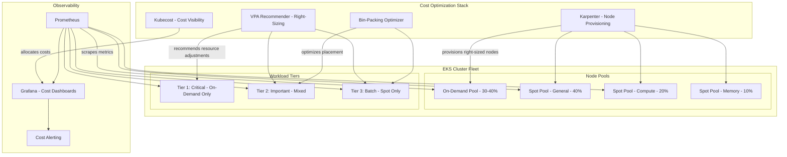
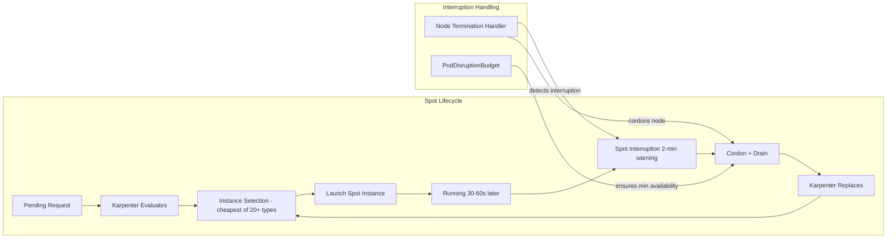

# Pinterest's Kubernetes Cost Optimization

## 1. Overview

Pinterest operates one of the most cost-conscious Kubernetes platforms in the industry, running 15,000+ pods on Amazon EKS with a 60-70% spot instance ratio that saves millions of dollars annually. The defining challenge is running a visual discovery platform at massive scale -- 450M+ monthly active users generating billions of pin impressions per day -- while keeping infrastructure costs proportional to revenue in a business where gross margins matter for profitability.

Pinterest's cost optimization story is not about a single trick. It is a systematic, multi-layered approach that combines spot instance strategy (60-70% of compute on spot instances), right-sizing programs (eliminating the 50-60% over-provisioning typical of Kubernetes deployments), bin-packing improvements (increasing node utilization from ~45% to ~70%), node pool optimization (matching instance types to workload profiles), and Karpenter adoption (replacing Cluster Autoscaler for faster, more cost-effective node provisioning). Together, these initiatives reduced Pinterest's Kubernetes compute costs by approximately 40% without degrading service performance.

This case study is a reference architecture for any organization running Kubernetes at scale on AWS and looking to optimize costs. The patterns are transferable: spot strategy with graceful degradation, continuous right-sizing with VPA recommendations, bin-packing through pod topology spread constraints and scheduler tuning, and Karpenter's just-in-time node provisioning.

## 2. Requirements

### Functional Requirements
- Serve 450M+ monthly active users with visual content (images, videos) discovery and recommendation.
- Support 1,000+ microservices covering search, recommendation, ads serving, content moderation, and user interaction.
- Maintain deployment velocity (hundreds of deployments per day) while optimizing costs.
- Provide cost visibility per team, service, and workload type.
- Enable self-service resource adjustment without platform team intervention.

### Non-Functional Requirements
- **Scale**: 15,000+ pods across multiple EKS clusters, serving billions of requests per day.
- **Cost efficiency**: Minimize $/request while maintaining SLA targets.
- **Availability**: 99.95% for user-facing services, even with 60-70% spot compute.
- **Latency**: P99 search latency < 500ms, P99 feed latency < 200ms.
- **Spot tolerance**: Graceful handling of spot interruptions with < 30 second recovery.
- **Utilization target**: Cluster-wide CPU utilization > 65% (up from ~45% baseline).

## 3. High-Level Architecture



## 4. Core Design Decisions

### 60-70% Spot Instance Strategy

Pinterest runs 60-70% of its Kubernetes compute on AWS spot instances, achieving 60-75% cost savings on those instances compared to on-demand pricing. The strategy is built on several principles:

1. **Instance diversification**: Rather than depending on a single instance type, Pinterest spreads across 15-20 instance families (m5, m5a, m5d, m6i, m6a, c5, c5a, r5, r5a, etc.). This reduces the probability of simultaneous spot interruptions across all pools, because AWS spot capacity is independent across instance types and availability zones.

2. **Graceful interruption handling**: All spot instances run a termination handler (AWS Node Termination Handler) that detects the 2-minute spot interruption notice and:
   - Cordons the node (prevents new pod scheduling)
   - Drains pods with graceful termination (respecting `terminationGracePeriodSeconds`)
   - Triggers replacement node provisioning via Karpenter

3. **Tiered workload placement**: Not all workloads are spot-eligible. Pinterest uses a tiered model:
   - **Tier 1 (Critical)**: Ads serving, payment processing, core search -- on-demand only, with PodDisruptionBudgets ensuring minimum availability.
   - **Tier 2 (Important)**: Feed generation, notification, content processing -- mixed spot/on-demand (70/30 split), with pod anti-affinity spreading replicas across node types.
   - **Tier 3 (Batch)**: ML training jobs, data pipelines, image processing -- 100% spot, with checkpointing for long-running jobs.

See [node pool strategy](../02-cluster-design/02-node-pool-strategy.md) for detailed spot instance patterns.

**Tier assignment process:**
- Each service is assigned a tier during onboarding based on its business criticality, revenue impact, and tolerance for disruption.
- Tier assignment is stored in service metadata (Kubernetes labels) and enforced via node affinity rules and tolerations.
- Services can request a tier change through a review process -- promoting from Tier 3 to Tier 1 increases cost but guarantees on-demand availability.
- Tier 1 services represent approximately 15% of total pods but consume 30% of compute spend (due to on-demand pricing).
- Tier 3 batch workloads represent 25% of pods but only 10% of spend (due to 100% spot with 60-75% discount).

### Karpenter over Cluster Autoscaler

Pinterest migrated from the Kubernetes Cluster Autoscaler (CAS) to Karpenter for node provisioning. The key advantages that drove the decision:

- **Faster provisioning**: Karpenter provisions nodes in 30-60 seconds compared to CAS's 2-5 minutes. This matters for spot replacement: when a spot instance is interrupted, the 2-minute warning is tight with CAS but comfortable with Karpenter.
- **Right-sized nodes**: CAS uses pre-defined node groups with fixed instance types. Karpenter dynamically selects the optimal instance type for pending pods, avoiding both over-provisioning (large instance for a small pod) and under-provisioning (pod stuck Pending because no node group matches).
- **Consolidation**: Karpenter's consolidation feature continuously evaluates whether running pods could fit on fewer nodes and proactively migrates pods and terminates underutilized nodes. This addresses the bin-packing problem that CAS does not solve (CAS only scales down empty or nearly-empty nodes).
- **Spot diversity**: Karpenter's provisioner can specify 20+ instance types, and Karpenter automatically selects the cheapest available type at provisioning time. CAS requires manual configuration of each node group.

See [vertical and cluster autoscaling](../06-scaling-design/02-vertical-and-cluster-autoscaling.md).

### Continuous Right-Sizing Program

Pinterest found that 55% of pods were over-provisioned by 2x or more -- requesting 2 CPU but using 0.5 CPU on average. Over-provisioning wastes money because Kubernetes schedules based on requests (not actual usage), so over-provisioned pods reserve capacity they never use, preventing other pods from being placed on the node.

The right-sizing program:

1. **VPA Recommender** runs in recommendation-only mode (not auto-apply) and generates CPU and memory recommendations based on 14 days of actual usage from Prometheus metrics.
2. **Weekly reports** are generated per team showing over-provisioned services with specific recommendations (e.g., "reduce search-ranking CPU request from 4 to 1.5 based on P95 usage").
3. **Self-service adjustment**: Teams update their resource requests via PR. The platform team does not force changes -- they provide data and let teams decide.
4. **Guardrails**: A minimum floor (100m CPU, 128Mi memory) prevents teams from under-provisioning. LimitRange enforces maximums per container.

The program achieved a 25% reduction in total cluster CPU allocation in the first 6 months, translating directly to fewer nodes needed and lower costs.

### Bin-Packing Optimization

Default Kubernetes scheduling spreads pods across nodes for availability. While good for resilience, this leaves many nodes at 40-50% utilization -- wasting the unused capacity. Pinterest optimized bin-packing through:

1. **Topology spread constraints**: `topologySpreadConstraints` with `maxSkew: 1` distributes replicas across availability zones for fault tolerance while allowing packing within a zone.
2. **Pod priority classes**: Low-priority batch workloads fill gaps left by high-priority services, improving overall node utilization.
3. **Karpenter consolidation**: Karpenter periodically evaluates whether pods on underutilized nodes can be consolidated to fewer nodes, draining and terminating the freed nodes.
4. **Resource request accuracy**: The right-sizing program ensures requests closely match actual usage, which improves the scheduler's ability to pack pods efficiently.

These combined efforts increased average cluster CPU utilization from ~45% to ~70%, effectively getting 55% more compute from the same spend.

## 5. Deep Dives

### 5.1 Spot Instance Architecture



**Spot interruption rate reality**: Pinterest observes a 5-10% monthly spot interruption rate across their diversified instance pool. With instance diversification across 15-20 types and 3 availability zones, the probability of losing more than 5% of spot capacity simultaneously is < 0.1%. This makes 60-70% spot a safe operational choice when combined with proper PDBs and fast replacement.

**Cost math:**
- On-demand m5.4xlarge: $0.768/hour
- Spot m5.4xlarge (average): $0.23/hour (70% discount)
- Pinterest fleet: assume 500 nodes total
- 70% spot (350 nodes): 350 x $0.23 = $80.50/hour
- 30% on-demand (150 nodes): 150 x $0.768 = $115.20/hour
- Total: $195.70/hour = ~$1.71M/year
- All on-demand baseline: 500 x $0.768 = $384/hour = ~$3.36M/year
- **Savings: ~$1.65M/year from spot alone** (49% reduction)

### 5.2 Karpenter Configuration

Pinterest's Karpenter NodePool configuration (simplified):

```yaml
apiVersion: karpenter.sh/v1
kind: NodePool
metadata:
  name: general-spot
spec:
  template:
    spec:
      requirements:
        - key: kubernetes.io/arch
          operator: In
          values: ["amd64"]
        - key: karpenter.sh/capacity-type
          operator: In
          values: ["spot"]
        - key: karpenter.k8s.aws/instance-category
          operator: In
          values: ["m", "c", "r"]
        - key: karpenter.k8s.aws/instance-generation
          operator: Gt
          values: ["4"]
        - key: karpenter.k8s.aws/instance-size
          operator: In
          values: ["xlarge", "2xlarge", "4xlarge", "8xlarge"]
      nodeClassRef:
        group: karpenter.k8s.aws
        kind: EC2NodeClass
        name: default
  limits:
    cpu: "10000"
    memory: 40000Gi
  disruption:
    consolidationPolicy: WhenEmptyOrUnderutilized
    consolidateAfter: 30s
---
apiVersion: karpenter.sh/v1
kind: NodePool
metadata:
  name: critical-ondemand
spec:
  template:
    spec:
      requirements:
        - key: karpenter.sh/capacity-type
          operator: In
          values: ["on-demand"]
        - key: karpenter.k8s.aws/instance-category
          operator: In
          values: ["m", "c"]
        - key: karpenter.k8s.aws/instance-size
          operator: In
          values: ["2xlarge", "4xlarge"]
      taints:
        - key: workload-tier
          value: critical
          effect: NoSchedule
      nodeClassRef:
        group: karpenter.k8s.aws
        kind: EC2NodeClass
        name: default
  disruption:
    consolidationPolicy: WhenEmpty
    consolidateAfter: 5m
```

Key configuration choices:
- **Instance diversity**: 3 categories (m, c, r) x 4 sizes x 2+ generations = 20+ instance types eligible for spot.
- **Consolidation**: Spot pools consolidate aggressively (30s after becoming underutilized). On-demand pools consolidate only when empty (5m delay) to avoid unnecessary disruption.
- **Taints for tier separation**: Critical workloads use tolerations to schedule on the on-demand pool; non-critical workloads default to spot.

### 5.3 Cost Visibility and Chargeback

Pinterest uses Kubecost (backed by OpenCost) to provide cost allocation per team, service, and workload type. The cost visibility pipeline:

1. **Kubecost agent** on each cluster collects resource usage and maps it to AWS pricing.
2. **Cost allocation**: Costs are attributed to services via namespace labels and pod annotations (`team`, `service`, `cost-center`).
3. **Shared cost distribution**: Cluster overhead (control plane, monitoring, logging, kube-system) is distributed proportionally across teams based on their resource consumption.
4. **Weekly cost reports**: Each team receives a report showing their spend, week-over-week trend, and optimization recommendations.
5. **Cost alerts**: Automated alerts fire when a team's spend increases by > 20% week-over-week without a corresponding increase in traffic.

The cost visibility program drove behavioral change: teams that previously ignored resource requests (defaulting to generous allocations) began right-sizing when they saw the dollar impact. See [cost observability](../09-observability-design/03-cost-observability.md).

### 5.4 Node Pool Optimization

Pinterest evolved from a single node pool (one instance type, one configuration) to specialized node pools matched to workload profiles:

| Node Pool | Instance Types | Use Case | Spot % | Count |
|-----------|---------------|----------|--------|-------|
| General | m5.xlarge - m6i.4xlarge | Stateless microservices | 80% | ~200 |
| Compute | c5.2xlarge - c6i.8xlarge | Search, ranking, ML inference | 70% | ~80 |
| Memory | r5.2xlarge - r6i.4xlarge | Caching, data processing | 60% | ~50 |
| Critical | m5.2xlarge - m6i.4xlarge | Ads, payments | 0% | ~50 |
| Batch | Mixed (Karpenter-managed) | ML training, data pipelines | 100% | Variable |

Matching instance types to workloads improves bin-packing: a memory-intensive caching service on a compute-optimized node wastes CPU but exhausts memory, leaving stranded CPU that nothing can use. On a memory-optimized node, the CPU:memory ratio matches the workload, minimizing waste.

### 5.5 Back-of-Envelope Estimation

**Overall cost optimization impact:**
- Baseline (all on-demand, no right-sizing): $5M/year (estimated)
- After spot adoption (60-70% spot): ~$3.2M/year (-36%)
- After right-sizing (25% CPU reduction): ~$2.4M/year (-25% additional)
- After bin-packing (45% to 70% utilization): ~$2.0M/year (-17% additional)
- **Total savings: ~$3M/year (-60% from baseline)**

**Right-sizing math:**
- 15,000 pods x average 1.5 CPU request = 22,500 CPU requested
- Actual usage (P95): 15,000 pods x 0.7 CPU = 10,500 CPU
- Over-provisioning: 22,500 - 10,500 = 12,000 CPU (53% over-provisioned)
- After right-sizing to P95 + 30% buffer: 10,500 x 1.3 = 13,650 CPU
- Reduction: 22,500 - 13,650 = 8,850 CPU saved
- Nodes saved: 8,850 / 16 (CPU per m5.4xlarge) = ~553 nodes
- Cost saved: 553 nodes x $0.50/hour (blended spot/on-demand) x 8,760 hours = ~$2.4M/year

**Bin-packing improvement:**
- Before: 500 nodes at 45% utilization = 225 effective nodes of compute
- After: 322 nodes at 70% utilization = 225 effective nodes of compute (same compute, 36% fewer nodes)
- Nodes saved: 178
- Cost saved: 178 x $0.50/hour x 8,760 = ~$0.78M/year

## 6. Data Model

### Cost Allocation Labels
```yaml
# Required labels on all deployments (enforced via OPA/Gatekeeper)
metadata:
  labels:
    app.kubernetes.io/name: search-ranking
    cost.pinterest.com/team: search-relevance
    cost.pinterest.com/cost-center: cc-3456
    cost.pinterest.com/tier: tier-2
    cost.pinterest.com/environment: production
```

### VPA Recommendation
```yaml
apiVersion: autoscaling.k8s.io/v1
kind: VerticalPodAutoscaler
metadata:
  name: search-ranking-vpa
  namespace: search-relevance
spec:
  targetRef:
    apiVersion: apps/v1
    kind: Deployment
    name: search-ranking
  updatePolicy:
    updateMode: "Off"  # Recommendation only, no auto-apply
  resourcePolicy:
    containerPolicies:
      - containerName: search-ranking
        minAllowed:
          cpu: 100m
          memory: 128Mi
        maxAllowed:
          cpu: "8"
          memory: 16Gi
status:
  recommendation:
    containerRecommendations:
      - containerName: search-ranking
        lowerBound:
          cpu: 800m
          memory: 1200Mi
        target:
          cpu: "1.2"
          memory: 1800Mi
        upperBound:
          cpu: "2"
          memory: 3Gi
        uncappedTarget:
          cpu: "1.2"
          memory: 1800Mi
```

### Karpenter NodePool Budget
```yaml
apiVersion: karpenter.sh/v1
kind: NodePool
metadata:
  name: general-spot
spec:
  limits:
    cpu: "10000"        # Max 10,000 vCPU across all nodes in this pool
    memory: 40000Gi     # Max 40 TB memory
  weight: 80            # Prefer spot over on-demand (higher weight = preferred)
  disruption:
    budgets:
      - nodes: "10%"    # Max 10% of nodes disrupted simultaneously
      - nodes: "0"
        schedule: "0 9 * * 1-5"  # No disruption during business hours peak
        duration: 8h
```

## 7. Scaling Considerations

### Monitoring and Alerting for Cost

Pinterest's cost optimization relies on continuous monitoring with alerts that trigger when costs deviate from expectations:

**Cost anomaly detection:**
- Kubecost tracks hourly spend per namespace, per team, and per workload tier.
- Automated alerts fire when a team's hourly spend exceeds 2x their 7-day average (potential misconfiguration or autoscaling runaway).
- Weekly cost review meetings use Grafana dashboards showing spend trends, top-5 most expensive services, and biggest week-over-week increases.

**Resource waste alerts:**
- Pods with CPU utilization consistently < 10% of request for 7+ days are flagged as "significantly over-provisioned."
- HPA targets that never trigger scaling (HPA always at minReplicas) indicate over-provisioned min replica counts.
- Pods in CrashLoopBackOff still consume node resources via their requests. Alerts for persistent crash loops include cost impact estimates.

**Spot health monitoring:**
- Dashboard tracks: percentage of compute on spot, instance type diversity score, spot interruption rate (trailing 30 days), and average replacement time.
- Alert if spot percentage drops below 50% (indicates spot capacity pressure requiring investigation).
- Alert if average spot replacement time exceeds 3 minutes (indicates Karpenter or capacity issues).

These monitoring practices close the loop on cost optimization: implement changes, measure impact, detect regressions, and iterate. Without monitoring, cost optimization efforts decay as teams add new services, change resource requests, or modify autoscaling parameters.

See [SLO-based operations](../09-observability-design/04-slo-based-operations.md) for integrating cost targets into operational SLOs.

### Cost Scaling

Cost optimization does not end -- it is a continuous process. As Pinterest's traffic grows, the cost optimization stack must scale proportionally:

- **VPA Recommender** processes 14 days of Prometheus metrics for 15,000+ pods. At scale, this requires dedicated Prometheus/Thanos storage and query capacity. Pinterest runs VPA Recommender as a batch job (daily) rather than continuously to manage resource consumption.
- **Kubecost** aggregates cost data from multiple clusters. Cross-cluster cost aggregation uses a central Kubecost instance that queries each cluster's Kubecost agent.
- **Karpenter** at scale: Each Karpenter controller manages up to 2,000 nodes per NodePool. Pinterest runs multiple NodePools per cluster (one per workload tier) and multiple clusters, staying well within Karpenter's scaling limits.

### Spot Capacity Planning

As spot usage grows, the risk of spot capacity unavailability in specific instance types increases. Pinterest mitigates this through:

- **Instance diversity scoring**: A metric that tracks how many instance types are currently in use. If diversity drops below a threshold (e.g., < 10 active types), an alert fires.
- **Fallback to on-demand**: Karpenter's NodePool configuration includes an on-demand fallback. If spot capacity is unavailable across all configured instance types, Karpenter falls back to on-demand provisioning to prevent pods from being stuck in Pending.
- **Regional diversification**: Critical workloads are distributed across 3 availability zones, reducing the impact of AZ-specific spot capacity constraints.

### Organizational Scaling

Cost optimization requires organizational buy-in. Pinterest's approach:

- **FinOps team**: A dedicated FinOps team owns cost visibility tooling, generates reports, and partners with engineering teams on optimization.
- **Engineering incentives**: Cost efficiency metrics are included in team performance reviews alongside reliability and velocity metrics.
- **Self-service right-sizing**: Teams can adjust their resource requests without platform team intervention. The platform provides recommendations; teams own implementation.

## 8. Failure Modes & Mitigations

| Failure | Impact | Mitigation |
|---------|--------|------------|
| Mass spot interruption (AZ-level) | 20-30% of pods terminated simultaneously | PDBs ensure minimum replicas survive; Karpenter provisions replacements on other AZs in < 60 seconds; on-demand baseline absorbs critical workloads |
| Karpenter controller failure | No new nodes provisioned for pending pods | Karpenter runs with HA (2 replicas, leader election); fallback to static node groups managed by CAS as safety net |
| Over-aggressive right-sizing | OOM kills and CPU throttling | VPA recommendations are conservative (P95 + 30% buffer); minimum resource floors enforced via LimitRange; OOM alerts trigger automatic resource increase |
| Bin-packing causes co-location issues | Noisy neighbor: CPU-intensive pod throttles colocated pods | CPU limits enforce hard caps; pod anti-affinity rules separate known noisy workloads; node-level monitoring detects contention |
| Kubecost data gap | Cost reports are inaccurate for a period | Kubecost backfills from Prometheus data; cost alerts have a 24-hour delay to absorb transient gaps |
| Karpenter consolidation loop | Pods repeatedly rescheduled as nodes are created and terminated | Consolidation cooldown (30s minimum); PDB prevents disruption below minimum availability; consolidation budget limits concurrent disruptions |

## 9. Key Takeaways

- Spot instances at 60-70% of compute are safe and practical when combined with instance diversification (15-20 types), fast replacement (Karpenter < 60s), and tiered workload placement (critical workloads on on-demand).
- Karpenter is a strict upgrade over Cluster Autoscaler for cost optimization: right-sized node selection, consolidation, and multi-instance-type support eliminate the waste inherent in fixed node group configurations.
- Right-sizing is the highest-ROI cost optimization. The typical Kubernetes cluster is 50-60% over-provisioned. A VPA-based right-sizing program can reduce allocations by 25-30% with no performance impact.
- Bin-packing from 45% to 70% utilization effectively provides 55% more compute from the same hardware. The combination of topology spread constraints, pod priorities, and Karpenter consolidation achieves this.
- Cost visibility drives behavioral change. Teams that see their dollar spend optimize voluntarily. Teams that see only CPU percentages do not.
- The total stack -- spot + right-sizing + bin-packing + Karpenter -- compounds savings multiplicatively. Each layer reduces the base that subsequent layers optimize, yielding 40-60% total cost reduction.
- Cost optimization is an ongoing operational practice, not a one-time project. Traffic patterns change, new services are deployed, teams modify resource requests -- continuous monitoring and periodic right-sizing cycles are required to maintain gains.
- Organizational alignment matters: engineering teams must have incentives to optimize (cost in performance reviews), and the platform must provide self-service tools (VPA recommendations, cost dashboards) that make optimization easy.
- The 80/20 rule applies: 20% of services typically account for 80% of cost. Start right-sizing with the most expensive services for maximum impact with minimum effort.

## 10. Related Concepts

- [Node Pool Strategy (instance types, spot pools, auto-provisioning)](../02-cluster-design/02-node-pool-strategy.md)
- [Vertical and Cluster Autoscaling (VPA, Karpenter, CAS)](../06-scaling-design/02-vertical-and-cluster-autoscaling.md)
- [Cost Observability (Kubecost, OpenCost, chargeback)](../09-observability-design/03-cost-observability.md)
- [Horizontal Pod Autoscaling (HPA, scaling policies)](../06-scaling-design/01-horizontal-pod-autoscaling.md)
- [KEDA and Event-Driven Scaling (scaling on custom metrics)](../06-scaling-design/03-keda-and-event-driven-scaling.md)
- [Multi-Tenancy (resource quotas, LimitRange)](../10-platform-design/02-multi-tenancy.md)
- [Policy Engines (enforcing cost labels via OPA/Gatekeeper)](../07-security-design/02-policy-engines.md)

## 11. Comparison with Related Systems

| Aspect | Pinterest (EKS + Karpenter) | Spotify (GKE) | Airbnb (EKS + CAS) |
|--------|---------------------------|--------------|---------------------|
| Spot ratio | 60-70% | 30-40% (preemptible) | ~50% |
| Node provisioner | Karpenter | GKE NAP | Cluster Autoscaler |
| Right-sizing | VPA recommender + manual | Prometheus-based reports | Internal tooling |
| Cost visibility | Kubecost + custom reports | Internal dashboards | Internal dashboards |
| Bin-packing strategy | Karpenter consolidation + topology spread | GKE bin-packing scheduler | Pod anti-affinity + CAS |
| Target utilization | 70% | 60-65% | 65-70% |
| Primary cost lever | Spot instances | GKE committed use discounts | Dynamic cluster scaling |
| Cost savings | ~40-60% reduction | ~20-30% reduction | ~30-40% reduction |

### Architectural Lessons

1. **Start with cost visibility before optimization.** Teams cannot optimize what they cannot see. Kubecost/OpenCost installation and cost reporting should precede any optimization initiative. Pinterest found that cost visibility alone drove 10-15% savings through voluntary right-sizing.

2. **Spot instances require architectural support, not just configuration.** Running 60-70% spot is not just toggling a node group setting. It requires PodDisruptionBudgets, graceful termination handlers, fast replacement (Karpenter), instance diversification, and tiered workload placement. Each layer is necessary.

3. **Right-sizing is a continuous process, not a one-time project.** Traffic patterns change, code changes, and dependencies evolve. A right-sizing recommendation from 6 months ago is outdated. Pinterest runs VPA Recommender continuously and generates weekly reports.

4. **Karpenter consolidation is the underrated cost optimization feature.** Everyone focuses on Karpenter's faster provisioning, but the real cost savings come from consolidation -- continuously packing pods onto fewer nodes and terminating the empties. This is something Cluster Autoscaler fundamentally cannot do.

5. **Cost optimization and reliability are not opposites.** Pinterest's 60-70% spot fleet is more reliable than many all-on-demand deployments because the spot architecture forces good practices: PDBs, graceful termination, multi-AZ spread, and fast replacement. These practices improve reliability regardless of instance type.

## 12. Source Traceability

| Section | Source |
|---------|--------|
| Spot instance strategy, instance diversification | AWS Blog: "Building for Cost Optimization and Resilience for EKS with Spot Instances"; Pinterest engineering talks on Kubernetes cost optimization |
| Karpenter adoption and configuration | AWS Blog: "Optimizing your Kubernetes compute costs with Karpenter consolidation" |
| VPA-based right-sizing program | Kubernetes VPA documentation; general industry pattern documented across multiple organizations |
| Kubecost cost visibility | Kubecost/OpenCost documentation; Pinterest engineering references to Kubernetes cost tooling |
| Bin-packing improvements and utilization targets | Kubernetes scheduling documentation; Karpenter consolidation documentation |
| Pod count (15,000+) and scale numbers | Pinterest engineering presentations on Kubernetes infrastructure; CNCF case study references |
