# Designing a Multi-Tenant Kubernetes Platform for 50+ Teams

## 1. Overview

This case study presents the design of a multi-tenant Kubernetes platform for a mid-to-large enterprise with 50+ development teams, 500+ microservices, and requirements spanning self-service onboarding, resource isolation, cost accountability, and security compliance. The challenge is not running Kubernetes -- it is building a platform that enables 50+ teams with varying expertise levels to deploy and operate services safely on shared infrastructure without a proportionally large platform team.

The multi-tenant platform problem is the most common Kubernetes design challenge in the enterprise. Every organization that adopts Kubernetes beyond a single team faces the same questions: How do you isolate teams on shared clusters? How do you prevent one team's misconfiguration from affecting others? How do you enforce consistent security policies without blocking developer velocity? How do you allocate costs to the teams that incur them? And how do you scale the platform team's impact as the number of tenants grows from 5 to 50 to 500?

This design uses the namespace-per-tenant model with Capsule for multi-namespace tenant management, supplemented by network policies for traffic isolation, resource quotas for capacity management, RBAC for access control, and a self-service onboarding pipeline that provisions a complete tenant environment (namespace, quotas, RBAC, network policies, monitoring) in under 5 minutes. The design supports 50+ teams on 3-5 shared clusters, with a platform team of 5-8 engineers.

## 2. Requirements

### Functional Requirements
- Platform team can onboard a new tenant (team) in < 5 minutes through a self-service API or portal.
- Each tenant has isolated namespaces with resource quotas, RBAC, and network policies.
- Tenants can deploy, scale, and manage their services without platform team intervention.
- Shared services (monitoring, logging, ingress, cert-manager) are available to all tenants.
- Cost reports are generated per tenant based on actual resource consumption.
- Tenant lifecycle management: creation, quota adjustment, decommissioning.

### Non-Functional Requirements
- **Scale**: 50+ tenants, 500+ services, 5,000+ pods across 3-5 clusters.
- **Isolation**: Tenant A cannot access Tenant B's pods, secrets, or network traffic.
- **Performance**: Noisy-neighbor prevention -- no single tenant can consume > 20% of cluster resources.
- **Security**: RBAC scoped per tenant; network policies enforce default-deny; secrets encrypted at rest.
- **Compliance**: SOC2-compatible audit logging; all admin actions logged; tenant access revocation within minutes.
- **Self-service**: Tenant onboarding without platform team involvement (after initial template creation).

## 3. High-Level Architecture

```mermaid
graph TB
    subgraph "Self-Service Layer"
        PORTAL[Backstage Portal]
        API[Tenant API]
        TMPL[Tenant Templates]
    end

    subgraph "Control Plane"
        CAP[Capsule Tenant Controller]
        OPA[OPA/Gatekeeper - Policy Engine]
        CERT[cert-manager]
        OIDC[Dex - OIDC Provider]
    end

    subgraph "Shared Services"
        PROM[Prometheus + Thanos]
        LOKI[Loki - Logging]
        GRAF[Grafana - Dashboards]
        ING[Ingress Controller - NGINX]
        SM[Service Mesh - Istio/Cilium]
    end

    subgraph "Cluster: Production"
        subgraph "Tenant: team-payments"
            NS1[Namespace: team-payments]
            RQ1[ResourceQuota]
            NP1[NetworkPolicy]
            RB1[RoleBinding]
        end
        subgraph "Tenant: team-search"
            NS2[Namespace: team-search]
            RQ2[ResourceQuota]
            NP2[NetworkPolicy]
            RB2[RoleBinding]
        end
        subgraph "Tenant: team-ml"
            NS3[Namespace: team-ml]
            RQ3[ResourceQuota]
            NP3[NetworkPolicy]
            RB3[RoleBinding]
        end
        SYS[kube-system]
        MON[monitoring namespace]
    end

    PORTAL --> API
    API --> CAP
    CAP --> NS1
    CAP --> NS2
    CAP --> NS3
    TMPL --> CAP

    OIDC --> RB1
    OIDC --> RB2
    OIDC --> RB3

    OPA -- "enforces policies" --> NS1
    OPA --> NS2
    OPA --> NS3

    PROM --> NS1
    PROM --> NS2
    PROM --> NS3
    ING --> NS1
    ING --> NS2
```



## 4. Core Design Decisions

### Namespace-per-Tenant with Capsule

The platform uses the namespace-per-tenant model as the isolation boundary, managed by Capsule. Each tenant is represented as a Capsule `Tenant` CRD that groups one or more namespaces under a single administrative entity. Capsule provides:

- **Multi-namespace tenants**: A team that needs staging and production namespaces gets both under one Tenant, sharing quotas and RBAC.
- **Tenant-scoped quotas**: ResourceQuotas are enforced at the Tenant level (across all namespaces), not just per namespace. A team with 100 CPU across staging + production can distribute it flexibly.
- **RBAC propagation**: RBAC bindings defined on the Tenant are automatically propagated to all namespaces owned by the Tenant.
- **Network policy templates**: Default network policies (deny-all ingress, allow from same-tenant) are automatically applied to new namespaces.

This approach was chosen over virtual clusters (vCluster) because 50+ teams with standard workloads do not need the overhead of separate API servers. Namespace isolation with Capsule provides sufficient isolation at lower operational cost. If a tenant requires cluster-scoped resources (custom CRDs, custom admission webhooks), they graduate to a dedicated cluster. See [multi-tenancy](../10-platform-design/02-multi-tenancy.md).

### Defense-in-Depth Isolation

Isolation is implemented in layers, so that a failure in one layer does not compromise tenant isolation:

1. **RBAC (Identity)**: Each tenant's users can only access their namespaces. Cluster-scoped resources (nodes, PVs, CRDs) are read-only or hidden. RBAC roles use `namespace`-scoped `RoleBindings`, never `ClusterRoleBindings` for tenant users.

2. **Network Policy (Network)**: Default-deny ingress and egress policies on every tenant namespace. Explicit allow rules permit:
   - Intra-tenant traffic (pods within the same tenant can communicate)
   - Cross-tenant traffic only via designated APIs (Ingress or Service Mesh routing)
   - Egress to shared services (DNS, monitoring, logging endpoints)
   - Egress to external services (with explicit allowlists)

3. **Resource Quotas (Resources)**: Hard limits on CPU, memory, pod count, and persistent volume claims per tenant. Prevents resource starvation and ensures fair sharing.

4. **Policy Engine (Configuration)**: OPA/Gatekeeper or Kyverno enforces configuration standards:
   - All pods must have resource requests and limits
   - No privileged containers
   - Images must come from approved registries
   - No `hostPath` volumes
   - Required labels (team, cost-center, environment)

5. **Pod Security Standards (Runtime)**: Kubernetes Pod Security Admission (PSA) enforces `restricted` profile for all tenant namespaces, preventing privilege escalation, host namespace access, and dangerous capabilities.

See [RBAC and access control](../07-security-design/01-rbac-and-access-control.md), [network policies](../04-networking-design/05-network-policies.md), and [policy engines](../07-security-design/02-policy-engines.md).

### Self-Service Tenant Onboarding

Tenant onboarding is fully automated through a pipeline triggered by a Backstage template or API call:

1. **Request**: Team lead fills in a form (team name, cost center, environment, initial quota, OIDC group).
2. **Approval** (optional for governance-heavy organizations): Manager or platform team approves the request.
3. **Provisioning**: The pipeline creates:
   - Capsule Tenant CRD
   - Namespaces (production, staging)
   - ResourceQuotas per namespace
   - LimitRanges with sensible defaults
   - Network policies (default-deny + allow templates)
   - RBAC RoleBindings mapped to the OIDC group
   - ServiceAccount for CI/CD
   - Grafana dashboard (templated per tenant)
   - AlertManager routes for tenant-specific alerting
4. **Validation**: Smoke tests verify namespace access, quota enforcement, and network policy effectiveness.
5. **Notification**: Team receives onboarding guide with kubectl configuration, portal links, and golden path templates.

Total time: < 5 minutes from request to functional environment.

### Shared Services Architecture

Shared services run in dedicated namespaces managed by the platform team and are accessible to all tenants:

- **Monitoring**: Prometheus (per-cluster) + Thanos (cross-cluster aggregation). Tenant metrics are isolated via namespace-based relabeling in Prometheus; tenants see only their own metrics in Grafana dashboards.
- **Logging**: Loki with namespace-scoped access. Tenant log queries are automatically filtered to their namespaces via Grafana's multi-tenancy features.
- **Ingress**: A shared NGINX Ingress Controller routes external traffic to tenant services. Ingress resources are namespace-scoped, so tenants can only create routes for their own services.
- **Certificate management**: cert-manager provisions TLS certificates for tenant Ingress resources via Let's Encrypt or internal CA.
- **DNS**: ExternalDNS manages DNS records for tenant services automatically.

See [monitoring and metrics](../09-observability-design/01-monitoring-and-metrics.md) and [logging and tracing](../09-observability-design/02-logging-and-tracing.md).

## 5. Deep Dives

### 5.1 Capsule Tenant Configuration

```yaml
apiVersion: capsule.clastix.io/v1beta2
kind: Tenant
metadata:
  name: team-payments
spec:
  owners:
    - name: payments-devs
      kind: Group  # Maps to OIDC group
    - name: payments-ci
      kind: ServiceAccount
      namespace: ci-system
  namespaceOptions:
    quota: 5  # Max 5 namespaces per tenant
    additionalMetadata:
      labels:
        tenant: team-payments
        cost-center: cc-1234
      annotations:
        scheduler.alpha.kubernetes.io/defaultTolerations: "[]"
  networkPolicies:
    items:
      - policyTypes:
          - Ingress
          - Egress
        ingress:
          - from:
              - namespaceSelector:
                  matchLabels:
                    capsule.clastix.io/tenant: team-payments
        egress:
          - to:
              - namespaceSelector:
                  matchLabels:
                    kubernetes.io/metadata.name: kube-system
            ports:
              - port: 53
                protocol: UDP
              - port: 53
                protocol: TCP
          - to:
              - namespaceSelector:
                  matchLabels:
                    capsule.clastix.io/tenant: team-payments
  resourceQuotas:
    scope: Tenant  # Quota across all namespaces
    items:
      - hard:
          requests.cpu: "100"
          requests.memory: 200Gi
          limits.cpu: "200"
          limits.memory: 400Gi
          pods: "500"
          services: "50"
          persistentvolumeclaims: "20"
  limitRanges:
    items:
      - limits:
          - default:
              cpu: 500m
              memory: 512Mi
            defaultRequest:
              cpu: 100m
              memory: 128Mi
            max:
              cpu: "4"
              memory: 8Gi
            type: Container
  containerRegistries:
    allowed:
      - "registry.company.com"
      - "docker.io/library"
    allowedRegex: "^registry\\.company\\.com/.*$"
```

### 5.2 RBAC Design

The RBAC model uses three tiers of access:

**Tier 1 -- Platform Admin (ClusterRole)**:
- Full cluster-admin access
- Manages Capsule Tenants, cluster-scoped resources, node operations
- 5-8 platform team members

**Tier 2 -- Tenant Admin (Role, per-tenant)**:
- Can create/delete resources within tenant namespaces
- Can manage RoleBindings within their namespaces (delegate access to team members)
- Cannot access other tenants' namespaces or cluster-scoped resources
- Team leads, senior engineers

**Tier 3 -- Tenant Developer (Role, per-tenant)**:
- Can create/update Deployments, Services, ConfigMaps, Secrets within tenant namespaces
- Cannot delete namespaces, modify quotas, or manage RBAC
- Cannot exec into pods in production (optional policy)
- All team members

```yaml
# Tenant Admin role (applied per namespace via Capsule)
apiVersion: rbac.authorization.k8s.io/v1
kind: ClusterRole
metadata:
  name: tenant-admin
rules:
  - apiGroups: ["", "apps", "batch", "autoscaling", "networking.k8s.io"]
    resources: ["*"]
    verbs: ["*"]
  - apiGroups: ["rbac.authorization.k8s.io"]
    resources: ["rolebindings", "roles"]
    verbs: ["*"]
  - apiGroups: ["monitoring.coreos.com"]
    resources: ["servicemonitors", "prometheusrules"]
    verbs: ["*"]
---
# Tenant Developer role
apiVersion: rbac.authorization.k8s.io/v1
kind: ClusterRole
metadata:
  name: tenant-developer
rules:
  - apiGroups: ["", "apps", "batch", "autoscaling"]
    resources: ["deployments", "services", "configmaps", "secrets", "pods", "jobs", "cronjobs", "horizontalpodautoscalers"]
    verbs: ["get", "list", "watch", "create", "update", "patch"]
  - apiGroups: [""]
    resources: ["pods/log"]
    verbs: ["get", "list"]
  - apiGroups: [""]
    resources: ["pods/exec"]
    verbs: []  # No exec in production
  - apiGroups: ["networking.k8s.io"]
    resources: ["ingresses"]
    verbs: ["get", "list", "watch", "create", "update", "patch"]
```

### 5.3 Network Policy Design

The network policy design follows a default-deny with explicit allow pattern:

```yaml
# Default deny all ingress and egress
apiVersion: networking.k8s.io/v1
kind: NetworkPolicy
metadata:
  name: default-deny-all
  namespace: team-payments-prod
spec:
  podSelector: {}
  policyTypes:
    - Ingress
    - Egress
---
# Allow DNS resolution (required for all pods)
apiVersion: networking.k8s.io/v1
kind: NetworkPolicy
metadata:
  name: allow-dns
  namespace: team-payments-prod
spec:
  podSelector: {}
  policyTypes:
    - Egress
  egress:
    - to:
        - namespaceSelector:
            matchLabels:
              kubernetes.io/metadata.name: kube-system
      ports:
        - protocol: UDP
          port: 53
        - protocol: TCP
          port: 53
---
# Allow intra-tenant traffic
apiVersion: networking.k8s.io/v1
kind: NetworkPolicy
metadata:
  name: allow-same-tenant
  namespace: team-payments-prod
spec:
  podSelector: {}
  policyTypes:
    - Ingress
    - Egress
  ingress:
    - from:
        - namespaceSelector:
            matchLabels:
              tenant: team-payments
  egress:
    - to:
        - namespaceSelector:
            matchLabels:
              tenant: team-payments
---
# Allow ingress from ingress controller
apiVersion: networking.k8s.io/v1
kind: NetworkPolicy
metadata:
  name: allow-ingress-controller
  namespace: team-payments-prod
spec:
  podSelector:
    matchLabels:
      app.kubernetes.io/component: web
  policyTypes:
    - Ingress
  ingress:
    - from:
        - namespaceSelector:
            matchLabels:
              app.kubernetes.io/name: ingress-nginx
---
# Allow egress to monitoring
apiVersion: networking.k8s.io/v1
kind: NetworkPolicy
metadata:
  name: allow-monitoring-egress
  namespace: team-payments-prod
spec:
  podSelector: {}
  policyTypes:
    - Egress
  egress:
    - to:
        - namespaceSelector:
            matchLabels:
              kubernetes.io/metadata.name: monitoring
      ports:
        - protocol: TCP
          port: 9090
```

### 5.4 Tenant Lifecycle Management

The tenant lifecycle spans creation, operation, and decommissioning:

**Creation** (automated, < 5 min):
- Backstage template triggers tenant provisioning pipeline
- Pipeline creates Capsule Tenant, namespaces, quotas, RBAC, network policies
- Grafana dashboards and AlertManager routes are provisioned
- Team receives onboarding package

**Operation** (self-service with guardrails):
- Quota increases: Teams request via Backstage; auto-approved if within cluster capacity, escalated if cluster is > 80% allocated
- New namespace: Teams can create additional namespaces within their Tenant (up to quota)
- Cross-tenant communication: Requires explicit network policy allowlist, reviewed by platform team
- Incident response: Platform team can view all tenant resources; tenant teams can view only their own

**Decommissioning** (controlled):
- Team requests decommission via Backstage
- 30-day grace period: namespace enters "terminating" state with reduced quotas
- Automated checks verify no external dependencies (no other tenants calling this tenant's APIs)
- Data backup: PVCs are snapshotted before deletion
- Full cleanup: Tenant CRD, namespaces, RBAC, monitoring dashboards, DNS entries all removed

### 5.5 Back-of-Envelope Estimation

**Cluster sizing for 50 tenants:**
- 50 tenants x average 10 services x 3 replicas = 1,500 pods (base)
- With HPA (2x headroom): 3,000 pods
- Average pod: 0.5 CPU request, 512 Mi memory
- Total: 1,500 CPU, 1.5 TB memory (base)
- With headroom: 3,000 CPU, 3 TB memory
- Node count: 3,000 CPU / 16 CPU per node = ~188 nodes
- Cluster count: 3-5 clusters (for blast radius isolation), ~40-60 nodes each

**etcd sizing:**
- 50 tenants x 2 namespaces x ~50 objects per namespace = 5,000 objects
- System objects: ~2,000 (kube-system, monitoring, etc.)
- Total: ~7,000 objects -- well within single etcd cluster capacity (< 1 GB)

**Network policy overhead:**
- 50 tenants x 4 policies per namespace x 2 namespaces = 400 network policies
- Cilium eBPF-based enforcement: < 1% CPU overhead per node
- Calico iptables-based enforcement: 2-5% CPU overhead per node at 400 rules

**Platform team sizing:**
- 50 tenants / 1:10 platform-to-tenant ratio = 5 platform engineers
- With automation (self-service onboarding, auto-remediation): 5-8 engineers sufficient

## 6. Data Model

### Tenant Request (Backstage Template Input)
```yaml
tenant:
  name: team-payments
  displayName: "Payments Team"
  costCenter: cc-1234
  oidcGroup: payments-devs
  environments:
    - name: staging
      quota:
        cpu: "20"
        memory: 40Gi
        pods: "100"
    - name: production
      quota:
        cpu: "80"
        memory: 160Gi
        pods: "400"
  contacts:
    techLead: alice@company.com
    manager: bob@company.com
    oncall: payments-oncall@company.com
```

### Tenant Status (Platform Dashboard)
```yaml
apiVersion: platform.company.com/v1
kind: TenantStatus
metadata:
  name: team-payments
status:
  phase: Active
  namespaces:
    - name: team-payments-staging
      podCount: 12
      cpuUsed: "3.5"
      cpuRequested: "8"
      memoryUsed: 7Gi
      memoryRequested: 16Gi
    - name: team-payments-prod
      podCount: 45
      cpuUsed: "22"
      cpuRequested: "40"
      memoryUsed: 44Gi
      memoryRequested: 80Gi
  quotaUtilization:
    cpuPercent: 48
    memoryPercent: 48
    podPercent: 11
  monthlyCost: "$4,200"
  lastDeployment: "2025-12-15T14:32:00Z"
  complianceStatus: passing
  openAlerts: 2
```

## 7. Scaling Considerations

### Scaling from 50 to 500 Teams

The namespace-per-tenant model scales well to ~200 tenants on a cluster (limited by etcd size, API server load from watches, and network policy count). Beyond 200 tenants per cluster:

- **Cluster federation**: Add more clusters and distribute tenants across them. Capsule Tenant definitions are per-cluster, so the same tenant can exist on multiple clusters.
- **Virtual clusters**: For tenants that outgrow namespace isolation (need custom CRDs, admission webhooks, or cluster-admin capabilities), graduate them to vCluster instances. A vCluster gives them full cluster-admin within their virtual cluster while still running on shared infrastructure.
- **Hierarchical namespaces**: For tenants that need more than 5 namespaces (complex microservices architectures), Kubernetes Hierarchical Namespace Controller (HNC) provides namespace inheritance.

### API Server Scaling

With 50+ tenants, each running controllers, watching resources, and deploying:
- **Watch fan-out**: 50 tenants x ~5 watchers each = 250 concurrent watches. The API server handles this easily (tested to 10,000+ concurrent watches).
- **List operations**: Tenant-scoped lists (e.g., `kubectl get pods -n team-payments`) are efficient because they are namespace-filtered. Cross-namespace lists (`kubectl get pods --all-namespaces`) are restricted to platform admins.
- **Admission webhook latency**: OPA/Gatekeeper adds 5-20ms per admission request. With 50+ policies, ensure the policy engine is properly scaled (2-3 replicas with pod anti-affinity).

### Monitoring Scaling

Prometheus cardinality grows with tenant count:
- 50 tenants x 10 services x 20 metrics x 5 labels = 50,000 time series (manageable)
- At 500 tenants: 500,000 time series (requires Thanos or Mimir for long-term storage and horizontal scaling)
- Grafana dashboards: Template variables scope dashboards by tenant namespace, so a single dashboard template serves all tenants

## 8. Failure Modes & Mitigations

| Failure | Impact | Mitigation |
|---------|--------|------------|
| Capsule controller failure | New tenant onboarding blocked; existing tenants unaffected | Capsule runs with HA (2 replicas); existing namespaces and policies persist without the controller |
| Network policy misconfiguration | Cross-tenant traffic leak or service connectivity broken | Policy validation in CI pipeline; network policy testing framework (Cyclonus) in staging; Cilium Hubble for real-time traffic visibility |
| Resource quota exhaustion | Tenant cannot deploy new pods | Alerting at 80% quota utilization; self-service quota increase via Backstage; platform team review for large increases |
| Noisy neighbor (CPU contention) | Co-tenant pods experience CPU throttling | CPU limits enforce hard caps; node-level monitoring detects contention; PriorityClasses ensure critical workloads are not preempted |
| OIDC provider outage | New kubectl sessions fail to authenticate | Existing sessions use cached tokens (1-hour validity); emergency break-glass ServiceAccount for incident response |
| OPA/Gatekeeper failure | Admission requests fail-open or fail-closed (configurable) | Configure fail-open for availability (with audit mode for detection); Gatekeeper audit controller detects violations post-admission |
| etcd corruption | Cluster-wide outage | etcd backups every 30 minutes; separate etcd clusters for large deployments; cluster recreation from backup in < 30 minutes |

## 9. Key Takeaways

- Multi-tenancy on Kubernetes is an assembly of features (namespaces, RBAC, quotas, network policies, PSA), not a single configuration toggle. Each layer addresses a different isolation dimension.
- Capsule simplifies multi-namespace tenant management by aggregating quotas, RBAC, and policies at the Tenant level rather than per-namespace.
- Self-service onboarding is the highest-leverage platform investment. Manual tenant provisioning requires platform team time for every new team; automated provisioning scales linearly with zero marginal cost per tenant.
- Network policies are the most commonly neglected isolation layer. Default Kubernetes networking allows all pods to communicate with all other pods -- a flat network with no tenant isolation. Default-deny policies are essential.
- Cost accountability per tenant drives optimization behavior. Without chargeback or showback, shared clusters become a tragedy of the commons where every team over-provisions.
- The platform team's primary product is self-service. Every manual process that requires platform engineer involvement is a scalability bottleneck and should be automated.

## 10. Related Concepts

- [Multi-Tenancy (isolation models, vCluster, Capsule)](../10-platform-design/02-multi-tenancy.md)
- [RBAC and Access Control (role design, OIDC integration)](../07-security-design/01-rbac-and-access-control.md)
- [Network Policies (default-deny, namespace isolation)](../04-networking-design/05-network-policies.md)
- [Policy Engines (OPA/Gatekeeper, Kyverno)](../07-security-design/02-policy-engines.md)
- [Self-Service Abstractions (tenant onboarding, golden paths)](../10-platform-design/03-self-service-abstractions.md)
- [Internal Developer Platform (Backstage, portal)](../10-platform-design/01-internal-developer-platform.md)
- [Cost Observability (Kubecost, chargeback)](../09-observability-design/03-cost-observability.md)
- [Monitoring and Metrics (Prometheus multi-tenancy)](../09-observability-design/01-monitoring-and-metrics.md)

## 11. Comparison with Related Systems

| Aspect | Namespace + Capsule | Virtual Clusters (vCluster) | Dedicated Clusters |
|--------|--------------------|-----------------------------|-------------------|
| Isolation level | Soft (shared control plane) | Medium (separate API server, shared nodes) | Hard (fully separate) |
| Overhead per tenant | Low (~5 K8s objects) | Medium (API server + etcd per vCluster) | High (full cluster) |
| Tenant capabilities | Namespace-scoped only | Full cluster-admin within vCluster | Full cluster-admin |
| CRD support | Shared (all tenants see same CRDs) | Per-vCluster CRDs | Per-cluster CRDs |
| Cost per tenant | $5-20/month (shared resources) | $50-100/month (vCluster overhead) | $500-2000/month (dedicated cluster) |
| Max tenants per cluster | ~200 | ~50-100 | 1 |
| Operational complexity | Low | Medium | High |
| Best for | Trusted internal teams with standard workloads | Teams needing cluster-admin or custom CRDs | Compliance-mandated isolation, untrusted tenants |

### Architectural Lessons

1. **Start with namespace-per-tenant; graduate to vCluster or dedicated clusters when needed.** Namespace isolation is sufficient for 80% of internal teams. Over-isolating wastes resources and increases operational complexity. Reserve hard isolation for teams with demonstrated needs (compliance, custom CRDs, cluster-admin requirements).

2. **Defense-in-depth is non-negotiable.** RBAC alone is not isolation. Network policies alone are not isolation. Resource quotas alone are not isolation. Only the combination of all four layers (RBAC + network policies + quotas + policy engine) provides meaningful tenant isolation.

3. **Self-service onboarding pays for itself in the first month.** If onboarding a tenant takes 2 hours of platform team time, and you onboard 5 tenants per month, that is 10 hours/month. Automating onboarding to < 5 minutes frees those hours for platform improvements.

4. **The platform team's ratio to tenants should be 1:10 or better.** A 5-person platform team supporting 50 tenants is sustainable with automation. A 5-person team supporting 50 tenants manually is not.

5. **Network policies are the most impactful security investment.** Default Kubernetes networking is a flat network -- a compromised pod can reach every other pod in the cluster. Default-deny network policies reduce the blast radius of any security incident to the affected namespace.

## 12. Source Traceability

| Section | Source |
|---------|--------|
| Capsule Tenant CRD and configuration | Capsule project documentation (capsule.clastix.io) |
| Multi-tenancy isolation models | [Multi-Tenancy](../10-platform-design/02-multi-tenancy.md); Kubernetes multi-tenancy working group documentation |
| Network policy patterns | Kubernetes NetworkPolicy documentation; Cilium network policy best practices |
| RBAC design patterns | Kubernetes RBAC documentation; CNCF best practices for multi-tenant RBAC |
| Self-service onboarding | [Internal Developer Platform](../10-platform-design/01-internal-developer-platform.md); Backstage Scaffolder documentation |
| Resource quota and LimitRange | Kubernetes resource management documentation |
