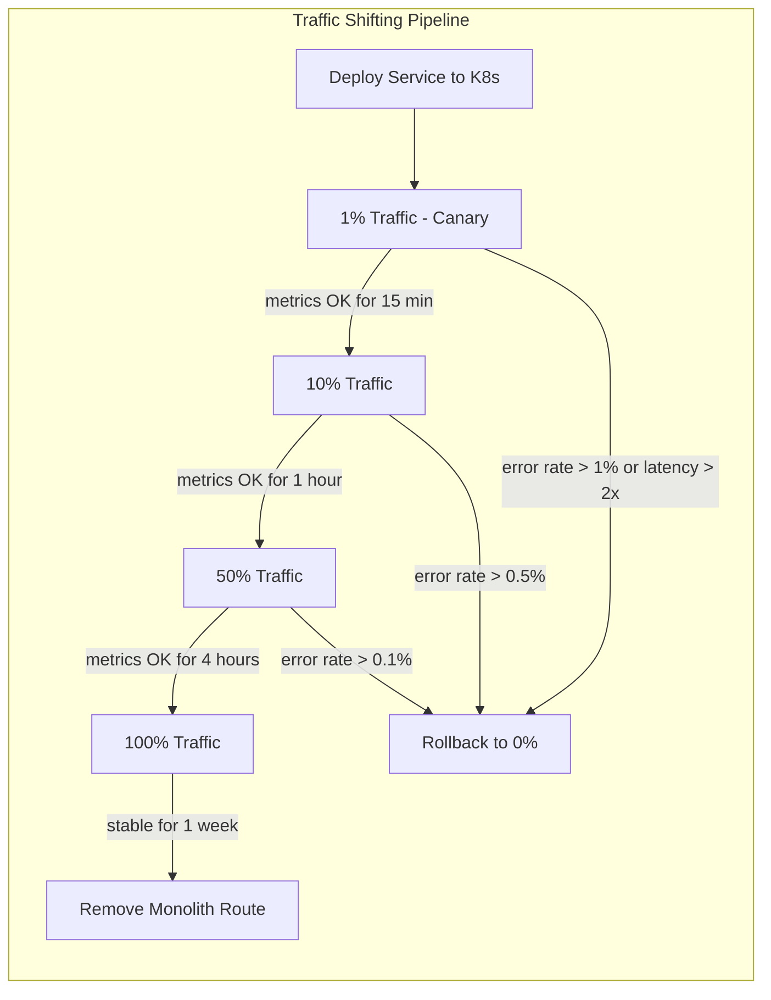

# Migrating a Monolith to Kubernetes

## 1. Overview

This case study presents a structured approach to migrating a monolithic application to Kubernetes using the strangler fig pattern -- incrementally extracting services from the monolith, containerizing them, and deploying them to Kubernetes while the monolith continues to serve traffic. The migration spans 12-18 months for a typical mid-size monolith (500K-2M lines of code, 50-100 engineers, 10-20 database tables, serving 10,000+ requests per second).

The strangler fig pattern is named after the strangler fig tree, which grows around a host tree, gradually replacing it until the host tree is gone. In software terms, new functionality is built as microservices on Kubernetes, existing functionality is incrementally extracted from the monolith, and traffic is progressively shifted from the monolith to the new services. At no point is there a "big bang" cutover -- the monolith and microservices coexist, with the monolith shrinking over time.

The critical insight is that monolith-to-Kubernetes migration is 30% technical and 70% organizational. The technical challenges -- containerization, service extraction, database decomposition, traffic shifting -- are well-understood and have proven patterns. The organizational challenges -- team restructuring, skill building, cultural change, stakeholder management, and maintaining feature velocity during migration -- are what determine success or failure. This case study covers both.

## 2. Requirements

### Functional Requirements
- Existing functionality continues to work throughout migration (zero-downtime migration).
- New features can be built as microservices on Kubernetes during migration.
- Traffic can be shifted incrementally between monolith and microservices (1%, 5%, 25%, 50%, 100%).
- Rollback capability at every stage -- any extracted service can be reverted to the monolith.
- Database access works for both monolith and microservices during the transition period.

### Non-Functional Requirements
- **Zero-downtime**: No planned downtime during any migration phase.
- **Performance**: Extracted services must match or exceed monolith latency (< 10% regression).
- **Reliability**: Migration must not reduce system availability below 99.9%.
- **Timeline**: 12-18 months for full migration; first extracted service in production within 8 weeks.
- **Velocity**: Feature development velocity must not decrease by more than 20% during migration.
- **Rollback speed**: Any service can be rolled back to monolith routing within 5 minutes.

## 3. High-Level Architecture

```mermaid
graph TB
    subgraph "Phase 1: Side-by-Side"
        CLIENT[Client] --> GW[API Gateway / Ingress]
        GW -- "90% traffic" --> MONO[Monolith on VMs]
        GW -- "10% traffic" --> SVC1[Service A on K8s]
        MONO --> SHARED_DB[(Shared Database)]
        SVC1 --> SHARED_DB
    end

    subgraph "Phase 2: Progressive Extraction"
        GW2[API Gateway] -- "50%" --> MONO2[Monolith - shrinking]
        GW2 -- "20%" --> SVC2A[Service A]
        GW2 -- "15%" --> SVC2B[Service B]
        GW2 -- "15%" --> SVC2C[Service C]
        MONO2 --> DB1[(Legacy DB - shrinking]
        SVC2A --> DB2[(Service A DB)]
        SVC2B --> DB3[(Service B DB)]
        SVC2C --> DB1
    end

    subgraph "Phase 3: Monolith Retired"
        GW3[API Gateway] --> SVC3A[Service A]
        GW3 --> SVC3B[Service B]
        GW3 --> SVC3C[Service C]
        GW3 --> SVC3D[Service D]
        GW3 --> SVC3E[Service E]
        SVC3A --> DBA[(DB A)]
        SVC3B --> DBB[(DB B)]
        SVC3C --> DBC[(DB C)]
        SVC3D --> DBD[(DB D)]
        SVC3E --> DBE[(DB E)]
    end
```

## 4. Core Design Decisions

### Strangler Fig via API Gateway

The API gateway (NGINX Ingress, Istio Gateway, or cloud ALB) is the strangler fig's routing layer. It inspects incoming requests and routes them to either the monolith or the extracted microservice based on URL path, header, or percentage-based traffic splitting:

```yaml
# Istio VirtualService for traffic splitting
apiVersion: networking.istio.io/v1beta1
kind: VirtualService
metadata:
  name: user-api
spec:
  hosts:
    - api.company.com
  http:
    - match:
        - uri:
            prefix: /api/v1/users
      route:
        - destination:
            host: user-service.user-ns.svc.cluster.local
          weight: 10   # 10% to new K8s service
        - destination:
            host: monolith.legacy.svc.cluster.local
          weight: 90   # 90% to monolith
```

This pattern allows gradual traffic shifting with instant rollback (set weight back to 0% for the new service, 100% for the monolith). The gateway provides the strangler fig's growth point -- as each service is extracted, its routes shift from the monolith to the new service. See [ingress and Gateway API](../04-networking-design/02-ingress-and-gateway-api.md) and [progressive delivery](../08-deployment-design/04-progressive-delivery.md).

### Service Extraction Order

Not all services should be extracted simultaneously. The extraction order is determined by a priority matrix:

| Criteria | Weight | Description |
|----------|--------|-------------|
| Bounded context clarity | High | Services with clear domain boundaries are easier to extract |
| Change frequency | High | Frequently changed code benefits most from independent deployment |
| Team ownership | High | Code owned by a single team is easier to extract than shared code |
| Database coupling | Medium | Services with few foreign key relationships are easier to decouple |
| Performance criticality | Medium | Latency-sensitive services require more careful extraction |
| Dependency count | Low | Services with fewer dependencies are simpler to extract |

**Recommended extraction order:**

1. **New features** (not in monolith yet) -- build directly as microservices. Zero risk, immediate value.
2. **Edge services** (notifications, email, analytics) -- loosely coupled, easy to extract, low blast radius.
3. **Read-heavy services** (search, catalog, recommendations) -- can read from a replica database, minimizing data coupling.
4. **Write-heavy core services** (orders, payments, user management) -- tightly coupled to the database, extract last.

### Containerization Strategy

The monolith itself is containerized first, before any service extraction. This provides:

- **Consistent deployment model**: The monolith deploys to Kubernetes alongside new microservices, simplifying the operational model.
- **Infrastructure familiarity**: The team learns Kubernetes with a known application before tackling the complexity of service extraction.
- **Resource management**: Kubernetes resource limits, health checks, and autoscaling apply to the monolith immediately.

**Containerization steps:**

1. Write a Dockerfile for the monolith (typically multi-stage: build stage + runtime stage).
2. Externalize configuration (environment variables, ConfigMaps) instead of file-based config.
3. Add health check endpoints (`/health/live`, `/health/ready`) if not already present.
4. Configure logging to stdout/stderr (not file-based logging).
5. Deploy to Kubernetes with generous resource limits initially, then right-size based on observed usage.

### Database Decomposition Strategy

Database decomposition is the hardest part of the migration. The monolith typically uses a single shared database with tables that span multiple domain boundaries. Extracting a service means giving it its own database, which requires:

1. **Identify table ownership**: Map every table to the service that should own it. Tables accessed by multiple services require a decision: which service owns the data, and how do others access it?

2. **CDC (Change Data Capture)**: During the transition, both the monolith and the new service may need access to the same data. CDC streams changes from the monolith's database to the new service's database, maintaining eventual consistency without coupling the applications.

3. **API-based access**: Once a service owns a set of tables, other services access that data through the service's API -- not by direct database queries. This enforces encapsulation.

4. **Dual-write avoidance**: Never have both the monolith and the new service write to the same table simultaneously. This creates race conditions and data inconsistency. Instead, use one of:
   - Monolith writes, CDC replicates to service database (during transition)
   - Service writes, monolith reads through the service API (after cutover)
   - Event sourcing: both publish events, a single consumer writes to the database

See [stateful data patterns](../05-storage-design/03-stateful-data-patterns.md).

## 5. Deep Dives

### 5.1 Migration Timeline

A realistic 18-month migration timeline for a 1M LOC monolith:

```
Month 1-2:   Foundation
  - Containerize monolith
  - Deploy monolith to Kubernetes (alongside VMs)
  - Set up CI/CD pipeline for Kubernetes
  - Set up monitoring (Prometheus, Grafana)
  - Team training on Kubernetes basics

Month 3-4:   First Extraction
  - Extract first service (notifications or similar edge service)
  - Implement API gateway traffic splitting
  - Validate dual-running (monolith + service) in staging
  - 1% → 10% → 50% → 100% traffic shift in production
  - Retrospective: document lessons learned

Month 5-8:   Accelerated Extraction
  - Extract 3-5 services in parallel (different teams)
  - Establish golden path templates for new services
  - Database decomposition begins for tightly-coupled services
  - CDC pipeline operational for transitional data sync
  - Internal service mesh for service-to-service communication

Month 9-12:  Core Services
  - Extract core services (user management, orders, payments)
  - Database decomposition for core domain
  - API contract testing between services
  - Performance testing at scale
  - Organizational restructuring around service ownership

Month 13-16: Long Tail
  - Extract remaining services
  - Retire shared database (all services own their data)
  - Remove monolith routes from API gateway
  - Deprecate monolith codebase

Month 17-18: Cleanup
  - Decommission monolith VMs
  - Remove CDC pipelines (no longer needed)
  - Architecture review and documentation
  - Celebrate
```

### 5.2 Traffic Shifting and Rollback

Traffic shifting follows a progressive delivery pattern with automated validation:



**Validation metrics at each stage:**
- Error rate (HTTP 5xx) compared to monolith baseline
- P50, P95, P99 latency compared to monolith baseline
- Business metrics (conversion rate, revenue) compared to expected values
- Database query patterns (unexpected query patterns indicate missing functionality)

**Rollback procedure:**
1. Set traffic weight to 0% for the new service, 100% for the monolith (via Istio VirtualService or Ingress annotation).
2. Rollback takes effect within 30 seconds (DNS TTL + connection drain).
3. Investigate the issue, fix, redeploy, restart traffic shifting from 1%.

### 5.3 Database Migration with CDC

The database decomposition uses Debezium (CDC) to maintain consistency during the transition:

```
                   ┌──────────────────┐
                   │  Monolith DB     │
                   │  (PostgreSQL)    │
                   │                  │
                   │  users table     │
                   │  orders table    │
                   │  products table  │
                   └────────┬─────────┘
                            │
                   Debezium CDC connector
                            │
                   ┌────────▼─────────┐
                   │  Kafka           │
                   │  (CDC events)    │
                   │                  │
                   │  users.changes   │
                   │  orders.changes  │
                   └──┬──────────┬────┘
                      │          │
            ┌─────────▼──┐  ┌───▼──────────┐
            │ User DB    │  │ Order DB     │
            │ (service)  │  │ (service)    │
            └────────────┘  └──────────────┘
```

**CDC transition phases:**

1. **Phase 1 -- Read replica**: The new service reads from the CDC-replicated copy of the monolith's tables. The monolith continues to be the write master. This is low-risk and validates the data model.

2. **Phase 2 -- Dual write**: The new service begins accepting writes for its domain. CDC still replicates monolith writes to the service database. A reconciliation job detects and resolves conflicts (last-write-wins or manual resolution).

3. **Phase 3 -- Service is write master**: The monolith stops writing to the extracted tables. The service is the sole writer. CDC is reversed: changes from the service database replicate to the monolith database for any remaining monolith code that reads these tables.

4. **Phase 4 -- Full separation**: The monolith no longer reads the extracted tables. CDC is stopped. The service owns its database entirely.

### 5.4 Organizational Change

The organizational transformation parallels the technical migration:

**Team restructuring:**
- The monolith team (organized by technical layer: frontend, backend, database) restructures into service-oriented teams (organized by business domain: users, orders, payments, search).
- Each service team owns the full stack for their domain: API, business logic, database, monitoring, deployment.
- A platform team forms to manage Kubernetes, CI/CD, monitoring, and shared services.

**Skill building:**
- Weeks 1-4: Kubernetes fundamentals training (all engineers)
- Weeks 5-8: Docker and containerization workshops (hands-on)
- Weeks 9-12: Service mesh and observability training (senior engineers)
- Ongoing: Pair programming between experienced K8s engineers and newcomers

**Cultural change:**
- "You build it, you run it" requires on-call ownership per service team.
- Distributed tracing replaces monolith debugging (stepping through code in a debugger).
- API contracts become first-class artifacts (OpenAPI specs, gRPC protobuf definitions).
- Teams must tolerate eventual consistency where the monolith provided strong consistency.

### 5.5 Back-of-Envelope Estimation

**Migration effort:**
- 1M LOC monolith, extracting into ~20 microservices
- Average service extraction: 3-4 weeks per service (2 engineers)
- Total extraction effort: 20 services x 3.5 weeks x 2 engineers = 140 engineer-weeks
- Database decomposition overhead: +50% (CDC setup, data migration, validation)
- Total: ~210 engineer-weeks = ~4 engineer-years
- With 10 engineers working on migration (50% time, 50% features): 18 months

**Infrastructure during transition:**
- Monolith VMs continue running (baseline cost: $X/month)
- Kubernetes cluster added (additional cost: $Y/month)
- During months 3-16, both run simultaneously (cost: $X + $Y/month)
- After migration, only Kubernetes remains (cost: typically 0.7Y due to better utilization)
- Net cost premium during migration: ~$X * 14 months (overlap period)

**Risk math:**
- Big bang migration: 1 cutover event, ~5% failure probability = high expected cost of failure
- Strangler fig: 20 independent cutovers, ~5% failure probability each, but each is reversible
- Expected failed cutovers: 20 x 5% = 1 failure, which is rolled back in 5 minutes
- The expected total downtime from strangler fig is near zero vs. potentially hours for big bang

## 6. Data Model

### Service Extraction Tracking
```yaml
apiVersion: migration.company.com/v1
kind: ServiceExtraction
metadata:
  name: user-service
spec:
  sourceMonolith: main-monolith
  team: team-user
  status: traffic-shifting
  extractionPhase: 3-of-4
  endpoints:
    - path: /api/v1/users
      trafficSplit:
        kubernetes: 50
        monolith: 50
    - path: /api/v1/users/auth
      trafficSplit:
        kubernetes: 100
        monolith: 0
  database:
    strategy: cdc
    tables: [users, user_profiles, user_preferences]
    cdcPipeline: debezium-users
    writeOwner: kubernetes  # or "monolith" during transition
  metrics:
    latencyP99Monolith: 45ms
    latencyP99Kubernetes: 38ms
    errorRateMonolith: 0.02%
    errorRateKubernetes: 0.01%
  rollbackReady: true
```

### Kubernetes Deployment for Extracted Service
```yaml
apiVersion: apps/v1
kind: Deployment
metadata:
  name: user-service
  namespace: user-service
  labels:
    app: user-service
    migration-phase: "3"
    extraction-source: monolith
spec:
  replicas: 5
  selector:
    matchLabels:
      app: user-service
  template:
    metadata:
      labels:
        app: user-service
      annotations:
        sidecar.istio.io/inject: "true"
    spec:
      containers:
        - name: user-service
          image: registry.company.com/user-service:v1.2.0
          ports:
            - containerPort: 8080
            - containerPort: 9090  # gRPC
          resources:
            requests:
              cpu: 500m
              memory: 512Mi
            limits:
              cpu: "1"
              memory: 1Gi
          livenessProbe:
            httpGet:
              path: /health/live
              port: 8080
            initialDelaySeconds: 15
          readinessProbe:
            httpGet:
              path: /health/ready
              port: 8080
            initialDelaySeconds: 5
          env:
            - name: DATABASE_URL
              valueFrom:
                secretKeyRef:
                  name: user-db-credentials
                  key: url
            - name: MONOLITH_FALLBACK_URL
              value: "http://monolith.legacy.svc.cluster.local:8080"
```

## 7. Scaling Considerations

### Migration Velocity

The extraction rate accelerates over time as patterns, tooling, and team experience improve:

- **Services 1-3**: 4-6 weeks each (learning curve, tooling creation)
- **Services 4-10**: 2-3 weeks each (established patterns, golden path templates)
- **Services 11-20**: 1-2 weeks each (experienced teams, automated CDC, proven traffic shifting)

### Transition-Period Complexity

During the migration, the system is in a hybrid state with unique scaling challenges:

- **Service mesh overhead**: If using Istio for traffic splitting, sidecar proxies add ~100MB memory and ~0.1 CPU per pod. With hundreds of pods, this is significant.
- **Cross-boundary latency**: A request that previously stayed within the monolith now crosses network boundaries (monolith -> API gateway -> microservice -> monolith for shared data). Each hop adds 1-5ms of latency. Careful service extraction order minimizes cross-boundary calls.
- **Monitoring complexity**: During transition, metrics come from both the monolith (application metrics, database queries) and Kubernetes (pod metrics, service mesh metrics). A unified observability layer (Grafana with both data sources) is essential.

### Post-Migration Optimization

After migration, the Kubernetes-native architecture enables optimizations impossible with the monolith:

- **Independent scaling**: Each service scales based on its own demand. The user service scales during registration campaigns; the search service scales during peak browsing hours.
- **Technology diversity**: Services can use different languages, databases, and frameworks as appropriate for their domain.
- **Deployment independence**: Teams deploy their services independently, 10-50 times per day, without coordinating with other teams.

## 8. Failure Modes & Mitigations

| Failure | Impact | Mitigation |
|---------|--------|------------|
| Extracted service fails under load | Users experience errors for that domain | Instant rollback via traffic shifting (0% K8s, 100% monolith); circuit breaker on API gateway |
| CDC pipeline lag | New service has stale data | Monitor CDC lag; alert at > 5s lag; fall back to monolith for reads during lag spikes |
| Database schema drift | Monolith and service have incompatible schemas | Schema changes go through both codebases during transition; backward-compatible migrations only |
| Distributed transaction failure | Data inconsistency across service boundaries | Saga pattern for cross-service transactions; compensating transactions for rollback; eventual consistency model |
| Team velocity drops during migration | Feature delivery slows, stakeholder frustration | Dedicated migration team (50% capacity) separate from feature team (50% capacity); clear milestones and communication |
| Monolith becomes unmaintainable mid-migration | Bug fixes in monolith are expensive | Prioritize extraction of frequently-changed code first; keep monolith deployable and testable throughout migration |

### Cascade Failure Scenario

Consider a scenario where an extracted service's database fails during the transition period:

1. **Trigger**: The user-service database (PostgreSQL on Kubernetes) experiences a failover event, causing 30 seconds of unavailability.
2. **During monolith era**: The monolith would also be unavailable for user-related requests, but all other functionality (orders, search, etc.) would continue because they share the same database process.
3. **During migration**: The user-service is unavailable for 30 seconds. The API gateway detects failures and invokes the circuit breaker, which routes user-related requests back to the monolith (fallback route). Users experience a brief blip but service recovers automatically.
4. **Post-migration (no fallback)**: The user-service must be resilient on its own. Database HA (primary + read replicas + automatic failover) provides sub-10-second recovery. Circuit breakers on downstream services prevent cascade failures.

The migration period is actually more resilient than either the monolith or the final microservices architecture because it has fallback routes that neither has alone.

## 9. Key Takeaways

- The strangler fig pattern is the only safe approach for migrating large monoliths. Big bang migrations have a high failure rate and no rollback path.
- Containerize the monolith first. This provides immediate benefits (consistent deployment, resource management, team learning) without the complexity of service extraction.
- Service extraction order matters: start with low-risk edge services, end with high-risk core services. Each extraction builds team confidence and tooling maturity.
- Database decomposition is the hardest part. CDC (Debezium) enables a gradual transition where both the monolith and the new service can access the data during the transition.
- Traffic shifting with automated validation provides a safety net at every stage. If the new service misbehaves, rollback is instant and automatic.
- The migration is 30% technical, 70% organizational. Team restructuring, skill building, and cultural change must proceed in parallel with the technical work.
- Plan for 14-16 months of overlapping infrastructure costs (monolith VMs + Kubernetes). This is the price of zero-downtime migration.
- Post-migration, the Kubernetes-native architecture enables independent scaling, deployment, and technology choices that the monolith could not support.

## 10. Related Concepts

- [Progressive Delivery (canary, traffic splitting, rollback)](../08-deployment-design/04-progressive-delivery.md)
- [Service Mesh (traffic routing, circuit breaking, observability)](../04-networking-design/03-service-mesh.md)
- [Ingress and Gateway API (traffic routing, TLS termination)](../04-networking-design/02-ingress-and-gateway-api.md)
- [CI/CD Pipelines (build, test, deploy automation)](../08-deployment-design/03-cicd-pipelines.md)
- [Stateful Data Patterns (database-per-service, CDC, event sourcing)](../05-storage-design/03-stateful-data-patterns.md)
- [Monitoring and Metrics (dual-system observability)](../09-observability-design/01-monitoring-and-metrics.md)
- [Pod Design Patterns (sidecar, init container, ambassador)](../03-workload-design/01-pod-design-patterns.md)
- [Deployment Strategies (rolling, blue-green, canary)](../03-workload-design/02-deployment-strategies.md)

## 11. Comparison with Related Systems

| Aspect | Strangler Fig (Recommended) | Big Bang Migration | Lift and Shift |
|--------|---------------------------|-------------------|---------------|
| Risk | Low (incremental, reversible) | Very High (all-or-nothing) | Low (but no architectural improvement) |
| Duration | 12-18 months | 3-6 months (if it works) | 2-4 months |
| Downtime | Zero (traffic shifting) | Hours to days (cutover) | Minutes (VM to container) |
| Rollback | Instant per service | Full rollback to monolith | N/A (same application) |
| Architecture improvement | Full (microservices) | Full (microservices) | None (monolith in containers) |
| Team disruption | Gradual (parallel work) | Extreme (all hands on migration) | Minimal |
| Infrastructure cost overlap | 14-16 months | 1-2 months | 0 (replace VMs with pods) |
| When to use | Production systems with uptime requirements | Greenfield rebuild or small systems | When containerization benefits suffice without service extraction |

### Architectural Lessons

1. **Start with the API gateway, not the services.** The API gateway (or Ingress with traffic splitting) must be in place before any service extraction. Without it, there is no mechanism for gradual traffic shifting or rollback.

2. **Avoid the "shared database" trap.** The most common migration failure mode is extracting services but keeping them all connected to the monolith's database. This creates distributed monolith -- the worst of both worlds (network overhead of microservices, coupling of monolith).

3. **CDC is not optional for database decomposition.** Manually synchronizing data between the monolith database and service databases is error-prone and unsustainable. CDC (Debezium + Kafka) automates this and provides a reliable transition mechanism.

4. **Feature velocity dips are inevitable -- plan for it.** Teams learning Kubernetes, building new tooling, and extracting services will deliver fewer features during months 3-8. Communicate this to stakeholders upfront and show the velocity recovery curve (months 9+ typically exceed pre-migration velocity).

5. **The monolith fallback route is a superpower.** During the transition, the API gateway can route traffic back to the monolith for any failing service. This safety net enables aggressive migration timelines -- teams can move fast because failure is reversible.

## 12. Source Traceability

| Section | Source |
|---------|--------|
| Strangler fig pattern | Martin Fowler: "Strangler Fig Application" (2004); multiple KubeCon talks on monolith migration |
| API gateway traffic splitting | Istio VirtualService documentation; NGINX Ingress canary annotations |
| Database decomposition with CDC | Debezium documentation; "Monolith to Microservices" by Sam Newman (O'Reilly) |
| Service extraction order | Domain-Driven Design (Eric Evans); "Building Microservices" by Sam Newman |
| Migration timeline and organizational change | Industry case studies from Airbnb, Shopify, and others migrating to Kubernetes |
| Traffic shifting and rollback | [Progressive Delivery](../08-deployment-design/04-progressive-delivery.md); Flagger documentation |
