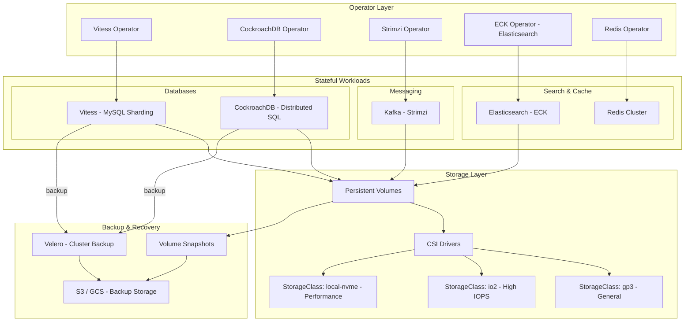
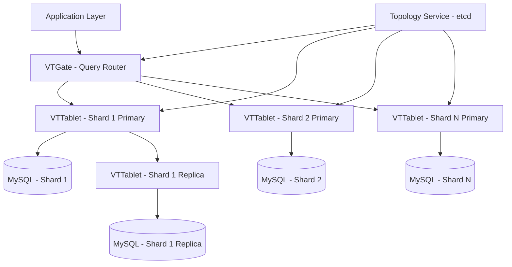

# Stateful Workloads at Scale on Kubernetes

## 1. Overview

Running stateful workloads on Kubernetes -- databases, message queues, search engines, caches -- was once considered inadvisable. The conventional wisdom was "Kubernetes is for stateless workloads; run databases on managed services." That era is over. Organizations including Slack (Vitess/MySQL), DoorDash (CockroachDB), LinkedIn (Kafka via Strimzi), and hundreds of others run production databases, message brokers, and search clusters on Kubernetes at massive scale. The Data on Kubernetes (DoK) community reports that 90%+ of organizations are running or evaluating stateful workloads on Kubernetes.

The shift happened because Kubernetes operators matured. An operator encodes the domain knowledge of a database administrator -- backup schedules, failover procedures, replication topology, scaling decisions -- into software that runs as a Kubernetes controller. The Vitess Operator manages hundreds of MySQL shards. The CockroachDB Operator handles rolling upgrades across a distributed SQL cluster. The Strimzi Operator manages Kafka brokers, topics, users, and MirrorMaker replication. These operators transform Kubernetes from "an orchestrator that cannot understand databases" into "a platform where database operations are automated."

The critical design challenges for stateful workloads on Kubernetes are: persistent storage that survives pod rescheduling, ordered and graceful scaling (StatefulSets), backup and disaster recovery, performance tuning for storage I/O, and operator selection and lifecycle management. This case study covers these challenges through the lens of real production deployments at Slack, DoorDash, LinkedIn, and others.

## 2. Requirements

### Functional Requirements
- Databases, message queues, and search engines run on Kubernetes with production-grade reliability.
- Operators automate day-2 operations: backup, restore, failover, scaling, upgrades.
- Persistent storage survives pod restarts, rescheduling, and node failures.
- Data replication provides fault tolerance (no single point of failure).
- Performance matches or approaches bare-metal/managed service levels.

### Non-Functional Requirements
- **Availability**: 99.99% for databases (< 52 minutes downtime/year).
- **Durability**: Zero data loss (RPO = 0 for synchronous replication; RPO < 1 minute for async).
- **Performance**: Database query latency < 5ms (P99) for OLTP workloads; Kafka produce latency < 10ms (P99).
- **Scalability**: Databases scale to 100+ shards (Vitess), 500+ brokers (Kafka), 100+ nodes (Elasticsearch).
- **Recovery**: RTO < 5 minutes for automated failover; RTO < 30 minutes for disaster recovery from backup.
- **Storage**: IOPS > 10,000 for OLTP databases; throughput > 500 MB/s for streaming workloads.

## 3. High-Level Architecture



## 4. Core Design Decisions

### Operators over Helm Charts

Stateful workloads require operational intelligence that Helm charts cannot provide. A Helm chart can install a database; an operator can manage it. The distinction:

| Capability | Helm Chart | Operator |
|-----------|-----------|---------|
| Installation | Yes | Yes |
| Configuration | Yes (values.yaml) | Yes (CRD spec) |
| Automated failover | No | Yes (detects failure, promotes replica) |
| Rolling upgrade | Basic (StatefulSet) | Intelligent (drains, verifies replication, upgrades one-at-a-time) |
| Backup scheduling | No (separate CronJob) | Yes (built into CRD spec) |
| Scaling | Manual (change replica count) | Automated (monitors load, adds shards/brokers) |
| Schema migration | No | Some (Vitess VSchema, CockroachDB schema changes) |

Operators encode domain expertise. The Strimzi Operator knows that rebalancing Kafka partition replicas after adding a broker requires Cruise Control. The Vitess Operator knows that resharding requires creating new tablets, copying data, and cutting over traffic atomically. This knowledge, encoded as software, eliminates the need for a dedicated DBA for each database cluster.

### StatefulSet as the Foundation

All stateful workloads on Kubernetes use StatefulSets, which provide:

- **Stable network identity**: Each pod gets a predictable DNS name (`{pod-name}.{service-name}.{namespace}.svc.cluster.local`). For databases, this is critical -- replicas need to find each other by name for replication configuration.
- **Ordered deployment and scaling**: Pods are created in order (0, 1, 2, ...) and terminated in reverse order. This ensures that the primary database pod (ordinal 0) starts first and stops last.
- **Stable storage**: Each pod gets its own PVC that persists across pod restarts. If pod-2 is rescheduled to a different node, its PVC follows (for network-attached storage) or the pod is scheduled back to the same node (for local storage).

See [StatefulSets and stateful workloads](../03-workload-design/03-statefulsets-and-stateful-workloads.md).

### Storage Tiering

Different stateful workloads have different storage requirements. A one-size-fits-all StorageClass wastes money or underperforms:

| Workload | StorageClass | IOPS | Throughput | Latency | Cost |
|----------|-------------|------|-----------|---------|------|
| OLTP Database (Vitess, CockroachDB) | gp3 (tuned) or io2 | 10,000-64,000 | 250-4,000 MB/s | < 1ms | Medium-High |
| Kafka Brokers | gp3 | 3,000-16,000 | 500-1,000 MB/s | < 2ms | Medium |
| Elasticsearch | gp3 | 3,000-6,000 | 250-500 MB/s | < 2ms | Medium |
| Redis (persistence) | gp3 or local NVMe | 3,000 | 125 MB/s | < 1ms | Low |
| Backup/Archive | S3/GCS (object storage) | N/A | N/A | N/A | Low |

See [persistent storage architecture](../05-storage-design/01-persistent-storage-architecture.md) and [CSI drivers and storage classes](../05-storage-design/02-csi-drivers-and-storage-classes.md).

## 5. Deep Dives

### 5.1 Vitess at Slack -- MySQL Sharding on Kubernetes

Slack runs Vitess on Kubernetes to shard their MySQL databases, serving billions of messages across thousands of channels for millions of users. Vitess (originally built at YouTube, now a CNCF graduated project) provides horizontal MySQL sharding with a Kubernetes-native operator.

**Architecture:**



**Key components:**
- **VTGate**: Stateless query router that accepts MySQL protocol connections and routes queries to the correct shard based on the VSchema (virtual schema that defines sharding keys).
- **VTTablet**: Sidecar process that runs alongside each MySQL instance, handling replication, health checks, and query normalization.
- **Topology Service**: etcd-backed metadata store that tracks shard assignments, tablet health, and replication topology.

**Vitess Operator on Kubernetes:**
```yaml
apiVersion: planetscale.com/v2
kind: VitessCluster
metadata:
  name: slack-vitess
spec:
  images:
    vtgate: vitess/lite:v19
    vttablet: vitess/lite:v19
  cells:
    - name: cell1
      gateway:
        replicas: 3
        resources:
          requests:
            cpu: "2"
            memory: 4Gi
  keyspaces:
    - name: messages
      turndownPolicy: Immediate
      partitionings:
        - equal:
            parts: 8    # 8 shards
            shardTemplate:
              databaseInitScriptSecret:
                name: init-script
              tabletPools:
                - cell: cell1
                  type: replica
                  replicas: 3
                  dataVolumeClaimTemplate:
                    storageClassName: io2-high-iops
                    resources:
                      requests:
                        storage: 500Gi
                  resources:
                    requests:
                      cpu: "4"
                      memory: 16Gi
```

**Slack's scale:**
- Hundreds of MySQL shards managed by Vitess
- Billions of messages stored across shards
- VTGate handles transparent query routing -- applications connect to VTGate as if it were a single MySQL instance
- Resharding (splitting a shard that has grown too large) is online and transparent to applications

PlanetScale (the company behind Vitess) reports managing hundreds of thousands of database clusters on Kubernetes using the Vitess Operator, demonstrating the operator pattern's scalability.

### 5.2 CockroachDB at DoorDash -- Distributed SQL

DoorDash migrated from Amazon Aurora PostgreSQL to CockroachDB to solve availability and consistency challenges in their multi-region delivery platform. CockroachDB runs on Kubernetes using the CockroachDB Operator.

**Why CockroachDB over Aurora:**
- **Multi-region active-active**: CockroachDB replicates data across regions with strong consistency (serializable isolation), enabling active-active writes in multiple regions. Aurora provides read replicas but not multi-region active-active writes.
- **Kubernetes-native**: CockroachDB's architecture (shared-nothing, peer-to-peer) maps naturally to Kubernetes StatefulSets. Each CockroachDB node is a pod with local storage.
- **Online schema changes**: CockroachDB supports online schema migrations without locking tables, critical for DoorDash's high-throughput order processing.

**Migration strategy:**
1. **Dual-write**: DoorDash built a custom extraction tool that simultaneously wrote to both Aurora and CockroachDB during transition.
2. **Validation**: A reconciliation job compared data between Aurora and CockroachDB, flagging discrepancies.
3. **Cutover**: Once validation passed for 7+ days, read traffic shifted to CockroachDB, then write traffic.
4. **Revert capability**: The dual-write tool had an emergency revert function that could redirect all traffic back to Aurora.

**CockroachDB on Kubernetes configuration:**
```yaml
apiVersion: crdb.cockroachlabs.com/v1alpha1
kind: CrdbCluster
metadata:
  name: doordash-crdb
spec:
  dataStore:
    pvc:
      spec:
        storageClassName: gp3-encrypted
        resources:
          requests:
            storage: 1Ti
  resources:
    requests:
      cpu: "8"
      memory: 32Gi
    limits:
      cpu: "16"
      memory: 64Gi
  nodes: 9        # 3 nodes per AZ, 3 AZs
  additionalArgs:
    - "--cache=8GiB"
    - "--max-sql-memory=8GiB"
  topologySpreadConstraints:
    - maxSkew: 1
      topologyKey: topology.kubernetes.io/zone
      whenUnsatisfiable: DoNotSchedule
```

**DoorDash's scale:**
- 9+ CockroachDB nodes across 3 availability zones
- Serializable transaction isolation for order processing
- Sub-10ms P99 read latency for operational queries
- Automated failover: if a node fails, CockroachDB re-replicates data and the operator replaces the pod

### 5.3 Kafka on Kubernetes via Strimzi -- LinkedIn's Influence

Strimzi is the CNCF incubating project that brings Apache Kafka to Kubernetes. While LinkedIn (Kafka's birthplace) runs Kafka on bare metal, Strimzi incorporates LinkedIn's Cruise Control for automated rebalancing, and organizations worldwide run production Kafka on Kubernetes via Strimzi.

**Strimzi architecture:**
```yaml
apiVersion: kafka.strimzi.io/v1beta2
kind: Kafka
metadata:
  name: production-cluster
spec:
  kafka:
    version: 3.7.0
    replicas: 9
    listeners:
      - name: plain
        port: 9092
        type: internal
        tls: false
      - name: tls
        port: 9093
        type: internal
        tls: true
    config:
      offsets.topic.replication.factor: 3
      transaction.state.log.replication.factor: 3
      transaction.state.log.min.isr: 2
      default.replication.factor: 3
      min.insync.replicas: 2
      num.partitions: 12
    storage:
      type: jbod
      volumes:
        - id: 0
          type: persistent-claim
          size: 1Ti
          class: gp3-throughput
          deleteClaim: false
    resources:
      requests:
        cpu: "4"
        memory: 16Gi
      limits:
        cpu: "8"
        memory: 32Gi
    jvmOptions:
      -Xms: 8192m
      -Xmx: 8192m
    rack:
      topologyKey: topology.kubernetes.io/zone
  zookeeper:
    replicas: 3
    storage:
      type: persistent-claim
      size: 100Gi
      class: gp3
    resources:
      requests:
        cpu: "1"
        memory: 4Gi
  cruiseControl:
    brokerCapacity:
      disk: 1Ti
      cpuUtilization: 80
      inboundNetwork: 500Mi
      outboundNetwork: 500Mi
  entityOperator:
    topicOperator:
      resources:
        requests:
          cpu: 200m
          memory: 256Mi
    userOperator:
      resources:
        requests:
          cpu: 200m
          memory: 256Mi
```

**Strimzi operator capabilities:**
- **Topic management**: `KafkaTopic` CRD creates and configures topics declaratively.
- **User management**: `KafkaUser` CRD creates Kafka users with ACLs for authentication and authorization.
- **Rolling upgrades**: The operator upgrades brokers one at a time, waiting for partition replica sync before proceeding.
- **Cruise Control integration**: Automated partition rebalancing after adding/removing brokers.
- **MirrorMaker 2**: Cross-cluster replication for disaster recovery or geo-replication.

**Production scale considerations:**
- 9 brokers across 3 AZs with rack-awareness for zone-distributed replicas
- JBOD (Just a Bunch of Disks) storage with 1 TB per broker
- Throughput: 500 MB/s+ per broker with gp3 storage
- Produce latency: < 5ms P50, < 15ms P99 with acks=all and min.insync.replicas=2

### 5.4 Backup and Disaster Recovery

Backup strategies vary by workload type:

**Database backup (Vitess/CockroachDB):**
- **Logical backup**: `mysqldump` (Vitess) or `cockroach dump` at scheduled intervals (hourly for OLTP).
- **Physical backup**: Volume snapshots via CSI VolumeSnapshot API. Near-instant for EBS/persistent disk.
- **Continuous backup**: CockroachDB's `BACKUP ... RECURRING` provides incremental backups to S3/GCS every 15 minutes with 1-minute granularity.
- **Point-in-time recovery**: Restore to any timestamp within the backup retention window.

**Kafka backup:**
- **MirrorMaker 2**: Cross-cluster replication to a DR cluster in another region.
- **Topic backup**: Tools like `kafka-connect-s3` sink connector archive topic data to S3 for long-term retention.
- **Offset management**: Consumer group offsets are backed up alongside topic data for accurate replay.

**Cluster-level backup (Velero):**
- Velero backs up Kubernetes objects (CRDs, ConfigMaps, Secrets, RBAC) and optionally persistent volumes.
- Schedule: Kubernetes object backup hourly; PV snapshots daily.
- Retention: 30 days for daily backups, 7 days for hourly.
- Recovery: Restore to a new cluster in < 30 minutes for Kubernetes objects; PV restore depends on snapshot size.

### 5.5 Back-of-Envelope Estimation

**Vitess cluster sizing (Slack-scale):**
- 200 shards x 3 replicas (primary + 2 replicas) = 600 VTTablet pods
- Each VTTablet: 4 CPU, 16 Gi memory = 2,400 CPU, 9.6 TB memory
- Storage: 200 shards x 500 GB x 3 replicas = 300 TB
- VTGate: 10 replicas x 2 CPU, 4 Gi = 20 CPU, 40 Gi
- Nodes needed (dedicated): 2,400 CPU / 16 = 150 nodes (r5.4xlarge)

**Kafka cluster sizing (1 GB/s throughput):**
- Target: 1 GB/s aggregate throughput
- Per-broker throughput: 100-150 MB/s (conservative)
- Brokers needed: 1,000 / 125 = 8 brokers (round up to 9 for AZ distribution)
- Each broker: 4 CPU, 16 Gi memory, 1 TB storage
- Replication factor 3: 1 GB/s input = 3 GB/s total I/O (2 GB/s replication)
- Storage retention (7 days): 1 GB/s x 86,400 s x 7 = 604 TB raw, x3 replication = 1.8 PB
- With compression (2x): 900 TB across 9 brokers = 100 TB/broker

**CockroachDB cluster sizing (DoorDash-scale):**
- 9 nodes across 3 AZs
- Each node: 8 CPU, 32 Gi memory, 1 Ti storage
- Total: 72 CPU, 288 Gi memory, 9 Ti storage
- Replication factor 3: effective storage = 3 Ti
- Write throughput: ~10,000 writes/sec (serializable)
- Read throughput: ~50,000 reads/sec (with read replicas)

## 6. Data Model

### Storage Class Configuration
```yaml
# High IOPS for OLTP databases
apiVersion: storage.k8s.io/v1
kind: StorageClass
metadata:
  name: io2-high-iops
provisioner: ebs.csi.aws.com
parameters:
  type: io2
  iopsPerGB: "50"
  encrypted: "true"
  kmsKeyId: "arn:aws:kms:us-east-1:123456:key/abc123"
volumeBindingMode: WaitForFirstConsumer
allowVolumeExpansion: true
reclaimPolicy: Retain
---
# Throughput-optimized for Kafka
apiVersion: storage.k8s.io/v1
kind: StorageClass
metadata:
  name: gp3-throughput
provisioner: ebs.csi.aws.com
parameters:
  type: gp3
  iops: "6000"
  throughput: "500"
  encrypted: "true"
volumeBindingMode: WaitForFirstConsumer
allowVolumeExpansion: true
reclaimPolicy: Retain
```

### Volume Snapshot for Backup
```yaml
apiVersion: snapshot.storage.k8s.io/v1
kind: VolumeSnapshot
metadata:
  name: vitess-shard0-primary-backup
  labels:
    app: vitess
    shard: "0"
    backup-schedule: hourly
spec:
  volumeSnapshotClassName: ebs-snapshot-class
  source:
    persistentVolumeClaimName: data-vitess-shard0-primary-0
---
apiVersion: snapshot.storage.k8s.io/v1
kind: VolumeSnapshotClass
metadata:
  name: ebs-snapshot-class
driver: ebs.csi.aws.com
deletionPolicy: Retain
parameters:
  tagSpecification_1: "backup-type=hourly"
```

## 7. Scaling Considerations

### Horizontal Scaling

Stateful workloads scale horizontally through different mechanisms:

- **Vitess**: Add new shards via `VitessKeyspace` CRD update. The operator creates new tablets, performs online resharding (copying data to new shards), and cuts over traffic atomically. Zero downtime.
- **CockroachDB**: Add nodes by increasing the `nodes` field in the CRD. CockroachDB automatically rebalances ranges to new nodes. The rebalancing process takes time proportional to the data volume.
- **Kafka**: Add brokers by increasing `replicas` in the Strimzi `Kafka` CRD. Existing partitions are not automatically redistributed; Cruise Control must be invoked to rebalance partitions to new brokers.
- **Elasticsearch**: Add data nodes by increasing the node count in the ECK `Elasticsearch` CRD. Elasticsearch automatically rebalances shards to new nodes.
- **Redis**: Redis Cluster uses hash slots. Adding a node requires slot migration, which the Redis Operator automates.

### Performance Tuning

Key performance tuning areas for stateful workloads on Kubernetes:

1. **Storage I/O**: Use `WaitForFirstConsumer` volume binding to colocate PVs with pods. For maximum performance, use local NVMe storage (instance store) with local-volume-provisioner, accepting the trade-off that pod rescheduling requires data rebuild.

2. **Network**: Use `hostNetwork: true` for latency-critical database pods (eliminates CNI overlay overhead, ~0.1ms savings). Use dedicated network interfaces for replication traffic vs. client traffic.

3. **CPU pinning**: For latency-sensitive databases, use `Guaranteed` QoS class (requests == limits) and `cpuManagerPolicy: static` to pin database processes to dedicated CPU cores, eliminating context switching.

4. **Memory**: Databases typically manage their own memory (buffer pools, caches). Set container memory limits slightly above the database's configured memory to allow for OS overhead without OOM kills. Example: CockroachDB `--cache=8GiB` with container limit of 12Gi.

5. **NUMA awareness**: For large database pods (16+ CPU), ensure NUMA-aware scheduling via Topology Manager to prevent cross-NUMA memory access, which adds 30-50% latency.

### Operator Lifecycle

Operators themselves must be managed:

- **Operator upgrades**: Upgrade the operator independently from the managed workload. The operator CRD should support multiple workload versions.
- **Operator HA**: Run operator controllers with multiple replicas and leader election. A single operator pod failure should not affect the managed stateful workload.
- **CRD versioning**: CRD schema changes must be backward compatible. Use conversion webhooks for breaking changes.
- **Monitoring the operator**: The operator itself needs monitoring (reconciliation latency, error rates, leader elections).

## 8. Failure Modes & Mitigations

| Failure | Impact | Mitigation |
|---------|--------|------------|
| Database pod crash | Brief unavailability for that shard/node | StatefulSet restarts pod on same node (local storage) or any node (network storage); operator promotes replica to primary |
| Storage volume corruption | Data loss for affected volume | Volume snapshots provide point-in-time recovery; database replication ensures at least 2 copies exist |
| Node failure (with local NVMe) | Pod cannot restart on same node | Operator detects failure, provisions new pod on different node, triggers data rebuild from replica |
| Kafka broker failure | Temporary under-replication of partitions | Strimzi operator detects failure, creates new broker pod; Kafka replicates under-replicated partitions to new broker |
| Operator failure | No automated operations (backup, failover) | Operator runs with HA (2 replicas); existing workloads continue running without the operator (they are self-contained) |
| etcd corruption (Vitess topology) | Vitess routing is broken | etcd runs with 3 replicas; backup/restore from snapshot; VTGate caches topology for short-term resilience |
| Split-brain (network partition) | Two primaries accept writes | CockroachDB: Raft consensus prevents split-brain. Vitess: semi-sync replication prevents divergent writes. Kafka: min.insync.replicas prevents writes to minority partition |

### Cascade Failure Scenario

Consider a storage system failure affecting a Vitess deployment:

1. **Trigger**: AWS EBS experiences elevated latency in us-east-1a (a real-world event that has occurred).
2. **Impact**: Vitess primary tablets in AZ-a experience I/O timeouts. Write queries fail after 5-second timeout.
3. **Detection**: VTTablet health checks fail; Vitess marks AZ-a primaries as unhealthy.
4. **Automated failover**: The Vitess Operator detects unhealthy primaries and promotes replicas in AZ-b or AZ-c to primary. Failover completes in 15-30 seconds.
5. **Application impact**: Applications connected to VTGate experience 15-30 seconds of write errors, then automatic recovery as VTGate discovers new primary locations via the topology service.
6. **Recovery**: When EBS latency recovers, the Operator reconfigures the former primaries as replicas and rebuilds replication.

The entire failover is automated -- no human intervention required. This is the operator pattern's value proposition: encoding DBA knowledge into software.

## 9. Key Takeaways

- Operators are the key enabler for stateful workloads on Kubernetes. Without operators, running databases on Kubernetes requires manual DBA intervention for every failover, backup, and upgrade. With operators, these operations are automated.
- StatefulSets provide the foundation (stable identity, ordered scaling, persistent storage), but operators provide the intelligence (failover logic, backup scheduling, rebalancing).
- Storage tiering is critical. Using the same StorageClass for OLTP databases and Kafka wastes money (over-provisioning IOPS for Kafka) or underperforms (insufficient IOPS for databases).
- Backup and disaster recovery must be designed from day one, not retrofitted. Volume snapshots, logical backups, and cross-region replication should be configured at deployment time.
- Performance tuning for stateful workloads on Kubernetes requires understanding both Kubernetes primitives (QoS, CPU manager, topology manager) and database internals (buffer pools, WAL configuration, replication modes).
- The "run databases on managed services" advice is no longer universally correct. For organizations that need multi-cloud portability, fine-grained control, or cost optimization, Kubernetes-native databases with operators provide a viable alternative.

## 10. Related Concepts

- [StatefulSets and Stateful Workloads (ordered scaling, stable identity)](../03-workload-design/03-statefulsets-and-stateful-workloads.md)
- [Persistent Storage Architecture (PV, PVC, dynamic provisioning)](../05-storage-design/01-persistent-storage-architecture.md)
- [CSI Drivers and Storage Classes (EBS, persistent disk, local volumes)](../05-storage-design/02-csi-drivers-and-storage-classes.md)
- [Stateful Data Patterns (database-per-service, replication, backup)](../05-storage-design/03-stateful-data-patterns.md)
- [Pod Design Patterns (sidecar for backup agents, init containers for schema migration)](../03-workload-design/01-pod-design-patterns.md)
- [Monitoring and Metrics (database metrics, operator observability)](../09-observability-design/01-monitoring-and-metrics.md)
- [Node Pool Strategy (dedicated pools for stateful workloads)](../02-cluster-design/02-node-pool-strategy.md)

## 11. Comparison with Related Systems

| Aspect | Vitess (MySQL Sharding) | CockroachDB (Distributed SQL) | Strimzi (Kafka) | ECK (Elasticsearch) |
|--------|------------------------|------------------------------|-----------------|---------------------|
| Data model | Relational (MySQL) | Relational (PostgreSQL-compatible) | Log (append-only) | Document (JSON) |
| Consistency | Per-shard strong, cross-shard eventual | Serializable (global) | Eventual (within topic) | Eventual |
| Sharding | VSchema-defined (manual key selection) | Automatic (range-based) | Partition-based | Shard-based (automatic) |
| Scaling unit | Shard (add shards, each has primary + replicas) | Node (add nodes, ranges rebalance) | Broker (add brokers, rebalance partitions) | Data node (add nodes, rebalance shards) |
| Failover | Operator promotes replica within shard | Raft-based automatic | ISR-based leader election | Cluster health (automatic) |
| K8s operator | PlanetScale Vitess Operator | CockroachDB Operator | Strimzi | Elastic Cloud on Kubernetes (ECK) |
| Use case | High-scale MySQL (YouTube, Slack, GitHub) | Multi-region OLTP (DoorDash, Nubank) | Event streaming (all scales) | Search, logging, analytics |

### Architectural Lessons

1. **Operators convert database tribal knowledge into automation.** The most valuable operators encode the knowledge that a DBA would use during a failover or upgrade -- checking replication lag, waiting for sync, promoting replicas in the right order. This knowledge, once encoded, applies to every cluster the operator manages.

2. **StatefulSet is necessary but not sufficient.** StatefulSets provide stable identity and persistent storage, but they do not understand database semantics. An operator that understands "this pod is a primary, that pod is a replica, and you cannot terminate the primary without first promoting a replica" is what makes stateful workloads safe on Kubernetes.

3. **Local NVMe storage provides the best performance but the hardest recovery.** For latency-critical workloads, local NVMe SSDs (no network hop) provide 10-50x better IOPS than network-attached storage. But if the node fails, the data is gone. This requires either fast data rebuild from replicas or accepting the recovery time.

4. **The operator pattern scales to fleet management.** A single Vitess Operator can manage hundreds of shards. A single Strimzi Operator can manage multiple Kafka clusters. The operator pattern's scalability is limited by the API server's capacity, not the operator's logic.

5. **Backup is a day-one concern, not a day-two optimization.** Every stateful workload deployed on Kubernetes must have automated backups configured before receiving production traffic. Volume snapshots + logical backups + cross-region replication provide defense-in-depth for data durability.

## 12. Source Traceability

| Section | Source |
|---------|--------|
| Vitess at Slack, PlanetScale Operator | PlanetScale: "Scaling hundreds of thousands of database clusters on Kubernetes"; Vitess documentation (vitess.io); PlanetScale Vitess Operator GitHub |
| CockroachDB at DoorDash | The New Stack: "How DoorDash Migrated from Aurora Postgres to CockroachDB"; CockroachDB documentation |
| Strimzi and Kafka on Kubernetes | Strimzi documentation (strimzi.io); CNCF Incubation announcement (2024); Cruise Control integration |
| Data on Kubernetes community | Data on Kubernetes (DoK) community reports and surveys |
| ECK (Elasticsearch on Kubernetes) | Elastic documentation for ECK operator |
| Backup and recovery patterns | Velero documentation; Kubernetes VolumeSnapshot API documentation |
