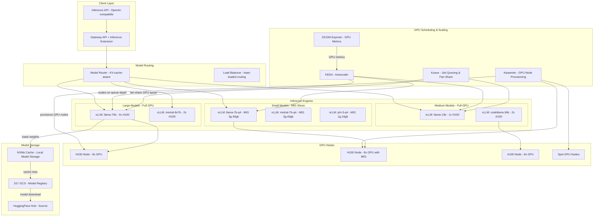
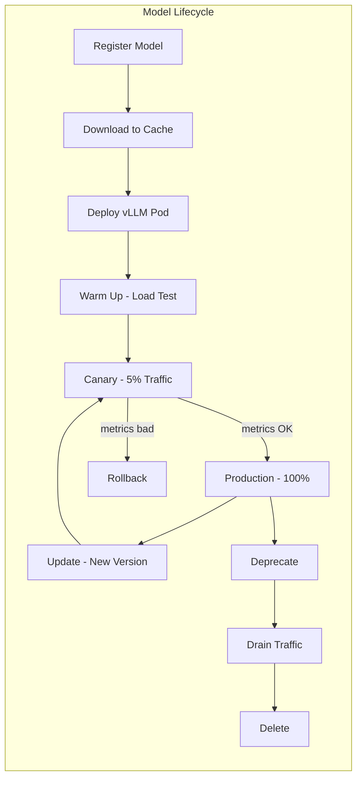
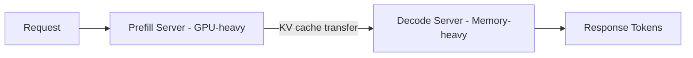

# Designing a GPU Cluster for GenAI Inference on Kubernetes

## 1. Overview

This case study presents the design of a production GPU cluster for serving large language models (LLMs) on Kubernetes. It is the primary GenAI case study in this knowledge base, covering vLLM deployment, GPU scheduling (MIG partitioning, time-sharing), autoscaling on inference-specific metrics (queue depth, KV cache utilization), model lifecycle management, cost optimization with spot GPUs, and multi-model serving. The design targets serving 10-50 LLM models simultaneously with sub-2-second time-to-first-token (TTFT) and throughput of 1,000+ requests per second aggregate across all models.

GPU inference is the most expensive workload in modern Kubernetes. A single H100 GPU costs $4-8/hour on-demand; a 64-GPU cluster costs $250-500K/year. At these costs, the difference between a well-designed and a poorly-designed inference platform is millions of dollars per year. The core optimization challenges are: maximizing GPU utilization (target > 70%, typical is 30-40%), minimizing idle GPU time (scale-to-zero for low-traffic models), right-sizing GPU allocation to model requirements (MIG slices for small models, full GPUs for large models), and autoscaling on the right signals (queue depth and KV cache, not CPU or memory).

The platform uses vLLM as the inference engine, NVIDIA DCGM Exporter for GPU metrics, Prometheus for metrics aggregation, KEDA for autoscaling, Kueue for GPU job queuing and fair-sharing, and Karpenter for node provisioning. The Gateway API Inference Extension provides model-aware routing with KV-cache-aware scheduling.

## 2. Requirements

### Functional Requirements
- Serve 10-50 LLM models simultaneously (7B to 70B parameters, various quantization levels).
- Provide a unified inference API with model routing (client specifies model name, platform routes to correct backend).
- Support model versioning and A/B testing (canary deployments for new model versions).
- Enable model lifecycle management: deploy, scale, update, deprecate, and remove models.
- Provide cost allocation per model and per team.

### Non-Functional Requirements
- **Latency**: TTFT < 2 seconds for 70B models; TTFT < 500ms for 7B models at P95.
- **Throughput**: 1,000+ requests/second aggregate across all models.
- **GPU utilization**: Average > 70% during active serving hours.
- **Availability**: 99.9% for production models; scale-to-zero acceptable for staging/experimental models.
- **Cost efficiency**: < $0.001 per 1,000 output tokens for 7B models; < $0.01 per 1,000 output tokens for 70B models.
- **Cold start**: Scale from zero to serving in < 5 minutes (model loading is the bottleneck).
- **Multi-tenancy**: Multiple teams share GPU resources with fair-sharing quotas.

## 3. High-Level Architecture



## 4. Core Design Decisions

### vLLM as the Inference Engine

vLLM is the production inference engine of choice for LLM serving on Kubernetes. Key features that drive this decision:

- **PagedAttention**: vLLM's memory management system allocates KV cache in non-contiguous pages, achieving near-optimal GPU memory utilization. Without PagedAttention, memory fragmentation wastes 20-40% of available GPU memory.
- **Continuous batching**: vLLM batches requests dynamically at the iteration level (not the request level), achieving 2-5x higher throughput than static batching frameworks.
- **Tensor parallelism**: Built-in support for splitting models across multiple GPUs on the same node via NVLink, enabling serving of models larger than a single GPU's memory (e.g., 70B FP16 = 140 GB, requiring 2x H100 80 GB).
- **OpenAI-compatible API**: vLLM exposes an API identical to OpenAI's, enabling drop-in replacement and client library compatibility.
- **Prometheus metrics**: vLLM exposes `vllm:num_requests_waiting`, `vllm:gpu_cache_usage_perc`, `vllm:avg_generation_throughput_toks_per_s`, and other metrics that are essential for autoscaling.

See [GPU and accelerator workloads](../03-workload-design/05-gpu-and-accelerator-workloads.md) for GPU scheduling fundamentals.

### GPU Scheduling: MIG, Time-Sharing, and Full GPU

The platform uses three GPU allocation modes matched to model size:

**Full GPU allocation** (models > 10B parameters or latency-critical):
- Model gets exclusive access to 1, 2, 4, or 8 GPUs
- Zero contention, maximum throughput
- Required for tensor parallelism across GPUs
- Cost: $4-8/hour per H100

**MIG (Multi-Instance GPU)** (models < 10B parameters, quantized):
- A single A100/H100 is partitioned into isolated instances (e.g., 7x 1g.10gb or 3x 3g.40gb)
- Each MIG instance has dedicated compute, memory, and memory bandwidth
- A 7B INT4 model (~4 GB) fits in a MIG 1g.10gb slice, costing ~$0.57/hour instead of $4/hour
- No GPU sharing overhead -- MIG instances are physically isolated

**Time-sharing** (development/staging only):
- Multiple pods share a single GPU with context switching
- 10-50ms latency variance per context switch -- unsuitable for production inference
- Acceptable for development environments where cost matters more than latency
- Configured via NVIDIA GPU Operator time-sharing settings

```yaml
# MIG configuration for small models
apiVersion: v1
kind: ConfigMap
metadata:
  name: mig-config
  namespace: gpu-operator
data:
  config.yaml: |
    version: v1
    mig-configs:
      all-3g.40gb:
        - devices: [0, 1, 2, 3, 4, 5, 6, 7]
          mig-enabled: true
          mig-devices:
            "3g.40gb": 2    # 2 MIG slices per GPU = 16 slices per node
      mixed:
        - devices: [0, 1, 2, 3]
          mig-enabled: true
          mig-devices:
            "3g.40gb": 2
        - devices: [4, 5, 6, 7]
          mig-enabled: false  # Full GPUs for large models
```

See [GPU and accelerator workloads](../03-workload-design/05-gpu-and-accelerator-workloads.md) for MIG configuration details.

### Autoscaling on Inference Metrics

Standard Kubernetes HPA metrics (CPU, memory) are meaningless for GPU inference:
- **CPU**: The host CPU is barely involved in inference -- 5% CPU on a GPU node is normal during heavy inference.
- **Memory**: vLLM pre-allocates the entire GPU memory for KV cache at startup, so GPU memory is always at 95%+ regardless of load.
- **GPU utilization (DCGM)**: Reports SM duty cycle, not throughput. 100% utilization could mean 1 request or 1,000 requests.

The correct scaling signals are:

1. **Queue depth** (`vllm:num_requests_waiting`): The number of requests waiting in vLLM's internal queue. When queue depth grows, latency increases. Target: scale up when queue depth > 10 for more than 30 seconds.

2. **KV cache utilization** (`vllm:gpu_cache_usage_perc`): When KV cache approaches 100%, vLLM must either reject new requests or preempt existing ones (swapping KV cache to CPU memory). Target: scale up when KV cache > 85%.

3. **Time-to-first-token (TTFT)**: A latency SLO signal. If TTFT exceeds the target (e.g., > 2 seconds for 70B model), the system is overloaded.

```yaml
apiVersion: keda.sh/v1alpha1
kind: ScaledObject
metadata:
  name: llama-70b-scaler
  namespace: inference
spec:
  scaleTargetRef:
    name: llama-70b-vllm
  pollingInterval: 15
  cooldownPeriod: 300      # 5 min cooldown to avoid thrashing (model loading is slow)
  minReplicaCount: 1       # Never scale to zero for production models
  maxReplicaCount: 8
  triggers:
    - type: prometheus
      metadata:
        serverAddress: http://prometheus.monitoring:9090
        query: |
          avg(vllm:num_requests_waiting{model_name="llama-70b"})
        threshold: "10"
        activationThreshold: "2"
    - type: prometheus
      metadata:
        serverAddress: http://prometheus.monitoring:9090
        query: |
          avg(vllm:gpu_cache_usage_perc{model_name="llama-70b"})
        threshold: "85"
```

See [GPU-aware autoscaling](../06-scaling-design/04-gpu-aware-autoscaling.md) for the complete metrics pipeline.

### Model-Aware Routing with Gateway API

The Gateway API Inference Extension (GA in v1.3.1, February 2026) provides model-aware routing:

- **Model-name routing**: Clients specify the model name in the request (`model: "llama-70b"`); the gateway routes to the correct backend.
- **KV-cache-aware scheduling**: The gateway considers KV cache utilization across replicas and routes requests to the replica with the most available KV cache, improving packing efficiency.
- **Traffic splitting for A/B testing**: Route 10% of requests to a new model version while 90% go to the current version.
- **Prefix-cache-aware routing**: Route requests with similar prompt prefixes to the same replica, maximizing prefix cache hit rates.

```yaml
apiVersion: inference.networking.x-k8s.io/v1alpha2
kind: InferencePool
metadata:
  name: llama-models
spec:
  targetPortNumber: 8000
  selector:
    matchLabels:
      app: vllm
  extensionRef:
    name: kv-cache-aware-router
---
apiVersion: gateway.networking.k8s.io/v1
kind: HTTPRoute
metadata:
  name: inference-route
spec:
  parentRefs:
    - name: inference-gateway
  rules:
    - matches:
        - path:
            type: PathPrefix
            value: /v1/chat/completions
      backendRefs:
        - group: inference.networking.x-k8s.io
          kind: InferencePool
          name: llama-models
```

## 5. Deep Dives

### 5.1 vLLM Deployment on Kubernetes

A production vLLM deployment for a 70B model:

```yaml
apiVersion: apps/v1
kind: Deployment
metadata:
  name: llama-70b-vllm
  namespace: inference
spec:
  replicas: 2
  selector:
    matchLabels:
      app: vllm
      model: llama-70b
  template:
    metadata:
      labels:
        app: vllm
        model: llama-70b
        gpu-model: h100
      annotations:
        prometheus.io/scrape: "true"
        prometheus.io/port: "8000"
        prometheus.io/path: "/metrics"
    spec:
      nodeSelector:
        nvidia.com/gpu.product: "NVIDIA-H100-80GB-HBM3"
      tolerations:
        - key: nvidia.com/gpu
          operator: Exists
          effect: NoSchedule
      containers:
        - name: vllm
          image: vllm/vllm-openai:v0.6.5
          command:
            - python3
            - -m
            - vllm.entrypoints.openai.api_server
          args:
            - --model=/models/llama-70b-hf
            - --tensor-parallel-size=4
            - --max-model-len=8192
            - --gpu-memory-utilization=0.92
            - --enable-prefix-caching
            - --enforce-eager         # Faster startup, slightly lower throughput
            - --max-num-seqs=256
            - --port=8000
          ports:
            - containerPort: 8000
              name: http
          resources:
            requests:
              cpu: "8"
              memory: 64Gi
              nvidia.com/gpu: "4"
            limits:
              cpu: "16"
              memory: 128Gi
              nvidia.com/gpu: "4"
          readinessProbe:
            httpGet:
              path: /health
              port: 8000
            initialDelaySeconds: 180  # Model loading takes 2-3 minutes
            periodSeconds: 10
          livenessProbe:
            httpGet:
              path: /health
              port: 8000
            initialDelaySeconds: 300
            periodSeconds: 30
          volumeMounts:
            - name: model-weights
              mountPath: /models
            - name: shm
              mountPath: /dev/shm    # Required for tensor parallelism IPC
          env:
            - name: HUGGING_FACE_HUB_TOKEN
              valueFrom:
                secretKeyRef:
                  name: hf-token
                  key: token
      volumes:
        - name: model-weights
          persistentVolumeClaim:
            claimName: model-cache-nvme   # Local NVMe for fast model loading
        - name: shm
          emptyDir:
            medium: Memory
            sizeLimit: 16Gi               # Shared memory for tensor parallel
      terminationGracePeriodSeconds: 60   # Allow in-flight requests to complete
```

**Key configuration rationale:**
- `tensor-parallel-size=4`: Splits the 70B model across 4 GPUs. Requires NVLink between GPUs (900 GB/s on H100 vs. 128 GB/s PCIe).
- `gpu-memory-utilization=0.92`: Allocates 92% of GPU memory to KV cache. Remaining 8% for model weights and activation memory.
- `enable-prefix-caching`: Caches prompt prefix KV tensors, reducing computation for repeated system prompts. Especially effective for chat applications where the system prompt is identical across requests.
- `/dev/shm` with 16 Gi: Tensor parallelism uses shared memory for inter-GPU communication. Insufficient shared memory causes silent performance degradation.
- `initialDelaySeconds: 180`: Model loading for 70B takes 2-3 minutes from local NVMe. Without this delay, the readiness probe fails and Kubernetes kills the pod in a restart loop.

### 5.2 Model Lifecycle Management



**Model registration:**
- Models are registered in a model catalog (custom CRD or ConfigMap) with metadata: name, size, quantization, GPU requirements, SLO targets.
- Registration triggers model download to a shared NVMe cache volume, so that deployment does not wait for download.

**Model update (canary):**
- New model version is deployed as a separate Deployment.
- Gateway API traffic splitting routes 5% of traffic to the new version.
- Automated analysis compares TTFT, throughput, and error rate between versions.
- If the new version meets SLOs, traffic shifts to 100%. If not, rollback to 0%.

**Scale-to-zero for low-traffic models:**
- KEDA scales models with < 1 request/minute to zero replicas after a cooldown period.
- When a request arrives for a scaled-to-zero model, KEDA activates a replica (activation threshold: 1 request).
- Cold start time: 3-5 minutes (node provisioning + model loading). During this time, the request is queued by the gateway.
- Acceptable for staging, experimental, or internal models. Not acceptable for latency-sensitive production models.

### 5.3 Cost Optimization with Spot GPUs

GPU spot instances provide 60-70% cost savings but require architectural support:

**Spot-eligible workloads:**
- Batch inference (offline processing, embeddings generation)
- A/B test model variants (not primary production traffic)
- Development and staging model serving
- Models with > 2 replicas (losing one replica is tolerable)

**Spot-ineligible workloads:**
- Primary production model replicas (minimum replica count must be on-demand)
- Models with exactly 1 replica (no failover)
- Latency-critical models where cold start during spot replacement is unacceptable

**Karpenter configuration for spot GPU nodes:**
```yaml
apiVersion: karpenter.sh/v1
kind: NodePool
metadata:
  name: gpu-spot
spec:
  template:
    spec:
      requirements:
        - key: karpenter.sh/capacity-type
          operator: In
          values: ["spot"]
        - key: node.kubernetes.io/instance-type
          operator: In
          values: ["p5.48xlarge", "p4d.24xlarge", "g5.48xlarge"]
        - key: karpenter.k8s.aws/instance-gpu-count
          operator: Gt
          values: ["0"]
      taints:
        - key: gpu-spot
          value: "true"
          effect: NoSchedule
  limits:
    nvidia.com/gpu: "64"   # Max 64 spot GPUs
  disruption:
    consolidationPolicy: WhenEmpty
    consolidateAfter: 60s
```

**Cost math:**
- H100 on-demand: $4.50/hour per GPU
- H100 spot: $1.50/hour per GPU (67% discount)
- Production cluster: 32 GPUs on-demand + 32 GPUs spot
- Monthly cost: (32 x $4.50 x 730) + (32 x $1.50 x 730) = $105,120 + $35,040 = $140,160
- All on-demand: 64 x $4.50 x 730 = $210,240
- **Savings: $70,080/month ($840K/year)**

### 5.4 Kueue for GPU Fair-Sharing

Kueue provides multi-tenant GPU scheduling with fair-share quotas:

```yaml
apiVersion: kueue.x-k8s.io/v1beta1
kind: ClusterQueue
metadata:
  name: gpu-cluster-queue
spec:
  resourceGroups:
    - coveredResources: ["nvidia.com/gpu"]
      flavors:
        - name: h100-ondemand
          resources:
            - name: nvidia.com/gpu
              nominalQuota: 32
        - name: h100-spot
          resources:
            - name: nvidia.com/gpu
              nominalQuota: 32
  fairSharing:
    weight: 1
---
apiVersion: kueue.x-k8s.io/v1beta1
kind: LocalQueue
metadata:
  name: ml-team-queue
  namespace: ml-team
spec:
  clusterQueue: gpu-cluster-queue
---
apiVersion: kueue.x-k8s.io/v1beta1
kind: ResourceFlavor
metadata:
  name: h100-ondemand
spec:
  nodeLabels:
    karpenter.sh/capacity-type: on-demand
    nvidia.com/gpu.product: NVIDIA-H100-80GB-HBM3
---
apiVersion: kueue.x-k8s.io/v1beta1
kind: ResourceFlavor
metadata:
  name: h100-spot
spec:
  nodeLabels:
    karpenter.sh/capacity-type: spot
    nvidia.com/gpu.product: NVIDIA-H100-80GB-HBM3
```

Kueue ensures that:
- Team A cannot consume all GPUs while Team B's workloads wait
- Preemption follows priority: production models preempt batch jobs, never the reverse
- Borrowing: a team with idle quota can temporarily use another team's unused GPUs

### 5.5 Disaggregated Serving Architecture

Advanced deployments separate the inference pipeline into prefill (prompt processing) and decode (token generation) phases:



**Benefits of disaggregation:**
- **Prefill** is compute-bound (processing the entire prompt in parallel). It benefits from high-SM-count GPUs.
- **Decode** is memory-bandwidth-bound (generating one token at a time, reading KV cache). It benefits from high-memory-bandwidth GPUs.
- Separating them allows independent scaling: during a traffic spike, add more prefill servers (which process requests faster) without adding decode servers (which are not the bottleneck during prompt processing).

The `llm-d` project (open-source, announced 2026) provides a Kubernetes-native disaggregated serving framework with intelligent scheduling that optimizes for prefix cache hits and KV cache utilization.

### 5.6 Back-of-Envelope Estimation

**GPU cluster sizing for 50 models:**
- 5 large models (70B) x 4 GPUs each = 20 GPUs
- 10 medium models (13B-34B) x 1-2 GPUs each = 15 GPUs
- 15 small models (7B, quantized) x 0.5 GPU each (MIG) = 8 GPUs
- 20 experimental/staging models (scale-to-zero) = 0 GPUs (cold start on demand)
- Total base: 43 GPUs + 50% headroom for autoscaling = 65 GPUs
- Node count: 65 GPUs / 8 GPUs per node = ~9 nodes (8x H100)

**Cost projection:**
- 9 nodes x 8 GPUs x $4.50/hour = $324/hour = $236K/month
- With spot (50% of nodes): $177K/month
- With scale-to-zero for 20 models: ~$160K/month (save ~$17K by not running idle GPUs)
- With MIG for small models: already factored in (0.5 GPU per model vs. 1 GPU)

**Throughput estimation:**
- 70B model on 4x H100: ~200 tokens/sec per replica, 2 replicas = 400 tokens/sec
- 7B model on MIG 3g.40gb: ~500 tokens/sec per replica, 15 replicas = 7,500 tokens/sec
- Aggregate: ~10,000 tokens/sec across all models
- At average 200 tokens/response: ~50 responses/sec = ~180K responses/hour

**Model loading time:**
- 70B FP16 (140 GB) from NVMe: ~30 seconds
- 70B FP16 from S3: ~5 minutes (depends on network throughput)
- 7B INT4 (4 GB) from NVMe: ~3 seconds
- Cold start total (node provision + model load): 3-5 minutes for spot replacement

## 6. Data Model

### Model Catalog CRD
```yaml
apiVersion: inference.platform.io/v1
kind: InferenceModel
metadata:
  name: llama-70b-chat
  namespace: inference
spec:
  modelSource:
    repository: s3://model-registry/llama-70b-chat-hf
    format: huggingface
    size: 140Gi   # FP16 weight size
  serving:
    engine: vllm
    tensorParallelism: 4
    maxModelLength: 8192
    gpuMemoryUtilization: 0.92
    quantization: null   # FP16
  resources:
    gpu:
      type: nvidia.com/gpu
      model: H100-80GB
      count: 4
    memory: 64Gi
    cpu: "8"
  scaling:
    minReplicas: 1
    maxReplicas: 8
    metricsTarget:
      queueDepth: 10
      kvCacheUtilization: 85
    cooldownSeconds: 300
  slo:
    ttftP95: 2000ms
    tpotP95: 50ms
    availability: 99.9%
  lifecycle:
    phase: production
    version: "2.1"
    owner: ml-platform-team
    costCenter: cc-ml-inference
```

### GPU Metrics (Prometheus)
```
# vLLM inference metrics
vllm:num_requests_running{model_name="llama-70b", instance="10.0.1.5:8000"} 45
vllm:num_requests_waiting{model_name="llama-70b", instance="10.0.1.5:8000"} 3
vllm:gpu_cache_usage_perc{model_name="llama-70b", instance="10.0.1.5:8000"} 0.72
vllm:avg_generation_throughput_toks_per_s{model_name="llama-70b"} 185.4
vllm:e2e_request_latency_seconds_bucket{model_name="llama-70b", le="2.0"} 9450

# DCGM GPU hardware metrics
DCGM_FI_DEV_GPU_UTIL{gpu="0", instance="gpu-node-1"} 87
DCGM_FI_DEV_FB_USED{gpu="0", instance="gpu-node-1"} 73400000000    # 73.4 GB used
DCGM_FI_DEV_POWER_USAGE{gpu="0", instance="gpu-node-1"} 650         # 650W (of 700W TDP)
DCGM_FI_DEV_GPU_TEMP{gpu="0", instance="gpu-node-1"} 72             # 72C
```

## 7. Scaling Considerations

### GPU Node Provisioning Latency

GPU nodes take longer to provision than CPU nodes:
- **On-demand GPU**: 2-5 minutes (instance launch + NVIDIA driver initialization + device plugin registration)
- **Spot GPU**: 1-3 minutes (if capacity is available; may fail and retry with different instance type)
- **Model loading**: Additional 30 seconds to 5 minutes depending on model size and storage

**Mitigations for slow provisioning:**
- Maintain 1-2 warm spare GPU nodes (idle but provisioned) for rapid scale-up
- Pre-cache model weights on local NVMe storage, so model loading is fast (30s vs. 5 min from S3)
- Use PodPriority to preempt low-priority batch jobs when high-priority inference needs GPUs

### Multi-Model Bin-Packing on MIG

A single H100 with MIG can serve multiple small models simultaneously:

```
H100 (80 GB HBM3) with MIG profile "all-3g.40gb":
├── MIG 3g.40gb → llama-7b-q4 (4 GB model, ~500 tok/s)
└── MIG 3g.40gb → mistral-7b-q4 (4 GB model, ~500 tok/s)

H100 cost: $4.50/hour
Per-model cost: $2.25/hour (vs. $4.50/hour without MIG)
Cost reduction: 50%
```

With the 7-way MIG split (`1g.10gb`), even smaller models (3B, quantized) can share a single GPU:
```
H100 with MIG profile "all-1g.10gb":
├── MIG 1g.10gb → phi-3-mini-q4 (2 GB)
├── MIG 1g.10gb → gemma-2b-q4 (1.5 GB)
├── MIG 1g.10gb → tinyllama-q4 (0.7 GB)
├── MIG 1g.10gb → (available for new model)
├── MIG 1g.10gb → (available for new model)
├── MIG 1g.10gb → (available for new model)
└── MIG 1g.10gb → (available for new model)

Per-model cost: $0.64/hour (7-way split)
```

### Inference Extension Scheduling

The Gateway API Inference Extension improves throughput by routing requests to the replica with the best cache state:

- **Prefix-cache-aware routing**: If replica A has already processed the system prompt "You are a helpful assistant...", subsequent requests with the same prefix are routed to replica A, avoiding redundant prefix computation.
- **KV-cache-aware load balancing**: Requests are routed to the replica with the lowest KV cache utilization, maximizing the probability of request acceptance without preemption.
- **Model-aware routing**: A single gateway handles requests for all models, routing based on the `model` field in the request body.

## 8. Failure Modes & Mitigations

| Failure | Impact | Mitigation |
|---------|--------|------------|
| GPU hardware failure (ECC error) | Pod crash, requests lost | DCGM health checks detect ECC errors; Kubernetes reschedules pod to healthy node; in-flight requests retry via client |
| Spot GPU interruption | Pod terminated with 2-min warning | Karpenter provisions replacement; in-flight requests complete or timeout; gateway routes to remaining replicas |
| KV cache exhaustion | New requests rejected or existing requests preempted | KEDA scales up when KV cache > 85%; vLLM preemption swaps lowest-priority request KV cache to CPU memory |
| Model loading failure | Pod stuck in CrashLoopBackOff | Model validation during registration; fallback to previous model version; alert on repeated loading failures |
| GPU node OOM | All pods on node killed | Set GPU memory utilization < 95% to leave headroom; monitor DCGM_FI_DEV_FB_FREE; avoid co-scheduling memory-hungry workloads |
| Inference latency SLO breach | Users experience slow responses | KEDA scales on TTFT metric; circuit breaker returns cached/degraded response; gateway sheds load to maintain SLO for priority traffic |

### Cascade Failure Scenario

Consider a traffic spike during a product launch:

1. **Trigger**: Traffic to the primary production model increases 5x (1,000 req/s to 5,000 req/s).
2. **Queue growth**: vLLM queue depth grows from 5 to 200. KEDA triggers scale-up.
3. **Node provisioning**: Karpenter provisions 4 new GPU nodes. Takes 3-5 minutes.
4. **KV cache saturation**: While waiting for new nodes, KV cache on existing replicas hits 100%. vLLM begins preempting (swapping) long-running requests.
5. **Latency degradation**: TTFT increases from 1.5s to 8s. SLO breached.
6. **Mitigation**: Gateway API enables request shedding -- drops lowest-priority requests to maintain SLO for priority traffic. Pre-provisioned warm spare nodes absorb some demand within 30 seconds.
7. **Recovery**: New nodes come online (3-5 min), model loads (30s from NVMe cache), KEDA activates new replicas, queue drains, latency returns to normal.

**Prevention**: Maintain 20-30% GPU headroom for production models. Use Kueue preemption to evict batch jobs during traffic spikes.

## 9. Key Takeaways

- GPU inference is the most cost-impactful Kubernetes workload. A 10% improvement in GPU utilization saves more money than optimizing all other infrastructure combined.
- Queue depth and KV cache utilization are the correct autoscaling signals for LLM inference. CPU, memory, and even GPU utilization are misleading.
- MIG partitioning enables cost-efficient serving of small models. A 7B quantized model on a MIG slice costs 50-85% less than a dedicated GPU.
- Model loading time (2-5 minutes for large models) dominates cold start latency. Pre-caching weights on local NVMe and maintaining warm spare nodes are essential mitigations.
- Spot GPUs provide 60-70% cost savings but require multi-replica deployments with on-demand baseline. Never run a single-replica production model on spot.
- The Gateway API Inference Extension brings model-aware, KV-cache-aware routing to Kubernetes, improving throughput by 20-40% through better request placement.
- Disaggregated serving (separate prefill and decode) is the next frontier for inference optimization, enabling independent scaling of compute-bound and memory-bound phases.
- Kueue is essential for multi-tenant GPU sharing. Without fair-share quotas, one team's batch job can block another team's production model.

## 10. Related Concepts

- [GPU and Accelerator Workloads (device plugins, MIG, topology-aware scheduling)](../03-workload-design/05-gpu-and-accelerator-workloads.md)
- [GPU-Aware Autoscaling (DCGM, KEDA, queue depth scaling)](../06-scaling-design/04-gpu-aware-autoscaling.md)
- [KEDA and Event-Driven Scaling (Prometheus triggers, activation threshold)](../06-scaling-design/03-keda-and-event-driven-scaling.md)
- [Model and Artifact Delivery (model caching, pre-loading, registry)](../05-storage-design/04-model-and-artifact-delivery.md)
- [Node Pool Strategy (GPU node pools, spot, on-demand)](../02-cluster-design/02-node-pool-strategy.md)
- [Cost Observability (GPU cost allocation, per-model costing)](../09-observability-design/03-cost-observability.md)
- [Progressive Delivery (model canary, A/B testing)](../08-deployment-design/04-progressive-delivery.md)

## 11. Comparison with Related Systems

| Aspect | Kubernetes + vLLM (This Design) | Managed Inference (SageMaker, Vertex AI) | Bare Metal GPU Cluster |
|--------|-------------------------------|----------------------------------------|----------------------|
| Cost control | Full (MIG, spot, autoscaling, scale-to-zero) | Limited (instance-level only) | Full but manual |
| Multi-model serving | Yes (MIG, Gateway API routing) | Yes (multi-model endpoints) | Yes (manual routing) |
| Autoscaling | Custom metrics (queue depth, KV cache) | Invocations/sec only | Manual |
| GPU scheduling | Kueue fair-share, topology-aware | Opaque (managed by provider) | SLURM or custom |
| Portability | Multi-cloud (EKS, GKE, AKS) | Vendor-locked | Hardware-locked |
| Operational complexity | High (operators, metrics, DCGM) | Low (managed) | Very High |
| Scale-to-zero | Yes (KEDA activation) | Yes (serverless endpoints) | No |
| When to use | Large-scale inference platforms, multi-team, multi-model | Small-scale, single-team, rapid prototyping | Maximum performance, on-premises |

### Architectural Lessons

1. **GPU scheduling is not CPU scheduling.** GPUs are not fungible like CPU cores. They have topology (NVLink), memory constraints, and partitioning modes (MIG). The scheduler must understand these constraints to make efficient placement decisions.

2. **Autoscaling on the wrong metric is worse than no autoscaling.** Scaling on CPU or memory for GPU inference either scales too aggressively (wasting GPUs) or too conservatively (breaching SLOs). Queue depth is the correct signal because it directly measures user-visible demand.

3. **Model loading time is the cold start bottleneck, not container startup.** A vLLM container starts in seconds; loading a 70B model from S3 takes 5 minutes. Invest in model caching (local NVMe, shared volumes) and warm spare nodes to minimize cold start impact.

4. **MIG is underutilized in the industry.** Most organizations assign a full GPU per model, even for 7B quantized models that use 5% of GPU memory. MIG partitioning can reduce small-model serving costs by 50-85%.

5. **Fair-share GPU quotas prevent team conflicts.** Without Kueue or equivalent, the first team to deploy grabs all GPUs, and other teams wait. Fair-share quotas ensure equitable GPU access across teams, with preemption for production workloads.

## 12. Source Traceability

| Section | Source |
|---------|--------|
| vLLM architecture and metrics | vLLM documentation (vllm.ai); blog.premai.io: "Deploying LLMs on Kubernetes: vLLM, Ray Serve & GPU Scheduling Guide" (2026) |
| Gateway API Inference Extension | Kubernetes Gateway API documentation; llm-d project (llm-d.ai); gateway-api-inference-extension repository |
| MIG configuration and scheduling | NVIDIA documentation; Oracle Cloud blog: "Slicing Smarter: How NVIDIA MIG and OKE Deliver Maximum AI Value" |
| Disaggregated serving | llm-d project: "Disaggregated Serving with Intelligent Inference Scheduling" (2026) |
| KEDA GPU autoscaling | [GPU-Aware Autoscaling](../06-scaling-design/04-gpu-aware-autoscaling.md); KEDA documentation |
| Kueue for GPU fair-sharing | Kueue documentation (kueue.sigs.k8s.io) |
| Karpenter for GPU nodes | Karpenter documentation; AWS containers blog |
| GPU cost numbers | AWS, GCP, Azure GPU instance pricing (2025-2026) |
