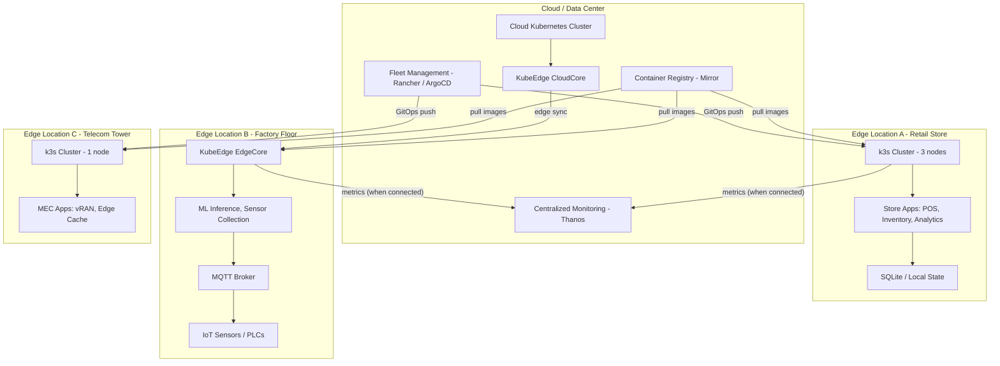

# Edge Kubernetes

## 1. Overview

Edge Kubernetes extends container orchestration to locations outside the data center -- retail stores, factory floors, telecommunications towers, autonomous vehicles, oil rigs, and IoT gateways. These environments share a common set of constraints that traditional Kubernetes cannot satisfy: limited compute resources (< 4 GB RAM, ARM processors), unreliable network connectivity (intermittent WAN, offline operation), hostile physical environments (temperature extremes, power instability), and massive fleet scale (thousands to hundreds of thousands of edge nodes managed from a central control plane).

The two dominant approaches to edge Kubernetes are **k3s** (a lightweight, single-binary Kubernetes distribution that runs on devices with as little as 512 MB RAM) and **KubeEdge** (a CNCF project that extends a centralized Kubernetes control plane to edge nodes with offline-capable edge agents). These approaches serve different use cases: k3s provides a full Kubernetes cluster at the edge (for locations with sufficient resources and some autonomy), while KubeEdge extends a cloud-hosted Kubernetes cluster to edge devices (for IoT scenarios where edge devices are too constrained for a full control plane).

The fleet management challenge is the defining operational problem. Managing 5 edge clusters is feasible manually. Managing 5,000 edge locations -- each with its own k3s cluster or KubeEdge node, each needing consistent configuration, security patches, and application updates -- requires fleet management tools like Rancher Fleet, Azure IoT Edge, or ArgoCD with ApplicationSets. This case study covers the architecture, trade-offs, and real-world use cases for edge Kubernetes across retail, manufacturing, and telecommunications.

## 2. Requirements

### Functional Requirements
- Run containerized workloads on edge devices with limited resources (1-4 CPU cores, 1-4 GB RAM, ARM or x86).
- Continue operating during network disconnections from the cloud/data center (offline operation).
- Centrally manage application deployments, updates, and configuration across thousands of edge locations.
- Support device interaction protocols (MQTT, Modbus, OPC-UA) for IoT sensor data collection.
- Synchronize state between edge and cloud when connectivity is restored.

### Non-Functional Requirements
- **Resource footprint**: Kubernetes control plane in < 512 MB RAM (k3s); edge agent in < 128 MB RAM (KubeEdge).
- **Scale**: 100-100,000 edge locations managed from a central fleet management system.
- **Offline duration**: Workloads continue running for up to 72 hours without cloud connectivity.
- **Update propagation**: Application updates reach 95% of edge locations within 24 hours (accounting for intermittent connectivity).
- **Boot time**: Edge node boots and starts workloads in < 2 minutes (important for kiosk, retail, and power-cycle scenarios).
- **Architecture support**: ARM64 and ARMv7 in addition to x86_64.

## 3. High-Level Architecture



## 4. Core Design Decisions

### k3s for Resource-Constrained Full Clusters

k3s is a CNCF-certified Kubernetes distribution packaged as a single binary (< 100 MB). It achieves its lightweight footprint by:

- **Replacing etcd with SQLite**: The default data store is SQLite (single-node) or embedded etcd (multi-node HA). SQLite eliminates the 3-node etcd requirement, enabling single-node clusters.
- **Removing cloud provider integrations**: Cloud-specific code (AWS, GCP, Azure load balancer controllers) is stripped out, reducing binary size and attack surface.
- **Bundling essential components**: containerd, CoreDNS, Flannel (CNI), Traefik (Ingress), and local-path-provisioner are included out of the box, eliminating add-on installation.
- **ARM support**: Native ARM64 and ARMv7 binaries, enabling deployment on Raspberry Pi, NVIDIA Jetson, and ARM-based industrial computers.

**Resource requirements:**
- Server (control plane + worker): 512 MB RAM minimum, 1 GB recommended
- Agent (worker only): 256 MB RAM minimum, 512 MB recommended
- Disk: 200 MB for k3s binary + images

**k3s is ideal for:**
- Retail stores with a dedicated edge server (4-8 GB RAM, 4 cores)
- Telecom MEC (Multi-access Edge Computing) nodes with dedicated hardware
- Industrial edge gateways with ARM processors
- Development and testing environments on small hardware

See [cluster topology](../02-cluster-design/01-cluster-topology.md) for cluster sizing patterns.

### KubeEdge for IoT Device Management

KubeEdge extends a cloud Kubernetes cluster to the edge through a split architecture:

- **CloudCore**: Runs in the cloud Kubernetes cluster. Manages edge nodes as Kubernetes nodes (they appear in `kubectl get nodes`). Synchronizes desired state (pod specs, config) to edge nodes.
- **EdgeCore**: Runs on each edge device. Receives pod specs from CloudCore, manages containers locally via containerd, and maintains a local cache of desired state for offline operation.
- **Device Twin**: A virtual representation of physical IoT devices (sensors, actuators). EdgeCore maintains device twin state locally and synchronizes with CloudCore when connected.

**KubeEdge advantages over k3s for IoT:**
- **Offline operation**: EdgeCore caches the desired state and continues running pods even when disconnected from CloudCore for extended periods (hours to days). When connectivity restores, it reconciles state.
- **Device management**: Device Twin and MQTT integration provide native support for IoT protocols. EdgeCore can read sensor data via MQTT/Modbus and expose it as Kubernetes resources.
- **Lower edge footprint**: EdgeCore uses ~70-128 MB RAM, compared to 512 MB+ for a k3s server. This enables deployment on more constrained devices.
- **Centralized management**: Edge nodes are managed as regular Kubernetes nodes from the cloud cluster. Operators use standard `kubectl` commands.

**KubeEdge is ideal for:**
- Large-scale IoT deployments (thousands of edge devices)
- Devices with < 512 MB RAM (too small for k3s server)
- Scenarios requiring device protocol integration (MQTT, Modbus, OPC-UA)
- Environments with unreliable connectivity (cellular, satellite)

### Fleet Management for Scale

Managing edge locations at scale (100-100,000 sites) requires fleet management tools:

**Rancher Fleet:**
- GitOps-based deployment to thousands of clusters
- Cluster groups (e.g., "all-retail-stores", "us-west-factories") for targeted deployments
- Bundle-based deployment model: define a set of Kubernetes manifests and target them to a cluster group
- Supports k3s clusters natively (Rancher created k3s)

**ArgoCD with ApplicationSets:**
- ApplicationSets generate ArgoCD Applications dynamically based on cluster inventory
- A single ApplicationSet can deploy the same application to 5,000 clusters
- Pull-based model: edge clusters pull their desired state from a Git repository
- Supports cluster-specific overrides via Kustomize or Helm values per cluster

**Azure IoT Edge / AWS Greengrass:**
- Cloud-native edge management for their respective ecosystems
- Deep integration with cloud services (IoT Hub, Lambda, etc.)
- Vendor-locked but lower operational overhead for single-cloud environments

```yaml
# Rancher Fleet GitRepo targeting all retail store clusters
apiVersion: fleet.cattle.io/v1alpha1
kind: GitRepo
metadata:
  name: retail-pos-app
  namespace: fleet-default
spec:
  repo: https://github.com/company/retail-pos-k8s
  branch: main
  paths:
    - ./manifests/pos-application
  targets:
    - clusterGroup: retail-stores
      clusterSelector:
        matchLabels:
          location-type: retail
          region: us-west
```

## 5. Deep Dives

### 5.1 Offline Operation Patterns

Edge nodes must continue operating during network disconnections. The offline operation strategy depends on the use case:

**Pattern 1: Full local autonomy (k3s)**
- The k3s cluster is a complete Kubernetes cluster with local storage (SQLite or embedded etcd).
- All application state is local. Pods restart, scale, and self-heal without cloud connectivity.
- Application data (e.g., retail transactions) is queued locally and synced to the cloud when connectivity returns.
- Duration: Indefinite (limited only by local storage capacity).

**Pattern 2: Cached desired state (KubeEdge)**
- EdgeCore caches the last-known desired state from CloudCore.
- During offline periods, EdgeCore ensures running pods match the cached state.
- New deployments and updates cannot reach the edge until connectivity restores.
- Duration: Days (limited by edge device stability, not by KubeEdge).

**Pattern 3: Store-and-forward data pipeline**
```
Edge sensors → MQTT Broker (local) → Edge app (processes/aggregates)
  → Local queue (SQLite/Redis) → [OFFLINE BUFFER]
  → When connected: sync to cloud (Kafka/HTTP)
```

This pattern is used in manufacturing (quality inspection ML inference at the edge, results uploaded in batch), retail (transactions processed locally, synced to cloud POS system), and environmental monitoring (sensor data aggregated locally, synced periodically).

### 5.2 Edge-Cloud Synchronization

When connectivity restores, edge and cloud must reconcile:

**Application state sync:**
- GitOps-based: Edge cluster pulls latest manifests from Git. Any configuration drift is automatically corrected by ArgoCD or Fleet.
- KubeEdge: CloudCore pushes any pending pod updates to EdgeCore. EdgeCore applies them and reports status.

**Data sync:**
- **Conflict resolution**: If both edge and cloud modified the same data during the disconnect, a resolution strategy is needed:
  - Last-write-wins: Simple but can lose data.
  - Merge: Application-specific logic combines edge and cloud changes.
  - Event sourcing: Both edge and cloud append events; a reconciler replays events in order.
- **Bandwidth optimization**: Only sync deltas, not full datasets. Use compression for large datasets.
- **Priority ordering**: Critical data (transactions, safety events) syncs first; telemetry data syncs at lower priority.

### 5.3 Constrained Resource Management

Edge devices with < 4 GB RAM require aggressive resource management:

**Container image optimization:**
- Base images: Alpine (5 MB) or distroless (< 20 MB) instead of Ubuntu (72 MB) or Debian (124 MB).
- Multi-arch images: Build for ARM64, ARMv7, and x86_64 using `docker buildx` with `--platform` flag.
- Image pre-pulling: Pre-load critical images onto edge devices during provisioning, avoiding runtime download.

**Resource limits (essential, not optional):**
```yaml
# Edge deployment with tight resource constraints
apiVersion: apps/v1
kind: Deployment
metadata:
  name: sensor-collector
spec:
  replicas: 1
  template:
    spec:
      containers:
        - name: collector
          image: registry.company.com/sensor-collector:v1.2-arm64
          resources:
            requests:
              cpu: 50m
              memory: 64Mi
            limits:
              cpu: 200m
              memory: 128Mi
      nodeSelector:
        kubernetes.io/arch: arm64
```

**k3s resource footprint optimization:**
- Disable unnecessary components: `--disable traefik,servicelb,metrics-server` if not needed.
- Use `--kubelet-arg="max-pods=30"` to reduce kubelet memory usage on constrained nodes.
- Use `--kube-proxy-arg="proxy-mode=iptables"` (lighter than IPVS for small clusters).

### 5.4 Industry Use Cases

**Retail (5,000+ stores):**
- Each store runs a k3s cluster (1-3 nodes) on dedicated edge hardware.
- Applications: Point-of-sale, inventory management, customer analytics, digital signage.
- Offline requirement: POS must process transactions offline for up to 24 hours (ISP outage).
- Fleet management: Rancher Fleet deploys application updates to all stores overnight.
- Example: Chick-fil-A runs Kubernetes in every restaurant for edge computing.

**Manufacturing (factory floor):**
- KubeEdge nodes on industrial gateways (ARM-based, 2 GB RAM).
- Applications: ML inference for quality inspection (image classification on camera streams), sensor data aggregation, predictive maintenance.
- Device integration: MQTT for sensor data, OPC-UA for PLC communication.
- Offline requirement: ML inference must continue during network outages (safety-critical).
- Fleet management: Azure IoT Edge or custom fleet tooling.

**Telecommunications (MEC):**
- k3s clusters at cell tower base stations or central offices.
- Applications: Multi-access Edge Computing (MEC) for low-latency 5G services, content caching, vRAN (virtual Radio Access Network).
- Constraints: Space-limited installations, power-efficient hardware, carrier-grade reliability (99.999%).
- Scale: Thousands of cell sites, each with 1-3 edge servers.
- Fleet management: ArgoCD with ApplicationSets targeting cluster labels per region/carrier.

### 5.5 Back-of-Envelope Estimation

**Retail fleet (5,000 stores):**
- Hardware per store: 1 edge server (8 GB RAM, 4 cores, 256 GB SSD) = ~$500
- Total hardware: 5,000 x $500 = $2.5M (one-time)
- k3s overhead per store: ~512 MB RAM, 0.5 CPU
- Application capacity per store: 7.5 GB RAM, 3.5 CPU available for workloads
- Fleet management (Rancher): 1 management cluster (3 nodes) = ~$2K/month cloud cost
- Operating cost per store: ~$10/month (power, network, amortized hardware)
- Total annual operating cost: 5,000 x $10 x 12 + $24K management = ~$624K/year

**IoT fleet (50,000 devices):**
- Hardware per device: Industrial gateway (2 GB RAM, 2 cores, ARM) = ~$200
- Total hardware: 50,000 x $200 = $10M
- KubeEdge EdgeCore overhead: ~128 MB RAM, 0.1 CPU
- Cloud-side overhead: CloudCore + cloud Kubernetes cluster = ~$5K/month
- Connectivity: Cellular per device = ~$5/month
- Total annual operating cost: $5K x 12 + 50,000 x $5 x 12 = $3.06M/year

**Telecom MEC (2,000 cell sites):**
- Hardware per site: Edge server (32 GB RAM, 16 cores) = ~$5,000
- k3s overhead: ~512 MB RAM, 0.5 CPU
- Application capacity: 31.5 GB RAM, 15.5 CPU (substantial capacity for MEC workloads)
- Fleet management: ArgoCD + central monitoring = ~$10K/month
- Total annual infrastructure cost: 2,000 x $5,000 + $10K x 12 = $10.12M (year 1)

## 6. Data Model

### k3s Cluster Configuration
```yaml
# k3s server installation (systemd service)
# /etc/rancher/k3s/config.yaml
write-kubeconfig-mode: "0644"
tls-san:
  - edge-server-01.store.company.com
  - 10.0.0.1
disable:
  - traefik        # Use custom ingress if needed
  - servicelb      # No cloud LB at edge
cluster-cidr: "10.42.0.0/16"
service-cidr: "10.43.0.0/16"
kubelet-arg:
  - "max-pods=50"
  - "eviction-hard=memory.available<100Mi"
  - "image-gc-high-threshold=85"
  - "image-gc-low-threshold=70"
data-dir: /var/lib/rancher/k3s
```

### KubeEdge EdgeCore Configuration
```yaml
# /etc/kubeedge/config/edgecore.yaml
apiVersion: edgecore.config.kubeedge.io/v1alpha2
kind: EdgeCore
metadata:
  name: factory-gateway-01
modules:
  edgeHub:
    heartbeat: 15
    httpServer: https://cloudcore.company.com:10002
    websocket:
      url: wss://cloudcore.company.com:10000/e632aba927ea4ac2b575ec1603d56f10/factory-gateway-01/events
    controller:
      placement: true
  edged:
    clusterDNS: "169.254.96.16"
    podSandboxImage: "kubeedge/pause:3.6"
    cgroupDriver: cgroupfs
    remoteRuntimeEndpoint: unix:///run/containerd/containerd.sock
  deviceTwin:
    enable: true
  eventBus:
    mqttMode: 2    # Internal MQTT broker
    mqttInternalServer: tcp://127.0.0.1:1884
```

### Fleet Bundle (Rancher Fleet)
```yaml
apiVersion: fleet.cattle.io/v1alpha1
kind: Bundle
metadata:
  name: retail-core-apps
  namespace: fleet-default
spec:
  resources:
    - content: |
        apiVersion: apps/v1
        kind: Deployment
        metadata:
          name: pos-service
          namespace: retail
        spec:
          replicas: 1
          selector:
            matchLabels:
              app: pos-service
          template:
            spec:
              containers:
                - name: pos
                  image: registry.company.com/pos-service:v3.1-arm64
                  resources:
                    requests:
                      cpu: 100m
                      memory: 256Mi
                    limits:
                      cpu: 500m
                      memory: 512Mi
                  env:
                    - name: OFFLINE_MODE_ENABLED
                      value: "true"
                    - name: LOCAL_QUEUE_PATH
                      value: /data/transaction-queue
                  volumeMounts:
                    - name: local-data
                      mountPath: /data
              volumes:
                - name: local-data
                  hostPath:
                    path: /opt/retail/data
  targets:
    - clusterGroup: retail-stores-us
    - clusterGroup: retail-stores-eu
```

## 7. Scaling Considerations

### Fleet Scaling

**100 edge locations**: Manual management is possible but tedious. GitOps (ArgoCD/Fleet) is recommended but not strictly necessary.

**1,000 edge locations**: Fleet management is mandatory. Rancher Fleet or ArgoCD with ApplicationSets handles deployment. Centralized monitoring (Thanos/Mimir) aggregates metrics. Alerting must be fleet-aware (alert on "10% of stores have POS failures" not "store-4523 POS failed").

**10,000+ edge locations**: Fleet management tools themselves become bottlenecks. ArgoCD ApplicationSets with 10,000+ Applications require careful tuning (batch reconciliation, rate limiting). Consider hierarchical management: regional management clusters that each manage 1,000-2,000 edge clusters, with a global management layer above.

**100,000+ edge locations (IoT)**: KubeEdge is designed for this scale. CloudCore manages edge nodes as Kubernetes nodes, and Kubernetes has been tested to 15,000+ nodes per cluster. Multiple CloudCore instances can manage different device groups. At this scale, edge state sync, update rollout velocity, and monitoring data volume are the primary challenges.

### Network Scaling

Edge-to-cloud connectivity varies dramatically:
- **Retail store**: 100 Mbps business internet (usually reliable)
- **Factory floor**: 1 Gbps private network (reliable within factory; WAN may be limited)
- **Telecom tower**: 1-10 Gbps fiber backhaul (carrier-grade reliability)
- **Remote IoT**: 1-10 Mbps cellular (intermittent, metered)
- **Satellite**: 50-150 Mbps (high latency: 600ms+ RTT, expensive)

Fleet management tools must operate within these constraints:
- Small configuration payloads (Kubernetes manifests are small, typically < 100 KB per deployment)
- Container image pulls are the bandwidth bottleneck (100 MB+ per image). Mitigations: local registry mirrors, delta-based image updates, pre-loaded images during provisioning.
- Monitoring data uploads: Compress and batch metrics. Edge-side aggregation reduces data volume by 10-100x compared to sending raw metrics.

### Security at the Edge

Edge devices operate in physically insecure environments (retail stores, cell towers, factory floors):
- **Device attestation**: Verify edge device identity before joining the fleet (TPM-based attestation, certificate rotation).
- **Encrypted storage**: All local data encrypted at rest (dm-crypt / LUKS).
- **Network security**: Mutual TLS between edge and cloud. Zero-trust networking: edge devices cannot reach cloud APIs directly; they communicate through CloudCore (KubeEdge) or a VPN/WireGuard tunnel (k3s).
- **Image verification**: Container images signed with cosign/Sigstore and verified at pull time via Kyverno or OPA/Gatekeeper policy.
- **Physical tamper detection**: Hardware-based tamper detection triggers secure wipe of encryption keys.

## 8. Failure Modes & Mitigations

| Failure | Impact | Mitigation |
|---------|--------|------------|
| Cloud connectivity lost | Edge cannot receive updates or report metrics | k3s: Full local autonomy, workloads continue. KubeEdge: EdgeCore runs from cached state. Data queued locally. |
| Edge node hardware failure | Workloads at that location stop | Multi-node k3s clusters (3 nodes) provide HA within a location. For single-node: physical replacement with pre-configured hardware (USB boot image). |
| Container image pull failure (no internet) | New pods cannot start | Pre-pull images during provisioning. Use local registry mirror (Harbor) at locations with sufficient resources. |
| Disk failure on edge node | Local state lost | SQLite WAL journaling + periodic backup to cloud. For critical data: replicate across multiple edge nodes. |
| Fleet management system outage | Cannot deploy updates to edge locations | Edge locations continue running last-known-good state. Updates queue until management recovers. |
| Security breach at edge location | Attacker gains access to edge device | Device certificates with short TTL (24h). Network segmentation: edge devices can only reach specific cloud endpoints. Remote wipe capability. |
| Power failure at edge location | Abrupt shutdown, potential data corruption | Use journaling filesystems (ext4/xfs). Configure UPS where feasible. k3s handles unclean shutdown gracefully (SQLite WAL recovery). |

### Cascade Failure Scenario

Consider a global fleet update that introduces a bug:

1. **Trigger**: A new version of the POS application is deployed to 5,000 retail stores via Rancher Fleet.
2. **Detection failure**: The canary group (50 stores) receives the update first, but the bug only manifests under high transaction volume (lunch rush), which the canary stores do not experience during the initial rollout window.
3. **Wide deployment**: Fleet deploys to all 5,000 stores. During the next lunch rush, POS applications crash across 4,000+ stores.
4. **Edge autonomy saves the day**: Each store's k3s cluster detects the CrashLoopBackOff and continues serving the previous version (still cached locally). The crashloop does not affect other applications on the cluster (inventory, analytics).
5. **Rollback**: Fleet team reverts the Git commit, triggering a fleet-wide rollback. Stores pull the previous version within 2 hours (staggered to avoid network congestion).
6. **Prevention**: Implement canary groups that match production traffic patterns. Extend canary observation to 24 hours (covering all traffic patterns) before fleet-wide rollout.

## 9. Key Takeaways

- k3s and KubeEdge serve different use cases: k3s for locations with sufficient resources for a full cluster (512 MB+ RAM); KubeEdge for highly constrained devices (< 512 MB RAM) that are managed from a centralized cloud Kubernetes cluster.
- Offline operation is the defining requirement for edge Kubernetes. Any edge architecture that fails when connectivity drops is not edge-ready.
- Fleet management tools (Rancher Fleet, ArgoCD ApplicationSets) are mandatory at scale. Managing 100+ edge locations manually is infeasible.
- Container image size is the primary optimization target for edge. Alpine-based images (5-20 MB) vs. Ubuntu-based (72-200 MB) make a significant difference on constrained devices and metered networks.
- Edge security requires a zero-trust model. Physical access to edge devices must not compromise the fleet. Device attestation, encrypted storage, and short-lived certificates are essential.
- Edge-cloud synchronization must be resilient to intermittent connectivity. Store-and-forward patterns, conflict resolution strategies, and bandwidth-optimized sync protocols are required.

## 10. Related Concepts

- [Cluster Topology (edge cluster patterns, regional distribution)](../02-cluster-design/01-cluster-topology.md)
- [Cloud vs. Bare Metal (edge hardware considerations)](../02-cluster-design/04-cloud-vs-bare-metal.md)
- [GitOps and Flux/ArgoCD (fleet-wide GitOps deployment)](../08-deployment-design/01-gitops-and-flux-argocd.md)
- [Service Networking (edge-cloud connectivity, DNS)](../04-networking-design/01-service-networking.md)
- [Supply Chain Security (image signing for edge)](../07-security-design/03-supply-chain-security.md)
- [Monitoring and Metrics (edge-cloud metric aggregation)](../09-observability-design/01-monitoring-and-metrics.md)
- [Node Pool Strategy (ARM nodes, constrained resources)](../02-cluster-design/02-node-pool-strategy.md)

## 11. Comparison with Related Systems

| Aspect | k3s | KubeEdge | MicroK8s | AWS Greengrass |
|--------|-----|----------|----------|---------------|
| Min RAM | 512 MB (server) | 128 MB (EdgeCore) | 540 MB | 128 MB |
| Binary size | < 100 MB | ~70 MB (EdgeCore) | ~200 MB (snap) | ~50 MB |
| Control plane | Local (self-contained) | Cloud (centralized) | Local (snap-based) | Cloud (AWS) |
| Offline operation | Full autonomy | Cached desired state | Full autonomy | Limited (Lambda cache) |
| ARM support | ARM64, ARMv7 | ARM64, ARMv7 | ARM64 | ARM64, ARMv7 |
| IoT protocols | Via add-ons | Native (MQTT, Device Twin) | Via add-ons | Native (MQTT, Greengrass) |
| Fleet management | Rancher Fleet, ArgoCD | kubectl (nodes appear in cloud cluster) | MicroCloud | AWS IoT Core |
| CNCF certified | Yes | CNCF Incubating | Yes | No (proprietary) |
| Best for | Resource-constrained full clusters | IoT device management at scale | Developer workstations, small edge | AWS-centric IoT deployments |

### Architectural Lessons

1. **Edge Kubernetes is not small-cluster Kubernetes.** The constraints are fundamentally different: offline operation, physical security threats, constrained resources, fleet management at scale, and unreliable networks. Standard Kubernetes patterns (depend on cloud APIs, pull images at runtime, assume reliable networking) do not apply.

2. **Offline-first is a design principle, not an edge case.** If the edge architecture breaks when connectivity drops, it will break regularly (ISP outages, cellular dead zones, satellite delays). Design for offline operation first, then add cloud sync as an enhancement.

3. **Fleet management is the operational bottleneck.** The technology of running Kubernetes on a single edge device is solved (k3s works). The challenge is managing 5,000 edge devices consistently: deploying updates, monitoring health, detecting drift, rotating certificates, and handling failures -- all at fleet scale.

4. **Container image optimization is not optional.** A 500 MB container image on a 10 Mbps cellular link takes 6.5 minutes to download. On a metered connection, it also costs money. Alpine-based images, multi-stage builds, and pre-cached images are essential for edge deployments.

5. **Canary rollouts at the edge must account for traffic pattern variation.** Unlike cloud deployments where canary clusters see representative traffic, edge locations may have dramatically different usage patterns (retail: lunch rush vs. morning, factory: shift changes, telecom: commute hours). Canary observation periods must cover a full traffic cycle (24 hours minimum).

## 12. Source Traceability

| Section | Source |
|---------|--------|
| k3s architecture and resource requirements | k3s.io documentation; Rancher/SUSE: "Why K3s Is the Future of Kubernetes at the Edge" |
| KubeEdge architecture and Device Twin | KubeEdge documentation (kubeedge.io); CNCF project page |
| Rancher Fleet for fleet management | Rancher Fleet documentation (fleet.rancher.io) |
| ARM support and binary sizes | k3s GitHub releases; Rancher/ARM whitepaper: "Accelerating Edge Computing with Arm and Rancher k3s" |
| Retail use case (Chick-fil-A) | Chick-fil-A engineering blog: "Enterprise Restaurant Compute" (KubeCon talk) |
| Telecom MEC patterns | CNCF Telecom User Group documentation; 5G MEC reference architectures |
| Edge security patterns | NIST Edge Computing Security Framework; Kubernetes security best practices |
