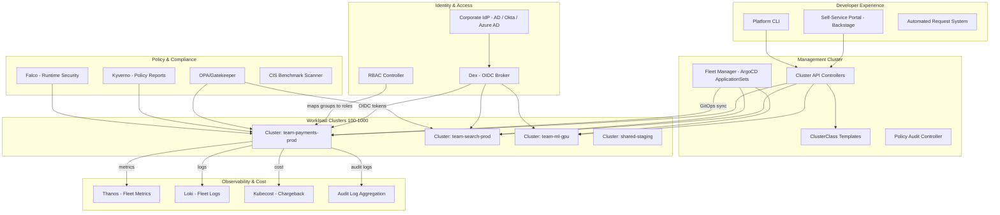

# Enterprise Kubernetes at Scale

## 1. Overview

Enterprise Kubernetes platforms are the productionization of Kubernetes at organizational scale -- hundreds of clusters, thousands of developers, regulated industries, and the requirement that every aspect of the platform is automated, auditable, and self-service. This case study examines how five enterprises -- Goldman Sachs, Capital One, Mercedes-Benz (900 clusters), Intuit (400+ clusters), and Bloomberg -- built Kubernetes platforms that serve as their organization's standard compute layer, with SSO integration, automated compliance, chargeback per team, and self-service cluster provisioning.

The common thread across all five organizations is that Kubernetes was not the goal -- it was the means. The goal was to enable software engineering teams to ship faster while maintaining the security, compliance, and operational standards required by their industries (financial services: SOC2, PCI-DSS; automotive: ISO 27001; all: internal audit requirements). Each organization independently arrived at a similar architecture: a platform team builds and operates the Kubernetes platform as an internal product, with self-service cluster provisioning (Cluster API or equivalent), SSO/OIDC integration for identity management, policy engines for compliance enforcement, fleet management for consistency at scale, and chargeback models for cost accountability.

This document synthesizes the architectural patterns from these five enterprises into a reference design for enterprise Kubernetes platforms. It covers the complete lifecycle: from cluster request through provisioning, configuration, compliance, monitoring, cost allocation, and decommissioning. For detailed implementation of individual components, see [Enterprise Kubernetes Platform](../10-platform-design/05-enterprise-kubernetes-platform.md).

## 2. Requirements

### Functional Requirements
- Teams can request and receive a production-ready Kubernetes cluster in < 30 minutes through self-service.
- All cluster access is authenticated via corporate SSO (Active Directory, Okta, Azure AD) -- no shared credentials.
- Every cluster enforces organizational security policies (no privileged containers, approved registries only, required labels).
- Cost is allocated to teams/business units based on actual resource consumption.
- Clusters can be upgraded, patched, and decommissioned through automated fleet operations.

### Non-Functional Requirements
- **Scale**: 100-1,000 clusters, 1,000-10,000 developers, across multiple regions/data centers.
- **Compliance**: SOC2, PCI-DSS, HIPAA (as applicable) -- continuous, not point-in-time.
- **Provisioning time**: New cluster from request to workload-ready in < 30 minutes.
- **Upgrade cadence**: Kubernetes version upgrades within 4-6 weeks of upstream release.
- **RBAC granularity**: Per-team, per-namespace access control mapped to corporate directory groups.
- **Audit**: All API server actions logged and queryable for 90+ days.
- **Cost accuracy**: Cost allocation error < 5% per team per month.

## 3. High-Level Architecture



## 4. Core Design Decisions

### Cluster API for Declarative Provisioning

All five enterprises use declarative cluster provisioning (Cluster API, Rancher, or equivalent) rather than imperative scripts. Cluster API (CAPI) runs on a management cluster and provisions workload clusters as Kubernetes resources:

- **ClusterClass**: A reusable template that defines the control plane configuration, worker node configuration, CNI, and add-on stack. Mercedes-Benz uses ClusterClass to ensure all 900 clusters have identical security and networking configurations.
- **Infrastructure providers**: CAPI supports AWS (EKS/EC2), Azure (AKS), GCP (GKE), vSphere (on-premises), and bare metal. Goldman Sachs and Bloomberg, with significant on-premises infrastructure, use vSphere and bare-metal providers.
- **Lifecycle management**: CAPI handles cluster upgrades (rolling control plane and worker node updates), scaling (add/remove node pools), and decommissioning (delete the Cluster object, and CAPI cleans up all infrastructure).

```yaml
apiVersion: cluster.x-k8s.io/v1beta1
kind: Cluster
metadata:
  name: team-payments-prod
  namespace: clusters
  labels:
    team: payments
    environment: production
    compliance: pci-dss
    cost-center: cc-finance-1234
spec:
  clusterNetwork:
    pods:
      cidrBlocks: ["10.244.0.0/16"]
    services:
      cidrBlocks: ["10.96.0.0/12"]
  topology:
    class: enterprise-production   # References ClusterClass
    version: v1.30.2
    controlPlane:
      replicas: 3
    workers:
      machineDeployments:
        - class: general-purpose
          name: general-pool
          replicas: 5
          metadata:
            labels:
              node-pool: general
        - class: high-memory
          name: memory-pool
          replicas: 3
          metadata:
            labels:
              node-pool: memory
    variables:
      - name: region
        value: us-east-1
      - name: ssoEnabled
        value: true
      - name: policyEngine
        value: gatekeeper
```

See [enterprise Kubernetes platform](../10-platform-design/05-enterprise-kubernetes-platform.md) for detailed CAPI architecture.

### SSO/OIDC Integration

Enterprise Kubernetes must integrate with existing identity providers. The pattern used across all five organizations:

1. **Dex or Keycloak** acts as an OIDC broker between the corporate identity provider (Active Directory, Okta, Azure AD) and Kubernetes API servers.
2. **kube-apiserver** is configured with OIDC flags (`--oidc-issuer-url`, `--oidc-client-id`, `--oidc-username-claim`, `--oidc-groups-claim`) to validate OIDC tokens.
3. **RBAC bindings** map OIDC group claims to Kubernetes ClusterRoles or Roles. When a user authenticates, the groups from their OIDC token determine their Kubernetes permissions.
4. **Automatic deprovisioning**: When a user is disabled in the corporate directory, their OIDC tokens expire (typically 1-hour TTL), and they lose Kubernetes access without manual intervention.

```yaml
# Goldman Sachs pattern: RBAC binding mapped to AD group
apiVersion: rbac.authorization.k8s.io/v1
kind: RoleBinding
metadata:
  name: payments-team-edit
  namespace: payments
subjects:
  - kind: Group
    name: "ad-group:engineering-payments"   # AD group from OIDC claim
    apiGroup: rbac.authorization.k8s.io
roleRef:
  kind: ClusterRole
  name: edit
  apiGroup: rbac.authorization.k8s.io
```

**Capital One's approach**: Capital One uses AWS IAM integration (IRSA -- IAM Roles for Service Accounts) combined with their corporate SSO. Developers authenticate via SSO, which maps to IAM roles, which map to Kubernetes RBAC. This provides a single identity chain from corporate directory to Kubernetes to AWS services.

**Goldman Sachs's approach**: Goldman Sachs uses OPA (Open Policy Agent) to enforce RBAC policies across multiple shared Kubernetes clusters, ensuring consistent access control even as the number of clusters grows. Their KubeCon 2019 talk detailed how they run OPA at scale in production for policy enforcement.

### Fleet-Wide Policy Enforcement

Compliance at enterprise scale requires automated policy enforcement across the entire fleet:

**Admission-time enforcement (preventive):**
- OPA/Gatekeeper or Kyverno runs on every workload cluster
- Policies are defined centrally and distributed via GitOps (ArgoCD syncs policy objects to all clusters)
- Example policies enforced by all five enterprises:
  - No privileged containers
  - Images must come from approved registries only
  - All pods must have resource requests and limits
  - Required labels: team, cost-center, environment
  - No `hostPath` volumes
  - Pod Security Standards: `restricted` profile for all namespaces

**Runtime enforcement (detective):**
- Falco detects runtime policy violations (unexpected process execution, file access, network connections)
- CIS Kubernetes Benchmark scans validate cluster configuration against security standards
- Kubescape provides continuous compliance scoring

**Policy lifecycle:**
- Policies are versioned in Git (policy-as-code)
- New policies are deployed in `audit` mode first (violations are logged but not blocked)
- After 30 days of audit data, policies move to `enforce` mode (violations are blocked at admission)
- Policy exceptions are tracked and require explicit approval with an expiration date

See [policy engines](../07-security-design/02-policy-engines.md) and [runtime security](../07-security-design/05-runtime-security.md).

### Chargeback and Cost Allocation

Enterprise Kubernetes platforms must allocate costs to the business units that consume resources:

**Cost allocation model:**
1. **Direct costs**: CPU, memory, GPU, and storage consumed by a team's pods, attributed via namespace labels or pod annotations.
2. **Shared costs**: Cluster overhead (control plane, monitoring, logging, ingress, kube-system) distributed proportionally across teams based on their resource consumption.
3. **Idle costs**: Requested but unused resources (over-provisioning). Attributed to the requesting team to incentivize right-sizing.

**Implementation:**
- Kubecost or OpenCost agents on every cluster collect resource consumption and map to cloud pricing.
- Labels (team, cost-center) are required on all namespaces and pods (enforced via admission policy).
- Monthly reports are generated per business unit, showing:
  - Total spend
  - Breakdown by CPU, memory, storage, GPU
  - Idle cost (waste)
  - Month-over-month trend
  - Top optimization recommendations

**Mercedes-Benz chargeback**: With 900 clusters across 3 continents, Mercedes-Benz allocates costs to individual teams based on namespace-level resource consumption. The chargeback system integrates with their internal financial systems, creating actual budget transfers between departments.

**Intuit's approach**: Intuit runs Argo CD across nearly 400 clusters to manage applications for thousands of developers. Cost visibility is integrated into their developer portal, where each team can see their cloud spend alongside deployment metrics.

See [cost observability](../09-observability-design/03-cost-observability.md).

## 5. Deep Dives

### 5.1 Mercedes-Benz: 900 Clusters Across 3 Continents

Mercedes-Benz Tech Innovation has been running Kubernetes since version 0.9, accumulating 7+ years of experience. Their fleet of 900 clusters runs in Mercedes-Benz data centers across Europe, North America, and Asia.

**Key architectural decisions:**
- **On-premises infrastructure**: Unlike cloud-native startups, Mercedes-Benz runs Kubernetes on bare metal in their own data centers. This was driven by data sovereignty requirements (automotive telemetry data, customer data) and existing infrastructure investments.
- **Cluster API migration**: Mercedes-Benz originally built custom fleet management tooling (no existing solution existed when they started with K8s 0.9). They later migrated to Cluster API, which allows them to manage clusters using Kubernetes itself.
- **Decentralized team ownership**: Each of the hundreds of development teams manages their own clusters. The platform team provides ClusterClass templates that encode organizational standards; teams provision clusters from these templates.
- **Kubernetes version cadence**: With 900 clusters, upgrading Kubernetes is a fleet-level operation. Mercedes-Benz uses a wave-based approach: canary clusters (week 1), non-production clusters (weeks 2-3), production clusters (weeks 4-8).

**Scale numbers:**
- 900 Kubernetes clusters
- 3 continents (Europe, North America, Asia)
- Hundreds of development teams
- On-premises data centers
- Kubernetes in production since version 0.9

### 5.2 Goldman Sachs: Policy-Driven Multi-Tenant Clusters

Goldman Sachs runs shared multi-tenant Kubernetes clusters in a financial services environment with strict regulatory requirements (SEC, FINRA, SOC2).

**Key architectural decisions:**
- **OPA at scale**: Goldman Sachs uses OPA (Open Policy Agent) for policy enforcement across multiple shared Kubernetes clusters. Their 2019 KubeCon talk detailed the architecture: a centralized policy management system distributes policies to OPA instances running on every cluster, with audit logs flowing back to a centralized compliance dashboard.
- **Shared clusters with hard isolation**: Financial regulations require strong isolation between trading teams and compliance teams. Goldman Sachs uses a combination of namespace isolation, network policies, and OPA policies to achieve multi-tenancy on shared clusters.
- **GitLab-based SDLC**: Goldman Sachs adopted GitLab as their SDLC tool in 2017, providing a "git experience" for all engineers. This naturally led to GitOps-style deployments on Kubernetes.
- **KubeVirt for VM management**: Goldman Sachs has explored using Kubernetes for virtual machine management (KubeVirt), unifying container and VM management on a single platform. This is driven by their large existing VM estate that cannot be immediately containerized.

### 5.3 Capital One: Cloud-Native Financial Services

Capital One was the first major US bank to go all-in on public cloud (AWS), making their Kubernetes journey cloud-native from the start.

**Key architectural decisions:**
- **EKS with AWS integration**: Capital One runs on EKS with deep AWS integration: IRSA for pod-level IAM, AWS PrivateLink for network isolation, KMS for secrets encryption, and CloudTrail for audit logging.
- **Argo-based platform**: Capital One uses the Argo ecosystem (Argo CD for deployment, Argo Workflows for CI/CD, Argo Rollouts for progressive delivery) as the foundation of their Kubernetes platform.
- **Streaming and ML**: Capital One adopted Kubernetes to build a provisioning platform for applications deployed on AWS that use streaming, big data decisioning, and machine learning. Kubernetes provides the orchestration layer for complex data pipelines.
- **PCI-DSS compliance**: As a financial institution processing credit card transactions, Capital One must comply with PCI-DSS. Their Kubernetes platform encodes PCI requirements into admission policies: network segmentation between PCI and non-PCI workloads, encrypted storage for cardholder data, and restricted access to PCI namespaces.

### 5.4 Intuit: Argo at Massive Scale

Intuit created the Argo project (Argo CD, Argo Workflows, Argo Rollouts, Argo Events) and runs it at massive scale internally.

**Key architectural decisions:**
- **Argo CD at scale**: Intuit manages thousands of applications and deployments across nearly 400 clusters using Argo CD. This is one of the largest Argo CD deployments in the world.
- **ApplicationSets for fleet management**: Intuit uses Argo CD ApplicationSets to generate Applications dynamically across their cluster fleet, enabling fleet-wide deployments from a single Git source of truth.
- **Developer experience integration**: Argo CD is integrated into Intuit's developer portal, providing self-service deployment capabilities for thousands of engineers.
- **Progressive delivery**: Argo Rollouts provides canary and blue-green deployment strategies across the fleet, enabling safe progressive rollouts for critical financial applications (TurboTax, QuickBooks, Mint).

**Scale numbers:**
- Nearly 400 Kubernetes clusters
- Thousands of applications
- Thousands of developers
- Argo CD as the deployment foundation
- 10 million+ end users (TurboTax, QuickBooks)

### 5.5 Bloomberg: Financial Data Platform

Bloomberg runs Kubernetes for their financial data platform, serving real-time market data to hundreds of thousands of terminal users worldwide.

**Key architectural decisions:**
- **Latency-sensitive workloads**: Bloomberg's real-time market data feeds require microsecond-level latency for certain components. Kubernetes workloads are tuned with CPU pinning (static CPU manager policy), NUMA-aware scheduling, and host networking for latency-critical pods.
- **Hybrid deployment**: Bloomberg runs both on-premises (data centers) and cloud, with Kubernetes providing a consistent deployment model across both environments.
- **Custom scheduler extensions**: Bloomberg has contributed to Kubernetes scheduler development and uses custom scheduling plugins for workload-specific placement decisions (e.g., colocating related data processing pods for reduced network latency).
- **Internal platform maturity**: Bloomberg's platform team has invested heavily in internal tooling for developer experience, providing self-service cluster provisioning, automated compliance, and integrated monitoring.

### 5.6 Back-of-Envelope Estimation

**Enterprise platform (500 clusters, 5,000 developers):**

**Management cluster:**
- 3 control plane nodes (m5.2xlarge): 3 x $0.384/hr = ~$1.15/hr
- CAPI controllers, ArgoCD, monitoring: 5 worker nodes (m5.xlarge) = 5 x $0.192/hr = $0.96/hr
- Total management: ~$2.11/hr = ~$18.5K/year

**Workload clusters:**
- 500 clusters x average 10 worker nodes = 5,000 worker nodes
- Average node: m5.4xlarge ($0.768/hr)
- Total compute: 5,000 x $0.768 = $3,840/hr = $33.6M/year
- With spot (30%): $27.5M/year
- With right-sizing (20% reduction): $22M/year

**Shared services overhead per cluster:**
- Monitoring (Prometheus): 2 pods, 4 CPU, 8 Gi = ~$0.30/hr
- Logging (FluentBit): 1 DaemonSet, ~0.1 CPU per node = ~$0.10/hr
- Policy engine (Gatekeeper): 2 pods, 0.5 CPU, 1 Gi = ~$0.08/hr
- Ingress controller: 2 pods, 1 CPU, 2 Gi = ~$0.15/hr
- Total per cluster: ~$0.63/hr = ~$5.5K/year
- Total across 500 clusters: ~$2.75M/year (8% of compute spend)

**Platform team sizing:**
- 500 clusters / 50 clusters per platform engineer = 10 platform engineers (minimum)
- With full automation (CAPI, GitOps, self-service): 15-20 engineers (including on-call, tooling development, support)
- Cost: 17 engineers x $250K/year (fully loaded) = $4.25M/year

**Total platform cost:**
- Compute: $22M/year (after optimization)
- Shared services: $2.75M/year
- Management cluster: $18.5K/year
- Platform team: $4.25M/year
- **Total: ~$29M/year for 500 clusters serving 5,000 developers**
- **Per developer: ~$5,800/year** (~$483/month)

## 6. Data Model

### Cluster Request (Self-Service Portal)
```yaml
apiVersion: platform.enterprise.com/v1
kind: ClusterRequest
metadata:
  name: team-risk-analytics-prod
spec:
  team: risk-analytics
  costCenter: cc-risk-7890
  environment: production
  compliance:
    - soc2
    - pci-dss
  clusterClass: enterprise-production
  region: us-east-1
  nodeRequirements:
    general:
      count: 5
      instanceType: m5.4xlarge
    gpu:
      count: 2
      instanceType: p4d.24xlarge
  accessGroups:
    admins: "ad-group:risk-analytics-leads"
    developers: "ad-group:risk-analytics-devs"
    readonly: "ad-group:risk-analytics-support"
  addons:
    monitoring: true
    logging: true
    servicesMesh: false
    gpuOperator: true
```

### Fleet Compliance Report
```yaml
apiVersion: compliance.enterprise.com/v1
kind: FleetComplianceReport
metadata:
  name: weekly-2025-12-15
spec:
  reportDate: "2025-12-15"
  scope: all-clusters
status:
  totalClusters: 500
  compliantClusters: 487
  nonCompliantClusters: 13
  policyViolations:
    - policy: require-resource-limits
      violatingClusters: 3
      totalViolations: 47
      severity: medium
    - policy: approved-registries-only
      violatingClusters: 8
      totalViolations: 23
      severity: high
    - policy: no-privileged-containers
      violatingClusters: 5
      totalViolations: 12
      severity: critical
  complianceScore: 97.4%
  trend: improving  # Was 96.8% last week
  remediationDeadline: "2025-12-22"
```

### Chargeback Report
```yaml
apiVersion: finops.enterprise.com/v1
kind: ChargebackReport
metadata:
  name: team-payments-2025-12
spec:
  team: payments
  costCenter: cc-finance-1234
  period: "2025-12"
status:
  totalCost: "$47,230"
  breakdown:
    compute:
      cpu: "$28,340"
      memory: "$8,460"
      gpu: "$0"
    storage: "$3,210"
    networking: "$2,110"
    sharedServices: "$5,110"  # Proportional share of monitoring, logging, control plane
  idleCost: "$8,340"  # Requested but unused resources
  utilizationRate: 64%
  optimizationRecommendations:
    - action: "Right-size search-ranking deployment: reduce CPU request from 4 to 1.5"
      estimatedSavings: "$2,100/month"
    - action: "Convert batch-processor to spot instances"
      estimatedSavings: "$1,800/month"
  monthOverMonth: "+3.2%"
  budgetRemaining: "$52,770"  # Of $100K monthly budget
```

## 7. Scaling Considerations

### Cluster Fleet Scaling

**50 clusters**: A single management cluster with CAPI handles provisioning. ArgoCD with ApplicationSets manages fleet-wide deployments. A platform team of 5-8 engineers is sufficient.

**200 clusters**: Management cluster requires dedicated monitoring (Thanos) for fleet-wide metrics aggregation. ArgoCD may need sharding (multiple ArgoCD instances, each managing a subset of clusters). Policy violations at this scale generate significant noise -- invest in policy exception management and automated remediation.

**500+ clusters**: Fleet operations become the primary challenge:
- Kubernetes version upgrades take weeks to roll across the fleet (wave-based approach: canary -> non-prod -> prod)
- Configuration drift detection and remediation is continuous (ArgoCD reconciliation)
- Centralized monitoring generates enormous metric volume (500 clusters x ~50,000 time series per cluster = 25M active series -- requires Thanos or Mimir)
- Cost allocation processing takes hours to compute across all clusters

**1,000+ clusters (Mercedes-Benz territory)**: Consider hierarchical management -- regional management clusters that each manage 200-300 workload clusters, with a global management layer for fleet-wide operations and reporting.

### Identity Scaling

With 5,000+ developers authenticating to Kubernetes via OIDC:
- Dex/Keycloak must handle 5,000+ concurrent OIDC token issuances and validations
- Token caching at the API server level reduces backend load (tokens are validated once, then cached for the token's TTL)
- Group membership changes (new hire, team transfer, departure) must propagate to Kubernetes RBAC within the token TTL (typically 1 hour)
- Emergency access revocation: For immediate revocation (e.g., security incident), API server webhooks can check a revocation list

### Compliance Scaling

At 500+ clusters, compliance monitoring generates enormous data:
- 500 clusters x 20 policies x 100 resources = 1M policy evaluations per reconciliation cycle
- Gatekeeper audit runs every 60 seconds per cluster = 500 audit runs per minute fleet-wide
- Compliance reports aggregate data from all clusters into a single dashboard

## 8. Failure Modes & Mitigations

| Failure | Impact | Mitigation |
|---------|--------|------------|
| Management cluster failure | Cannot provision new clusters; existing clusters unaffected | Management cluster runs with HA (3 control plane nodes, etcd with 3 replicas); existing workload clusters operate independently |
| OIDC provider (Dex/Keycloak) outage | New kubectl sessions fail to authenticate | Existing sessions use cached tokens (1-hour TTL); emergency ServiceAccounts for incident response; Dex runs with HA |
| Fleet-wide policy misconfiguration | Legitimate deployments blocked across all clusters | Policies deploy in audit mode first (30 days); emergency policy override mechanism for incident response; rollback via Git revert |
| CAPI controller bug | Cluster provisioning or upgrade fails | CAPI uses reconciliation (retries); existing clusters unaffected; rollback CAPI version if needed |
| Cross-cluster ArgoCD failure | Fleet-wide deployments stalled | ArgoCD runs with HA (3 replicas, Redis cluster); manual kubectl apply as fallback; existing applications continue running |
| Cost attribution error | Incorrect chargeback to teams | Reconciliation against cloud billing APIs; 30-day adjustment window; cost-center label enforcement prevents unattributed spend |
| Fleet-wide Kubernetes vulnerability | All clusters exposed | Fleet management enables rapid patching (wave-based rollout with automated validation); WAF rules for API server protection during patch window |

### Cascade Failure Scenario

Consider a fleet-wide Kubernetes upgrade that introduces a regression:

1. **Trigger**: Kubernetes 1.31 introduces a scheduler regression that causes pod scheduling delays under high load.
2. **Canary detection**: The canary cluster (5 clusters) is upgraded first. Under normal load, no issues detected.
3. **Non-production rollout**: 100 non-production clusters are upgraded. Some teams report slower pod scheduling, but non-production traffic is light -- the regression is not obvious.
4. **Production rollout begins**: 50 production clusters are upgraded. During peak traffic, scheduling latency increases from 2 seconds to 30+ seconds, causing cascading timeouts.
5. **Detection**: Fleet monitoring detects elevated `scheduler_scheduling_attempt_duration_seconds` across upgraded clusters.
6. **Mitigation**: Production upgrade is halted. Affected clusters are downgraded using CAPI (change `topology.version` back to 1.30 and CAPI rolls back control plane and nodes).
7. **Resolution**: The regression is reported upstream. CAPI's declarative model makes both upgrade and downgrade a single field change.

**Prevention**: Canary clusters should receive synthetic production-like load (load testing) during the observation period, not just organic traffic.

## 9. Key Takeaways

- Enterprise Kubernetes is a platform engineering problem, not an infrastructure problem. The technology (Kubernetes, CAPI, ArgoCD) is mature; the challenge is building an organizational operating model around it.
- Self-service cluster provisioning via Cluster API transforms cluster management from a ticket-based process (days) to a self-service workflow (minutes). ClusterClass templates encode organizational standards so that every cluster starts compliant.
- SSO/OIDC integration is non-negotiable. Shared credentials (kubeconfig with embedded tokens) are a security liability in regulated industries. OIDC-based authentication provides auditable, revocable, time-limited access.
- Policy enforcement must be continuous, not point-in-time. Admission-time policies (Gatekeeper/Kyverno) prevent violations; runtime scanning (Falco, CIS benchmarks) detects drift. Both are required for compliance.
- Chargeback per team drives cost optimization at scale. Without cost accountability, Kubernetes becomes a tragedy of the commons. Even showback (cost visibility without actual billing) drives 20-30% cost reduction.
- Fleet management is the defining challenge at 100+ clusters. Individual cluster management does not scale. ArgoCD ApplicationSets, Rancher Fleet, or equivalent fleet tools are mandatory.
- Mercedes-Benz's 900 clusters, Intuit's 400 clusters, and Goldman Sachs's multi-tenant shared clusters all converged on similar patterns: declarative provisioning, GitOps-based management, policy-as-code, and centralized observability.

## 10. Related Concepts

- [Enterprise Kubernetes Platform (detailed implementation of CAPI, OIDC, fleet management)](../10-platform-design/05-enterprise-kubernetes-platform.md)
- [Internal Developer Platform (Backstage, self-service, golden paths)](../10-platform-design/01-internal-developer-platform.md)
- [Multi-Tenancy (shared cluster isolation models)](../10-platform-design/02-multi-tenancy.md)
- [RBAC and Access Control (OIDC integration, group-based roles)](../07-security-design/01-rbac-and-access-control.md)
- [Policy Engines (OPA/Gatekeeper, Kyverno, compliance automation)](../07-security-design/02-policy-engines.md)
- [Runtime Security (Falco, CIS benchmarks)](../07-security-design/05-runtime-security.md)
- [Cost Observability (Kubecost, chargeback)](../09-observability-design/03-cost-observability.md)
- [GitOps and Flux/ArgoCD (fleet-wide GitOps)](../08-deployment-design/01-gitops-and-flux-argocd.md)
- [Cluster Topology (management cluster, workload clusters)](../02-cluster-design/01-cluster-topology.md)

## 11. Comparison with Related Systems

| Aspect | Goldman Sachs | Capital One | Mercedes-Benz | Intuit | Bloomberg |
|--------|-------------|------------|---------------|--------|-----------|
| Infrastructure | On-prem + cloud | AWS (all-in) | On-prem (3 continents) | Multi-cloud | Hybrid (on-prem + cloud) |
| Cluster count | Multi-tenant shared | EKS fleet | 900 | ~400 | Hybrid fleet |
| Provisioning | Custom + CAPI | EKS API + Terraform | Cluster API (migrated) | CAPI + custom | Custom tooling |
| Identity | AD + OPA | AWS IAM + SSO | Corporate SSO | SSO + OIDC | AD + custom |
| Policy engine | OPA/Gatekeeper | OPA + custom | Gatekeeper | Kyverno/OPA | OPA |
| Deployment | GitLab CI/CD | Argo ecosystem | GitOps | Argo CD (creator) | Custom CI/CD |
| Compliance focus | SEC, FINRA, SOC2 | PCI-DSS, SOC2 | ISO 27001, GDPR | SOC2 | SEC, FINRA |
| Key innovation | OPA at scale for policy | Cloud-native banking | Fleet management at 900 clusters | Argo ecosystem creation | Low-latency K8s tuning |
| Open-source contribution | OPA adoption advocacy | Argo ecosystem adoption | CAPI feedback | Argo CD, Argo Workflows | Scheduler improvements |

### Architectural Lessons

1. **Every enterprise converges on the same architecture.** Despite different industries, different scales, and different cloud strategies, all five organizations built: self-service provisioning, SSO integration, policy-as-code, fleet-wide GitOps, and cost allocation. This convergence is strong evidence that the architecture is correct.

2. **Cluster API is the foundation for fleet management.** Managing clusters declaratively (as Kubernetes objects) enables the same tooling (GitOps, policy engines, monitoring) to manage both applications and infrastructure. Mercedes-Benz's migration from custom tooling to CAPI validates this approach.

3. **Policy-as-code enables compliance at scale.** Goldman Sachs's OPA deployment and Capital One's PCI-DSS automation demonstrate that regulatory compliance on Kubernetes is achievable through admission-time policy enforcement, not manual audits.

4. **The Argo ecosystem is the enterprise GitOps standard.** Intuit created Argo CD, Capital One adopted it, and both Goldman Sachs and Bloomberg use OPA-compatible GitOps workflows. Argo CD's multi-cluster support (ApplicationSets) makes it the natural choice for enterprise fleet management.

5. **Cost accountability is a cultural change, not a technical feature.** Kubecost provides the data; chargeback provides the incentive; but the organizational change -- making teams accountable for their cloud spend -- requires executive sponsorship and cultural alignment. Mercedes-Benz's integration with internal financial systems demonstrates the full implementation.

6. **Platform team sizing follows a logarithmic curve.** The first 50 clusters require 5-8 platform engineers. The next 450 clusters require 7-12 more engineers (not 50 more). Automation, self-service, and GitOps make the marginal cost of each additional cluster approach zero.

## 12. Source Traceability

| Section | Source |
|---------|--------|
| Mercedes-Benz 900 clusters, CAPI migration | InfoWorld: "Why Mercedes-Benz runs on 900 Kubernetes clusters" (2022); CNCF Case Study: Mercedes-Benz; Kubernetes Podcast Episode 184 |
| Goldman Sachs OPA at scale | KubeCon NA 2019: "Kubernetes Policy Enforcement Using OPA at Goldman Sachs" by Miguel Uzcategui; Computer Weekly: "How Goldman Sachs migrated to cloud native software development" |
| Capital One EKS platform | Kubernetes.io Case Study: Capital One; Capital One Tech Blog: "Kubernetes at Enterprise Scale" |
| Intuit Argo ecosystem | Intuit Engineering Blog: "KubeCon EU 2025 Recap" (Medium); CNCF Argo Graduation Announcement (2022); Argo Blog: "Intuit @ GitOpsCon and KubeCon North America 2021" |
| Bloomberg Kubernetes | KubeCon talks on low-latency Kubernetes; Computer Weekly: Goldman Sachs KubeVirt discussion (Bloomberg referenced in enterprise Kubernetes panels) |
| Cluster API and ClusterClass | Cluster API documentation (cluster-api.sigs.k8s.io); [Enterprise Kubernetes Platform](../10-platform-design/05-enterprise-kubernetes-platform.md) |
| Chargeback models | Kubecost documentation; OpenCost project; FinOps Foundation Kubernetes best practices |
