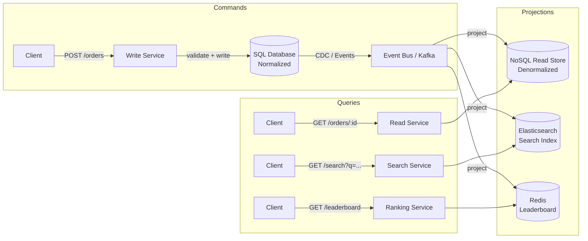
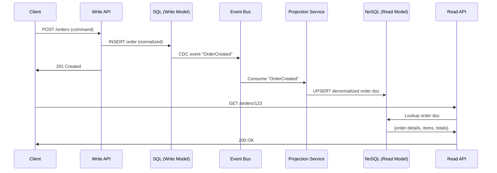

# CQRS (Command Query Responsibility Segregation)

## 1. Overview

CQRS (Command Query Responsibility Segregation) splits a system's data model into two distinct sides: a **command side** (write model) optimized for mutations, and a **query side** (read model) optimized for retrieval. Instead of forcing a single database schema to serve both complex writes with validation and fast reads with denormalized views, CQRS acknowledges that read and write workloads have fundamentally different requirements and gives each its own model.

This is not just "use a cache in front of your database." The write model might be a normalized SQL database enforcing referential integrity and ACID transactions, while the read model is a denormalized NoSQL store or materialized view that serves pre-joined, pre-aggregated data for instant retrieval. The two models are kept in sync via events or change data capture, accepting eventual consistency as the price for independent optimization.

The term was coined by Greg Young, building on Bertrand Meyer's Command-Query Separation (CQS) principle. CQS applies at the method level (a method either changes state or returns data, never both). CQRS elevates this to the architectural level, separating the entire data model and infrastructure for reads and writes.

In practice, CQRS is one of the most impactful patterns for read-heavy systems. Twitter's timeline, Facebook's news feed, Netflix's content catalog, and Amazon's product pages all employ some form of CQRS -- they pre-compute denormalized views optimized for their dominant query patterns rather than computing them from normalized data on every request.

## 2. Why It Matters

- **Read/write ratio asymmetry**: Most systems are heavily read-biased (100:1 or higher). CQRS lets you scale the read side independently without burdening the write side. Twitter's timeline reads outnumber tweet writes by 1000:1. Serving both from the same model is architecturally incoherent.
- **Independent optimization**: The write model can enforce strict normalization, foreign keys, and complex validation. The read model can store pre-computed, denormalized JSON documents for O(1) retrieval -- no joins, no aggregation at query time.
- **Eliminates contention**: Writes and reads hit different databases, eliminating lock contention between long-running analytical queries and high-frequency transactional writes.
- **Enables polyglot persistence**: Write to Postgres for ACID guarantees; read from Elasticsearch for full-text search; read from Redis for leaderboard rankings. Each read model is purpose-built for its query pattern.
- **Performance predictability**: Read latency is determined by the read model, not by the complexity of the underlying data model. A denormalized document lookup is consistently fast regardless of how normalized the write model is.
- **Separate scaling curves**: Write throughput often grows linearly with user growth, while read throughput can spike by orders of magnitude during viral events. CQRS lets you scale each independently.
- **Technology specialization**: Different query patterns demand different storage engines. Full-text search needs Elasticsearch. Leaderboards need Redis sorted sets. Timeline feeds need DynamoDB or Cassandra. CQRS lets you use the right tool for each read pattern without compromising the write model.

### When CQRS Is Not Worth It

CQRS adds significant complexity. It is NOT worth the investment when:
- The system is a simple CRUD application with low traffic and straightforward queries.
- The read/write ratio is close to 1:1 (both sides are equally loaded).
- The team is small and does not have capacity to maintain multiple data stores and projection pipelines.
- Strong consistency is required for all reads (CQRS provides eventual consistency by default).
- The domain model is still evolving rapidly (changing the write model requires updating all projections).

## 3. Core Concepts

- **Command**: A write operation that mutates state. Examples: `PlaceOrder`, `UpdateProfile`, `CancelReservation`. Commands are validated and either accepted or rejected.
- **Query**: A read operation that retrieves data without side effects. Examples: `GetOrderDetails`, `SearchProducts`, `GetUserTimeline`.
- **Write Model**: The normalized, consistent data store that handles commands. Typically a relational database with full ACID guarantees.
- **Read Model**: A denormalized, query-optimized data store. Can be NoSQL documents, materialized views, search indices, or in-memory caches.
- **Materialized View**: A pre-computed, denormalized data structure derived from the write model. Updated asynchronously when the write model changes.
- **Projection**: The process (or service) that listens for write-side changes and updates the read model. Synonymous with "event handler" when combined with event sourcing.
- **Eventual Consistency**: The read model may lag behind the write model by milliseconds to seconds. This is the fundamental trade-off of CQRS.

## 4. How It Works

### The Fundamental Insight

Consider a typical e-commerce product page. The write model for a product might be normalized across 5 tables (products, categories, prices, inventory, reviews) with foreign keys and constraints. Displaying the product page requires joining all 5 tables, aggregating review scores, and computing availability -- a query that touches hundreds of rows and takes 50-200ms under load.

With CQRS, you pre-compute a denormalized product document that contains everything the product page needs in a single JSON blob. The read latency drops from 200ms to 2ms. The write side continues to enforce all the relational constraints. Both sides are independently optimal.

The same principle applies to social media feeds (Twitter timeline), search results (Elasticsearch as a read model), and dashboards (pre-aggregated metrics). Any time the read query involves expensive computation (joins, aggregations, sorting across partitions), CQRS can help by moving that computation from query time to write time.

### Basic CQRS Flow

1. **Write path**: A command arrives at the write service. The service validates the command against business rules, writes to the write database (normalized SQL), and publishes an event (or the database emits a CDC event).
2. **Projection**: An event consumer reads the change event and updates the read model (denormalized NoSQL, materialized view, search index).
3. **Read path**: A query arrives at the read service. The service reads directly from the pre-computed read model. No joins, no aggregation -- just a key lookup or simple scan.

### Materialized View Construction

The read model is built by applying a series of transformations to the event stream:

```
# Pseudocode for a feed projection
def handle_event(event):
    if event.type == "PostCreated":
        for follower_id in get_followers(event.author_id):
            read_db.add_to_feed(follower_id, event.post)
    elif event.type == "PostDeleted":
        read_db.remove_from_feeds(event.post_id)
    elif event.type == "UserBlocked":
        read_db.remove_user_posts_from_feed(event.blocked_id, event.blocker_id)
```

### Consistency Handling

Since the read model is eventually consistent, there are cases where a user writes data and immediately queries for it but the projection has not caught up:

- **Read-your-own-writes**: After a write, the application can query the write database directly for that specific user's next read, then fall back to the read model for subsequent reads.
- **Version stamping**: The write response includes a version number. The client includes this version in the next query. The read service waits (or routes to the write DB) if its projection is behind that version.
- **Synchronous projection for critical paths**: For high-priority queries (e.g., "did my payment succeed?"), update the read model synchronously before returning the write response. This sacrifices write latency for read consistency.

## 5. Architecture / Flow

### CQRS with Event Sourcing



### Read/Write Separation Sequence



## 6. Types / Variants

### CQRS Without Event Sourcing

The simplest form: a single relational database with a read replica or materialized views. The write model is the primary database; the read model is a denormalized view refreshed periodically or via triggers. No event bus required. This is the lowest-effort entry point into CQRS and is often sufficient for systems that need read optimization without full event sourcing.

**Example**: A PostgreSQL primary handles all writes. A read replica with materialized views serves read-heavy dashboard queries. The materialized views are refreshed every 30 seconds. This provides 30-second eventual consistency with zero architectural complexity beyond what PostgreSQL already offers.

### CQRS With Event Sourcing

The write side stores events (not current state) in an event store. Projections replay these events to build read models. This is the most powerful combination -- you get the audit trail and time travel of event sourcing plus the query optimization of CQRS. See [Event Sourcing](./event-sourcing.md).

### CQRS With CDC

The write side is a traditional CRUD database. A CDC tool (Debezium, DynamoDB Streams) captures row-level changes and publishes them to an event bus. Projections consume these change events to build read models. Simpler than event sourcing but captures data changes, not business intent.

### When to Combine CQRS with Event Sourcing

| Scenario | CQRS Alone | CQRS + Event Sourcing |
|---|---|---|
| Read/write ratio is high (100:1+) | Sufficient | Overkill unless audit needed |
| Audit trail required | Add logging layer | Built-in |
| Multiple read model types needed | Works well | Works well |
| Need to replay/reprocess history | Not possible | Core capability |
| Team familiar with CRUD | Lower learning curve | Significant learning curve |
| Domain has complex state transitions | Workable | Ideal fit |

## 7. Use Cases

- **Social Media Feed**: The write model stores normalized posts, follows, and likes in SQL. The read model stores pre-computed, denormalized feed documents in a NoSQL store (DynamoDB, Cassandra). When a user requests their feed, it is a single key lookup -- no fan-out computation at read time.
- **E-Commerce Product Catalog**: Writes go to a normalized product database. Read models include: (1) Elasticsearch for full-text product search, (2) Redis sorted sets for "top sellers" leaderboards, (3) denormalized product detail documents for the product page.
- **Banking / Financial Reporting**: Transactional writes go to a strongly consistent SQL database. Read models include pre-computed account summaries, monthly statements, and regulatory reports -- updated asynchronously from the transaction event stream.
- **Real-Time Gaming Leaderboard**: Game events (scores, kills, achievements) write to the event store. A Redis sorted set projection maintains a real-time leaderboard. A SQL projection builds historical analytics. Different projections, same events.
- **Content Management System**: Editors write to a normalized CMS database (write model). Published content is projected to a CDN-friendly static site generator (read model). Drafts and published content use different data stores and access patterns.
- **Hotel Reservation System**: Writes go to a transactional database with strong consistency for inventory management (no double-booking). Read models serve: (1) search results (Elasticsearch with availability filters), (2) booking confirmations (denormalized document), (3) analytics (aggregated occupancy data).

## 8. Tradeoffs

| Advantage | Disadvantage |
|---|---|
| Independent scaling of read and write workloads | Increased system complexity (two models, sync mechanism) |
| Read models optimized per query pattern | Eventual consistency between write and read models |
| Eliminates read/write lock contention | Data duplication across multiple read stores |
| Enables polyglot persistence | Projection failures can cause stale read data |
| Natural fit for event-driven and event-sourced systems | Overkill for simple CRUD applications |
| Write model remains normalized and clean | Requires robust monitoring of projection lag |

## 9. Common Pitfalls

- **Applying CQRS to simple CRUD**: If your application is a basic content management system with low traffic and simple queries, CQRS adds unjustified complexity. CQRS earns its keep when read/write patterns are dramatically different.
- **Ignoring eventual consistency in the UI**: If a user updates their profile and immediately sees the old version, they will think the system is broken. Implement read-your-own-writes for critical user-facing mutations.
- **Projections that are too coupled**: If your projection logic contains business rules, changes to those rules require redeploying and reprocessing the projection. Keep projections as thin data transformations.
- **Not handling projection failures**: If a projection crashes mid-event, it can get stuck. Implement idempotent projections with checkpointing so they can resume from the last successfully processed event.
- **Forgetting to monitor projection lag**: The gap between the write model and read model must be monitored and alerted on. A growing lag indicates a projection that cannot keep up -- scale it or optimize it before users notice stale data.
- **Too many read models**: Each read model is another system to maintain, monitor, and keep in sync. Start with one or two read models and add more only when a clear query pattern demands it.
- **Circular dependencies between read and write models**: If the write model depends on the read model for validation (e.g., checking a count from a materialized view before writing), you create a circular dependency that complicates consistency. Validate against the write model only.
- **Not idempotent projections**: If a projection processes the same event twice (which happens during replays or consumer retries), it must produce the same result. Use `UPSERT` operations and idempotency keys in all projection handlers.
- **Schema drift between write and read models**: Over time, the write model schema evolves (new columns, changed constraints) while the read model projections are not updated. This causes silent data staleness. Treat projection code as first-class code with tests and CI/CD.
- **Underestimating operational complexity**: CQRS introduces multiple data stores, event buses, projection services, and monitoring requirements. A team that struggles with a single-database architecture will not benefit from CQRS -- they will be buried by it.

### Operational Checklist for CQRS Systems

When running CQRS in production, monitor and maintain:

- **Projection lag per read model**: The time gap between the latest write and the latest projected read. Alert threshold: depends on SLA (typically 1-10 seconds).
- **Projection error rate**: Failed event processing attempts. Any sustained error rate means the read model is diverging from the write model.
- **Dead letter queue depth**: Events that failed projection after all retries. These represent data that is in the write model but NOT in the read model.
- **Read model staleness checks**: Periodic consistency checks that compare a sample of write model records against the read model. Discrepancies indicate projection bugs.
- **Projection rebuild runbook**: Documented procedure for rebuilding a read model from scratch. Test this periodically -- it is your disaster recovery for read model corruption.
- **Schema compatibility verification**: Automated checks that new event schemas are backward compatible with existing projection code.
- **Write model vs. read model record count**: Periodically compare the total number of entities in the write model against each read model. Significant discrepancies indicate lost events or projection bugs.
- **Event processing throughput**: Track events processed per second by each projection. If throughput drops, the projection is falling behind and lag will increase.

## 10. Real-World Examples

- **Twitter (Home Timeline)**: The canonical CQRS example. Writes go to the tweet storage (write model). For normal users, a fan-out-on-write projection pre-computes timelines into per-user inbox caches (read model). For celebrities, fan-out-on-read computes the timeline at query time. This hybrid CQRS approach handles Twitter's extreme read/write asymmetry.
- **Facebook News Feed**: Similar hybrid. A "pre-computed flag" in the follow table determines whether a user's posts are fan-out-on-write (most users) or fan-out-on-read (mega-accounts). The read model is a pre-computed feed stored in a distributed cache.
- **Netflix**: Content metadata is written to a normalized catalog database (write model). Multiple read models serve different clients: the browse API reads from a denormalized cache, search reads from Elasticsearch, and the recommendation engine reads from a specialized graph store.
- **Amazon DynamoDB + Streams**: A common pattern on AWS. DynamoDB serves as the write model. DynamoDB Streams (CDC) feeds events to Lambda functions that update Elasticsearch indices, populate Redis caches, and build analytics rollups.
- **LinkedIn**: The feed is a CQRS system. Writes (posts, likes, comments) go to the primary data store. A fan-out system pre-computes feeds for each user and stores them in a read-optimized cache. The read API serves from the pre-computed feed without touching the write database.

### Quantitative Impact

| Metric | Single Model (CRUD) | CQRS |
|---|---|---|
| **Read latency (P99)** | 50-500ms (joins, aggregation) | 1-10ms (denormalized lookup) |
| **Write latency** | 5-20ms (single DB write) | 5-20ms + async projection update |
| **Read throughput** | Limited by write DB capacity | Independently scalable |
| **Data consistency** | Immediate | Eventual (ms to seconds lag) |
| **Operational complexity** | Low (one database) | High (multiple stores, projection pipelines) |

### Projection Lag Monitoring

The gap between the write model and read model is the "projection lag." This must be actively monitored:

- **Metric**: Track the timestamp of the latest event processed by each projection. Alert when the lag exceeds a threshold (e.g., 5 seconds).
- **Dashboard**: Display projection lag per read model on the operational dashboard.
- **Health check**: Projections should expose a health endpoint that reports their current lag. If a projection is unhealthy, the read API can return a warning header or fall back to the write model for that query.
- **Consumer group lag in Kafka**: If projections are Kafka consumers, the standard consumer group lag metric (`records-lag-max`) directly measures projection lag.

### Migration Strategy: From CRUD to CQRS

**Step 1: Identify the bottleneck**. Measure read vs. write latency and throughput. If reads are slow but writes are fine, CQRS can help. If both are slow, the problem may be elsewhere (missing indexes, poor schema design).

**Step 2: Add a read replica**. The simplest form of CQRS: use database read replicas to offload read traffic. No code changes needed. This buys time while you design the full solution.

**Step 3: Introduce a denormalized read store**. For the highest-traffic read patterns, create a purpose-built read model (Redis cache, Elasticsearch index). Populate it via CDC from the primary database.

**Step 4: Separate read and write APIs**. Route write commands to the write service and queries to the read service. The read service reads from the denormalized store.

**Step 5: Add event sourcing (optional)**. If you need audit trails, time travel, or the ability to add new read models from historical data, replace the write database with an event store.

### CQRS and Microservices

CQRS maps naturally to microservices:

- The **write service** owns the write model, validates commands, and publishes events.
- One or more **read services** own their respective read models and consume events to stay updated.
- Each read service can use a different technology stack optimized for its query pattern.
- Read services are independently deployable and scalable.

This decomposition means that adding a new query capability (e.g., full-text search) is an additive change: deploy a new read service that consumes existing events and builds a new read model. No changes to the write service or existing read services.

### Eventual Consistency Patterns for CQRS

| Pattern | How It Works | Tradeoff |
|---|---|---|
| **Read-your-own-writes** | After a write, query the write DB for that user's next read | Added complexity; only helps the writing user |
| **Causal consistency** | Include a version token in write responses; read service waits for that version | Requires coordination between read and write services |
| **Optimistic UI** | Client assumes the write succeeded and shows updated data immediately | UI may flash inconsistent state if the write fails |
| **Synchronous projection** | Update the critical read model synchronously before returning the write response | Sacrifices write latency for read consistency |
| **Polling with backoff** | Client polls for the updated data after writing | Poor UX for real-time applications |

## 11. Related Concepts

- [Event Sourcing](./event-sourcing.md) -- frequently combined with CQRS; events drive projection updates
- [Event-Driven Architecture](./event-driven-architecture.md) -- events are the transport mechanism for CQRS sync
- [Message Queues](./message-queues.md) -- Kafka/SQS as the event bus between write and read models
- [Database Replication](../storage/database-replication.md) -- CDC as a mechanism for CQRS projection updates
- [Caching](../caching/caching.md) -- read models are conceptually similar to cache layers

### CQRS in the Interview Context

When proposing CQRS in a system design interview:

1. **Identify the read/write asymmetry**: "This system has a 100:1 read-to-write ratio. The read queries involve joining 5 tables and aggregating data. CQRS lets us pre-compute these reads."
2. **Be explicit about the consistency trade-off**: "The read model will be eventually consistent with the write model, with a lag of approximately 100ms-1 second. For this use case (social media feed), that is acceptable."
3. **Describe the sync mechanism**: "We will use DynamoDB Streams (CDC) to publish write events to a Kafka topic. A projection service consumes these events and updates the Elasticsearch read model."
4. **Address the operational cost**: "This adds complexity: we now have two data stores, an event bus, and a projection service to monitor. The benefit is that read latency drops from 200ms to 2ms and we can scale read throughput independently."
5. **Know when NOT to propose it**: "For a simple admin dashboard with 100 users and low traffic, CQRS is overkill. A PostgreSQL read replica with materialized views is sufficient."

### Performance Tuning CQRS Projections

Projection services can become bottlenecks if not properly tuned:

- **Batch processing**: Instead of processing one event at a time, batch events (e.g., 100 at a time) and apply them in a single database transaction. This reduces per-event overhead.
- **Parallel projection by entity**: Different entity IDs can be projected in parallel since they do not conflict. Use partition-based parallelism (Kafka consumer groups with one partition per projection worker).
- **Incremental updates vs. full rebuild**: For hot entities that change frequently, incremental updates (apply the delta) are more efficient than full rebuilds (recompute the entire document).
- **Backfill strategy**: When adding a new read model, you need to backfill from historical events. Run the projection against the full event log at a higher throughput than normal (bulk mode), then switch to real-time mode once caught up.

## 12. Source Traceability

- source/youtube-video-reports/8.md (CQRS definition, command/query separation, event sourcing connection)
- source/youtube-video-reports/5.md (Facebook News Feed, fan-out as CQRS, hybrid approach)
- source/youtube-video-reports/2.md (Twitter hybrid timeline, pre-computed feeds)
- source/extracted/acing-system-design/ch07-distributed-transactions.md (event sourcing + projections)
- source/extracted/ddia/ch14-stream-processing.md (materialized views from event streams)
