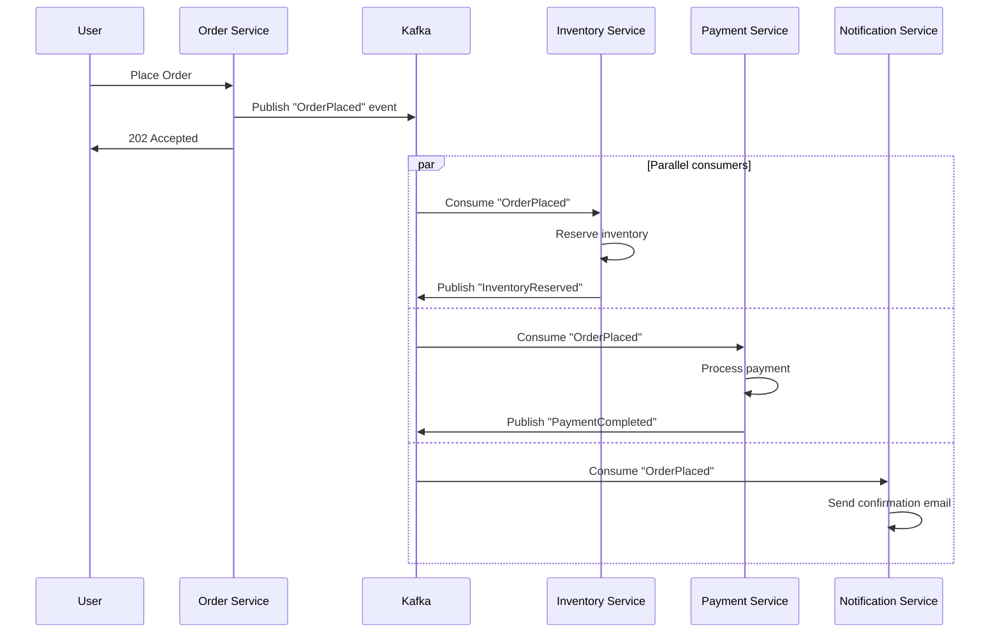
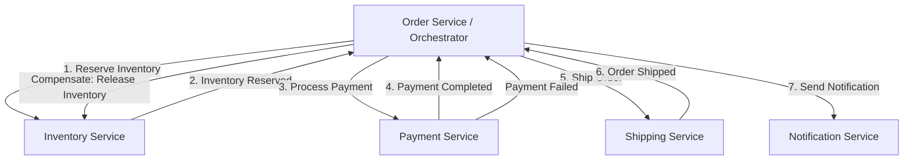

# Event-Driven Architecture

## 1. Overview

Event-Driven Architecture (EDA) is an architectural style where the flow of the program is determined by events -- state changes that are announced rather than requested. Instead of Service A calling Service B directly and waiting for a response, Service A publishes an event ("order was placed"), and any interested service reacts to it asynchronously. This fundamental shift from "request work to be done" to "announce what has happened" is what makes EDA the backbone of loosely coupled, highly scalable systems.

EDA is not a single pattern but an umbrella covering pub/sub messaging, choreography, orchestration, and stream processing. A senior architect reaches for EDA when synchronous request-response chains create tight coupling, latency accumulation, or cascading failures.

As Artur Ejsmont states in "Scalability for Startup Engineers": "Event Driven Architecture is an architectural style where most interactions between different components are realized by announcing events that have already happened instead of requesting work to be done." This is the defining distinction: events are facts about the past, not requests for future action.

EDA promotes non-blocking, asynchronous processing. A request does not need to be fully processed before the server returns a response. The server publishes an event and returns immediately. The actual processing happens asynchronously, which eliminates the coupling between the producer's response time and the consumer's processing time.

## 2. Why It Matters

- **Loose coupling**: Publishers do not know about subscribers. Services can be added, removed, or rewritten without coordinating deployments. A new analytics service can start consuming existing events without any change to the producing services.
- **Scalability**: Producers and consumers scale independently. A traffic spike in order creation does not require proportional scaling of the notification service. Each service is right-sized for its own workload.
- **Resilience**: If the email service is down, the "order placed" event waits in the queue. When the service recovers, it catches up. No orders are lost. The producing service never blocks or fails due to downstream outages.
- **Latency reduction**: The producer returns immediately after publishing the event. It does not wait for downstream processing that might take seconds or minutes. The user sees a fast response even though the full workflow takes time.
- **Cost efficiency**: Without EDA, handling traffic spikes requires either expensive auto-scaling (which may be too slow) or maintaining a large cluster of hosts. With EDA, the message broker absorbs the burst and downstream services process at their own pace.
- **Temporal decoupling**: The producer and consumer do not need to be available at the same time. A batch job that runs nightly can process events that were produced throughout the day.
- **Auditability**: Events form a natural audit trail. "What happened to this order?" is answered by replaying the events associated with that order ID.
- **Extensibility**: Adding new functionality often means adding a new subscriber to existing events, rather than modifying existing services. This follows the Open-Closed Principle at the architectural level.

## 3. Core Concepts

- **Event**: An immutable record of something that happened. Contains a type, timestamp, and payload.
- **Publisher (Producer)**: The service that emits events.
- **Subscriber (Consumer)**: The service that reacts to events.
- **Topic / Channel**: A named category that events are published to and consumed from.
- **Event Bus**: The infrastructure (Kafka, SNS/SQS, RabbitMQ) that routes events from publishers to subscribers.
- **Choreography**: Services react to events independently, with no central coordinator. Each service listens for events and emits new events.
- **Orchestration**: A central orchestrator (e.g., AWS Step Functions) directs the flow by sending commands to services and reacting to their responses.
- **Saga**: A sequence of local transactions coordinated via events. Each step either succeeds or triggers compensating actions. (Canonical detail in [Distributed Transactions](../resilience/distributed-transactions.md).)

## 4. How It Works

### Pub/Sub Model

The publish-subscribe model is the foundation of EDA:

1. **Publisher** sends a message to a **topic**.
2. The **message broker** routes the message to all **subscribers** registered for that topic.
3. Each subscriber processes the message independently and at its own pace.

This differs from point-to-point queuing (one message, one consumer) in that a single event can be consumed by multiple independent subscriber groups.

### Choreography vs. Orchestration

**Choreography** (decentralized):
- Each service knows which events to listen for and which events to emit.
- The "workflow" emerges from the collective behavior of independent services.
- No single service has a complete view of the transaction.
- Lower latency (parallel execution), but harder to debug and monitor.

**Orchestration** (centralized):
- A dedicated orchestrator service (state machine) sends commands to each service in sequence.
- The orchestrator tracks the state of the transaction and handles failures explicitly.
- Higher latency (sequential execution), but the workflow is visible in one place.
- The orchestrator is a single point of failure and must be highly available.

### SNS/SQS Fan-Out Pattern

A common AWS pattern combines SNS (pub/sub) with SQS (queue) for reliable fan-out:

1. Producer publishes to an SNS topic.
2. Multiple SQS queues subscribe to the SNS topic.
3. Each SQS queue feeds a different consumer service.
4. Each consumer processes at its own rate with independent retry and DLQ behavior.

This is the recommended pattern for fan-out on AWS because each SQS queue provides independent retry, DLQ, and scaling behavior. If the email consumer is slow, it does not affect the inventory consumer.

### Event Design Principles

Well-designed events follow these principles:

- **Past tense naming**: Events describe what happened, not what should happen. Use `OrderPlaced`, not `PlaceOrder`. Commands are instructions; events are facts.
- **Self-contained**: An event should carry enough data for consumers to process it without calling back to the producer. Include the relevant entity state, not just an ID that requires a lookup.
- **Immutable**: Events are facts that have already occurred. They are never updated or deleted.
- **Versioned**: Events should carry a schema version so consumers can handle schema evolution gracefully.
- **Idempotent consumption**: Events may be delivered more than once. Consumers must handle duplicates safely (see [Message Queues](./message-queues.md) for idempotency patterns).

### Event Ordering Guarantees

Ordering is one of the most misunderstood aspects of EDA:

- **Total ordering** (all events globally ordered) is extremely expensive and rarely needed.
- **Per-entity ordering** (all events for a specific order are ordered) is achievable with partition keys in Kafka or message group IDs in SQS FIFO.
- **Causal ordering** (if event A caused event B, A is processed before B) requires careful design of partition keys and consumer group topology.
- **No ordering** (events may arrive in any order) is the default for most pub/sub systems and standard SQS. Consumers must be designed to handle out-of-order events.

## 5. Architecture / Flow

### Choreography-Based Order Processing

### Orchestration-Based Order Processing

## 6. Types / Variants

| Dimension | Choreography | Orchestration |
|---|---|---|
| **Control flow** | Decentralized -- each service reacts | Centralized -- orchestrator directs |
| **Coupling** | Loose -- services only know event schemas | Tighter -- orchestrator knows all services |
| **Latency** | Lower (parallel execution) | Higher (sequential steps through orchestrator) |
| **Visibility** | Hard to trace a transaction across services | Easy -- orchestrator has full state machine |
| **Failure handling** | Each service handles its own compensations | Orchestrator triggers compensating actions |
| **Complexity** | Grows with number of services and event types | Concentrated in orchestrator |
| **SPOF** | None (except the message broker) | Orchestrator must be highly available |
| **Best for** | Simple flows with few services | Complex workflows with conditional branching |

### Batch and Stream Processing

EDA naturally extends to data processing at scale. Two architectural patterns address the trade-off between latency and accuracy:

**Lambda Architecture**:
- A **batch layer** (Spark, MapReduce) processes the complete dataset for accuracy.
- A **speed layer** (Flink, Kafka Streams) processes real-time events for low latency.
- A **serving layer** merges results from both layers.
- Tradeoff: maintaining two codepaths (batch and stream) creates operational complexity and potential inconsistency.

**Kappa Architecture**:
- Eliminates the batch layer entirely.
- Everything is a stream. Historical reprocessing is done by replaying the event log from the beginning.
- Simpler to maintain, but requires a durable, replayable event log (Kafka with long retention).

**Stream Processing Frameworks**:

| Framework | Model | Latency | State Management | Best For |
|---|---|---|---|---|
| **Apache Flink** | True streaming (event-at-a-time) | Milliseconds | Built-in, exactly-once | Real-time aggregation, CEP |
| **Kafka Streams** | Stream processing library | Milliseconds | Built-in (RocksDB) | Kafka-native transformations |
| **Apache Spark Streaming** | Micro-batch | Seconds | External (checkpoints) | Batch + streaming hybrid |

**Ad Click Aggregation Example** (Lambda architecture in practice):
- Raw click events flow into Kafka.
- **Flink** consumes in real-time and produces 1-minute windowed aggregation counts for dashboards.
- **Spark** runs hourly batch jobs against the same Kafka topic for reconciliation and 100% data integrity.
- A **logarithmic counting** optimization reduces writes to the search index: the index is only updated when engagement crosses a power of two (2^n), reducing write volume by orders of magnitude.

**Windowed Aggregation** (core stream processing concept):
- Stream processors group events into time-based windows (tumbling, sliding, session).
- **Tumbling window**: Fixed, non-overlapping windows (e.g., 1-minute buckets). Every event belongs to exactly one window.
- **Sliding window**: Overlapping windows (e.g., 5-minute window that slides every 1 minute). An event can belong to multiple windows.
- **Session window**: Variable-length windows based on event gaps. A window closes when no events arrive for a configurable "gap duration." Used for user session analytics.

**Exactly-Once Semantics in Stream Processing**:
- Flink achieves exactly-once through distributed snapshots (Chandy-Lamport algorithm). Periodic checkpoints capture the state of all operators and the position in the input stream. On failure, the system restores from the last checkpoint.
- Kafka Streams achieves exactly-once through Kafka transactions: a consumer reads, processes, and produces output atomically within a single Kafka transaction.

## 7. Use Cases

- **Netflix**: Event-driven microservices architecture. Every user action (play, pause, rate) is an event published to Kafka. Downstream services consume these events for personalization, A/B testing, and real-time analytics.
- **Uber**: Trip lifecycle events (request, match, pickup, dropoff) flow through Kafka. Multiple independent consumers handle pricing, ETA estimation, fraud detection, and analytics -- all decoupled from the core trip service.
- **AWS Step Functions**: Amazon's managed orchestration service. Used for e-commerce fulfillment workflows: Place Order -> Reserve Inventory -> Charge Payment -> Ship -> Notify. If payment fails, the state machine triggers explicit compensating steps.
- **Facebook Live Comments**: When a comment is posted on a live video, the comment service publishes to a Redis pub/sub channel partitioned by `hash(videoID) % N`. Real-time servers subscribe only to partitions relevant to their connected clients, preventing the "firehose" problem where every server receives every comment.
- **Ad Click Aggregator**: Hybrid stream/batch (Lambda architecture). Flink handles real-time 1-minute windowed aggregation; Spark handles periodic reconciliation. Logarithmic counting reduces writes by orders of magnitude.

## 8. Tradeoffs

| Advantage | Disadvantage |
|---|---|
| Loose coupling between services | Harder to trace and debug distributed transactions |
| Independent scaling of producers and consumers | Eventual consistency -- consumers may lag |
| Resilient to downstream failures | Message ordering is complex across partitions |
| High throughput via async processing | Requires idempotent consumers (duplicates happen) |
| Natural fit for event sourcing and CQRS | Choreography becomes unwieldy with many services |
| Enables replay and reprocessing of events | Orchestration introduces a single point of failure |
| Absorbs traffic spikes without over-provisioning | Increased infrastructure complexity (brokers, topics, DLQs) |

## 9. Common Pitfalls

- **Choreography spaghetti**: With more than 4-5 services, choreographed event flows become nearly impossible to reason about. If you find yourself drawing complex diagrams with cycles, switch to orchestration.
- **Missing compensating actions**: In a saga, if step 3 fails, steps 1 and 2 must be undone. Forgetting to implement compensating transactions leads to permanently inconsistent state. See [Distributed Transactions](../resilience/distributed-transactions.md).
- **Event schema evolution**: Changing the schema of an event (adding/removing fields) can break consumers. Use schema registries (Confluent Schema Registry, AWS Glue) and backward-compatible changes (Avro, Protobuf).
- **Silent consumer lag**: If a consumer falls behind, events pile up. Without monitoring consumer lag, you discover the problem only when users report stale data.
- **Over-engineering simple flows**: Not every service interaction needs async events. A synchronous REST call between two tightly related services is simpler and provides immediate feedback. Use EDA when you actually need decoupling, fan-out, or resilience.
- **Lambda architecture dual maintenance**: Maintaining both batch and stream codepaths is expensive. Before adopting Lambda architecture, consider whether Kappa (stream-only with replay) meets your requirements.
- **Event payload too large**: Stuffing entire database rows into events creates bandwidth pressure and tight schema coupling. Include only the data consumers need, or use a "thin event" with just the entity ID and let consumers query for details.
- **No dead letter queue**: When a consumer cannot process an event after multiple retries, it must go somewhere. Without a DLQ, the consumer is stuck retrying forever and stops processing new events.
- **Circular event dependencies**: Service A publishes EventX, Service B consumes it and publishes EventY, Service A consumes EventY and publishes EventX again. This creates an infinite loop. Design events as unidirectional -- events should not trigger their own producers.
- **Event ordering assumptions across topics**: Events on different Kafka topics or different partitions have no guaranteed ordering relative to each other. If your consumer depends on receiving "UserCreated" before "OrderPlaced," ensure both events go to the same partition (same key) or handle out-of-order gracefully.
- **Not versioning events**: When the event schema changes (new fields, removed fields), old consumers break. Use a schema registry (Confluent Schema Registry) and enforce backward compatibility. Always add fields as optional; never remove or rename existing fields.
- **Treating EDA as a silver bullet**: Not every interaction benefits from async events. A user clicking "submit order" expects an immediate response confirming the order was received. The confirmation should be synchronous; the downstream processing (inventory, payment, notification) should be async.

### Testing Event-Driven Systems

Testing EDA requires approaches different from testing synchronous systems:

- **Contract testing**: Verify that producers and consumers agree on event schemas. Use tools like Pact or schema registry compatibility checks in CI.
- **Consumer-driven contracts**: Consumers define the minimum event fields they require. Producers verify that their events satisfy all consumer contracts.
- **Integration testing with embedded brokers**: Use embedded Kafka (Testcontainers) in integration tests to verify end-to-end event flows without external infrastructure.
- **Chaos testing**: Simulate broker failures, consumer crashes, and network partitions to verify that the system recovers correctly (no lost events, no stuck consumers, correct DLQ behavior).
- **Replay testing**: After fixing a consumer bug, replay events from the DLQ or from a specific offset and verify that the consumer processes them correctly.

## 10. Real-World Examples

- **Netflix**: Uses a choreographed event-driven architecture across hundreds of microservices. Studio content ingestion, encoding pipelines, and recommendation model training are all event-driven workflows triggered by Kafka events.
- **Uber**: The trip lifecycle is a saga: ride request -> driver match -> pickup -> trip -> dropoff -> payment. Each step publishes events consumed by independent services (pricing, routing, safety, billing). Uber uses an internal orchestration framework for critical payment flows.
- **Amazon**: Order processing is orchestrated via Step Functions. The workflow handles inventory reservation, payment processing, fraud checks, and shipping with explicit retry and compensation logic.
- **Twitter**: Tweet ingestion publishes to Kafka. Fan-out services, search indexing, analytics, and notification services all consume from the same topic independently.
- **Airbnb**: Booking events trigger a choreographed saga: host notification, guest confirmation, payment capture, calendar update, and review scheduling -- each handled by a separate service consuming from a shared event bus.

### Quantitative Impact of EDA

| Metric | Synchronous Architecture | Event-Driven Architecture |
|---|---|---|
| **Response time (P99)** | Sum of all downstream latencies (500ms+) | Producer latency only (10-50ms) |
| **Throughput ceiling** | Limited by slowest downstream service | Limited by message broker capacity |
| **Blast radius of downstream failure** | Entire request chain fails | Only the affected consumer degrades |
| **Scaling granularity** | All services scale together | Each service scales independently |
| **Deployment coupling** | Changes require coordinated deployment | Services deploy independently |

### Design Decision Framework

When choosing between choreography, orchestration, and synchronous calls:

| Question | If Yes | If No |
|---|---|---|
| Does the workflow involve > 4 services? | Use orchestration | Choreography may work |
| Is the workflow a simple linear pipeline? | Orchestration is natural | Choreography with parallel steps |
| Do steps need conditional branching? | Orchestration (state machine) | Either approach |
| Is low latency critical for the entire flow? | Synchronous or choreography (parallel) | Orchestration is acceptable |
| Must the workflow be auditable for compliance? | Orchestration (centralized log) | Either, but add logging |
| Does the team prefer decentralized ownership? | Choreography | Orchestration |

### Event-Driven Architecture Maturity Model

**Level 1 - Request-Driven with Queues**: Traditional request-response architecture with a few SQS queues for async tasks (send email, resize image). Most companies start here.

**Level 2 - Event Notifications**: Services publish lightweight notification events ("OrderCreated with ID 123"). Consumers query back for details. Simple but chatty.

**Level 3 - Event-Carried State Transfer**: Events carry enough data for consumers to act without calling back. Reduces coupling and network calls. Requires careful event schema design.

**Level 4 - Event Sourcing**: Events are the source of truth. State is derived from event replay. Full audit trail and time travel capability. See [Event Sourcing](./event-sourcing.md).

**Level 5 - Full CQRS + Event Sourcing + Stream Processing**: The complete EDA stack. Write model via events, read models via projections, real-time analytics via stream processing. Maximum power but maximum complexity.

Most systems should aim for Level 2-3. Levels 4-5 are justified only for domains with strong audit requirements, complex state transitions, or extreme scale.

## 11. Related Concepts

- [Message Queues](./message-queues.md) -- the infrastructure layer that EDA is built on
- [Event Sourcing](./event-sourcing.md) -- storing events as the source of truth
- [CQRS](./cqrs.md) -- separating read and write models, often propagated via events
- [Distributed Transactions](../resilience/distributed-transactions.md) -- saga pattern (canonical), 2PC, compensating actions
- [Microservices](../architecture/microservices.md) -- EDA is the communication fabric for microservices

### Monitoring Event-Driven Systems

EDA requires different monitoring strategies than synchronous architectures:

- **Consumer lag**: The gap between the latest event produced and the latest event consumed by each consumer group. A growing lag means the consumer cannot keep up with production. Alert when lag exceeds a configurable threshold (e.g., 10,000 events or 30 seconds).
- **Event throughput**: Messages produced and consumed per second, per topic. Sudden drops indicate producer failures; sudden spikes indicate traffic anomalies.
- **Processing latency**: Time between when an event is produced and when it is fully processed by each consumer. This is the end-to-end latency of the event-driven workflow.
- **Dead letter queue depth**: The number of events that failed processing and landed in the DLQ. A growing DLQ indicates a systematic processing problem.
- **Event schema errors**: Deserialization failures indicate schema incompatibility between producers and consumers. Monitor and alert on these.
- **Distributed tracing**: Each event should carry a trace ID (correlation ID) that links it to the originating request. Tools like Jaeger and Zipkin can reconstruct the full event-driven workflow from these trace IDs.

## 12. Source Traceability

- source/youtube-video-reports/2.md (pub/sub, fan-out, SSE, Facebook Live Comments)
- source/youtube-video-reports/3.md (pub/sub, choreography vs orchestration)
- source/youtube-video-reports/5.md (fan-out, ad click aggregation, Lambda/Kappa)
- source/youtube-video-reports/6.md (choreography vs orchestration, saga, Step Functions)
- source/extracted/acing-system-design/ch07-distributed-transactions.md (EDA, event sourcing, choreography vs orchestration, saga)
- source/extracted/ddia/ch14-stream-processing.md (stream processing, Kafka, Flink)
- source/extracted/ddia/ch13-batch-processing.md (MapReduce, batch processing)
