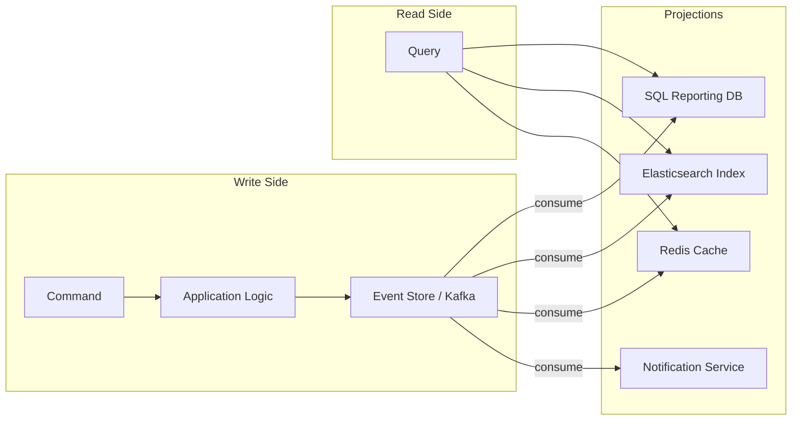
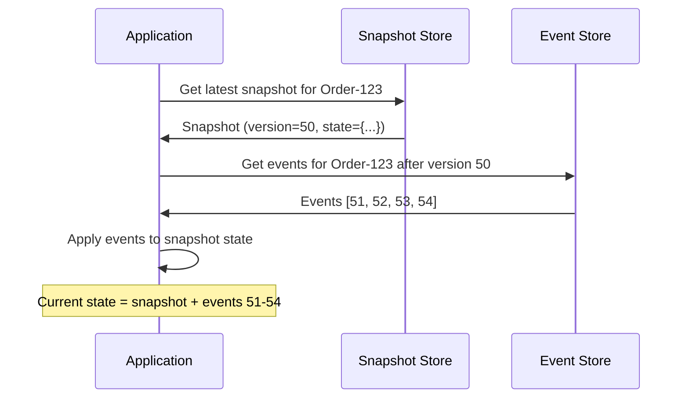

# Event Sourcing

## 1. Overview

Event sourcing is a data architecture pattern where state changes are stored as an immutable, append-only sequence of events rather than as mutable rows in a database. Instead of storing "the current balance is $500," you store every deposit and withdrawal that led to that balance. The current state is derived by replaying the event log from the beginning -- or from a snapshot.

This is a fundamentally different mental model from traditional CRUD. In CRUD, you overwrite state and lose history. In event sourcing, you never lose anything. The event log IS the source of truth, and every other data store (SQL tables, search indices, caches) is a projection -- a materialized view derived from replaying events.

As Cornelia Davis states in "Cloud Native Patterns": "The idea of event sourcing is that the event log is the source of truth, and all other databases are projections of the event log." Any write must first be made to the event log. After this write succeeds, one or more event handlers consume the new event and write it to other databases. This inversion -- the log is primary, the database is derived -- is the conceptual breakthrough that makes event sourcing powerful.

## 2. Why It Matters

- **Complete audit trail**: Every change is recorded with who, what, when, and why. This is not an afterthought bolted onto a database -- it is the architecture itself. Financial systems, healthcare, and compliance-heavy domains get auditability for free.
- **Time travel**: Need to know what a user's profile looked like last Tuesday? Replay events up to that timestamp. Need to debug a production issue? Replay the exact sequence of events that led to the bad state. This is a "time machine" for your data.
- **Decoupled projections**: Different services can build different views from the same event stream. The search service builds an inverted index; the analytics service builds aggregates; the notification service triggers alerts. All from the same source of truth.
- **Scalability**: Append-only writes are inherently fast (sequential I/O). Read models are independently optimized and scaled. No write contention because events are only ever appended, never updated.
- **Business logic evolution**: When business rules change, you can reprocess the event log with the new logic to produce a corrected view -- without losing the original events.
- **Debugging superpowers**: When something goes wrong, you can replay the exact sequence of events that led to the bad state on a separate instance. This is far more powerful than reading logs or inspecting a database snapshot.
- **Integration flexibility**: New services can be added by simply subscribing to the event stream and building their own projections. The existing system does not need to change.
- **Conflict resolution**: In collaborative systems (Google Docs, distributed databases), event logs provide the raw material for conflict resolution. Each client's events can be merged using operational transformation or CRDTs.

## 3. Core Concepts

- **Event**: An immutable record of a state change. Examples: `OrderPlaced`, `PaymentReceived`, `ItemShipped`. Contains an event type, timestamp, aggregate ID, and payload.
- **Event Store / Event Log**: The append-only storage for events. Can be implemented with Kafka topics, Kinesis streams, or a purpose-built event store (EventStoreDB).
- **Aggregate**: A domain entity whose state is reconstructed from its event stream. An "Order" aggregate is built from `OrderPlaced`, `ItemAdded`, `PaymentReceived`, etc.
- **Hydration (Replay)**: The process of rebuilding an aggregate's current state by replaying its events from the beginning (or from a snapshot).
- **Projection**: A read-optimized view derived from the event stream. A projection consumes events and updates a denormalized data store (e.g., a search index, a Redis cache, a SQL reporting table).
- **Snapshot**: A periodic checkpoint of an aggregate's state to avoid replaying the entire event history on every read. After taking a snapshot, only events after the snapshot need to be replayed.
- **Event Handler**: A consumer that listens for events and performs side effects (updating projections, sending notifications, triggering downstream workflows).

## 4. How It Works

### Write Path

1. A command arrives (e.g., "place order").
2. The application loads the current state of the aggregate by replaying its events (or loading a snapshot + subsequent events).
3. The application validates the command against the current state.
4. If valid, the application appends one or more new events to the event store.
5. Event handlers consume the new events and update projections asynchronously.

### Read Path

1. A query arrives (e.g., "get order details").
2. The application reads from a projection (a denormalized read model) rather than replaying events.
3. Projections are eventually consistent with the event store.

### Hydration / Replay

To reconstruct the state of an aggregate:

```
initial_state = {}
for event in event_store.get_events(aggregate_id):
    current_state = apply(current_state, event)
return current_state
```

For aggregates with long event histories, snapshots are taken periodically:

```
snapshot = snapshot_store.get_latest(aggregate_id)
events = event_store.get_events_after(aggregate_id, snapshot.version)
current_state = snapshot.state
for event in events:
    current_state = apply(current_state, event)
return current_state
```

### Event Store Implementation Options

| Technology | Characteristics |
|---|---|
| **Kafka** | Durable, partitioned, replayable. Long retention (days to forever). Consumer groups enable multiple projections. |
| **Amazon Kinesis** | Managed streaming service. Sharded. 7-day default retention (extendable to 365 days). |
| **EventStoreDB** | Purpose-built for event sourcing. Supports projections natively. Strong consistency per stream. |
| **DynamoDB Streams** | CDC on DynamoDB tables. Events are DynamoDB mutations. 24-hour retention. |
| **PostgreSQL** | Append-only table with version column. Simple but limited throughput and no built-in streaming. |

## 5. Architecture / Flow

### Event Sourcing with Projections



### Event Replay for State Reconstruction



## 6. Types / Variants

### Event Sourcing vs. Change Data Capture (CDC)

| Dimension | Event Sourcing | CDC |
|---|---|---|
| **Source of truth** | The event log | A database (events are derived from DB mutations) |
| **Granularity** | Fine-grained domain events (`OrderPlaced`) | Database-level changes (`INSERT`, `UPDATE`, `DELETE`) |
| **Intent** | Captures business intent and meaning | Captures raw data changes |
| **Schema** | Domain-specific event types | Generic mutation records |
| **Use case** | Domain modeling, audit trails, time travel | Syncing databases, feeding search indices |
| **Platforms** | Kafka, EventStoreDB, Kinesis | Debezium, DynamoDB Streams, Maxwell |

Both can coexist: use event sourcing within a service to capture domain events, and CDC to propagate database changes to other services.

### Full Event Sourcing vs. Event Logging

- **Full event sourcing**: Events are the ONLY source of truth. State is always derived from events. No separate "current state" table. This is the purest form but requires a significant mental model shift.
- **Event logging (hybrid)**: A traditional database stores current state, AND events are published for downstream consumers. Simpler to adopt but introduces the risk of the database and event log diverging.

### Event Versioning Strategies

As the system evolves, event schemas change. Several strategies manage this:

- **Upcasting**: When reading old events, transform them into the latest schema version in memory. The stored event is unchanged; the transformation happens at read time.
- **Lazy migration**: Leave old events as-is. New code handles both old and new formats. Over time, old events age out of active use.
- **Schema registry**: Store event schemas in a central registry (Confluent Schema Registry). Producers and consumers negotiate compatible schemas. Avro and Protobuf support backward/forward compatibility natively.
- **Event wrappers**: Wrap events in an envelope that includes the schema version. Consumers dispatch to the correct handler based on the version number.

### Snapshots in Detail

Without snapshots, loading an aggregate with 1 million events requires replaying all of them -- potentially seconds of latency. Snapshots solve this:

1. **Periodic snapshots**: After every N events (e.g., 100), serialize the aggregate's current state and store it alongside the event stream.
2. **Loading with snapshots**: Load the latest snapshot, then replay only the events after the snapshot's version number.
3. **Snapshot storage**: Snapshots can be stored in the same event store (as a special event type), in a separate key-value store, or in an object store like S3.
4. **Snapshot invalidation**: When the domain model changes (new fields, changed semantics), old snapshots may be invalid. The system falls back to full replay with the new logic and creates new snapshots.

### Performance Characteristics

| Operation | Without Snapshots | With Snapshots |
|---|---|---|
| Write (append event) | O(1) -- always fast | O(1) -- same |
| Read (load aggregate) | O(N) where N = total events | O(K) where K = events since last snapshot |
| Rebuild all projections | O(N * M) where M = projections | O(N * M) -- snapshots do not help projections |
| Storage growth | Linear with event count | Linear + snapshot overhead (typically <5%) |

## 7. Use Cases

- **Financial Systems**: Every transaction (deposit, withdrawal, transfer, fee) is an event. Account balance is derived by replaying events. This provides a complete, tamper-evident audit trail required by regulators.
- **E-Commerce Order Management**: An order aggregate accumulates events: `OrderPlaced`, `PaymentAuthorized`, `ItemPicked`, `ItemShipped`, `ItemDelivered`, `Refunded`. Customer support can replay the full order lifecycle to diagnose issues.
- **Healthcare**: Patient records as event streams. Every diagnosis, prescription, lab result, and procedure is an event. Regulatory compliance (HIPAA) requires immutable audit trails.
- **Gaming**: Player state (inventory, achievements, position) stored as events. Enables replay of game sessions, anti-cheat forensics, and rollback of exploited states.
- **IoT Telemetry**: Sensor readings as events in Kinesis. Projections compute rolling averages, detect anomalies, and trigger alerts.

## 8. Tradeoffs

| Advantage | Disadvantage |
|---|---|
| Complete, immutable audit trail | Increased storage requirements (events accumulate forever) |
| Time travel -- reconstruct state at any point | Event replay becomes costly as logs grow (mitigate with snapshots) |
| Decoupled projections for different read models | Eventual consistency between write and read models |
| Natural fit for event-driven architecture | Complexity in event schema evolution and versioning |
| Append-only writes are fast (sequential I/O) | Developers must shift from CRUD mental model |
| Business logic can be reprocessed retroactively | Deleting data (GDPR "right to be forgotten") is hard in an append-only log |
| Debugging: replay exact sequence of events | Requires careful design of event granularity |

## 9. Common Pitfalls

- **Events that are too fine-grained**: Storing `FieldChanged(field=email, old=a@b.com, new=c@d.com)` for every attribute is noise. Events should capture business intent: `UserEmailUpdated` or `OrderCancelled`.
- **Events that are too coarse**: A single `OrderUpdated` event with the full order state is just a snapshot log, not event sourcing. You lose the ability to understand what changed and why.
- **Neglecting snapshots**: Without periodic snapshots, hydrating an aggregate with 100,000 events takes seconds. Take snapshots every N events (e.g., every 100) to keep replay fast.
- **Schema evolution without a strategy**: Adding fields to events is safe (consumers ignore unknown fields). Removing or renaming fields breaks consumers. Use a schema registry and versioned event types.
- **GDPR and data deletion**: Append-only logs conflict with "right to be forgotten." Solutions include crypto-shredding (encrypt PII with a per-user key, delete the key) or event log compaction that replaces PII with tombstones.
- **Coupling projections to the event store**: If your projection code is embedded in the event store, you cannot independently scale or reprocess projections. Keep projections as independent consumers.
- **Assuming strong consistency**: Projections are eventually consistent. If a user creates an order and immediately queries for it, the projection may not have caught up. Handle this with read-your-own-writes patterns or synchronous projection updates for critical paths.

## 10. Real-World Examples

- **LMAX Exchange**: A high-frequency trading platform that pioneered event sourcing in the financial domain. All market events are stored in an append-only journal. The system replays the journal on startup to reconstruct the full order book state in microseconds.
- **Axon Framework**: A Java framework built specifically for event sourcing and CQRS. Used by banks, insurance companies, and logistics providers for domain-driven systems.
- **Event Store (Greg Young)**: EventStoreDB, created by the architect who popularized event sourcing, is purpose-built for this pattern. Used in financial services, healthcare, and logistics.
- **Netflix**: Uses Kafka as a durable event log for tracking content lifecycle events (encoding, publishing, A/B test assignments). Downstream services build projections for content discovery and personalization.
- **Uber**: Trip events stored in Kafka serve as the event source for billing, driver payment, and analytics projections. Any billing dispute can be resolved by replaying the trip event stream.
- **Walmart**: Uses event sourcing for inventory management. Every stock movement (receiving, shelving, selling, returning) is an event. The current stock level at any location is a projection that can be verified by replaying events.

### GDPR and Event Sourcing

The "right to be forgotten" (GDPR Article 17) conflicts fundamentally with an append-only log. Strategies:

- **Crypto-shredding**: Encrypt PII in events with a per-user key. When the user requests deletion, delete the encryption key. The events remain but the PII is irrecoverable.
- **Event log compaction**: Periodically rewrite the event log, replacing PII fields with tombstone markers. This violates the immutability principle but satisfies regulatory requirements.
- **Separation of concerns**: Store PII in a separate, deletable data store. Events reference user IDs but do not contain PII directly. When the user requests deletion, the PII store is cleared; events remain but are de-identified.

### When to Use Event Sourcing

**Good fit**:
- Financial systems where audit trails are mandatory (banking, payments, trading)
- Systems with complex state transitions (order management, insurance claims)
- Collaborative editing (Google Docs, Figma) where conflict resolution needs event history
- Systems that require temporal queries ("what was the state at time T?")
- High-write systems where append-only performance matters

**Poor fit**:
- Simple CRUD applications with straightforward read/write patterns
- Systems where storage cost is a primary constraint (events accumulate indefinitely)
- Teams unfamiliar with the pattern and without time to learn (steep learning curve)
- Systems where strong consistency between write and read models is required (projections are eventually consistent)
- Systems with high-volume, low-value events (IoT sensor data that does not need audit trails -- use time-series databases instead)

### Relationship to Kafka and Kinesis

Kafka and Kinesis are often used as event stores, but they have different characteristics than purpose-built event stores:

| Capability | Kafka | Kinesis | EventStoreDB |
|---|---|---|---|
| **Append-only log** | Yes | Yes | Yes |
| **Per-stream ordering** | Per-partition | Per-shard | Per-stream |
| **Retention** | Configurable (days to forever) | 1-365 days | Forever |
| **Stream-level reads** | Via consumer group + partition key filter | Via shard iterator | Native per-aggregate-stream |
| **Optimistic concurrency** | No (append-only, no version check) | No | Yes (expected version on write) |
| **Built-in projections** | No (use Kafka Streams or external) | No (use Lambda) | Yes (server-side projections) |
| **Operational complexity** | High | Medium (managed) | Medium |

For most teams, Kafka is the pragmatic choice: it serves as both the event store and the event bus, and the team likely already has it in their stack. EventStoreDB is worth evaluating if the team is committed to event sourcing as a core pattern and needs features like optimistic concurrency and native projections.

### Event Sourcing Anti-Patterns

- **The "CRUD event" trap**: Creating events like `UserUpdated` with the full user object as the payload. This is not event sourcing -- it is snapshot logging. Events should capture the intent: `UserEmailChanged`, `UserAddressUpdated`.
- **The "God aggregate" trap**: An aggregate that accumulates hundreds of event types and thousands of events per instance. Split into smaller aggregates with clearer boundaries.
- **The "event as command" trap**: Publishing events that are really commands ("SendEmailEvent"). Events describe what happened; commands describe what should happen. Use separate channels for events and commands.
- **Replaying without idempotency**: If projections are not idempotent, replaying events during recovery or rebuilding will corrupt the read model. Every projection handler must produce the same result regardless of how many times it processes the same event.

### Event Sourcing in the Interview Context

When discussing event sourcing in a system design interview:

1. **Know when to propose it**: Financial systems (audit trail), order management (state transitions), collaboration (conflict resolution). Do NOT propose it for simple CRUD apps.
2. **Articulate the tradeoff**: "We get a complete audit trail and the ability to add new read models from historical data, but we accept eventual consistency between the event store and projections."
3. **Address GDPR proactively**: "For PII, we would use crypto-shredding -- encrypting user data in events with a per-user key and deleting the key on account deletion."
4. **Connect to CQRS**: "Event sourcing naturally pairs with CQRS. The event store is our write model, and we build purpose-specific read models as projections."
5. **Mention snapshots**: "To avoid replaying thousands of events on every read, we take periodic snapshots and replay only events after the snapshot."

### Comparison: Event Sourcing vs. Traditional CRUD

| Dimension | Traditional CRUD | Event Sourcing |
|---|---|---|
| **Storage** | Current state only | Full history of all changes |
| **Write model** | UPDATE rows in place | APPEND events to log |
| **Read model** | Query the same tables | Query projections (derived views) |
| **Audit trail** | Requires separate audit table | Built-in (events ARE the audit trail) |
| **Debugging** | Inspect current state, read logs | Replay exact event sequence |
| **Schema migration** | ALTER TABLE, backfill data | Add new event types, reprocess |
| **Complexity** | Low | High (projections, snapshots, versioning) |
| **Consistency** | Immediate (single DB) | Eventual (projections lag behind events) |
| **Delete/GDPR** | DELETE row | Crypto-shredding or log compaction |

## 11. Related Concepts

- [CQRS](./cqrs.md) -- frequently combined with event sourcing; events propagate changes to read models
- [Event-Driven Architecture](./event-driven-architecture.md) -- event sourcing is a specific implementation of EDA principles
- [Message Queues](./message-queues.md) -- Kafka/Kinesis as the event store infrastructure
- [Distributed Transactions](../resilience/distributed-transactions.md) -- saga pattern uses event logs for coordination
- [Database Replication](../storage/database-replication.md) -- CDC as a related but distinct pattern

### Operational Considerations

Running event sourcing in production requires attention to:

- **Event store retention and compaction**: Decide whether events are retained forever (full audit) or compacted (only the latest per entity). For regulatory compliance, events may need to be retained for 7+ years.
- **Projection rebuild time**: If a projection needs to be rebuilt from scratch (schema change, bug fix), how long does it take? For a system with 1 billion events, a rebuild at 10,000 events/second takes 28 hours. Plan for this with parallel processing and off-peak scheduling.
- **Monitoring**: Track event store write throughput, projection lag, snapshot hit ratio, and replay duration. Alert on projection lag exceeding SLA.
- **Backup and disaster recovery**: The event store is the single source of truth. It must be replicated across availability zones and periodically backed up to a separate region. Losing the event store means losing all data.

## 12. Source Traceability

- source/youtube-video-reports/4.md (event sourcing, append-only logs, hydration, time travel)
- source/youtube-video-reports/8.md (event sourcing, append-only logs, Kafka/Kinesis, hydration)
- source/extracted/acing-system-design/ch07-distributed-transactions.md (event sourcing definition, event log as source of truth, CDC comparison, audit trail)
- source/extracted/ddia/ch14-stream-processing.md (event sourcing, stream processing, CDC)
