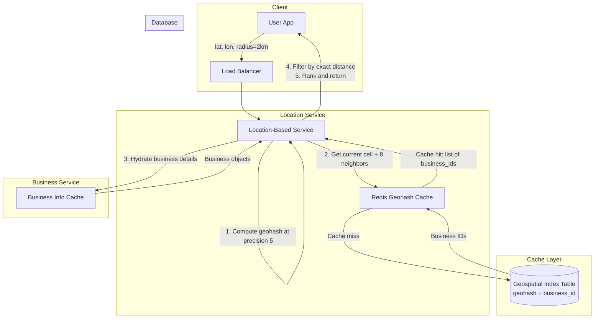
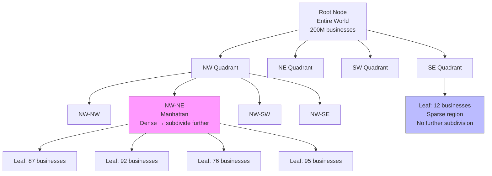
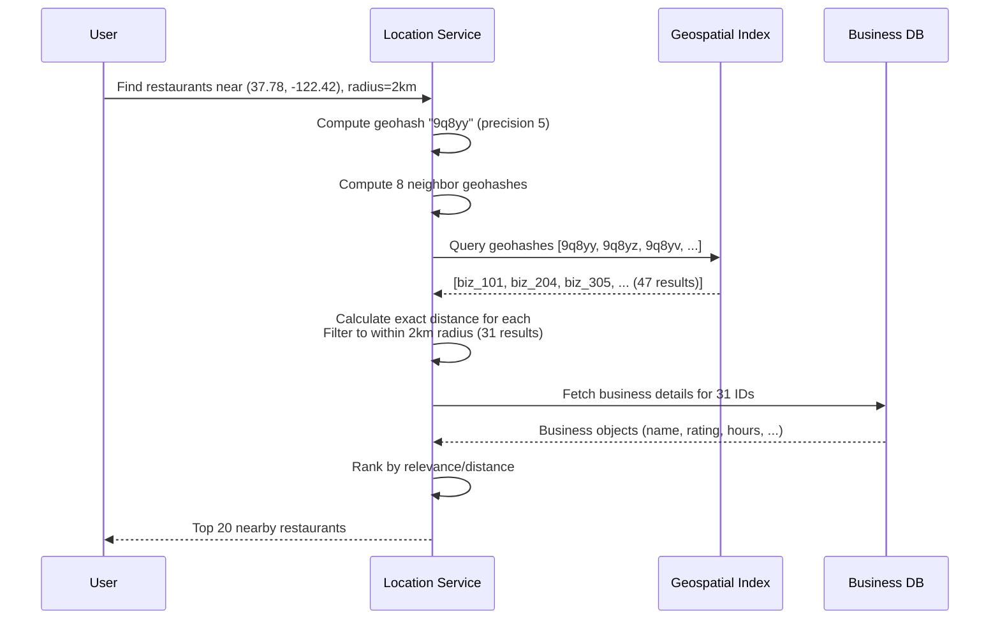

# Geospatial Indexing

## 1. Overview

Geospatial indexing solves the problem of efficiently answering proximity queries: "find all restaurants within 2 km of my location" or "show me the nearest 10 drivers." Standard one-dimensional database indexes (B-trees) fail for spatial queries because latitude and longitude are two independent dimensions. A B-tree can efficiently filter on latitude OR longitude, but intersecting those two result sets to find points within a radius remains expensive.

Geospatial indexes work by mapping two-dimensional (or higher) space into structures that enable efficient spatial queries. The three dominant approaches are geohashing (reducing 2D to 1D strings), quadtrees (recursive spatial subdivision), and R-trees (dynamic bounding-box clustering). Each has distinct tradeoffs in update complexity, query flexibility, and memory model.

In production, companies use Geohash in Redis, Quadtrees as in-memory data structures on application servers, and R-trees via PostGIS. Google Maps and Tinder use Google S2 (a Hilbert-curve based approach). Elasticsearch supports both geohash and quadtree internally.

## 2. Why It Matters

Location-based services are among the highest-traffic applications in the world. Uber processes millions of real-time location queries per second. Yelp serves proximity searches for 200 million businesses. Tinder matches users within a dynamic geographic radius. DoorDash routes orders to nearby drivers.

The choice of geospatial index determines:
- **Query latency**: A naive 2D SQL query (`WHERE lat BETWEEN ... AND lon BETWEEN ...`) scans the entire table. A geospatial index reduces this to O(log N) or O(1).
- **Update cost**: Ride-sharing apps update driver locations every 1-4 seconds. The index must handle millions of writes per second.
- **Density adaptation**: Manhattan has 100x the point density of rural Wyoming. A fixed grid wastes resources in sparse areas and provides insufficient resolution in dense areas.
- **Memory model**: Quadtrees and S2 are in-memory structures (fast but require RAM). Geohash is stored in the database (persistent but slower). The choice depends on the read/write ratio and dataset size.

## 3. Core Concepts

- **Geohash**: A string-based encoding that recursively divides the Earth into a grid. Each character in the string narrows the location to a smaller cell. Nearby points share common prefixes, enabling proximity queries via simple string prefix matching on a standard B-tree index.
- **Quadtree**: A tree data structure where each internal node has exactly four children, corresponding to four spatial quadrants (NW, NE, SW, SE). The tree recursively subdivides until each leaf contains fewer than a threshold number of points (e.g., 100). Dense areas produce deeper trees with smaller cells; sparse areas remain as large cells.
- **R-Tree**: A balanced tree where each node contains a bounding rectangle that encloses all points in its subtree. R-trees use dynamic clustering -- the bounding boxes can overlap, and insertion/deletion triggers rebalancing. PostGIS uses R-trees (specifically GiST indexes) as its primary spatial index.
- **Proximity Query**: "Find all points within radius R of location (lat, lon)." This is the core operation for Yelp, Uber, and Tinder.
- **k-Nearest Neighbor (kNN)**: "Find the K closest points to location (lat, lon)." This is used when you want the closest results regardless of a fixed radius (e.g., "find the nearest gas station").
- **Geofence**: A virtual perimeter for a real-world area. Used for notifications ("you are near a store") and compliance ("content restricted to this region").

## 4. How It Works

### Geohashing

Geohashing converts a (latitude, longitude) pair into a base-32 string by alternating between longitude and latitude bits:

1. **Divide longitude**: Is the longitude in [-180, 0] (bit 0) or [0, 180] (bit 1)?
2. **Divide latitude**: Is the latitude in [-90, 0] (bit 0) or [0, 90] (bit 1)?
3. **Repeat**: Continue subdividing each half, alternating between longitude and latitude bits.
4. **Encode**: Convert the binary string to base-32.

Example: Google HQ -> `9q9hvu` (length 6), Facebook HQ -> `9q9jhr` (length 6). They share the prefix `9q9`, indicating they are in the same broad region.

**Precision levels**:

| Geohash Length | Cell Size | Use Case |
|---------------|-----------|----------|
| 1 | 5,009 km x 4,993 km | Continent |
| 2 | 1,252 km x 624 km | Large country |
| 3 | 156 km x 156 km | Large city |
| 4 | 39 km x 19.5 km | City |
| 5 | 4.9 km x 4.9 km | Neighborhood (typical for proximity search) |
| 6 | 1.2 km x 609 m | Block |
| 7 | 153 m x 152 m | Building |
| 8 | 38 m x 19 m | Precise location |

**Querying**: To find all businesses within 5 km, compute the geohash at length 4 (39 km cells). Fetch all businesses with geohashes matching the current cell AND the 8 neighboring cells (to handle boundary cases). Then filter results by exact distance.

**Boundary Problem**: Two points can be very close but have completely different geohash prefixes if they are on opposite sides of a cell boundary. For example, in France, La Roche-Chalais (geohash: `u000`) is 30 km from Pomerol (geohash: `ezzz`) -- no shared prefix despite proximity. The solution is to always query the 8 neighboring cells.

### Quadtree

A quadtree recursively subdivides space into four quadrants until a termination condition is met (e.g., each leaf contains <= 100 points):

1. Start with the entire world as the root node.
2. If the root contains more than 100 points, split it into 4 quadrants (NW, NE, SW, SE).
3. Recursively apply the splitting criterion to each child.
4. Dense areas (Manhattan) produce many small cells. Sparse areas (Sahara) remain as large cells.

**Memory estimation** (for 200M businesses, max 100 per leaf):
- Leaf nodes: ~2 million (200M / 100)
- Internal nodes: ~667,000 (1/3 of leaf count)
- Memory per leaf: 832 bytes (32 bytes coordinates + 800 bytes for 100 business IDs)
- Memory per internal node: 64 bytes (32 bytes coordinates + 32 bytes for 4 pointers)
- Total: ~1.71 GB -- fits easily in server memory

**Querying**: Start at the root and traverse down to the leaf containing the query point. If that leaf has enough results, return them. Otherwise, expand to neighboring leaves. Quadtrees naturally handle kNN queries by adjusting the search radius based on leaf content.

**Operational consideration**: Building a quadtree with 200M businesses takes a few minutes. During this time, the server cannot serve traffic. Roll out new server versions incrementally (blue-green deployment) to avoid brownouts.

### R-Tree (PostGIS)

R-trees organize spatial data using Minimum Bounding Rectangles (MBRs):

1. Each leaf node contains a set of points and their MBR.
2. Each internal node contains the MBRs of its children.
3. MBRs can overlap, unlike quadtree cells which are disjoint.
4. Insertion triggers splits and rebalancing to keep the tree balanced.

R-trees are the "production standard" for spatial databases because they handle arbitrary polygons (not just points), support dynamic inserts/deletes efficiently, and work well with disk-based storage (PostGIS uses GiST indexes backed by R-trees).

### Why Standard B-Tree Indexes Fail for 2D Queries

A B-tree index on the `latitude` column efficiently narrows results to all points within a latitude range. A separate B-tree on `longitude` does the same for longitude. But the proximity query requires BOTH conditions simultaneously. The database must:

1. Fetch all points matching the latitude range (potentially millions in a densely populated latitude band)
2. Fetch all points matching the longitude range (another potentially huge set)
3. Intersect these two sets to find points matching both conditions

This intersection is expensive and returns a set that is much larger than the actual results within the target radius. The fundamental problem is that B-trees are one-dimensional -- they sort data along a single axis. Two-dimensional proximity cannot be efficiently resolved by intersecting two one-dimensional results.

Geospatial indexes solve this by reducing the 2D problem to a structure optimized for spatial locality. Geohashing encodes 2D coordinates into a 1D string where spatial proximity maps to string prefix similarity. Quadtrees and R-trees use hierarchical spatial subdivision to prune the search space at each level of the tree.

### Google S2 Geometry

Google S2 is a sophisticated library that projects the Earth's surface onto the six faces of a cube, then maps each face to a unit square using a Hilbert curve. The Hilbert curve is a space-filling curve with the property that points close on the curve are close in 2D space (and vice versa, mostly). This produces a 1D index with excellent spatial locality.

S2 advantages over geohash:
- **Variable-resolution cells**: S2 can cover an arbitrary area with cells of different sizes (min level, max level, max cells), providing more precise geofence boundaries.
- **No edge discontinuity**: Geohash has seams at the prime meridian and equator where adjacent cells have completely different prefixes. S2's cube projection avoids these discontinuities.
- **Geofencing**: S2 can define complex polygonal geofences and efficiently test point-in-polygon membership using its cell hierarchy.

S2 is used by Google Maps, Tinder, and Foursquare. However, it is significantly more complex to implement and explain than geohash, making geohash the preferred choice for system design interviews.

## 5. Architecture / Flow

### Proximity Service with Geohash (Yelp-style)

### Quadtree In-Memory Lookup

### Geospatial Query Execution

## 6. Types / Variants

### Geospatial Index Comparison

| Feature | Geohash | Quadtree | R-Tree (PostGIS) | Google S2 |
|---------|---------|----------|-------------------|-----------|
| Data structure | String prefix (B-tree indexable) | In-memory tree (4 children/node) | Balanced tree (MBR-based) | Hilbert curve cells |
| Storage model | Database (persistent) | In-memory (per server) | Database (persistent) | In-memory |
| Density adaptation | Fixed grid at each precision | Dynamic (subdivides dense areas) | Dynamic (overlapping MBRs) | Dynamic (multi-level cells) |
| Insert complexity | O(1) | O(log N) + potential rebalance | O(log N) + potential split | O(1) |
| Query complexity | O(K) where K = cells to check | O(log N) tree traversal | O(log N) tree traversal | O(K) cells |
| kNN support | Awkward (expand radius) | Natural (expand leaves) | Native | Native |
| Update cost | Low (insert/delete rows) | High (rebuild or complex locking) | Medium (balanced inserts) | Low |
| Used by | Bing Maps, Redis, MongoDB, Lyft | Yext, Elasticsearch | PostGIS, Oracle Spatial | Google Maps, Tinder |

### When to Use Each

| Scenario | Recommended Index | Rationale |
|----------|------------------|-----------|
| Proximity search (Yelp, DoorDash) | Geohash | Simple, B-tree indexable, easy to cache in Redis |
| kNN queries (nearest gas station) | Quadtree | Natural radius expansion; stops when K results found |
| Complex spatial operations (polygons, intersections) | R-Tree (PostGIS) | Handles arbitrary shapes, not just points |
| Multi-resolution geofencing | Google S2 | Variable cell sizes for precise geofence boundaries |
| Real-time driver location (Uber) | Geohash in Redis | Fast writes/reads; 10M QPS architecture |
| Dense + sparse mixed environments | Quadtree or S2 | Adaptive resolution prevents wasted cells in sparse areas |

### Scaling the Geospatial Index

| Approach | When | How |
|----------|------|-----|
| Read replicas | Read volume exceeds single node | Multiple database replicas serve read traffic |
| Sharding by geohash prefix | Dataset exceeds single node | Shard by first 2-3 characters of geohash (geographic regions) |
| Sharding by business ID | Even distribution needed | Shard by business_id; query all shards and merge |
| In-memory replicas (quadtree) | Ultra-low latency | Each LBS server builds its own quadtree from DB at startup |

## 7. Use Cases

- **Uber / Lyft (Real-Time Driver Matching)**: Lyft's geospatial system handles 10 million queries per second using Redis with geohash. Driver locations are updated every 4 seconds. The matching algorithm finds the nearest available driver to a rider's pickup location using geospatial radius queries.
- **Yelp (Proximity Search)**: Finding nearby restaurants is the core product. Uses geohash with 200 million businesses. The entire geospatial index (~1.7 GB for quadtree, similar for geohash) fits in memory, making read replicas the preferred scaling strategy over sharding.
- **Tinder (Geospatial Matching)**: Uses Google S2 with geosharding for profile recommendations. Profiles are sharded by geographic region so that queries only hit the shard containing nearby profiles. The "proximity radius" is a configurable user preference (1-100 miles).
- **Google Maps (Tile Serving)**: Uses Google S2 to partition the world into hierarchical cells. Map tiles are pre-rendered at multiple zoom levels and served via CDN. The S2 cell hierarchy maps directly to tile granularity.
- **DoorDash / Grubhub (Restaurant Discovery)**: Proximity search for restaurants within delivery radius. The delivery radius is not circular -- it follows road network distances, but the initial candidate set uses geospatial indexing to narrow results before applying graph-based routing.
- **Pokemon Go (Geofencing)**: Uses geospatial indexing to determine which virtual creatures are near a player's location and to define gym/pokestop boundaries.

## 8. Tradeoffs

| Factor | Geohash | Quadtree | R-Tree |
|--------|---------|----------|--------|
| Implementation complexity | Low | Medium | High (use PostGIS) |
| Cache-friendly | Excellent (string keys in Redis) | Good (in-memory) | Poor (disk-based, page-oriented) |
| Dynamic updates | Easy (insert/delete rows) | Hard (locking, rebalancing) | Medium (balanced tree operations) |
| Boundary handling | Must query 8 neighbors | Natural (tree traversal) | Natural (overlapping MBRs) |
| Density adaptation | None (fixed grid per precision) | Excellent (recursive subdivision) | Good (dynamic MBRs) |
| Polygon support | No (points and cells only) | No (points only) | Yes (arbitrary geometries) |
| Build time (200M points) | Instant (insert rows) | Minutes (tree construction) | Minutes (bulk load) |
| Memory (200M points) | ~5 GB in Redis (3 precisions) | ~1.7 GB | Disk-based (page cache) |

### Geohash Precision Selection Guide

| Search Radius | Geohash Length | Cell Size |
|--------------|---------------|-----------|
| 0.5 km | 6 | 1.2 km x 609 m |
| 1 km | 5 | 4.9 km x 4.9 km |
| 2 km | 5 | 4.9 km x 4.9 km |
| 5 km | 4 | 39 km x 19.5 km |
| 20 km | 4 | 39 km x 19.5 km |

## 9. Common Pitfalls

- **Using standard B-tree indexes on lat/lon columns**: A query `WHERE lat BETWEEN x1 AND x2 AND lon BETWEEN y1 AND y2` fetches two large result sets and intersects them. This is O(N) in practice. Use a proper geospatial index.
- **Ignoring the geohash boundary problem**: A simple prefix query `WHERE geohash LIKE '9q8yy%'` will miss nearby businesses in adjacent cells. Always query the 8 neighboring geohashes and filter by exact distance.
- **Sharding the geospatial index prematurely**: The entire geospatial index for 200M businesses fits in ~1.7 GB (quadtree) or ~5 GB (geohash in Redis with 3 precisions). Read replicas are almost always the right scaling strategy before sharding.
- **Using quadtree without considering build time**: A quadtree with 200M points takes minutes to build at server startup. During this time, the server cannot serve traffic. Use incremental rollouts (blue-green deployment) and stagger server restarts.
- **Confusing geohash proximity with actual distance**: Two points with long shared geohash prefixes are generally close, but the reverse is not true. Points on opposite sides of a cell boundary can be very close with no shared prefix (La Roche-Chalais at `u000` is 30 km from Pomerol at `ezzz`).
- **Not separating read and write paths for location updates**: In ride-sharing, driver location updates (writes) happen every 1-4 seconds for millions of drivers. If the write path contends with the read path (proximity queries), both degrade. Use separate write-optimized stores (Redis for current location) and read-optimized indexes (geohash for proximity).

## 10. Real-World Examples

- **Lyft (Redis Geospatial at 10M QPS)**: Lyft built a geospatial architecture using Redis that handles 10 million queries per second. Driver locations are stored as geohash entries in Redis sorted sets. The `GEORADIUS` command finds drivers within a specified radius of the rider's location. This architecture replaced a previous PostgreSQL-based solution that could not handle the write throughput of millions of driver location updates.
- **Yelp (Proximity Service)**: Alex Xu's system design case study for a proximity service mirrors Yelp's architecture. The service uses geohash with precision levels 4, 5, and 6, cached in Redis across three precision keys. Business IDs are fetched from the geohash cache, hydrated from a business info cache, filtered by exact distance, and ranked. Total Redis memory: ~5 GB for 200M businesses at 3 precisions.
- **Tinder (Geosharded Recommendations)**: Tinder uses Google S2 with a geosharding approach. User profiles are partitioned by S2 cell ID, so a proximity query only hits the shard(s) covering the user's geographic area. This eliminates cross-shard queries for the common case. Elasticsearch is used for indexing within each geoshard with both geohash and quadtree capabilities.
- **PostGIS (R-Tree in Production)**: PostGIS extends PostgreSQL with R-tree spatial indexes (via GiST). Used by OpenStreetMap, Mapbox, and CARTO for spatial analytics. Supports complex operations like polygon intersection, distance calculations on the spheroid, and spatial joins.
- **Google Maps (S2 Geometry)**: Google S2 maps the Earth's surface onto a cube, then unfolds it using the Hilbert curve to create a 1D index. This preserves spatial locality -- points close on the Earth's surface are close in the 1D index. S2 is used for map tile serving, geofencing, and spatial indexing across Google's products.

## 11. Related Concepts

- [Database Indexing](../storage/database-indexing.md) -- B-tree indexes are the foundation for geohash-based queries
- [Redis](../caching/redis.md) -- geospatial API (GEOADD, GEORADIUS) uses geohashing internally
- [Search and Indexing](search-and-indexing.md) -- Elasticsearch supports geospatial queries alongside full-text search
- [Sharding](../scalability/sharding.md) -- geosharding partitions data by geographic region
- [Probabilistic Data Structures](probabilistic-data-structures.md) -- Bloom filters used in Tinder to prevent repeat profile display within geospatial matches

## 12. Source Traceability

| Concept | Source |
|---------|--------|
| Geohashing (recursive subdivision, base-32, boundary issues) | YouTube Report 7 (Section 2), Alex Xu Vol 2 (ch02: Proximity Service) |
| Quadtree (recursive splitting, density adaptation, memory estimation) | YouTube Report 7 (Section 2), Alex Xu Vol 2 (ch02) |
| R-Tree (PostGIS, dynamic clustering, bounding boxes) | YouTube Report 7 (Section 2) |
| Tinder geospatial matching, Elasticsearch/PostGIS | YouTube Report 2 (Section 8), YouTube Report 3 (Section 6) |
| 1D index failure for 2D queries | YouTube Report 7 (Section 2) |
| Geohash precision table (length to grid size) | Alex Xu Vol 2 (ch02: Table 4) |
| Quadtree memory estimation (~1.71 GB for 200M businesses) | Alex Xu Vol 2 (ch02) |
| Google S2, Hilbert curve, Tinder geosharding | Alex Xu Vol 2 (ch02: Option 5) |
| Lyft Redis geospatial 10M QPS architecture | Alex Xu Vol 2 (ch02: Reference 29) |
| Grokking: Yelp/proximity service design | Grokking System Design (Yelp chapter) |
