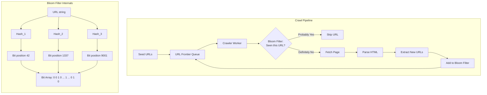
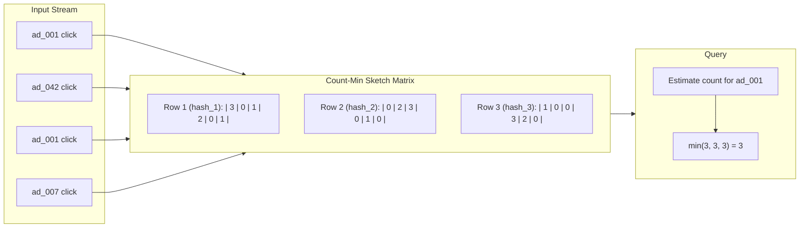
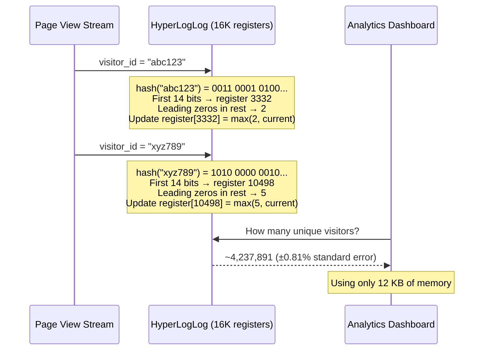

# Probabilistic Data Structures

## 1. Overview

Probabilistic data structures trade absolute precision for dramatic reductions in memory and computation. At extreme scale -- billions of URLs, trillions of events, hundreds of millions of unique visitors -- deterministic data structures (hash sets, hash maps, exact counters) consume untenable amounts of memory. A HashSet storing 1 billion 100-byte URLs requires ~100 GB of RAM. A Bloom filter answering the same "have I seen this URL?" question uses ~1.2 GB with a 1% false positive rate.

These structures are not approximations born of laziness. They are deliberate engineering tradeoffs where the cost of 100% accuracy vastly exceeds the cost of being 99% accurate. Senior architects reach for them when the data volume makes exact computation economically or physically infeasible.

The three workhorses are:
- **Bloom Filter** -- set membership ("Have I seen this before?")
- **Count-Min Sketch** -- frequency estimation ("How many times have I seen this?")
- **HyperLogLog** -- cardinality estimation ("How many unique items have I seen?")

## 2. Why It Matters

At Facebook, Google, and Amazon scale, naive approaches collapse:

- A web crawler processing 10 billion URLs cannot afford a 1 TB hash set to deduplicate. A Bloom filter does it in ~10 GB.
- An ad platform tracking click frequency across 2 million ads cannot maintain exact per-ad counters with sub-millisecond latency. Count-Min Sketch provides "heavy hitter" detection in constant space.
- A analytics dashboard counting daily unique visitors across billions of page views cannot store every visitor ID. HyperLogLog estimates cardinality using ~12 KB regardless of the actual count.

The business impact is direct: these structures enable features that would otherwise require 10-100x more infrastructure, saving millions of dollars annually in compute and storage costs.

## 3. Core Concepts

- **False Positive**: The structure reports "yes" when the answer is actually "no." All three structures can produce false positives.
- **False Negative**: The structure reports "no" when the answer is actually "yes." Bloom filters guarantee zero false negatives. Count-Min Sketch and HyperLogLog do not produce false negatives in their respective domains.
- **Hash Functions**: All three structures rely on multiple independent hash functions to distribute items across a fixed-size bit array or register set. The quality and independence of hash functions directly affect accuracy.
- **Space-Accuracy Tradeoff**: More memory means fewer errors. The architect chooses the acceptable error rate and calculates the required memory.
- **One-directional Operations**: Items can be added but typically not removed (standard Bloom filters are append-only). This simplifies concurrency but means the structure grows monotonically in "fullness."

## 4. How It Works

### Bloom Filter

A Bloom filter is a bit array of size `m` with `k` hash functions.

**Insert**:
1. Hash the item with each of `k` hash functions to produce `k` positions.
2. Set those `k` bits to 1.

**Query**:
1. Hash the item with each of `k` hash functions.
2. If ALL `k` bits are 1, return "probably in the set."
3. If ANY bit is 0, return "definitely not in the set."

**Why false positives occur**: Different items can set overlapping bits. As the filter fills up, more bits are set to 1, increasing the probability that an unseen item's hash positions are all coincidentally 1.

**Optimal parameters**:
- For `n` expected items and desired false positive rate `p`:
  - Optimal bit array size: `m = -(n * ln(p)) / (ln(2))^2`
  - Optimal hash functions: `k = (m/n) * ln(2)`
- Example: 1 billion items with 1% false positive rate requires ~1.2 GB and 7 hash functions.

**Counting Bloom Filter variant**: Replaces each bit with a counter, enabling deletions at the cost of 3-4x memory.

**Scalable Bloom Filters**: When the expected number of items `n` is unknown upfront, a single Bloom filter will degrade as it fills past capacity. A Scalable Bloom Filter uses a chain of filters, each larger than the last. When the current filter exceeds a fill threshold, a new (larger) filter is added. Lookups check all filters in the chain (a miss is returned only if all filters report "not found"). This keeps the false positive rate bounded even as the dataset grows indefinitely.

**Practical example -- Cassandra Read Path**: When reading a key from Cassandra, the system may need to check multiple SSTables on disk. Each SSTable has an associated Bloom filter. Before performing an expensive disk read, Cassandra checks the Bloom filter: if it says "definitely not in this SSTable," the disk read is skipped entirely. With 10 SSTables and a key present in only 1, the Bloom filter eliminates 9 out of 10 disk reads, reducing read latency dramatically.

### Count-Min Sketch

A Count-Min Sketch is a 2D array (matrix) of counters with dimensions `d x w`, where `d` is the number of hash functions and `w` is the width of each row.

**Insert (increment)**:
1. Hash the item with each of `d` hash functions.
2. Each hash function maps to a position in its corresponding row.
3. Increment the counter at each of the `d` positions.

**Query (estimate frequency)**:
1. Hash the item with each of `d` hash functions.
2. Read the counter at each of the `d` positions.
3. Return the **minimum** of the `d` counter values.

**Why the minimum**: Each counter may be inflated by collisions from other items. The minimum is the least inflated and therefore the most accurate estimate. The true count is always <= the estimated count (it never underestimates).

**Accuracy guarantees**:
- With probability >= 1 - delta, the estimate is within epsilon * N of the true count, where N is the total number of events.
- Width `w = ceil(e / epsilon)` and depth `d = ceil(ln(1/delta))`

### HyperLogLog

HyperLogLog estimates the number of unique items (cardinality) in a stream using the statistical behavior of hash values.

**Core Intuition**: When you hash random items, the maximum number of leading zeros observed in any hash correlates with the logarithm of the number of unique items. If you have seen a hash with 10 leading zeros, you have probably seen around 2^10 = 1,024 unique items (because the probability of a hash having 10 leading zeros is 1/1024).

**How it works**:
1. Hash each item to a binary string.
2. Use the first `p` bits to select one of `2^p` registers (buckets). This is called "stochastic averaging."
3. Count the number of leading zeros in the remaining bits.
4. Store the maximum leading-zero count observed in that register.
5. To estimate cardinality, compute the harmonic mean across all registers and apply a correction factor.

**Memory**: Uses `2^p` registers, each storing a small integer (typically 5-6 bits). With `p = 14` (16,384 registers), HyperLogLog uses approximately 12 KB of memory and achieves a standard error of ~0.81%.

**Key property**: Memory usage is constant regardless of the actual cardinality. Whether you have 1,000 unique items or 1 billion, the structure uses the same ~12 KB (with p=14). This is what makes it transformative -- a HashMap tracking 1 billion unique IDs would require ~8 GB, while HyperLogLog uses 12 KB.

**Mergeability**: HyperLogLog registers can be merged by taking the element-wise maximum across corresponding registers. This means you can maintain separate HyperLogLogs for each hour of the day and merge them to get the daily unique count, or maintain per-region counters and merge for a global count. This property is invaluable for distributed systems where each node tracks its own cardinality and periodically reports to a central aggregator.

**Practical worked example**: Suppose you have 16 registers (p=4, for simplicity) and you observe these hashes:
- Item A: hash = `0011 10010...` -> register 3, leading zeros in rest = 0 -> max(reg[3], 1) = 1
- Item B: hash = `0011 00010...` -> register 3, leading zeros in rest = 3 -> max(reg[3], 4) = 4
- Item C: hash = `1010 00001...` -> register 10, leading zeros in rest = 3 -> max(reg[10], 4) = 4

The harmonic mean of the maximum leading-zero counts across all registers, multiplied by a correction constant, yields the cardinality estimate. The key insight is that seeing a high leading-zero count in any register is statistically unlikely without a large number of unique items -- it is the "birthday paradox" applied to hash distribution.

## 5. Architecture / Flow

### Bloom Filter in a Web Crawler

### Count-Min Sketch for Heavy Hitters

### HyperLogLog for Unique Visitor Counting

## 6. Types / Variants

| Structure | Question It Answers | Error Type | Memory | Accuracy |
|-----------|-------------------|------------|--------|----------|
| Bloom Filter | "Is X in the set?" | False positives (no false negatives) | ~10 bits/item for 1% FP | Configurable via m and k |
| Counting Bloom Filter | Same + supports deletion | Same | ~32-40 bits/item | Same as Bloom |
| Cuckoo Filter | Same + supports deletion + better space efficiency | False positives | ~12 bits/item for 3% FP | Better than Bloom at low FP rates |
| Count-Min Sketch | "How many times has X appeared?" | Over-estimation only | d x w counters | Within epsilon * N |
| Count Sketch | Same, but unbiased | Over- and under-estimation | d x w counters | Better for skewed distributions |
| HyperLogLog | "How many unique items?" | +-0.81% standard error (p=14) | ~12 KB (16K registers) | 99.7% within +-2.4% |
| HyperLogLog++ | Same, with better small cardinality estimation | Same | ~12 KB | Better bias correction |

### Memory Comparison for 1 Billion Unique Items

| Approach | Memory Required | Error Rate |
|----------|----------------|------------|
| HashSet (exact) | ~8-16 GB | 0% |
| Sorted array (exact) | ~8 GB | 0% |
| Bloom Filter (membership only) | ~1.2 GB (1% FP) | 1% false positive |
| HyperLogLog (count only) | ~12 KB | ~0.81% standard error |

## 7. Use Cases

- **Web Crawler URL Deduplication (Bloom Filter)**: Google's web crawler processes billions of URLs. Before fetching a page, it checks a Bloom filter to determine if the URL has already been crawled. A false positive means occasionally skipping an uncrawled URL -- acceptable. A false negative (impossible with Bloom filters) would mean re-crawling, wasting bandwidth.
- **Cassandra SSTable Lookups (Bloom Filter)**: Before reading from an immutable SSTable on disk, Cassandra checks a Bloom filter to determine if the requested key might exist in that SSTable. This avoids expensive disk I/O for SSTables that definitely do not contain the key.
- **Tinder Repeat Profile Prevention (Bloom Filter)**: To avoid showing users profiles they have already swiped on, Tinder uses a Bloom filter per user. The staff-level recommendation is to relax this constraint -- reset the filter every 30-90 days -- rather than maintaining an ever-growing 36.5 TB/year exact deduplication store.
- **Ad Click Fraud Detection (Count-Min Sketch)**: Detecting IPs or users with abnormally high click frequency requires real-time frequency counting. Count-Min Sketch identifies "heavy hitters" (items exceeding a threshold) in constant space, flagging potential fraud for deeper investigation.
- **Facebook Post Search Hot Terms (Count-Min Sketch)**: Count-Min Sketch identifies "hot" search terms for in-memory indexing, while evicting "cold" terms to cheaper storage (S3). This reduces the working set of the search index.
- **Redis PFCOUNT / Unique Visitor Counting (HyperLogLog)**: Redis natively implements HyperLogLog via `PFADD` and `PFCOUNT` commands. A single HyperLogLog key uses ~12 KB and can estimate unique counts of billions of items. Used for real-time unique visitor dashboards and feature usage analytics.

## 8. Tradeoffs

| Factor | Bloom Filter | Count-Min Sketch | HyperLogLog |
|--------|-------------|-----------------|-------------|
| Memory | ~1.2 GB / 1B items (1% FP) | d * w * 4 bytes (configurable) | ~12 KB (fixed) |
| Error type | False positives only | Over-count only | Symmetric (±%) |
| Deletions | Not supported (standard) | Supported (decrement) | Not applicable |
| Merge-ability | Yes (bitwise OR) | Yes (cell-wise max) | Yes (register-wise max) |
| Parallelism | Excellent (each insert independent) | Excellent | Excellent |
| Use case ceiling | ~10B items before FP rate degrades | Unlimited stream events | Unlimited unique items |

### When NOT to Use

| Situation | Why Exact Computation is Required |
|-----------|----------------------------------|
| Financial transactions | A 1% false positive in deduplication means 1% of transactions incorrectly rejected |
| Medical record deduplication | False matches have patient safety implications |
| Billing / invoicing | Even small count errors translate to monetary disputes |
| Legal compliance (audit logs) | Approximate counts are not legally defensible |

## 9. Common Pitfalls

- **Using a Bloom filter when you need exact deduplication**: Bloom filters have false positives. For systems where a false positive means lost revenue (duplicate ad impressions, duplicate transactions), you need exact deduplication.
- **Not sizing the Bloom filter for growth**: A Bloom filter's false positive rate increases as it fills up. If you size for 1 billion items but insert 5 billion, the false positive rate may exceed 50%. Either over-provision or use a scalable Bloom filter (a chain of filters).
- **Confusing Count-Min Sketch with exact counting**: Count-Min Sketch over-counts. If you use it for billing ("how many clicks did this ad get?"), you will overcharge advertisers. Use it for anomaly detection and top-K approximation, not financial reporting.
- **Assuming HyperLogLog can tell you WHICH items are unique**: HyperLogLog only estimates HOW MANY unique items exist. It cannot enumerate them or tell you if a specific item was seen. For membership queries, use a Bloom filter.
- **Forgetting that Bloom filters cannot delete**: Removing an item from a standard Bloom filter is impossible without rebuilding. If your use case requires deletions (e.g., removing a user from a blocklist), use a Counting Bloom filter or a Cuckoo filter.
- **Using HyperLogLog for small cardinalities**: Standard HyperLogLog has higher relative error for small counts (< 1,000). Use HyperLogLog++ (Google's improvement) which includes a bias correction for small cardinalities, or simply use an exact HashSet when the count is small.

## 10. Real-World Examples

- **Google Web Crawler**: Uses Bloom filters to track the ~100 billion URLs it has already crawled. Before adding a URL to the crawl frontier, the system checks the Bloom filter. This prevents re-crawling and saves bandwidth equivalent to petabytes per crawl cycle.
- **Apache Cassandra (Bloom Filter in Read Path)**: Each SSTable has an associated Bloom filter. On a read query, Cassandra checks the Bloom filter for each SSTable to skip disk reads for SSTables that do not contain the requested partition key. This reduces read latency by avoiding unnecessary I/O.
- **Facebook (Count-Min Sketch for Hot Search Terms)**: Facebook's post search system uses Count-Min Sketch to identify trending search terms. Terms exceeding a frequency threshold are indexed in-memory for fast retrieval; cold terms are stored in S3.
- **Redis (Native HyperLogLog)**: Redis implements HyperLogLog as a first-class data structure. The `PFADD` command adds elements, `PFCOUNT` returns the approximate cardinality, and `PFMERGE` combines multiple HyperLogLogs (useful for aggregating unique counts across time periods or regions). Standard error is 0.81%.
- **Flink / Spark (Ad Click Aggregation)**: Logarithmic counting (related to HyperLogLog principles) is used to reduce write volume in ad click aggregation systems. Instead of updating the search index on every click, the system only updates when engagement crosses a power of two (2^n), reducing write volume by orders of magnitude while maintaining "mostly correct" ranking.

### Combining Structures in Production Pipelines

In practice, these structures are rarely used in isolation. A well-architected data pipeline often combines multiple probabilistic structures:

**Web Crawler Pipeline**:
1. **Bloom Filter** (deduplication): Before adding a URL to the crawl frontier, check if it has been seen before. Prevents re-crawling billions of URLs.
2. **Count-Min Sketch** (domain frequency tracking): Track how many pages have been fetched from each domain in the current time window. Use this for politeness enforcement (e.g., max 10 pages per domain per minute).
3. **HyperLogLog** (unique domain counting): Track how many unique domains the crawler has visited. Use this for reporting and resource planning.

**Real-Time Analytics Pipeline**:
1. **HyperLogLog** per time bucket: Maintain one HyperLogLog per minute for unique visitor counting. Merge HyperLogLogs across minutes to get hourly/daily counts.
2. **Count-Min Sketch** for trending detection: Track page view frequency to identify trending content. Pages exceeding a threshold are candidates for pre-caching.
3. **Bloom Filter** for user deduplication within a session: Ensure each user is counted only once per session, even if they navigate multiple pages.

### Implementation in Redis

Redis provides first-class support for these structures:

| Structure | Redis Command | Memory | Notes |
|-----------|--------------|--------|-------|
| Bloom Filter | `BF.ADD`, `BF.EXISTS` (RedisBloom module) | Configurable | Requires the RedisBloom module |
| Count-Min Sketch | `CMS.INCRBY`, `CMS.QUERY` (RedisBloom module) | Configurable | Requires the RedisBloom module |
| HyperLogLog | `PFADD`, `PFCOUNT`, `PFMERGE` (native) | ~12 KB per key | Built into Redis core; no module needed |

Redis's native HyperLogLog is particularly powerful because `PFMERGE` allows combining counts across time windows, regions, or server instances. A common pattern is to maintain one HLL per hour (`unique_visitors:2024010112`, `unique_visitors:2024010113`, ...) and merge them on the fly to answer queries like "how many unique visitors in the last 24 hours?"

## 11. Related Concepts

- [Search and Indexing](search-and-indexing.md) -- Bloom filters optimize read paths in search infrastructure; Count-Min Sketch identifies hot terms
- [Redis](../caching/redis.md) -- native HyperLogLog implementation via PFADD/PFCOUNT
- [Database Indexing](../storage/database-indexing.md) -- Bloom filters in LSM tree read paths (Cassandra, RocksDB)
- [Caching](../caching/caching.md) -- probabilistic structures reduce cache misses and enable approximate membership tests
- [Geospatial Indexing](geospatial-indexing.md) -- Bloom filters used in Tinder to prevent repeat profile display

### Decision Guide: When to Use Each Structure

| Question You Need to Answer | Structure | Example |
|----------------------------|-----------|---------|
| "Has this item been seen before?" | Bloom Filter | URL deduplication in a web crawler |
| "How many times has this item appeared?" | Count-Min Sketch | Click frequency per ad ID |
| "How many unique items have I seen?" | HyperLogLog | Unique visitor count per day |
| "Has this item been seen? (with deletion support)" | Counting Bloom Filter or Cuckoo Filter | User blocklist with unblock capability |
| "What are the top-K most frequent items?" | Count-Min Sketch + Min-Heap | Trending hashtags, heavy hitter detection |
| "How many unique items across multiple counters?" | HyperLogLog with PFMERGE | Unique visitors across regions/time periods |

## 12. Source Traceability

| Concept | Source |
|---------|--------|
| Bloom filter (set membership, web crawler dedup) | YouTube Report 5 (Section 5.1), YouTube Report 7 (Section 6) |
| Count-Min Sketch (heavy hitters, frequency estimation) | YouTube Report 5 (Section 5.1), YouTube Report 7 (Section 6) |
| HyperLogLog (cardinality, trailing zeros intuition, 1.5 KB memory) | YouTube Report 7 (Section 6) |
| Tinder repeat profile Bloom filter, 30-90 day reset | YouTube Report 2 (Section 8), YouTube Report 3 (Section 6) |
| Cassandra SSTable Bloom filter in read path | YouTube Report 7 (Section 4) |
| Facebook Post Search hot terms (Count-Min Sketch) | YouTube Report 5 (Section 4.2) |
| Logarithmic counting in ad click aggregation | YouTube Report 5 (Section 4.5) |
| DDIA: Bloom filters in storage engines | DDIA (ch04: Storage and Retrieval) |
