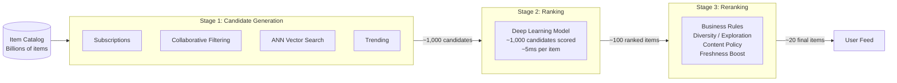
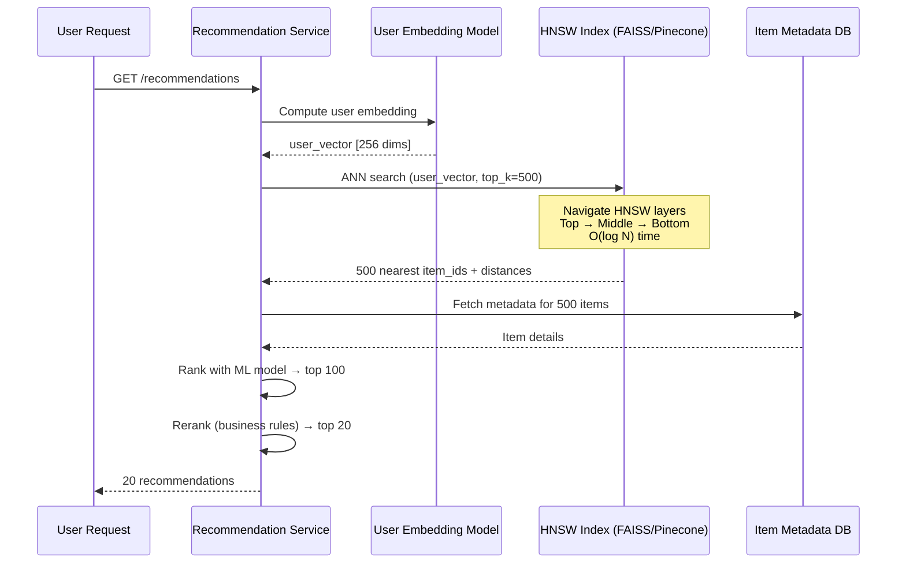

# Recommendation Engines

## 1. Overview

A recommendation engine is a "needle in a haystack" problem: given billions of candidate items, surface the 10-50 most relevant to a specific user in under 200ms. You cannot run a sophisticated ML model against every item in the catalog -- scoring billions of items at several milliseconds each would take weeks for a single user's feed. The solution is a multi-stage pipeline that progressively narrows the candidate set: cheap heuristics first, expensive models last.

Modern recommendation systems power the core revenue loop of every major platform. YouTube's recommendation engine drives 70% of total watch time. Netflix estimates its recommendation system saves $1 billion per year in reduced churn. Amazon attributes 35% of revenue to its "customers who bought this also bought" recommendations.

## 2. Why It Matters

Without recommendations, users face an overwhelming catalog with no guidance. The "paradox of choice" means more content leads to less engagement unless the system actively curates. Recommendations are not a nice-to-have feature -- they are the product itself for platforms like TikTok, YouTube, Spotify, and Netflix.

From a system design perspective, recommendation engines sit at the intersection of multiple hard problems:
- **Scale**: Scoring billions of items per request is computationally infeasible without a staged pipeline
- **Latency**: The full recommendation loop (candidate generation through reranking) must complete in <200ms for interactive use cases
- **Freshness**: New content must surface quickly (the "cold start" problem)
- **Diversity**: Pure relevance optimization leads to filter bubbles; the system must balance exploitation (showing what the user likes) with exploration (discovering new preferences)

## 3. Core Concepts

- **Candidate Generation**: The first stage. Uses cheap, broad heuristics to narrow billions of items to ~1,000 candidates. Think of it as casting a wide net.
- **Ranking**: The second stage. A computationally expensive ML model scores each of the ~1,000 candidates on predicted engagement (click probability, watch time, purchase likelihood). This is the "black box" where the ML investment lives.
- **Reranking**: The final stage. Applies business rules, diversity constraints, and exploration logic without re-running the ML model. Removes blocked creators, enforces content policies, injects exploratory items.
- **Embeddings**: Dense vector representations of items and users in a shared high-dimensional space (typically 64-512 dimensions). Items that are semantically similar (e.g., "cat videos" and "dog videos") cluster together in embedding space.
- **Vector Search / Approximate Nearest Neighbor (ANN)**: Given a user's embedding vector, find the K closest item vectors in the catalog. Exact nearest neighbor search is O(N) and infeasible for billions of items. ANN algorithms trade a small amount of accuracy for orders-of-magnitude speedup.
- **HNSW (Hierarchical Navigable Small Worlds)**: The dominant ANN algorithm. Builds a multi-layer graph where upper layers contain long-range connections (for fast navigation) and lower layers contain short-range connections (for precision). Search starts at the top layer and descends, achieving O(log N) query time.
- **Collaborative Filtering**: Recommends items based on the behavior of similar users. "Users who watched X also watched Y." Does not require understanding item content.
- **Content-Based Filtering**: Recommends items similar to what the user has consumed, based on item features (genre, tags, metadata).
- **Exploration vs. Exploitation**: Exploitation serves items the model is confident the user will like. Exploration injects items with uncertain predicted engagement to discover new user preferences and prevent filter bubbles.

## 4. How It Works

### The Three-Stage Pipeline

**Stage 1: Candidate Generation (~billions to ~1,000)**

Multiple candidate sources run in parallel and their results are merged:
- **Subscriptions/Follows**: Recent content from channels or accounts the user follows
- **Collaborative Filtering**: Items popular among users with similar consumption patterns
- **Content-Based**: Items similar (by embedding distance) to the user's recent history
- **Trending/Popular**: Top items globally or within the user's region
- **Personalized Retrieval**: ANN search using the user's embedding vector against the item embedding index

The simplest heuristic is "Radio" -- just play the top N popular items on a loop. Each source contributes a subset, and duplicates are removed. The goal is recall (do not miss good candidates), not precision.

**Stage 2: Ranking (~1,000 to ~100)**

A deep learning model (often a neural network with hundreds of features) scores each candidate. Features include:
- User features: demographics, watch history, engagement patterns, device type
- Item features: content embedding, age, creator reputation, metadata
- Context features: time of day, day of week, user's recent session behavior
- Interaction features: cross-features between user and item (has user watched similar items?)

The model predicts a score (e.g., probability of watching >50% of a video). This scoring takes several milliseconds per item -- manageable for 1,000 candidates, but infeasible for 1 billion. This is why candidate generation must aggressively filter first.

**Stage 3: Reranking (~100 to final list)**

Business logic and policy filters run on the ranked list:
- Remove content from blocked or muted creators
- Enforce content diversity (no more than 3 items from the same creator)
- Apply exploration: inject a fraction (e.g., 10%) of random or low-confidence items
- Enforce privacy rules (region-specific content restrictions)
- Apply freshness boosts for new content (cold start mitigation)

Reranking is computationally cheap (rule-based, no ML inference) and must not re-run the ranking model.

### Cold Start Problem

New items and new users have no interaction history, making them invisible to collaborative filtering:

- **New item cold start**: A newly uploaded video has zero watches. Collaborative filtering will never recommend it. Solutions: (1) use content-based features (title, description, thumbnail embeddings) to place the item in embedding space, (2) inject new items into the reranking stage with a "freshness boost," (3) use TikTok-style cohort testing where new content is shown to small random groups to generate initial engagement signals.
- **New user cold start**: A new user has no watch history. Solutions: (1) use demographic features (age, location, device type) to match similar users, (2) use an onboarding flow where the user selects interests, (3) default to popularity-based recommendations and transition to personalized as data accumulates.

### Feature Stores and Real-Time Inference

The ranking model requires hundreds of features computed from multiple data sources. A feature store (e.g., Feast, Tecton) bridges the gap between offline training and online serving:

1. **Offline features**: User's historical engagement rate, average session length, genre preferences. Computed via batch jobs (Spark) and written to the feature store.
2. **Near-real-time features**: Number of videos watched in the last hour, most recent search query. Computed via stream processing (Flink/Kafka Streams) and updated in the feature store.
3. **Real-time features**: Time of day, device type, current session length. Computed at request time.

At inference time, the ranking model retrieves all features from the feature store, computes the score, and returns ranked candidates. The feature store must serve at P99 < 5ms to keep the total recommendation latency under 200ms.

### Vector Search and HNSW

Items are converted to embedding vectors during an offline batch process:
1. A neural network encodes each item into a fixed-dimension vector (e.g., 256 dimensions).
2. Vectors are indexed in an ANN data structure (HNSW graph, IVF index, or product quantization).
3. At query time, the user's embedding vector is computed and the ANN index returns the top-K nearest items.

**HNSW specifics**:
- Builds a multi-layer navigable small world graph.
- Each layer is a random subset of the layer below. The top layer contains very few nodes with long-range connections.
- Search starts at the top layer, greedily navigating to the nearest node, then descends to the next layer and repeats.
- Achieves >95% recall at 10-100x speedup over exact search.
- Trade-off parameters: `M` (number of connections per node) controls memory and build time; `ef` (search beam width) controls query accuracy vs. speed.

## 5. Architecture / Flow

### Three-Stage Recommendation Pipeline

### Vector Search with HNSW

## 6. Types / Variants

### Recommendation Approaches

| Approach | Mechanism | Strengths | Weaknesses |
|----------|-----------|-----------|------------|
| Collaborative Filtering | "Users like you watched X" | No need to understand content; captures latent preferences | Cold start (new users/items have no history); popularity bias |
| Content-Based | "Similar to what you watched" | Works for new items with features; transparent reasoning | Limited serendipity; feature engineering required |
| Hybrid | Combines collaborative + content-based | Best of both; mitigates cold start | More complex; requires multiple data pipelines |
| Knowledge Graph | Exploits explicit relationships (genre, director, cast) | Explainable; handles sparse data | Graph construction and maintenance overhead |
| Deep Learning (Neural CF) | Embeddings learned end-to-end from interaction data | Captures complex non-linear patterns | Requires massive training data; expensive inference |

### Vector Search Implementations

| System | Type | Best For | Notes |
|--------|------|----------|-------|
| FAISS (Facebook) | Library (in-process) | High-throughput, research | GPU-accelerated; requires self-managed infrastructure |
| Pinecone | Managed service | Production, fast time-to-market | Fully managed; pay per query; limited customization |
| Milvus | Open-source database | Self-hosted production | Distributed; supports multiple index types |
| Weaviate | Open-source database | Multimodal search | Built-in vectorization; GraphQL API |
| Elasticsearch (kNN) | Plugin / native | Teams already on Elastic | Not purpose-built; adequate for moderate scale |
| Redis (VSS) | Module | Low-latency, cache-adjacent | Good for small-medium vector sets |

### ANN Algorithm Comparison

| Algorithm | Query Time | Build Time | Memory | Recall@100 |
|-----------|-----------|-----------|--------|------------|
| HNSW | O(log N) | O(N log N) | High (graph structure) | 95-99% |
| IVF (Inverted File Index) | O(sqrt(N)) | O(N) | Medium (cluster centroids) | 90-95% |
| Product Quantization (PQ) | O(N) compressed | O(N) | Very low (compressed vectors) | 85-92% |
| LSH (Locality-Sensitive Hashing) | O(1) amortized | O(N) | High (many hash tables) | 80-90% |

## 7. Use Cases

- **YouTube**: The canonical three-stage pipeline. Candidate generation narrows hundreds of millions of videos to ~1,000 using subscription activity, collaborative filtering, and search history. A deep neural network ranks candidates by predicted watch time. Reranking enforces diversity and injects exploration. YouTube's recommendation engine drives ~70% of total watch time.
- **Netflix**: Uses a similar pipeline but optimizes for long-term engagement (series completion) rather than individual clicks. The homepage is a grid of "rows," each produced by a different candidate generator. The ranking model determines row order and item order within each row.
- **TikTok**: Extremely aggressive exploration in the "For You" feed. New content is shown to small cohorts of users; engagement signals (watch time, replays, shares) determine whether the content is promoted to larger cohorts. This enables rapid viral distribution and solves cold start for new creators.
- **Amazon**: "Customers who bought this also bought" is collaborative filtering. "Frequently bought together" uses association rules. The ranking model optimizes for purchase probability and basket value.
- **Spotify (Discover Weekly)**: Collaborative filtering identifies users with similar listening patterns. Content-based filtering using audio embeddings (extracted from raw audio via deep learning) finds songs that sound similar to the user's preferences. The result is a personalized 30-song playlist refreshed weekly.

## 8. Tradeoffs

| Factor | Cheap Heuristics (Stage 1) | ML Ranking (Stage 2) | Business Rules (Stage 3) |
|--------|---------------------------|---------------------|-------------------------|
| Latency per item | ~0.01ms | ~5ms | ~0.001ms |
| Accuracy | Low (broad recall) | High (precise relevance) | N/A (policy enforcement) |
| Complexity | Low | Very high (training pipelines, feature stores) | Low |
| Items processed | Billions → ~1,000 | ~1,000 → ~100 | ~100 → ~20 |

### Exploration vs. Exploitation

| Strategy | User Satisfaction (Short-term) | Discovery (Long-term) | Risk |
|----------|-------------------------------|----------------------|------|
| Pure Exploitation | High (shows known preferences) | Zero (filter bubble) | User boredom, attrition |
| Pure Exploration | Low (random, irrelevant items) | High | User frustration |
| Epsilon-Greedy (10% exploration) | Slightly reduced | Good | Simple to implement |
| Thompson Sampling | Near-optimal | Near-optimal | Complex to implement |

### Embedding Dimension Tradeoffs

| Dimensions | Memory per Vector | Search Speed | Representation Quality |
|------------|------------------|--------------|----------------------|
| 64 | 256 bytes | Fast | Lower (may lose nuance) |
| 256 | 1 KB | Medium | Good (standard choice) |
| 512 | 2 KB | Slower | High (diminishing returns) |
| 1024 | 4 KB | Slow | Marginal improvement |

## 9. Common Pitfalls

- **Running the ranking model on the full catalog**: This is the single most expensive mistake. A model that takes 5ms per item applied to 1 billion items would take ~58 days per request. The three-stage pipeline exists to avoid this.
- **Ignoring the cold start problem**: New items have no engagement history and will never be recommended by collaborative filtering alone. Solve with content-based features, creator boosting rules in the reranking stage, or TikTok-style cohort testing.
- **Optimizing only for clicks**: Click-through rate (CTR) optimization leads to clickbait. Optimize for downstream engagement metrics (watch time, completion rate, return visits) to capture actual user satisfaction.
- **Not refreshing the embedding index**: If the ANN index is rebuilt daily but content is published every minute, the freshest content is invisible to vector search for up to 24 hours. Use incremental index updates or supplement vector search with a recency-based candidate source.
- **Treating recommendations as a pure ML problem**: The reranking stage (business rules, diversity, exploration) is as important as the ML model. Without it, the system shows repetitive content, violates content policies, and fails to surface new creators.
- **Embedding dimension overkill**: Higher dimensions capture more nuance but increase memory, index build time, and query latency. For most applications, 128-256 dimensions are the sweet spot. Going to 1024 rarely improves recall enough to justify the cost.

## 10. Real-World Examples

- **YouTube (Three-Stage Pipeline)**: YouTube's 2016 paper "Deep Neural Networks for YouTube Recommendations" describes the production pipeline. Candidate generation uses a neural network trained on user watch history to produce ~1,000 candidates. The ranking model scores candidates using hundreds of features including "time since upload" (freshness) and "number of previous user impressions" (fatigue). The system serves hundreds of millions of users with P99 latency under 200ms.
- **Netflix (Row-Based Recommendations)**: Each row on the Netflix homepage is a separate recommendation algorithm. "Because you watched [Show]" is content-based. "Trending Now" is popularity-based. "Top Picks for You" is the personalized ranking model. Row ordering itself is a recommendation problem, solved by a meta-ranker.
- **TikTok (Cohort-Based Exploration)**: New videos are shown to a small random cohort (~300 users). If the video achieves above-threshold engagement (completion rate, shares), it is promoted to increasingly larger cohorts. This mechanism can take a video from 0 views to 10 million views within hours without any follower base.
- **Spotify (Audio Embeddings)**: Spotify's "Discover Weekly" uses a combination of collaborative filtering (from listening patterns) and content-based filtering using audio embeddings extracted by a convolutional neural network from raw audio. This allows Spotify to recommend songs that sound similar to the user's taste, even if the song has never been listened to by similar users.
- **Pinterest (Visual Embeddings)**: Pins are embedded using a deep visual model. "More like this" recommendations use ANN search on visual embeddings, finding images that are visually similar regardless of metadata or tags.

### Online Learning and Model Updates

Recommendation models must stay fresh. User preferences shift, new content is published every minute, and engagement patterns change with seasons and trends.

**Offline training**: The full model is retrained on the complete interaction dataset (days to weeks of data) via batch processing (Spark/TensorFlow). This happens daily or weekly and produces a new model artifact that is deployed to production.

**Online learning**: The model is incrementally updated with each new interaction. When a user watches a video, the model's weights are slightly adjusted. This allows the model to adapt to trends within minutes rather than waiting for the next full training cycle. However, online learning is more complex to implement and can be unstable if not carefully regularized.

**A/B testing**: New models are deployed to a small percentage of users (1-5%) and their engagement metrics (watch time, return rate, session length) are compared against the current production model. Only models that show statistically significant improvement are rolled out to 100% of traffic. This is the standard deployment process at Netflix, YouTube, and Spotify.

### System Design Interview Strategy

When asked to design a recommendation engine in a system design interview, focus on these key points:

1. **Start with the three-stage pipeline** -- this immediately signals architectural maturity. Explain why you cannot run the ranking model against billions of items.
2. **Define candidate sources** -- enumerate 3-4 sources (subscriptions, collaborative filtering, trending, ANN search). Show that you understand multiple signals contribute to the candidate pool.
3. **Acknowledge the ranking model as a black box** -- you are not expected to design the ML model. Focus on the system that serves it: feature stores, model serving infrastructure, latency budget.
4. **Highlight reranking as the control layer** -- this is where business rules live. Diversity, exploration, content policy, and freshness are all reranking concerns.
5. **Discuss the feedback loop** -- user interactions feed back into the training pipeline via event streaming (Kafka). The model improves over time as it observes which recommendations lead to engagement.

## 11. Related Concepts

- [Search and Indexing](search-and-indexing.md) -- inverted indexes for text-based retrieval; often a candidate source in Stage 1
- [Message Queues](../messaging/message-queues.md) -- Kafka streams user interaction events to the feature store and model training pipeline
- [Probabilistic Data Structures](probabilistic-data-structures.md) -- Bloom filters for deduplication of already-shown recommendations
- [Caching](../caching/caching.md) -- pre-computed recommendation lists are cached per user to reduce P99 latency
- [Fan-Out](fan-out.md) -- subscription-based candidate generation is a form of fan-out

### Metrics for Recommendation Quality

| Metric | What It Measures | Used By |
|--------|-----------------|---------|
| Click-Through Rate (CTR) | Fraction of impressions that result in clicks | All platforms |
| Watch Time / Dwell Time | Total time spent on recommended content | YouTube, TikTok, Netflix |
| Completion Rate | Fraction of recommended items consumed to completion | Netflix (episode completion), Spotify (song completion) |
| Diversity Score | Variety of genres/topics in recommended list | All platforms (anti-filter-bubble) |
| Serendipity | Fraction of recommendations the user would not have found on their own | Spotify Discover Weekly |
| Return Rate | User returning to the platform within 24 hours | All platforms (long-term engagement) |
| Novelty | Fraction of recommendations the user has not seen before | All platforms |
| Coverage | Fraction of the catalog that appears in any user's recommendations | Content platforms (long-tail discovery) |

CTR alone is a dangerous optimization target -- it leads to clickbait. Netflix optimizes for completion rate (did the user finish the movie?). YouTube optimizes for session watch time (did the user stay on the platform?). Spotify optimizes for save rate (did the user add the song to a playlist?). The choice of primary metric shapes the entire recommendation system's behavior.

## 12. Source Traceability

| Concept | Source |
|---------|--------|
| Three-stage pipeline (candidate generation, ranking, reranking) | YouTube Report 4 (Section 4) |
| "Radio" as simplest heuristic; 2-week scoring infeasibility | YouTube Report 4 (Section 4) |
| Vector search, embeddings, HNSW, Pinecone, FAISS | YouTube Report 4 (Section 4) |
| Exploration vs. exploitation in reranking | YouTube Report 4 (Section 4) |
| Collaborative filtering, content-based filtering | Concept Index (patterns/recommendation-engines.md entry) |
| Graph databases for recommendation engines | YouTube Report 7 (Section 1) |
| Alex Xu Vol 2: Real-time leaderboard (Redis sorted sets for ranking) | Alex Xu Vol 2 (ch11) |
