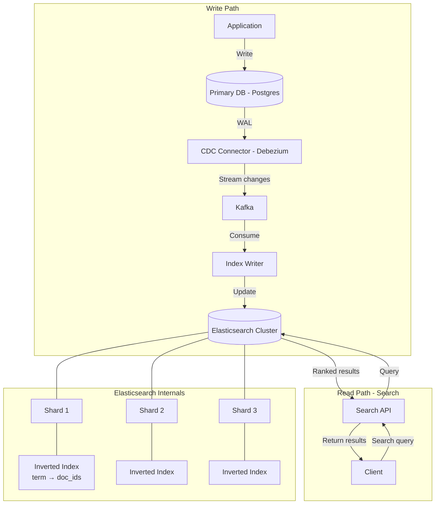
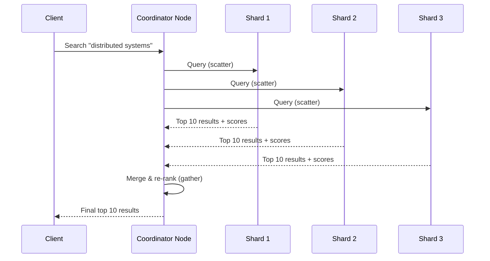

# Search and Indexing

## 1. Overview

Full-text search is the problem of finding documents that contain specific words or phrases across a corpus of millions or billions of records. Standard database indexes (B-trees) are designed for exact matches and range queries on structured data -- they fail catastrophically for text search because wildcard queries like `WHERE text LIKE '%distributed%'` require a full table scan, which is O(N) on the dataset.

The inverted index solves this by flipping the relationship: instead of mapping documents to words (forward index), it maps words to the documents that contain them. Looking up which documents contain "distributed" becomes a single O(1) hash lookup instead of scanning every document. This is the foundational data structure behind Elasticsearch, Apache Solr, and every search engine.

Elasticsearch has become the de facto standard for full-text search in production systems, used at scale by Wikipedia, GitHub, Stack Overflow, Netflix, and Uber. It wraps the Apache Lucene library with a distributed, REST-accessible, horizontally scalable architecture.

## 2. Why It Matters

Search is a core feature of nearly every application. Users expect to type a few words and get relevant results in under 100ms. The business impact is direct:

- **E-commerce**: Amazon's search directly drives purchasing. A 100ms increase in search latency reduces sales.
- **Social media**: Facebook's post search handles 3.6 petabytes of historical data. Without an inverted index, searching a decade of posts is physically impossible.
- **Developer tools**: GitHub's code search indexes 200+ million repositories. Searching across this corpus requires specialized indexing.
- **Observability**: The ELK stack (Elasticsearch, Logstash, Kibana) is the industry standard for centralized log search across microservice fleets.

Beyond text search, the inverted index pattern applies to any scenario where you need to find items matching a set of attributes: tag-based filtering, faceted search, autocomplete, and even ad targeting.

## 3. Core Concepts

- **Inverted Index**: A mapping from terms (words) to the list of documents containing them. The "inverted" part refers to inverting the document-to-words relationship into a words-to-documents relationship.
- **Tokenization**: The process of breaking text into individual terms (tokens). "The quick brown fox" becomes `["the", "quick", "brown", "fox"]`. Tokenizers handle punctuation, casing, and language-specific rules.
- **Analyzers**: A chain of character filters, tokenizer, and token filters applied to text during indexing and querying. Components include lowercasing, stemming (running -> run), stop word removal (the, is, at), and synonym expansion.
- **TF-IDF (Term Frequency - Inverse Document Frequency)**: A relevance scoring formula. TF measures how often a term appears in a document (more = more relevant). IDF measures how rare the term is across all documents (rarer = more important). The product TF * IDF gives a balanced relevance score.
- **BM25**: The modern replacement for TF-IDF, used by Elasticsearch and Lucene. Adds term frequency saturation (diminishing returns for repeated terms) and document length normalization. The standard ranking function for text search.
- **Posting List**: The list of document IDs associated with a term in the inverted index. For high-frequency terms ("the"), the posting list can contain millions of entries.
- **Sharding**: Distributing the index across multiple nodes. Elasticsearch shards indexes by default, allowing horizontal scaling of both storage and query throughput.
- **CDC (Change Data Capture)**: Streaming database mutations to the search index without polluting application logic. Instead of the application explicitly writing to both the database and Elasticsearch, CDC captures changes from the database's write-ahead log and streams them to the search index.

## 4. How It Works

### Building an Inverted Index

Given three documents:
- Doc 1: "distributed systems are complex"
- Doc 2: "system design for distributed databases"
- Doc 3: "complex database design patterns"

**Step 1: Tokenize and Analyze**

Apply lowercase, remove stop words ("are", "for"), and stem:
- Doc 1: `[distribut, system, complex]`
- Doc 2: `[system, design, distribut, databas]`
- Doc 3: `[complex, databas, design, pattern]`

**Step 2: Build the Inverted Index**

| Term | Posting List (doc_ids) | Term Frequency per Doc |
|------|----------------------|----------------------|
| distribut | [1, 2] | {1: 1, 2: 1} |
| system | [1, 2] | {1: 1, 2: 1} |
| complex | [1, 3] | {1: 1, 3: 1} |
| design | [2, 3] | {2: 1, 3: 1} |
| databas | [2, 3] | {2: 1, 3: 1} |
| pattern | [3] | {3: 1} |

**Step 3: Query**

Search for "distributed design":
1. Look up "distribut" -> [1, 2]
2. Look up "design" -> [2, 3]
3. Compute relevance scores using BM25
4. Doc 2 matches both terms -> highest score
5. Doc 1 and Doc 3 match one term each -> lower scores
6. Return: [Doc 2, Doc 1, Doc 3] (ranked by relevance)

### TF-IDF Scoring

For term `t` in document `d`:

```
TF(t, d) = (count of t in d) / (total terms in d)
IDF(t) = log(N / df(t))
    where N = total documents, df(t) = documents containing t
Score(t, d) = TF(t, d) * IDF(t)
```

Example: If "distributed" appears in 2 out of 1,000,000 documents, its IDF is very high (rare = important). If "the" appears in 999,000 documents, its IDF is near zero (common = unimportant).

### Elasticsearch Internals: Segments and Near-Real-Time Search

Elasticsearch does not make documents searchable immediately upon indexing. The write path works as follows:

1. A document is written to an in-memory buffer and the transaction log (translog).
2. Periodically (default: every 1 second), the buffer is "refreshed" -- written to a new Lucene segment on the filesystem cache. This segment is now searchable.
3. Periodically (default: every 30 minutes or when the translog exceeds 512 MB), a "flush" occurs -- the filesystem cache is synced to disk (fsync) and the translog is cleared.
4. Over time, many small segments accumulate. A background merge process combines segments into larger ones, removing deleted documents and improving search performance.

This architecture means Elasticsearch provides "near-real-time" search with a ~1 second delay between indexing and searchability. For write-heavy workloads (e.g., log ingestion), increasing the refresh interval to 30 seconds significantly improves indexing throughput.

### Autocomplete / Typeahead

Autocomplete is a specialized search pattern where the system suggests completions as the user types. Two common implementations:

1. **Edge N-gram Index**: During indexing, each term is broken into prefixes. "distributed" becomes ["d", "di", "dis", "dist", "distr", ...]. A standard inverted index maps each prefix to matching documents. At query time, the user's partial input is matched against these prefixes.
2. **Trie (Prefix Tree)**: An in-memory tree where each node represents a character. Traversal from the root spells out prefixes. Leaf nodes or annotated internal nodes point to complete terms with frequency counts. The trie enables O(L) prefix lookup where L is the length of the input.

The choice depends on scale: tries work well for small-medium dictionaries (millions of terms) while edge n-gram indexes scale to billions of terms via Elasticsearch sharding.

### CDC-Based Search Index Synchronization

Rather than having the application write to both the primary database and Elasticsearch (which introduces dual-write consistency issues), the recommended approach is CDC:

1. Application writes to the primary database (Postgres/MySQL) as normal.
2. A CDC connector (Debezium, DynamoDB Streams, Kafka Connect) captures changes from the database's WAL (Write-Ahead Log).
3. Changes are streamed to a message queue (Kafka).
4. A consumer reads from Kafka and applies the changes to the Elasticsearch index.
5. The search index is eventually consistent with the primary database, with a lag of typically 1-5 seconds.

This approach ensures the database remains the single source of truth and eliminates the risk of the database and search index diverging due to partial failures.

## 5. Architecture / Flow

### Full-Text Search with Elasticsearch



### Search Query Execution in Elasticsearch



## 6. Types / Variants

### Search Technologies

| Technology | Architecture | Best For | Scaling Model |
|-----------|-------------|----------|--------------|
| Elasticsearch | Distributed, REST API, Lucene-based | Full-text search, log analytics, observability | Horizontal (sharding + replicas) |
| Apache Solr | Distributed, Lucene-based | Enterprise search, faceted search | Horizontal (SolrCloud) |
| Algolia | Managed SaaS | Instant search, autocomplete | Managed (API-based) |
| Typesense | Open source, in-memory | Typo-tolerant search, small-medium datasets | Vertical + replicas |
| Meilisearch | Open source, Rust | Typo-tolerant instant search | Single-node (growing) |
| PostgreSQL FTS | Built-in `tsvector`/`tsquery` | Simple search on structured data | Vertical (within Postgres) |

### Index Types for Different Query Patterns

| Query Pattern | Index Type | Canonical File |
|---------------|-----------|----------------|
| Exact match / Range queries | B-Tree | [Database Indexing](../storage/database-indexing.md) |
| Full-text search | Inverted Index | This file |
| Geospatial (proximity) | Geohash / Quadtree / R-Tree | [Geospatial Indexing](geospatial-indexing.md) |
| Vector similarity | HNSW / IVF | [Recommendation Engines](recommendation-engines.md) |
| Set membership | Bloom Filter | [Probabilistic Data Structures](probabilistic-data-structures.md) |

### Relevance Scoring Algorithms

| Algorithm | Era | Key Improvement |
|-----------|-----|-----------------|
| Boolean | 1960s | Binary match (yes/no), no ranking |
| TF-IDF | 1970s | Frequency-based relevance; penalizes common terms |
| BM25 | 1990s | TF saturation + document length normalization; current standard |
| Learning to Rank (LTR) | 2010s+ | ML model trained on click-through data; uses hundreds of features |

## 7. Use Cases

- **Facebook Post Search**: With 3.6 petabytes of post data accumulated over a decade, Facebook uses a sharded inverted index to search posts by keyword. Count-Min Sketch identifies "hot" search terms for in-memory indexing; cold terms are evicted to S3. The storage requirement (3.6PB) immediately rules out any relational database approach.
- **GitHub Code Search**: Indexes 200+ million repositories. Uses a custom search engine (not Elasticsearch) optimized for code-specific tokenization (respecting camelCase, snake_case, imports, function signatures).
- **ELK Stack (Observability)**: Elasticsearch, Logstash, and Kibana form the standard observability stack. Logstash ingests and transforms log data from across the microservice fleet. Elasticsearch indexes the logs. Kibana provides dashboards and ad-hoc search for debugging and post-mortem analysis.
- **E-commerce (Amazon, Shopify)**: Product search uses inverted indexes with faceted filtering (brand, price range, category). Autocomplete uses prefix search on a trie or edge n-gram index.
- **Wikipedia**: Uses Elasticsearch via the CirrusSearch extension to power search across 60+ million articles in 300+ languages. Supports fuzzy matching, phrase search, and multilingual stemming.

## 8. Tradeoffs

| Factor | Inverted Index (Elasticsearch) | Database LIKE Query | Database Full-Text (Postgres FTS) |
|--------|-------------------------------|--------------------|---------------------------------|
| Query speed | O(1) term lookup + merge | O(N) full table scan | O(1) with GIN index |
| Relevance ranking | BM25, Learning to Rank | None (boolean match) | Basic ranking |
| Scalability | Horizontal (sharding) | Vertical only | Vertical only |
| Real-time indexing | Near real-time (~1 second) | Immediate (same transaction) | Immediate (same transaction) |
| Consistency with DB | Eventually consistent (via CDC) | Always consistent | Always consistent |
| Operational overhead | High (separate cluster to manage) | None | Low (built-in) |
| Feature richness | Fuzzy, faceted, aggregations, geo | Minimal | Moderate |

### Elasticsearch Cluster Sizing

| Metric | Guideline |
|--------|-----------|
| Shard size | 10-50 GB per shard (optimal for search performance) |
| Shards per node | ~20 shards per GB of heap memory |
| Replica count | 1 replica minimum for high availability |
| Index refresh interval | 1 second (default); increase for write-heavy workloads |
| RAM to disk ratio | JVM heap should be ~50% of available RAM, max 32 GB |

## 9. Common Pitfalls

- **Using database LIKE queries for search**: `WHERE text LIKE '%keyword%'` forces a full table scan on every query. This is viable for 10,000 rows but catastrophic at 100 million. Use an inverted index.
- **Dual-writing to database and search index**: Writing to both Postgres and Elasticsearch from the application creates consistency issues when one write succeeds and the other fails. Use CDC to stream changes from the database's WAL to the search index.
- **Not tuning analyzers**: Using the default analyzer for all fields leads to poor relevance. A product name field needs different tokenization (edge n-grams for autocomplete) than a description field (full-text with stemming).
- **Over-sharding**: Creating too many shards increases coordination overhead and reduces per-shard query performance. A 10 GB index does not need 100 shards. Start with the number of data nodes and scale shards as the index grows.
- **Ignoring the indexing lag**: CDC-based synchronization introduces 1-5 seconds of lag. If a user creates a post and immediately searches for it, they may not find it. Mitigate with read-your-own-writes patterns (check the primary database for the user's own recent content).
- **Treating Elasticsearch as a primary database**: Elasticsearch is optimized for search, not transactional integrity. It does not support ACID transactions, foreign keys, or true deletes (deleted documents are marked as deleted and cleaned up during segment merges). Always maintain a primary database as the source of truth.
- **Not implementing search relevance feedback**: Default BM25 is a reasonable starting point but will not match user expectations for long. Invest in Learning to Rank models trained on click-through data to improve relevance over time.

## 10. Real-World Examples

- **Facebook Post Search (Inverted Index at 3.6 PB)**: Facebook indexes a decade of posts using a sharded inverted index. Back-of-envelope: 1 billion posts/day * 365 days * 10 years = 3.6 trillion posts at ~1 KB each = 3.6 PB. Count-Min Sketch identifies trending terms for hot caching; cold terms are served from S3-backed storage.
- **Netflix (Elasticsearch for Content Discovery)**: Netflix uses Elasticsearch to power content search, including fuzzy matching (handling typos in title searches), multilingual support, and faceted filtering by genre, language, and release year.
- **Uber (Elasticsearch for ETA and Location Search)**: Uber uses Elasticsearch for searching places and addresses. The index is kept in sync with the mapping database via CDC, and Elasticsearch's geo capabilities are used alongside custom geospatial indexing.
- **ELK Stack at Scale**: Companies like LinkedIn and Uber run Elasticsearch clusters with hundreds of nodes processing terabytes of log data daily. Logstash parses and enriches log entries, Elasticsearch indexes them with time-based indices (one index per day), and Kibana provides real-time dashboards for monitoring.
- **Stack Overflow**: Uses Elasticsearch for question and answer search. Custom analyzers handle code blocks (preserved as-is), natural language text (stemmed and tokenized), and tags (exact match).

### Distributed Query Execution (Scatter-Gather)

In a sharded Elasticsearch cluster, a search query is executed using the scatter-gather pattern:

1. **Scatter**: The coordinator node sends the query to all shards (primary or replica) that could contain matching documents.
2. **Local execution**: Each shard runs the query against its local inverted index, scoring documents using BM25, and returns the top N results with their scores.
3. **Gather**: The coordinator merges the results from all shards, re-ranks by score, and returns the global top N.

This means a query against an index with 10 shards executes 10 local searches in parallel. The coordinator waits for all shards to respond before returning results. If one shard is slow (due to garbage collection, disk contention), the entire query's latency is gated by that slowest shard -- this is the "tail latency" problem for search.

Mitigation strategies:
- **Replica racing**: Send the query to both the primary and replica of each shard, returning whichever responds first.
- **Adaptive timeout**: If a shard does not respond within a timeout (e.g., 100ms), return results from the other shards and note partial results in the response.

### Search Relevance Engineering

Beyond BM25, production search systems invest heavily in relevance engineering:

1. **Learning to Rank (LTR)**: Train an ML model (typically gradient-boosted trees or a lightweight neural network) on historical click-through data. Features include BM25 score, document popularity, freshness, user personalization signals, and field-specific match scores. The model produces a relevance score that replaces or supplements BM25.

2. **Query understanding**: Before searching, analyze the query intent. "Java" could mean the programming language, the island, or the coffee. Use click history, context, and NLP to disambiguate.

3. **Synonyms and expansion**: "NYC" should match documents containing "New York City." A synonym dictionary (managed manually or learned from co-click patterns) expands the query at search time.

4. **Field boosting**: A match in the title field is more important than a match in the body. Elasticsearch allows per-field boost weights in the query (e.g., `title^3` gives title matches 3x the weight of body matches).

5. **Decay functions**: For time-sensitive content (news, social posts), apply a decay function that reduces the score of older documents. A post from 1 hour ago should rank higher than an equally relevant post from 1 year ago.

### Index Lifecycle Management

Elasticsearch indexes grow over time. Production clusters use index lifecycle management (ILM) to manage cost:

| Phase | Duration | Storage Tier | Replica Count | Actions |
|-------|----------|-------------|---------------|---------|
| Hot | 0-7 days | SSD | 1 | Full indexing + searching |
| Warm | 7-30 days | HDD | 1 | Read-only; force-merge segments |
| Cold | 30-90 days | Frozen tier / S3 | 0 | Searchable but slow; compressed |
| Delete | >90 days | N/A | N/A | Index deleted |

This tiered approach reduces storage costs by 60-80% while keeping recent data fast.

## 11. Related Concepts

- [Database Indexing](../storage/database-indexing.md) -- B-tree and LSM tree indexes for structured queries; complementary to inverted indexes
- [Database Replication](../storage/database-replication.md) -- WAL and CDC as the synchronization mechanism to search indexes
- [Probabilistic Data Structures](probabilistic-data-structures.md) -- Bloom filters in Lucene segment files; Count-Min Sketch for hot term detection
- [Geospatial Indexing](geospatial-indexing.md) -- Elasticsearch supports both inverted indexes and geospatial indexes
- [Logging](../observability/logging.md) -- ELK stack is the primary consumer of Elasticsearch for observability

## 12. Source Traceability

| Concept | Source |
|---------|--------|
| Inverted index, full-text search, Elasticsearch | YouTube Report 2 (Section 3: Full-Text Search and CDC) |
| CDC to search index (avoiding dual-write) | YouTube Report 2 (Section 3), YouTube Report 5 (Section 3.3) |
| Facebook Post Search (3.6 PB, Count-Min Sketch for hot terms) | YouTube Report 5 (Section 4.2) |
| ELK Stack (Elasticsearch, Logstash, Kibana) | YouTube Report 2 (Section 10), YouTube Report 3 (Section 7) |
| B-Tree vs inverted index for different query patterns | YouTube Report 7 (Section 2) |
| Tokenization, TF-IDF, BM25 | YouTube Report 7 (Section 2: Inverted Index) |
| DDIA: Storage engines, indexing strategies, text search | DDIA (ch04: Storage and Retrieval) |
| System Design Guide: Database indexing and search | System Design Guide (ch08) |
