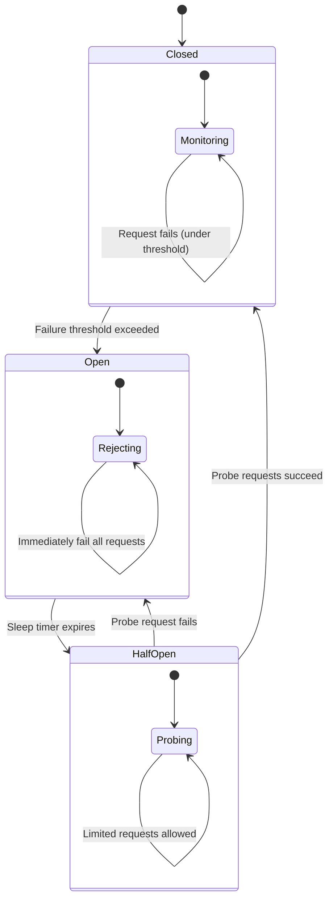
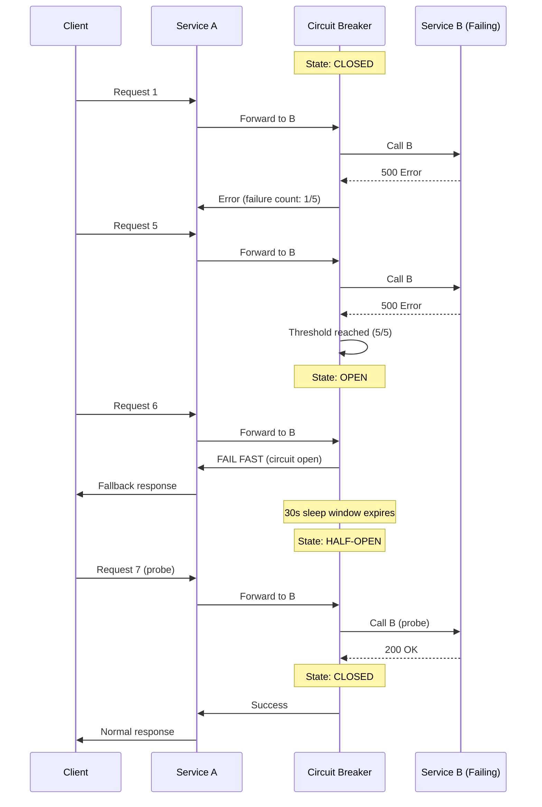

# Circuit Breaker

## 1. Overview

The circuit breaker pattern prevents cascading failures in distributed systems by detecting when a downstream service is failing and short-circuiting requests to it instead of letting failures propagate. It works exactly like an electrical circuit breaker: when the error rate exceeds a threshold, the circuit "opens" and immediately fails all subsequent requests without actually calling the downstream service. This gives the failing service time to recover instead of being hammered by requests it cannot process.

Without circuit breakers, a single slow or failing service can bring down an entire microservices architecture. Service A calls Service B, which is slow. Service A's threads pile up waiting for responses. Service A runs out of threads and starts failing. Service C, which depends on Service A, also starts failing. Within minutes, a localized failure cascades into a system-wide outage. The circuit breaker stops this cascade by failing fast.

## 2. Why It Matters

- **Cascading failure prevention**: A failing downstream service does not consume resources (threads, connections, memory) in upstream services. The upstream service fails immediately with a known error instead of waiting for timeouts.
- **Downstream service protection**: When a service is struggling, sending more requests makes it worse. The circuit breaker gives it breathing room to recover.
- **Graceful degradation**: Instead of returning errors, the application can serve cached data, default values, or a degraded experience while the circuit is open.
- **Fast failure detection**: Users get an immediate error response (milliseconds) instead of waiting for a timeout (seconds). This improves perceived reliability even during outages.
- **Observability**: Circuit breaker state transitions (closed -> open -> half-open) are observable events that trigger alerts and dashboards.

## 3. Core Concepts

- **Closed State**: Normal operation. Requests flow through to the downstream service. The circuit breaker monitors error rates.
- **Open State**: The circuit has tripped. All requests immediately fail without calling the downstream service. A timer starts.
- **Half-Open State**: After the timeout expires, the circuit breaker allows a limited number of "probe" requests through. If they succeed, the circuit closes. If they fail, the circuit reopens.
- **Failure Threshold**: The error rate or count that triggers the circuit to open (e.g., 50% error rate over 10 requests, or 5 consecutive failures).
- **Timeout / Sleep Window**: How long the circuit stays open before transitioning to half-open (e.g., 30 seconds).
- **Probe Requests**: The limited requests allowed in the half-open state to test if the downstream service has recovered.
- **Exponential Backoff**: Increasing the delay between retry attempts exponentially (1s, 2s, 4s, 8s, 16s...).
- **Jitter**: Adding randomness to retry intervals to prevent thundering herd.
- **Bulkhead Pattern**: Isolating resources (thread pools, connection pools) per downstream service so that a failure in one does not exhaust resources needed by others.

## 4. How It Works

### State Machine

The circuit breaker operates as a three-state finite state machine:

**Closed (Normal)**:
1. Every request is forwarded to the downstream service.
2. The circuit breaker tracks success/failure counts in a rolling window.
3. If the failure rate exceeds the threshold (e.g., 50% of the last 20 requests fail), transition to **Open**.

**Open (Circuit Tripped)**:
1. All requests immediately return an error (or a fallback response) without calling the downstream service.
2. A sleep timer starts (e.g., 30 seconds).
3. When the timer expires, transition to **Half-Open**.

**Half-Open (Recovery Probe)**:
1. Allow a small number of requests through (e.g., 1-5 probe requests).
2. If the probe requests succeed, transition to **Closed** (service recovered).
3. If any probe request fails, transition back to **Open** and restart the timer.

### Exponential Backoff with Jitter

When the circuit is open and clients must retry, exponential backoff prevents overwhelming the recovering service:

```
delay = min(base_delay * 2^attempt, max_delay)
delay_with_jitter = delay * random(0.5, 1.5)
```

**Why jitter is critical**: Without jitter, if 1,000 clients are all rate-limited or circuit-broken at the same time, they all retry at exactly `base_delay * 2^attempt`. This creates a "thundering herd" -- a synchronized burst that prevents the service from ever recovering. Jitter spreads the retries across the interval, converting a spike into a smooth flow.

**Full jitter** (recommended by AWS):
```
delay = random(0, min(cap, base * 2^attempt))
```

**Equal jitter**:
```
temp = min(cap, base * 2^attempt)
delay = temp / 2 + random(0, temp / 2)
```

### Thundering Herd Prevention

The thundering herd problem occurs when:
1. A service goes down.
2. Many clients experience failures simultaneously.
3. The circuit breakers on all clients open.
4. All circuit breakers have the same sleep window.
5. All circuit breakers enter half-open at the same time.
6. All clients send probe requests simultaneously, overwhelming the recovering service.

**Mitigations**:
- **Jitter on the sleep window**: Add randomness to the circuit breaker's sleep duration so that half-open transitions are staggered.
- **Exponential backoff with jitter on retries**: Clients do not all retry at the same instant.
- **Load shedding on the recovering service**: The service itself rejects excess requests during recovery.
- **Gradual ramp-up in half-open**: Allow 1 probe, then 2, then 4, instead of immediately allowing full traffic.

### Retry Storm Prevention

A retry storm is a self-reinforcing feedback loop:
1. Service B is slow.
2. Clients of Service B time out and retry.
3. The retries double the load on Service B.
4. Service B becomes slower, causing more timeouts and more retries.
5. The load grows exponentially until Service B collapses.

**Mitigations**:
- **Circuit breaker**: Stop sending requests entirely when the error rate is high.
- **Retry budget**: Limit retries to a percentage of total requests (e.g., 10% of requests can be retries). If the retry budget is exhausted, new retries are dropped.
- **Exponential backoff with jitter**: Space out retries so they do not synchronize.
- **Deadline propagation**: If the original request has already timed out at the client, do not retry -- the response is no longer needed.

## 5. Architecture / Flow

### Circuit Breaker State Machine



### Circuit Breaker in a Microservices Call Chain



## 6. Types / Variants

### Circuit Breaker Implementations

| Library / Tool | Language | Key Features |
|---|---|---|
| **Hystrix** (Netflix, deprecated) | Java | Thread pool isolation, fallbacks, metrics dashboard |
| **Resilience4j** | Java | Lightweight, functional, ring buffer metrics |
| **Polly** | .NET | Fluent API, policy wrapping, bulkhead |
| **Envoy** (proxy-based) | Any (sidecar) | Outlier detection, automatic circuit breaking per upstream |
| **Istio** | Any (service mesh) | Circuit breaking via Envoy sidecars, mesh-wide policy |

### Circuit Breaker vs. Related Patterns

| Pattern | Purpose | Mechanism |
|---|---|---|
| **Circuit Breaker** | Stop calling a failing service | State machine (closed/open/half-open) |
| **Retry** | Handle transient failures | Repeat failed requests with backoff |
| **Bulkhead** | Isolate failure domains | Separate thread pools per dependency |
| **Timeout** | Prevent indefinite waiting | Cancel request after deadline |
| **Rate Limiter** | Prevent overload | Throttle request rate |
| **Fallback** | Degrade gracefully | Return cached/default data on failure |

In practice, these patterns are composed: a request goes through a **rate limiter**, then a **circuit breaker** (which fails fast if open), then a **retry** with **exponential backoff and jitter**, with a **timeout** on each attempt, all within a **bulkhead** thread pool.

## 7. Use Cases

- **Netflix (Hystrix)**: Netflix pioneered the circuit breaker pattern in microservices with Hystrix. Every inter-service call is wrapped in a Hystrix command with configurable failure thresholds, timeouts, and fallbacks. When the recommendation service fails, the UI shows a generic "popular titles" list instead of personalized recommendations.
- **Amazon**: Circuit breakers protect the checkout flow from failures in non-critical services (recommendations, recently viewed). If the recommendation service is down, the checkout page renders without the "you might also like" section.
- **Uber**: Circuit breakers in the ride-matching pipeline prevent a failing pricing service from blocking ride requests. If pricing fails, a cached price estimate is used.
- **API Gateway**: Envoy-based gateways (Istio) implement circuit breaking at the mesh level. If a backend service returns 5xx errors above a threshold, the gateway stops routing traffic to it.

## 8. Tradeoffs

| Advantage | Disadvantage |
|---|---|
| Prevents cascading failures | False positives: circuit opens on transient errors |
| Gives failing services time to recover | Requests are dropped during open state |
| Reduces resource waste on hopeless requests | Added complexity in every service call |
| Enables graceful degradation with fallbacks | Thundering herd on half-open if not jittered |
| Fast failure (milliseconds vs. timeout seconds) | Requires careful threshold tuning per dependency |
| Observable state transitions for alerting | Stale fallback data may confuse users |

## 9. Common Pitfalls

- **Thresholds too sensitive**: If the circuit opens after 2 failures, a brief network blip triggers the circuit. Use a rolling window with a percentage threshold (e.g., 50% of the last 20 requests) instead of absolute counts.
- **Thresholds too lenient**: If the circuit opens only after 50 consecutive failures, significant damage has already occurred. Monitor and tune thresholds based on actual failure patterns.
- **No fallback strategy**: If the circuit opens and the service returns a raw error to the user, the circuit breaker has prevented cascading failure but not user-facing impact. Implement fallbacks: cached data, default values, or degraded UI.
- **Not adding jitter to half-open probe**: If all circuit breakers in the fleet enter half-open simultaneously, the recovering service is immediately overwhelmed by probe requests. Add randomness to the sleep window duration.
- **Retry without backoff**: Retrying immediately and aggressively turns a transient failure into a retry storm. Always use exponential backoff with jitter.
- **Ignoring the bulkhead pattern**: A circuit breaker protects against a failing service, but if all downstream services share the same thread pool, one slow service can exhaust threads needed by others. Use dedicated thread pools (bulkheads) per downstream dependency.
- **Circuit breaker as the only resilience measure**: Circuit breakers work best in combination with timeouts, retries, bulkheads, and rate limiting. No single pattern is sufficient.

## 10. Real-World Examples

- **Netflix Hystrix**: The original circuit breaker library for microservices. Hystrix wraps every inter-service call with configurable thresholds, thread pool isolation, and real-time metrics. The Hystrix dashboard shows circuit state across all services in real time. Though now deprecated in favor of Resilience4j, Hystrix's architecture defined the pattern.
- **Envoy Outlier Detection**: Envoy (used in Istio service mesh) implements automatic circuit breaking. If a specific backend instance returns 5xx errors above a configurable threshold, Envoy ejects it from the load balancing pool for a configurable duration. This is a per-instance circuit breaker rather than a per-service one.
- **AWS Application Load Balancer**: ALB performs health checks on backend targets and removes unhealthy targets from the rotation. This is a rudimentary form of circuit breaking at the infrastructure level.
- **Spring Cloud Circuit Breaker**: An abstraction layer in Spring Cloud that supports multiple circuit breaker implementations (Resilience4j, Sentinel, Spring Retry). Provides annotations like `@CircuitBreaker` for declarative use.

### Configuration Guidelines

Tuning circuit breaker parameters requires understanding your system's failure modes:

| Parameter | Conservative | Aggressive | Guidance |
|---|---|---|---|
| **Failure threshold** | 50% of 20 requests | 30% of 10 requests | Start conservative; tighten if false negatives are a problem |
| **Sleep window** | 60 seconds | 15 seconds | Longer for slow-recovering services; shorter for transient errors |
| **Probe count (half-open)** | 1 request | 5 requests | More probes give higher confidence but more load on recovering service |
| **Timeout per request** | 5 seconds | 1 second | Match to the downstream service's P99 latency |
| **Rolling window size** | 60 seconds | 10 seconds | Shorter windows react faster but are more sensitive to noise |

### Combining Resilience Patterns

In production, resilience patterns are layered, not used in isolation:

```
Request
  -> Rate Limiter (reject if over quota)
    -> Circuit Breaker (fail fast if circuit open)
      -> Bulkhead (use dedicated thread pool)
        -> Timeout (cancel if too slow)
          -> Retry with exponential backoff + jitter
            -> Downstream Service Call
```

Each layer catches a different failure mode:
- **Rate limiter**: Prevents overload from legitimate traffic
- **Circuit breaker**: Stops sending requests to a failing service
- **Bulkhead**: Isolates failure to one downstream dependency
- **Timeout**: Prevents indefinite waiting
- **Retry**: Handles transient network errors

### Monitoring Circuit Breaker State

Circuit breaker state transitions are high-signal operational events that should be:

- **Logged**: Every transition (closed -> open, open -> half-open, half-open -> closed, half-open -> open) with timestamp, service name, and failure count.
- **Alerted on**: A circuit opening should trigger an alert to the on-call engineer. Multiple circuits opening simultaneously indicates a systemic issue.
- **Dashboarded**: A real-time view of all circuit breaker states across the fleet. Netflix's Hystrix dashboard pioneered this with a streaming visualization of request volume, error rate, and circuit state per dependency.
- **Correlated with deployments**: If a circuit opens shortly after a deployment, the deployment is the likely cause. Automated rollback triggered by circuit breaker state is a common practice.

### Fallback Strategies

When the circuit is open, the service must provide an alternative response:

| Strategy | Description | Best For |
|---|---|---|
| **Cached data** | Return the last known good response from cache | Read endpoints, product catalogs |
| **Default value** | Return a hardcoded or generic response | Recommendation widgets, non-critical features |
| **Degraded functionality** | Disable the failing feature, show the rest of the page | E-commerce (show page without recommendations) |
| **Queue for later** | Accept the request and process it when the service recovers | Writes that can be deferred |
| **Error with context** | Return a clear error explaining the degradation | APIs where clients can handle errors |

Netflix's approach: when the recommendation service is down, the UI shows "Popular on Netflix" (a cached, generic list) instead of personalized recommendations. The user sees a functional page, not an error.

### Circuit Breaker in Distributed Tracing

In a microservices call chain, circuit breaker events are critical telemetry:

```
Request -> Service A -> Circuit Breaker [OPEN] -> (fail fast, fallback)
                     -> Circuit Breaker [CLOSED] -> Service B -> Circuit Breaker [CLOSED] -> Service C
```

When analyzing a distributed trace:
- A circuit breaker in OPEN state explains why a span is missing from the trace.
- The fallback response appears as a local span instead of a downstream call.
- Circuit breaker metrics (error rate, state transitions) should be included in the span metadata.

## 11. Related Concepts

- [Rate Limiting](./rate-limiting.md) -- controls request volume; circuit breaker controls request routing based on failure state
- [Microservices](../architecture/microservices.md) -- circuit breakers are essential in microservices call chains
- [API Gateway](../architecture/api-gateway.md) -- gateways often implement circuit breakers for backend services
- [Availability and Reliability](../fundamentals/availability-reliability.md) -- circuit breakers directly improve system availability
- [Load Balancing](../scalability/load-balancing.md) -- health checks and outlier detection are related to circuit breaking

## 12. Source Traceability

- source/youtube-video-reports/6.md (exponential backoff, jitter, thundering herd, circuit breaker)
- source/youtube-video-reports/8.md (circuit breaker pattern, open/half-open/closed states)
- source/youtube-video-reports/1.md (exponential backoff, jitter, retry storms)
- source/extracted/system-design-guide/ch06-core-components-of-distributed-systems.md (circuit breaker, fault tolerance)
