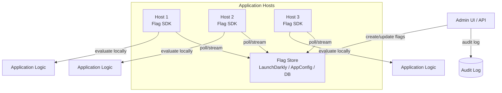
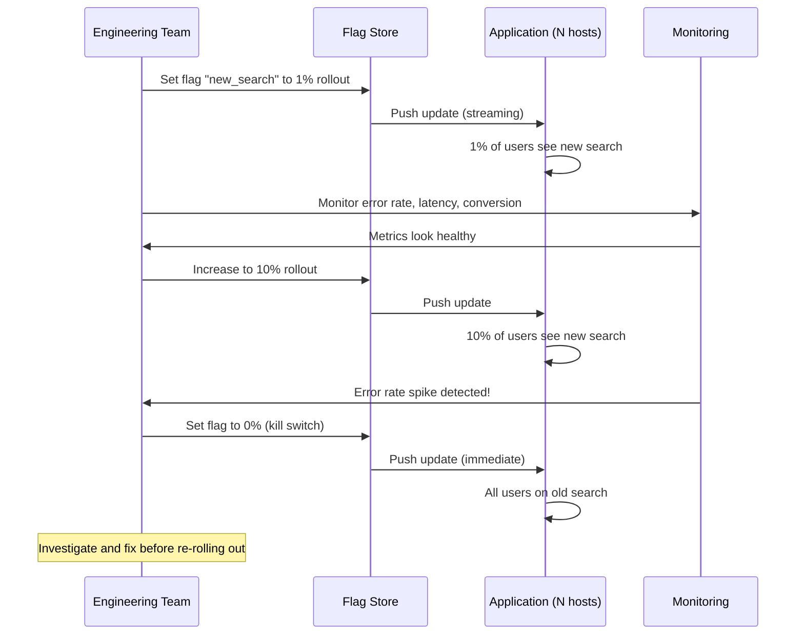

# Feature Flags

## 1. Overview

Feature flags (also called feature toggles) are runtime configuration switches that control application behavior without deploying new code. They decouple **deployment** (shipping code to production) from **release** (exposing functionality to users). A feature flag is fundamentally an `if` statement that reads its value from an external configuration source -- a database, an S3 file, or a service like AWS AppConfig or LaunchDarkly.

This seemingly simple mechanism is one of the most powerful operational tools in a senior architect's toolkit. Feature flags enable progressive rollouts, instant rollbacks, kill switches for runaway features, A/B testing, and per-region behavior control. They shift risk from "we hope this deployment works" to "we can turn it off in seconds if it doesn't."

Modern systems have fundamentally shifted from deployment-centric changes to configuration-centric behavior. In the old model, releasing a feature meant deploying new code -- with all the risk and coordination that entails. In the feature flag model, the code is already deployed and dormant. The "release" is flipping a configuration switch, which is instant, granular, and reversible. This is the core value proposition: reducing the blast radius and recovery time of every change.

## 2. Why It Matters

- **Decoupling deploy from release**: Code ships to production behind a flag set to `off`. The flag is flipped when the team is ready to release -- hours, days, or weeks after deployment. This eliminates the "big bang release" anti-pattern.
- **Instant rollback**: If a new feature causes errors or performance degradation, toggling the flag off reverts behavior instantly. No rollback deployment, no downtime, no revert commit.
- **Progressive rollouts**: Start with 1% of users, observe metrics, expand to 5%, 10%, 50%, then 100%. If problems emerge at 5%, you have impacted only 5% of users instead of 100%.
- **Kill switches during incidents**: During high-load events, disable non-critical but expensive features (recommendation queries, analytics tracking) to protect mission-critical paths (checkout, payment).
- **Per-region / per-tenant control**: Disable a feature in Canada due to logistics constraints while keeping it enabled globally. Enable a feature for enterprise customers but not free-tier users.

## 3. Core Concepts

- **Feature Flag**: A named boolean (or multi-valued) configuration that controls code behavior at runtime. The value is read from an external source, not hardcoded.
- **Flag Evaluation**: The runtime check that determines whether a flag is enabled for a given request. May depend on user attributes, percentage rollout, region, or device type.
- **Kill Switch**: A feature flag specifically designed to disable functionality during incidents. Must be fast, reliable, and well-tested.
- **Allow List / Deny List**: Flags that are enabled or disabled for specific sets of users (by user ID, email domain, IP range).
- **Progressive Rollout**: Gradually increasing the percentage of users who see a feature: 1% -> 5% -> 10% -> 50% -> 100%.
- **Canary Deployment vs. Feature Flag**: Canary deployments route a percentage of traffic to a new code version (infrastructure-level). Feature flags branch logic within the application code itself (code-level). Both manage risk but at different layers.
- **TTL and Caching**: Flag values are cached locally with a TTL to avoid hitting the config store on every request. Short TTLs (5-30 seconds) ensure all hosts converge quickly when a flag changes.
- **Audit Trail**: A record of who changed a flag, when, and why. Essential for incident response ("who turned on the new recommendation engine at 3 AM?") and compliance.

## 4. How It Works

### Flag Architecture

1. **Flag store**: A central configuration service stores flag definitions (name, value, targeting rules). Options: LaunchDarkly, AWS AppConfig, database table, S3 JSON file.
2. **Flag SDK / client library**: Embedded in the application. On startup, the SDK fetches all flag values and caches them locally.
3. **Polling / streaming**: The SDK periodically polls the flag store for updates (polling) or maintains a persistent connection for real-time updates (streaming via SSE or WebSocket).
4. **Local evaluation**: Flag decisions are made locally using the cached values, avoiding network round-trips on each request. This keeps flag checks at sub-millisecond latency.
5. **Fallback / defaults**: If the flag store is unreachable, the SDK uses cached values or hardcoded defaults. The system never crashes because it cannot reach the flag service.

### Flag Evaluation Logic

```python
# Simple boolean flag
if flag_client.is_enabled("new_checkout_flow", user=current_user):
    return new_checkout_handler(request)
else:
    return old_checkout_handler(request)

# Percentage rollout
# The SDK hashes the user ID and checks if hash % 100 < rollout_percentage
# This ensures consistent assignment: the same user always gets the same result

# Allow list
# Flag is enabled for users whose email matches @company.com
# Or whose user_id is in the beta testers list
```

### TTL and Caching Strategy

| Strategy | Latency | Freshness | Failure Mode |
|---|---|---|---|
| **Per-request fetch** | High (network hop) | Real-time | Flag store outage breaks all requests |
| **Cache with short TTL (5-30s)** | Low (local read) | Near-real-time | Uses cached value during outage |
| **Cache with streaming updates** | Low (local read) | Real-time | Falls back to last known value |
| **Startup-only fetch** | Lowest | Stale until restart | Requires restart to pick up changes |

The recommended approach is **cache with streaming updates**: the SDK maintains a persistent connection to the flag store and receives push updates. If the connection drops, it falls back to the last cached values.

## 5. Architecture / Flow

### Feature Flag System Architecture



### Progressive Rollout Sequence



## 6. Types / Variants

### Flag Types

| Type | Lifecycle | Purpose | Example |
|---|---|---|---|
| **Release flag** | Days to weeks | Gate new features during rollout | `new_checkout_flow` |
| **Experiment flag** | Weeks to months | A/B testing and experimentation | `search_algorithm_v2` |
| **Ops flag (kill switch)** | Permanent | Disable features during incidents | `disable_recommendations` |
| **Permission flag** | Permanent | Feature access by user tier/role | `enterprise_analytics` |

### Feature Flags vs. Canary Deployments

| Dimension | Feature Flags | Canary Deployments |
|---|---|---|
| **Layer** | Application code (`if` statement) | Infrastructure (traffic routing) |
| **Granularity** | Per-user, per-region, per-feature | Per-instance (percentage of traffic) |
| **Rollback** | Toggle the flag (milliseconds) | Reroute traffic or redeploy (seconds-minutes) |
| **Scope** | Individual features within a deployment | Entire deployment artifact |
| **Persistence** | Consistent per user (hash-based) | Random per request (load balancer) |
| **Testing** | Can test specific feature combinations | Tests the entire new version |

These are complementary: use canary deployments to validate infrastructure changes and feature flags to control feature exposure within a canary.

## 7. Use Cases

- **Database Migration (Kill Switch)**: A team migrates from MySQL to Postgres. A feature flag toggles traffic between the old and new databases. If the new database shows performance issues, the flag reverts traffic to MySQL instantly.
- **Regional Feature Control (Allow List)**: A logistics company disables same-day delivery in regions where infrastructure is not ready. A flag targets by region, and the config is updated as new regions come online.
- **High-Load Event Protection (Ops Flag)**: During Black Friday, non-critical features (recently viewed items, social proof badges) are disabled via kill switches to protect checkout throughput. These features are re-enabled after the traffic spike subsides.
- **A/B Testing (Experiment Flag)**: An e-commerce site tests two checkout flows. Users are consistently assigned to variant A or B based on a hash of their user ID. Conversion rates are compared after two weeks.
- **Progressive Feature Rollout**: A social media platform rolls out a new feed algorithm to 1% of users, measures engagement metrics, then expands to 5%, 25%, and 100% over two weeks.

## 8. Tradeoffs

| Advantage | Disadvantage |
|---|---|
| Instant rollback without redeployment | Technical debt: old code paths accumulate behind flags |
| Progressive rollout reduces blast radius | Flag complexity: too many flags make code hard to reason about |
| Kill switches protect critical paths | Stale flags: forgotten flags that never get cleaned up |
| Per-user/per-region targeting | Testing burden: every flag doubles the test matrix |
| Decouples deployment from release | Caching lag: hosts may evaluate stale flag values |
| Enables A/B testing natively | Security: flag store is a high-value target (controls system behavior) |

## 9. Common Pitfalls

- **Flag accumulation (technical debt)**: Every flag adds an `if/else` branch. Over time, dozens of abandoned flags make the codebase unreadable. Enforce a policy: every release flag must have a removal date. Run automated scans to detect flags that have been 100% enabled for more than 30 days.
- **Testing complexity explosion**: A system with N flags has 2^N possible states. You cannot test them all. Minimize flag interactions by keeping flags independent, and test the critical combinations explicitly.
- **No audit trail**: Without knowing who changed a flag and when, incident response is blind. Every flag change must be logged with the actor, timestamp, previous value, new value, and reason. This is not optional -- it is a compliance and operational necessity.
- **TTL too long**: If the cache TTL is 5 minutes, flipping a kill switch takes up to 5 minutes to propagate. For kill switches, use streaming updates or keep the TTL under 30 seconds.
- **Flag store as a single point of failure**: If the flag store goes down and the SDK cannot initialize, the application might crash or behave unpredictably. SDKs must have hardcoded defaults and graceful fallback behavior.
- **Using feature flags for long-lived config**: Feature flags are for temporary feature gating, not permanent configuration. Use a proper configuration management system (etcd, Consul, AWS Systems Manager) for permanent settings.
- **Not testing the "off" path**: If the flag is always on in development and staging, the "off" path (the old behavior) is never tested. When you flip the flag off in production during an incident, the old path crashes because it was never verified. Test both paths.
- **Flag dependencies**: Flag B depends on Flag A being enabled, but this dependency is not documented. Disabling Flag A while Flag B is still enabled causes undefined behavior. Document dependencies explicitly and enforce them in the flag evaluation logic.
- **Using feature flags for permanent configuration**: A flag that controls "database connection pool size" is not a feature flag -- it is application configuration. Use environment variables or a configuration management system (etcd, Consul) for permanent settings. Feature flags are for temporary gating.
- **Race conditions during flag changes**: If a user's request starts while the flag is off and completes after the flag is turned on, the user may see inconsistent behavior. For critical flags, ensure the flag value is evaluated once per request and passed through the entire call chain, not re-evaluated at each step.
- **Not securing the flag management API**: If an attacker gains access to the flag management API, they can disable security features, enable debug modes, or enable unfinished features. Protect flag management with strong authentication, RBAC, and audit logging.

## 10. Real-World Examples

- **Facebook**: Operates one of the largest feature flag systems in the world. Every feature is behind a flag, and features are rolled out progressively to internal users, then 1% of production, then wider. Facebook's Gatekeeper system evaluates flags based on user attributes, percentages, and targeting rules.
- **Netflix**: Uses feature flags extensively for A/B testing. The recommendation algorithm, UI layout, and even video encoding settings are controlled by flags. Netflix runs hundreds of A/B tests simultaneously, each gated by a feature flag.
- **GitHub**: Deploys to production dozens of times per day with features behind flags. GitHub's Scientist library allows running old and new code paths in parallel, comparing results, and gradually shifting traffic to the new path.
- **LaunchDarkly**: A dedicated feature flag platform used by companies like IBM, Atlassian, and GoDaddy. Provides real-time flag updates via streaming, targeting rules, audit logs, and integrations with CI/CD pipelines.
- **Amazon**: Uses feature flags for retail experiments. The "buy box" algorithm, recommendation widgets, and promotional banners are all controlled by flags that can be adjusted per-region, per-device, or per-customer segment.

### Flag Lifecycle Management

Feature flags have a lifecycle that must be actively managed to prevent technical debt:

**1. Creation**: A developer creates a flag with a name, description, owner, type (release, experiment, ops, permission), and expected removal date.

**2. Rollout**: The flag is gradually enabled for increasing percentages of users. Metrics are monitored at each stage.

**3. Full enablement**: The flag reaches 100% of users. The old code path is no longer executed.

**4. Cleanup**: The flag is removed from the code, the flag store, and the configuration. The old code path is deleted. This step is the most commonly skipped, leading to flag accumulation.

**5. Archival**: The flag's history (creation, changes, removal) is archived for audit purposes.

**Automated hygiene**:
- Run a weekly report of all flags that have been at 100% for more than 30 days.
- Generate pull requests to remove stale flags automatically.
- Block new flag creation if the total flag count exceeds a threshold (e.g., 50 per service).

### Targeting Rules

Sophisticated flag systems support complex targeting:

- **Percentage rollout**: Hash of user ID determines whether the user is in the enabled cohort. This ensures consistency -- the same user always sees the same variant.
- **User attributes**: Enable for users where `plan == "enterprise"` or `country == "US"`.
- **Allow/deny lists**: Explicitly include or exclude specific user IDs.
- **Time-based rules**: Enable only during business hours (for testing) or after a specific date (coordinated launch).
- **Dependency rules**: Flag B is enabled only if Flag A is also enabled. Useful for features that build on each other.

### Integration with Observability

Feature flag changes should be first-class events in your observability stack:

- **Deployment markers**: When a flag is toggled, create a marker in your monitoring dashboards (Grafana annotations, Datadog events). This makes it immediately visible when a flag change correlates with a metric change.
- **Log enrichment**: Include active flag values in structured log entries. When debugging an issue, you can filter logs by flag state to isolate the impact.
- **Error attribution**: If error rates spike, the observability system should automatically correlate with recent flag changes and surface the likely cause.
- **Metric segmentation**: Segment all key metrics (latency, error rate, conversion) by flag state. This provides real-time A/B comparison without a separate experimentation platform.

### Build vs. Buy Decision

| Approach | Pros | Cons | Best For |
|---|---|---|---|
| **Homegrown (S3/DB config)** | Full control, no vendor dependency, low cost | No targeting, no audit trail, no UI, maintenance burden | Simple on/off flags for small teams |
| **Open-source (Unleash, Flagsmith)** | Self-hosted, customizable, no vendor lock-in | Operational overhead, limited support | Teams with DevOps capacity |
| **SaaS (LaunchDarkly, Split.io)** | Rich targeting, streaming updates, audit trail, SDKs for all languages | Vendor dependency, per-seat pricing ($$$) | Teams that need sophisticated targeting and A/B testing |
| **Cloud-native (AWS AppConfig)** | Integrated with AWS, managed infrastructure | Limited to AWS, basic targeting | AWS-native architectures |

For most startups, a simple database-backed flag store (even a JSON file in S3) is sufficient. As the team grows and needs progressive rollouts and A/B testing, migrating to LaunchDarkly or a similar SaaS is worth the investment.

### Feature Flag Governance

At scale, feature flags need governance to prevent chaos:

- **Naming convention**: `team_service_feature_description` (e.g., `payments_checkout_new_3ds_flow`). Consistent naming makes flags discoverable.
- **Ownership**: Every flag has an owner (team or individual). When the owner leaves, flags are reassigned.
- **Expiration policy**: Release flags expire 30 days after reaching 100%. Experiment flags expire after the experiment concludes. Ops flags are permanent but reviewed quarterly.
- **Maximum flag count**: Set a per-service limit (e.g., 30 active flags). New flags require removing an old one.
- **Review process**: Flag changes that affect >10% of traffic require peer review (similar to code review).
- **Rollback runbook**: Every release flag has a documented rollback procedure ("if errors exceed X%, disable the flag").

### Relationship Between Feature Flags and Canary Deployments

These are complementary tools that work at different layers:

**Canary deployment** (infrastructure layer):
1. Deploy the new code version to 5% of instances.
2. Monitor metrics (error rate, latency).
3. If healthy, promote to 100% of instances.
4. If unhealthy, roll back the deployment.

**Feature flag** (application layer):
1. Deploy the new code (with the feature behind a flag) to 100% of instances.
2. Enable the flag for 5% of users.
3. Monitor metrics.
4. If healthy, increase to 100%.
5. If unhealthy, disable the flag.

**Combined approach** (best practice):
1. Canary deploy the code with the feature behind a flag (flag off).
2. Verify the deployment itself is stable (no regressions in existing behavior).
3. Progressively enable the flag for increasing percentages of users.
4. If the feature causes issues, disable the flag (instant, no deployment needed).
5. If the deployment itself is faulty, roll back the canary.

This layered approach provides two independent safety mechanisms: the canary catches deployment-level issues, and the feature flag catches feature-level issues.

## 11. Related Concepts

- [API Gateway](../architecture/api-gateway.md) -- gateways can evaluate flags to route traffic to different backends
- [Rate Limiting](./rate-limiting.md) -- feature flags can dynamically adjust rate limits during incidents
- [Circuit Breaker](./circuit-breaker.md) -- kill switches are a manual circuit breaker; both protect against failure
- [Autoscaling](../scalability/autoscaling.md) -- feature flags can disable expensive features as an alternative to scaling
- [Monitoring](../observability/monitoring.md) -- flag changes should be correlated with metric changes for root cause analysis

### Feature Flag Architecture Decision Record

When adopting feature flags, document these decisions:

1. **Flag evaluation latency budget**: Feature flag checks happen on every request. The SDK must evaluate flags in <1ms. This means local evaluation with cached flag data, not a network call per evaluation.
2. **Consistency requirements**: When a flag is toggled, how fast must all hosts converge? For kill switches, <30 seconds. For release flags, <5 minutes is acceptable.
3. **Failure mode**: If the flag store is unreachable, do hosts use the last cached value (safe, consistent) or default to the hardcoded default (may be incorrect if the flag was toggled)?
4. **Multi-environment strategy**: How do flag values propagate across environments (dev, staging, prod)? Are flags shared across environments or independent per environment?
5. **Flag naming convention**: Enforce a consistent naming pattern to prevent confusion. Example: `{team}_{service}_{feature}_{description}`.

### Quantitative Impact of Feature Flags

| Metric | Without Feature Flags | With Feature Flags |
|---|---|---|
| **Mean time to rollback** | 15-30 minutes (redeploy) | <1 minute (toggle flag) |
| **Blast radius of a bad release** | 100% of users | 1-5% (progressive rollout) |
| **Deployment frequency** | Weekly (high risk) | Daily (low risk, features gated) |
| **Incident recovery time** | 30-60 minutes (root cause, fix, deploy) | 1-5 minutes (disable flag, investigate later) |
| **A/B test setup time** | Days (separate deployments) | Hours (flag + targeting rules) |

## 12. Source Traceability

- source/youtube-video-reports/1.md (feature flags, kill switches, allow lists, canary vs flags, audit trail, TTL/caching, deployment vs release)
- source/extracted/acing-system-design/ch03-a-walkthrough-of-system-design-concepts.md (feature flags in system design)
- source/extracted/system-design-guide/ch11-system-design-in-practice.md (progressive rollouts)
