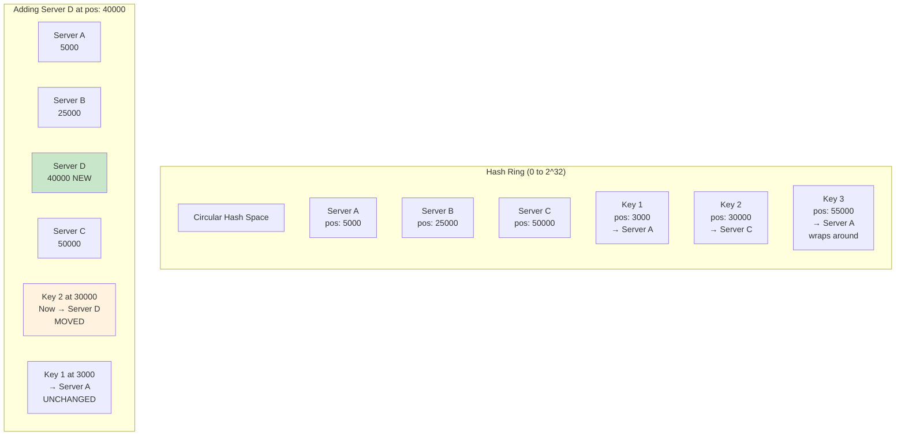
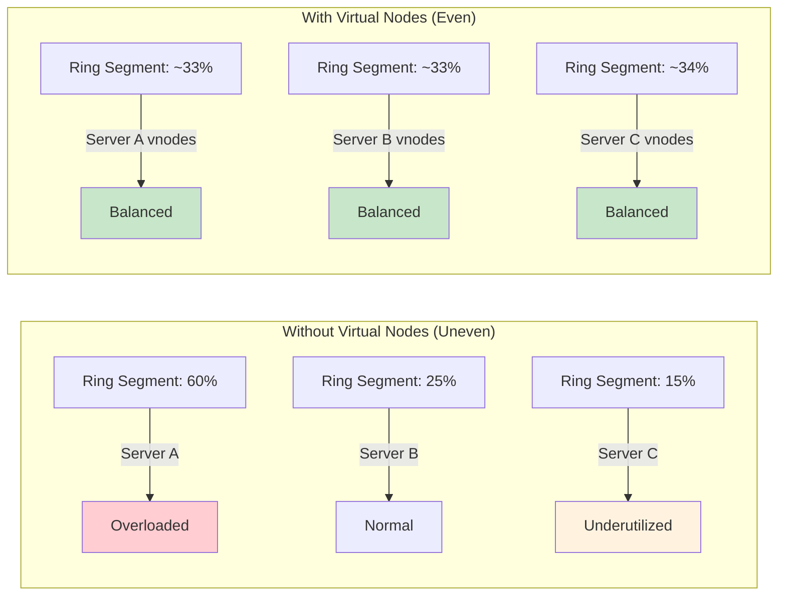
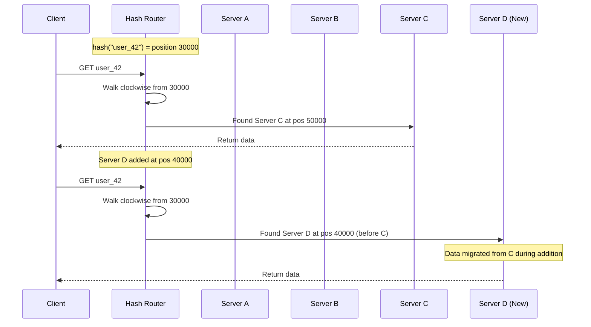

# Consistent Hashing

## 1. Overview

Consistent hashing is a distributed hashing strategy that minimizes data redistribution when nodes are added to or removed from a cluster. In the traditional approach of `hash(key) % N`, changing the number of servers (N) invalidates nearly every key-to-server mapping, requiring a catastrophic full redistribution. Consistent hashing maps both keys and servers onto a virtual ring (typically 0 to 2^32), where each key is assigned to the first server encountered walking clockwise from its hash position. When a server is added or removed, only the keys in the affected segment of the ring need to move -- approximately K/N keys where K is the total number of keys and N is the number of servers.

This is not an academic nicety. It is a prerequisite for the horizontal scaling of caches, databases, and distributed storage systems. Without consistent hashing, every scaling event becomes a potential outage as the entire dataset reorganizes.

## 2. Why It Matters

- **Scaling without downtime.** Adding a cache server to a Redis cluster or a node to a Cassandra ring should not invalidate most of the existing data mappings. Consistent hashing ensures that only a minimal fraction of data needs to move.
- **Graceful failure handling.** When a node crashes, only the data that was assigned to that node needs to be redistributed to its neighbors on the ring. The rest of the cluster is unaffected.
- **Predictable load distribution.** With virtual nodes, consistent hashing ensures that data and traffic are evenly distributed across all physical servers, preventing hot spots that degrade performance.
- **Foundation for distributed databases.** Cassandra, DynamoDB, Riak, and Redis Cluster all use consistent hashing (or close variants) as their core data distribution mechanism. Understanding the ring is understanding how these systems work internally.

## 3. Core Concepts

- **Hash Ring:** A circular hash space, typically [0, 2^32 - 1], where both keys and servers are mapped using a hash function. The ring "wraps around" -- position 2^32 is the same as position 0.
- **Hash Function:** A deterministic function (e.g., MD5, SHA-1, CRC32, xxHash) that maps input (key or server identifier) to a position on the ring.
- **Clockwise Assignment:** Each key is assigned to the first server encountered when walking clockwise from the key's hash position on the ring.
- **Virtual Nodes (vnodes):** Each physical server is mapped to multiple points on the ring (e.g., 150-256 virtual nodes per physical server). This dramatically improves load distribution and ensures that when a node fails, its data is spread across many remaining nodes rather than dumped onto a single neighbor.
- **Replication Factor:** The number of copies of each piece of data. With RF=3, the key is stored on the first 3 distinct physical servers encountered clockwise on the ring.
- **Token:** The hash position on the ring assigned to a server (or virtual node). Each physical server "owns" the range of the ring between its token and the previous server's token.
- **Redistribution:** When a server is added or removed, only the keys in the affected ring segment need to migrate. With N servers, approximately 1/N of the total keys are affected.

## 4. How It Works

### The Problem with Modulo Hashing

Traditional approach: `server = hash(key) % N`

Consider a 3-server cluster with keys mapping as follows:
- `hash("user_1") % 3 = 0` → Server 0
- `hash("user_2") % 3 = 1` → Server 1
- `hash("user_3") % 3 = 2` → Server 2
- `hash("user_4") % 3 = 1` → Server 1

Now add a 4th server (N changes from 3 to 4):
- `hash("user_1") % 4 = ?` → Likely a DIFFERENT server
- `hash("user_2") % 4 = ?` → Likely a DIFFERENT server
- `hash("user_3") % 4 = ?` → Likely a DIFFERENT server

**Result:** Nearly all keys must be remapped. For a cache cluster, this triggers a cache stampede -- every key is a cache miss simultaneously, and the backing database is crushed. For a database cluster, this means massive data migration during a scaling event.

### The Consistent Hashing Solution

**Step 1: Create the ring.** Hash space [0, 2^32 - 1] is arranged as a circle.

**Step 2: Place servers on the ring.** Each server is hashed to a position:
- `hash("Server_A") → position 5000`
- `hash("Server_B") → position 25000`
- `hash("Server_C") → position 50000`

**Step 3: Place keys on the ring.** Each data key is hashed to a position:
- `hash("key_1") → position 3000` → walks clockwise → **Server_A** (at 5000)
- `hash("key_2") → position 30000` → walks clockwise → **Server_C** (at 50000)
- `hash("key_3") → position 55000` → walks clockwise → wraps around → **Server_A** (at 5000)

**Step 4: Adding a server.** Insert `Server_D` at position 40000:
- Keys between 25001 and 40000 that were assigned to Server_C now go to Server_D.
- All other keys remain unchanged.
- Only ~1/4 of keys need to move (K/N where N is now 4).

**Step 5: Removing a server.** Remove Server_B (position 25000):
- Keys between 5001 and 25000 that were assigned to Server_B now go to Server_C (the next clockwise server).
- All other keys remain unchanged.
- Only ~1/3 of keys need to move (the keys that were on Server_B).

### Virtual Nodes: Solving Uneven Distribution

**The problem:** With only 3 physical servers on the ring, the hash positions are unlikely to be evenly spaced. One server might own 60% of the ring while another owns 10%. This creates hot spots.

**The solution:** Instead of placing each physical server at one point on the ring, place it at many points (virtual nodes):

- Server A → positions {5000, 15000, 35000, 55000, 75000, ...} (150+ vnodes)
- Server B → positions {8000, 22000, 42000, 62000, 82000, ...} (150+ vnodes)
- Server C → positions {12000, 28000, 48000, 68000, 88000, ...} (150+ vnodes)

**Benefits:**
1. **Even distribution:** With 150+ vnodes per server, the law of large numbers ensures each physical server owns approximately 1/N of the ring.
2. **Smooth redistribution:** When a server is removed, its 150+ vnodes are scattered across the ring. The keys from each vnode are absorbed by different neighboring servers, spreading the load evenly rather than dumping everything onto a single neighbor.
3. **Heterogeneous hardware:** A more powerful server can be assigned more vnodes (e.g., 300 instead of 150), proportionally increasing its share of the data and traffic.

### Redis Cluster: Hash Slots

Redis Cluster uses a variant of consistent hashing with 16,384 fixed hash slots:

```
slot = CRC16(key) % 16384
```

Each node is assigned a range of hash slots. When a node is added, a portion of slots are migrated from existing nodes to the new node. This provides the benefits of consistent hashing with a simpler implementation than a true hash ring.

## 5. Architecture / Flow







## 6. Types / Variants

### Consistent Hashing Variants

| Variant | Used By | Mechanism | Advantage |
|---|---|---|---|
| **Standard Ring + Virtual Nodes** | Cassandra, Riak | Keys and servers on a hash ring with vnodes | Even distribution, graceful scaling |
| **Hash Slots** | Redis Cluster | 16,384 fixed slots, CRC16 hash | Simpler implementation, deterministic slot assignment |
| **Jump Consistent Hash** | Google | Mathematical formula, no ring structure | Zero memory overhead, perfect distribution |
| **Rendezvous (HRW) Hashing** | Various caches | Each key picks the server with the highest hash(key, server) | Simple, no ring needed, naturally handles weights |
| **Maglev Hashing** | Google Maglev LB | Lookup table for O(1) assignment | Minimal disruption, designed for packet-level performance |

### Comparison: Modulo vs. Consistent Hashing

| Factor | Modulo (hash % N) | Consistent Hashing |
|---|---|---|
| **Keys moved when adding a node** | ~(N-1)/N of all keys (~99% for large N) | ~K/N keys (only affected segment) |
| **Keys moved when removing a node** | ~(N-1)/N of all keys | ~K/N keys (only the failed node's data) |
| **Load distribution** | Depends on hash uniformity | Even with virtual nodes |
| **Implementation complexity** | Trivial | Moderate (ring + vnodes) |
| **Memory overhead** | None | Ring metadata + vnode positions |
| **Scaling disruption** | Severe (near-total redistribution) | Minimal (fraction of data moves) |

## 7. Use Cases

- **Cassandra:** Uses consistent hashing with virtual nodes (vnodes) as its core data distribution mechanism. Each node is assigned ~256 vnodes by default. When a node is added to the ring, it takes ownership of specific token ranges from existing nodes, and only the data in those ranges migrates. This is how Cassandra achieves linear horizontal scaling.
- **Amazon DynamoDB:** Uses consistent hashing to distribute data across partitions. The partition key is hashed to determine which partition stores the item. DynamoDB automatically splits and merges partitions as data volume and traffic change.
- **Redis Cluster:** Uses 16,384 hash slots distributed across nodes. Resharding involves migrating specific slots from one node to another. A key always maps to the same slot regardless of cluster topology changes.
- **Akamai CDN:** One of the earliest production uses of consistent hashing (1997). Used to distribute web content across cache servers so that adding or removing cache nodes does not invalidate the entire cache.
- **Discord:** Uses consistent hashing to distribute user guilds (servers) across backend compute nodes. When new nodes are added to handle growing traffic, only a fraction of guilds need to migrate.

## 8. Tradeoffs

| Factor | Benefit | Cost |
|---|---|---|
| **Minimal redistribution** | Only K/N keys move on cluster changes | Ring metadata must be maintained and distributed |
| **Virtual nodes** | Even load distribution | Memory overhead for vnode positions; more complexity in routing |
| **Replication on the ring** | High availability (RF copies) | Write amplification (each write goes to RF nodes) |
| **Heterogeneous nodes** | More vnodes for powerful servers | Manual weight management; uneven redistribution if weights change |

| Consistent Hashing | vs. | Lookup Table (Directory-Based) |
|---|---|---|
| Decentralized -- no SPOF | | Centralized -- lookup service is a SPOF |
| Fast O(log N) lookup on ring | | Fast O(1) lookup in table |
| Keys move minimally on changes | | Can place keys anywhere (maximum flexibility) |
| Cannot handle extreme outliers | | Can dedicate specific nodes to hot keys |

## 9. Common Pitfalls

- **Skipping virtual nodes.** In a system design interview, failing to mention virtual nodes is a significant red flag. Without vnodes, a 3-server ring will almost certainly have uneven distribution, with one server handling 2-3x the load of others.
- **Too few virtual nodes.** Using 3-5 vnodes per server still produces noticeable skew. Production systems use 100-256+ vnodes per physical server to achieve truly even distribution.
- **Assuming perfect distribution.** Even with vnodes, hash function quality matters. A poor hash function can cluster vnodes, defeating the purpose. Use cryptographic or high-quality non-cryptographic hash functions (xxHash, MurmurHash3).
- **Not handling the hot key problem.** Consistent hashing distributes keys evenly across the ring, but a single hot key (e.g., a celebrity's profile) can overwhelm the node it lands on regardless of ring balance. Solutions include key salting (appending random suffixes) or read replicas. Cross-link to [Sharding](./sharding.md) for the celebrity problem.
- **Ignoring replication topology.** When RF=3, the key is stored on 3 consecutive physical servers on the ring. If those 3 servers happen to be in the same rack or AZ, a single failure can lose all copies. Production systems use rack-aware and AZ-aware placement.
- **Confusing consistent hashing with caching.** Consistent hashing is a data distribution strategy, not a caching strategy. It determines where data lives, not how long it stays. TTL, eviction policies, and cache-aside logic are separate concerns. Cross-link to [Caching](../caching/caching.md).

## 10. Real-World Examples

- **Cassandra at Netflix:** Netflix runs one of the world's largest Cassandra deployments. The consistent hashing ring allows them to add nodes to handle increased traffic (streaming spikes, new market launches) without downtime. Netflix contributed significant improvements to Cassandra's vnode implementation.
- **Amazon S3:** Internally uses consistent hashing to distribute objects across storage nodes. When you create an S3 bucket, your objects are hashed and distributed across Amazon's massive storage fleet. Adding storage capacity is transparent to users.
- **Akamai (1997):** Karger et al. originally developed consistent hashing at MIT specifically for Akamai's CDN. The problem was that adding or removing cache servers should not invalidate the entire distributed cache. This paper became one of the most cited works in distributed systems.
- **TicketMaster event database:** If you add a fourth server to a three-node cluster using modulo hashing, nearly all event-to-server mappings break, triggering a massive redistribution during what may already be a high-traffic period. Consistent hashing prevents this catastrophic scenario.

## 11. Related Concepts

- [Sharding](./sharding.md) -- consistent hashing as the distribution mechanism for sharded databases
- [Load Balancing](./load-balancing.md) -- consistent hashing used in advanced LB algorithms (Maglev)
- [Cassandra](../storage/cassandra.md) -- consistent hashing ring as Cassandra's core architecture
- [DynamoDB](../storage/dynamodb.md) -- consistent hashing for partition key distribution
- [Redis](../caching/redis.md) -- 16,384 hash slots in Redis Cluster
- [Caching](../caching/caching.md) -- consistent hashing for distributed cache clusters

## 12. Source Traceability

- source/youtube-video-reports/4.md -- Sharding and consistent hashing, hash(key) mod N problem, celebrity hotspot
- source/youtube-video-reports/5.md -- Consistent hashing for scaling, hash ring concept
- source/youtube-video-reports/8.md -- Consistent hashing and virtual nodes (detailed), hash ring 0 to 2^32, clockwise lookup, TicketMaster example, Redis CRC mod 16384
- source/youtube-video-reports/9.md -- Consistent hashing maps keys to ring, K/N redistribution
- source/extracted/grokking/ch270-how-does-it-work.md -- Consistent hashing definition, ring mechanics, virtual replicas for load balancing
- source/extracted/grokking/ch254-common-problems-of-data-partitioning.md -- Hash-based partitioning, consistent hashing as workaround
- source/extracted/ddia/ch08-partitioning.md -- Partitioning of key-value data, hash partitioning, consistent hashing
