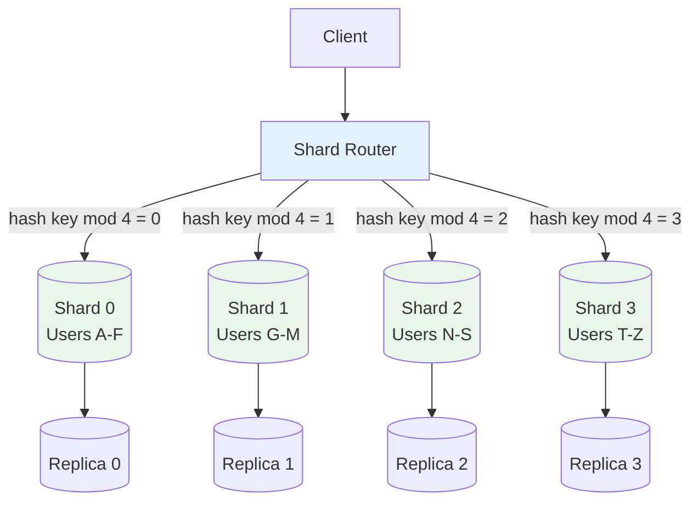
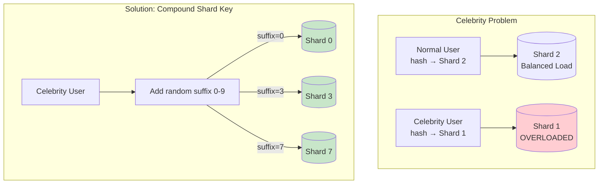
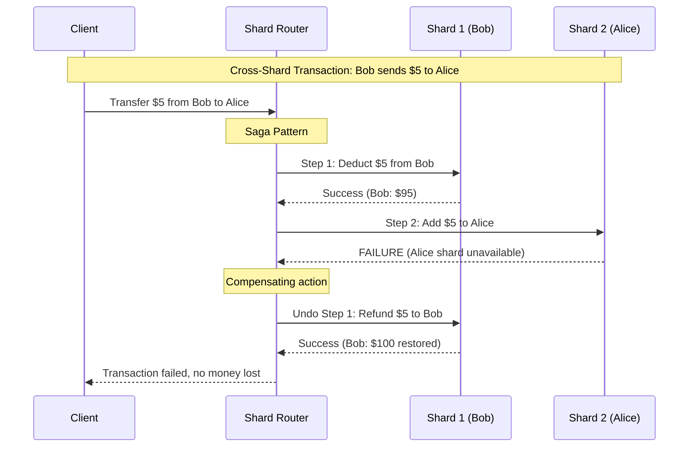

# Sharding

## 1. Overview

Sharding (horizontal partitioning) is the practice of splitting a database into smaller, independent pieces (shards) that are distributed across multiple servers. Each shard holds a subset of the total data, determined by a shard key and a distribution strategy. Sharding is your response when a single database instance can no longer handle the data volume (storage) or request throughput (QPS) -- when you have exhausted vertical scaling and read replicas are insufficient.

Sharding is your last resort, not your first tool. It introduces significant complexity: cross-shard queries become expensive or impossible, transactions across shards require distributed coordination, and rebalancing shards is an operationally painful process. You only shard when you have exhausted vertical scaling -- typically when you exceed approximately 50-70 TB of storage or 10K-50K writes/sec on the largest available single-node hardware.

## 2. Why It Matters

- **Storage beyond single-node limits.** A single Postgres instance on AWS RDS maxes out at ~64 TB. When your data exceeds this, sharding is the only path forward.
- **Write throughput beyond single-node limits.** A single Postgres instance handles ~10K writes/sec. A single MySQL instance handles ~20K writes/sec. When your write QPS exceeds these limits, you need to distribute writes across shards.
- **Read performance at scale.** While read replicas help with read throughput, they do not help with data volume. If your indexes no longer fit in memory due to table size, queries slow down regardless of replica count. Sharding reduces the data each shard must manage.
- **Fault isolation.** A failure in one shard affects only the data on that shard. A 10-shard database has a blast radius of ~10% per shard failure rather than 100% for a single database.
- **Geographic distribution.** Sharding by region allows you to keep user data physically close to the user, reducing cross-continent latency.

## 3. Core Concepts

- **Shard:** A single partition of the database, containing a subset of the total data. Each shard is an independent database instance.
- **Shard Key:** The column or attribute used to determine which shard a piece of data belongs to. The most consequential decision in sharding -- a bad shard key creates hot spots and makes the system worse, not better.
- **Hot Spot:** A shard that receives disproportionately more traffic than others, typically caused by a skewed shard key distribution. Also called the "celebrity problem."
- **Rebalancing:** Redistributing data across shards when shards become unevenly loaded or when the cluster grows. Operationally difficult and often requires downtime or significant coordination.
- **Cross-Shard Query:** A query that needs data from multiple shards. Much slower and more complex than a single-shard query because it requires scatter-gather or aggregation.
- **Cross-Shard Transaction:** A transaction that spans multiple shards. Requires distributed coordination (2PC or Saga). Cross-link to [Distributed Transactions](../resilience/distributed-transactions.md).
- **Denormalization:** The practice of duplicating data across shards to avoid cross-shard joins. A necessary compromise in sharded environments where joins across shards are impractical.

## 4. How It Works

### Shard Key Selection

The shard key is the most important decision in any sharding design. A good shard key requires:

1. **High Cardinality:** Many unique values. A key like `UserID` (billions of unique values) distributes well. A key like `IsPremium` (true/false -- only 2 values) limits you to 2 shards.
2. **Even Distribution:** Values should be uniformly distributed. `UserID` with sequential assignment distributes evenly. `CreationDate` creates a hot spot on the newest shard (all writes go to today's shard).
3. **Query Alignment:** The shard key should match your primary access pattern. If most queries filter by UserID, shard by UserID -- the query hits a single shard. If you shard by UserID but query by PostID, every query must scatter to all shards.
4. **Low Cross-Shard Operations:** Operations that span multiple shards should be the exception, not the rule. If your most common operation requires joining data from different shard keys, your sharding design is wrong.

### Sharding Strategies

#### Range-Based Sharding

Data is split into contiguous ranges of the shard key.

**Example:** User IDs 0-10M on Shard 1, 10M-20M on Shard 2, 20M-30M on Shard 3.

| Pros | Cons |
|---|---|
| Simple to understand and implement | Unbalanced if data is not uniformly distributed |
| Efficient range queries (all data in a range is on one shard) | Hot spot on the newest range (if using sequential IDs) |
| Easy to add new ranges | Time-series data piles onto the "current" shard |

**Best for:** Time-series data where older ranges are archived and receive little traffic. Log analysis, IoT telemetry with time-based sharding.

#### Hash-Based Sharding

A hash function is applied to the shard key, and the result determines the shard.

**Example:** `shard = hash(UserID) % N` where N is the number of shards.

| Pros | Cons |
|---|---|
| Even distribution (hash functions spread values uniformly) | Range queries become scatter-gather (no locality) |
| No hot spots from sequential data | Adding/removing shards requires redistribution |
| Simple to implement | Mitigated by using [Consistent Hashing](./consistent-hashing.md) |

**Best for:** General application data where the primary access pattern is point lookups by key. User tables, session stores.

#### Directory-Based Sharding

A central lookup service maintains a mapping from keys to shards.

**Example:** A lookup table: `{UserID: 12345 → Shard 7}`, `{UserID: 67890 → Shard 3}`.

| Pros | Cons |
|---|---|
| Maximum flexibility -- any key can go to any shard | Lookup service is a single point of failure |
| Can handle extreme outliers (move a celebrity to a dedicated shard) | Additional network hop for every query |
| Rebalancing does not require data redistribution -- just update the directory | Directory must be highly available and fast |

**Best for:** Systems with extreme outliers (celebrity accounts) that need surgical data placement. Handling the "celebrity problem" with dedicated shards.

### The Celebrity Problem (Hot Shard)

When a user like Taylor Swift or Lionel Messi lands on a shard, their massive traffic volume creates a load imbalance that can overwhelm the shard.

**Solutions:**

1. **Compound Shard Keys (Key Salting):** Append a random suffix to the celebrity's key (e.g., `Messi_0`, `Messi_1`, ..., `Messi_9`). This spreads the celebrity's data across 10 shards. Reads must scatter to all 10 and merge, but the write load is distributed.

2. **Dedicated Celebrity Shards:** Use directory-based sharding to physically move the celebrity's data to a higher-provisioned machine. The directory lookup routes celebrity queries to dedicated infrastructure.

3. **Hybrid Fan-out:** For read-heavy celebrity data (e.g., timelines), use fan-out on read for celebrities and fan-out on write for normal users. Cross-link to [Fan-out](../patterns/fan-out.md).

4. **N-Cache Strategy:** Instead of sharding the cache (which keeps the hot key on one cache node), use N independent cache instances. The application randomly selects one of the N cache instances for each read. This distributes the cache load while serving the same data.

### Cross-Shard Transactions

In a sharded environment, atomic transactions across shards are the hardest problem. Consider Bob sending $5 to Alice when Bob and Alice are on different shards:

**Two-Phase Commit (2PC):** Cross-link to [Distributed Transactions](../resilience/distributed-transactions.md).
- A central coordinator asks all participating shards: "Can you commit?"
- If all respond "yes," the coordinator sends "commit."
- If any responds "no" or times out, the coordinator sends "abort."
- **Problem:** The coordinator is a SPOF. If it fails mid-transaction, all participating shards are locked until recovery.

**Saga Pattern:** Cross-link to [Distributed Transactions](../resilience/distributed-transactions.md).
- A sequence of local transactions, each with a compensating (undo) action.
- Step 1: Deduct $5 from Bob's shard.
- Step 2: Add $5 to Alice's shard.
- If Step 2 fails, execute compensation: refund $5 to Bob.
- **Trade-off:** No global lock, but only provides eventual consistency. Intermediate states are visible.

### Rebalancing

As data grows unevenly across shards, rebalancing becomes necessary:

| Trigger | What Happens | Difficulty |
|---|---|---|
| Uneven data distribution | Some shards fill up faster than others | Medium -- migrate data from full shards to empty ones |
| Hot shard | One shard gets disproportionate traffic | High -- requires splitting the shard or moving hot keys |
| Adding capacity | New shard added to the cluster | Medium with consistent hashing; hard with modulo |
| Removing a shard | Failed or decommissioned shard | Medium -- redistribute its data to remaining shards |

**Strategies for minimizing rebalancing pain:**
- Use [Consistent Hashing](./consistent-hashing.md) to ensure that adding/removing a node only affects K/N keys.
- Use directory-based sharding for maximum flexibility in placement.
- Implement online migration (migrate data in the background while serving reads from the old location).

## 5. Architecture / Flow

## 6. Types / Variants

### Sharding Strategy Comparison

| Strategy | Distribution Method | Range Queries | Point Lookups | Rebalancing | Hot Spot Risk |
|---|---|---|---|---|---|
| **Range-Based** | Contiguous key ranges | Excellent (single shard) | Good (known range) | Hard (ranges may become uneven) | High (newest range is hot) |
| **Hash-Based** | Hash function on key | Poor (scatter-gather) | Excellent (deterministic) | Hard without consistent hashing | Low (uniform distribution) |
| **Directory-Based** | Lookup table | Depends on directory design | Good (one lookup + one shard) | Easy (update directory) | Low (can move hot keys) |
| **Consistent Hash** | Hash ring with vnodes | Poor | Excellent | Easy (K/N keys move) | Low with vnodes |
| **Geographic** | User location/region | Good for regional queries | Good | Medium | Depends on user distribution |
| **Composite** | Combination (e.g., list + hash) | Varies | Good | Medium | Medium |

### Vertical Partitioning vs. Horizontal Partitioning (Sharding)

| Aspect | Vertical Partitioning | Horizontal Partitioning (Sharding) |
|---|---|---|
| **Splits by** | Columns (features) | Rows (data) |
| **Example** | User profiles on DB1, friend lists on DB2, photos on DB3 | Users 0-10M on Shard1, 10M-20M on Shard2 |
| **Complexity** | Low (just separate tables/services) | High (distributed coordination) |
| **Scalability limit** | Still limited by single-table growth | Theoretically unlimited |
| **Use case** | Microservice decomposition | Large single-entity tables |
| **Cross-partition joins** | API calls between services | Scatter-gather across shards |

## 7. Use Cases

- **Instagram:** Shards by UserID across dozens of PostgreSQL instances. Each user's photos, likes, and comments live on the same shard, making most queries single-shard. Cross-user queries (e.g., a feed) use application-level joins.
- **Cassandra at Facebook:** Originally built for the Facebook Inbox. Uses consistent hashing with the partition key to distribute messages across the ring. A message lookup by UserID + timestamp hits exactly one node.
- **Uber:** Shards ride data by city/region. Rides in New York are on different shards from rides in San Francisco. This keeps most queries regional (a driver in NYC never needs data from SF shards).
- **Twitter:** Shards the tweet store by UserID. A user's tweets are co-located on the same shard. The timeline service performs fan-out to pre-compute timelines rather than issuing cross-shard queries.
- **Vitess (YouTube/Google):** A MySQL sharding middleware that provides transparent sharding. Applications query a proxy (vtgate) that routes queries to the correct shard (vttablet). Vitess handles shard splits, merges, and resharding online.

## 8. Tradeoffs

| Factor | Sharded System | Single Database |
|---|---|---|
| **Write throughput** | Scales with shard count | Limited by single node |
| **Storage capacity** | Sum of all shards | Limited by single node |
| **Query complexity** | Simple for single-shard; complex for cross-shard | Simple (full SQL) |
| **Transaction support** | Limited (2PC or Saga for cross-shard) | Full ACID |
| **Join performance** | Expensive or impossible across shards | Full join support |
| **Operational complexity** | High (monitoring N databases, rebalancing, schema migrations) | Low (one database to manage) |
| **Schema changes** | Must be applied to every shard | Single operation |
| **Backup/restore** | Coordinated across all shards | Single backup |
| **Development complexity** | Application must be shard-aware | Application is shard-agnostic |

### Common Problems of Sharded Systems

| Problem | Description | Mitigation |
|---|---|---|
| **Joins across shards** | Cannot perform SQL joins across different physical databases | Denormalize data; perform application-level joins |
| **Referential integrity** | Foreign key constraints cannot span shards | Enforce in application code; periodic audit jobs |
| **Rebalancing** | Moving data between shards without downtime | Consistent hashing; online migration tools (Vitess, gh-ost) |
| **Hot spots** | Uneven traffic distribution | Compound keys; directory-based routing; dedicated shards |
| **Global queries** | Queries that need data from all shards (e.g., "total users") | Materialized views; dedicated analytics store |
| **Schema migrations** | DDL changes must be applied to every shard | Schema migration orchestration tools |

## 9. Common Pitfalls

- **Sharding too early.** Sharding before you need it is premature optimization at its worst. The operational cost of managing a sharded system is enormous. Exhaust vertical scaling, read replicas, and caching first.
- **Choosing a low-cardinality shard key.** Sharding by `IsPremium` (true/false) limits you to 2 shards. Sharding by `Country` gives you ~200 shards but massive skew (the US shard handles 10x more traffic than Bhutan). Choose keys with millions+ of unique values.
- **Choosing a shard key that misaligns with query patterns.** If you shard by UserID but most queries filter by PostID, every query becomes a scatter-gather across all shards. The shard key must match the primary access pattern.
- **Ignoring temporal hot spots.** Sharding by CreationDate means all writes go to the "current" shard (today/this month). This creates a write hot spot that defeats the purpose of sharding.
- **Forgetting cross-shard transaction complexity.** Once data is distributed across shards, atomic operations that span shards require 2PC or Saga patterns. If your application requires frequent cross-shard transactions, reconsider whether sharding is the right approach.
- **Not planning for rebalancing from day one.** Eventually, shards will become uneven. If your sharding strategy does not account for rebalancing (e.g., by using consistent hashing), you will face a painful migration that may require downtime.
- **Ignoring secondary indexes.** In a sharded database, secondary indexes (indexes on non-shard-key columns) become either local (per-shard, incomplete) or global (distributed, expensive to maintain). Plan your index strategy alongside your shard key.

## 10. Real-World Examples

- **Vitess at YouTube:** YouTube outgrew a single MySQL instance and built Vitess to transparently shard MySQL. Vitess provides online resharding (splitting and merging shards without downtime), automated failover, and connection pooling. It is now an open-source CNCF project used by Slack, Square, and others.
- **Pinterest:** Shards MySQL by UserID using a custom routing layer. Each user's pins, boards, and followers are co-located. Pinterest's sharding architecture was designed so that the most common operation (viewing a user's pins) is always a single-shard query.
- **Notion:** Migrated from a single Postgres instance to a sharded Postgres architecture when their database grew beyond what a single instance could handle. The migration was done live without downtime, using double-write and backfill strategies.
- **Stripe:** Uses directory-based sharding with a custom routing layer. Each merchant is assigned to a shard, and the directory maps merchant IDs to physical databases. This allows Stripe to move high-traffic merchants to dedicated shards without application changes.

## 11. Related Concepts

- [Consistent Hashing](./consistent-hashing.md) -- the distribution mechanism that makes sharding scalable
- [Load Balancing](./load-balancing.md) -- distributing traffic across application servers above the sharded database
- [CAP Theorem](../fundamentals/cap-theorem.md) -- consistency trade-offs in sharded, distributed systems
- [Distributed Transactions](../resilience/distributed-transactions.md) -- 2PC and Saga patterns for cross-shard operations
- [SQL Databases](../storage/sql-databases.md) -- the single-node databases that sharding extends
- [Cassandra](../storage/cassandra.md) -- a database with built-in sharding via consistent hashing

## 12. Source Traceability

- source/youtube-video-reports/4.md -- Sharding as last resort, shard key anatomy (cardinality, distribution, query alignment), range/hash/directory strategies, celebrity hotspot solutions, 2PC and saga pattern
- source/youtube-video-reports/5.md -- Consistent hashing for sharding, hash ring concept
- source/youtube-video-reports/6.md -- Hot shard/celebrity problem, random suffix strategy, N-cache strategy
- source/youtube-video-reports/7.md -- Vertical vs horizontal partitioning, sharding across nodes
- source/youtube-video-reports/8.md -- Data modeling for sharding, partition key vs clustering key, consistent hashing and virtual nodes
- source/extracted/grokking/ch252-partitioning-methods.md -- Horizontal, vertical, and directory-based partitioning
- source/extracted/grokking/ch254-common-problems-of-data-partitioning.md -- Hash-based partitioning, list/round-robin/composite, joins and denormalization, referential integrity, rebalancing
- source/extracted/grokking/ch60-data-sharding.md -- Data sharding strategies
- source/extracted/ddia/ch08-partitioning.md -- Partitioning of key-value data, hot spots, rebalancing, request routing
- source/extracted/acing-system-design/ch06-scaling-databases.md -- Database scaling strategies
