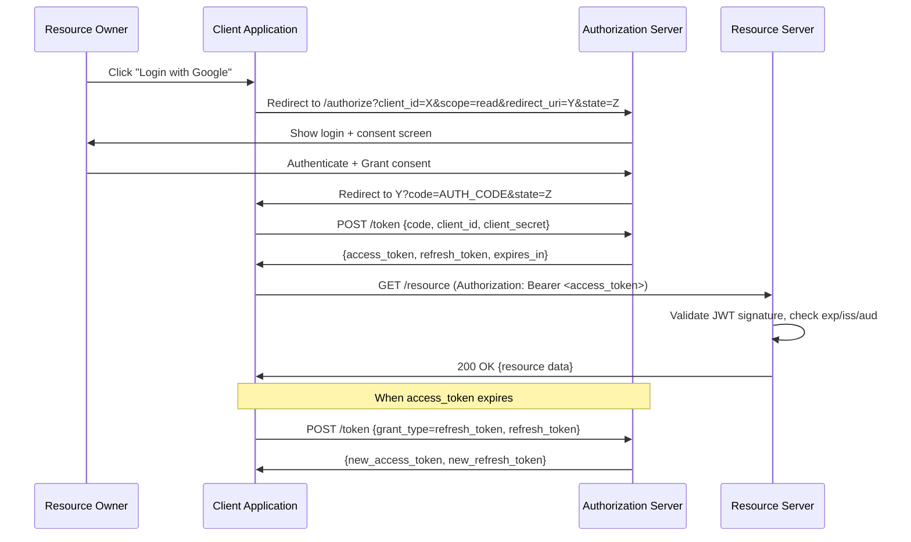
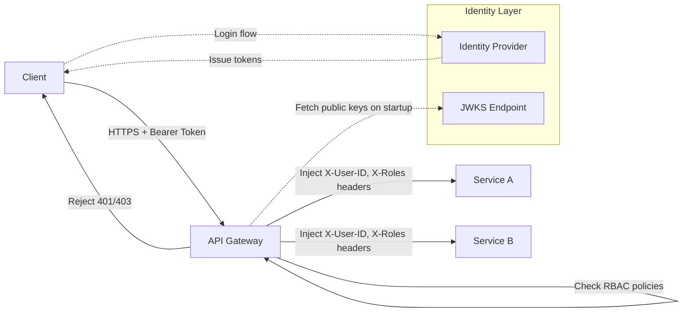

# Authentication and Authorization

## 1. Overview

Authentication (AuthN) answers "Who are you?" and authorization (AuthZ) answers "What are you allowed to do?" These are two distinct operations that work in sequence: the system first verifies a client's identity, then checks whether that identity has permission to perform the requested action. Conflating them is one of the most common security mistakes in system design.

In production systems, AuthN/AuthZ is never something you build from scratch on every service. It is centralized -- typically enforced at the API Gateway or a dedicated identity service -- and then propagated downstream via tokens. The service receiving the request trusts the token, validates it locally (cryptographic signature check), and extracts the identity and permissions without calling back to the identity provider on every request. This separation is what makes microservices authentication scalable.

## 2. Why It Matters

- **Data breach prevention**: Unauthorized access is the root cause of most high-profile security incidents. A broken AuthN system means attackers impersonate legitimate users. A broken AuthZ system means a low-privilege user can escalate to admin.
- **Regulatory compliance**: GDPR, HIPAA, PCI-DSS, and SOX all mandate access controls. AuthN/AuthZ is how you prove compliance during an audit.
- **Multi-tenant isolation**: In SaaS platforms, AuthZ ensures Tenant A cannot read Tenant B's data, even when they share infrastructure.
- **API monetization**: API keys tied to rate tiers and permission sets are how platforms like Stripe and Twilio enforce usage-based billing.
- **Zero-trust architecture**: Modern security models assume the network is compromised. Every request must prove its identity, regardless of whether it originates inside or outside the perimeter.

## 3. Core Concepts

- **Authentication (AuthN)**: Verifying that a client is who they claim to be. Typically involves credentials (password, certificate, biometric) or a delegated proof (token from an identity provider).
- **Authorization (AuthZ)**: Determining whether an authenticated identity has permission to perform a specific action on a specific resource.
- **Identity Provider (IdP)**: A trusted service that authenticates users and issues tokens. Examples: Auth0, Okta, AWS Cognito, Google Identity Platform.
- **Principal**: The authenticated entity -- a user, service account, or machine identity.
- **Credential**: A secret that proves identity -- password, API key, client certificate, or private key.
- **Token**: A portable, time-limited artifact that encodes identity and permissions. Passed in HTTP headers to downstream services.
- **Scope**: A permission boundary defined during token issuance. Example: `read:users` vs. `write:users`.
- **Claim**: A key-value pair inside a token that asserts something about the principal (e.g., `role=admin`, `tenant_id=42`).
- **Session**: Server-side state tracking a logged-in user. Identified by a session ID stored in a cookie.

## 4. How It Works

### Authentication Flow: OAuth 2.0

OAuth 2.0 is the industry standard for delegated authorization. It allows a third-party application to access a user's resources without ever seeing their password.

**Key roles**:
1. **Resource Owner** -- the user who owns the data.
2. **Client** -- the application requesting access.
3. **Authorization Server** -- issues tokens after the user consents (e.g., Google's auth server).
4. **Resource Server** -- the API that holds the protected data.

**Authorization Code Flow** (most secure, used for server-side apps):

1. Client redirects user to Authorization Server with `client_id`, `redirect_uri`, `scope`, and `state` (CSRF token).
2. User authenticates with the Authorization Server and grants consent.
3. Authorization Server redirects back to the client with a short-lived **authorization code**.
4. Client exchanges the code (plus `client_secret`) for an **access token** and **refresh token** via a back-channel POST.
5. Client uses the access token to call the Resource Server.
6. When the access token expires, the client uses the refresh token to obtain a new one without re-prompting the user.

**Why the code exchange?** The access token never passes through the browser (front channel). The authorization code is short-lived (typically 60 seconds) and single-use, minimizing exposure.

### JSON Web Tokens (JWT)

A JWT is a self-contained token encoded as three Base64URL segments: `Header.Payload.Signature`.

- **Header**: Algorithm (`RS256`, `HS256`) and token type.
- **Payload**: Claims -- `sub` (subject/user ID), `iss` (issuer), `exp` (expiration), `iat` (issued at), plus custom claims like `role` and `tenant_id`.
- **Signature**: `HMAC-SHA256(base64(header) + "." + base64(payload), secret)` or RSA/ECDSA for asymmetric signing.

**Validation**: The receiving service verifies the signature using the issuer's public key (fetched from a JWKS endpoint and cached), checks `exp` for expiration, and verifies `iss` and `aud` (audience) to ensure the token was intended for this service. No database call is required.

**Token lifecycle**:
- Access tokens: short-lived (5-15 minutes). Limits damage window if leaked.
- Refresh tokens: long-lived (days to weeks). Stored securely server-side. Rotated on each use to detect theft.

### Session Tokens vs. JWTs

| Aspect | Session Token | JWT |
|---|---|---|
| State | Server-side (session store) | Client-side (self-contained) |
| Scalability | Requires shared session store (Redis) across servers | Stateless -- any server can validate |
| Revocation | Immediate (delete from session store) | Difficult (must wait for expiry or use a blocklist) |
| Size | Small (opaque ID, ~32 bytes) | Larger (encoded claims, 500+ bytes) |
| Use case | Monoliths, server-rendered apps | Microservices, SPAs, mobile apps |

### Authorization: RBAC vs. ABAC

**Role-Based Access Control (RBAC)**: Permissions are assigned to roles, and roles are assigned to users. Simple to understand and audit. Example: `admin` can `CRUD` all resources; `viewer` can only `GET`.

**RBAC hierarchy example**:
- **Super Admin**: Full system access including user management and billing.
- **Admin**: Manage resources within a specific tenant/organization.
- **Editor**: Create and modify resources, but not delete or manage users.
- **Viewer**: Read-only access to resources.
- **Service Account**: Machine identity with scoped permissions for automated tasks.

Users are assigned to one or more roles. When a request arrives, the authorization check evaluates: "Does any role assigned to this user include permission for this action on this resource?"

**Attribute-Based Access Control (ABAC)**: Permissions are evaluated based on attributes of the user, resource, action, and environment. More expressive but harder to audit. Example: "A user in the `engineering` department can access documents classified as `internal` during business hours from a corporate IP."

ABAC evaluates a policy function: `allow(subject_attributes, resource_attributes, action, environment)`. This enables context-sensitive rules that RBAC cannot express, such as geographic restrictions, time-of-day access windows, or data classification levels.

**Policy-Based Access Control**: Tools like Open Policy Agent (OPA) externalize authorization logic into declarative policies (Rego language), decoupling it from application code. Policies are versioned, tested, and deployed independently of the services that enforce them. This is the pattern used at Netflix, Atlassian, and other large organizations.

### Token Revocation and Blocklists

JWTs are self-contained and validated locally, which means there is no centralized place to "delete" a token. When an account is compromised or a user logs out, you need immediate revocation. Common strategies:

1. **Short TTL + refresh rotation**: Access tokens expire in 5-15 minutes. Refresh tokens are rotated on each use -- when a refresh token is used, it is invalidated and a new one is issued. If a stolen refresh token is used after the legitimate user has already rotated it, the system detects the anomaly and revokes all tokens for that user.
2. **Token blocklist**: Maintain a set of revoked `jti` (JWT ID) values in a fast store (Redis). On each request, check the blocklist. The blocklist only needs to hold entries until the token's natural expiration (max 15 minutes of entries), keeping it small.
3. **Token introspection**: The resource server calls the authorization server to validate the token on every request. This provides real-time revocation but reintroduces the latency and availability dependency that JWTs were designed to eliminate.

### Single Sign-On (SSO)

SSO allows a user to authenticate once and access multiple applications without re-entering credentials. It relies on a centralized Identity Provider (IdP) that all applications trust.

**SAML-based SSO** (enterprise): The IdP issues signed XML assertions. The Service Provider (SP) validates the SAML assertion's signature against the IdP's certificate. Common in enterprise environments (Okta, Azure AD, OneLogin).

**OIDC-based SSO** (modern): Built on top of OAuth 2.0. The IdP issues an `id_token` (a JWT containing user identity claims) in addition to the `access_token`. The `id_token` is validated by the SP to establish the user's identity. Preferred for new implementations due to JSON simplicity and broad library support.

## 5. Architecture / Flow

### OAuth 2.0 Authorization Code Flow

### API Gateway Centralized AuthN/AuthZ

## 6. Types / Variants

### Authentication Methods

| Method | Security | Complexity | Best For |
|---|---|---|---|
| API Keys | Low (easily leaked, no expiry) | Very low | Server-to-server, internal tools |
| Basic Auth (user:pass) | Low (credentials sent every request) | Very low | Development, internal APIs behind VPN |
| OAuth 2.0 + JWT | High (delegated, short-lived tokens) | High | Production APIs, third-party integrations |
| mTLS (Mutual TLS) | Very high (certificate-based) | Very high | Service mesh, zero-trust inter-service |
| SAML | High (XML-based, enterprise SSO) | High | Enterprise SSO with legacy IdPs |
| OpenID Connect (OIDC) | High (identity layer on top of OAuth 2.0) | Medium-high | User authentication in modern apps |

### OAuth 2.0 Grant Types

| Grant Type | Use Case | Token Exchange |
|---|---|---|
| Authorization Code | Server-side web apps | Code exchanged via back channel |
| Authorization Code + PKCE | Mobile/SPA (no client_secret) | Code + code_verifier |
| Client Credentials | Machine-to-machine (no user) | client_id + client_secret directly |
| Device Code | Smart TVs, CLI tools (no browser) | User authorizes on separate device |

### Authorization Models

| Model | Granularity | Audit Complexity | Best For |
|---|---|---|---|
| RBAC | Role-level | Low (enumerate roles) | Most applications, clear role hierarchies |
| ABAC | Attribute-level | High (combinatorial attributes) | Fine-grained policies, dynamic contexts |
| ReBAC | Relationship-level | Medium | Social features (friends-only, org hierarchy) |
| ACL (Access Control List) | Per-resource | Medium | File systems, object storage permissions |

### Service-to-Service Authentication Patterns

In a microservices architecture, services must authenticate each other to prevent a compromised service from impersonating another.

**mTLS (Mutual TLS)**: Each service has a unique X.509 certificate. During the TLS handshake, both sides present and validate certificates. The certificate's Common Name (CN) or Subject Alternative Name (SAN) identifies the service. This is the foundation of service mesh authentication (Istio, Linkerd).

- **Certificate issuance**: An internal Certificate Authority (CA) issues short-lived certificates (4-24 hours) to each service. Kubernetes cert-manager automates issuance and rotation.
- **Identity extraction**: After the mTLS handshake, the API gateway or sidecar proxy extracts the peer service identity from the certificate and passes it as a header to the application.
- **Authorization**: A policy engine evaluates "Is Service A allowed to call this endpoint on Service B?" Istio's AuthorizationPolicy CRD defines these rules declaratively.

**JWT-based service identity**: For environments without mTLS (e.g., serverless), services authenticate by requesting a short-lived JWT from an identity provider using the OAuth 2.0 Client Credentials grant. The JWT is passed in the `Authorization` header of inter-service calls.

**SPIFFE/SPIRE**: The Secure Production Identity Framework for Everyone (SPIFFE) provides a standard for service identity. SPIRE is the reference implementation. It issues SPIFFE Verifiable Identity Documents (SVIDs) -- either X.509 certificates or JWTs -- to workloads based on their attested identity (Kubernetes service account, AWS IAM role, etc.).

### API Key Best Practices

API keys are the simplest form of authentication but require careful management:

1. **Separate keys per environment**: Never use production keys in development or staging.
2. **Scoped permissions**: Issue keys with the minimum permissions required. Stripe's restricted keys allow selecting specific API resources and operations.
3. **Key prefixes for identification**: Use prefixes like `pk_live_`, `sk_test_` so that keys are immediately identifiable (live vs. test, public vs. secret).
4. **Rotation without downtime**: Support multiple active keys per client. The client activates the new key, then deactivates the old one.
5. **Audit logging**: Log every key usage (which key, which endpoint, which IP, when). Alert on anomalous patterns.
6. **Secrets management**: Store API keys in a secrets manager (Vault, AWS Secrets Manager), never in source code, environment variables shared across services, or config files checked into version control.

## 7. Use Cases

- **Twitter/X API**: Uses OAuth 2.0 with PKCE for third-party app access. Rate limits are tied to the access token's associated app. API keys identify the application; OAuth tokens identify the user on whose behalf the app acts.
- **Google Workspace**: Uses OIDC for authentication and RBAC for authorization. Organization admins define roles (Owner, Editor, Viewer) that map to granular permissions on Drive, Calendar, and Gmail resources.
- **Stripe**: API keys (secret keys for server-side, publishable keys for client-side) with scoped permissions. Webhook endpoints verify signatures using HMAC-SHA256.
- **Netflix**: Uses mTLS for inter-service authentication within their microservices mesh. Each service has a unique certificate issued by an internal CA. Authorization uses a custom policy engine that evaluates request context.
- **UPI (India)**: A closed-loop authentication system where third-party PSPs (Google Pay, PhonePe) authenticate through a partner bank before reaching the NPCI network. VPA (Virtual Payment Address) replaces account numbers.

## 8. Tradeoffs

| Decision | Tradeoff |
|---|---|
| JWT vs. Session Tokens | Stateless scalability vs. immediate revocation. JWTs cannot be instantly revoked without a blocklist, adding back statefulness. |
| Short vs. Long Token TTL | Security (short = less damage on leak) vs. UX (long = fewer re-auth prompts). Common: 15-min access, 7-day refresh. |
| Centralized AuthZ (Gateway) vs. Distributed | Single enforcement point (simpler) vs. per-service policies (more granular). Most teams start centralized and push fine-grained checks to services as they mature. |
| RBAC vs. ABAC | Simplicity and auditability vs. expressiveness. RBAC covers 90% of use cases; ABAC is overkill until you need context-dependent policies. |
| API Keys vs. OAuth | Simplicity (key in header) vs. security (scoped, time-limited, revocable tokens). API keys are appropriate only for server-to-server calls where the key is never exposed to browsers. |
| mTLS vs. Token-based | Stronger identity guarantee (certificate pinning) vs. operational overhead (certificate rotation, PKI management). |

## 9. Common Pitfalls

- **No token revocation strategy**: Relying solely on JWT expiration means a compromised token remains valid for up to 15 minutes. Implement a blocklist in Redis for immediate revocation of compromised tokens, or use short-lived tokens (5 minutes) with aggressive refresh rotation.
- **Shared service accounts**: Using a single service account for multiple services defeats the principle of least privilege and makes audit trails meaningless. Each service should have its own identity with permissions scoped to its function.
- **Over-broad OAuth scopes**: Requesting `admin:write` when the application only needs `read:profile` violates least privilege and increases the attack surface. Request the minimum scopes required.
- **Missing CSRF protection on OAuth redirect**: The `state` parameter in the OAuth authorization request must be validated on return to prevent cross-site request forgery attacks that could bind an attacker's account to the victim's session.
- **Storing JWTs in localStorage**: Exposes tokens to XSS attacks. Store access tokens in memory and refresh tokens in `httpOnly`, `secure`, `SameSite=strict` cookies.
- **Not validating JWT claims beyond signature**: Verifying the signature is necessary but not sufficient. Always check `exp`, `iss`, `aud`, and `nbf` (not before). A valid signature from a different issuer or audience is still an attack vector.
- **Using symmetric signing (HS256) in microservices**: Every service that validates the token needs the shared secret, increasing the blast radius of a key compromise. Use asymmetric signing (RS256 or ES256) so services only need the public key.
- **Infinite-lived API keys**: API keys without expiration or rotation become permanent credentials. Enforce rotation policies and maintain an audit trail.
- **Trusting the client to enforce AuthZ**: Authorization must always be server-side. Client-side checks (hiding buttons, filtering menus) are UX affordances, not security controls.
- **Confusing authentication with authorization**: A system that verifies "this is User 42" but never checks "can User 42 delete this record?" has only half the security story.
- **Logging tokens**: Access tokens and refresh tokens must never appear in application logs, URLs, or error messages. Log the token's `jti` (JWT ID) or a hash instead.
- **Password-only authentication for sensitive operations**: Login may accept password-only, but fund transfers, account deletion, and permission changes should require step-up authentication (MFA). A session that was authenticated an hour ago should not automatically be trusted for high-risk actions.
- **Not implementing account lockout**: Without lockout or progressive delays after failed login attempts, attackers can brute-force credentials. Implement lockout after N failed attempts with exponential backoff and CAPTCHA challenges.
- **Passing tokens in URL query parameters**: `GET /api/resource?token=abc123` leaks the token in browser history, server access logs, referrer headers, and proxy logs. Always pass tokens in the `Authorization` header or a secure cookie.
- **Not auditing authorization decisions**: Authorization failures should be logged with the principal, the attempted action, and the target resource. These logs are critical for detecting privilege escalation attempts and insider threats.

## 10. Real-World Examples

- **Netflix**: Zuul gateway performs JWT validation at the edge. Tokens contain encrypted claims about the user's subscription tier, which downstream services use for content authorization without calling the user service.
- **Uber**: Service-to-service authentication uses mTLS with short-lived certificates (~4 hours). Their custom authorization framework evaluates policies that consider the calling service identity, the target resource, and the action.
- **Slack**: Uses OAuth 2.0 for third-party app integrations. Scopes are granular (`channels:read`, `chat:write`). Workspace admins can restrict which scopes third-party apps may request.
- **AWS IAM**: A policy-based authorization system that evaluates JSON policy documents against the request context (principal, action, resource, conditions). Cross-account access uses role assumption with temporary credentials (STS).
- **Ticketmaster**: During high-surge events, the virtual waiting room authenticates users before they enter the booking flow, preventing bot traffic from consuming backend capacity. Authentication feeds into a two-phase booking protocol where the Reserve phase uses a Redis TTL lock tied to the authenticated session.
- **GitHub**: Uses OAuth 2.0 for third-party app integrations with fine-grained permissions. Personal Access Tokens (PATs) have configurable expiration, repository-level scoping, and audit logging. Deploy keys provide read-only or read-write access to specific repositories without exposing user credentials.
- **Cloudflare Access**: Implements zero-trust access for internal applications. Every request is authenticated at the edge via OIDC/SAML integration with corporate IdPs. No VPN required -- the identity is verified on every request regardless of network location.

### Authentication in Payment Systems

Payment systems have uniquely strict authentication requirements due to regulatory mandates:

- **PCI-DSS Strong Customer Authentication**: Requires multi-factor authentication for payment initiation in the EU (PSD2 regulation). The three factors: something you know (PIN), something you have (phone/card), something you are (biometric).
- **3D Secure (3DS2)**: An authentication protocol for online card payments. The card issuer challenges the customer (fingerprint, SMS OTP) during checkout. The merchant's liability shifts to the issuer if authentication was performed.
- **UPI Two-Factor**: India's UPI system requires both device binding (something you have -- the registered phone) and MPIN (something you know) for every transaction. The NPCI orchestrates authentication between the PSP, partner bank, and customer.

These payment authentication patterns demonstrate how AuthN requirements escalate with the sensitivity of the operation. A social media login may accept password-only; a bank transfer demands multi-factor with device attestation.

## 11. Related Concepts

- [API Security](api-security.md) -- input validation, DDoS protection, and injection prevention that complement AuthN/AuthZ
- [Encryption](encryption.md) -- TLS secures the transport layer that carries authentication tokens
- [Rate Limiting](../resilience/rate-limiting.md) -- rate limits are often keyed to authenticated identities
- [API Gateway](../architecture/api-gateway.md) -- the centralized enforcement point for AuthN/AuthZ policies
- [Microservices](../architecture/microservices.md) -- service mesh patterns for inter-service authentication

### Token Security Summary

The following reference summarizes where each token type should be stored, transmitted, and validated:

| Token Type | Storage Location | Transmission | Validation | Revocation |
|---|---|---|---|---|
| Access Token (JWT) | In-memory (JS variable) | `Authorization: Bearer` header | Signature + claims (local) | Blocklist in Redis or wait for expiry |
| Refresh Token | `httpOnly` secure cookie | Cookie (auto-sent) | Server-side lookup | Delete from token store |
| Session ID | `httpOnly` secure cookie | Cookie (auto-sent) | Server-side session store | Delete from session store |
| API Key | Server-side secrets manager | `X-API-Key` header | Database lookup | Delete or rotate key |
| CSRF Token | Hidden form field | Request body or custom header | Compare to session-stored value | N/A (tied to session) |

The principle is: minimize token exposure surface, validate comprehensively, and provide a revocation path for every credential type.

## 12. Source Traceability

- source/youtube-video-reports/2.md (Section 10: Security as an Architectural Mandate)
- source/youtube-video-reports/3.md (Section 7: Security -- AuthN/AuthZ, Encryption, Rate Limiting, Input Validation)
- source/youtube-video-reports/9.md (Section 3: API Design -- JWTs, Session Tokens in headers)
- source/extracted/system-design-guide/ch12-design-and-implementation-of-system-components-api-security-.md (Authentication, Authorization, RBAC, ABAC, OAuth, JWT)
- source/extracted/acing-system-design/ch05-non-functional-requirements.md (Security as NFR)
- source/extracted/grokking/ch28-security-and-permissions.md (URL-level permissions, HTTP 401)
