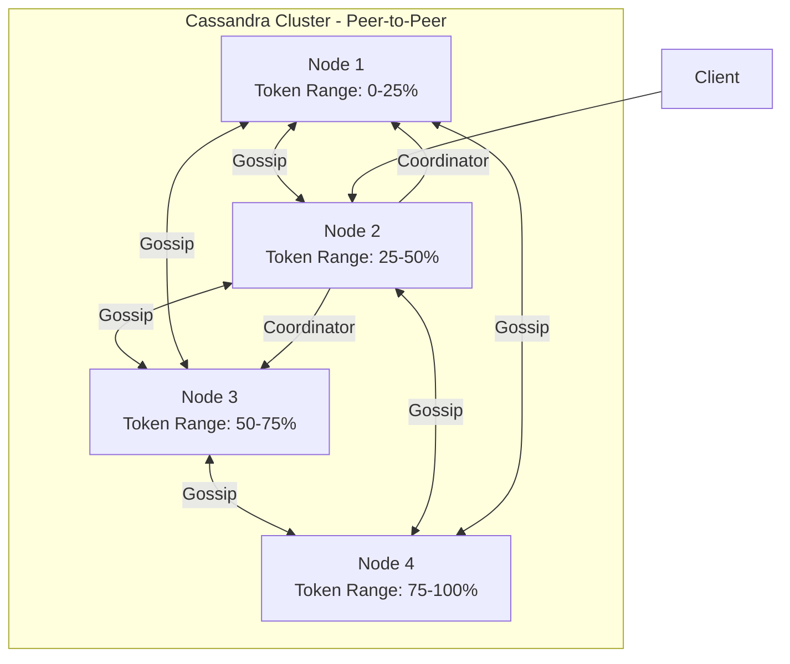
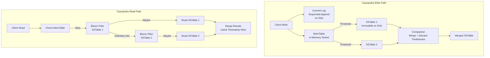

# Cassandra

## 1. Overview

Apache Cassandra is a distributed, wide-column NoSQL database designed for massive write throughput and zero single points of failure. Originally built at Facebook for the inbox search feature, Cassandra combines the distributed architecture of Amazon's Dynamo with the data model of Google's Bigtable to create a system that sustains millions of writes per second across global data centers without a leader node.

Cassandra's defining characteristics are its **peer-to-peer (leaderless) architecture**, **tunable consistency**, and **append-only write path** (commitlog -> MemTable -> SSTable). Every node in a Cassandra cluster is functionally identical. There is no master, no single point of failure, and no need for external coordination services like ZooKeeper. Nodes discover each other and manage cluster membership through the gossip protocol.

When you need to record high-velocity events --- swipes, telemetry, activity feeds, messaging inboxes --- at a scale where a relational database's random I/O becomes the bottleneck, Cassandra is the production-validated answer.

## 2. Why It Matters

- **Netflix**: Sustains 1M+ writes/sec for viewing history, telemetry, and operational data across multiple global data centers.
- **Tinder**: Records 100K+ swipe events per second. The append-only write path avoids B-tree random I/O overhead.
- **Discord**: Stores billions of messages with partition keys designed for time-bucketed retrieval.
- **Apple**: Runs one of the largest Cassandra clusters in the world (hundreds of thousands of nodes) for various backend services.

Cassandra excels when write throughput, availability, and geographic distribution are more important than strong consistency or complex joins.

## 3. Core Concepts

- **Keyspace**: The top-level namespace in Cassandra, analogous to a database in SQL. Defines replication strategy and replication factor.
- **Table**: A collection of rows. Unlike SQL, each row can have different columns (wide-column model).
- **Partition key**: Determines which node stores the data via consistent hashing. A good partition key has high cardinality and even distribution.
- **Clustering key**: Determines the sort order of rows within a partition. Data is physically stored sorted by clustering key on disk.
- **Compound primary key**: `PRIMARY KEY ((partition_key), clustering_key1, clustering_key2)`. The partition key determines placement; clustering keys determine sort order.
- **Replication factor (RF)**: Number of copies of each partition stored across the cluster. RF=3 is the standard.
- **Coordinator node**: The node that receives the client request. It determines which replicas hold the data and forwards the request accordingly.
- **Gossip protocol**: Each node periodically exchanges state information with random peers, building a global cluster view without centralized coordination.
- **Hinted handoff**: When a target replica is temporarily down, the coordinator stores a "hint" and delivers it when the node recovers. This ensures writes are not lost during brief outages.

## 4. How It Works

### Write Path

Cassandra's write path is designed for maximum throughput by avoiding random disk I/O:

1. **Client sends write** to any node (the coordinator).
2. Coordinator determines the responsible replicas via consistent hashing on the partition key.
3. Each replica node:
   a. **Appends to the Commit Log** --- a sequential, append-only file on disk for durability. This is the WAL equivalent.
   b. **Writes to the MemTable** --- an in-memory sorted data structure (typically a skip list or red-black tree).
   c. Returns acknowledgment to the coordinator.
4. Coordinator returns success to the client once the configured consistency level is met (e.g., QUORUM = 2 of 3 replicas ACK).
5. When the MemTable reaches a size threshold, it is **flushed to disk as an immutable SSTable**.
6. **Compaction** periodically merges SSTables in the background, discarding tombstones (deleted data markers) and merging duplicate keys.

All disk writes are sequential (commit log append + SSTable flush). There are no in-place updates, no page splits, and no random seeks on the write path.

### Read Path

1. Client sends read to the coordinator.
2. Coordinator determines replica nodes and queries them per the consistency level.
3. Each replica:
   a. Checks the **MemTable** first (in-memory, fastest).
   b. Checks the **Bloom filter** for each SSTable to determine if the key might exist in that SSTable. Bloom filters return "definitely not here" or "maybe here," avoiding unnecessary disk reads.
   c. Reads matching SSTables from disk, merging results from multiple SSTables (since data for the same partition key can exist across multiple SSTables before compaction).
4. Coordinator compares responses from replicas and returns the most recent value (by timestamp).
5. If replicas disagree, **read repair** is triggered asynchronously to bring stale replicas up to date.

### Tunable Consistency

Cassandra allows per-query consistency levels, trading consistency for latency:

| Level | Behavior | Latency | Availability |
|---|---|---|---|
| **ANY** | Write succeeds if any node (including coordinator via hinted handoff) accepts it | Lowest | Highest (write never fails) |
| **ONE** | At least 1 replica must respond | Low | High |
| **QUORUM** | Majority of replicas must respond (e.g., 2 of 3) | Medium | Medium |
| **LOCAL_QUORUM** | Majority within the local data center | Medium | High for local reads |
| **ALL** | All replicas must respond | Highest | Lowest (fails if any replica is down) |

For strong consistency: `W + R > N` (e.g., QUORUM writes + QUORUM reads with RF=3).

### Compaction Strategies

Compaction is critical for Cassandra's performance. Without it, reads would need to check an ever-growing number of SSTables:

| Strategy | Mechanism | Read Amplification | Write Amplification | Space Amplification | Best For |
|---|---|---|---|---|---|
| **Size-Tiered (STCS)** | Merges similarly-sized SSTables into larger ones | High (many SSTables) | Low | High (temporary 2x during compaction) | Write-heavy workloads |
| **Leveled (LCS)** | Fixed-size levels (L0, L1, ...); each level is 10x the previous | Low (bounded SSTable count per level) | High (rewrite data across levels) | Low | Read-heavy workloads |
| **Time-Window (TWCS)** | Groups SSTables by time window; compacts within windows | Medium | Low | Medium | Time-series / TTL-based data |

**Size-Tiered Compaction (STCS)** is the default. When there are N SSTables of approximately the same size, they are merged into one larger SSTable. The problem: during compaction, both the old and new SSTables exist on disk, temporarily doubling disk usage. For a 1 TB dataset, you need 2 TB of disk to compact safely.

**Leveled Compaction (LCS)** guarantees that each key exists in at most one SSTable per level (except L0). This bounds read amplification to at most 10 SSTable reads (one per level), making reads much more predictable. The cost is higher write amplification, since every compaction may rewrite data from the previous level.

**Time-Window Compaction (TWCS)** is ideal for time-series data with TTL. It groups SSTables into time windows (e.g., 1 hour). When all data in a window has expired via TTL, the entire SSTable is dropped without compaction. This is dramatically more efficient than STCS or LCS for TTL-heavy workloads.

### Data Modeling Principles

Cassandra data modeling follows a fundamentally different philosophy from relational modeling:

1. **Start with queries, not entities**: In SQL, you normalize data and write queries later. In Cassandra, you design tables to serve specific queries. One table per query pattern is common.

2. **Denormalize aggressively**: If two queries need the same data in different orders, create two tables with the data duplicated. Storage is cheap; cross-partition joins are not possible.

3. **Design partition keys for even distribution**: The partition key determines which node stores the data. Skewed partition keys create hot spots. Use high-cardinality fields like `user_id` or `device_id`.

4. **Use clustering keys for sort order**: Within a partition, rows are physically sorted by clustering key on disk. Design the clustering key to match your query's ORDER BY clause.

5. **Limit partition size**: A single partition should not exceed 100 MB or 100K rows. For unbounded data (like a chat channel with millions of messages), bucket by time: `PRIMARY KEY ((channel_id, month), message_timestamp)`.

Example --- Two tables for the same user data, serving different queries:

```cql
-- Query 1: Get user's posts sorted by time
CREATE TABLE posts_by_user (
    user_id UUID,
    post_time TIMESTAMP,
    post_id UUID,
    content TEXT,
    PRIMARY KEY ((user_id), post_time)
) WITH CLUSTERING ORDER BY (post_time DESC);

-- Query 2: Get a specific post by ID
CREATE TABLE posts_by_id (
    post_id UUID,
    user_id UUID,
    post_time TIMESTAMP,
    content TEXT,
    PRIMARY KEY (post_id)
);
```

Both tables contain the same data. The application writes to both on every post creation. This is the Cassandra way.

## 5. Architecture / Flow





## 6. Types / Variants

| Variant | Description | Use Case |
|---|---|---|
| **Apache Cassandra** | Open-source, self-managed | Full control, existing ops expertise |
| **DataStax Enterprise (DSE)** | Commercial distribution with search, analytics, graph | Enterprise features, vendor support |
| **Amazon Keyspaces** | Serverless, CQL-compatible managed service | AWS-native, zero ops |
| **ScyllaDB** | C++ rewrite of Cassandra, shard-per-core architecture | When you need 10x Cassandra throughput |
| **Azure Managed Cassandra** | Hybrid managed service | Azure ecosystem |

### Anti-Entropy and Repair

Even with hinted handoff, replicas can drift out of sync (e.g., if a node was down longer than the hint window, or if hints were lost). Cassandra uses **anti-entropy repair** to reconcile replicas:

1. **Merkle tree comparison**: Each replica builds a hash tree of its data. Replicas compare their trees to identify ranges where data differs.
2. **Streaming repair**: Only the differing ranges are streamed between replicas, minimizing network traffic.
3. **Full repair**: Administrators should run `nodetool repair` periodically (weekly is common) to ensure all replicas converge.

Without regular repairs, read queries may return stale data even with QUORUM consistency, because replicas that missed updates during brief outages may never receive them.

### Tombstones and Deletion

In an append-only storage system, deletes cannot simply remove data. Instead, a **tombstone** marker is written, indicating that the key has been deleted. Tombstones are propagated to replicas and eventually cleaned up during compaction.

Tombstone-related issues:
- **Read performance degradation**: The read path must scan through tombstones. A partition with millions of tombstones (e.g., from a mass-delete operation) can cause read timeouts.
- **gc_grace_seconds**: Tombstones are retained for `gc_grace_seconds` (default: 10 days) to ensure all replicas learn about the deletion. Lowering this value reduces tombstone accumulation but risks resurrecting deleted data if a replica that missed the tombstone is repaired after the grace period.
- **Monitoring**: Watch for `TombstoneOverwhelmingException` in logs --- this indicates a partition has too many tombstones.

### Lightweight Transactions (LWT)

For operations requiring compare-and-swap semantics (e.g., creating a unique username), Cassandra provides Lightweight Transactions using Paxos consensus:

```cql
INSERT INTO users (username, email)
VALUES ('alice', 'alice@example.com')
IF NOT EXISTS;
```

LWTs are significantly slower than regular writes (4 round-trips instead of 1) because they require a Paxos consensus round. Use them sparingly --- only for operations where optimistic concurrency is insufficient.

## 7. Use Cases

- **Netflix viewing history**: Partition key = `user_id`, clustering key = `timestamp DESC`. Each user's viewing history is stored in a single partition, sorted by time. RF=3 across 3 data centers with LOCAL_QUORUM consistency.
- **Tinder swipe storage**: Partition key = `user_id`, clustering key = `swiped_user_id`. Append-only writes at 100K/sec. Data is TTL'd after 30-90 days to manage storage growth.
- **Discord messages**: Partition key = `(channel_id, bucket)`, clustering key = `message_id`. Time-bucketed partitions prevent unbounded partition growth for active channels.
- **Instagram activity feed**: Partition key = `user_id`, clustering key = `activity_timestamp DESC`. Pre-computed feeds stored for O(1) read access.
- **IoT telemetry**: Partition key = `(device_id, day)`, clustering key = `timestamp`. Time-Window Compaction Strategy (TWCS) efficiently manages TTL-based data expiration.

## 8. Tradeoffs

| Advantage | Disadvantage |
|---|---|
| Linear horizontal scaling (add nodes, capacity grows) | No joins; data must be denormalized per query pattern |
| No single point of failure (peer-to-peer) | Query-driven data modeling requires upfront design effort |
| Tunable consistency per query | Eventual consistency (default) can serve stale data |
| Massive write throughput (sequential I/O) | Read path can be slow without proper Bloom filter tuning |
| Multi-datacenter replication built-in | Compaction causes temporary disk space spikes and latency |
| Gossip protocol eliminates coordinator dependency | Repair operations (anti-entropy) are operationally complex |

## 9. Common Pitfalls

- **Low-cardinality partition keys**: A partition key like `country` (200 values for billions of rows) creates massive, unbalanced partitions. Use high-cardinality keys like `user_id`.
- **Unbounded partition growth**: A partition key of `channel_id` for a messaging app means a single active channel grows indefinitely. Bucket by time: `(channel_id, month)`.
- **Reading before compaction settles**: After a bulk load, reads may span dozens of SSTables until compaction catches up. Monitor pending compaction tasks.
- **Not using prepared statements**: Unprepared CQL statements are re-parsed on every execution. Prepared statements reduce coordinator CPU by 50%+.
- **Ignoring tombstone accumulation**: Deleted data creates tombstones that persist until compaction. Heavy delete workloads can cause "tombstone overflow" warnings and degraded read performance.
- **Using Cassandra for small datasets**: If your data fits on a single PostgreSQL node, Cassandra's operational complexity is not justified. Use Cassandra when you genuinely need distributed write throughput.

## 10. Real-World Examples

- **Netflix**: One of the largest Cassandra deployments globally. Uses Cassandra for subscriber state, viewing history, and operational telemetry. Custom tooling (Priam) automates backup and recovery.
- **Apple**: Reportedly operates 150,000+ Cassandra nodes for various backend services including iCloud and App Store.
- **Uber**: Uses Cassandra alongside MySQL and Redis for real-time telemetry and geospatial data.
- **Discord**: Migrated messages from MongoDB to Cassandra for better write throughput and partition-based access patterns. Later migrated to ScyllaDB for further performance gains.
- **Spotify**: Uses Cassandra for user activity data and playlist metadata, leveraging multi-datacenter replication for global availability.

## 11. Related Concepts

- [NoSQL Databases](./nosql-databases.md) --- Cassandra as a wide-column store in the NoSQL taxonomy
- [Database Indexing](./database-indexing.md) --- LSM trees, SSTables, and Bloom filters
- [Database Replication](./database-replication.md) --- leaderless replication and quorum consistency
- [Consistent Hashing](../scalability/consistent-hashing.md) --- token ring and virtual nodes for data placement
- [CAP Theorem](../fundamentals/cap-theorem.md) --- tunable consistency as a CAP tradeoff

## 12. Source Traceability

- source/youtube-video-reports/2.md (Cassandra write path, Netflix 1M writes/sec, Tinder swipes)
- source/youtube-video-reports/3.md (Cassandra for high-write, Tinder use case)
- source/youtube-video-reports/6.md (Gossip protocol, partitioning, consistency models)
- source/youtube-video-reports/7.md (Cassandra deep dive: keyspace, partition key, clustering key, tunable consistency, write path, read path, Bloom filters, compaction, gossip)
- source/extracted/ddia/ch04-storage-and-retrieval.md (LSM trees, SSTables, compaction)
- source/extracted/ddia/ch07-replication.md (Leaderless replication, quorum)
