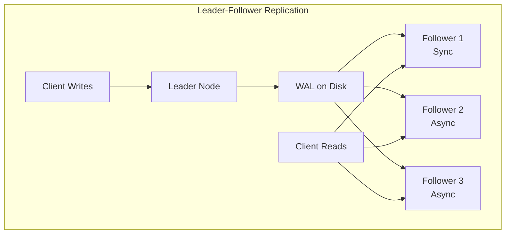
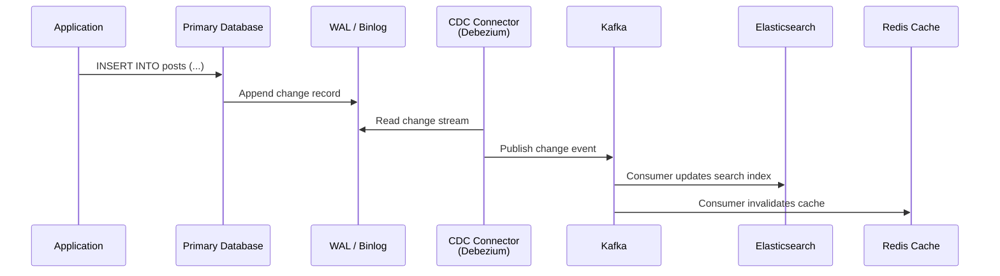
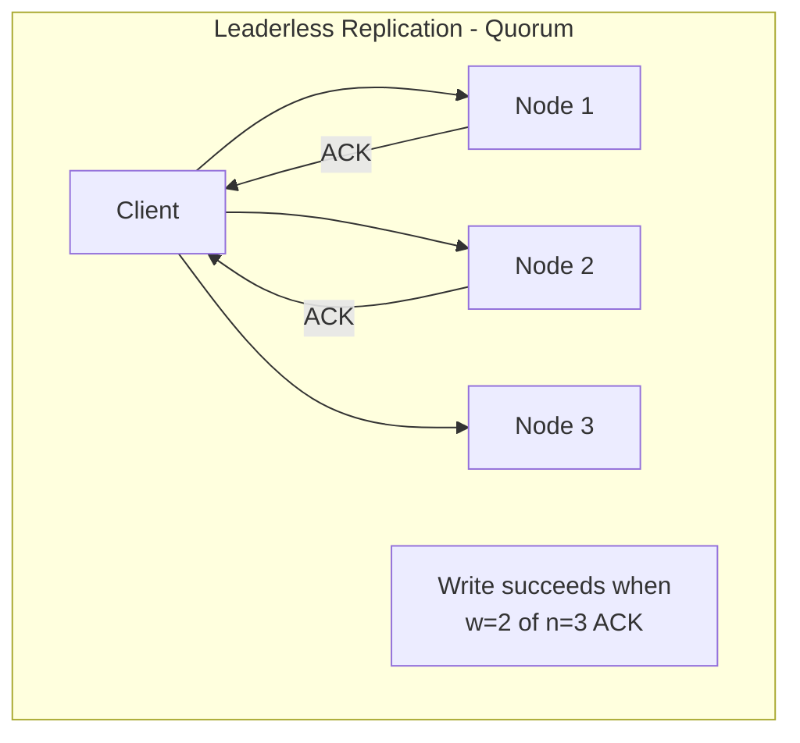

# Database Replication

## 1. Overview

Replication means maintaining copies of the same data on multiple machines connected by a network. It serves three purposes that cannot be achieved with a single node: **geographic proximity** (reduce latency by placing data near users), **fault tolerance** (survive node failures without data loss), and **read scalability** (distribute read load across replicas).

The difficulty of replication is not in copying data once --- it is in handling changes to replicated data continuously, especially when nodes fail, networks partition, or writes arrive concurrently at multiple locations. Every replication strategy makes a tradeoff between consistency, availability, and latency. The three fundamental topologies --- leader/follower, multi-leader, and leaderless --- represent distinct points on this tradeoff spectrum.

## 2. Why It Matters

A database without replication is a single point of failure. When that node goes down, your service goes down. Period.

- **Availability**: Leader/follower replication with automatic failover gives you 99.99%+ uptime.
- **Read throughput**: A single PostgreSQL leader serving 10K writes/sec can be augmented with 15 read replicas, each handling its own read load.
- **Disaster recovery**: Cross-region replication ensures data survives data center failures.
- **Real-time data pipelines**: WAL and CDC enable streaming database changes to search indexes, caches, and analytics systems without polluting application logic.

## 3. Core Concepts

- **Leader (primary/master)**: The node that accepts all writes and propagates changes to followers.
- **Follower (replica/secondary)**: A read-only node that receives and applies changes from the leader.
- **Replication log**: The ordered stream of changes sent from leader to followers. In PostgreSQL this is the WAL; in MySQL, the binlog.
- **Replication lag**: The delay between a write on the leader and its application on a follower. Measured in seconds under normal conditions; minutes or hours under failure.
- **Synchronous replication**: The leader waits for the follower to confirm before acknowledging the write to the client. Guarantees consistency but increases write latency.
- **Asynchronous replication**: The leader acknowledges immediately; followers apply changes in the background. Lower latency but risks data loss on leader failure.
- **Semi-synchronous**: One follower is synchronous (guaranteeing at least one up-to-date copy); the rest are asynchronous.
- **Failover**: Promoting a follower to leader when the current leader fails. Can be automatic or manual.
- **Split-brain**: A dangerous condition where two nodes both believe they are the leader, accepting conflicting writes.

## 4. How It Works

### Write-Ahead Log (WAL) Shipping

The WAL is an append-only record of every mutation applied to the database. PostgreSQL and MySQL use WAL shipping for replication:

1. Leader writes the change to its WAL on disk.
2. Leader streams WAL entries to followers over the network.
3. Each follower applies WAL entries to its local data files in order.
4. On failover, the promoted follower replays any un-applied WAL entries to catch up.

The WAL captures changes at the storage-engine level (page modifications), making it a physical replication mechanism. This is efficient but ties replicas to the same database engine version.

### Change Data Capture (CDC)

CDC captures row-level changes (INSERT, UPDATE, DELETE) from the database's transaction log and publishes them as an event stream:

1. A CDC connector (e.g., Debezium) reads the database's WAL/binlog.
2. Each change is published as a structured event to a message broker (Kafka).
3. Downstream consumers --- search indexes (Elasticsearch), caches (Redis), analytics systems --- subscribe to these events.

CDC provides the critical benefit of keeping derived data stores synchronized with the source of truth **without coupling application code** to those downstream systems. The application writes to the database; CDC propagates changes everywhere else.

### Quorum Reads and Writes

In leaderless systems (Cassandra, DynamoDB), reads and writes are sent to multiple replicas simultaneously. The quorum formula ensures consistency:

```
w + r > n
```

Where:
- **n** = total number of replicas
- **w** = number of replicas that must acknowledge a write
- **r** = number of replicas that must respond to a read

With n=3, w=2, r=2: reads always see at least one replica with the latest write. This is **tunable consistency** --- you can adjust w and r per query to trade consistency for latency.

### Gossip Protocol

Decentralized systems (Cassandra, Redis Cluster) use gossip for node discovery and failure detection:

1. Each node periodically selects a random subset of peers ("fan out").
2. It exchanges state information (heartbeats, membership lists, load metrics) with those peers.
3. Those peers propagate the information to their own random subsets.
4. Within O(log n) rounds, the entire cluster has a consistent view of membership.

Gossip avoids the single-point-of-failure of centralized coordinators like ZooKeeper while converging quickly even in large clusters. See [CAP Theorem](../fundamentals/cap-theorem.md) for how gossip relates to consistency models.

### Handling Node Outages

**Follower failure (catch-up recovery)**:
1. The follower maintains a log of the last WAL position it processed.
2. On restart, it connects to the leader and requests all changes since that position.
3. The follower applies the backlog and eventually catches up to the leader.

**Leader failure (failover)**:
1. A monitoring system (or consensus protocol) detects that the leader is unresponsive.
2. A follower with the most recent data is promoted to be the new leader.
3. Clients and other followers are reconfigured to write to the new leader.
4. The old leader, if it comes back, must become a follower and discard any writes it had not yet replicated.

Failover is one of the most dangerous operations in database management. Common failure modes:

- **Data loss**: If the promoted follower was behind the old leader, writes that existed only on the old leader are permanently lost.
- **Split-brain**: Both the old and new leader accept writes simultaneously, causing divergent data. This must be prevented by **fencing** the old leader (STONITH: Shoot The Other Node In The Head) --- forcibly shutting it down or revoking its network access.
- **Stale reads during transition**: Clients that were reading from the old leader may see stale data if they do not switch to the new leader promptly.

### Setting Up New Followers

Adding a new follower without downtime requires a specific sequence:

1. Take a consistent snapshot of the leader's data at a known WAL position.
2. Copy the snapshot to the new follower.
3. The follower connects to the leader and requests all WAL entries since the snapshot position.
4. Once the backlog is applied, the follower is caught up and begins normal replication.

PostgreSQL provides `pg_basebackup` for this workflow; MySQL uses `mysqldump` with `--master-data` or `xtrabackup`.

### Multi-Leader Replication

In multi-leader (also called multi-master) replication, multiple nodes accept writes. This topology is primarily used for **multi-datacenter deployments** where each datacenter has its own leader:

- Each datacenter's leader handles local writes with low latency.
- Changes are asynchronously replicated between leaders across datacenters.
- **Conflict resolution** is required when the same data is modified concurrently at different leaders.

Common conflict resolution strategies:
- **Last Write Wins (LWW)**: The write with the highest timestamp wins. Simple but can silently discard data.
- **Custom merge functions**: Application-specific logic to merge concurrent changes (e.g., union of sets, concatenation of lists).
- **Conflict-free Replicated Data Types (CRDTs)**: Data structures that can be merged automatically without conflicts (e.g., counters, sets, registers).

Multi-leader replication is used by Google Docs (via Operational Transformation), CouchDB (via revision trees), and Cassandra (via tunable consistency).

## 5. Architecture / Flow







## 6. Types / Variants

### Replication Topologies

| Topology | Write Targets | Conflict Handling | Latency | Use Case |
|---|---|---|---|---|
| **Leader/Follower** | Single leader only | No conflicts (single writer) | Write latency = leader round-trip | Most OLTP workloads (Postgres, MySQL) |
| **Multi-Leader** | Multiple leaders | Requires conflict resolution (LWW, merge) | Lower write latency (local leader) | Multi-datacenter deployments |
| **Leaderless** | Any node | Read repair, anti-entropy, quorum | Tunable | Cassandra, DynamoDB, Riak |

### Synchronous vs Asynchronous

| Dimension | Synchronous | Asynchronous | Semi-Synchronous |
|---|---|---|---|
| **Consistency** | Strong (follower always up-to-date) | Eventual (follower may lag) | One follower guaranteed current |
| **Write latency** | High (wait for follower ACK) | Low (return immediately) | Medium |
| **Durability on leader failure** | No data loss | Potential data loss | At most 1 un-replicated write |
| **Availability** | Lower (blocked if follower is down) | Higher (leader never blocked) | Moderate |

### Replication Lag Anomalies

| Anomaly | Description | Mitigation |
|---|---|---|
| **Reading stale data** | Follower has not yet applied the latest write | Read from leader for critical reads |
| **Read-your-own-writes** | User updates profile, reads from follower, sees old data | Route user's reads to leader for a window after write |
| **Monotonic reads** | User sees newer data, then older data (different followers) | Pin user to a specific follower |
| **Causally inconsistent** | Reply appears before the original comment | Track causal dependencies via version vectors |

## 7. Use Cases

- **PostgreSQL streaming replication**: Leader handles writes; read replicas serve analytics dashboards and reporting queries.
- **MySQL binlog replication**: GitHub uses MySQL with multiple read replicas to serve billions of API requests against the git metadata layer.
- **CDC with Debezium + Kafka**: Elasticsearch search indexes are kept synchronized with the primary database without application-level dual-writes. Used for full-text search at companies like LinkedIn.
- **Cassandra leaderless replication**: Netflix replicates viewing history across 3 data centers with tunable consistency (QUORUM for writes, ONE for reads).
- **Multi-leader replication**: Google Docs uses a form of multi-leader replication (operational transformation) to allow concurrent editing across multiple clients.

## 8. Tradeoffs

| Advantage | Disadvantage |
|---|---|
| Fault tolerance: survive node failures | Replication lag introduces stale reads |
| Read scalability: distribute load across replicas | Failover is complex; split-brain is dangerous |
| Geographic distribution: reduce latency for global users | Multi-leader and leaderless require conflict resolution |
| CDC enables real-time derived data stores | CDC adds infrastructure complexity (Kafka, connectors) |
| Quorum provides tunable consistency | Lower quorum values sacrifice consistency for availability |

## 9. Common Pitfalls

- **Not monitoring replication lag**: A replica that falls 30 minutes behind is worse than no replica --- it silently serves stale data. Alert on lag exceeding your tolerance (typically seconds).
- **Automatic failover without fencing**: If the old leader comes back online after failover, it may still accept writes, causing split-brain. Implement STONITH (Shoot The Other Node In The Head) or leader fencing.
- **Assuming CDC is zero-latency**: Debezium + Kafka adds 100ms-2s of propagation delay. Your search index will lag behind the primary database. Design your UX accordingly.
- **Using last-write-wins (LWW) without understanding data loss**: In multi-leader or leaderless systems, LWW silently discards concurrent writes. This is acceptable for "likes" counts but catastrophic for financial transactions.
- **Not testing failover**: A failover procedure that has never been tested will fail when you need it most. Regularly practice by killing the leader in staging.

## 10. Real-World Examples

- **Amazon Aurora**: Separates compute (query processing) from storage (6-way replicated across 3 AZs). The storage layer replicates at the page level, achieving 15 read replicas with sub-100ms lag.
- **LinkedIn**: Uses CDC (Databus, later Brooklin) to stream MySQL changes to Espresso, Kafka, and search indexes, maintaining consistency across a polyglot persistence layer.
- **Uber**: Uses MySQL with custom tooling for cross-datacenter replication, handling the tradeoff between latency and consistency for ride dispatch.
- **Netflix**: Cassandra leaderless replication across 3+ regions with QUORUM writes ensures that viewing history survives full data center outages.
- **Shopify**: Uses MySQL leader/follower replication with ProxySQL for connection routing, serving millions of e-commerce stores.

## 11. Related Concepts

- [SQL Databases](./sql-databases.md) --- WAL and ACID transactions depend on replication for durability
- [Cassandra](./cassandra.md) --- leaderless replication with tunable consistency
- [DynamoDB](./dynamodb.md) --- DynamoDB Streams as a CDC mechanism
- [CAP Theorem](../fundamentals/cap-theorem.md) --- consistency models and partition tolerance
- [Consistent Hashing](../scalability/consistent-hashing.md) --- data placement in leaderless replication

## 12. Source Traceability

- source/youtube-video-reports/6.md (Consistency models, gossip protocol, strong vs eventual)
- source/youtube-video-reports/7.md (Cassandra replication, Bloom filters, compaction)
- source/youtube-video-reports/8.md (Consistent hashing, CAP theorem)
- source/extracted/ddia/ch07-replication.md (Leader-follower, multi-leader, leaderless, synchronous vs async, replication lag, quorum, WAL shipping)
- source/extracted/ddia/ch14-stream-processing.md (CDC, event streams)
- source/extracted/acing-system-design/ch06-scaling-databases.md (Replication strategies)
