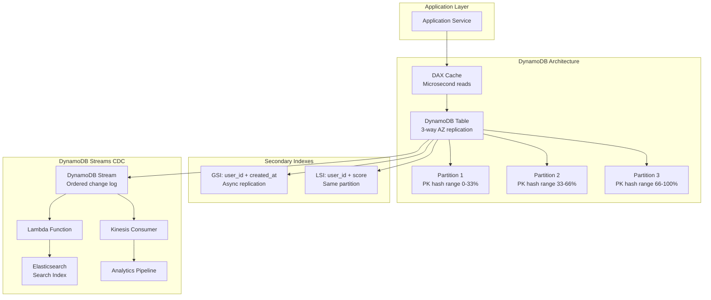
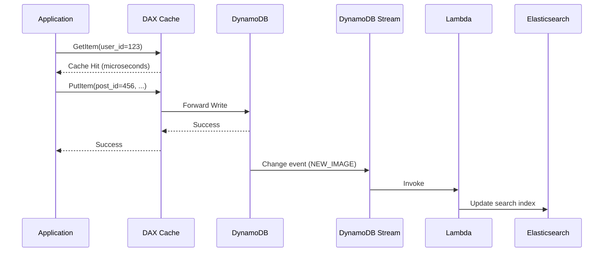

# DynamoDB

## 1. Overview

Amazon DynamoDB is a fully managed, serverless NoSQL database that delivers single-digit millisecond latency at any scale. It uses a key-value and document data model with a primary key architecture of **partition key + optional sort key**, enabling both point lookups and efficient range queries within a partition.

DynamoDB distinguishes itself from self-managed NoSQL databases (Cassandra, MongoDB) through its operational simplicity: there are no nodes to provision, no replication to configure, and no compaction to tune. You define a table, choose your primary key, set capacity (provisioned or on-demand), and AWS handles everything else --- from data placement via consistent hashing to automatic 3-way replication across availability zones.

Since 2018, DynamoDB supports ACID transactions across up to 100 items, bridging the gap between NoSQL scalability and relational reliability. Combined with DynamoDB Streams (CDC), DAX (write-through cache), and Global Secondary Indexes (GSI), it serves as the backbone for high-scale systems at Amazon, Lyft, Airbnb, and thousands of other organizations.

## 2. Why It Matters

DynamoDB powers Amazon.com's shopping cart --- one of the highest-traffic e-commerce systems in the world. The architecture was born from Amazon's Dynamo paper (2007), which demonstrated that a highly available key-value store with tunable consistency could serve millions of requests per second without the operational burden of managing database clusters.

For system design:
- **Zero-ops scaling**: Capacity scales automatically without downtime or manual intervention.
- **Predictable performance**: Single-digit millisecond latency regardless of table size (1 KB or 1 PB).
- **Transactions at scale**: ACID transactions across up to 100 items eliminate the "NoSQL means no transactions" assumption.
- **Event-driven integration**: DynamoDB Streams provides CDC for real-time downstream processing.

## 3. Core Concepts

- **Partition key (PK)**: Determines which physical partition stores the item via internal consistent hashing. Must have high cardinality.
- **Sort key (SK)**: Optional. Enables range queries within a partition. Items with the same PK are stored together, sorted by SK.
- **Composite primary key**: `(PK, SK)` together form a unique identifier. Without a sort key, PK alone must be unique.
- **Item**: A single record in the table, analogous to a row. Each item can have different attributes (schemaless).
- **Attribute**: A name-value pair within an item. Supports strings, numbers, binary, sets, lists, and maps.
- **Global Secondary Index (GSI)**: A separate index with a completely different PK and SK from the base table. Enables queries on attributes that are not the table's primary key.
- **Local Secondary Index (LSI)**: Shares the same PK as the base table but uses a different SK. Must be created at table creation time.
- **DAX (DynamoDB Accelerator)**: A fully managed, in-memory write-through cache that sits between the application and DynamoDB, providing microsecond read latency.
- **DynamoDB Streams**: An ordered, time-windowed stream of item-level changes (INSERT, UPDATE, DELETE) --- DynamoDB's CDC mechanism.
- **Provisioned capacity**: Pre-allocated Read Capacity Units (RCU) and Write Capacity Units (WCU) for predictable costs.
- **On-demand capacity**: Pay-per-request pricing for unpredictable workloads.

## 4. How It Works

### Primary Key Architecture

DynamoDB distributes data across partitions using consistent hashing on the partition key. Within each partition, items are stored as a B-tree indexed by the sort key.

**Partition key only** (`user_id`):
- Each item is located by hashing `user_id` to a partition.
- Good for: user profiles, session stores, configuration.

**Composite key** (`user_id`, `timestamp`):
- All items with the same `user_id` are stored together in one partition, sorted by `timestamp`.
- Good for: chat messages, order history, activity feeds.
- Enables: `Query WHERE user_id = X AND timestamp BETWEEN A AND B`.

### Global Secondary Index (GSI)

A GSI is a fully separate copy of the data with its own partition key and sort key:

| Base Table PK | Base Table SK | GSI PK | GSI SK | Use Case |
|---|---|---|---|---|
| `post_id` | `created_at` | `user_id` | `created_at` | Find all posts by a user |
| `order_id` | `line_item_id` | `status` | `updated_at` | Find all pending orders |

GSIs are eventually consistent by default. Writes to the base table are asynchronously propagated to the GSI. GSIs have their own provisioned capacity, so a hot GSI can throttle independently.

### Local Secondary Index (LSI)

An LSI shares the same partition key as the base table but provides an alternative sort key:

| Base Table PK | Base Table SK | LSI SK | Use Case |
|---|---|---|---|
| `user_id` | `created_at` | `attachment_count` | Sort user's messages by attachment count |

LSIs are strongly consistent (they share the partition with the base table). They must be defined at table creation time and cannot be added later.

### DAX (DynamoDB Accelerator)

DAX is a write-through, in-memory cache:

1. **Read path**: Application queries DAX first. On cache hit, DAX returns in microseconds. On cache miss, DAX fetches from DynamoDB, caches the result, and returns it.
2. **Write path**: Application writes go through DAX to DynamoDB. DAX updates its cache and forwards the write to DynamoDB.
3. **Benefit**: Reduces DynamoDB read costs (fewer RCUs consumed) and provides microsecond latency for hot items.

### DynamoDB Streams (CDC)

DynamoDB Streams captures a time-ordered log of item-level changes:

1. An item is inserted, updated, or deleted in the base table.
2. The change appears in the DynamoDB Stream within milliseconds.
3. AWS Lambda functions or Kinesis consumers process the stream events.
4. Downstream systems (Elasticsearch, analytics, notifications) are updated.

Stream records contain the old and/or new image of the item, depending on configuration (KEYS_ONLY, NEW_IMAGE, OLD_IMAGE, NEW_AND_OLD_IMAGES).

### Conditional Writes

DynamoDB supports conditional expressions on writes, enabling optimistic concurrency control without explicit locking:

```
PutItem(
    TableName = "accounts",
    Item = { "account_id": "123", "balance": 800, "version": 2 },
    ConditionExpression = "version = :expected_version",
    ExpressionAttributeValues = { ":expected_version": 1 }
)
```

If the condition fails (another writer incremented the version), DynamoDB returns a `ConditionalCheckFailedException` and the write is rejected. The application can retry with the updated version.

This pattern is essential for:
- **Preventing double-booking**: Only one user can reserve a seat if the status is "available."
- **Optimistic locking**: Update a record only if it has not been modified since last read.
- **Idempotent writes**: Prevent duplicate processing of the same event.

### ACID Transactions

Since 2018, DynamoDB supports `TransactWriteItems` and `TransactGetItems`:

- Up to **100 items** across multiple tables in a single atomic transaction.
- All-or-nothing semantics: if any condition check fails, the entire transaction is rolled back.
- Supports conditional writes (e.g., "only transfer money if balance >= amount").
- Cost: transactions consume 2x the WCU/RCU of non-transactional operations.

## 5. Architecture / Flow





## 6. Types / Variants

### DynamoDB Capacity Modes

| Mode | Pricing | Best For | Throttling |
|---|---|---|---|
| **Provisioned** | Pre-allocated RCU/WCU | Predictable traffic (e.g., business hours) | Throttled if exceeded |
| **On-Demand** | Per-request pricing | Unpredictable spikes | Auto-scales (no throttling) |
| **Reserved Capacity** | Discounted provisioned | Steady-state workloads (1 or 3 year term) | Same as provisioned |

### DynamoDB vs Other NoSQL

| Feature | DynamoDB | Cassandra | MongoDB |
|---|---|---|---|
| **Managed** | Fully managed (serverless) | Self-managed or DSE | Atlas (managed) or self-managed |
| **Data model** | Key-value + document | Wide-column | Document |
| **Consistency** | Strong or eventual (per-read) | Tunable (ANY to ALL) | Tunable (writeConcern, readConcern) |
| **Transactions** | Up to 100 items, ACID | Lightweight transactions (LWT) | Multi-document ACID |
| **Scaling** | Automatic partitioning | Manual ring management | Auto-sharding (mongos) |
| **CDC** | DynamoDB Streams | CDC via Debezium | Change Streams |

### Single-Table Design Pattern

DynamoDB best practices often advocate for a **single-table design** where multiple entity types coexist in one table with overloaded key attributes:

| PK | SK | Data |
|---|---|---|
| `USER#123` | `PROFILE` | `{name: "Alice", email: "alice@example.com"}` |
| `USER#123` | `ORDER#2025-001` | `{total: 59.99, status: "shipped"}` |
| `USER#123` | `ORDER#2025-002` | `{total: 129.00, status: "pending"}` |
| `ORDER#2025-001` | `ITEM#1` | `{product: "Widget", qty: 2}` |

With this design:
- **Get user profile**: `Query PK=USER#123, SK=PROFILE`
- **Get user's orders**: `Query PK=USER#123, SK begins_with ORDER#`
- **Get order items**: `Query PK=ORDER#2025-001, SK begins_with ITEM#`

This pattern eliminates the need for multiple tables and reduces the number of GSIs, but it requires careful upfront design and makes the table schema less intuitive to developers accustomed to relational modeling.

### Capacity Planning

**Provisioned mode capacity units:**
- 1 RCU = 1 strongly consistent read/sec for items up to 4 KB
- 1 RCU = 2 eventually consistent reads/sec for items up to 4 KB
- 1 WCU = 1 write/sec for items up to 1 KB

A table with 10,000 reads/sec of 2 KB items needs 10,000 RCU (strong) or 5,000 RCU (eventual). A table with 5,000 writes/sec of 3 KB items needs 15,000 WCU (each write consumes ceil(3/1) = 3 WCU).

**On-demand mode** eliminates capacity planning entirely: DynamoDB auto-scales to handle any traffic pattern. The per-request cost is approximately 5x higher than well-provisioned capacity, making it ideal for unpredictable workloads but expensive for steady-state traffic.

**Auto-scaling** (provisioned mode) uses CloudWatch alarms to adjust capacity based on utilization, targeting a configurable utilization percentage (typically 70%). This provides a middle ground between the cost-efficiency of provisioned mode and the flexibility of on-demand.

## 7. Use Cases

- **Amazon shopping cart**: Partition key = `customer_id`, sort key = `product_id`. On-demand capacity handles Black Friday traffic spikes without provisioning.
- **Facebook News Feed (alternative design)**: Partition key = `user_id`, sort key = `post_timestamp`. GSI on `author_id + timestamp` for "find all posts by user."
- **WhatsApp message inbox**: Partition key = `recipient_user_id`, sort key = `message_id`. Range queries retrieve latest messages. DynamoDB Streams triggers push notifications via Lambda.
- **Lyft ride history**: Partition key = `rider_id`, sort key = `ride_timestamp`. DAX caches frequent lookups for the ride history screen.
- **Real-time gaming leaderboard (alternative to Redis)**: Write sharding with partition key = `game#{month}#p{partition}`, sort key = `score`. Scatter-gather across partitions for top-K queries.

## 8. Tradeoffs

| Advantage | Disadvantage |
|---|---|
| Zero operational overhead (fully managed) | Vendor lock-in to AWS ecosystem |
| Single-digit ms latency at any scale | Query patterns must be designed upfront (no ad-hoc joins) |
| ACID transactions (up to 100 items) | Transactions cost 2x normal RCU/WCU |
| DynamoDB Streams for CDC | GSIs are eventually consistent (no strong consistency option) |
| Auto-scaling with on-demand mode | Hot partition key can throttle entire table |
| DAX provides microsecond reads | DAX adds infrastructure cost and eventual-consistency layer |

## 9. Common Pitfalls

- **Hot partition keys**: All items for a viral celebrity land on the same partition. Use **write sharding**: append a random suffix (`user_123_0`, `user_123_1`, ..., `user_123_N`) to distribute load. Read requires scatter-gather across N suffixed keys.
- **Scan instead of Query**: `Scan` reads every item in the table. `Query` reads only items matching the partition key. Always use `Query` with a partition key filter.
- **Over-provisioning GSIs**: Each GSI is a full copy of selected attributes. Five GSIs on a 100 GB table can cost 500 GB of storage.
- **Forgetting LSI limits**: LSIs must be created at table creation. Maximum of 5 LSIs per table. If you need more flexibility, use GSIs.
- **Not designing for single-table patterns**: DynamoDB best practices often use a single table with overloaded partition/sort keys to serve multiple entity types and access patterns.
- **Ignoring item size limits**: Maximum item size is 400 KB. Store large objects in S3 and keep only the reference in DynamoDB.

## 10. Real-World Examples

- **Amazon.com**: DynamoDB was designed to replace Dynamo, Amazon's internal key-value store. It powers the shopping cart, session management, and catalog services.
- **Airbnb**: Uses DynamoDB for search session data and availability calendars, leveraging on-demand capacity for variable traffic patterns.
- **Capital One**: Uses DynamoDB for real-time fraud detection, processing millions of transactions per second with DAX for low-latency reads.
- **Samsung**: Uses DynamoDB for SmartThings IoT platform, storing billions of device events with partition keys on `device_id`.
- **Redfin**: Uses DynamoDB Streams to synchronize property data changes to Elasticsearch for real-time search.

## 11. Related Concepts

- [NoSQL Databases](./nosql-databases.md) --- DynamoDB in the NoSQL taxonomy
- [Database Indexing](./database-indexing.md) --- B-tree sort keys within partitions
- [Database Replication](./database-replication.md) --- DynamoDB Streams as CDC
- [Consistent Hashing](../scalability/consistent-hashing.md) --- internal partition placement
- [Caching](../caching/caching.md) --- DAX as a write-through cache pattern

## 12. Source Traceability

- source/youtube-video-reports/5.md (DynamoDB PK/SK, GSI/LSI, DAX, Streams, ACID transactions, consistency models, Facebook News Feed, WhatsApp)
- source/youtube-video-reports/7.md (Data modeling, Cassandra comparison)
- source/extracted/alex-xu-vol2/ch11-real-time-gaming-leaderboard.md (DynamoDB for leaderboard: write sharding, scatter-gather, GSI design)
- source/extracted/ddia/ch07-replication.md (Dynamo-style replication)
