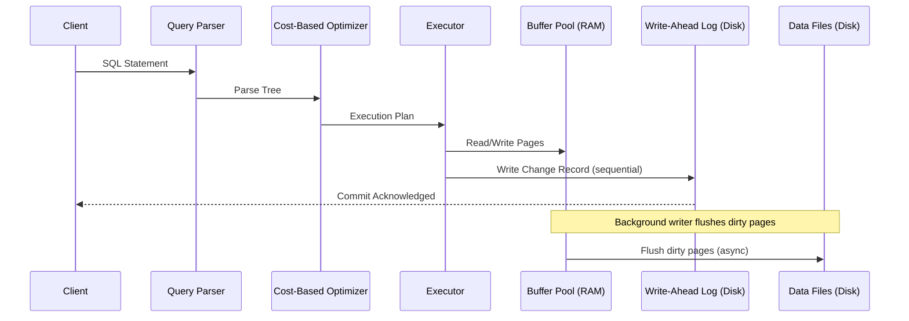
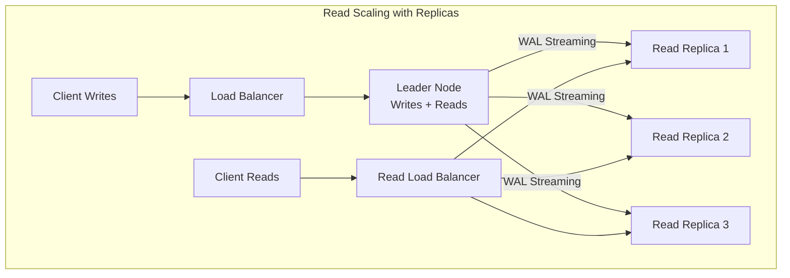
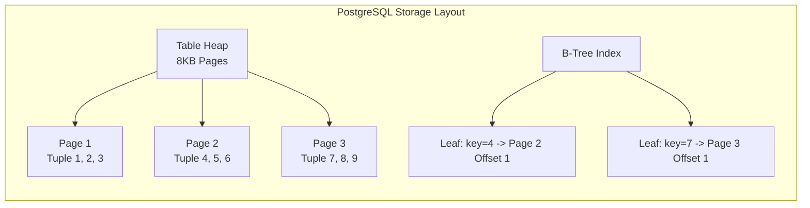

# SQL Databases

## 1. Overview

A relational database organizes data into tables of rows and columns, enforced by a rigid schema that defines the shape of every record before a single byte is written. The relational model --- invented by Edgar Codd in 1970 and battle-hardened over five decades --- remains the default choice when your system requires structured data with complex relationships, transactional integrity, and flexible ad-hoc querying via SQL.

PostgreSQL is the modern standard for production relational workloads. MySQL remains prevalent in web-tier applications. Both implement the SQL standard with vendor-specific extensions, but the core guarantees --- ACID transactions, referential integrity via foreign keys, and a cost-based query optimizer --- are shared across all serious relational engines.

When you hear "we need ACID" in a design conversation, you are hearing "we need a relational database unless proven otherwise."

## 2. Why It Matters

Relational databases are the foundation of any system where **data correctness is non-negotiable**. A banking ledger, a TicketMaster seat inventory, or an e-commerce order table cannot tolerate partial writes or phantom reads. Every double-booked seat is a lawsuit; every lost transaction is a customer lost forever.

Beyond correctness, SQL databases provide:

- **Flexible querying**: Unknown access patterns can be served with ad-hoc SQL joins, aggregations, and window functions without remodeling data.
- **Schema enforcement**: Bugs that would silently corrupt a schemaless store are caught at write time by NOT NULL constraints, foreign keys, and CHECK clauses.
- **Ecosystem maturity**: ORMs, migration tools, monitoring, backup, and point-in-time recovery are production-grade across every major cloud provider.

## 3. Core Concepts

- **Table (Relation)**: A named collection of rows sharing an identical column schema.
- **Primary Key**: A unique, non-null identifier for each row. Typically a serial integer or UUID.
- **Foreign Key**: A column referencing another table's primary key, enforcing referential integrity.
- **Normalization**: Eliminating data duplication by decomposing tables (1NF through BCNF). Reduces anomalies at the cost of join overhead.
- **Denormalization**: Deliberately duplicating data to avoid joins for read-heavy workloads.
- **Index**: A secondary data structure (typically B-tree) that accelerates lookups at the cost of write overhead. See [Database Indexing](./database-indexing.md).
- **Transaction**: A unit of work that either fully completes or fully rolls back.
- **Schema**: The formal definition of tables, columns, types, and constraints.

## 4. How It Works

### The Relational Model in Practice

A relational database operates on the principle that data is organized into relations (tables), where each relation has a fixed schema defining its columns and types. The power of this model comes from its ability to express complex queries across multiple tables using joins, which combine rows from two or more tables based on related columns.

**Normalization** is the process of structuring a relational database to reduce data redundancy:

- **First Normal Form (1NF)**: Each column contains atomic (indivisible) values. No repeating groups.
- **Second Normal Form (2NF)**: Every non-key column depends on the entire primary key (eliminates partial dependencies).
- **Third Normal Form (3NF)**: Every non-key column depends only on the primary key (eliminates transitive dependencies).
- **Boyce-Codd Normal Form (BCNF)**: A stricter version of 3NF where every determinant is a candidate key.

In practice, most production schemas are designed in 3NF and selectively denormalized for read-heavy query patterns. The decision to denormalize is a tradeoff: you duplicate data to avoid expensive joins, accepting the risk of update anomalies.

**Joins** are the mechanism that makes normalization viable:

- **INNER JOIN**: Returns rows that have matching values in both tables.
- **LEFT JOIN**: Returns all rows from the left table, with NULLs for non-matching right table rows.
- **CROSS JOIN**: Returns the Cartesian product of both tables (rarely used intentionally).
- **Self-Join**: A table joined to itself (useful for hierarchical data like org charts).

At scale, joins across large tables become expensive because the database must scan or hash-join potentially millions of rows. This is one of the primary motivations for denormalization and for choosing NoSQL when your access patterns are known and join-free. See [NoSQL Databases](./nosql-databases.md) for when this tradeoff makes sense.

### ACID Transactions

Every relational database guarantees four properties for transactions:

| Property | Guarantee | Mechanism |
|---|---|---|
| **Atomicity** | All-or-nothing execution | Write-ahead log (WAL) enables rollback |
| **Consistency** | Data satisfies all constraints after commit | CHECK, FK, UNIQUE constraints enforced at commit |
| **Isolation** | Concurrent transactions do not interfere | Locking and/or MVCC (Multi-Version Concurrency Control) |
| **Durability** | Committed data survives crashes | WAL flushed to disk before commit acknowledged |

### Write-Ahead Log (WAL)

The WAL is the cornerstone of crash recovery and replication in PostgreSQL and MySQL (InnoDB). Every mutation is first written sequentially to an append-only log file on disk, then applied to the in-memory buffer pool, and eventually flushed to the actual data pages.

1. **Client issues** `UPDATE accounts SET balance = balance - 200 WHERE id = 1;`
2. **Engine writes** the change record to the WAL on disk (sequential I/O, fast).
3. **Engine applies** the change to the in-memory page (buffer pool).
4. **Background writer** eventually flushes dirty pages to the data files on disk.
5. **On crash**, the engine replays the WAL from the last checkpoint to reconstruct committed state.

This design means a commit is durable the instant the WAL entry hits stable storage --- the data files themselves can lag behind without risk.

### Isolation Levels

PostgreSQL implements isolation via MVCC, where each transaction sees a snapshot of the database:

| Level | Dirty Read | Non-Repeatable Read | Phantom Read | Use Case |
|---|---|---|---|---|
| Read Uncommitted | Possible | Possible | Possible | Almost never used in Postgres |
| Read Committed | No | Possible | Possible | Default in Postgres; suitable for most OLTP |
| Repeatable Read | No | No | No (in Postgres via MVCC) | Financial reporting |
| Serializable | No | No | No | Critical correctness (e.g., double-booking prevention) |

Higher isolation levels reduce concurrency but increase correctness guarantees. In practice, Read Committed handles 90% of OLTP workloads.

### Postgres Internals: Page-Based Storage

PostgreSQL stores data in 8 KB pages. Each table is a heap of pages; each page holds multiple tuples (rows). Indexes point to specific pages and offsets within them.

**Buffer Pool**: PostgreSQL maintains a shared buffer pool in RAM (typically 25% of system memory). When a query needs a page, it first checks the buffer pool. A cache hit avoids disk I/O entirely. A cache miss requires reading the 8 KB page from disk into the buffer pool, potentially evicting another page via a clock-sweep algorithm.

**MVCC (Multi-Version Concurrency Control)**: Instead of locking rows during reads, PostgreSQL creates a new version of a row for every update. Each transaction sees a consistent snapshot of the database based on when the transaction started. Old row versions are cleaned up by the VACUUM process. This design allows readers and writers to operate concurrently without blocking each other --- a significant advantage over lock-based concurrency control.

**Checkpoints**: PostgreSQL periodically performs checkpoints, where all dirty pages in the buffer pool are flushed to data files on disk. This bounds the amount of WAL that must be replayed during crash recovery. The checkpoint interval is configurable (default: 5 minutes or 1 GB of WAL).

**TOAST (The Oversized-Attribute Storage Technique)**: When a row exceeds the 8 KB page size (e.g., a large text or JSONB column), PostgreSQL automatically compresses and/or stores the oversized attributes in a separate TOAST table. This keeps the main table's pages efficient for scanning.

This is why storing large binary objects (4 MB images) in Postgres is catastrophic --- a single image spans 500 pages, bloating the buffer pool, the TOAST table, and replication throughput. Always store media in [Object Storage](./object-storage.md) and keep only the URL in the database.

### Query Execution Pipeline

Understanding the query pipeline helps explain why SQL databases offer such flexible querying:

1. **Parser**: Converts the SQL text into a parse tree, checking syntax.
2. **Analyzer**: Resolves table and column names, checks permissions, and validates types.
3. **Rewriter**: Applies rules (e.g., view expansion) to transform the query.
4. **Planner/Optimizer**: Generates multiple candidate execution plans and selects the one with the lowest estimated cost. The optimizer considers:
   - Available indexes and their selectivity.
   - Table statistics (row counts, value distributions) maintained by `ANALYZE`.
   - Join ordering (for multi-table queries, the optimal join order can differ by orders of magnitude in cost).
5. **Executor**: Runs the chosen plan, reading pages from the buffer pool, applying predicates, and assembling the result set.

The cost-based optimizer is what gives SQL its querying flexibility: you write declarative SQL ("what I want"), and the optimizer figures out the efficient procedural path ("how to get it"). This is fundamentally different from NoSQL, where the application developer must choose the access path at design time.

### Scaling Strategies for SQL Databases

When a single SQL node reaches its limits, several strategies can extend its life before you resort to sharding:

1. **Vertical scaling**: Upgrade to a larger instance (more CPU, RAM, faster NVMe storage). AWS RDS supports instances with up to 96 vCPUs and 768 GB RAM.
2. **Read replicas**: Route read queries to follower replicas, keeping the leader for writes only. See [Database Replication](./database-replication.md).
3. **Connection pooling**: Use PgBouncer or ProxySQL to multiplex thousands of application connections onto a smaller pool of database connections.
4. **Query optimization**: Use `EXPLAIN ANALYZE` to find slow queries. Add indexes, rewrite queries, or materialize expensive computations.
5. **Caching**: Place a Redis or Memcached layer in front of the database for frequently accessed, read-heavy data. See [Caching Strategies](../caching/caching.md).
6. **Partitioning**: Split large tables by range (e.g., by date) or list (e.g., by region) within a single database instance. This is different from sharding across multiple instances.
7. **Sharding (last resort)**: Distribute data across multiple database instances by a shard key. This breaks joins, foreign keys, and cross-shard transactions. See [Sharding](../scalability/sharding.md).

## 5. Architecture / Flow







## 6. Types / Variants

| Database | Strengths | Typical Use | Scale Ceiling |
|---|---|---|---|
| **PostgreSQL** | Advanced types (JSONB, arrays, geospatial via PostGIS), MVCC, extensibility | General OLTP, analytics, geospatial | ~70 TB single-node (AWS RDS); 10K writes/sec without sharding |
| **MySQL (InnoDB)** | Mature replication, wide ecosystem, simpler operations | Web-tier OLTP, read-heavy workloads | Similar to Postgres with careful tuning |
| **CockroachDB** | Distributed SQL, automatic sharding, serializable isolation | Global OLTP requiring horizontal scale with ACID | Designed for multi-TB distributed workloads |
| **Amazon Aurora** | Storage-compute separation, 6-way replication, MySQL/Postgres compatible | Cloud-native OLTP needing high availability | 128 TB storage, 15 read replicas |
| **SQLite** | Embedded, zero-config, file-based | Mobile apps, embedded systems, per-node metadata | Single-writer, single-file |

### The Bank Transfer Problem

The classic motivation for ACID transactions is a bank transfer of $200 from Account A to Account B:

```sql
BEGIN TRANSACTION;
UPDATE accounts SET balance = balance - 200 WHERE id = 'A';
UPDATE accounts SET balance = balance + 200 WHERE id = 'B';
COMMIT;
```

Without a transaction, a failure between the two UPDATE statements results in $200 disappearing: Account A is debited but Account B is never credited. Worse, a simple retry cannot fix this because intervening transactions from other users may have already modified the balances.

With ACID:
- **Atomicity**: If the second UPDATE fails, the first UPDATE is rolled back. The $200 never leaves Account A.
- **Consistency**: The CHECK constraint `balance >= 0` prevents Account A from going negative.
- **Isolation**: Another transaction reading Account A's balance during this transfer sees either the pre-transfer or post-transfer value, never an intermediate state.
- **Durability**: Once COMMIT returns success, the transfer survives a power failure.

This example illustrates why financial systems, inventory management, and booking platforms mandate SQL databases: the cost of a partially completed operation is unacceptable.

## 7. Use Cases

- **TicketMaster seat inventory**: Strong consistency prevents double-booking. Row-level locking (SELECT ... FOR UPDATE) ensures exactly one user reserves a seat at a time.
- **Banking ledgers**: ACID transactions guarantee that a transfer debiting Account A and crediting Account B either fully completes or fully rolls back.
- **User profile services**: Structured attributes (email, bio, settings) with complex joins for analytics and admin dashboards.
- **E-commerce order management**: Order, line-item, and inventory tables linked via foreign keys ensure referential integrity across the purchase lifecycle.
- **Metadata stores**: Systems like S3-like object storage use relational databases (even SQLite per data node) to map object IDs to file offsets.

## 8. Tradeoffs

| Advantage | Disadvantage |
|---|---|
| ACID guarantees ensure data correctness | Vertical scaling hits hardware ceilings (~70 TB, ~10K writes/sec) |
| Flexible ad-hoc queries via SQL | Horizontal scaling (sharding) requires manual effort and breaks joins |
| Schema enforcement catches bugs early | Schema migrations on large tables can cause downtime |
| Mature tooling and operational knowledge | Not optimized for high-velocity append-only workloads |
| MVCC provides excellent read concurrency | Write-heavy workloads contend on locks and WAL throughput |

## 9. Common Pitfalls

- **Storing BLOBs in the database**: A 4 MB image in Postgres spans 500 pages, bloats replication, and destroys backup performance. Store media in [Object Storage](./object-storage.md) and keep only the URL in the database.
- **Missing indexes on query columns**: A full table scan on 100M rows takes seconds. Always index columns used in WHERE, JOIN, and ORDER BY clauses. See [Database Indexing](./database-indexing.md).
- **Over-indexing**: Every index slows down writes. Profile your actual query patterns before adding indexes.
- **Using serializable isolation everywhere**: Serializable isolation prevents phantom reads but severely limits concurrency. Use Read Committed as the default and escalate only for specific transactions.
- **Ignoring connection pooling**: Each Postgres connection is a full OS process. Without a connection pooler (PgBouncer), a spike to 10K concurrent connections will exhaust server memory.
- **Premature sharding**: Sharding a relational database breaks joins, foreign keys, and transactions. Exhaust vertical scaling, read replicas, and caching before you shard. See [Sharding](../scalability/sharding.md).

## 10. Real-World Examples

- **Instagram**: Initially ran on a single PostgreSQL instance handling millions of users. PostgreSQL's reliability allowed the small team to focus on product rather than infrastructure.
- **Stripe**: Uses PostgreSQL for financial transaction processing where ACID compliance is a regulatory requirement.
- **TicketMaster**: Relational databases back the seat inventory with row-level locking and two-phase booking (reserve via Redis TTL lock, confirm via SQL commit).
- **Uber**: Originally used PostgreSQL for trip data. Migrated to a custom MySQL-based solution (Schemaless) when write volume exceeded single-node capacity, demonstrating the vertical scaling ceiling.
- **GitHub**: Runs on MySQL with extensive read replicas, demonstrating that with careful schema design and replication, a relational database can serve billions of requests.

## 11. Related Concepts

- [NoSQL Databases](./nosql-databases.md) --- when to choose non-relational alternatives
- [Database Indexing](./database-indexing.md) --- B-trees, LSM trees, and the write penalty
- [Database Replication](./database-replication.md) --- leader/follower, WAL shipping, CDC
- [Sharding](../scalability/sharding.md) --- horizontal partitioning when vertical scaling is exhausted
- [Distributed Transactions](../resilience/distributed-transactions.md) --- 2PC and saga patterns for cross-service ACID

## 12. Source Traceability

- source/youtube-video-reports/1.md (ACID transactions, bank transfer example)
- source/youtube-video-reports/2.md (SQL vs NoSQL, Postgres for ACID)
- source/youtube-video-reports/3.md (SQL for TicketMaster, consistency requirements)
- source/youtube-video-reports/4.md (Relational vs NoSQL decision matrix, page-based storage)
- source/youtube-video-reports/5.md (DynamoDB vs SQL comparison)
- source/youtube-video-reports/6.md (ACID compliance, isolation levels)
- source/youtube-video-reports/7.md (Normalization vs denormalization, B-tree indexing)
- source/youtube-video-reports/8.md (SQL vs NoSQL, CAP theorem)
- source/extracted/ddia/ch04-storage-and-retrieval.md (Storage engines, B-trees, LSM trees)
- source/extracted/ddia/ch09-transactions.md (ACID, isolation levels, serializability)
