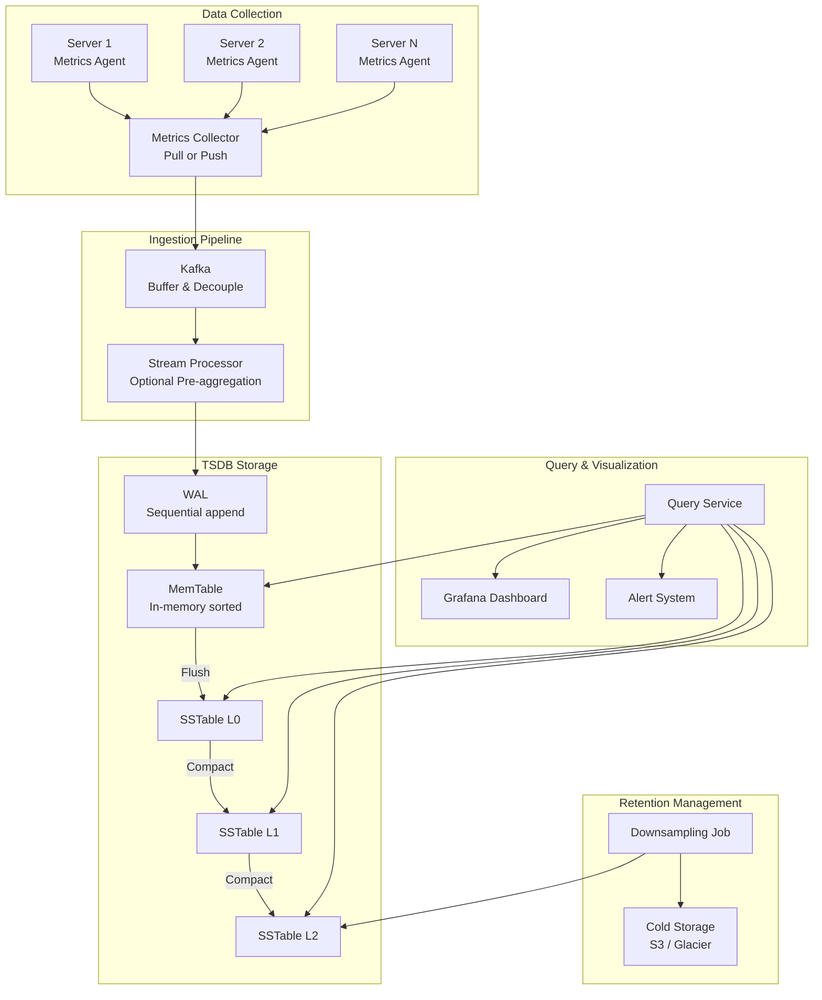

# Time-Series Databases

## 1. Overview

A time-series database (TSDB) is a storage engine purpose-built for data that arrives as a continuous stream of timestamped measurements --- CPU utilization, request latency, temperature readings, stock prices, IoT sensor data. Unlike general-purpose databases that handle arbitrary read/write patterns, TSDBs are optimized for a specific access profile: **constant heavy writes with time-ordered, append-mostly data and time-range-based reads**.

Standard relational databases fail at high-frequency telemetry because they are designed around random I/O and B-tree updates. A TSDB like InfluxDB, Prometheus, or TimescaleDB uses LSM trees, aggressive compression (delta encoding, Gorilla compression), and automatic downsampling to sustain hundreds of thousands of writes per second while keeping storage costs manageable over retention periods of months or years.

## 2. Why It Matters

Modern infrastructure generates staggering volumes of time-series data. Consider a monitoring system for a company with 1,000 server pools, 100 machines per pool, and 100 metrics per machine: that is **10 million distinct time series**, each producing a data point every 10 seconds --- approximately **1 million writes per second**.

A general-purpose relational database:
- Cannot sustain this write rate due to B-tree random I/O overhead.
- Wastes storage by storing full 64-bit timestamps and values for every data point.
- Lacks native time-windowed aggregation functions (moving average, rate of change).
- Has no built-in downsampling or retention policies.

A TSDB solves all of these problems by design, often using 10x fewer servers for the same workload.

## 3. Core Concepts

- **Time series**: A named sequence of `(timestamp, value)` pairs, optionally labeled with key-value tags (e.g., `host:web-01, region:us-east`).
- **Labels/tags**: Metadata attached to a time series for filtering and grouping. Must be low cardinality (few distinct values per label) to avoid index explosion.
- **LSM tree**: Log-Structured Merge Tree --- the storage engine powering most TSDBs. Converts random writes into sequential I/O.
- **WAL (Write-Ahead Log)**: Append-only durability log that persists writes before they reach the MemTable.
- **MemTable**: In-memory sorted buffer that receives writes. Flushed to disk as an SSTable when full.
- **SSTable**: Sorted String Table --- an immutable, sorted file on disk created from a flushed MemTable.
- **Compaction**: Background process that merges SSTables, discards deleted/overwritten entries, and reduces read amplification.
- **Delta encoding**: Storing the difference between consecutive values instead of absolute values.
- **Gorilla compression**: Facebook's technique for compressing time-series data using delta-of-deltas for timestamps and XOR encoding for values.
- **Downsampling**: Reducing data resolution over time (e.g., 10-second intervals become 1-minute averages after 7 days, then 1-hour averages after 30 days).

## 4. How It Works

### Write Path (LSM Tree)

1. Data point arrives: `cpu.load host=web-01 1613707265 0.29`
2. Written to the WAL on disk (sequential I/O, fast).
3. Inserted into the MemTable (in-memory balanced tree, sorted by timestamp).
4. When MemTable reaches threshold size, it is flushed to disk as an immutable SSTable.
5. Background compaction merges SSTables periodically.

This design avoids random disk seeks entirely. Physical disks handle 100-200 random seeks per second but can sustain hundreds of megabytes per second of sequential writes. By converting random writes to sequential writes, LSM trees unlock write throughput that B-trees cannot match.

### Compression: Gorilla Paper

Facebook's Gorilla paper introduced two compression techniques that reduce time-series storage by 10-12x:

**Timestamp compression (Delta-of-Deltas):**
- Consecutive timestamps typically differ by a fixed interval (e.g., 10 seconds).
- Store the first timestamp as a full 64-bit value.
- For subsequent timestamps, store the delta from the previous timestamp.
- For regular intervals, the delta-of-deltas is often 0, which can be encoded in a single bit.

Example:
```
Timestamps: 1610087371, 1610087381, 1610087391, 1610087400, 1610087411
Deltas:     -,          10,          10,          9,           11
Delta-of-deltas: -,     -,           0,          -1,           2
```
A 64-bit timestamp (8 bytes) reduces to 1-4 bits when the delta-of-deltas is small.

**Value compression (XOR encoding):**
- Consecutive metric values (e.g., CPU load) tend to be similar.
- XOR the current value with the previous value.
- If the XOR result is 0 (identical values), store a single 0 bit.
- If not, store only the meaningful bits of the XOR result.

Result: InfluxDB with 8 cores and 32 GB RAM can sustain over 250,000 writes per second.

### Downsampling

To manage the economic cost of storing years of high-frequency data:

| Retention Window | Resolution | Storage Impact |
|---|---|---|
| 0 - 7 days | Raw (10-second intervals) | Full fidelity |
| 7 - 30 days | 1-minute averages | ~6x reduction |
| 30 days - 1 year | 1-hour averages | ~360x reduction |

Downsampling is typically a batch job that aggregates raw data points (min, max, avg, count) and writes the result to a lower-resolution table. The raw data is then deleted or moved to cold storage.

### Read Path

1. Query specifies a time range and optional label filters.
2. TSDB checks the MemTable for recent data.
3. For older data, it identifies relevant SSTables using time-range metadata and Bloom filters.
4. Results are merged, decompressed, and aggregated (avg, sum, percentile).
5. For visualization, the query engine returns data at the appropriate resolution.

### Cold Storage and Data Tiering

Time-series data has a strong temporal access pattern: according to Facebook's Gorilla paper, 85% of queries target data from the last 26 hours. This enables a multi-tier storage strategy:

| Tier | Storage Medium | Access Latency | Data Age | Use Case |
|---|---|---|---|---|
| **Hot** | In-memory (RAM) | Microseconds | Last 24-48 hours | Real-time dashboards, active alerts |
| **Warm** | Local SSD | Milliseconds | Last 7-30 days | Recent troubleshooting, weekly reports |
| **Cold** | Network-attached / S3 | Seconds | 30 days - 1 year | Compliance, capacity planning, audits |
| **Archive** | Glacier / Deep Archive | Minutes-hours | > 1 year | Regulatory retention |

Efficient tiering requires the TSDB to automatically migrate data between tiers based on age, without requiring manual intervention. Most production TSDBs support configurable retention policies that automate this migration.

### Custom Query Languages

Most TSDBs have purpose-built query languages optimized for time-series operations. Standard SQL is poorly suited because computing time-windowed aggregations, rates of change, and moving averages requires complex nested subqueries.

**PromQL (Prometheus)**:
```promql
# Average CPU usage over 5 minutes, per host
avg by (host) (rate(cpu_usage_seconds_total[5m]))

# Alert if error rate exceeds 5% for 10 minutes
sum(rate(http_requests_total{status=~"5.."}[5m]))
/ sum(rate(http_requests_total[5m])) > 0.05
```

**Flux (InfluxDB)**:
```flux
from(bucket: "telegraf")
  |> range(start: -1h)
  |> filter(fn: (r) => r._measurement == "cpu")
  |> aggregateWindow(every: 1m, fn: mean)
```

These domain-specific languages are dramatically more concise than the equivalent SQL. The PromQL example above would require 20+ lines of SQL with window functions, subqueries, and explicit join logic.

## 5. Architecture / Flow



## 6. Types / Variants

| TSDB | Architecture | Compression | Query Language | Best For |
|---|---|---|---|---|
| **InfluxDB** | LSM-based (TSI + TSM engine) | Gorilla-style delta encoding | Flux / InfluxQL | General metrics, IoT |
| **Prometheus** | Local TSDB with custom blocks | Gorilla compression | PromQL | Kubernetes monitoring |
| **TimescaleDB** | PostgreSQL extension (hypertables) | Columnar compression | Standard SQL | Teams needing SQL compatibility |
| **OpenTSDB** | HBase-backed | HBase compression | HTTP API | Hadoop-ecosystem shops |
| **Amazon Timestream** | Serverless, managed | Proprietary | SQL-like | AWS-native, zero-ops |
| **Facebook Gorilla** | In-memory TSDB | Gorilla paper compression | Internal API | Ultra-low-latency reads (85% queries < 26 hours) |

### Pull vs Push Collection Models

| Dimension | Pull (Prometheus) | Push (CloudWatch, Graphite) |
|---|---|---|
| **Debugging** | `/metrics` endpoint viewable directly | Cannot inspect agent-side |
| **Health detection** | Missing scrape = down server | Missing push could be network issue |
| **Firewall friendliness** | Requires scraper access to all endpoints | Push to load-balanced collector |
| **Short-lived jobs** | May miss short-lived processes | Agent pushes before exit |

### Scaling the Ingestion Pipeline

At scale, the TSDB alone cannot handle the ingestion rate. A buffering layer is essential:

1. **Metrics agents** on each host collect and locally aggregate metrics (e.g., counters summed per minute).
2. Agents push metrics to a **Kafka cluster** organized by metric name partitions.
3. **Stream processors** (Flink, Kafka Streams) optionally pre-aggregate before writing to the TSDB.
4. The TSDB ingests from Kafka consumers.

This architecture provides:
- **Durability**: If the TSDB is temporarily unavailable, Kafka retains the data.
- **Decoupling**: Collection, processing, and storage scale independently.
- **Throughput**: Kafka partitions allow parallel ingestion by multiple TSDB instances.

Facebook's Gorilla paper describes an alternative: designing the TSDB itself to remain highly available for writes, even during partial network failures, eliminating the need for an intermediate queue. This is viable for in-house systems but adds significant engineering complexity.

### Alerting on Time-Series Data

The alerting system evaluates rules against the TSDB at regular intervals:

1. Alert rules are defined as config files (typically YAML):
   ```yaml
   - alert: HighErrorRate
     expr: sum(rate(http_errors_total[5m])) / sum(rate(http_requests_total[5m])) > 0.05
     for: 10m
     labels:
       severity: critical
   ```
2. The alert manager queries the TSDB at each evaluation interval.
3. If a rule fires for the specified duration (`for: 10m`), an alert is generated.
4. The alert manager deduplicates, groups, and routes alerts to channels (PagerDuty, Slack, email).

Key design considerations:
- **Deduplication**: Multiple replicas of the alert manager must not send duplicate notifications.
- **Grouping**: Related alerts (e.g., all instances of the same service) are batched into a single notification.
- **Silencing**: During planned maintenance, alerts can be temporarily suppressed.
- **Escalation**: If an alert is not acknowledged within N minutes, escalate to the on-call manager.

## 7. Use Cases

- **Infrastructure monitoring (Prometheus + Grafana)**: CPU, memory, disk, network metrics scraped every 15 seconds from thousands of Kubernetes pods. PromQL powers dashboards and alerting rules.
- **Facebook Gorilla**: In-memory TSDB where 85% of queries hit data from the last 26 hours. Delta-of-deltas compression reduces storage by 12x, enabling the entire hot dataset to fit in RAM.
- **Twitter MetricsDB**: Custom time-series database for internal infrastructure monitoring, handling millions of time series with sub-second query latency.
- **IoT telemetry (InfluxDB)**: Smart factory sensors producing temperature, pressure, and vibration readings at 10-second intervals across 10,000 devices.
- **Financial market data**: Tick-by-tick stock prices requiring microsecond-precision timestamps and windowed aggregations for real-time trading dashboards.

## 8. Tradeoffs

| Advantage | Disadvantage |
|---|---|
| 10-100x higher write throughput than RDBMS | Not suitable for general-purpose OLTP workloads |
| 10-12x compression via Gorilla/delta encoding | Custom query languages (PromQL, Flux) have a learning curve |
| Built-in downsampling and retention policies | Loss of precision when data is downsampled |
| Optimized for time-range queries | Point lookups by non-time dimensions are slower |
| Label-based indexing for multi-dimensional queries | High-cardinality labels (e.g., user_id) destroy index performance |

## 9. Common Pitfalls

- **Using high-cardinality labels**: A label with millions of distinct values (like `request_id`) creates millions of time series, overwhelming the TSDB's inverted index. Labels should have bounded, low cardinality.
- **Not setting retention policies**: Without retention limits, time-series data grows indefinitely. A system producing 1M points/sec generates ~86 billion points/day.
- **Ignoring compaction tuning**: LSM tree compaction can cause latency spikes during heavy write periods. Monitor compaction backlog and tune concurrency settings.
- **Storing event logs in a TSDB**: TSDBs are optimized for numeric metrics, not unstructured text logs. Use the ELK stack for logs and TSDBs for metrics.
- **Skipping the Kafka buffer**: Without an intermediate queue, a TSDB outage causes data loss. Kafka provides durable buffering between collectors and the TSDB.

## 10. Real-World Examples

- **Facebook**: Built Gorilla, an in-memory TSDB that stores 26 hours of metrics data entirely in RAM using delta-of-deltas and XOR compression. Published the Gorilla paper (VLDB 2015).
- **Netflix**: Uses Atlas (custom TSDB) for operational monitoring, ingesting millions of time series from its global infrastructure.
- **Uber**: Uses M3DB (open-source TSDB built on Gorilla principles) for monitoring its ride-hailing platform at massive scale.
- **Cloudflare**: Uses ClickHouse (columnar database with time-series optimizations) for DNS analytics, processing millions of queries per second.

## 11. Related Concepts

- [Database Indexing](./database-indexing.md) --- LSM trees and B-trees as storage engine foundations
- [Database Replication](./database-replication.md) --- WAL for durability in the TSDB write path
- [Cassandra](./cassandra.md) --- shared LSM tree architecture and compaction strategies
- [Monitoring](../observability/monitoring.md) --- Prometheus/Grafana as the observability stack

## 12. Source Traceability

- source/youtube-video-reports/6.md (LSM trees, append-only storage, Gorilla compression, delta encoding, downsampling, WAL, MemTable)
- source/youtube-video-reports/7.md (LSM tree write path, SSTables, compaction)
- source/extracted/alex-xu-vol2/ch06-metrics-monitoring-and-alerting-system.md (TSDB design, InfluxDB benchmarks, Gorilla paper, downsampling, pull vs push, Kafka pipeline)
